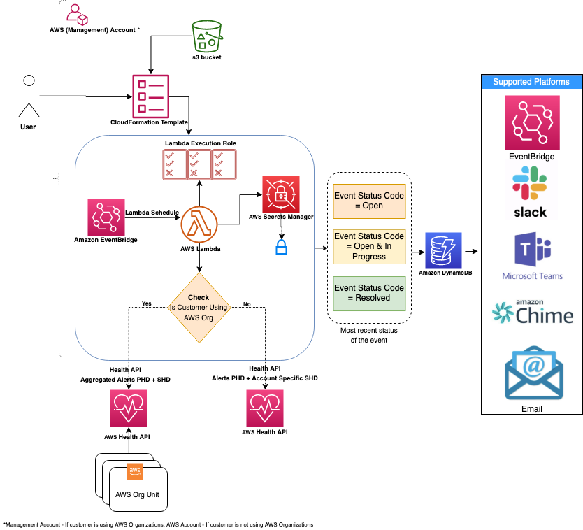

## 1.0 KPI-களை ("Golden Signals") புரிந்துகொள்ளுதல்
நிறுவனங்கள் வணிகம் மற்றும் செயல்பாடுகளின் ஆரோக்கியம் அல்லது ஆபத்து பற்றிய நுண்ணறிவை வழங்கும் முக்கிய செயல்திறன் குறிகாட்டிகளை (KPIs) அதாவது 'Golden Signals'-ஐ பயன்படுத்துகின்றன. நிறுவனத்தின் வெவ்வேறு பகுதிகள் அந்தந்த விளைவுகளை அளவிடுவதற்கு தனித்துவமான KPI-களைக் கொண்டிருக்கும். உதாரணமாக, ஒரு eCommerce பயன்பாட்டின் தயாரிப்பு குழு வண்டி ஆர்டர்களை வெற்றிகரமாக செயலாக்கும் திறனை அதன் KPI-யாக கண்காணிக்கும். ஒரு on-call செயல்பாட்டுக் குழு ஒரு சம்பவத்தைக் கண்டறிவதற்கான சராசரி நேரத்தை (MTTD) தங்கள் KPI-யாக அளவிடும். நிதிக் குழுவிற்கு பட்ஜெட்டிற்கு உட்பட்ட ரிசோர்ஸ் செலவு ஒரு முக்கிய KPI ஆகும்.

Service Level Indicators (SLIs), Service Level Objectives (SLOs) மற்றும் Service Level Agreements (SLAs) சேவை நம்பகத்தன்மை மேலாண்மையின் அவசிய கூறுகளாகும். இந்த வழிகாட்டி Amazon CloudWatch மற்றும் அதன் அம்சங்களைப் பயன்படுத்தி SLIs, SLOs மற்றும் SLAs-ஐ கணக்கிடுவதற்கும் கண்காணிப்பதற்கும் சிறந்த நடைமுறைகளை தெளிவான மற்றும் சுருக்கமான உதாரணங்களுடன் விவரிக்கிறது.

- **SLI (Service Level Indicator):** சேவையின் செயல்திறனின் அளவீட்டு அளவு.
- **SLO (Service Level Objective):** SLI-க்கான இலக்கு மதிப்பு, விரும்பிய செயல்திறன் நிலையைக் குறிக்கிறது.
- **SLA (Service Level Agreement):** எதிர்பார்க்கப்படும் சேவை நிலையைக் குறிப்பிடும் சேவை வழங்குநருக்கும் அதன் பயனர்களுக்கும் இடையிலான ஒப்பந்தம்.

பொதுவான SLI-களின் உதாரணங்கள்:

- கிடைக்கும்தன்மை: சேவை செயல்பாட்டில் இருக்கும் நேர சதவீதம்
- Latency: கோரிக்கையை நிறைவேற்ற எடுக்கும் நேரம்
- பிழை விகிதம்: தோல்வியுற்ற கோரிக்கைகளின் சதவீதம்

## 2.0 வாடிக்கையாளர் மற்றும் பங்குதாரர் தேவைகளைக் கண்டறிதல்

1. மேல் கேள்வியில் தொடங்கவும்: "கொடுக்கப்பட்ட பணிச்சுமைக்கான (எ.கா. கட்டண போர்டல், eCommerce ஆர்டர் வைப்பு, பயனர் பதிவு, தரவு அறிக்கைகள், ஆதரவு போர்டல் போன்றவை) நோக்கத்தில் உள்ள வணிக மதிப்பு அல்லது வணிக சிக்கல் என்ன"
2. வணிக மதிப்பை User-Experience (UX); Business-Experience (BX); Operational-Experience (OpsX); Security-Experience(SecX); Developer-Experience (DevX) போன்ற வகைகளாக பிரிக்கவும்
3. ஒவ்வொரு வகைக்கும் core signals அதாவது "Golden Signals"-ஐ பெறவும்; UX & BX தொடர்பான முதன்மை signals பொதுவாக வணிக மெட்ரிக்குகளை உருவாக்கும்

| ID	| Initials	| Customer	| Business Needs	| Measurements	| Information Sources	| What does good look like?	| Alerts	| Dashboards	| Reports	|
| ---	| ---	| ---	| ---	| ---	| ---	| ---	| ---	| ---	| --- |		
|M1	|Example	|External End User	|User Experience	|Response time (Page latency)	|Logs / Traces	|< 5s for 99.9%	|No	|Yes	|No	|
|M2	|Example	|Business	|Availability	|Successful RPS (Requests per second)	|Health Check	|>85% in 5 min window	|Yes	|Yes	|Yes	|
|M3	|Example	|Security	|Compliance	|Critical non-compliant resources	|Config data	|\<10 under 15 days	|No	|Yes	|Yes	|
|M4	|Example	|Developers	|Agility	|Deployment time	|Deployment logs	|Always < 10 min	|Yes	|No	|Yes	|
|M5	|Example	|Operators	|Capacity	|Queue Depth	|App logs/metrics	|Always < 10	|Yes	|Yes	|Yes	|

### 2.1 Golden Signals

|வகை	|Signal	|குறிப்புகள்	|References	|
|---	|---	|---	|---	|
|UX	|Performance (Latency)	|டெம்ப்ளேட்டில் M1 பார்க்கவும்	|Whitepaper: [Availability and Beyond (Measuring latency)](https://docs.aws.amazon.com/whitepapers/latest/availability-and-beyond-improving-resilience/measuring-availability.html#latency)	|
|BX	|Availability	|டெம்ப்ளேட்டில் M2 பார்க்கவும்	|Whitepaper: [Availability and Beyond (Measuring availability)](https://docs.aws.amazon.com/whitepapers/latest/availability-and-beyond-improving-resilience/measuring-availability.html)	|
|BX	|Business Continuity Plan (BCP)	|வரையறுக்கப்பட்ட RTO/RPO-க்கு எதிரான Amazon Resilience Hub (ARH) resilience score	|Docs: [ARH user guide (Understanding resilience scores)](https://docs.aws.amazon.com/resilience-hub/latest/userguide/resil-score.html)	|
|SecX	|(Non)-Compliance	|டெம்ப்ளேட்டில் M3 பார்க்கவும்	|Docs: [AWS Control Tower user guide (Compliance status in the console)](https://docs.aws.amazon.com/controltower/latest/userguide/compliance-statuses.html)	|
|DevX	|Agility	|டெம்ப்ளேட்டில் M4 பார்க்கவும்	|Docs: [DevOps Monitoring Dashboard on AWS (DevOps metrics list)](https://docs.aws.amazon.com/solutions/latest/devops-monitoring-dashboard-on-aws/devops-metrics-list.html)	|
|OpsX	|Capacity (Quotas)	|டெம்ப்ளேட்டில் M5 பார்க்கவும்	|Docs: [Amazon CloudWatch user guide (Visualizing your service quotas and setting alarms)](https://docs.aws.amazon.com/AmazonCloudWatch/latest/monitoring/CloudWatch-Quotas-Visualize-Alarms.html)	|
|OpsX	|Budget Anomalies	|	|Docs:<br/> 1. [AWS Billing and Cost Management (AWS Cost Anomaly Detection)](https://docs.aws.amazon.com/cost-management/latest/userguide/getting-started-ad.html) <br/> 2. [AWS Budgets](https://aws.amazon.com/aws-cost-management/aws-budgets/)	|


## 3.0 உயர் நிலை வழிகாட்டுதல் 'TLG'

### 3.1 TLG பொது

1. வணிக, இணக்கத்தன்மை மற்றும் நிர்வாகத் தேவைகளை செம்மைப்படுத்தி அவை வணிக தேவைகளை துல்லியமாக பிரதிபலிக்கின்றன என்பதை உறுதிப்படுத்த வணிகம், architecture மற்றும் பாதுகாப்பு குழுக்களுடன் இணைந்து பணியாற்றவும். இது [recovery-time மற்றும் recovery-point இலக்குகளை நிறுவுவதை](https://aws.amazon.com/blogs/mt/establishing-rpo-and-rto-targets-for-cloud-applications/) (RTOs, RPOs) உள்ளடக்கியது.

2. பல்வேறு வணிக செயல்பாட்டு விளைவுகளுடன் ஒத்துப்போகும் நோக்கத்திற்கான schema-வுடன் பயனுள்ள [tagging strategy](https://docs.aws.amazon.com/whitepapers/latest/tagging-best-practices/defining-and-publishing-a-tagging-schema.html)-ஐ உருவாக்கவும்.

3. எங்கு சாத்தியமோ அங்கு அலாரங்களுக்கான dynamic thresholds-ஐ (குறிப்பாக baseline KPI-கள் இல்லாத மெட்ரிக்குகளுக்கு) [CloudWatch anomaly detection](https://docs.aws.amazon.com/AmazonCloudWatch/latest/monitoring/CloudWatch_Anomaly_Detection.html)-ஐ பயன்படுத்தி பயன்படுத்தவும்.

4. (குறிப்பு: AWS Business support அல்லது அதற்கு மேல் தேவை) உங்கள் ரிசோர்ஸ்கள் தொடர்பான ஆர்வமுள்ள நிகழ்வுகளை Personal Health Dashboard-ல் AWS Health சேவையைப் பயன்படுத்தி AWS வெளியிடுகிறது. முன்கூட்டிய மற்றும் நிகழ்நேர எச்சரிக்கைகளை உள்ளிட [AWS Health Aware (AHA)](https://aws.amazon.com/blogs/mt/aws-health-aware-customize-aws-health-alerts-for-organizational-and-personal-aws-accounts/) framework-ஐ பயன்படுத்தவும்.


5. ரிசோர்ஸ்களுக்கான சிறந்த monitors-ஐ அமைக்கவும் பயன்பாடுகளில் சிக்கல்களின் அறிகுறிகளுக்கு தரவை தொடர்ந்து பகுப்பாய்வு செய்யவும் Amazon CloudWatch [Application Insights](https://docs.aws.amazon.com/AmazonCloudWatch/latest/monitoring/cloudwatch-application-insights.html)-ஐ பயன்படுத்தவும்.


6. வரையறுக்கப்பட்ட RTOs மற்றும் RPOs-க்கு எதிராக பயன்பாடுகளை பகுப்பாய்வு செய்ய [AWS Resilience Hub](https://aws.amazon.com/resilience-hub/)-ஐ பயன்படுத்தவும்.

7. மேலும் விவரங்களுக்கு [AWS Observability Best Practices](https://aws-observability.github.io/observability-best-practices/) வழிகாட்டுதலின் பிற பிரிவுகளை பார்க்கவும்.


### 3.2 Domain அடிப்படையிலான TLG (வணிக மெட்ரிக்குகளில் முக்கியத்துவம் அதாவது UX, BX)

CloudWatch (CW) போன்ற சேவைகளைப் பயன்படுத்தி கீழே பொருத்தமான உதாரணங்கள் வழங்கப்பட்டுள்ளன (Ref: [CloudWatch metrics documentation](https://docs.aws.amazon.com/AmazonCloudWatch/latest/monitoring/aws-services-cloudwatch-metrics.html) வெளியிடும் AWS சேவைகள்)

#### 3.2.1 Canaries (Synthetic transactions என்றும் அழைக்கப்படும்) மற்றும் Real-User Monitoring (RUM)

* TLG: கிளையன்ட்/வாடிக்கையாளர் அனுபவத்தைப் புரிந்துகொள்ள எளிதான மற்றும் மிகவும் பயனுள்ள வழிகளில் ஒன்று Canaries (Synthetic transactions) மூலம் வாடிக்கையாளர் traffic-ஐ உருவகப்படுத்துவது.

|AWS சேவை	|அம்சம்	|அளவீடு	|Metric	|உதாரணம்	|குறிப்புகள்	|
|---	|---	|---	|---	|---	|---	|
|CW	|Synthetics	|கிடைக்கும்தன்மை	|**SuccessPercent**	|(Ex. SuccessPercent > 90 or CW Anomaly Detection for 1min Period)	|	|
|CW	|Synthetics	|கிடைக்கும்தன்மை	|VisualMonitoringSuccessPercent	|(Ex. VisualMonitoringSuccessPercent > 90 for 5 min Period)	|வாடிக்கையாளர் canary முன்-தீர்மானிக்கப்பட்ட UI screenshot-உடன் பொருந்த வேண்டும் என எதிர்பார்த்தால்	|
|CW	|RUM	|Response Time	|Apdex Score	|(Ex. Apdex score: NavigationFrustratedCount < 'N' expected value)	|	|


#### 3.2.2 API Frontend

|AWS சேவை	|அம்சம்	|அளவீடு	|Metric	|உதாரணம்	|குறிப்புகள்	|
|---	|---	|---	|---	|---	|---	|
|CloudFront	|	|கிடைக்கும்தன்மை	|Total error rate	|(Ex. [Total error rate] < 10 or CW Anomaly Detection for 1min Period)	|error rate அளவீடாக கிடைக்கும்தன்மை	|
|Route53	|Health checks	|(Cross region) கிடைக்கும்தன்மை	|HealthCheckPercentageHealthy	|(Ex. [Minimum of HealthCheckPercentageHealthy] > 90)	|	|
|API Gateway	|	|கிடைக்கும்தன்மை	|Count	|(Ex. [(4XXError + 5XXError) / Count) * 100] < 10)	|"கைவிடப்பட்ட" கோரிக்கைகளின் அளவீடாக கிடைக்கும்தன்மை	|
|API Gateway	|	|Latency	|Latency	|(Ex. p99 Latency < 1 sec)	|p99 p90 போன்ற குறைந்த percentile-ஐ விட அதிக tolerance கொண்டிருக்கும்	|
|Application Load Balancer (ALB)	|	|கிடைக்கும்தன்மை	|RejectedConnectionCount	|(Ex.[RejectedConnectionCount/(RejectedConnectionCount + RequestCount) * 100] < 10)	|நிராகரிக்கப்பட்ட கோரிக்கைகளின் அளவீடாக கிடைக்கும்தன்மை	|
|Application Load Balancer (ALB)	|	|Latency	|TargetResponseTime	|(Ex. p99 TargetResponseTime < 1 sec)	|	|


#### 3.2.3 Serverless

|AWS சேவை	|அம்சம்	|அளவீடு	|Metric	|உதாரணம்	|குறிப்புகள்	|
|---	|---	|---	|---	|---	|---	|
|S3	|Request metrics	|கிடைக்கும்தன்மை	|AllRequests	|(Ex. [(4XXErrors + 5XXErrors) / AllRequests) * 100] < 10)	|"கைவிடப்பட்ட" கோரிக்கைகளின் அளவீடாக கிடைக்கும்தன்மை	|
|DynamoDB (DDB)	|	|கிடைக்கும்தன்மை	|ThrottledRequests	|(Ex. [ThrottledRequests] < 100)	|"throttled" கோரிக்கைகளின் அளவீடாக கிடைக்கும்தன்மை	|
|Step Functions	|	|கிடைக்கும்தன்மை	|ExecutionsFailed	|(Ex. ExecutionsFailed = 0)	|Step functions-ஐ தினசரி செயல்பாடாக நிறைவேற்ற வேண்டும் என கருதுகிறது	|


#### 3.2.4 Compute மற்றும் Containers

|AWS சேவை	|அம்சம்	|அளவீடு	|Metric	|உதாரணம்	|குறிப்புகள்	|
|---	|---	|---	|---	|---	|---	|
|EKS	|Prometheus metrics	|கிடைக்கும்தன்மை	|APIServer Request Success Ratio	|Prometheus metric	|[EKS control plane metrics கண்காணிப்பதற்கான சிறந்த நடைமுறைகள்](https://aws.github.io/aws-eks-best-practices/reliability/docs/controlplane/#monitor-control-plane-metrics) பார்க்கவும்	|
|ECS	|	|கிடைக்கும்தன்மை	|Service RUNNING task count	|Service RUNNING task count	|ECS CW metrics [documentation](https://docs.aws.amazon.com/AmazonECS/latest/developerguide/cloudwatch-metrics.html#cw_running_task_count) பார்க்கவும்	|


#### 3.2.5 Databases (RDS)

|AWS சேவை	|அம்சம்	|அளவீடு	|Metric	|உதாரணம்	|குறிப்புகள்	|
|---	|---	|---	|---	|---	|---	|
|RDS Aurora	|Performance Insights (PI)	|கிடைக்கும்தன்மை	|Average active sessions	|(Ex. CW Anomaly Detection for 1min Period)	|RDS Aurora CW PI [documentation](https://docs.aws.amazon.com/AmazonRDS/latest/AuroraUserGuide/USER_PerfInsights.Overview.ActiveSessions.html#USER_PerfInsights.Overview.ActiveSessions.AAS) பார்க்கவும்	|
|RDS Aurora	|	|Disaster Recovery (DR)	|AuroraGlobalDBRPOLag	|(Ex. AuroraGlobalDBRPOLag < 30000 ms for 1min Period)	|	|


## 4.0 SLIs, SLOs மற்றும் SLAs கணக்கிடுவதற்கு Amazon CloudWatch மற்றும் Metric Math பயன்படுத்துதல்

### 4.1 Amazon CloudWatch மற்றும் Metric Math

Amazon CloudWatch AWS ரிசோர்ஸ்களுக்கான கண்காணிப்பு மற்றும் Observability சேவைகளை வழங்குகிறது. Metric Math CloudWatch metric தரவைப் பயன்படுத்தி கணக்கீடுகளைச் செய்ய உதவுகிறது, இது SLIs, SLOs மற்றும் SLAs கணக்கிடுவதற்கான சிறந்த கருவியாக அமைகிறது.

#### 4.1.1 Detailed Monitoring-ஐ இயக்குதல்

மிகத் துல்லியமான SLI கணக்கீடுகளுக்கு 1-நிமிட தரவு granularity பெற உங்கள் AWS ரிசோர்ஸ்களுக்கு Detailed Monitoring-ஐ இயக்கவும்.

### 4.2 Metric Math-உடன் SLIs கணக்கிடுதல்

#### 4.2.1 கிடைக்கும்தன்மை

கிடைக்கும்தன்மையை கணக்கிட, வெற்றிகரமான கோரிக்கைகளின் எண்ணிக்கையை மொத்த கோரிக்கைகளின் எண்ணிக்கையால் வகுக்கவும்:

```
availability = 100 * (successful_requests / total_requests)
```

#### 4.2.2 Latency

சராசரி latency-ஐ கணக்கிட, CloudWatch வழங்கும் `SampleCount` மற்றும் `Sum` statistics-ஐ பயன்படுத்தவும்:

```
average_latency = Sum / SampleCount
```

#### 4.2.3 பிழை விகிதம்

பிழை விகிதத்தை கணக்கிட, தோல்வியுற்ற கோரிக்கைகளின் எண்ணிக்கையை மொத்த கோரிக்கைகளின் எண்ணிக்கையால் வகுக்கவும்:

```
error_rate = 100 * (failed_requests / total_requests)
```

### 4.4 SLOs-ஐ வரையறுத்தல் மற்றும் கண்காணித்தல்

#### 4.4.1 யதார்த்தமான இலக்குகளை அமைத்தல்

பயனர் எதிர்பார்ப்புகள் மற்றும் வரலாற்று செயல்திறன் தரவின் அடிப்படையில் SLO இலக்குகளை வரையறுக்கவும்.

#### 4.4.2 CloudWatch-உடன் SLOs கண்காணித்தல்

உங்கள் SLIs-ஐ கண்காணிக்கவும் SLO இலக்குகளை அணுகும்போது அல்லது மீறும்போது உங்களுக்கு அறிவிக்கவும் CloudWatch Alarms-ஐ உருவாக்கவும்.

### 4.5 SLAs-ஐ வரையறுத்தல் மற்றும் அளவிடுதல்

#### 4.5.1 யதார்த்தமான இலக்குகளை அமைத்தல்

வரலாற்று செயல்திறன் தரவு மற்றும் பயனர் எதிர்பார்ப்புகளின் அடிப்படையில் SLA இலக்குகளை வரையறுக்கவும்.

### 4.6 குறிப்பிட்ட காலத்தில் SLA அல்லது SLO செயல்திறனை அளவிடுதல்

ஒரு நாள்காட்டி மாதம் போன்ற குறிப்பிட்ட காலத்தில் SLA அல்லது SLO செயல்திறனை அளவிட, தனிப்பயன் நேர வரம்புகளுடன் CloudWatch metric தரவைப் பயன்படுத்தவும்.

## 5.0 சுருக்கம்

Key Performance Indicators (KPIs) அதாவது 'Golden Signals' வணிகம் மற்றும் பங்குதாரர் தேவைகளுடன் ஒத்துப்போக வேண்டும். Amazon CloudWatch மற்றும் Metric Math-ஐ பயன்படுத்தி SLIs, SLOs மற்றும் SLAs கணக்கிடுவது சேவை நம்பகத்தன்மையை நிர்வகிக்க முக்கியமானது. இந்த வழிகாட்டியில் விவரிக்கப்பட்ட சிறந்த நடைமுறைகளைப் பின்பற்றி உங்கள் AWS ரிசோர்ஸ்களின் செயல்திறனை திறம்பட கண்காணிக்கவும் பராமரிக்கவும்.
