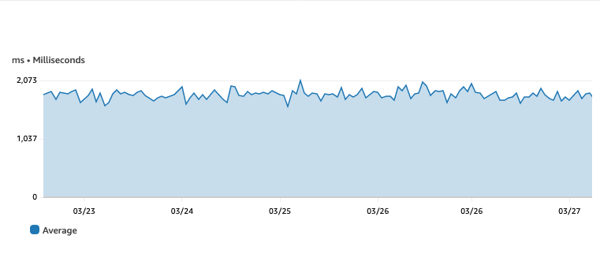

# பெர்சென்டைல்கள் முக்கியமானவை

பெர்சென்டைல்கள் கண்காணிப்பு மற்றும் அறிக்கையிடலில் முக்கியமானவை, ஏனெனில் சராசரிகளை மட்டும் நம்புவதுடன் ஒப்பிடும்போது தரவு விநியோகத்தின் மிகவும் விரிவான மற்றும் துல்லியமான பார்வையை வழங்குகின்றன. சராசரி சில நேரங்களில் செயல்திறன் மற்றும் பயனர் அனுபவத்தை கணிசமாக பாதிக்கக்கூடிய outliers அல்லது தரவில் மாறுபாடுகள் போன்ற முக்கியமான தகவல்களை மறைக்கலாம். மறுபுறம், பெர்சென்டைல்கள் இந்த மறைக்கப்பட்ட விவரங்களை வெளிப்படுத்தலாம், தரவு எவ்வாறு விநியோகிக்கப்படுகிறது என்பதைப் பற்றிய சிறந்த புரிதலை வழங்கலாம்.

[Amazon CloudWatch](https://aws.amazon.com/cloudwatch/)-ல், உங்கள் பயன்பாடுகள் மற்றும் உள்கட்டமைப்பு முழுவதும் response times, latency மற்றும் error rates போன்ற பல்வேறு மெட்ரிக்குகளை கண்காணிக்கவும் அறிக்கையிடவும் பெர்சென்டைல்களைப் பயன்படுத்தலாம். பெர்சென்டைல்களில் அலாரங்களை அமைப்பதன் மூலம், குறிப்பிட்ட பெர்சென்டைல் மதிப்புகள் வரம்புகளை மீறும்போது உங்களுக்கு அறிவிக்கப்படும், இது அதிக வாடிக்கையாளர்களை பாதிக்கும் முன் நடவடிக்கை எடுக்க உதவுகிறது.

[CloudWatch-ல் பெர்சென்டைல்களைப்](https://docs.aws.amazon.com/AmazonCloudWatch/latest/monitoring/cloudwatch_concepts.html#Percentiles) பயன்படுத்த, CloudWatch console-ல் **All metrics**-ல் உங்கள் மெட்ரிக்கை தேர்வு செய்து, ஏற்கனவே உள்ள மெட்ரிக்கைப் பயன்படுத்தி **statistic**-ஐ **p99** என அமைக்கவும், நீங்கள் விரும்பும் பெர்சென்டைல்-க்கு p-க்குப் பின் உள்ள மதிப்பை திருத்தலாம். பின்னர் பெர்சென்டைல் வரைபடங்களைப் பார்க்கலாம், [CloudWatch dashboards](https://docs.aws.amazon.com/AmazonCloudWatch/latest/monitoring/CloudWatch_Dashboards.html)-க்கு சேர்க்கலாம், இந்த மெட்ரிக்குகளில் அலாரங்களை அமைக்கலாம்.

கீழே உள்ள histogram [Amazon Managed Grafana](https://aws.amazon.com/grafana/)-ல் [CloudWatch RUM](https://docs.aws.amazon.com/AmazonCloudWatch/latest/monitoring/CloudWatch-RUM.html) லாக்குகளிலிருந்து [CloudWatch Logs Insights](https://docs.aws.amazon.com/AmazonCloudWatch/latest/logs/AnalyzingLogData.html) வினவலைப் பயன்படுத்தி உருவாக்கப்பட்டது. பயன்படுத்தப்பட்ட வினவல்:

```
fields @timestamp, event_details.duration
| filter event_type = "com.amazon.rum.performance_navigation_event"
| sort @timestamp desc
```

histogram பக்க ஏற்ற நேரத்தை மில்லிசெகண்டுகளில் plot செய்கிறது. இந்த பார்வையுடன், outliers-ஐ தெளிவாகக் காண முடியும். சராசரி பயன்படுத்தப்பட்டால் இந்த தரவு மறைக்கப்படுகிறது.


சராசரி மதிப்பைப் பயன்படுத்தி CloudWatch-ல் காட்டப்படும் அதே தரவு பக்கங்கள் இரண்டு வினாடிகளுக்குள் ஏற்றமாகிறது என்று குறிக்கிறது. மேலே உள்ள histogram-லிருந்து, பெரும்பாலான பக்கங்கள் உண்மையில் ஒரு வினாடிக்கும் குறைவாகவே எடுக்கின்றன, நமக்கு outliers உள்ளன என்பதை நீங்கள் பார்க்கலாம்.



பெர்சென்டைல் (p99) உடன் அதே தரவை மீண்டும் பயன்படுத்துவது ஒரு சிக்கல் இருப்பதைக் குறிக்கிறது, CloudWatch வரைபடம் இப்போது 99 சதவீத பக்க ஏற்றங்கள் 23 வினாடிகளுக்குள் நிகழ்கின்றன என்று காட்டுகிறது.


இதை எளிதாகக் காட்சிப்படுத்த, கீழே உள்ள வரைபடங்கள் சராசரி மதிப்பை 99வது பெர்சென்டைலுடன் ஒப்பிடுகின்றன. இந்த வழக்கில், இலக்கு பக்க ஏற்ற நேரம் இரண்டு வினாடிகள், மாற்று [CloudWatch statistics](https://docs.aws.amazon.com/AmazonCloudWatch/latest/monitoring/Statistics-definitions.html#Percentile-versus-Trimmed-Mean) மற்றும் [metric math](https://docs.aws.amazon.com/AmazonCloudWatch/latest/monitoring/using-metric-math.html) பயன்படுத்தி பிற கணக்கீடுகளைச் செய்ய முடியும். இந்த வழக்கில் Percentile rank (PR) **PR(:2000)** statistic-உடன் பயன்படுத்தப்படுகிறது, 92.7% பக்க ஏற்றங்கள் 2000ms இலக்குக்குள் நிகழ்கின்றன என்பதைக் காட்டுகிறது.


CloudWatch-ல் பெர்சென்டைல்களைப் பயன்படுத்துவது உங்கள் சிஸ்டத்தின் செயல்திறனில் ஆழமான நுண்ணறிவுகளைப் பெறவும், சிக்கல்களை முன்கூட்டியே கண்டறியவும், இல்லையெனில் மறைக்கப்படும் outliers-ஐ அடையாளம் கண்டு உங்கள் வாடிக்கையாளரின் அனுபவத்தை மேம்படுத்தவும் உதவும்.
