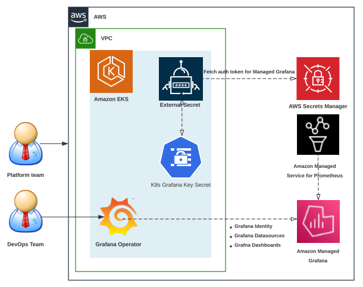

# Amazon Managed Grafana-உடன் GitOps மற்றும் Grafana Operator பயன்படுத்துதல்

## இந்த வழிகாட்டியை எவ்வாறு பயன்படுத்துவது

இந்த Observability சிறந்த நடைமுறைகள் வழிகாட்டி, உங்கள் Amazon EKS cluster-ல் Kubernetes operator-ஆக [grafana-operator](https://github.com/grafana-operator/grafana-operator)-ஐ பயன்படுத்தி Kubernetes native வழியில் Amazon Managed Grafana-ல் Grafana ரிசோர்ஸ்கள் மற்றும் Grafana dashboards-ன் lifecycle-ஐ உருவாக்கவும் நிர்வகிக்கவும் விரும்பும் developers மற்றும் architects-க்கானது.

## அறிமுகம்

வாடிக்கையாளர்கள் Grafana-ஐ open source analytics மற்றும் monitoring தீர்வுக்கான Observability platform-ஆக பயன்படுத்துகின்றனர். Amazon EKS-ல் workloads-ஐ இயக்கும் வாடிக்கையாளர்கள் workload gravity-க்கு தங்கள் கவனத்தை மாற்றவும், Cloud resources போன்ற external resources-ன் lifecycle-ஐ deploy மற்றும் நிர்வகிக்க Kubernetes-native controllers-ஐ நம்பவும் விரும்புகின்றனர்.

## Grafana Operator அறிமுகம்

[grafana-operator](https://github.com/grafana-operator/grafana-operator) என்பது Kubernetes-க்குள் உங்கள் Grafana instances-ஐ நிர்வகிக்க உதவ உருவாக்கப்பட்ட Kubernetes operator ஆகும். Grafana Operator Grafana dashboards, datasources போன்றவற்றை declaratively நிர்வகிக்கவும் உருவாக்கவும் சாத்தியமாக்குகிறது. Grafana operator இப்போது Amazon Managed Grafana போன்ற external environments-ல் host செய்யப்பட்ட dashboards, datasources போன்ற resources-ஐ நிர்வகிப்பதை ஆதரிக்கிறது.

## GitOps அறிமுகம்

### GitOps மற்றும் Flux என்றால் என்ன

GitOps என்பது deployment configurations-க்கான truth-ன் source-ஆக Git-ஐ பயன்படுத்தும் software development மற்றும் operations methodology ஆகும். Flux என்பது Kubernetes-ல் applications-ன் deployment-ஐ automate செய்யும் GitOps கருவி ஆகும். இது Git repository-ன் நிலையை தொடர்ந்து கண்காணித்து cluster-க்கு மாற்றங்களைப் பயன்படுத்துகிறது.

### Flux-ன் நன்மைகள்

* **Automated deployments**: Flux deployment process-ஐ automate செய்கிறது, manual errors-ஐ குறைக்கிறது.
* **Git-based workflow**: Flux Git-ஐ truth-ன் source-ஆக பயன்படுத்துகிறது, மாற்றங்களைக் கண்காணிக்கவும் revert செய்யவும் எளிதாக்குகிறது.
* **Declarative configuration**: Flux cluster-ன் desired state-ஐ வரையறுக்க Kubernetes manifests-ஐ பயன்படுத்துகிறது.

## Amazon EKS-ல் Grafana Operator-ஐ பயன்படுத்தி Amazon Managed Grafana-ல் resources-ஐ நிர்வகித்தல்

Grafana Operator Amazon Managed Grafana-ல் resources-ன் lifecycle-ஐ Kubernetes native வழியில் உருவாக்கவும் நிர்வகிக்கவும் நமது Kubernetes cluster-ஐ பயன்படுத்த உதவுகிறது.

மேலும் விவரங்களுக்கு [Using Open Source Grafana Operator on your Kubernetes cluster to manage Amazon Managed Grafana](https://aws.amazon.com/blogs/mt/using-open-source-grafana-operator-on-your-kubernetes-cluster-to-manage-amazon-managed-grafana/) இடுகையைப் பார்க்கவும்.

## Amazon EKS-ல் Flux-உடன் GitOps பயன்படுத்தி Amazon Managed Grafana-ல் resources-ஐ நிர்வகித்தல்

Flux Kubernetes-ல் applications-ன் deployment-ஐ automate செய்கிறது. GitHub போன்ற Git repository-ன் நிலையை தொடர்ந்து கண்காணித்து, repository-ல் மாற்றங்கள் செய்யப்படும்போது Flux அவற்றை தானாகக் கண்டறிந்து cluster-ஐ புதுப்பிக்கிறது.

எங்கள் One Observability Workshop module - [GitOps with Amazon Managed Grafana](https://catalog.workshops.aws/observability/en-US/aws-managed-oss/gitops-with-amg)-ஐ பார்க்கவும்.

## முடிவுரை

இந்த Observability சிறந்த நடைமுறைகள் வழிகாட்டியின் இந்த பிரிவில், Amazon Managed Grafana-உடன் Grafana Operator மற்றும் GitOps பயன்படுத்துவது பற்றி கற்றுக்கொண்டோம். GitOps மற்றும் Grafana Operator பற்றி கற்றுக்கொண்டோம். பின்னர் Amazon EKS-ல் Grafana Operator-ஐ பயன்படுத்தி Amazon Managed Grafana-ல் resources-ஐ நிர்வகிப்பதிலும், Amazon EKS-ல் Flux-உடன் GitOps பயன்படுத்தி Amazon Managed Grafana-ல் resources-ஐ நிர்வகிப்பதிலும் கவனம் செலுத்தினோம்.
