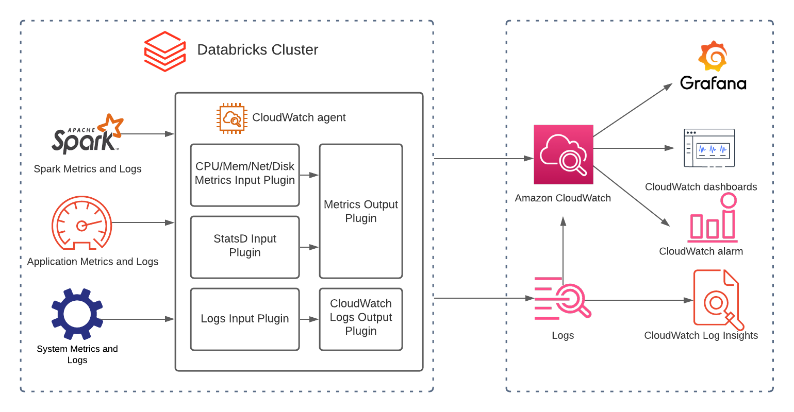
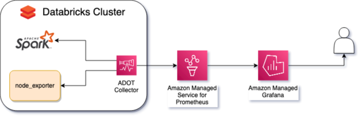

# AWS இல் Databricks கண்காணிப்பு மற்றும் Observability சிறந்த நடைமுறைகள்

Databricks என்பது தரவு பகுப்பாய்வு மற்றும் AI/ML பணிச்சுமைகளை நிர்வகிப்பதற்கான ஒரு தளமாகும். இந்த வழிகாட்டி [AWS இல் Databricks](https://aws.amazon.com/solutions/partners/databricks/) இயக்கும் வாடிக்கையாளர்களுக்கு observability க்கான AWS Native சேவைகள் அல்லது OpenSource Managed Services ஐப் பயன்படுத்தி இந்த பணிச்சுமைகளை கண்காணிக்க உதவுவதை நோக்கமாகக் கொண்டுள்ளது.

## Databricks ஐ ஏன் கண்காணிக்க வேண்டும்

Databricks கிளஸ்டர்களை நிர்வகிக்கும் செயல்பாட்டு குழுக்கள் பணிச்சுமை நிலை, பிழைகள், செயல்திறன் தடைகளை கண்காணிக்க ஒரு ஒருங்கிணைக்கப்பட்ட, தனிப்பயனாக்கப்பட்ட டாஷ்போர்டு வைத்திருப்பதன் மூலம் பயனடைகின்றன; காலப்போக்கில் மொத்த வள பயன்பாடு அல்லது பிழைகளின் சதவீத அளவு போன்ற விரும்பத்தகாத நடத்தை குறித்து எச்சரிக்கை; மற்றும் மூல காரண பகுப்பாய்விற்கான மையப்படுத்தப்பட்ட பதிவு, அதோடு கூடுதல் தனிப்பயனாக்கப்பட்ட மெட்ரிக்குகளை பிரித்தெடுத்தல்.

## என்ன கண்காணிக்க வேண்டும்

Databricks அதன் கிளஸ்டர் நிகழ்வுகளில் Apache Spark ஐ இயக்குகிறது, இதில் மெட்ரிக்குகளை வெளிப்படுத்துவதற்கான நேட்டிவ் அம்சங்கள் உள்ளன. இந்த மெட்ரிக்குகள் drivers, workers மற்றும் கிளஸ்டரில் இயக்கப்படும் பணிச்சுமைகள் குறித்த தகவல்களை வழங்கும்.

Spark ஐ இயக்கும் நிகழ்வுகள் சேமிப்பு, CPU, நினைவகம் மற்றும் நெட்வொர்க்கிங் பற்றிய கூடுதல் பயனுள்ள தகவல்களைக் கொண்டிருக்கும். Databricks கிளஸ்டரின் செயல்திறனை பாதிக்கும் வெளிப்புற காரணிகளை புரிந்துகொள்வது முக்கியம். பல நிகழ்வுகள் கொண்ட கிளஸ்டர்களில், தடைகள் மற்றும் பொது நலத்தை புரிந்துகொள்வதும் முக்கியமாகும்.

## எவ்வாறு கண்காணிப்பது

கலெக்டர்கள் மற்றும் அவற்றின் சார்புகளை நிறுவ, Databricks init scripts தேவைப்படும். இவை Databricks கிளஸ்டரின் ஒவ்வொரு நிகழ்விலும் துவக்க நேரத்தில் இயக்கப்படும் ஸ்கிரிப்ட்கள்.

Databricks கிளஸ்டர் அனுமதிகளுக்கு instance profiles ஐப் பயன்படுத்தி மெட்ரிக்குகள் மற்றும் லாக்குகளை அனுப்ப அனுமதி தேவைப்படும்.

இறுதியாக, Databricks கிளஸ்டர் Spark கட்டமைப்பில் மெட்ரிக்குகள் namespace ஐ கட்டமைப்பது ஒரு சிறந்த நடைமுறையாகும், `testApp` ஐ கிளஸ்டருக்கான சரியான குறிப்புடன் மாற்றவும்.

*படம் 1: மெட்ரிக்குகள் namespace Spark கட்டமைப்பின் எடுத்துக்காட்டு*

## DataBricks க்கான நல்ல Observability தீர்வின் முக்கிய பகுதிகள்

**1) மெட்ரிக்குகள்:** மெட்ரிக்குகள் என்பது ஒரு குறிப்பிட்ட காலகட்டத்தில் அளவிடப்பட்ட செயல்பாடு அல்லது ஒரு குறிப்பிட்ட செயல்முறையை விவரிக்கும் எண்கள். Databricks இல் வெவ்வேறு வகையான மெட்ரிக்குகள் இங்கே:

CPU, நினைவகம், வட்டு மற்றும் நெட்வொர்க் போன்ற கணினி வள-நிலை மெட்ரிக்குகள்.
Custom Metrics Source, StreamingQueryListener மற்றும் QueryExecutionListener ஐப் பயன்படுத்தும் பயன்பாட்டு மெட்ரிக்குகள்,
MetricsSystem ஆல் வெளிப்படுத்தப்படும் Spark மெட்ரிக்குகள்.

**2) லாக்குகள்:** லாக்குகள் என்பது நடந்த தொடர் நிகழ்வுகளின் பிரதிநிதித்துவம், அவை அவற்றைப் பற்றிய ஒரு நேர்கோட்டு கதையை சொல்கின்றன. Databricks இல் வெவ்வேறு வகையான லாக்குகள் இங்கே:

- Event logs
- Audit logs
- Driver logs: stdout, stderr, log4j custom logs (structured logging ஐ இயக்கவும்)
- Executor logs: stdout, stderr, log4j custom logs (structured logging ஐ இயக்கவும்)

**3) ட்ரேஸ்கள்:** Stack traces முடிவிலிருந்து முடிவு வரை தெரிவுநிலையை வழங்குகின்றன, மற்றும் அவை நிலைகள் வழியாக முழு ஓட்டத்தைக் காட்டுகின்றன. எந்த நிலைகள்/குறியீடுகள் பிழைகள்/செயல்திறன் சிக்கல்களை ஏற்படுத்துகின்றன என்பதை அடையாளம் காண நீங்கள் பிழைத்திருத்தம் செய்ய வேண்டும் என்றால் இது பயனுள்ளது.

**4) டாஷ்போர்டுகள்:** டாஷ்போர்டுகள் ஒரு பயன்பாடு/சேவையின் தங்க மெட்ரிக்குகளின் சிறந்த சுருக்க பார்வையை வழங்குகின்றன.

**5) எச்சரிக்கைகள்:** எச்சரிக்கைகள் கவனம் தேவைப்படும் நிலைமைகள் குறித்து பொறியாளர்களுக்கு அறிவிக்கின்றன.

## AWS Native Observability விருப்பங்கள்

Ganglia UI மற்றும் Log Delivery போன்ற Native தீர்வுகள் கணினி மெட்ரிக்குகளை சேகரிப்பதற்கும் Apache Spark மெட்ரிக்குகளை வினவுவதற்கும் சிறந்த தீர்வுகளாகும். இருப்பினும், சில பகுதிகள் மேம்படுத்தப்படலாம்:

- Ganglia எச்சரிக்கைகளை ஆதரிக்காது.
- Ganglia லாக்குகளிலிருந்து பெறப்பட்ட மெட்ரிக்குகளை ஆதரிக்காது (எ.கா., ERROR log வளர்ச்சி விகிதம்).
- தரவு-சரிநிலை, தரவு-புதுமை அல்லது முடிவிலிருந்து முடிவு வரை தாமதம் தொடர்பான SLO (Service Level Objectives) மற்றும் SLI (Service Level Indicators) ஐ கண்காணிக்க தனிப்பயன் டாஷ்போர்டுகளை பயன்படுத்தி ganglia உடன் காட்சிப்படுத்த முடியாது.

[Amazon CloudWatch](https://aws.amazon.com/cloudwatch/) AWS இல் உங்கள் Databricks கிளஸ்டர்களை கண்காணிக்கவும் நிர்வகிக்கவும் ஒரு முக்கியமான கருவியாகும். இது கிளஸ்டர் செயல்திறன் குறித்த மதிப்புமிக்க நுண்ணறிவுகளை வழங்குகிறது மற்றும் சிக்கல்களை விரைவாக கண்டறிந்து தீர்க்க உதவுகிறது. Databricks ஐ CloudWatch உடன் ஒருங்கிணைத்து structured logging ஐ இயக்குவது அந்த பகுதிகளை மேம்படுத்த உதவும். CloudWatch Application Insights லாக்குகளில் உள்ள புலங்களை தானாகவே கண்டறிய உதவும், மற்றும் CloudWatch Logs Insights விரைவான பிழைத்திருத்தம் மற்றும் பகுப்பாய்விற்கான நோக்கத்திற்கென உருவாக்கப்பட்ட வினவல் மொழியை வழங்குகிறது.

*படம் 2: Databricks CloudWatch கட்டிடக்கலை*

Databricks ஐ கண்காணிக்க CloudWatch ஐ எவ்வாறு பயன்படுத்துவது என்பது பற்றிய மேலும் தகவலுக்கு, பார்க்கவும்:
[How to Monitor Databricks with Amazon CloudWatch](https://aws.amazon.com/blogs/mt/how-to-monitor-databricks-with-amazon-cloudwatch/)

## திறந்த மூல மென்பொருள் observability விருப்பங்கள்

[Amazon Managed Service for Prometheus](https://aws.amazon.com/prometheus/) என்பது Prometheus-இணக்கமான கண்காணிப்பு நிர்வகிக்கப்பட்ட, சர்வர்லெஸ் சேவையாகும், இது மெட்ரிக்குகளை சேமிப்பதற்கும் இந்த மெட்ரிக்குகளின் மேல் உருவாக்கப்பட்ட எச்சரிக்கைகளை நிர்வகிப்பதற்கும் பொறுப்பாகும். Prometheus ஒரு பிரபலமான திறந்த மூல கண்காணிப்பு தொழில்நுட்பமாகும், இது Cloud Native Computing Foundation க்கு சொந்தமான இரண்டாவது திட்டமாகும், Kubernetes க்குப் பிறகு.

[Amazon Managed Grafana](https://aws.amazon.com/grafana/) என்பது Grafana க்கான நிர்வகிக்கப்பட்ட சேவையாகும். Grafana என்பது நேர-தொடர் தரவு காட்சிப்படுத்தலுக்கான திறந்த மூல தொழில்நுட்பமாகும், பொதுவாக observability க்கு பயன்படுத்தப்படுகிறது. Amazon Managed Service for Prometheus, Amazon CloudWatch மற்றும் பல பிற மூலங்களிலிருந்து தரவை காட்சிப்படுத்த Grafana ஐ பயன்படுத்தலாம். இது Databricks மெட்ரிக்குகள் மற்றும் எச்சரிக்கைகளை காட்சிப்படுத்த பயன்படுத்தப்படும்.

[AWS Distro for OpenTelemetry](https://aws-otel.github.io/) என்பது OpenTelemetry திட்டத்தின் AWS-ஆதரவுள்ள விநியோகமாகும், இது ட்ரேஸ்கள் மற்றும் மெட்ரிக்குகளை சேகரிப்பதற்கான திறந்த மூல தரநிலைகள், நூலகங்கள் மற்றும் சேவைகளை வழங்குகிறது. OpenTelemetry மூலம், Prometheus அல்லது StatsD போன்ற பல வெவ்வேறு observability தரவு வடிவங்களை சேகரிக்கலாம், இந்த தரவை செறிவூட்டலாம் மற்றும் CloudWatch அல்லது Amazon Managed Service for Prometheus போன்ற பல இலக்குகளுக்கு அனுப்பலாம்.

### பயன்பாட்டு நிலைகள்

AWS Native சேவைகள் Databricks கிளஸ்டர்களை நிர்வகிக்கத் தேவையான observability ஐ வழங்கும் அதே நேரத்தில், Open Source managed services ஐ பயன்படுத்துவது சிறந்த தேர்வாக இருக்கும் சில சூழ்நிலைகள் உள்ளன.

Prometheus மற்றும் Grafana இரண்டும் மிகவும் பிரபலமான தொழில்நுட்பங்கள், மற்றும் பல நிறுவனங்களில் ஏற்கனவே பயன்படுத்தப்படுகின்றன. Observability க்கான AWS Open Source சேவைகள் செயல்பாட்டு குழுக்களுக்கு அதே ஏற்கனவே உள்ள உள்கட்டமைப்பு, அதே வினவல் மொழி மற்றும் ஏற்கனவே உள்ள டாஷ்போர்டுகள் மற்றும் எச்சரிக்கைகளை Databricks பணிச்சுமைகளை கண்காணிக்கப் பயன்படுத்த அனுமதிக்கும், இந்த சேவைகளின் உள்கட்டமைப்பு, அளவிடுதல் மற்றும் செயல்திறனை நிர்வகிக்கும் கடினமான பணி இல்லாமல்.

ADOT என்பது CloudWatch மற்றும் Prometheus போன்ற வெவ்வேறு இலக்குகளுக்கு மெட்ரிக்குகள் மற்றும் ட்ரேஸ்களை அனுப்ப வேண்டிய அல்லது OTLP மற்றும் StatsD போன்ற வெவ்வேறு வகையான தரவு மூலங்களுடன் பணிபுரிய வேண்டிய குழுக்களுக்கு சிறந்த மாற்றாகும்.

இறுதியாக, Amazon Managed Grafana CloudWatch மற்றும் Prometheus உட்பட பல வெவ்வேறு Data Sources ஐ ஆதரிக்கிறது, மற்றும் ஒன்றுக்கும் மேற்பட்ட கருவிகளைப் பயன்படுத்த முடிவு செய்யும் குழுக்களுக்கு தரவை தொடர்புபடுத்த உதவுகிறது, அனைத்து Databricks கிளஸ்டர்களுக்கும் observability ஐ இயக்கும் வார்ப்புருக்களை உருவாக்க அனுமதிக்கிறது, மற்றும் Infrastructure as Code மூலம் அதன் வழங்கல் மற்றும் கட்டமைப்பை அனுமதிக்கும் சக்திவாய்ந்த API ஐ கொண்டுள்ளது.

*படம் 3: Databricks Open Source Observability கட்டிடக்கலை*

AWS Managed Open Source Services for Observability ஐ பயன்படுத்தி Databricks கிளஸ்டரிலிருந்து மெட்ரிக்குகளை கவனிக்க, மெட்ரிக்குகள் மற்றும் எச்சரிக்கைகள் இரண்டையும் காட்சிப்படுத்த ஒரு Amazon Managed Grafana workspace மற்றும் Amazon Managed Grafana workspace இல் datasource ஆக கட்டமைக்கப்பட்ட ஒரு Amazon Managed Service for Prometheus workspace தேவைப்படும்.

சேகரிக்கப்பட வேண்டிய இரண்டு முக்கியமான வகையான மெட்ரிக்குகள் உள்ளன: Spark மற்றும் node மெட்ரிக்குகள்.

Spark மெட்ரிக்குகள் கிளஸ்டரில் தற்போதைய workers அல்லது executors எண்ணிக்கை; செயலாக்கத்தின் போது நோடுகள் தரவை பரிமாறும்போது நிகழும் shuffles; அல்லது தரவு RAM இலிருந்து disk க்கும் disk இலிருந்து RAM க்கும் செல்லும்போது நிகழும் spills போன்ற தகவல்களை தரும். இந்த மெட்ரிக்குகளை வெளிப்படுத்த, Spark native Prometheus - 3.0 பதிப்பிலிருந்து கிடைக்கிறது - Databricks management console மூலம் இயக்கப்பட வேண்டும், மற்றும் `init_script` மூலம் கட்டமைக்கப்பட வேண்டும்.

disk பயன்பாடு, CPU நேரம், நினைவகம், சேமிப்பு செயல்திறன் போன்ற node மெட்ரிக்குகளை கண்காணிக்க, `node_exporter` ஐ பயன்படுத்துகிறோம், இது எந்த கூடுதல் கட்டமைப்பும் இல்லாமல் பயன்படுத்தப்படலாம், ஆனால் முக்கியமான மெட்ரிக்குகளை மட்டுமே வெளிப்படுத்த வேண்டும்.

Spark மற்றும் `node_exporter` இரண்டாலும் வெளிப்படுத்தப்படும் மெட்ரிக்குகளை ஸ்கிரேப் செய்து, இந்த மெட்ரிக்குகளை வடிகட்டி, `cluster_name` போன்ற metadata ஐ உட்செலுத்தி, இந்த மெட்ரிக்குகளை Prometheus workspace க்கு அனுப்ப கிளஸ்டரின் ஒவ்வொரு நோடிலும் ஒரு ADOT Collector நிறுவப்பட வேண்டும்.

ADOT Collector மற்றும் `node_exporter` இரண்டும் `init_script` மூலம் நிறுவப்பட்டு கட்டமைக்கப்பட வேண்டும்.

Databricks கிளஸ்டர் Prometheus workspace இல் மெட்ரிக்குகளை எழுதுவதற்கான அனுமதியுடன் ஒரு IAM Role உடன் கட்டமைக்கப்பட வேண்டும்.

## சிறந்த நடைமுறைகள்

### மதிப்புள்ள மெட்ரிக்குகளுக்கு முன்னுரிமை கொடுக்கவும்

Spark மற்றும் node_exporter இரண்டும் பல மெட்ரிக்குகளை வெளிப்படுத்துகின்றன, மற்றும் அதே மெட்ரிக்குகளுக்கான பல வடிவங்களை. கண்காணிப்பு மற்றும் சம்பவ பதிலுக்கு எந்த மெட்ரிக்குகள் பயனுள்ளவை என்று வடிகட்டாமல், சிக்கல்களை கண்டறிய சராசரி நேரம் அதிகரிக்கிறது, மாதிரிகளை சேமிப்பதற்கான செலவுகள் அதிகரிக்கின்றன, மதிப்புள்ள தகவல்கள் கண்டுபிடிக்கவும் புரிந்துகொள்ளவும் கடினமாக இருக்கும். OpenTelemetry processors ஐப் பயன்படுத்தி, மதிப்புள்ள மெட்ரிக்குகளை மட்டும் வடிகட்டி வைக்கலாம், அல்லது அர்த்தமற்ற மெட்ரிக்குகளை வடிகட்டி நீக்கலாம்; AMP க்கு அனுப்பும் முன் மெட்ரிக்குகளை ஒருங்கிணைத்து கணக்கிடலாம்.

### எச்சரிக்கை சோர்வை தவிர்க்கவும்

மதிப்புள்ள மெட்ரிக்குகள் AMP இல் உட்கொள்ளப்பட்டவுடன், எச்சரிக்கைகளை கட்டமைப்பது அவசியம். இருப்பினும், ஒவ்வொரு வள பயன்பாட்டு உயர்வுக்கும் எச்சரிக்கை அளிப்பது எச்சரிக்கை சோர்வை ஏற்படுத்தலாம், அதாவது அதிகப்படியான சத்தம் எச்சரிக்கைகளின் தீவிரத்தில் நம்பிக்கையை குறைக்கும், மற்றும் முக்கியமான நிகழ்வுகள் கண்டறியப்படாமல் போகும். தெளிவின்மையைத் தவிர்க்க AMP alerting rules group அம்சத்தை பயன்படுத்த வேண்டும், அதாவது பல இணைக்கப்பட்ட எச்சரிக்கைகள் தனித்தனி அறிவிப்புகளை உருவாக்குதல். மேலும், எச்சரிக்கைகள் சரியான தீவிரத்தைப் பெற வேண்டும், மற்றும் அது வணிக முன்னுரிமைகளை பிரதிபலிக்க வேண்டும்.

### Amazon Managed Grafana டாஷ்போர்டுகளை மறுபயன்பாடு செய்யுங்கள்

Amazon Managed Grafana Grafana native templating அம்சத்தை பயன்படுத்துகிறது, இது அனைத்து ஏற்கனவே உள்ள மற்றும் புதிய Databricks கிளஸ்டர்களுக்கான டாஷ்போர்டுகளை உருவாக்க அனுமதிக்கிறது. ஒவ்வொரு கிளஸ்டருக்கும் கைமுறையாக காட்சிப்படுத்தல்களை உருவாக்கி பராமரிக்க வேண்டிய அவசியத்தை இது நீக்குகிறது. இந்த அம்சத்தை பயன்படுத்த, கிளஸ்டர் அடிப்படையில் இந்த மெட்ரிக்குகளை குழுவாக்க மெட்ரிக்குகளில் சரியான labels வைத்திருப்பது முக்கியம். மீண்டும், OpenTelemetry processors மூலம் இது சாத்தியம்.

## குறிப்புகள் மற்றும் மேலும் தகவல்

- [Amazon Managed Service for Prometheus workspace உருவாக்குதல்](https://docs.aws.amazon.com/prometheus/latest/userguide/AMP-onboard-create-workspace.html)
- [Amazon Managed Grafana workspace உருவாக்குதல்](https://docs.aws.amazon.com/grafana/latest/userguide/Amazon-Managed-Grafana-create-workspace.html)
- [Amazon Managed Service for Prometheus datasource கட்டமைத்தல்](https://docs.aws.amazon.com/grafana/latest/userguide/prometheus-data-source.html)
- [Databricks Init Scripts](https://docs.databricks.com/clusters/init-scripts.html)
