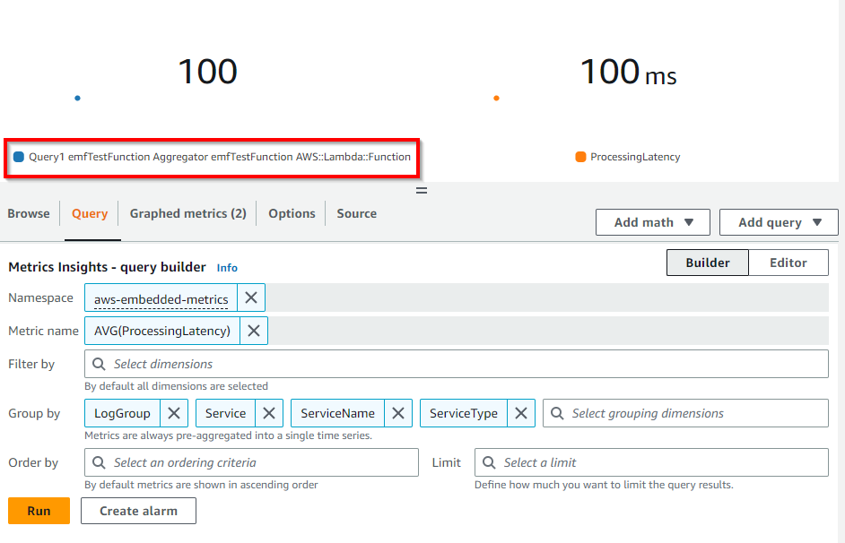

# CloudWatch Embedded Metric Format

## அறிமுகம்

CloudWatch Embedded Metric Format (EMF) வாடிக்கையாளர்கள் சிக்கலான உயர்-கார்டினாலிட்டி பயன்பாட்டு தரவை Amazon CloudWatch க்கு லாக்களின் வடிவத்தில் உட்கொள்ளவும் செயல்படக்கூடிய மெட்ரிக்குகளை உருவாக்கவும் உதவுகிறது. Embedded Metric Format உடன் வாடிக்கையாளர்கள் சிக்கலான கட்டிடக்கலையை நம்ப வேண்டியதில்லை அல்லது தங்கள் சூழல்களில் நுண்ணறிவுகளைப் பெற மூன்றாம் தரப்பு கருவிகளை பயன்படுத்த வேண்டியதில்லை. இந்த அம்சம் அனைத்து சூழல்களிலும் பயன்படுத்தப்படலாம் என்றாலும், AWS Lambda functions அல்லது Amazon Elastic Container Service (Amazon ECS), Amazon Elastic Kubernetes Service (Amazon EKS) அல்லது EC2 இல் Kubernetes இல் உள்ள கண்டெய்னர்கள் போன்ற நிலையற்ற வளங்களைக் கொண்ட பணிச்சுமைகளில் இது குறிப்பாக பயனுள்ளது. Embedded Metric Format வாடிக்கையாளர்களுக்கு தனி குறியீட்டை கருவிப்படுத்தாமல் அல்லது பராமரிக்காமல் தனிப்பயன் மெட்ரிக்குகளை எளிதாக உருவாக்க அனுமதிக்கிறது, அதே நேரத்தில் லாக் தரவின் மீது சக்திவாய்ந்த பகுப்பாய்வு திறன்களைப் பெறுகிறது.

## Embedded Metric Format (EMF) லாக்குகள் எவ்வாறு செயல்படுகின்றன

Amazon EC2, ஆன்-பிரமிசஸ் சர்வர்கள், Amazon Elastic Container Service (Amazon ECS), Amazon Elastic Kubernetes Service (Amazon EKS) அல்லது EC2 இல் Kubernetes இல் உள்ள கண்டெய்னர்கள் போன்ற கணக்கீட்டு சூழல்கள் CloudWatch Agent மூலம் Embedded Metric Format (EMF) லாக்குகளை உருவாக்கி Amazon CloudWatch க்கு அனுப்பலாம்.

AWS Lambda வாடிக்கையாளர்கள் தனிப்பயன் குறியீடு, தடுக்கும் நெட்வொர்க் அழைப்புகள் அல்லது மூன்றாம் தரப்பு மென்பொருள் இல்லாமல் தனிப்பயன் மெட்ரிக்குகளை எளிதாக உருவாக்க அனுமதிக்கிறது, Embedded Metric Format (EMF) லாக்குகளை உருவாக்கி Amazon CloudWatch க்கு அனுப்புகிறது.

[EMF விவரக்குறிப்புடன்](https://docs.aws.amazon.com/AmazonCloudWatch/latest/monitoring/CloudWatch_Embedded_Metric_Format_Specification.html) ஒத்த structured logs ஐ வெளியிடும்போது சிறப்பு header அறிவிப்பை வழங்க தேவையில்லாமல், வாடிக்கையாளர்கள் விரிவான லாக் நிகழ்வு தரவுடன் தனிப்பயன் மெட்ரிக்குகளை அசின்க்ரோனஸாக உட்பொதிக்கலாம். CloudWatch தானாகவே தனிப்பயன் மெட்ரிக்குகளை பிரித்தெடுக்கிறது, இதனால் வாடிக்கையாளர்கள் நிகழ்நேர சம்பவ கண்டறிதலுக்கு காட்சிப்படுத்தவும் அலாரம் அமைக்கவும் முடியும். பிரித்தெடுக்கப்பட்ட மெட்ரிக்குகளுடன் தொடர்புடைய விரிவான லாக் நிகழ்வுகள் மற்றும் உயர்-கார்டினாலிட்டி சூழலை CloudWatch Logs Insights ஐப் பயன்படுத்தி வினவி செயல்பாட்டு நிகழ்வுகளின் மூல காரணங்கள் குறித்த ஆழமான நுண்ணறிவுகளைப் பெறலாம்.

[Fluent Bit](https://docs.fluentbit.io/manual/pipeline/outputs/cloudwatch) க்கான Amazon CloudWatch output plugin வாடிக்கையாளர்களுக்கு [Embedded Metric Format](https://github.com/aws/aws-for-fluent-bit) (EMF) ஆதரவு உட்பட Amazon CloudWatch சேவையில் மெட்ரிக்குகள் மற்றும் லாக்குகள் தரவை உட்கொள்ள அனுமதிக்கிறது.


## Embedded Metric Format (EMF) லாக்குகளை எப்போது பயன்படுத்த வேண்டும்

பாரம்பரியமாக, கண்காணிப்பு மூன்று வகைகளாக கட்டமைக்கப்பட்டுள்ளது. முதல் வகை பயன்பாட்டின் classic health check ஆகும். இரண்டாவது வகை 'மெட்ரிக்குகள்', இதன் மூலம் வாடிக்கையாளர்கள் counters, timers மற்றும் gauges போன்ற மாதிரிகளைப் பயன்படுத்தி தங்கள் பயன்பாட்டை கருவிப்படுத்துகிறார்கள். மூன்றாவது வகை 'லாக்குகள்', இது பயன்பாட்டின் ஒட்டுமொத்த observability க்கு விலைமதிப்பற்றது. லாக்குகள் வாடிக்கையாளர்களுக்கு அவர்களின் பயன்பாடு எவ்வாறு நடந்துகொள்கிறது என்பது பற்றிய தொடர்ச்சியான தகவல்களை வழங்குகின்றன. இப்போது, வாடிக்கையாளர்கள் Embedded Metric Format (EMF) லாக்குகள் மூலம் தரவு நுணுக்கம் அல்லது செழுமையில் தியாகங்கள் செய்யாமல் தங்கள் பயன்பாட்டை கவனிக்கும் முறையை கணிசமாக மேம்படுத்தும் வழியைக் கொண்டுள்ளனர், அனைத்து கருவிப்படுத்தலையும் ஒருங்கிணைத்து எளிமைப்படுத்தும் அதே நேரத்தில் நம்பமுடியாத பகுப்பாய்வு திறன்களைப் பெறுகிறார்கள்.

[Embedded Metric Format (EMF) லாக்குகள்](https://aws.amazon.com/blogs/mt/enhancing-workload-observability-using-amazon-cloudwatch-embedded-metric-format/) உயர் கார்டினாலிட்டி பயன்பாட்டு தரவை உருவாக்கும் சூழல்களுக்கு சிறந்தது, இது மெட்ரிக் பரிமாணங்களை அதிகரிக்க வேண்டியதில்லாமல் EMF லாக்களின் பகுதியாக இருக்கலாம். ஒவ்வொரு பண்புக்கூறையும் மெட்ரிக் பரிமாணமாக வைக்காமலேயே CloudWatch Logs Insights மற்றும் CloudWatch Metrics Insights மூலம் EMF லாக்களை வினவுவதன் மூலம் பயன்பாட்டு தரவை துண்டித்து பகுப்பாய்வு செய்ய இது வாடிக்கையாளர்களை அனுமதிக்கிறது.

[மில்லியன் கணக்கான Telco அல்லது IoT சாதனங்களிலிருந்து](https://aws.amazon.com/blogs/mt/how-bt-uses-amazon-cloudwatch-to-monitor-millions-of-devices/) டெலிமெட்ரி தரவை ஒருங்கிணைக்கும் வாடிக்கையாளர்களுக்கு தங்கள் சாதனங்களின் செயல்திறன் குறித்த நுண்ணறிவுகள் மற்றும் சாதனங்கள் அறிக்கையிடும் தனிப்பட்ட டெலிமெட்ரியில் விரைவாக ஆழமாக மூழ்கும் திறன் தேவை. தரமான சேவையை வழங்க பெரிய தரவை தோண்டாமல் சிக்கல்களை எளிதாகவும் விரைவாகவும் சரிசெய்ய வேண்டும். Embedded Metric Format (EMF) லாக்குகளை பயன்படுத்தி வாடிக்கையாளர்கள் மெட்ரிக்குகள் மற்றும் லாக்குகளை ஒரே நிறுவனமாக இணைத்து பெரிய அளவிலான observability ஐ அடையலாம் மற்றும் செலவு திறன் மற்றும் சிறந்த செயல்திறனுடன் சரிசெய்தலை மேம்படுத்தலாம்.

## Embedded Metric Format (EMF) லாக்குகளை உருவாக்குதல்

Embedded Metric Format லாக்குகளை உருவாக்க பின்வரும் முறைகளைப் பயன்படுத்தலாம்

1. திறந்த மூல client libraries ஐப் பயன்படுத்தி ஒரு ஏஜென்ட் ([CloudWatch](https://docs.aws.amazon.com/AmazonCloudWatch/latest/monitoring/CloudWatch_Embedded_Metric_Format_Generation_CloudWatch_Agent.html) அல்லது Fluent-Bit அல்லது Firelens போன்றவை) மூலம் EMF லாக்குகளை உருவாக்கி அனுப்பவும்.

   - EMF லாக்குகளை உருவாக்க பின்வரும் மொழிகளில் திறந்த மூல client libraries கிடைக்கின்றன
     - [Node.Js](https://github.com/awslabs/aws-embedded-metrics-node)
     - [Python](https://github.com/awslabs/aws-embedded-metrics-python)
     - [Java](https://github.com/awslabs/aws-embedded-metrics-java)
     - [C#](https://github.com/awslabs/aws-embedded-metrics-dotnet)
   - AWS Distro for OpenTelemetry (ADOT) ஐப் பயன்படுத்தி EMF லாக்குகளை உருவாக்கலாம். ADOT என்பது Cloud Native Computing Foundation (CNCF) இன் பகுதியான OpenTelemetry திட்டத்தின் பாதுகாப்பான, உற்பத்தி-தயாரான, AWS-ஆதரவு விநியோகமாகும். OpenTelemetry என்பது பயன்பாட்டு கண்காணிப்புக்கான விநியோகிக்கப்பட்ட traces, logs மற்றும் metrics ஐ சேகரிக்க APIs, libraries மற்றும் agents ஐ வழங்கும் திறந்த மூல முயற்சியாகும் மற்றும் விற்பனையாளர்-குறிப்பிட்ட வடிவங்களுக்கு இடையிலான எல்லைகள் மற்றும் கட்டுப்பாடுகளை நீக்குகிறது. இதற்கு இரண்டு கூறுகள் தேவை, ஒரு OpenTelemetry இணக்கமான தரவு மூலம் மற்றும் [CloudWatch EMF](https://aws-otel.github.io/docs/getting-started/cloudwatch-metrics#cloudwatch-emf-exporter-awsemf) லாக்குகளுடன் பயன்படுத்த இயக்கப்பட்ட [ADOT Collector](https://github.com/open-telemetry/opentelemetry-collector-contrib/tree/main/exporter/awsemfexporter).

2. [JSON வடிவத்தில் வரையறுக்கப்பட்ட விவரக்குறிப்புக்கு](https://docs.aws.amazon.com/AmazonCloudWatch/latest/monitoring/CloudWatch_Embedded_Metric_Format_Specification.html) இணங்கும் கைமுறையாக உருவாக்கப்பட்ட லாக்குகளை [CloudWatch agent](https://docs.aws.amazon.com/AmazonCloudWatch/latest/monitoring/CloudWatch_Embedded_Metric_Format_Generation_CloudWatch_Agent.html) அல்லது [PutLogEvents API](https://docs.aws.amazon.com/AmazonCloudWatch/latest/monitoring/CloudWatch_Embedded_Metric_Format_Generation_PutLogEvents.html) மூலம் CloudWatch க்கு அனுப்பலாம்.

## CloudWatch console இல் Embedded Metric Format லாக்குகளை பார்த்தல்

மெட்ரிக்குகளை பிரித்தெடுக்கும் Embedded Metric Format (EMF) லாக்குகளை உருவாக்கிய பிறகு வாடிக்கையாளர்கள் அவற்றை Metrics பிரிவின் கீழ் [CloudWatch console இல் பார்க்கலாம்](https://docs.aws.amazon.com/AmazonCloudWatch/latest/monitoring/CloudWatch_Embedded_Metric_Format_View.html). Embedded metrics லாக்குகளை உருவாக்கும்போது குறிப்பிடப்பட்ட பரிமாணங்களைக் கொண்டுள்ளன. Client libraries ஐப் பயன்படுத்தி உருவாக்கப்பட்ட Embedded metrics ServiceType, ServiceName, LogGroup ஐ இயல்புநிலை பரிமாணங்களாகக் கொண்டுள்ளன.

- **ServiceName**: சேவையின் பெயர் மேலெழுதப்படுகிறது, இருப்பினும் பெயரை ஊகிக்க முடியாத சேவைகளுக்கு (எ.கா. EC2 இல் இயங்கும் Java செயல்முறை) வெளிப்படையாக அமைக்கப்படாவிட்டால் Unknown என்ற இயல்புநிலை மதிப்பு பயன்படுத்தப்படுகிறது.
- **ServiceType**: சேவையின் வகை மேலெழுதப்படுகிறது, இருப்பினும் வகையை ஊகிக்க முடியாத சேவைகளுக்கு (எ.கா. EC2 இல் இயங்கும் Java செயல்முறை) வெளிப்படையாக அமைக்கப்படாவிட்டால் Unknown என்ற இயல்புநிலை மதிப்பு பயன்படுத்தப்படுகிறது.
- **LogGroupName**: agent-அடிப்படையிலான தளங்களுக்கு மெட்ரிக்குகள் வழங்கப்பட வேண்டிய இலக்கு log group ஐ வாடிக்கையாளர்கள் விரும்பினால் கட்டமைக்கலாம். LogGroup வழங்கப்படாவிட்டால், சேவை பெயரிலிருந்து இயல்புநிலை மதிப்பு பெறப்படும்: -metrics
- **LogStreamName**: agent-அடிப்படையிலான தளங்களுக்கு மெட்ரிக்குகள் வழங்கப்பட வேண்டிய இலக்கு log stream ஐ வாடிக்கையாளர்கள் விரும்பினால் கட்டமைக்கலாம். LogStreamName வழங்கப்படாவிட்டால், agent ஆல் இயல்புநிலை மதிப்பு பெறப்படும் (இது hostname ஆக இருக்கலாம்).
- **NameSpace**: CloudWatch namespace ஐ மேலெழுதுகிறது. அமைக்கப்படாவிட்டால், aws-embedded-metrics என்ற இயல்புநிலை மதிப்பு பயன்படுத்தப்படுகிறது.

CloudWatch Console logs இல் ஒரு மாதிரி EMF logs கீழே போல் தோன்றும்

```json
2023-05-19T15:20:39.391Z 238196b6-c8da-4341-a4b7-0c322e0ef5bb INFO
{
    "LogGroup": "emfTestFunction",
    "ServiceName": "emfTestFunction",
    "ServiceType": "AWS::Lambda::Function",
    "Service": "Aggregator",
    "AccountId": "XXXXXXXXXXXX",
    "RequestId": "422b1569-16f6-4a03-b8f0-fe3fd9b100f8",
    "DeviceId": "61270781-c6ac-46f1-baf7-22c808af8162",
    "Payload": {
        "sampleTime": 123456789,
        "temperature": 273,
        "pressure": 101.3
    },
    "executionEnvironment": "AWS_Lambda_nodejs18.x",
    "memorySize": "256",
    "functionVersion": "$LATEST",
    "logStreamId": "2023/05/19/[$LATEST]f3377848231140c185570caa9f97abc8",
    "_aws": {
        "Timestamp": 1684509639390,
        "CloudWatchMetrics": [
            {
                "Dimensions": [
                    [
                        "LogGroup",
                        "ServiceName",
                        "ServiceType",
                        "Service"
                    ]
                ],
                "Metrics": [
                    {
                        "Name": "ProcessingLatency",
                        "Unit": "Milliseconds"
                    }
                ],
                "Namespace": "aws-embedded-metrics"
            }
        ]
    },
    "ProcessingLatency": 100
}
```

அதே EMF log க்கு, பிரித்தெடுக்கப்பட்ட மெட்ரிக்குகள் கீழே போல் தோன்றும், இவற்றை **CloudWatch Metrics** இல் வினவலாம்.



செயல்பாட்டு நிகழ்வுகளின் மூல காரணங்கள் குறித்த ஆழமான நுண்ணறிவுகளைப் பெற **CloudWatch Logs Insights** ஐப் பயன்படுத்தி பிரித்தெடுக்கப்பட்ட மெட்ரிக்குகளுடன் தொடர்புடைய விரிவான லாக் நிகழ்வுகளை வாடிக்கையாளர்கள் வினவலாம். EMF லாக்குகளிலிருந்து மெட்ரிக்குகளை பிரித்தெடுப்பதின் ஒரு நன்மை என்னவென்றால், வாடிக்கையாளர்கள் தனிப்பட்ட மெட்ரிக் (மெட்ரிக் பெயர் மற்றும் தனிப்பட்ட பரிமாண தொகுப்பு) மற்றும் மெட்ரிக் மதிப்புகள் மூலம் லாக்குகளை வடிகட்டி, ஒருங்கிணைக்கப்பட்ட மெட்ரிக் மதிப்புக்கு பங்களித்த நிகழ்வுகள் குறித்த சூழலைப் பெறலாம்.

மேலே விவாதிக்கப்பட்ட அதே EMF லாக்களுக்கு, பாதிக்கப்பட்ட request id அல்லது device id ஐப் பெற ProcessingLatency ஐ மெட்ரிக்காகவும் Service ஐ பரிமாணமாகவும் கொண்ட ஒரு எடுத்துக்காட்டு வினவல் கீழே CloudWatch Logs Insights இல் மாதிரி வினவலாக காட்டப்படுகிறது.

```json
filter ProcessingLatency < 200 and Service = "Aggregator"
| fields @requestId, @ingestionTime, @DeviceId
```


## EMF லாக்குகளால் உருவாக்கப்பட்ட மெட்ரிக்குகளில் அலாரங்கள்

[EMF ஆல் உருவாக்கப்பட்ட மெட்ரிக்குகளில் அலாரங்களை](https://docs.aws.amazon.com/AmazonCloudWatch/latest/monitoring/CloudWatch_Embedded_Metric_Format_Alarms.html) உருவாக்குவது வேறு எந்த மெட்ரிக்குகளிலும் அலாரங்களை உருவாக்குவது போன்ற அதே முறையைப் பின்பற்றுகிறது. இங்கு கவனிக்க வேண்டிய முக்கிய விஷயம் என்னவென்றால், EMF மெட்ரிக் உருவாக்கம் log publishing flow ஐ சார்ந்துள்ளது, ஏனெனில் CloudWatch Logs EMF லாக்குகளை செயலாக்கி மெட்ரிக்குகளை மாற்றுகிறது. எனவே அலாரங்கள் மதிப்பீடு செய்யப்படும் காலகட்டத்தில் மெட்ரிக் datapoints உருவாக்கப்படும் வகையில் லாக்குகளை சரியான நேரத்தில் வெளியிடுவது முக்கியம்.

மேலே விவாதிக்கப்பட்ட அதே EMF லாக்களுக்கு, ProcessingLatency மெட்ரிக்கை ஒரு வரம்புடன் datapoint ஆகப் பயன்படுத்தி ஒரு எடுத்துக்காட்டு அலாரம் உருவாக்கப்பட்டு கீழே காட்டப்படுகிறது.


## EMF Logs இன் சமீபத்திய அம்சங்கள்

வாடிக்கையாளர்கள் [PutLogEvents API](https://docs.aws.amazon.com/AmazonCloudWatch/latest/monitoring/CloudWatch_Embedded_Metric_Format_Generation_PutLogEvents.html) ஐப் பயன்படுத்தி CloudWatch Logs க்கு EMF லாக்குகளை அனுப்பலாம் மற்றும் மெட்ரிக்குகள் பிரித்தெடுக்கப்பட வேண்டும் என்று CloudWatch Logs க்கு அறிவுறுத்த HTTP header `x-amzn-logs-format: json/emf` ஐ விரும்பினால் சேர்க்கலாம், இது இனி அவசியமில்லை.

Amazon CloudWatch Embedded Metric Format (EMF) ஐப் பயன்படுத்தி structured logs இலிருந்து 1 வினாடி வரை நுணுக்கத்துடன் [உயர் தெளிவுத்திறன் மெட்ரிக் பிரித்தெடுப்பை](https://aws.amazon.com/about-aws/whats-new/2023/02/amazon-cloudwatch-high-resolution-metric-extraction-structured-logs/) ஆதரிக்கிறது. விரும்பிய தெளிவுத்திறனை (வினாடிகளில்) குறிக்க EMF விவரக்குறிப்பு லாக்களில் 1 அல்லது 60 (இயல்புநிலை) மதிப்புடன் ஒரு விரும்பினால் [StorageResolution](https://docs.aws.amazon.com/AmazonCloudWatch/latest/monitoring/cloudwatch_concepts.html#Resolution_definition) அளவுருவை வாடிக்கையாளர்கள் வழங்கலாம். EMF மூலம் standard resolution (60 வினாடிகள்) மற்றும் high resolution (1 வினாடி) மெட்ரிக்குகள் இரண்டையும் வெளியிடலாம், பயன்பாடுகளின் நலம் மற்றும் செயல்திறன் குறித்த நுணுக்கமான தெரிவுநிலையை இயக்குகிறது.

Amazon CloudWatch Embedded Metric Format (EMF) இல் இரண்டு பிழை மெட்ரிக்குகளுடன் ([EMFValidationErrors & EMFParsingErrors](https://docs.aws.amazon.com/AmazonCloudWatch/latest/logs/CloudWatch-Logs-Monitoring-CloudWatch-Metrics.html)) [பிழைகளுக்கான மேம்பட்ட தெரிவுநிலையை](https://aws.amazon.com/about-aws/whats-new/2023/01/amazon-cloudwatch-enhanced-error-visibility-embedded-metric-format-emf/) வழங்குகிறது. இந்த மேம்பட்ட தெரிவுநிலை EMF ஐ பயன்படுத்தும்போது வாடிக்கையாளர்கள் பிழைகளை விரைவாக கண்டறிந்து சரிசெய்ய உதவுகிறது, இதன் மூலம் கருவிப்படுத்தல் செயல்முறையை எளிமைப்படுத்துகிறது.

நவீன பயன்பாடுகளை நிர்வகிப்பதன் அதிகரிக்கும் சிக்கலுடன், தனிப்பயன் மெட்ரிக்குகளை வரையறுக்கும்போதும் பகுப்பாய்வு செய்யும்போதும் வாடிக்கையாளர்களுக்கு அதிக நெகிழ்வுத்தன்மை தேவை. எனவே அதிகபட்ச மெட்ரிக் பரிமாணங்கள் 10 இலிருந்து 30 ஆக அதிகரிக்கப்பட்டுள்ளன. வாடிக்கையாளர்கள் [30 பரிமாணங்கள் வரை EMF லாக்குகளைப் பயன்படுத்தி](https://aws.amazon.com/about-aws/whats-new/2022/08/amazon-cloudwatch-metrics-increases-throughput/) தனிப்பயன் மெட்ரிக்குகளை உருவாக்கலாம்.

## கூடுதல் குறிப்புகள்:

- NodeJS Library ஐப் பயன்படுத்தும் [AWS Lambda function உடன் Embedded Metric Format](https://catalog.workshops.aws/observability/en-US/aws-native/metrics/emf/clientlibrary) மாதிரி குறித்த One Observability Workshop.
- [Embedded Metrics Format ஐப் பயன்படுத்தி Async metrics](https://serverless-observability.workshop.aws/en/030_cloudwatch/async_metrics_emf.html) (EMF) குறித்த Serverless Observability Workshop
- CloudWatch Logs க்கு EMF லாக்குகளை அனுப்ப [PutLogEvents API ஐப் பயன்படுத்தும் Java code sample](https://catalog.workshops.aws/observability/en-US/aws-native/metrics/emf/putlogevents)
- வலைப்பதிவு கட்டுரை: [Amazon CloudWatch embedded custom metrics உடன் செலவுகளை குறைத்தல் மற்றும் வாடிக்கையாளர்களில் கவனம் செலுத்துதல்](https://aws.amazon.com/blogs/mt/lowering-costs-and-focusing-on-our-customers-with-amazon-cloudwatch-embedded-custom-metrics/)
