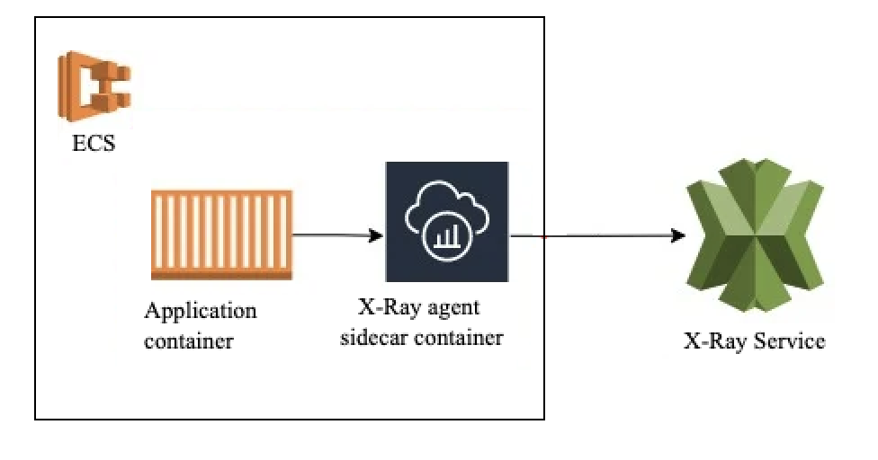

# AWS X-Ray உடன் ECS ட்ரேசிங்

நவீன அப்ளிகேஷன் உருவாக்கத்தின் உலகில், கண்டெய்னர்மயமாக்கல் அப்ளிகேஷன்களை டிப்ளாய் செய்வதற்கும் நிர்வகிப்பதற்கும் நடைமுறை தரநிலையாக மாறியுள்ளது. Amazon Elastic Container Service (ECS) கண்டெய்னர்மயமாக்கப்பட்ட அப்ளிகேஷன்களை டிப்ளாய் செய்வதற்கும் நிர்வகிப்பதற்கும் மிகவும் அளவிடக்கூடிய மற்றும் நம்பகமான தளத்தை வழங்குகிறது. இருப்பினும், அப்ளிகேஷன்கள் மிகவும் விநியோகிக்கப்பட்ட மற்றும் சிக்கலானதாக மாறும்போது, இந்த அப்ளிகேஷன்களின் நம்பகத்தன்மை, செயல்திறன் மற்றும் திறமையை உறுதி செய்வதற்கு Observability முக்கியமானது.

AWS X-Ray இந்த சவாலை ECS இல் இயங்கும் கண்டெய்னர்மயமாக்கப்பட்ட அப்ளிகேஷன்களுக்கான Observability ஐ மேம்படுத்தும் சக்திவாய்ந்த விநியோகிக்கப்பட்ட ட்ரேசிங் சேவையை வழங்குவதன் மூலம் நிவர்த்தி செய்கிறது. உங்கள் ECS பணிச்சுமைகளுடன் AWS X-Ray ஐ ஒருங்கிணைப்பதன் மூலம், உங்கள் அப்ளிகேஷனின் நடத்தை மற்றும் செயல்திறன் குறித்து ஆழமான நுண்ணறிவுகளை பெற உதவும் நன்மைகள் மற்றும் திறன்களை திறக்கலாம்:

1. **முழுமையான தெரிவுநிலை**: AWS X-Ray உங்கள் கண்டெய்னர்மயமாக்கப்பட்ட அப்ளிகேஷன்கள் மற்றும் பிற AWS சேவைகள் வழியாக கோரிக்கைகளை ட்ரேஸ் செய்கிறது, ஒரு கோரிக்கையின் முழு வாழ்க்கைச் சுழற்சியின் முழுமையான பார்வையை வழங்குகிறது.

2. **செயல்திறன் பகுப்பாய்வு**: X-Ray உங்கள் கண்டெய்னர்மயமாக்கப்பட்ட அப்ளிகேஷன்களுக்கான கோரிக்கை தாமதங்கள், பிழை விகிதங்கள் மற்றும் ஆதார பயன்பாடு போன்ற விரிவான செயல்திறன் மெட்ரிக்குகளை சேகரிக்கிறது.

3. **விநியோகிக்கப்பட்ட ட்ரேசிங்**: நவீன மைக்ரோசர்வீஸ் கட்டமைப்புகளில், கோரிக்கைகள் பெரும்பாலும் பல கண்டெய்னர்கள் மற்றும் சேவைகளை கடக்கின்றன. AWS X-Ray இந்த விநியோகிக்கப்பட்ட ட்ரேஸ்களின் ஒருங்கிணைந்த பார்வையை வழங்குகிறது.

4. **சேவை வரைபட காட்சிப்படுத்தல்**: X-Ray உங்கள் அப்ளிகேஷனின் கூறுகள் மற்றும் அவற்றின் தொடர்புகளின் காட்சி பிரதிநிதித்துவத்தை வழங்கும் டைனமிக் சேவை வரைபடங்களை உருவாக்குகிறது.

5. **AWS சேவைகளுடன் ஒருங்கிணைப்பு**: AWS X-Ray AWS Lambda, API Gateway, Amazon ECS மற்றும் Amazon EKS உள்ளிட்ட பரந்த அளவிலான AWS சேவைகளுடன் தடையின்றி ஒருங்கிணைகிறது.

6. **தனிப்பயன் கருவியாக்கம்**: AWS X-Ray பல AWS சேவைகளுக்கு உள்ளமைந்த கருவியாக்கத்தை வழங்கும் அதே நேரத்தில், AWS X-Ray SDK-களைப் பயன்படுத்தி உங்கள் தனிப்பயன் அப்ளிகேஷன்கள் மற்றும் சேவைகளையும் கருவியாக்கம் செய்யலாம்.

*படம் 1: ECS இலிருந்து X-Ray க்கு ட்ரேஸ்களை அனுப்புதல்*

உங்கள் ECS பணிச்சுமைகளின் மேம்படுத்தப்பட்ட Observability க்காக AWS X-Ray ஐ பயன்படுத்த, பின்வரும் பொதுவான படிகளை பின்பற்ற வேண்டும்:

1. **தனிப்பயன் அப்ளிகேஷன்களை கருவியாக்கம் செய்தல்**: உங்கள் கண்டெய்னர்மயமாக்கப்பட்ட அப்ளிகேஷன்களை கருவியாக்கம் செய்து X-Ray க்கு ட்ரேஸ் தரவை வெளியிட AWS X-Ray SDK-களை பயன்படுத்தவும்.

2. **கருவியாக்கப்பட்ட அப்ளிகேஷன்களை டிப்ளாய் செய்தல்**: உங்கள் கருவியாக்கப்பட்ட கண்டெய்னர்மயமாக்கப்பட்ட அப்ளிகேஷன்களை உங்கள் Amazon ECS கிளஸ்டர் அல்லது சேவையில் டிப்ளாய் செய்யவும்.

3. **ட்ரேஸ் தரவை பகுப்பாய்வு செய்தல்**: ட்ரேஸ் தரவை பகுப்பாய்வு செய்யவும், சேவை வரைபடங்களை பார்க்கவும், உங்கள் கண்டெய்னர்மயமாக்கப்பட்ட அப்ளிகேஷன்களுக்குள் செயல்திறன் சிக்கல்களை ஆராயவும் AWS X-Ray கன்சோல் அல்லது API-களை பயன்படுத்தவும்.

4. **எச்சரிக்கைகள் மற்றும் அறிவிப்புகளை அமைத்தல்**: உங்கள் ECS பணிச்சுமைகளில் செயல்திறன் சரிவு அல்லது அசாதாரணங்களுக்கான எச்சரிக்கைகளைப் பெற X-Ray மெட்ரிக்குகளின் அடிப்படையில் CloudWatch alarms மற்றும் அறிவிப்புகளை கட்டமைக்கவும்.

5. **பிற Observability கருவிகளுடன் ஒருங்கிணைத்தல்**: உங்கள் கண்டெய்னர்மயமாக்கப்பட்ட அப்ளிகேஷன்களின் செயல்திறன், லாக்குகள் மற்றும் மெட்ரிக்குகளின் விரிவான பார்வையைப் பெற AWS CloudWatch Logs, Amazon CloudWatch Metrics மற்றும் AWS Distro for OpenTelemetry போன்ற பிற Observability கருவிகளுடன் AWS X-Ray ஐ இணைக்கவும்.

AWS X-Ray ECS பணிச்சுமைகளுக்கு சக்திவாய்ந்த ட்ரேசிங் திறன்களை வழங்கும் அதே நேரத்தில், ட்ரேஸ் தரவு அளவு மற்றும் செலவு மேலாண்மை போன்ற சாத்தியமான சவால்களை கருத்தில் கொள்வது முக்கியம். உங்கள் கண்டெய்னர்மயமாக்கப்பட்ட அப்ளிகேஷன்கள் அளவிடப்பட்டு அதிக ட்ரேஸ் தரவை உருவாக்கும்போது, செலவுகளை திறம்பட நிர்வகிக்க சாம்ப்ளிங் உத்திகளை செயல்படுத்த அல்லது ட்ரேஸ் தரவு தக்கவைப்பு கொள்கைகளை சரிசெய்ய வேண்டியிருக்கலாம்.

கூடுதலாக, உங்கள் ட்ரேஸ் தரவுக்கான சரியான அணுகல் கட்டுப்பாடு மற்றும் தரவு பாதுகாப்பை உறுதி செய்வது முக்கியம். AWS X-Ray ஓய்வு நிலையிலும் பரிமாற்றத்திலும் ட்ரேஸ் தரவுக்கான என்கிரிப்ஷனையும், உங்கள் ட்ரேஸ் தரவின் ரகசியத்தன்மை மற்றும் ஒருமைப்பாட்டை பாதுகாக்க நுண்ணிய அணுகல் கட்டுப்பாட்டு வழிமுறைகளையும் வழங்குகிறது.

முடிவாக, உங்கள் Amazon ECS பணிச்சுமைகளுடன் AWS X-Ray ஐ ஒருங்கிணைப்பது கண்டெய்னர்மயமாக்கப்பட்ட அப்ளிகேஷன்களுக்கான Observability ஐ மேம்படுத்துவதற்கான சக்திவாய்ந்த அணுகுமுறையாகும்.
