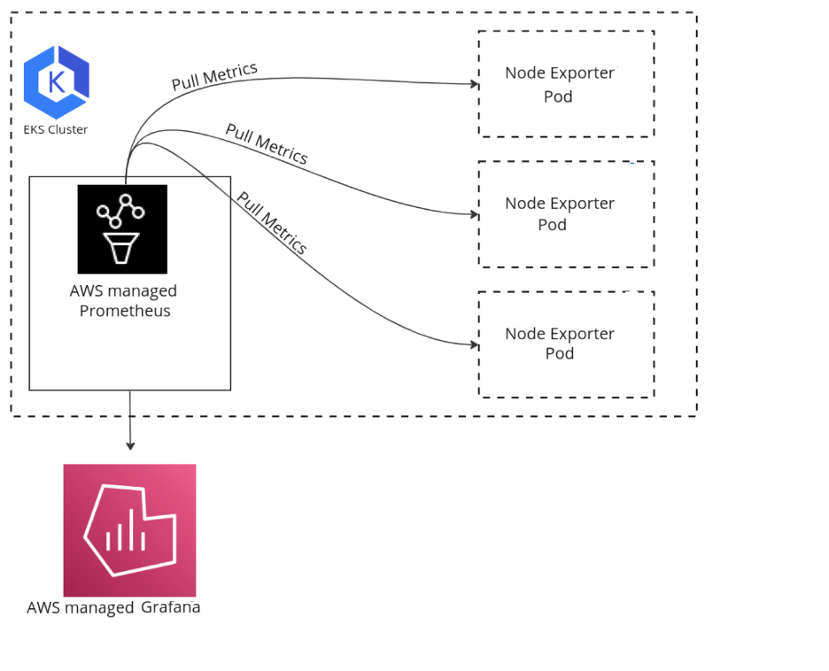

# AWS ஓப்பன் சோர்ஸ் சேவையுடன் EKS கண்காணிப்பு
<!-- Workloads with Node Exporter, Amazon Managed Prometheus, and Grafana Visualization
-->
கண்டெய்னரைஸ்டு அப்ளிகேஷன்கள் மற்றும் Kubernetes உலகில், பணிச்சுமைகளின் நம்பகத்தன்மை, செயல்திறன் மற்றும் திறனை உறுதி செய்ய கண்காணிப்பு மற்றும் Observability மிக முக்கியமானவை. Amazon Elastic Kubernetes Service (EKS) கண்டெய்னரைஸ்டு அப்ளிகேஷன்களை டிப்ளாய் செய்து நிர்வகிக்க ஒரு சக்திவாய்ந்த மற்றும் அளவிடக்கூடிய தளத்தை வழங்குகிறது, மேலும் Node Exporter, Amazon Managed Prometheus மற்றும் Grafana போன்ற கருவிகளுடன் இணைக்கும்போது, உங்கள் EKS பணிச்சுமைகளுக்கான விரிவான கண்காணிப்பு தீர்வை திறக்கலாம்.

Node Exporter என்பது ஹோஸ்ட் இயந்திரத்திலிருந்து பரந்த அளவிலான வன்பொருள் மற்றும் கர்னல் தொடர்பான மெட்ரிக்குகளை வெளிப்படுத்தும் Prometheus எக்ஸ்போர்ட்டர் ஆகும். உங்கள் EKS கிளஸ்டரில் Node Exporter ஐ DaemonSet ஆக டிப்ளாய் செய்வதன் மூலம், CPU, நினைவகம், வட்டு மற்றும் நெட்வொர்க் பயன்பாடு உள்ளிட்ட பல்வேறு அமைப்பு-நிலை மெட்ரிக்குகளுடன் ஒவ்வொரு தொழிலாளர் நோடிலிருந்தும் மதிப்புள்ள மெட்ரிக்குகளைச் சேகரிக்கலாம்.

Amazon Managed Prometheus என்பது AWS வழங்கும் முழுமையாக நிர்வகிக்கப்படும் சேவையாகும், இது Prometheus கண்காணிப்பு உள்கட்டமைப்பின் டிப்ளாய்மென்ட், மேலாண்மை மற்றும் அளவிடுதலை எளிமைப்படுத்துகிறது. Node Exporter ஐ Amazon Managed Prometheus உடன் ஒருங்கிணைப்பதன் மூலம், Prometheus நிகழ்வுகளை நீங்களே நிர்வகிக்கவும் அளவிடவும் வேண்டிய மேல்நிலை இல்லாமல், நோடு-நிலை மெட்ரிக்குகளை அதிக கிடைக்கும்தன்மை மற்றும் அளவிடக்கூடிய முறையில் சேகரித்து சேமிக்கலாம்.

Grafana என்பது Prometheus உடன் தடையின்றி ஒருங்கிணைக்கும் சக்திவாய்ந்த ஓப்பன் சோர்ஸ் தரவு காட்சிப்படுத்தல் மற்றும் கண்காணிப்பு கருவியாகும். உங்கள் Amazon Managed Prometheus நிகழ்வுடன் இணைக்க Grafana-ஐ உள்ளமைப்பதன் மூலம், உங்கள் EKS பணிச்சுமைகள் மற்றும் அடிப்படை உள்கட்டமைப்பின் ஆரோக்கியம் மற்றும் செயல்திறன் பற்றிய நிகழ்நேர நுண்ணறிவுகளை வழங்கும் வளமான மற்றும் தனிப்பயனாக்கக்கூடிய டாஷ்போர்டுகளை உருவாக்கலாம்.

*படம் 1: EKS நோடு மெட்ரிக்குகள் AMP-க்கு அனுப்பப்பட்டு AMG உடன் காட்சிப்படுத்தப்படுதல்*

இந்த கண்காணிப்பு தொகுப்பை உங்கள் EKS கிளஸ்டரில் டிப்ளாய் செய்வது பல நன்மைகளை வழங்குகிறது:

1. விரிவான தெரிவுநிலை: Node Exporter-லிருந்து மெட்ரிக்குகளைச் சேகரித்து Grafana-ல் காட்சிப்படுத்துவதன் மூலம், அப்ளிகேஷன் நிலையிலிருந்து அடிப்படை உள்கட்டமைப்பு வரை உங்கள் EKS பணிச்சுமைகளில் முழுமையான தெரிவுநிலையைப் பெறுவீர்கள், சிக்கல்களை முன்னெச்சரிக்கையாக அடையாளம் காணவும் சரிசெய்யவும் உங்களை இயக்குகிறது.

2. அளவிடக்கூடியது மற்றும் நம்பகத்தன்மை: Amazon Managed Prometheus மற்றும் Grafana அதிக அளவிடக்கூடியதாகவும் நம்பகமானதாகவும் வடிவமைக்கப்பட்டுள்ளன, செயல்திறன் அல்லது கிடைக்கும்தன்மையை சமரசம் செய்யாமல் உங்கள் EKS பணிச்சுமைகள் அளவிடும்போது உங்கள் கண்காணிப்பு தீர்வு தடையின்றி வளர முடியும் என்பதை உறுதி செய்கிறது.

3. மையப்படுத்தப்பட்ட கண்காணிப்பு: Amazon Managed Prometheus மையப்படுத்தப்பட்ட கண்காணிப்பு தளமாகச் செயல்படுவதால், பல EKS கிளஸ்டர்களிலிருந்து மெட்ரிக்குகளை ஒருங்கிணைக்கலாம், வெவ்வேறு சூழல்கள் அல்லது பிராந்தியங்களில் பணிச்சுமைகளைக் கண்காணிக்கவும் ஒப்பிடவும் உங்களை இயக்குகிறது.

4. தனிப்பயன் டாஷ்போர்டுகள் மற்றும் எச்சரிக்கைகள்: Grafana-ன் சக்திவாய்ந்த டாஷ்போர்டு மற்றும் எச்சரிக்கை திறன்கள் உங்கள் குறிப்பிட்ட கண்காணிப்பு தேவைகளுக்கு ஏற்ற தனிப்பயன் காட்சிப்படுத்தல்களை உருவாக்க உங்களை அனுமதிக்கின்றன, தொடர்புடைய மெட்ரிக்குகளை வெளிப்படுத்தவும் முக்கிய நிகழ்வுகள் அல்லது வரம்புகளுக்கு எச்சரிக்கைகளை அமைக்கவும் உங்களை இயக்குகின்றன.

5. AWS சேவைகளுடன் ஒருங்கிணைப்பு: Amazon Managed Prometheus Amazon CloudWatch மற்றும் AWS X-Ray போன்ற பிற AWS சேவைகளுடன் தடையின்றி ஒருங்கிணைகிறது, ஒருங்கிணைந்த கண்காணிப்பு தீர்வுக்குள் பல்வேறு மூலங்களிலிருந்து மெட்ரிக்குகளை தொடர்புபடுத்தவும் காட்சிப்படுத்தவும் உங்களை இயக்குகிறது.

இந்த கண்காணிப்பு தொகுப்பை உங்கள் EKS கிளஸ்டரில் செயல்படுத்த, இந்த பொதுவான படிகளைப் பின்பற்ற வேண்டும்:

1. நோடு-நிலை மெட்ரிக்குகளைச் சேகரிக்க உங்கள் EKS தொழிலாளர் நோடுகளில் Node Exporter ஐ DaemonSet ஆக டிப்ளாய் செய்யவும்.
2. Amazon Managed Prometheus பணியிடத்தை அமைத்து Node Exporter-லிருந்து மெட்ரிக்குகளை ஸ்கிரேப் செய்ய உள்ளமைக்கவும்.
3. உங்கள் EKS கிளஸ்டருக்குள் அல்லது தனி சேவையாக Grafana-ஐ நிறுவி உள்ளமைக்கவும், உங்கள் Amazon Managed Prometheus பணியிடத்துடன் இணைக்கவும்.
4. உங்கள் கண்காணிப்பு தேவைகளின் அடிப்படையில் தனிப்பயன் Grafana டாஷ்போர்டுகளை உருவாக்கி எச்சரிக்கைகளை உள்ளமைக்கவும்.

இந்த கண்காணிப்பு தீர்வு சக்திவாய்ந்த திறன்களை வழங்கும் அதே நேரத்தில், Node Exporter, Prometheus மற்றும் Grafana அறிமுகப்படுத்தும் சாத்தியமான மேல்நிலை மற்றும் வள நுகர்வைக் கருத்தில் கொள்வது முக்கியம். உங்கள் கண்காணிப்பு கூறுகள் உங்கள் அப்ளிகேஷன் பணிச்சுமைகளுடன் வளங்களுக்காக போட்டியிடாமல் இருப்பதை உறுதி செய்ய கவனமான திட்டமிடல் மற்றும் வள ஒதுக்கீடு அவசியம்.

கூடுதலாக, உங்கள் கண்காணிப்பு தீர்வு தரவு பாதுகாப்பு, அணுகல் கட்டுப்பாடு மற்றும் தக்கவைப்பு கொள்கைகளுக்கான சிறந்த நடைமுறைகளைப் பின்பற்றுவதை உறுதி செய்ய வேண்டும். உங்கள் கண்காணிப்பு தரவின் ரகசியத்தன்மை மற்றும் ஒருமைப்பாட்டைப் பராமரிக்க பாதுகாப்பான தகவல் தொடர்பு சேனல்கள், அங்கீகார வழிமுறைகள் மற்றும் தரவு குறியாக்கத்தை செயல்படுத்துவது மிக முக்கியமானது.

முடிவாக, உங்கள் EKS கிளஸ்டரில் Node Exporter, Amazon Managed Prometheus மற்றும் Grafana-ஐ டிப்ளாய் செய்வது உங்கள் கண்டெய்னரைஸ்டு பணிச்சுமைகளுக்கான விரிவான கண்காணிப்பு தீர்வை வழங்குகிறது. இந்த கருவிகளைப் பயன்படுத்துவதன் மூலம், உங்கள் அப்ளிகேஷன்களின் செயல்திறன் மற்றும் ஆரோக்கியத்தில் ஆழமான நுண்ணறிவுகளைப் பெறலாம், முன்னெச்சரிக்கை சிக்கல் கண்டறிதல், திறமையான வள பயன்பாடு மற்றும் தகவலறிந்த முடிவெடுத்தலை இயக்கலாம். இருப்பினும், உங்கள் EKS பணிச்சுமைகளுக்கான திறமையான மற்றும் வலுவான கண்காணிப்பு தீர்வை உறுதி செய்ய வள நுகர்வு, பாதுகாப்பு மற்றும் இணக்கத் தேவைகளைக் கருத்தில் கொண்டு இந்த கண்காணிப்பு தொகுப்பை கவனமாகத் திட்டமிட்டு செயல்படுத்துவது அவசியம்.
