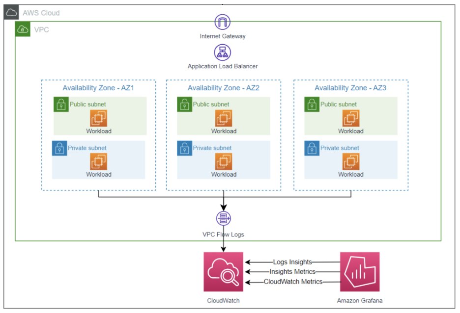

# நெட்வொர்க் Observability-க்கான VPC Flow Logs

நவீன கிளவுட் சூழல்களில், நெட்வொர்க் Observability உங்கள் அப்ளிகேஷன்கள் மற்றும் உள்கட்டமைப்பின் பாதுகாப்பு, செயல்திறன் மற்றும் நம்பகத்தன்மையை உறுதி செய்வதில் முக்கிய பங்கு வகிக்கிறது. Amazon Web Services (AWS) வழங்கும் Amazon Virtual Private Cloud (VPC) Flow Logs, உங்கள் VPC-களுக்குள் நெட்வொர்க் போக்குவரத்தில் தெரிவுநிலையைப் பெற்று, திறமையான சிக்கல் தீர்வு மற்றும் பாதுகாப்பு பகுப்பாய்வை இயக்கும் சக்திவாய்ந்த கருவியை வழங்குகிறது.

VPC Flow Logs உங்கள் VPC-க்குள் உள்ளே மற்றும் வெளியே செல்லும் IP போக்குவரத்து பற்றிய மெட்டாடேட்டாவைக் கைப்பற்றுகிறது, நெட்வொர்க் தகவல் தொடர்பு முறைகள், சாத்தியமான பாதுகாப்பு அச்சுறுத்தல்கள் மற்றும் செயல்திறன் தடைகள் பற்றிய மதிப்புள்ள நுண்ணறிவுகளை வழங்குகிறது. VPC Flow Logs ஐப் பயன்படுத்துவதன் மூலம், நிறுவனங்கள் பின்வரும் நன்மைகளை அடையலாம்:

1. **நெட்வொர்க் போக்குவரத்து தெரிவுநிலை**: VPC Flow Logs மூல மற்றும் இலக்கு IP முகவரிகள், போர்ட்கள், நெறிமுறைகள், பாக்கெட் அளவுகள் மற்றும் ஓட்ட திசைகள் உள்ளிட்ட நெட்வொர்க் போக்குவரத்து பற்றிய விரிவான தகவல்களைப் பதிவு செய்கிறது. நெட்வொர்க் போக்குவரத்து முறைகளில் இந்த விரிவான தெரிவுநிலை நிறுவனங்கள் முரண்பாடுகளை அடையாளம் காணவும், சாத்தியமான பாதுகாப்பு அச்சுறுத்தல்களைக் கண்டறியவும், நெட்வொர்க் உள்ளமைவுகளை உகந்ததாக்கவும் உதவுகிறது.

2. **பாதுகாப்பு கண்காணிப்பு மற்றும் அச்சுறுத்தல் கண்டறிதல்**: VPC Flow Logs ஐ பகுப்பாய்வு செய்வதன் மூலம், பாதுகாப்பு குழுக்கள் அங்கீகரிக்கப்படாத அணுகல் முயற்சிகள், போர்ட் ஸ்கேனிங் அல்லது தரவு வெளியேற்ற முயற்சிகள் போன்ற சந்தேகத்திற்கிடமான செயல்களுக்காக நெட்வொர்க் போக்குவரத்தைக் கண்காணிக்கலாம். இந்த முன்னெச்சரிக்கை கண்காணிப்பு அணுகுமுறை நிறுவனங்கள் சாத்தியமான பாதுகாப்பு அச்சுறுத்தல்களை மிகவும் திறம்படக் கண்டறிந்து பதிலளிக்க உதவுகிறது.

3. **இணக்கம் மற்றும் தணிக்கை**: VPC Flow Logs நெட்வொர்க் போக்குவரத்தின் விரிவான தணிக்கைப் பாதையை வழங்குகிறது, நிறுவனங்கள் இணக்கத் தேவைகளை நிறைவேற்றவும் பாதுகாப்பு கொள்கைகள் மற்றும் தொழில் விதிமுறைகளுக்கு இணங்குவதை நிரூபிக்கவும் உதவுகிறது. இந்த தணிக்கைப் பாதை தடயவியல் விசாரணைகள் மற்றும் சம்பவ பதிலளிப்பு முயற்சிகளுக்கும் உதவலாம்.

4. **அப்ளிகேஷன் செயல்திறன் சிக்கல் தீர்வு**: நெட்வொர்க் தடைகள் அல்லது இணைப்பு சிக்கல்கள் அப்ளிகேஷன் செயல்திறனை குறிப்பிடத்தக்க அளவில் பாதிக்கலாம். போக்குவரத்து முறைகளை பகுப்பாய்வு செய்தல், சாத்தியமான தடைகளை அடையாளம் காணுதல் மற்றும் அதற்கேற்ப நெட்வொர்க் உள்ளமைவுகளை உகந்ததாக்குதல் ஆகியவற்றின் மூலம் நெட்வொர்க் தொடர்பான செயல்திறன் சிக்கல்களை VPC Flow Logs நிறுவனங்களுக்கு அடையாளம் காணவும் சரிசெய்யவும் அனுமதிக்கிறது.

5. **செலவு உகந்தமாக்கல்**: VPC Flow Logs ஐ பகுப்பாய்வு செய்வதன் மூலம், நிறுவனங்கள் நெட்வொர்க் போக்குவரத்து முறைகள் மற்றும் வள பயன்பாடு பற்றிய நுண்ணறிவுகளைப் பெறலாம். இந்தத் தகவல் நெட்வொர்க் உள்ளமைவுகளை உகந்ததாக்க, நெட்வொர்க் வளங்களை சரியான அளவிற்கு மாற்ற மற்றும் அதிகப்படியாக வழங்குதல் அல்லது பயன்படுத்தப்படாத வளங்களுடன் தொடர்புடைய தேவையற்ற செலவுகளைக் குறைக்கப் பயன்படுத்தலாம்.

*படம் 1: Grafana உடன் VPC flow logs காட்சிப்படுத்தல்*
<!--https://aws.amazon.com/blogs/mt/visualize-and-gain-insights-into-your-vpc-flow-logs-with-amazon-managed-grafana/-->
நெட்வொர்க் Observability மற்றும் சிக்கல் தீர்வுக்கு VPC Flow Logs ஐப் பயன்படுத்த, நிறுவனங்கள் இந்த பொதுவான படிகளைப் பின்பற்றலாம்:

1. **VPC Flow Logs ஐ இயக்கவும்**: உங்கள் VPC-கள் அல்லது உங்கள் VPC-களுக்குள் உள்ள குறிப்பிட்ட நெட்வொர்க் இடைமுகங்களுக்கு VPC Flow Logs ஐ உள்ளமைக்கவும், விரும்பிய லாக் இலக்கை (எ.கா., Amazon CloudWatch Logs, Amazon S3 அல்லது மூன்றாம் தரப்பு லாக் மேலாண்மை தீர்வு) குறிப்பிடவும்.

2. **லாக் தரவை பகுப்பாய்வு செய்யவும்**: VPC Flow Log தரவை பாகுபடுத்தி பகுப்பாய்வு செய்ய லாக் பகுப்பாய்வு கருவிகள் அல்லது தனிப்பயன் ஸ்கிரிப்ட்களைப் பயன்படுத்தவும், பதிவு செய்யப்பட்ட நெட்வொர்க் போக்குவரத்து தகவலின் அடிப்படையில் முறைகள், முரண்பாடுகள் அல்லது சாத்தியமான பாதுகாப்பு அச்சுறுத்தல்களை அடையாளம் காணவும்.

3. **பாதுகாப்பு மற்றும் கண்காணிப்பு கருவிகளுடன் ஒருங்கிணைக்கவும்**: நெட்வொர்க் போக்குவரத்து தரவை மற்ற பாதுகாப்பு நிகழ்வுகள் மற்றும் எச்சரிக்கைகளுடன் தொடர்புபடுத்த Security Information and Event Management (SIEM) அமைப்புகள் போன்ற உங்கள் ஏற்கனவே உள்ள பாதுகாப்பு மற்றும் கண்காணிப்பு தீர்வுகளில் VPC Flow Log தரவை இணைக்கவும்.

4. **எச்சரிக்கைகள் மற்றும் அறிவிப்புகளை அமைக்கவும்**: சாத்தியமான பாதுகாப்பு அச்சுறுத்தல்கள் அல்லது செயல்திறன் சிக்கல்களுக்கு முன்னெச்சரிக்கை பதிலளிப்பை இயக்கும் வகையில் VPC Flow Logs-ல் கண்டறியப்பட்ட குறிப்பிட்ட முறைகள் அல்லது வரம்புகளின் அடிப்படையில் எச்சரிக்கைகள் மற்றும் அறிவிப்புகளை உள்ளமைக்கவும்.

5. **நெட்வொர்க் உள்ளமைவுகளை உகந்ததாக்கவும்**: நெட்வொர்க் செயல்திறன் மற்றும் பாதுகாப்பு நிலையை மேம்படுத்த நெட்வொர்க் உள்ளமைவுகளை உகந்ததாக்கவும், பாதுகாப்பு குழு விதிகளை நுணுக்கமாக்கவும், போக்குவரத்து வடிவமைத்தல் அல்லது வடிகட்டுதல் வழிமுறைகளை செயல்படுத்தவும் VPC Flow Logs-லிருந்து பெறப்பட்ட நுண்ணறிவுகளைப் பயன்படுத்தவும்.

VPC Flow Logs மதிப்புள்ள நெட்வொர்க் Observability மற்றும் சிக்கல் தீர்வு திறன்களை வழங்கும் அதே நேரத்தில், லாக் தரவு அளவு மற்றும் செலவு மேலாண்மை போன்ற சாத்தியமான சவால்களைக் கருத்தில் கொள்வது முக்கியம். நெட்வொர்க் போக்குவரத்தின் அளவு அதிகரிக்கும்போது, உருவாக்கப்படும் லாக் தரவின் அளவு குறிப்பிடத்தக்க அளவில் வளரலாம், சேமிப்பு செலவுகள் மற்றும் செயல்திறனை பாதிக்கலாம். திறமையான மற்றும் செலவு-குறைந்த லாக்கிங் தீர்வை உறுதி செய்ய லாக் தரவு தக்கவைப்பு கொள்கைகள், மாதிரி உத்திகள் மற்றும் செலவு உகந்தமாக்கல் நுட்பங்களை செயல்படுத்துவது அவசியமாக இருக்கலாம்.

கூடுதலாக, உங்கள் VPC Flow Logs-க்கு சரியான அணுகல் கட்டுப்பாடு மற்றும் தரவு பாதுகாப்பை உறுதி செய்வது மிக முக்கியமானது. AWS உங்கள் லாக் தரவின் ரகசியத்தன்மை மற்றும் ஒருமைப்பாட்டைப் பாதுகாக்க நுணுக்கமான அணுகல் கட்டுப்பாட்டு வழிமுறைகள் மற்றும் குறியாக்க திறன்களை வழங்குகிறது.

முடிவாக, VPC Flow Logs AWS சூழல்களில் நெட்வொர்க் Observability-ஐ அடையவும் திறமையான சிக்கல் தீர்வை இயக்கவும் ஒரு சக்திவாய்ந்த கருவியாகும். நெட்வொர்க் போக்குவரத்து முறைகள் பற்றிய விரிவான நுண்ணறிவுகளை வழங்குவதன் மூலம், VPC Flow Logs நிறுவனங்களை பாதுகாப்பு அச்சுறுத்தல்களைக் கண்காணிக்கவும், நெட்வொர்க் உள்ளமைவுகளை உகந்ததாக்கவும், செயல்திறன் சிக்கல்களைத் தீர்க்கவும், இணக்கத்தைப் பராமரிக்கவும் அதிகாரம் அளிக்கிறது. ஏற்கனவே உள்ள பாதுகாப்பு மற்றும் கண்காணிப்பு தீர்வுகளுடன் VPC Flow Logs ஐ ஒருங்கிணைப்பதன் மூலம், நிறுவனங்கள் தங்கள் ஒட்டுமொத்த Observability-ஐ மேம்படுத்தி பாதுகாப்பான, உயர் செயல்திறன் கொண்ட மற்றும் நம்பகமான கிளவுட் உள்கட்டமைப்பைப் பராமரிக்கலாம்.
