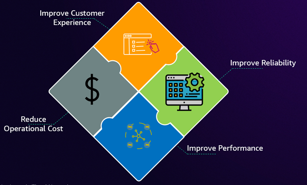

# தலைவர்கள் மற்றும் நிர்வாகிகள்

இன்றைய டிஜிட்டல்-முதல் பொருளாதாரத்தில், வணிக செயல்திறன் மற்றும் தொழில்நுட்ப செயல்பாடுகளுக்கு இடையிலான எல்லை கரைந்துவிட்டது. IT தலைவர்கள் பல முனைகளில் அதிகரிக்கும் அழுத்தத்தை எதிர்கொள்கின்றனர்: வருவாய் ஓட்டங்களை நேரடியாக பாதிக்கும் டிஜிட்டல் சேவைகள், நம்பகத்தன்மைக்கான முன்னெப்போதும் இல்லாத வாடிக்கையாளர் எதிர்பார்ப்புகள், தொழில்நுட்ப மீள்தன்மையில் தங்கியிருக்கும் போட்டி நன்மை, மற்றும் அதிக செயல்பாட்டு வெளிப்படைத்தன்மையை கோரும் ஒழுங்குமுறை தேவைகள். இந்த இணைவு IT தலைவர்களுக்கு பயனுள்ள observability உத்திகள் மூலம் செயல்பாட்டு சிறப்பு மற்றும் உறுதியான வணிக மதிப்பு உருவாக்கம் இரண்டையும் நிரூபிக்க கோருகிறது.

---

இந்த சவால்களின் அடிப்படையில், அமைப்புகள் observability-ஐ தொழில்நுட்ப overhead-ஆக பார்ப்பதிலிருந்து அளவிடக்கூடிய returns-உடன் ஒரு மூலோபாய முதலீடாக நடத்துவதற்கு மாற வேண்டும். IT தலைவர்கள் தங்கள் observability முயற்சிகள் வாடிக்கையாளர் திருப்தி மதிப்பெண்களிலிருந்து செயல்பாட்டு செலவுகள் வரை வணிக மெட்ரிக்குகளை எவ்வாறு நேரடியாக பாதிக்கின்றன என்பதை நிரூபிக்க வேண்டும். ROI-driven அணுகுமுறை observability கருவிகள் மற்றும் நடைமுறைகளில் செலவிடப்படும் ஒவ்வொரு டாலரும் சம்பவ பதில் நேரங்கள், கணினி நம்பகத்தன்மை மற்றும் குழு உற்பத்தித்திறனில் அளவிடக்கூடிய மேம்பாடுகளை அளிப்பதை உறுதி செய்கிறது, இறுதியில் வருவாய் ஓட்டங்களை பாதுகாத்து மேம்படுத்துகிறது.

பழங்கால மேலாண்மைக் கொள்கை இங்கே குறிப்பாக உண்மையாக ஒலிக்கிறது: "அளவிட முடியாவிட்டால், நிர்வகிக்க முடியாது." இதனால்தான் தொழில் தலைவர்கள் observability-ஐ முதல்-தர செயல்பாட்டு தேவையாக இரட்டிப்பாக்குகின்றனர். ஒரு தலைவராக, உங்கள் இலக்கு root-cause-analysis (RCA)-ஐ விரைவுபடுத்துவதும் mean-time-to-restore (MTTR)-ஐ குறைப்பதும் என்றால், உங்கள் observability உத்தி உங்கள் அமைப்பின் முக்கிய வணிக இலக்குகள் மற்றும் முன்னுரிமைகளுடன் இறுக்கமாக இணைக்கப்பட்டிருக்க வேண்டும். இது உருவாக்கப்படும் நுண்ணறிவுகள் உங்கள் அமைப்புக்கான முக்கிய செயல்திறன் குறிகாட்டிகளை (KPIs) மேம்படுத்துவதை நேரடியாக ஆதரிப்பதை உறுதி செய்கிறது. மேலும், இது சந்தையில் சமீபத்திய மற்றும் சிறந்த AI observability கருவியில் முதலீடு செய்வது அல்ல, உங்கள் அமைப்பின் இலக்குகளுடன் ஒத்துவரும் சிக்னல்களை 'அளவிட' முடிவதை உறுதி செய்வதே முக்கியம்!

## பயனுள்ள Observability உத்தியை கட்டியெழுப்புதல்

Observability-ஐ உறுதியான வணிக விளைவுகளாக எவ்வாறு மொழிபெயர்ப்பது? பதில் பின்வரும் முக்கியமான பகுதிகளில் கவனம் செலுத்துவதில் உள்ளது: வாடிக்கையாளர் அனுபவம், பயன்பாட்டு செயல்திறன் & நம்பகத்தன்மை, மற்றும் செயல்பாட்டு திறன் & செலவு மேம்படுத்தல். Observability-ஐ உறுதியான வணிக விளைவுகளாக மொழிபெயர்க்க, மிக முக்கியமான அம்சத்தில் கவனம் செலுத்தி தொடங்குவோம்: வாடிக்கையாளர் அனுபவம்.

#### வாடிக்கையாளர் அனுபவத்தை அளவிடுதல்

முதலில், வாடிக்கையாளர் அனுபவத்தை அளவிடுவது பாரம்பரிய கணினி மெட்ரிக்குகளை தாண்டி செல்ல வேண்டும். உங்கள் முதன்மை அளவீட்டு கட்டமைப்பாக Service Level Objectives (SLOs)-ஐ செயல்படுத்த பரிந்துரைக்கிறோம். SLOs கணினி மெட்ரிக்குகளை விட முக்கியமான இறுதிப்-பயனர் பயணங்களின் அடிப்படையில் சேவை கிடைக்கும் தன்மைக்கான ஒப்புக்கொள்ளப்பட்ட இலக்குகளை வழங்குகின்றன. இந்த வாடிக்கையாளர்-மையமான அணுகுமுறை உங்கள் observability உத்தி மிக முக்கியமான விஷயத்துடன் நேரடியாக ஒத்துவருவதை உறுதி செய்கிறது - இறுதிப்-பயனர் அனுபவம், இது அனைத்து தொழில்நுட்ப முடிவுகளுக்கான உங்கள் வடக்கு நட்சத்திரமாக இருக்க வேண்டும். இப்போது, உங்கள் வாடிக்கையாளர்களுக்கு நீங்கள் செய்யும் உறுதிமொழி மற்றும் உங்கள் சேவைகள் எவ்வளவு ஆரோக்கியமாக உள்ளன என்பதை சொல்லும் கண்காணிக்கக்கூடிய அளவீடுகளை பிரதிநிதித்துவப்படுத்தும் சொற்களுடன் பழகுவோம்.

- SLI (Service Level Indicator) வழங்கப்படும் சேவையின் சில அம்சத்தின் கவனமாக வரையறுக்கப்பட்ட அளவு அளவீடு ஆகும்.
- SLO (Service Level Objective) ஒரு காலகட்டத்தில் SLI-ஆல் அளவிடப்படும் சேவை நிலைக்கான இலக்கு மதிப்பு அல்லது மதிப்புகளின் வரம்பு ஆகும்.
- SLA (Service Level Agreement) நீங்கள் வழங்க உறுதியளிக்கும் சேவையின் நிலையை விவரிக்கும் உங்கள் வாடிக்கையாளருடனான ஒப்பந்தம் ஆகும். SLA தேவைகள் பூர்த்தி செய்யப்படாதபோது கூடுதல் ஆதரவு அல்லது விலை தள்ளுபடிகள் போன்ற நடவடிக்கையின் போக்கையும் விவரிக்கிறது.

Amazon CloudWatch [Application Signals](https://docs.aws.amazon.com/AmazonCloudWatch/latest/monitoring/CloudWatch-Application-Monitoring-Sections.html)-இன் அறிமுகத்துடன் AWS-இல் நேட்டிவ்வாக SLOs-ஐ உருவாக்கி கண்காணிக்கலாம். Application Signals CloudWatch-இல் SLOs-ஐ உங்கள் APM அனுபவத்துடன் இணைக்க உதவும் விரிவான பயன்பாட்டு செயல்திறன் கண்காணிப்பு தீர்வை வழங்குகிறது. CloudWatch-இல் உங்களுக்கு கிடைக்கும் எந்த மெட்ரிக்கையும் பயன்படுத்தி SLOs-உடன் தொடங்கலாம். கூடுதல் கற்றலுக்கு, [Improve application reliability with effective SLOs](https://aws.amazon.com/blogs/mt/improve-application-reliability-with-effective-slos/) என்ற blog-ஐ பார்க்கவும். வாடிக்கையாளர் திருப்தி மிக முக்கியமாக இருக்கும் அதே நேரத்தில், இது உங்கள் பயன்பாடுகளின் செயல்திறன் மற்றும் நம்பகத்தன்மையுடன் நேரடியாக இணைக்கப்பட்டுள்ளது. இந்த முக்கியமான அம்சங்களை எவ்வாறு கண்காணித்து மேம்படுத்துவது என்பதை ஆராய்வோம்.

#### பயன்பாட்டு செயல்திறன் மற்றும் நம்பகத்தன்மையை மேம்படுத்துதல்
பயன்பாட்டு நம்பகத்தன்மை பயனுள்ள observability-இன் அடுத்த தூணை உருவாக்குகிறது, உங்கள் முக்கியமான பயன்பாடுகளின் 'golden signals'-ஐ கண்காணிப்பதன் மூலம் அடையப்படுகிறது: Availability, Latency, Errors மற்றும் Traffic. இந்த மெட்ரிக்குகள் உங்கள் பயன்பாட்டின் ஆரோக்கியம் மற்றும் செயல்திறனின் விரிவான காட்சியை வழங்குகின்றன. SLOs-உடன் இணைக்கும்போது, செயல்பாட்டு செலவுகளை மேம்படுத்தும் அதே நேரத்தில் உயர் நம்பகத்தன்மையை பராமரிக்க ஒரு சக்திவாய்ந்த கட்டமைப்பை உருவாக்குகின்றன.

[Amazon Route 53 health checks](https://docs.aws.amazon.com/Route53/latest/DeveloperGuide/dns-failover.html) மற்றும் [CloudWatch Synthetics](https://docs.aws.amazon.com/AmazonCloudWatch/latest/monitoring/CloudWatch_Synthetics_Canaries.html) மூலம், உங்கள் பயன்பாடுகள் மற்றும் பணிச்சுமைகளின் செயல்திறன் மற்றும் runtime அம்சங்களை கண்காணிக்கவும் பகுப்பாய்வு செய்யவும் முடியும். AWS CloudWatch Synthetics பயன்படுத்தி உங்கள் ஆன்-பிரிமைஸ் பயன்பாட்டின் கிடைக்கும் தன்மை மற்றும் ஆரோக்கியத்தையும் கண்காணிக்கலாம்.

[Amazon CloudWatch network and internet monitoring](https://docs.aws.amazon.com/AmazonCloudWatch/latest/monitoring/CloudWatch-Network-Monitoring-Sections.html) திறன்களான [Network Flow Monitor](https://docs.aws.amazon.com/AmazonCloudWatch/latest/monitoring/CloudWatch-NetworkFlowMonitor.html), [Internet Monitor](https://docs.aws.amazon.com/AmazonCloudWatch/latest/monitoring/CloudWatch-InternetMonitor.html) மற்றும் [Network Synthetic Monitor](https://docs.aws.amazon.com/AmazonCloudWatch/latest/monitoring/what-is-network-monitor.html)-இன் கூட்டு வலிமையுடன், AWS-இல் ஹோஸ்ட் செய்யப்பட்ட உங்கள் பயன்பாடுகளின் network மற்றும் internet செயல்திறன் மற்றும் கிடைக்கும் தன்மையை காட்சிப்படுத்தலாம், நுண்ணறிவுகள் பெறலாம் மற்றும் செயல்பாட்டு தெரிவுநிலையை பெறலாம்.

[Amazon CloudWatch Container Insights](https://docs.aws.amazon.com/AmazonCloudWatch/latest/monitoring/ContainerInsights.html) மூலம், உங்கள் கண்டெய்னரைஸ் செய்யப்பட்ட பயன்பாடுகள் மற்றும் மைக்ரோசர்வீஸ்களிலிருந்து மெட்ரிக்குகள் மற்றும் லாக்குகளை சேகரிக்கவும், ஒருங்கிணைக்கவும், சுருக்கமாக தொகுக்கவும் முடியும். Container Insights Amazon Elastic Container Service (Amazon ECS), Amazon Elastic Kubernetes Service (Amazon EKS) மற்றும் Amazon EC2-இல் Kubernetes தளங்களுக்கு கிடைக்கிறது.

[Amazon CloudWatch Database Insights](https://docs.aws.amazon.com/AmazonCloudWatch/latest/monitoring/Database-Insights.html) மூலம், Amazon Aurora MySQL, Amazon Aurora PostgreSQL, Amazon RDS for SQL Server, RDS for MySQL, RDS for PostgreSQL, RDS for Oracle மற்றும் RDS for MariaDB databases-ஐ அளவில் கண்காணிக்கவும் சிக்கல் தீர்க்கவும் முடியும்.

[Amazon CloudWatch cross-account observability](https://docs.aws.amazon.com/AmazonCloudWatch/latest/monitoring/CloudWatch-Unified-Cross-Account.html) மூலம், ஒரு Region-க்குள் பல கணக்குகளில் பரவியுள்ள பயன்பாடுகளை கண்காணிக்கவும் சிக்கல் தீர்க்கவும் முடியும். கணக்கு எல்லைகள் இல்லாமல் இணைக்கப்பட்ட கணக்குகளில் metrics, logs, traces, Application Signals services மற்றும் service level objectives (SLOs), Application Insights applications மற்றும் internet monitors-ஐ தேடவும், காட்சிப்படுத்தவும், பகுப்பாய்வு செய்யவும் முடியும்.

[Amazon Managed Grafana](https://docs.aws.amazon.com/grafana/latest/userguide/what-is-Amazon-Managed-Service-Grafana.html) மூலம், உங்கள் செயல்பாட்டுத் தரவை அளவில் காட்சிப்படுத்தவும் பகுப்பாய்வு செய்யவும் முடியும். AWS data sources-உடன் தடையற்ற ஒருங்கிணைப்பு மற்றும் ஒருங்கிணைந்த dashboards மூலம் cross-team ஒத்துழைப்பை இயக்குவதன் மூலம், metrics, logs மற்றும் traces உட்பட பல மூலங்களிலிருந்தான observability தரவை—செயல்பாட்டு சிக்கல்களை விரைவாக அடையாளம் கண்டு தீர்க்க உதவும் தனிப்பயனாக்கக்கூடிய காட்சிப்படுத்தல்களில் ஒருங்கிணைக்க உதவுகிறது.

வலுவான வாடிக்கையாளர் அனுபவம் மற்றும் பயன்பாட்டு செயல்திறன் கண்காணிப்பு இருக்கும் நிலையில், இப்போது நமது உத்தியுடன் தொடர்புடைய செலவுகளை மேம்படுத்துவதில் கவனம் செலுத்தலாம்.

#### செலவை மேம்படுத்துதல்
பயனுள்ள observability-இலிருந்து செலவு மேம்படுத்தல் இயல்பாகவே எழுகிறது. பல அமைப்புகள் எல்லாவற்றையும் கண்காணிக்கும் பொறியில் விழுகின்றன - "விடுபட்டுவிடுமோ" (FOMO) நோய்க்குறி - நுண்ணறிவை விட அதிக இரைச்சலை உருவாக்கும் சிக்கலான, வள-தீவிர கணினிகளுக்கு வழிவகுக்கிறது. வணிக சேவை வெற்றி மற்றும் மேம்படுத்தப்பட்ட பயனர் அனுபவத்துடன் நேரடியாக தொடர்புடைய KPIs-ஐ அடையாளம் காண்பதில் முக்கியம் உள்ளது. மூலோபாய தரவு சேகரிப்பு மற்றும், மிக முக்கியமாக, observability பயணம் முழுவதும் business stakeholders-ஐ ஈடுபடுத்துவதில் வெற்றி உள்ளது. உங்கள் observability உத்தி Root Cause Analysis (RCA)-ஐ விரைவுபடுத்தவும், Mean Time to Restore (MTTR)-ஐ குறைக்கவும், இறுதியில் செயல்பாட்டு செலவுகளை குறைக்கவும் நிரூபிக்க வேண்டும் - இவை அனைத்தும் உங்கள் வணிகத்தை உண்மையில் பாதிக்கும் இந்த முக்கிய மெட்ரிக்குகளில் கவனம் செலுத்தும் அதே நேரத்தில்.

[AWS Cost Explorer](https://aws.amazon.com/aws-cost-management/aws-cost-explorer/) உங்கள் AWS செலவுகள் மற்றும் பயன்பாட்டை காலப்போக்கில் காட்சிப்படுத்தவும், புரிந்துகொள்ளவும், நிர்வகிக்கவும் எளிதான இடைமுகத்தை கொண்டுள்ளது. [Amazon CloudWatch billing alarm](https://docs.aws.amazon.com/AmazonCloudWatch/latest/monitoring/monitor_estimated_charges_with_cloudwatch.html) உருவாக்குவதன் மூலம், உங்கள் மதிப்பிடப்பட்ட AWS கட்டணங்களை கண்காணிக்கலாம். உங்கள் கணக்கு billing நீங்கள் குறிப்பிடும் threshold-ஐ தாண்டும்போது alarm இயக்கப்படுகிறது.

பயனுள்ள observability உத்தியின் முக்கிய கூறுகளை விவரித்த நிலையில், அதன் செயல்படுத்தலிலிருந்து நீங்கள் எதிர்பார்க்கக்கூடிய உறுதியான நன்மைகள் மற்றும் வணிக தாக்கத்தை ஆராய்வோம்.

### அளவிடக்கூடிய விளைவுகள் மற்றும் வணிக தாக்கம்

நன்கு செயல்படுத்தப்பட்ட observability உத்தி அமைப்பு முழுவதும் அளவிடக்கூடிய நிதி returns மற்றும் தரமான நன்மைகள் இரண்டையும் வழங்குகிறது. எதிர்பார்க்கக்கூடிய சில விளைவுகளை பிரிப்போம்:

#### செலவு சேமிப்பு
மூலோபாய observability இரட்டை வழிகளில் நிதி நன்மைகளை வழங்குகிறது: நேரடி செலவு குறைப்பு மற்றும் வருவாய் பாதுகாப்பு. குறைக்கப்பட்ட MTTR மற்றும் தடுப்பு நடவடிக்கைகள் மூலம் அளவிடப்படும் செயல்பாட்டு மேம்பாடுகள், சம்பவ செலவுகள் மற்றும் தீர்வு நேர குறைப்புகள் மூலம் கணக்கிடப்படும் உடனடி செலவு சேமிப்புகளை உருவாக்குகின்றன. குறைக்கப்பட்ட labor hours மூலம் அளவிடப்படும் குழு திறன் ஆதாயங்களால் இந்த சேமிப்புகள் பெருக்கப்படுகின்றன. வாடிக்கையாளர் lifetime value-இன் lens மூலம் பார்க்கும்போது, வாடிக்கையாளர் தக்கவைப்பில் ஒரு சிறிய மேம்பாடு கூட கணிசமான வருவாய் பாதுகாப்பாக மொழிபெயர்க்கலாம்.

#### செயல்பாட்டு திறன்
வள மேம்படுத்தல் பெரும்பாலும் உள்கட்டமைப்பு செலவினத்தில் 40%-க்கு மேல் செலவு குறைப்புகளை அளிக்கிறது. வழக்கமான பணிகளின் ஆட்டோமேஷன் கைமுறை முயற்சியை நீக்குகிறது, சேமிக்கப்பட்ட கைமுறை மணிநேரங்களை labor costs-ஆல் பெருக்குவதன் மூலம் சேமிப்புகள் கணக்கிடப்படுகின்றன. இந்த திறன்கள் காலப்போக்கில் compound ஆகி, நிலையான செலவு நன்மைகளை உருவாக்குகின்றன.

#### கலாச்சார மாற்றம் மற்றும் செயல்பாட்டு சிறப்பு
Observability-இன் உண்மையான சக்தி கலாச்சாரம் மற்றும் செயல்பாடுகள் இரண்டையும் ஒரே நேரத்தில் மாற்றும் திறனில் உள்ளது. தானியங்கு alert correlation மற்றும் contextual சிக்கல்தீர்ப்பு உடனடி திறன் ஆதாயங்களை உந்தும் அதே நேரத்தில், குழுக்கள் எவ்வாறு வேலை செய்து ஒத்துழைக்கின்றன என்பதில் அடிப்படை மாற்றத்திலிருந்து ஆழமான தாக்கம் வருகிறது. Self-service திறன்கள் சுதந்திரமான சிக்கல்-தீர்ப்பை அதிகாரப்படுத்துகின்றன, அதே நேரத்தில் விரிவான தெரிவுநிலை முன்கூட்டிய இடர் மேலாண்மையை இயக்குகிறது. இது மேம்படுத்தப்பட்ட வாடிக்கையாளர் திருப்தி, மேம்படுத்தப்பட்ட developer அனுபவம் மற்றும் வலுப்படுத்தப்பட்ட பாதுகாப்பு நிலை ஆகியவை ஒன்றையொன்று வலுப்படுத்தும் நல்ல சுழற்சியை உருவாக்குகிறது.

அளவிடக்கூடிய விளைவுகளைப் புரிந்துகொள்வது உங்கள் அமைப்பில் observability-இன் எதிர்காலத்திற்கான அரங்கை அமைக்கிறது. இந்த உத்தி உங்கள் செயல்பாடுகளை எவ்வாறு மாற்றி நீண்டகால வெற்றியை உந்தும் என்பதைப் பார்த்து முடிப்போம்.

### முன்னோக்கிய பாதை
பயனுள்ள observability-க்கான பயணம் கருவிகளை செயல்படுத்துவது அல்லது தரவை சேகரிப்பது மட்டுமல்ல—அமைப்புகள் எவ்வாறு செயல்படுகின்றன, முடிவுகள் எடுக்கின்றன மற்றும் மதிப்பை வழங்குகின்றன என்பதை மாற்றுவது. அர்த்தமுள்ள மெட்ரிக்குகளில் கவனம் செலுத்துவதன் மூலம், தொழில்நுட்ப திறன்களை வணிக விளைவுகளுடன் ஒத்துவருத்துவதன் மூலம் மற்றும் ஆட்டோமேஷன் மற்றும் self-service திறன்கள் மூலம் குழுக்களை அதிகாரப்படுத்துவதன் மூலம், அமைப்புகள் observability-ஐ ஒரு மூலோபாய நன்மையாக மாற்றலாம். இன்னும் டிஜிட்டல் உலகில் முன்னேறும்போது, இந்த துறையை தேர்ச்சி பெற்றவர்கள் வாடிக்கையாளர் எதிர்பார்ப்புகளை பூர்த்தி செய்யவும், புதுமையை உந்தவும், நிலையான வளர்ச்சியை அடையவும் சிறப்பாக தயாராக இருப்பார்கள். எதிர்காலம் தரவை சேகரிப்பது மட்டுமல்ல, அதை வணிக வெற்றியை உந்தும் செயல்படக்கூடிய நுண்ணறிவுகளாக மாற்றக்கூடிய அமைப்புகளுக்கு சொந்தமானது.
