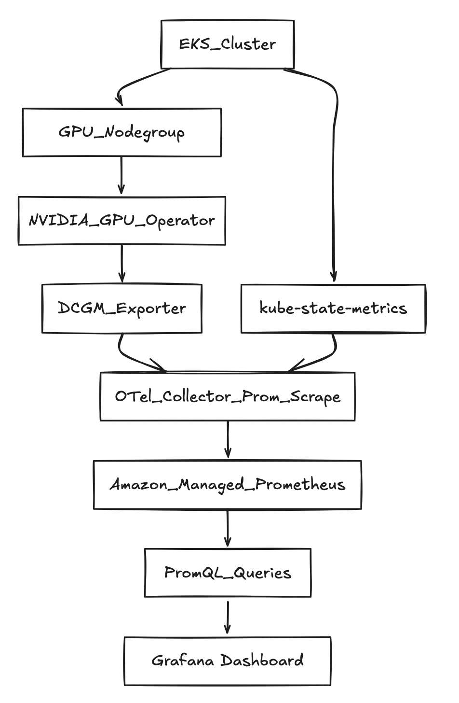

# EKS cluster wide GPU Cost Attribution

இந்த post **Amazon EKS**-ல் **GPU slice cost allocation**-க்கான end-to-end proof of concept (PoC)-ஐ விவரிக்கிறது.

---

## சிக்கல் அறிக்கை

பல tenants GPU capacity-ஐ (எ.கா., **MIG slices**) பகிர்ந்து கொள்ளும்போது, நீங்கள் பதிலளிக்க வேண்டியவை:

- **யார் எந்த share-ஐ கோரினார்கள்** GPU-வின் (pod / namespace / BU மூலம்)?
- **யார் உண்மையில் GPU-ஐ பயன்படுத்தினார்கள்** (எவ்வளவு)?
- **$12 per GPU-hour** போன்ற "public" price கொடுக்கப்பட்டால், எவ்வாறு கணக்கிடுவது:
  - **Allocated cost** (requested share அடிப்படையில்)
  - **Effective cost** (observed utilization அடிப்படையில்)
  - **Waste** (allocated minus effective)


---

## Architecture (உயர் நிலை)

	

---

## முன்நிபந்தனைகள்

### AWS + EKS முன்நிபந்தனைகள்
- பின்வருவனவற்றை உருவாக்க அனுமதி கொண்ட AWS account:
  - EKS clusters + nodegroups
  - IAM roles for service accounts (IRSA)
  - AMP workspace
- உங்கள் region-ல் **GPU instances இயக்க Quota மற்றும் AZ capacity**

---

## பயன்படுத்தப்படும் Variables

```bash
export AWS_REGION="us-west-2"
export CLUSTER_NAME="gpu-cost-poc"
export AMP_ALIAS="gpu-cost-poc"

# Public/benchmark price you want to demonstrate (not CUR yet)
export GPU_HOURLY_RATE="12"

# MIG profile for the PoC (eg: A100 40GB commonly supports 1g.5gb with 7 slices/GPU)
export MIG_PROFILE_LABEL="all-1g.5gb"

# IMPORTANT: in this PoC, MIG slices were exposed as nvidia.com/gpu (1 "gpu" == 1 MIG slice)
export MIG_RESOURCE_KEY="nvidia.com/gpu"

# For 1g.5gb on A100: typically 7 slices per physical GPU
export SLICES_PER_GPU="7"

# kube-state-metrics may "sanitize" extended resource names
export KSM_RESOURCE_REGEX='nvidia.*(gpu|mig).*'
```

---

## படிப்படியான வழிமுறைகள்
---

### படி 1 — EKS cluster உருவாக்குதல்

உங்கள் `eksctl` ஆதரிக்கும் versions-ஐ பட்டியலிடுங்கள்:

```bash
eksctl utils describe cluster-versions
```

Cluster-ஐ உருவாக்குங்கள் (ஆதரிக்கப்படும் default-ஐ `eksctl` தேர்வு செய்ய `--version`-ஐ தவிர்க்கவும்):

```bash
eksctl create cluster \
  --name "$CLUSTER_NAME" \
  --region "$AWS_REGION" \
  --managed
```

---

### படி 2 — "system" nodegroup சேர்த்தல் (பரிந்துரைக்கப்படுகிறது)

CoreDNS மற்றும் operators-ஐ விலையுயர்ந்த GPU nodes-லிருந்து தள்ளி வைக்கிறது.

```bash
eksctl create nodegroup \
  --cluster "$CLUSTER_NAME" \
  --region "$AWS_REGION" \
  --name "system-ng" \
  --node-type "m5.large" \
  --nodes 2 --nodes-min 2 --nodes-max 3
```


---

### படி 3 — GPU nodegroup சேர்த்தல்


```bash
eksctl create nodegroup \
  --cluster "$CLUSTER_NAME" \
  --region "$AWS_REGION" \
  --name "gpu-ng-ubuntu" \
  --node-type "p4d.24xlarge" \
  --node-ami-family "Ubuntu2204" \
  --install-nvidia-plugin=false \
  --nodes 1 --nodes-min 1 --nodes-max 1 \
  --node-labels "workload=gpu"
```

GPU workloads மட்டுமே schedule ஆகும்படி taint apply செய்யுங்கள்:

```bash
kubectl taint nodes -l workload=gpu nvidia.com/gpu=present:NoSchedule --overwrite
```

---

### படி 4 — NVIDIA GPU Operator நிறுவுதல் (MIG enabled)

```bash
helm repo add nvidia https://helm.ngc.nvidia.com/nvidia
helm repo update

helm upgrade --install gpu-operator nvidia/gpu-operator \
  -n gpu-operator --create-namespace \
  --set mig.strategy=single
```

---

### படி 5 — GPU node(s)-ல் MIG profile enable செய்தல்

தற்போதைய MIG labels-ஐ சரிபாருங்கள்:

```bash
kubectl get nodes -l workload=gpu -o jsonpath='{range .items[*]}{.metadata.name}{"\t"}{.metadata.labels.nvidia\.com/mig\.capable}{"\t"}{.metadata.labels.nvidia\.com/mig\.config}{"\t"}{.metadata.labels.nvidia\.com/mig\.config\.state}{"\n"}{end}'
```

MIG geometry apply செய்யுங்கள்:

```bash
kubectl label nodes -l workload=gpu nvidia.com/mig.config="$MIG_PROFILE_LABEL" --overwrite
```

வெற்றிக்காக காத்திருங்கள்:

```bash
kubectl get nodes -l workload=gpu -o jsonpath='{range .items[*]}{.metadata.name}{"\t"}{.metadata.labels.nvidia\.com/mig\.config}{"\t"}{.metadata.labels.nvidia\.com/mig\.config\.state}{"\n"}{end}'
```

---

### படி 6 — AMP workspace உருவாக்குதல்

```bash
aws amp create-workspace --alias "$AMP_ALIAS" --region "$AWS_REGION"

export AMP_WORKSPACE_ID="$(aws amp list-workspaces --region "$AWS_REGION" --query "workspaces[?alias=='$AMP_ALIAS'].workspaceId | [0]" --output text)"
export AMP_ENDPOINT="$(aws amp describe-workspace --workspace-id "$AMP_WORKSPACE_ID" --region "$AWS_REGION" --query "workspace.prometheusEndpoint" --output text)"

echo "$AMP_WORKSPACE_ID"
echo "$AMP_ENDPOINT"
```

---

### படி 7 — ingest + query-க்கான IRSA

```bash
eksctl utils associate-iam-oidc-provider \
  --cluster "$CLUSTER_NAME" \
  --region "$AWS_REGION" \
  --approve

eksctl create iamserviceaccount \
  --cluster "$CLUSTER_NAME" --region "$AWS_REGION" \
  --name amp-ingest --namespace observability \
  --attach-policy-arn arn:aws:iam::aws:policy/AmazonPrometheusRemoteWriteAccess \
  --approve --override-existing-serviceaccounts

eksctl create iamserviceaccount \
  --cluster "$CLUSTER_NAME" --region "$AWS_REGION" \
  --name amp-query --namespace observability \
  --attach-policy-arn arn:aws:iam::aws:policy/AmazonPrometheusQueryAccess \
  --approve --override-existing-serviceaccounts
```


---

### படி 8 — kube-state-metrics நிறுவுதல்

```bash
helm repo add prometheus-community https://prometheus-community.github.io/helm-charts
helm repo update

helm upgrade --install kube-state-metrics prometheus-community/kube-state-metrics \
  -n kube-system
```

---

### படி 9 — OTel collector Deploy செய்தல் (Prometheus scrape → AMP remote_write)


```bash
kubectl -n observability patch configmap amp-scraper-otel-env --type merge -p "$(cat <<PATCH
{
  "data": {
    "AWS_REGION": "${AWS_REGION}",
    "AMP_ENDPOINT": "${AMP_ENDPOINT}"
  }
}
PATCH
)"

kubectl -n observability rollout restart deploy/amp-scraper-otel
kubectl -n observability rollout status deploy/amp-scraper-otel
```


---

### படி 10 — மூன்று BU workloads Deploy செய்தல் (3/2/2 slices)

BU namespaces + deployments apply செய்யுங்கள்.
**முக்கிய விவரம்:** ஒவ்வொரு pod-க்கும் `nvidia.com/gpu: 1` request செய்யுங்கள் (ஏனெனில் MIG slices இங்கே `nvidia.com/gpu` ஆக expose செய்யப்படுகின்றன).

---

## Queries: allocation, utilization, effective cost, waste

### 1) Namespace (BU) வாரியாக Requested slices

```bash
Q='sum by (namespace) (kube_pod_container_resource_requests{resource=~"nvidia.*(gpu|mig).*",unit="integer"})'
ENCODED="$(python3 -c 'import urllib.parse,sys; print(urllib.parse.quote(sys.argv[1]))' "$Q")"

awscurl --service aps --region "$AWS_REGION" \
  -X POST "${AMP_ENDPOINT}api/v1/query" \
  -H "Content-Type: application/x-www-form-urlencoded" \
  -d "query=${ENCODED}"
```

கவனிக்கப்பட்ட output:

```json
{"namespace":"bu-a","value":[...,"3"]}
{"namespace":"bu-b","value":[...,"2"]}
{"namespace":"bu-c","value":[...,"2"]}
```

### 2) GPU utilization metric-ஐ கண்டறிதல்

Metric names-ஐ பட்டியலிடுங்கள்:

```bash
awscurl --service aps --region "$AWS_REGION" \
  "${AMP_ENDPOINT}api/v1/label/__name__/values" \
| python3 -c 'import sys,json; j=json.load(sys.stdin); print("\n".join(j["data"]))' \
| egrep -i "dcgm.*util|DCGM.*UTIL|gr_engine_active|sm_active" \
| head -n 30
```

நாங்கள் கண்டறிந்தது:

```text
DCGM_FI_PROF_GR_ENGINE_ACTIVE
```

### 3) Utilization fraction (scalar)

```bash
Q='scalar(avg(DCGM_FI_PROF_GR_ENGINE_ACTIVE)/100)'
ENCODED="$(python3 -c 'import urllib.parse,sys; print(urllib.parse.quote(sys.argv[1]))' "$Q")"

awscurl --service aps --region "$AWS_REGION" \
  -X POST "${AMP_ENDPOINT}api/v1/query" \
  -H "Content-Type: application/x-www-form-urlencoded" \
  -d "query=${ENCODED}"
```

உதாரணம் (low load case):

```json
{"resultType":"scalar","result":[...,"0.0004539326785714286"]}
```

### 4) Allocation math (per hour)

BU வாரியாக Allocated $/hr:

```promql
allocated_usd_per_hr =
sum by (namespace) (kube_pod_container_resource_requests{resource=~"nvidia.*(gpu|mig).*",unit="integer"})
* (GPU_HOURLY_RATE / SLICES_PER_GPU)
```

Constants \(12/7\)-உடன்:

```bash
Q='sum by (namespace) (kube_pod_container_resource_requests{resource=~"nvidia.*(gpu|mig).*",unit="integer"}) * (12/7)'
ENCODED="$(python3 -c 'import urllib.parse,sys; print(urllib.parse.quote(sys.argv[1]))' "$Q")"

awscurl --service aps --region "$AWS_REGION" \
  -X POST "${AMP_ENDPOINT}api/v1/query" \
  -H "Content-Type: application/x-www-form-urlencoded" \
  -d "query=${ENCODED}"
```

இது கதையுடன் பொருந்துகிறது:
- BU-A: \(3/7 × 12 = 5.142857\) $/hr
- BU-B: \(2/7 × 12 = 3.428571\) $/hr
- BU-C: \(2/7 × 12 = 3.428571\) $/hr

### 5) Effective $/hr மற்றும் Waste $/hr

முக்கிய புள்ளி: utilization ஒரு **scalar** ஆகும், allocation ஒரு **namespace-labeled vector** ஆகும். Prometheus "broadcast" செய்ய `scalar(...)` பயன்படுத்துங்கள்.

Effective $/hr:

```bash
Q='(sum by (namespace) (kube_pod_container_resource_requests{resource=~"nvidia.*(gpu|mig).*",unit="integer"}) * (12/7))
   * scalar(clamp_min(clamp_max(avg(DCGM_FI_PROF_GR_ENGINE_ACTIVE)/100, 1), 0))'
ENCODED="$(python3 -c 'import urllib.parse,sys; print(urllib.parse.quote(sys.argv[1]))' "$Q")"

awscurl --service aps --region "$AWS_REGION" \
  -X POST "${AMP_ENDPOINT}api/v1/query" \
  -H "Content-Type: application/x-www-form-urlencoded" \
  -d "query=${ENCODED}"
```

நாங்கள் பார்த்த உதாரண output:

```json
{"namespace":"bu-a","value":[...,"0.002325599081632653"]}
{"namespace":"bu-b","value":[...,"0.0015503993877551022"]}
{"namespace":"bu-c","value":[...,"0.0015503993877551022"]}
```

Waste $/hr:

```bash
Q='(sum by (namespace) (kube_pod_container_resource_requests{resource=~"nvidia.*(gpu|mig).*",unit="integer"}) * (12/7))
 - (
    (sum by (namespace) (kube_pod_container_resource_requests{resource=~"nvidia.*(gpu|mig).*",unit="integer"}) * (12/7))
    * scalar(clamp_min(clamp_max(avg(DCGM_FI_PROF_GR_ENGINE_ACTIVE)/100, 1), 0))
   )'
ENCODED="$(python3 -c 'import urllib.parse,sys; print(urllib.parse.quote(sys.argv[1]))' "$Q")"

awscurl --service aps --region "$AWS_REGION" \
  -X POST "${AMP_ENDPOINT}api/v1/query" \
  -H "Content-Type: application/x-www-form-urlencoded" \
  -d "query=${ENCODED}"
```

நாங்கள் பார்த்த உதாரண output:

```json
{"namespace":"bu-a","value":[...,"5.14053154377551"]}
{"namespace":"bu-b","value":[...,"3.427021029183673"]}
{"namespace":"bu-c","value":[...,"3.427021029183673"]}
```

---

## Amazon Managed Grafana (AMG): AMP-ன் மேல் dashboards

இந்த PoC-ஐ எளிதாக பகிர, விரைவான visualization layer **Amazon Managed Grafana (AMG)** ஆகும்.

### 1) AMG workspace உருவாக்குதல் (CLI)

```bash
aws grafana create-workspace \
  --name "${CLUSTER_NAME}-gpu-cost" \
  --region "${AWS_REGION}" \
  --authentication-providers AWS_SSO \
  --permission-type SERVICE_MANAGED \
  --workspace-data-sources PROMETHEUS
```

Workspace URL-ஐ பெறுங்கள்:

```bash
export AMG_WORKSPACE_ID="$(aws grafana list-workspaces --region "${AWS_REGION}" --query "workspaces[?name=='${CLUSTER_NAME}-gpu-cost'].id | [0]" --output text)"
aws grafana describe-workspace --region "${AWS_REGION}" --workspace-id "${AMG_WORKSPACE_ID}" \
  --query "workspace.{status:status,endpoint:endpoint,roleArn:iamRoleArn}" --output yaml
```


### 2) AMG-க்கு AMP query செய்ய அனுமதி

```bash
export AMG_ROLE_ARN="$(aws grafana describe-workspace --region "${AWS_REGION}" --workspace-id "${AMG_WORKSPACE_ID}" --query "workspace.iamRoleArn" --output text)"
ROLE_NAME="$(basename "$AMG_ROLE_ARN")"
aws iam attach-role-policy --role-name "$ROLE_NAME" --policy-arn arn:aws:iam::aws:policy/AmazonPrometheusQueryAccess
```

### 3) AMP-ஐ Prometheus data source-ஆக சேர்த்தல் (Grafana UI)

AMG UI-ல்:
- **Connections → Data sources → Add data source → Prometheus**
- **URL**: `https://aps-workspaces.${AWS_REGION}.amazonaws.com/workspaces/${AMP_WORKSPACE_ID}`
- **SigV4**: enabled
  - **Region**: `${AWS_REGION}`
  - **Service**: `aps`
- **Save & test**

### 4) Starter panels (PromQL)

**BU/namespace வாரியாக Requested slices**

```promql
sum by (namespace) (
  kube_pod_container_resource_requests{resource=~"nvidia.*(gpu|mig).*",unit="integer"}
)
```

**BU/namespace வாரியாக Allocated $/hr (12/7 constants)**

```promql
sum by (namespace) (
  kube_pod_container_resource_requests{resource=~"nvidia.*(gpu|mig).*",unit="integer"}
) * (12/7)
```

**Utilization fraction scalar (cluster-level proxy)**

```promql
scalar(avg(DCGM_FI_PROF_GR_ENGINE_ACTIVE)/100)
```

**Effective $/hr (proxy)**

```promql
(sum by (namespace) (
  kube_pod_container_resource_requests{resource=~"nvidia.*(gpu|mig).*",unit="integer"}
) * (12/7))
* scalar(clamp_min(clamp_max(avg(DCGM_FI_PROF_GR_ENGINE_ACTIVE)/100, 1), 0))
```

**Waste $/hr (proxy)**

```promql
(sum by (namespace) (
  kube_pod_container_resource_requests{resource=~"nvidia.*(gpu|mig).*",unit="integer"}
) * (12/7))
-
((sum by (namespace) (
  kube_pod_container_resource_requests{resource=~"nvidia.*(gpu|mig).*",unit="integer"}
) * (12/7))
* scalar(clamp_min(clamp_max(avg(DCGM_FI_PROF_GR_ENGINE_ACTIVE)/100, 1), 0)))
```

---

## கற்றுக்கொண்டவை மற்றும் அடுத்த மேம்பாடுகள்

### இந்த PoC நிரூபிப்பது
- Requests declare செய்யப்பட்டு (BU வாரியாக slices) எளிய constant-உடன் priced செய்யப்படும்போது **Allocation நேரடியானது**.
- MIG-உடன், **requested slices cost shares-க்கு சுத்தமாக map ஆகின்றன**.
- Idle slices-க்கான மோசமான ROI-ஐ காட்ட "allocated minus effective" ஆக **waste**-ஐ கணக்கிடலாம்.

### இந்த PoC-ல் "approximate" ஆனவை
- MIG-உடன், versions/config-ஐ பொறுத்து DCGM metrics-ல் **per-pod GPU utilization labels இருக்காது**.
- இந்த PoC "actual usage" per BU-க்கு proxy-ஆக **cluster-level utilization scalar**-ஐ பயன்படுத்தியது.

### Production-grade ஆக்க அடுத்த படிகள்
- **True per-pod attribution**:
  - per-pod GPU usage exporter சேர்க்கவும் (assigned MIG device-ஐ படித்து pod labels-உடன் utilization report செய்வது), அல்லது
  - NVIDIA device plugin / runtime-லிருந்து scheduler/device mapping integrate செய்யவும்
- **Real pricing**:
  - constant $/GPU-hour-ஐ AWS CUR அல்லது on-demand price APIs-உடன் மாற்றவும்
- **Dashboards**:
  - AMP-ஐ Grafana-வுடன் plug செய்து BU வாரியாக `allocated`, `effective` மற்றும் `waste`-ஐ காலப்போக்கில் chart செய்யவும்

---

## Cleanup

PoC முடிந்ததும், orphaned infrastructure மற்றும் தொடர்ச்சியான charges-ஐ தவிர்க்க அனைத்து resources-ஐயும் reverse dependency order-ல் delete செய்யுங்கள்.

### 1) BU workloads Delete செய்தல்

```bash
kubectl delete namespace bu-a bu-b bu-c
```

### 2) OTel collector Delete செய்தல்

```bash
kubectl delete namespace observability
```

### 3) kube-state-metrics Uninstall செய்தல்

```bash
helm uninstall kube-state-metrics -n kube-system
```

### 4) NVIDIA GPU Operator Uninstall செய்தல்

```bash
helm uninstall gpu-operator -n gpu-operator
kubectl delete namespace gpu-operator
```

### 5) Amazon Managed Grafana workspace Delete செய்தல்

```bash
aws grafana delete-workspace \
  --workspace-id "$AMG_WORKSPACE_ID" \
  --region "$AWS_REGION"
```

### 6) AMG IAM policy Detach செய்தல்

```bash
ROLE_NAME="$(basename "$AMG_ROLE_ARN")"
aws iam detach-role-policy \
  --role-name "$ROLE_NAME" \
  --policy-arn arn:aws:iam::aws:policy/AmazonPrometheusQueryAccess
```

### 7) AMP workspace Delete செய்தல்

```bash
aws amp delete-workspace \
  --workspace-id "$AMP_WORKSPACE_ID" \
  --region "$AWS_REGION"
```

### 8) IRSA service accounts Delete செய்தல்

```bash
eksctl delete iamserviceaccount \
  --cluster "$CLUSTER_NAME" --region "$AWS_REGION" \
  --name amp-ingest --namespace observability

eksctl delete iamserviceaccount \
  --cluster "$CLUSTER_NAME" --region "$AWS_REGION" \
  --name amp-query --namespace observability
```

### 9) Nodegroups Delete செய்தல்

```bash
eksctl delete nodegroup \
  --cluster "$CLUSTER_NAME" --region "$AWS_REGION" \
  --name gpu-ng-ubuntu

eksctl delete nodegroup \
  --cluster "$CLUSTER_NAME" --region "$AWS_REGION" \
  --name system-ng
```

### 10) EKS cluster Delete செய்தல்

```bash
eksctl delete cluster \
  --name "$CLUSTER_NAME" \
  --region "$AWS_REGION"
```

:::tip
`eksctl delete cluster` OIDC provider-ஐயும் தனித்தனியாக delete செய்யப்படாத remaining nodegroups-ஐயும் நீக்குகிறது. இருப்பினும், nodegroups-ஐ முதலில் delete செய்வது CloudFormation stack deletion-ல் குறைவான retries-உடன் சுத்தமான teardown-ஐ உறுதிசெய்கிறது.
:::

---
###### @author: Siva Guruvareddiar
