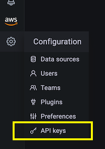

# Amazon Managed Grafana தானியங்குமாக்கலுக்கு Terraform பயன்படுத்துதல்

இந்த ரெசிபியில் Amazon Managed Grafana-ஐ தானியங்குமாக்க Terraform-ஐ எவ்வாறு பயன்படுத்துவது என்பதைக் காட்டுகிறோம், உதாரணமாக பல workspace-களில் நிலையாக datasource-கள் அல்லது டாஷ்போர்டுகளைச் சேர்ப்பது.

:::note
    இந்த வழிகாட்டியை முடிக்க சுமார் 30 நிமிடங்கள் ஆகும்.
:::
## முன்நிபந்தனைகள்

* [AWS command line][aws-cli] உங்கள் உள்ளூர் சூழலில் நிறுவப்பட்டு [கட்டமைக்கப்பட்டிருக்க][aws-cli-conf] வேண்டும்.
* உங்கள் உள்ளூர் சூழலில் [Terraform][tf] கட்டளை வரி நிறுவப்பட்டிருக்க வேண்டும்.
* Amazon Managed Service for Prometheus workspace பயன்படுத்தத் தயாராக இருக்க வேண்டும்.
* Amazon Managed Grafana workspace பயன்படுத்தத் தயாராக இருக்க வேண்டும்.

## Amazon Managed Grafana-ஐ அமைத்தல்

Terraform Grafana-க்கு எதிராக [அங்கீகரிக்க][grafana-authn], நாங்கள் ஒரு API Key பயன்படுத்துகிறோம், இது ஒரு வகையான கடவுச்சொல்லாக செயல்படுகிறது.

:::info
    API key என்பது [RFC 6750][rfc6750] HTTP Bearer header ஆகும், இது 51 எழுத்துகள் கொண்ட ஆல்ஃபா-நியூமெரிக் மதிப்பைக் கொண்டு Grafana API-க்கு எதிரான ஒவ்வொரு கோரிக்கையிலும் அழைப்பாளரை அங்கீகரிக்கிறது.
:::

எனவே, Terraform manifest-ஐ அமைப்பதற்கு முன், முதலில் ஒரு API key-ஐ உருவாக்க வேண்டும். இதை நீங்கள் Grafana UI வழியாக பின்வருமாறு செய்யலாம்.

முதலில், இடது பக்க மெனுவில் `Configuration` பிரிவில் `API keys` மெனு உருப்படியைத் தேர்ந்தெடுக்கவும்:



இப்போது புதிய API key-ஐ உருவாக்கி, உங்கள் பணிக்கு பொருத்தமான பெயரைக் கொடுங்கள், `Admin` பாத்திரத்தை ஒதுக்கி, கால அவகாசத்தை, உதாரணமாக ஒரு நாளாக அமைக்கவும்:


:::note
    API key குறிப்பிட்ட காலத்திற்கு மட்டுமே செல்லுபடியாகும், AMG-யில் 30 நாட்கள் வரை மதிப்புகளைப் பயன்படுத்தலாம்.
:::
`Add` பொத்தானை அழுத்தியவுடன் API key-ஐ கொண்ட ஒரு pop-up உரையாடலைக் காணலாம்:


:::warning
    API key-ஐ நீங்கள் இந்த ஒரு முறை மட்டுமே பார்ப்பீர்கள், எனவே இதை பாதுகாப்பான இடத்தில் சேமித்து வையுங்கள், பின்னர் Terraform manifest-இல் இது தேவைப்படும்.
:::
இதன் மூலம் Amazon Managed Grafana-வில் Terraform தானியங்குமாக்கலுக்குத் தேவையான அனைத்தையும் அமைத்துள்ளோம், இப்போது அடுத்த படிக்குச் செல்வோம்.

## Terraform மூலம் தானியங்குமாக்கல்

### Terraform-ஐ தயார் செய்தல்

Terraform Grafana-வுடன் தொடர்பு கொள்ள, அதிகாரபூர்வ [Grafana provider][tf-grafana-provider]-ஐ பதிப்பு 1.13.3 அல்லது அதற்கு மேல் பயன்படுத்துகிறோம்.

பின்வரும் எடுத்துக்காட்டில், data source உருவாக்கத்தை தானியங்குமாக்க விரும்புகிறோம், குறிப்பாக Prometheus [data source][tf-ds]-ஐ, அதாவது AMP workspace-ஐ சேர்க்க விரும்புகிறோம்.

முதலில், பின்வரும் உள்ளடக்கத்துடன் `main.tf` என்ற கோப்பை உருவாக்கவும்:

```
terraform {
  required_providers {
    grafana = {
      source  = "grafana/grafana"
      version = ">= 1.13.3"
    }
  }
}

provider "grafana" {
  url  = "INSERT YOUR GRAFANA WORKSPACE URL HERE"
  auth = "INSERT YOUR API KEY HERE"
}

resource "grafana_data_source" "prometheus" {
  type          = "prometheus"
  name          = "amp"
  is_default    = true
  url           = "INSERT YOUR AMP WORKSPACE URL HERE "
  json_data {
	http_method     = "POST"
	sigv4_auth      = true
	sigv4_auth_type = "workspace-iam-role"
	sigv4_region    = "eu-west-1"
  }
}
```
மேலே உள்ள கோப்பில் உங்கள் சூழலைப் பொறுத்து மூன்று மதிப்புகளைச் செருக வேண்டும்.

Grafana provider பிரிவில்:

* `url` ... Grafana workspace URL, இது பின்வருமாறு இருக்கும்:
      `https://xxxxxxxx.grafana-workspace.eu-west-1.amazonaws.com`.
* `auth` ... முந்தைய படியில் நீங்கள் உருவாக்கிய API key.

Prometheus resource பிரிவில், `url`-ஐ செருகவும், இது AMP workspace URL ஆகும், இதன் வடிவம்:
`https://aps-workspaces.eu-west-1.amazonaws.com/workspaces/ws-xxxxxxxxx`.

:::note
    நீங்கள் Amazon Managed Grafana-ஐ கோப்பில் காட்டப்பட்ட region-ஐ விட வேறு region-ல் பயன்படுத்தினால், மேற்கண்டவற்றுடன் கூடுதலாக `sigv4_region`-ஐயும் உங்கள் region-க்கு மாற்ற வேண்டும்.
:::
தயாரிப்பு கட்டத்தை முடிக்க, இப்போது Terraform-ஐ துவக்குவோம்:

```
$ terraform init
Initializing the backend...

Initializing provider plugins...
- Finding grafana/grafana versions matching ">= 1.13.3"...
- Installing grafana/grafana v1.13.3...
- Installed grafana/grafana v1.13.3 (signed by a HashiCorp partner, key ID 570AA42029AE241A)

Partner and community providers are signed by their developers.
If you'd like to know more about provider signing, you can read about it here:
https://www.terraform.io/docs/cli/plugins/signing.html

Terraform has created a lock file .terraform.lock.hcl to record the provider
selections it made above. Include this file in your version control repository
so that Terraform can guarantee to make the same selections by default when
you run "terraform init" in the future.

Terraform has been successfully initialized!

You may now begin working with Terraform. Try running "terraform plan" to see
any changes that are required for your infrastructure. All Terraform commands
should now work.

If you ever set or change modules or backend configuration for Terraform,
rerun this command to reinitialize your working directory. If you forget, other
commands will detect it and remind you to do so if necessary.
```

இதன் மூலம், நாம் தயாராக இருக்கிறோம், பின்வரும் விளக்கத்தில் data source உருவாக்கத்தை தானியங்குமாக்க Terraform-ஐ பயன்படுத்தலாம்.

### Terraform பயன்படுத்துதல்

வழக்கமாக, முதலில் Terraform-இன் திட்டம் என்னவென்று பார்ப்பீர்கள், இவ்வாறு:

```
$ terraform plan

Terraform used the selected providers to generate the following execution plan. 
Resource actions are indicated with the following symbols:
  + create

Terraform will perform the following actions:

  # grafana_data_source.prometheus will be created
  + resource "grafana_data_source" "prometheus" {
      + access_mode        = "proxy"
      + basic_auth_enabled = false
      + id                 = (known after apply)
      + is_default         = true
      + name               = "amp"
      + type               = "prometheus"
      + url                = "https://aps-workspaces.eu-west-1.amazonaws.com/workspaces/ws-xxxxxx/"

      + json_data {
          + http_method     = "POST"
          + sigv4_auth      = true
          + sigv4_auth_type = "workspace-iam-role"
          + sigv4_region    = "eu-west-1"
        }
    }

Plan: 1 to add, 0 to change, 0 to destroy.

───────────────────────────────────────────────────────────────────────────────────────────────────────────────────────────────────────────────────────────────────────────

Note: You didn't use the -out option to save this plan, so Terraform can't guarantee to take exactly these actions if you run "terraform apply" now.

```

நீங்கள் பார்ப்பதில் திருப்தி அடைந்தால், திட்டத்தைப் பயன்படுத்தலாம்:

```
$ terraform apply

Terraform used the selected providers to generate the following execution plan. 
Resource actions are indicated with the following symbols:
  + create

Terraform will perform the following actions:

  # grafana_data_source.prometheus will be created
  + resource "grafana_data_source" "prometheus" {
      + access_mode        = "proxy"
      + basic_auth_enabled = false
      + id                 = (known after apply)
      + is_default         = true
      + name               = "amp"
      + type               = "prometheus"
      + url                = "https://aps-workspaces.eu-west-1.amazonaws.com/workspaces/ws-xxxxxxxxx/"

      + json_data {
          + http_method     = "POST"
          + sigv4_auth      = true
          + sigv4_auth_type = "workspace-iam-role"
          + sigv4_region    = "eu-west-1"
        }
    }

Plan: 1 to add, 0 to change, 0 to destroy.

Do you want to perform these actions?
  Terraform will perform the actions described above.
  Only 'yes' will be accepted to approve.

  Enter a value: yes

grafana_data_source.prometheus: Creating...
grafana_data_source.prometheus: Creation complete after 1s [id=10]

Apply complete! Resources: 1 added, 0 changed, 0 destroyed.

```

இப்போது Grafana-வில் data source பட்டியலுக்குச் சென்றால், பின்வருவது போன்ற ஒன்றைக் காணலாம்:


புதிதாக உருவாக்கிய data source வேலை செய்கிறதா என்பதைச் சரிபார்க்க, கீழே உள்ள நீல `Save & test` பொத்தானை அழுத்தலாம், அதன் விளைவாக `Data source is working` என்ற உறுதிப்படுத்தல் செய்தியைக் காண வேண்டும்.

Terraform-ஐ மற்ற விஷயங்களையும் தானியங்குமாக்கப் பயன்படுத்தலாம், உதாரணமாக, [Grafana provider][tf-grafana-provider] folders மற்றும் dashboards நிர்வகிப்பதை ஆதரிக்கிறது.

உதாரணமாக, உங்கள் டாஷ்போர்டுகளை ஒழுங்கமைக்க ஒரு folder உருவாக்க விரும்புகிறீர்கள் என்று வைத்துக்கொள்வோம்:

```
resource "grafana_folder" "examplefolder" {
  title = "devops"
}
```

மேலும், `example-dashboard.json` என்ற டாஷ்போர்டு இருக்கிறது, மேலே உள்ள folder-ல் இதை உருவாக்க விரும்பினால், பின்வரும் snippet-ஐ பயன்படுத்துவீர்கள்:

```
resource "grafana_dashboard" "exampledashboard" {
  folder = grafana_folder.examplefolder.id
  config_json = file("example-dashboard.json")
}
```

Terraform தானியங்குமாக்கலுக்கான சக்திவாய்ந்த கருவியாகும், இங்கே காட்டியது போல் உங்கள் Grafana resources-ஐ நிர்வகிக்க இதைப் பயன்படுத்தலாம்.

:::note
    எவ்வாறாயினும், Terraform-இல் [state][tf-state] இயல்பாகவே உள்ளூரில் நிர்வகிக்கப்படுகிறது என்பதை நினைவில் கொள்ளுங்கள். அதாவது, Terraform-ஐ கூட்டுறவாகப் பணியாற்ற திட்டமிட்டால், ஒரு குழுவிற்கு state-ஐ பகிர்ந்து கொள்ள கிடைக்கும் விருப்பங்களில் ஒன்றைத் தேர்ந்தெடுக்க வேண்டும்.
:::
## சுத்தம் செய்தல்

Amazon Managed Grafana workspace-ஐ console-ல் இருந்து நீக்குவதன் மூலம் அகற்றவும்.

[aws-cli]: https://docs.aws.amazon.com/cli/latest/userguide/cli-chap-install.html
[aws-cli-conf]: https://docs.aws.amazon.com/cli/latest/userguide/cli-chap-configure.html
[tf]: https://www.terraform.io/downloads.html
[grafana-authn]: https://grafana.com/docs/grafana/latest/http_api/auth/
[rfc6750]: https://datatracker.ietf.org/doc/html/rfc6750
[tf-grafana-provider]: https://registry.terraform.io/providers/grafana/grafana/latest/docs
[tf-ds]: https://registry.terraform.io/providers/grafana/grafana/latest/docs/resources/data_source
[tf-state]: https://www.terraform.io/docs/language/state/remote.html
