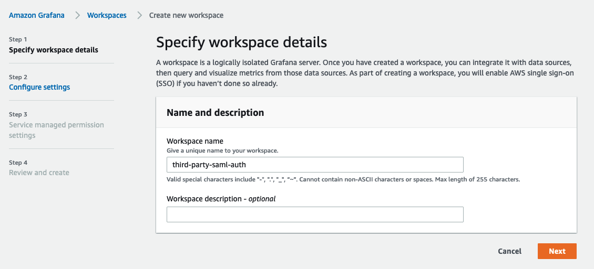

# SAML பயன்படுத்தி Amazon Managed Grafana-வுடன் Google Workspaces அங்கீகாரத்தை கட்டமைத்தல்

இந்த வழிகாட்டியில், SAML v2.0 நெறிமுறையைப் பயன்படுத்தி Amazon Managed Grafana-க்கு identity provider (IdP) ஆக Google Workspaces-ஐ எவ்வாறு அமைப்பது என்பதை விளக்குவோம்.

இந்த வழிகாட்டியைப் பின்பற்ற, [Amazon Managed Grafana workspace][amg-ws] உருவாக்கப்பட்டிருப்பதுடன் கூடுதலாக கட்டணம் செலுத்தப்பட்ட [Google Workspaces][google-workspaces] கணக்கை உருவாக்க வேண்டும்.

### Amazon Managed Grafana workspace உருவாக்குதல்

Amazon Managed Grafana console-ல் உள்நுழைந்து **Create workspace** என்பதைக் கிளிக் செய்யவும். பின்வரும் திரையில், கீழே காட்டப்பட்டுள்ளது போல் workspace பெயரை வழங்கவும். பின்னர் **Next** என்பதைக் கிளிக் செய்யவும்:

**Configure settings** பக்கத்தில், SAML அடிப்படையிலான Identity Provider-ஐ பயனர்கள் உள்நுழைவதற்கு கட்டமைக்க **Security Assertion Markup Language (SAML)** விருப்பத்தைத் தேர்ந்தெடுக்கவும்:

நீங்கள் தேர்ந்தெடுக்க விரும்பும் data sources-ஐ தேர்ந்தெடுத்து **Next** என்பதைக் கிளிக் செய்யவும்:

**Review and create** திரையில் **Create workspace** பொத்தானைக் கிளிக் செய்யவும்:

இது கீழே காட்டப்பட்டுள்ளது போல் புதிய Amazon Managed Grafana workspace-ஐ உருவாக்கும்:

### Google Workspaces-ஐ கட்டமைத்தல்

Super Admin அனுமதிகளுடன் Google Workspaces-ல் உள்நுழைந்து **Apps** பிரிவின் கீழ் **Web and mobile apps**-க்குச் செல்லவும். அங்கு **Add App** என்பதைக் கிளிக் செய்து **Add custom SAML app**-ஐ தேர்ந்தெடுக்கவும். இப்போது கீழே காட்டப்பட்டுள்ளது போல் app-க்கு ஒரு பெயரைக் கொடுங்கள். **CONTINUE** என்பதைக் கிளிக் செய்யவும்:

அடுத்த திரையில், SAML metadata கோப்பைப் பதிவிறக்க **DOWNLOAD METADATA** பொத்தானைக் கிளிக் செய்யவும். **CONTINUE** என்பதைக் கிளிக் செய்யவும்.

அடுத்த திரையில், ACS URL, Entity ID மற்றும் Start URL புலங்களைக் காண்பீர்கள்.
Amazon Managed Grafana console-இலிருந்து இந்தப் புலங்களுக்கான மதிப்புகளைப் பெறலாம்.

**Name ID format** புலத்தில் dropdown-இலிருந்து **EMAIL**-ஐ தேர்ந்தெடுத்து, **Name ID** புலத்தில் **Basic Information > Primary email**-ஐ தேர்ந்தெடுக்கவும்.

**CONTINUE** என்பதைக் கிளிக் செய்யவும்.

**Attribute mapping** திரையில், கீழே உள்ள screenshot-ல் காட்டப்பட்டுள்ளது போல் **Google Directory attributes** மற்றும் **App attributes** இடையே mapping-ஐ செய்யவும்

Google அங்கீகாரம் மூலம் உள்நுழையும் பயனர்கள் **Amazon Managed Grafana**-வில் **Admin** சலுகைகளைப் பெற, **Department** புலத்தின் மதிப்பை ***monitoring*** என அமைக்கவும். இதற்கு எந்தப் புலத்தையும் எந்த மதிப்பையும் தேர்வு செய்யலாம். Google Workspaces பக்கத்தில் நீங்கள் எதைப் பயன்படுத்த தேர்ந்தெடுத்தாலும், Amazon Managed Grafana SAML settings-ல் அதை பிரதிபலிக்கும் வகையில் mapping செய்யவும்.

### Amazon Managed Grafana-வில் SAML metadata-ஐ பதிவேற்றுதல்

இப்போது Amazon Managed Grafana console-ல், **Upload or copy/paste** விருப்பத்தைக் கிளிக் செய்து, முன்னர் Google Workspaces-இலிருந்து பதிவிறக்கிய SAML metadata கோப்பைப் பதிவேற்ற **Choose file** பொத்தானைத் தேர்வு செய்யவும்.

**Assertion mapping** பிரிவில், **Assertion attribute role** புலத்தில் **Department** என்றும் **Admin role values** புலத்தில் **monitoring** என்றும் தட்டச்சு செய்யவும்.
இது **Department** **monitoring** ஆக உள்நுழையும் பயனர்களுக்கு Grafana-வில் **Admin** சலுகைகளை வழங்கும், இதனால் அவர்கள் டாஷ்போர்டுகள் மற்றும் datasources உருவாக்குவது போன்ற நிர்வாகப் பணிகளைச் செய்ய முடியும்.

கீழே உள்ள screenshot-ல் காட்டப்பட்டுள்ளது போல் **Additional settings - optional** பிரிவின் கீழ் மதிப்புகளை அமைக்கவும். **Save SAML configuration** என்பதைக் கிளிக் செய்யவும்:

இப்போது Amazon Managed Grafana Google Workspaces மூலம் பயனர்களை அங்கீகரிக்க அமைக்கப்பட்டுள்ளது.

பயனர்கள் உள்நுழையும்போது, Google login பக்கத்திற்கு redirect செய்யப்படுவார்கள்:

தங்கள் credentials-ஐ உள்ளிட்ட பிறகு, கீழே உள்ள screenshot-ல் காட்டப்பட்டுள்ளது போல் Grafana-வில் உள்நுழைவார்கள்.

நீங்கள் பார்க்கிறபடி, பயனர் Google Workspaces அங்கீகாரத்தைப் பயன்படுத்தி Grafana-வில் வெற்றிகரமாக உள்நுழைய முடிந்தது.

[google-workspaces]: https://workspace.google.com/
[amg-ws]: https://docs.aws.amazon.com/grafana/latest/userguide/getting-started-with-AMG.html#AMG-getting-started-workspace
