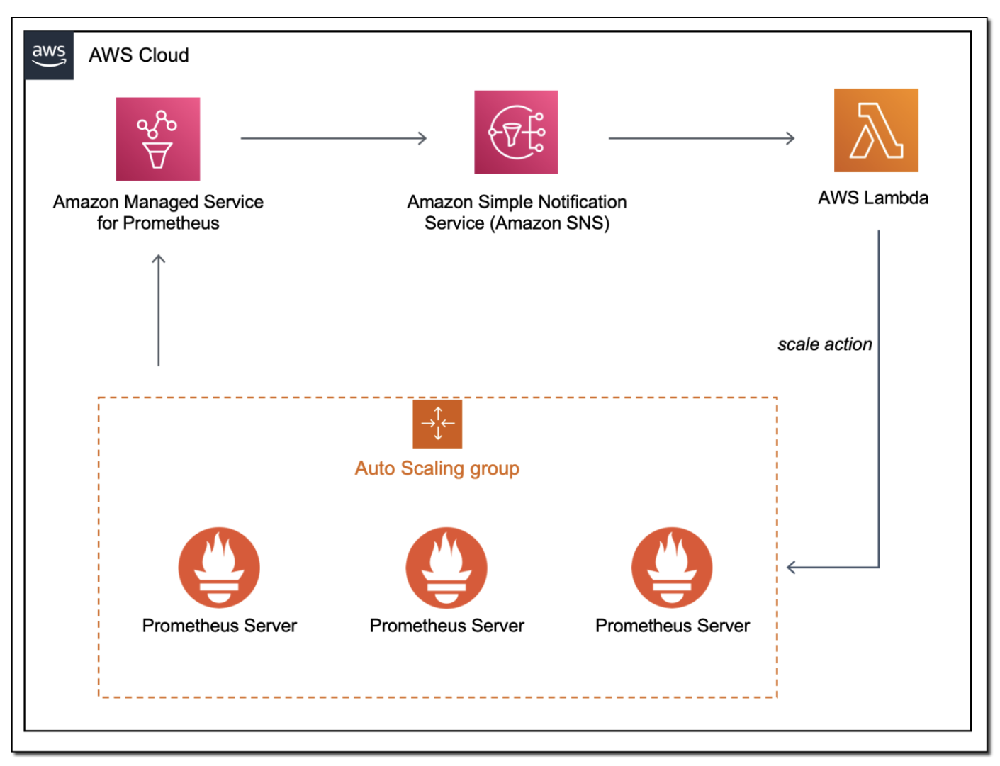

# Amazon Managed Service for Prometheus மற்றும் alert manager பயன்படுத்தி Amazon EC2 Auto-scaling

வாடிக்கையாளர்கள் தங்கள் ஏற்கனவே உள்ள Prometheus workloads-ஐ cloud-க்கு migrate செய்து cloud வழங்கும் அனைத்தையும் பயன்படுத்த விரும்புகிறார்கள். AWS-ல் Amazon [EC2 Auto Scaling](https://aws.amazon.com/ec2/autoscaling/) போன்ற சேவைகள் உள்ளன, இது CPU அல்லது memory utilization போன்ற மெட்ரிக்குகளின் அடிப்படையில் [Amazon Elastic Compute Cloud (Amazon EC2)](https://aws.amazon.com/pm/ec2/) instances-ஐ scale out செய்ய அனுமதிக்கிறது. Prometheus மெட்ரிக்குகளைப் பயன்படுத்தும் பயன்பாடுகள் தங்கள் monitoring stack-ஐ மாற்ற வேண்டியதில்லாமல் EC2 Auto Scaling-உடன் எளிதாக ஒருங்கிணைக்கலாம். இந்த இடுகையில், Amazon EC2 Auto Scaling-ஐ [Amazon Managed Service for Prometheus Alert Manager](https://aws.amazon.com/prometheus/)-உடன் வேலை செய்ய கட்டமைப்பதை விளக்குவேன்.

Amazon Managed Service for Prometheus [PromQL](https://prometheus.io/docs/prometheus/latest/querying/basics/) பயன்படுத்தும் [alerting rules](https://docs.aws.amazon.com/prometheus/latest/userguide/AMP-Ruler.html)-க்கு ஆதரவு வழங்குகிறது.

## தீர்வு கண்ணோட்டம்

முதலில், Amazon EC2 Auto Scaling-இன் [Auto Scaling group](https://docs.aws.amazon.com/autoscaling/ec2/userguide/auto-scaling-groups.html) concept-ஐ சுருக்கமாக மதிப்பாய்வு செய்வோம் - இது Amazon EC2 instances-இன் logical collection ஆகும்.

இந்த தீர்வை நிரூபிக்க, இரண்டு Amazon EC2 instances கொண்ட Amazon EC2 Auto Scaling group-ஐ உருவாக்கியுள்ளேன். இந்த instances Amazon Managed Service for Prometheus workspace-க்கு [instance metrics-ஐ remote write](https://docs.aws.amazon.com/prometheus/latest/userguide/AMP-onboard-ingest-metrics-remote-write-EC2.html) செய்கின்றன.

இந்த rules set `HostHighCpuLoad` மற்றும் `HostLowCpuLoad` rules-ஐ உருவாக்குகிறது:

` YAML `
```
groups:
- name: example
  rules:
  - alert: HostHighCpuLoad
    expr: 100 - (avg(rate(node_cpu_seconds_total{mode="idle"}[2m])) * 100) > 60
    for: 5m
    labels:
      severity: warning
      event_type: scale_up
    annotations:
      summary: Host high CPU load (instance {{ $labels.instance }})
      description: "CPU load is > 60%\n  VALUE = {{ $value }}\n  LABELS = {{ $labels }}"
  - alert: HostLowCpuLoad
    expr: 100 - (avg(rate(node_cpu_seconds_total{mode="idle"}[2m])) * 100) < 30
    for: 5m
    labels:
      severity: warning
      event_type: scale_down
    annotations:
      summary: Host low CPU load (instance {{ $labels.instance }})
      description: "CPU load is < 30%\n  VALUE = {{ $value }}\n  LABELS = {{ $labels }}"

```

Alert எழுப்பிய பிறகு, alert manager `alert_type` (alert name) மற்றும் `event_type` (scale_down அல்லது scale_up) pass செய்து Amazon SNS topic-க்கு message-ஐ forward செய்யும்.

` YAML `
```
alertmanager_config: |
  route: 
    receiver: default_receiver
    repeat_interval: 5m
        
  receivers:
    - name: default_receiver
      sns_configs:
        - topic_arn: <ARN OF SNS TOPIC GOES HERE>
          send_resolved: false
          sigv4:
            region: us-east-1
          message: |
            alert_type: {{ .CommonLabels.alertname }}
            event_type: {{ .CommonLabels.event_type }}

```

Amazon SNS topic-க்கு subscribe செய்யப்பட்ட AWS [Lambda](https://aws.amazon.com/lambda/) function, SNS message-ஐ inspect செய்து `scale_up` அல்லது `scale_down` event நடக்க வேண்டுமா என்பதை தீர்மானிக்கிறது.

Lambda code பின்வருமாறு:

` Python `
```
import json
import boto3
import os

def lambda_handler(event, context):
    print(event)
    msg = event['Records'][0]['Sns']['Message']
    
    scale_type = ''
    if msg.find('scale_up') > -1:
        scale_type = 'scale_up'
    else:
        scale_type = 'scale_down'
    
    get_desired_instance_count(scale_type)
    
def get_desired_instance_count(scale_type):
    
    client = boto3.client('autoscaling')
    asg_name = os.environ['ASG_NAME']
    response = client.describe_auto_scaling_groups(AutoScalingGroupNames=[ asg_name])

    minSize = response['AutoScalingGroups'][0]['MinSize']
    maxSize = response['AutoScalingGroups'][0]['MaxSize']
    desiredCapacity = response['AutoScalingGroups'][0]['DesiredCapacity']
    
    if scale_type == "scale_up":
        desiredCapacity = min(desiredCapacity+1, maxSize)
    if scale_type == "scale_down":
        desiredCapacity = max(desiredCapacity - 1, minSize)
    
    print('Scale type: {}; new capacity: {}'.format(scale_type, desiredCapacity))
    response = client.set_desired_capacity(AutoScalingGroupName=asg_name, DesiredCapacity=desiredCapacity, HonorCooldown=False)

```

முழு architecture-ஐ பின்வரும் படத்தில் பார்க்கலாம்.



## தீர்வை சோதித்தல்

இந்த தீர்வை தானாக provision செய்ய AWS CloudFormation template-ஐ launch செய்யலாம்.

Stack முன்நிபந்தனைகள்:

* [Amazon Virtual Private Cloud (Amazon VPC)](https://aws.amazon.com/vpc/)
* Outbound traffic அனுமதிக்கும் AWS Security Group

Download Launch Stack Template link-ஐ தேர்ந்தெடுத்து உங்கள் கணக்கில் template-ஐ பதிவிறக்கி அமைக்கவும்.

[## Download Launch Stack Template ](https://prometheus-autoscale.s3.amazonaws.com/prometheus-autoscale.template)


Stack deploy ஆக சுமார் எட்டு நிமிடங்கள் ஆகும். EC2 instances-க்கு load apply செய்ய [AWS Systems Manager Run Command](https://docs.aws.amazon.com/systems-manager/latest/userguide/execute-remote-commands.html) மற்றும் [AWSFIS-Run-CPU-Stress automation document](https://docs.aws.amazon.com/fis/latest/userguide/actions-ssm-agent.html#awsfis-run-cpu-stress) பயன்படுத்தலாம்.


## செலவுகள்

Amazon Managed Service for Prometheus உட்செலுத்தப்பட்ட மெட்ரிக்குகள், சேமிக்கப்பட்ட மெட்ரிக்குகள் மற்றும் வினவப்பட்ட மெட்ரிக்குகளின் அடிப்படையில் விலை நிர்ணயிக்கப்படுகிறது. [Amazon Managed Service for Prometheus pricing page](https://aws.amazon.com/prometheus/pricing/)-ஐ பார்க்கவும்.

## முடிவுரை

Amazon Managed Service for Prometheus, alert manager, Amazon SNS மற்றும் Lambda பயன்படுத்தி Amazon EC2 Auto Scaling group-இன் scaling activities-ஐ கட்டுப்படுத்தலாம். பயன்பாட்டிற்கு load அதிகரிக்கும்போது, தேவையை பூர்த்தி செய்ய seamlessly scale ஆகிறது.

இந்த எடுத்துக்காட்டில், Amazon EC2 Auto Scaling group CPU அடிப்படையில் scaled ஆனது, ஆனால் உங்கள் workload-இலிருந்து எந்த Prometheus metric-க்கும் இதே approach-ஐ பின்பற்றலாம்.
