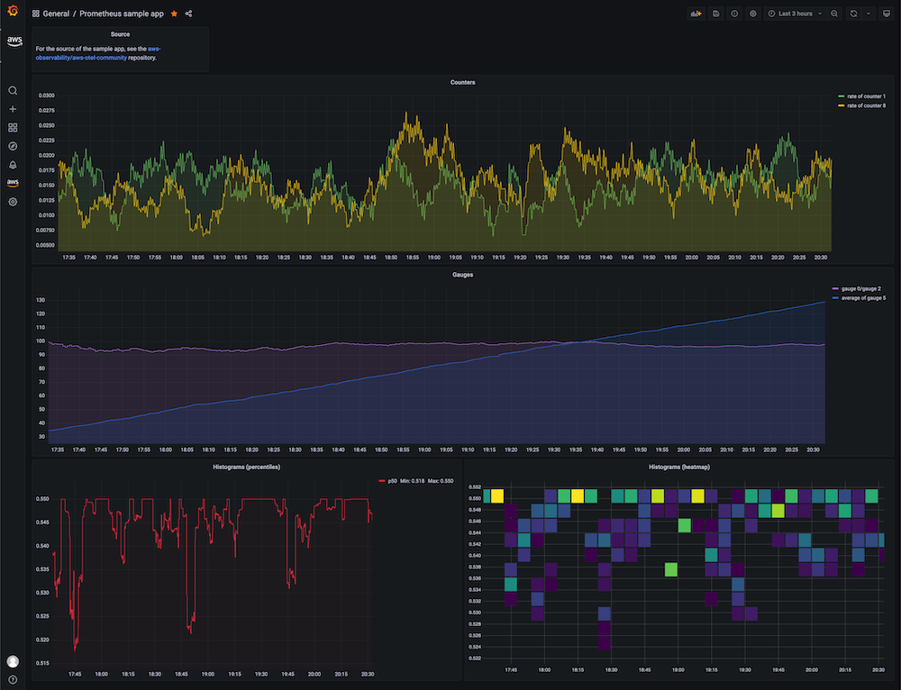

# EC2 மீதான EKS-ல் Amazon Managed Service for Prometheus உடன் AWS Distro for OpenTelemetry பயன்படுத்துதல்

இந்த ரெசிபியில் [மாதிரி Go பயன்பாட்டை](https://github.com/aws-observability/aws-otel-community/tree/master/sample-apps/prometheus-sample-app) எவ்வாறு instrument செய்வது மற்றும் [Amazon Managed Service for Prometheus (AMP)](https://aws.amazon.com/prometheus/)-க்கு மெட்ரிக்குகளை உட்செலுத்த [AWS Distro for OpenTelemetry (ADOT)](https://aws.amazon.com/otel)-ஐ பயன்படுத்துவது என்பதைக் காட்டுகிறோம்.
பின்னர் மெட்ரிக்குகளை காட்சிப்படுத்த [Amazon Managed Grafana (AMG)](https://aws.amazon.com/grafana/)-ஐ பயன்படுத்துகிறோம்.

முழுமையான சூழ்நிலையை நிரூபிக்க EC2 மீது [Amazon Elastic Kubernetes Service (EKS)](https://aws.amazon.com/eks/) கிளஸ்டர் மற்றும் [Amazon Elastic Container Registry (ECR)](https://aws.amazon.com/ecr/) repository-ஐ அமைப்போம்.

:::note
    இந்த வழிகாட்டியை முடிக்க சுமார் 1 மணி நேரம் ஆகும்.
:::
## உள்கட்டமைப்பு
பின்வரும் பகுதியில் இந்த ரெசிபிக்கான உள்கட்டமைப்பை அமைப்போம்.

### கட்டமைப்பு


ADOT pipeline [ADOT Collector](https://github.com/aws-observability/aws-otel-collector)-ஐ பயன்படுத்தி Prometheus-instrumented பயன்பாட்டை scrape செய்து, scraped மெட்ரிக்குகளை Amazon Managed Service for Prometheus-க்கு உட்செலுத்த உதவுகிறது.


ADOT Collector Prometheus-க்கு குறிப்பிட்ட இரண்டு கூறுகளை உள்ளடக்கியது:

* Prometheus Receiver, மற்றும்
* AWS Prometheus Remote Write Exporter.

:::info
    Prometheus Remote Write Exporter பற்றிய கூடுதல் தகவலுக்கு பார்க்கவும்:
    [AMP-க்கான Prometheus Remote Write Exporter-உடன் தொடங்குதல்](https://aws-otel.github.io/docs/getting-started/prometheus-remote-write-exporter)
:::

### முன்நிபந்தனைகள்

* AWS CLI உங்கள் சூழலில் [நிறுவப்பட்டு](https://docs.aws.amazon.com/cli/latest/userguide/cli-chap-install.html) [கட்டமைக்கப்பட்டிருக்க](https://docs.aws.amazon.com/cli/latest/userguide/cli-chap-configure.html) வேண்டும்.
* உங்கள் சூழலில் [eksctl](https://docs.aws.amazon.com/eks/latest/userguide/eksctl.html) கட்டளையை நிறுவ வேண்டும்.
* உங்கள் சூழலில் [kubectl](https://docs.aws.amazon.com/eks/latest/userguide/install-kubectl.html)-ஐ நிறுவ வேண்டும்.
* உங்கள் சூழலில் [docker](https://docs.docker.com/get-docker/) நிறுவப்பட்டிருக்க வேண்டும்.

### EC2 மீது EKS கிளஸ்டர் உருவாக்குதல்

இந்த ரெசிபியில் நமது demo பயன்பாடு EKS மீது இயங்கும்.
ஏற்கனவே உள்ள EKS கிளஸ்டரைப் பயன்படுத்தலாம் அல்லது [cluster-config.yaml](./ec2-eks-metrics-go-adot-ampamg/cluster-config.yaml) பயன்படுத்தி புதிய ஒன்றை உருவாக்கலாம்.

இந்த template இரண்டு EC2 `t2.large` நோடுகளுடன் புதிய கிளஸ்டரை உருவாக்கும்.

template கோப்பை திருத்தி `<YOUR_REGION>`-ஐ [AMP-க்கு ஆதரிக்கப்படும் regions](https://docs.aws.amazon.com/prometheus/latest/userguide/what-is-Amazon-Managed-Service-Prometheus.html#AMP-supported-Regions)-ல் ஒன்றாக அமைக்கவும்.

உங்கள் session-ல் `<YOUR_REGION>`-ஐ மேலெழுதவும், உதாரணமாக bash-ல்:
```
export AWS_DEFAULT_REGION=<YOUR_REGION>
```

பின்வரும் கட்டளையைப் பயன்படுத்தி உங்கள் கிளஸ்டரை உருவாக்கவும்.
```
eksctl create cluster -f cluster-config.yaml
```

### ECR repository அமைத்தல்

நமது பயன்பாட்டை EKS-க்கு டிப்ளாய் செய்ய கண்டெய்னர் registry தேவை.
உங்கள் கணக்கில் புதிய ECR registry உருவாக்க பின்வரும் கட்டளையைப் பயன்படுத்தலாம்.
`<YOUR_REGION>`-ஐயும் அமைக்கவும்.

```
aws ecr create-repository \
    --repository-name prometheus-sample-app \
    --image-scanning-configuration scanOnPush=true \
    --region <YOUR_REGION>
```

### AMP அமைத்தல்


AWS CLI பயன்படுத்தி workspace உருவாக்கவும்
```
aws amp create-workspace --alias prometheus-sample-app
```

workspace உருவாக்கப்பட்டதை சரிபார்க்கவும்:
```
aws amp list-workspaces
```

:::info
    கூடுதல் விவரங்களுக்கு [AMP தொடங்குதல்](https://docs.aws.amazon.com/prometheus/latest/userguide/AMP-getting-started.html) வழிகாட்டியைப் பார்க்கவும்.
:::

### ADOT Collector அமைத்தல்

[adot-collector-ec2.yaml](./ec2-eks-metrics-go-adot-ampamg/adot-collector-ec2.yaml)-ஐ பதிவிறக்கி, அடுத்த படிகளில் விவரிக்கப்பட்ட parameters-உடன் இந்த YAML doc-ஐ திருத்தவும்.

இந்த எடுத்துக்காட்டில், ADOT Collector கட்டமைப்பு annotation `(scrape=true)` பயன்படுத்தி எந்த target endpoints-ஐ scrape செய்ய வேண்டும் என்பதைக் குறிக்கிறது. இது ADOT Collector-க்கு sample app endpoint-ஐ உங்கள் கிளஸ்டரில் உள்ள `kube-system` endpoints-இலிருந்து வேறுபடுத்த உதவுகிறது.
வேறு sample app-ஐ scrape செய்ய விரும்பினால் re-label configurations-இலிருந்து இதை நீக்கலாம்.

பதிவிறக்கிய கோப்பை உங்கள் சூழலுக்கு திருத்த பின்வரும் படிகளைப் பயன்படுத்தவும்:

1\. `<YOUR_REGION>`-ஐ உங்கள் தற்போதைய region-உடன் மாற்றவும்.

2\. `<YOUR_ENDPOINT>`-ஐ உங்கள் workspace-இன் remote write URL-உடன் மாற்றவும்.

பின்வரும் வினவல்களை இயக்கி உங்கள் AMP remote write URL endpoint-ஐ பெறவும்.

முதலில், workspace ID-ஐ இவ்வாறு பெறவும்:

```
YOUR_WORKSPACE_ID=$(aws amp list-workspaces \
                    --alias prometheus-sample-app \
                    --query 'workspaces[0].workspaceId' --output text)
```

இப்போது உங்கள் workspace-க்கான remote write URL endpoint URL-ஐ பெறவும்:

```
YOUR_ENDPOINT=$(aws amp describe-workspace \
                --workspace-id $YOUR_WORKSPACE_ID  \
                --query 'workspace.prometheusEndpoint' --output text)api/v1/remote_write
```

:::warning
    `YOUR_ENDPOINT` உண்மையில் remote write URL ஆக இருப்பதை உறுதி செய்யவும், அதாவது URL `/api/v1/remote_write`-ல் முடிய வேண்டும்.
:::
Deployment கோப்பை உருவாக்கிய பிறகு, பின்வரும் கட்டளையைப் பயன்படுத்தி இதை நமது கிளஸ்டருக்கு apply செய்யலாம்:

```
kubectl apply -f adot-collector-ec2.yaml
```

:::info
    கூடுதல் தகவலுக்கு [AWS Distro for OpenTelemetry (ADOT)
    Collector Setup](https://aws-otel.github.io/docs/getting-started/prometheus-remote-write-exporter/eks#aws-distro-for-opentelemetry-adot-collector-setup)-ஐ பார்க்கவும்.
:::

### AMG அமைத்தல்

[Amazon Managed Grafana - தொடங்குதல்](https://aws.amazon.com/blogs/mt/amazon-managed-grafana-getting-started/) வழிகாட்டியைப் பயன்படுத்தி புதிய AMG workspace அமைக்கவும்.

உருவாக்கும்போது "Amazon Managed Service for Prometheus"-ஐ datasource ஆக சேர்க்கவும்.


## பயன்பாடு

இந்த ரெசிபியில் AWS Observability repository-இலிருந்து [மாதிரி பயன்பாட்டை](https://github.com/aws-observability/aws-otel-community/tree/master/sample-apps/prometheus) பயன்படுத்துவோம்.

இந்த Prometheus sample app நான்கு Prometheus metric வகைகளையும் (counter, gauge, histogram, summary) உருவாக்கி `/metrics` endpoint-ல் வெளிப்படுத்துகிறது.

### கண்டெய்னர் image உருவாக்குதல்

கண்டெய்னர் image-ஐ உருவாக்க, முதலில் Git repository-ஐ clone செய்து பின்வருமாறு directory-க்கு மாறவும்:

```
git clone https://github.com/aws-observability/aws-otel-community.git && \
cd ./aws-otel-community/sample-apps/prometheus
```

முதலில், region-ஐ (மேலே செய்யப்படவில்லை என்றால்) மற்றும் account ID-ஐ உங்கள் விஷயத்தில் பொருந்தும் வகையில் அமைக்கவும்.
`<YOUR_REGION>`-ஐ உங்கள் தற்போதைய region-உடன் மாற்றவும். உதாரணமாக, Bash shell-ல் இது பின்வருமாறு இருக்கும்:

```
export AWS_DEFAULT_REGION=<YOUR_REGION>
export ACCOUNTID=`aws sts get-caller-identity --query Account --output text`
```

அடுத்து, கண்டெய்னர் image-ஐ உருவாக்கவும்:

```
docker build . -t "$ACCOUNTID.dkr.ecr.$AWS_DEFAULT_REGION.amazonaws.com/prometheus-sample-app:latest"
```

:::note
    proxy.golang.org i/o timeout காரணமாக உங்கள் சூழலில் `go mod` தோல்வியடைந்தால், Dockerfile-ஐ திருத்தி go mod proxy-ஐ bypass செய்யலாம்.

    Docker file-ல் பின்வரும் வரியை மாற்றவும்:
    ```
    RUN GO111MODULE=on go mod download
    ```
    இதற்கு:
    ```
    RUN GOPROXY=direct GO111MODULE=on go mod download
    ```
:::
இப்போது கண்டெய்னர் image-ஐ நீங்கள் முன்னர் உருவாக்கிய ECR repo-க்கு push செய்யலாம்.

அதற்கு, முதலில் default ECR registry-ல் உள்நுழையவும்:

```
aws ecr get-login-password --region $AWS_DEFAULT_REGION | \
    docker login --username AWS --password-stdin \
    "$ACCOUNTID.dkr.ecr.$AWS_DEFAULT_REGION.amazonaws.com"
```

இறுதியாக, கண்டெய்னர் image-ஐ நீங்கள் உருவாக்கிய ECR repository-க்கு push செய்யவும்:

```
docker push "$ACCOUNTID.dkr.ecr.$AWS_DEFAULT_REGION.amazonaws.com/prometheus-sample-app:latest"
```

### Sample app-ஐ டிப்ளாய் செய்தல்

[prometheus-sample-app.yaml](./ec2-eks-metrics-go-adot-ampamg/prometheus-sample-app.yaml)-ல் உங்கள் ECR image path-ஐ கொண்டிருக்கும்படி திருத்தவும். அதாவது, கோப்பில் `ACCOUNTID` மற்றும் `AWS_DEFAULT_REGION`-ஐ உங்கள் சொந்த மதிப்புகளுடன் மாற்றவும்:

```
    # change the following to your container image:
    image: "ACCOUNTID.dkr.ecr.AWS_DEFAULT_REGION.amazonaws.com/prometheus-sample-app:latest"
```

இப்போது sample app-ஐ உங்கள் கிளஸ்டருக்கு டிப்ளாய் செய்யலாம்:

```
kubectl apply -f prometheus-sample-app.yaml
```

## End-to-end

இப்போது உள்கட்டமைப்பும் பயன்பாடும் இடத்தில் உள்ளன, EKS-ல் இயங்கும் Go app-இலிருந்து AMP-க்கு மெட்ரிக்குகளை அனுப்பி AMG-யில் காட்சிப்படுத்தி அமைப்பை சோதிப்போம்.

### உங்கள் pipeline வேலை செய்கிறதா என்பதை சரிபார்த்தல்

ADOT collector sample app-இன் pod-ஐ scrape செய்து மெட்ரிக்குகளை AMP-க்கு உட்செலுத்துகிறதா என்பதை சரிபார்க்க, collector logs-ஐ பார்க்கிறோம்.

ADOT collector logs-ஐ பின்தொடர பின்வரும் கட்டளையை உள்ளிடவும்:

```
kubectl -n adot-col logs adot-collector -f
```

Sample app-இலிருந்து scraped மெட்ரிக்குகளின் logs-ல் ஒரு எடுத்துக்காட்டு வெளியீடு பின்வருமாறு இருக்கும்:

```
...
Resource labels:
     -> service.name: STRING(kubernetes-service-endpoints)
     -> host.name: STRING(192.168.16.238)
     -> port: STRING(8080)
     -> scheme: STRING(http)
InstrumentationLibraryMetrics #0
Metric #0
Descriptor:
     -> Name: test_gauge0
     -> Description: This is my gauge
     -> Unit:
     -> DataType: DoubleGauge
DoubleDataPoints #0
StartTime: 0
Timestamp: 1606511460471000000
Value: 0.000000
...
```

:::tip
    AMP மெட்ரிக்குகளைப் பெற்றதா என்பதை சரிபார்க்க, [awscurl](https://github.com/okigan/awscurl)-ஐ பயன்படுத்தலாம்.
    இந்த கருவி AWS Sigv4 authentication-உடன் command line-இலிருந்து HTTP requests அனுப்ப உதவுகிறது, எனவே AMP-இலிருந்து வினவ சரியான அனுமதிகளுடன் AWS credentials உள்ளூரில் அமைக்கப்பட்டிருக்க வேண்டும்.
    பின்வரும் கட்டளையில் `$AMP_ENDPOINT`-ஐ உங்கள் AMP workspace-க்கான endpoint-உடன் மாற்றவும்:

    ```
    $ awscurl --service="aps" \
            --region="$AWS_DEFAULT_REGION" "https://$AMP_ENDPOINT/api/v1/query?query=adot_test_gauge0"
    {"status":"success","data":{"resultType":"vector","result":[{"metric":{"__name__":"adot_test_gauge0"},"value":[1606512592.493,"16.87214000011479"]}]}}
    ```
:::
### Grafana டாஷ்போர்டு உருவாக்குதல்

பின்வருமாறு தோன்றும் sample app-க்கான எடுத்துக்காட்டு டாஷ்போர்டை [prometheus-sample-app-dashboard.json](./ec2-eks-metrics-go-adot-ampamg/prometheus-sample-app-dashboard.json) வழியாக இறக்குமதி செய்யலாம்:



மேலும், Amazon Managed Grafana-வில் உங்கள் சொந்த டாஷ்போர்டை உருவாக்க பின்வரும் வழிகாட்டிகளைப் பயன்படுத்தவும்:

* [User Guide: Dashboards](https://docs.aws.amazon.com/grafana/latest/userguide/dashboard-overview.html)
* [டாஷ்போர்டுகள் உருவாக்குவதற்கான சிறந்த நடைமுறைகள்](https://grafana.com/docs/grafana/latest/best-practices/best-practices-for-creating-dashboards/)

அவ்வளவுதான், வாழ்த்துக்கள்! EC2 மீதான EKS-ல் ADOT பயன்படுத்தி மெட்ரிக்குகளை உட்செலுத்துவது எப்படி என்பதை கற்றுக்கொண்டீர்கள்.

## சுத்தம் செய்தல்

1. ரிசோர்ஸ்கள் மற்றும் கிளஸ்டரை நீக்கவும்
```
kubectl delete all --all
eksctl delete cluster --name amp-eks-ec2
```
2. AMP workspace-ஐ நீக்கவும்
```
aws amp delete-workspace --workspace-id `aws amp list-workspaces --alias prometheus-sample-app --query 'workspaces[0].workspaceId' --output text`
```
3. amp-iamproxy-ingest-role IAM role-ஐ நீக்கவும்
```
aws delete-role --role-name amp-iamproxy-ingest-role
```
4. AMG workspace-ஐ console-இலிருந்து நீக்கவும்.
