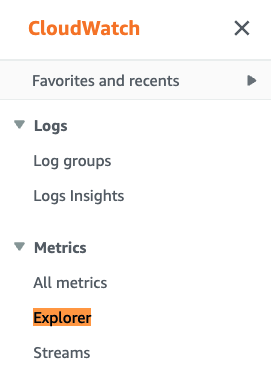
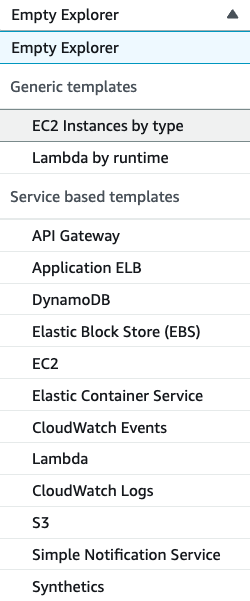

# ரிசோர்ஸ் டேக்குகளால் வடிகட்டப்பட்ட மெட்ரிக்குகளை ஒருங்கிணைத்து காட்சிப்படுத்த Amazon CloudWatch Metrics explorer-ஐ பயன்படுத்துதல்

இந்த ரெசிபியில் ரிசோர்ஸ் டேக்குகள் மற்றும் ரிசோர்ஸ் பண்புகளால் மெட்ரிக்குகளை வடிகட்ட, ஒருங்கிணைக்க மற்றும் காட்சிப்படுத்த Metrics explorer-ஐ எவ்வாறு பயன்படுத்துவது என்பதைக் காட்டுகிறோம் - [ரிசோர்ஸ்களை அவற்றின் டேக்குகள் மற்றும் பண்புகளால் கண்காணிக்க Metrics explorer-ஐ பயன்படுத்தவும்][metrics-explorer].

Metrics explorer-உடன் காட்சிப்படுத்தல்களை உருவாக்க பல வழிகள் உள்ளன; இந்த வழிநடத்தலில் நாம் AWS Console-ஐ பயன்படுத்துகிறோம்.

:::note
    இந்த வழிகாட்டியை முடிக்க சுமார் 5 நிமிடங்கள் ஆகும்.
:::
## முன்நிபந்தனைகள்

* AWS கணக்கிற்கு அணுகல்
* AWS Console வழியாக Amazon CloudWatch Metrics explorer-க்கு அணுகல்
* தொடர்புடைய ரிசோர்ஸ்களுக்கு ரிசோர்ஸ் டேக்குகள் அமைக்கப்பட்டிருக்க வேண்டும்

## Metrics Explorer டேக் அடிப்படையிலான வினவல்கள் மற்றும் காட்சிப்படுத்தல்கள்

*  CloudWatch console-ஐ திறக்கவும்

*  <b>Metrics</b>-இன் கீழ், <b>Explorer</b> மெனுவைக் கிளிக் செய்யவும்

<!--  -->

*  <b>Generic templates</b> அல்லது <b>Service based templates</b> பட்டியலிலிருந்து ஒன்றைத் தேர்வு செய்யலாம்; இந்த எடுத்துக்காட்டில் <b>EC2 Instances by type</b> template-ஐ பயன்படுத்துகிறோம்

<!--  -->

*  நீங்கள் ஆராய விரும்பும் மெட்ரிக்குகளைத் தேர்வு செய்யவும்; தேவையற்றவற்றை நீக்கி, நீங்கள் பார்க்க விரும்பும் மற்ற மெட்ரிக்குகளைச் சேர்க்கவும்

<!--  -->

*  <b>From</b>-இன் கீழ், நீங்கள் தேடும் ரிசோர்ஸ் டேக் அல்லது ரிசோர்ஸ் பண்பைத் தேர்வு செய்யவும்; கீழே உள்ள எடுத்துக்காட்டில் <b>Name: TeamX</b> டேக் கொண்ட வெவ்வேறு EC2 instances-க்கான CPU மற்றும் Network தொடர்பான மெட்ரிக்குகளைக் காட்டுகிறோம்

<!--

// width="386" height="176" -->

*  கவனிக்கவும், <b>Aggregated by</b>-இன் கீழ் aggregation function பயன்படுத்தி time series-ஐ இணைக்கலாம்; கீழே உள்ள எடுத்துக்காட்டில் <b>TeamX</b> மெட்ரிக்குகள் <b>Availability Zone</b> மூலம் aggregated செய்யப்பட்டுள்ளன

<!--  -->

மாற்றாக, <b>TeamX</b> மற்றும் <b>TeamY</b>-ஐ <b>Team</b> டேக் மூலம் aggregate செய்யலாம், அல்லது உங்கள் தேவைகளுக்கு ஏற்ற வேறு எந்த கட்டமைப்பையும் தேர்வு செய்யலாம்

<!--  -->

## டைனமிக் காட்சிப்படுத்தல்கள்
<b>From</b>, <b>Aggregated by</b> மற்றும் <b>Split by</b> விருப்பங்களைப் பயன்படுத்தி விளைவான காட்சிப்படுத்தல்களை எளிதாக தனிப்பயனாக்கலாம். Metrics explorer காட்சிப்படுத்தல்கள் dynamic ஆனவை, எனவே புதிதாக tag செய்யப்பட்ட எந்த ரிசோர்ஸும் explorer widget-ல் தானாகவே தோன்றும்.

## குறிப்பு

Metrics explorer பற்றிய கூடுதல் தகவலுக்கு பின்வரும் கட்டுரையைப் பார்க்கவும்:
https://docs.aws.amazon.com/AmazonCloudWatch/latest/monitoring/CloudWatch-Metrics-Explorer.html

[metrics-explorer]: https://docs.aws.amazon.com/AmazonCloudWatch/latest/monitoring/CloudWatch-Metrics-Explorer.html
