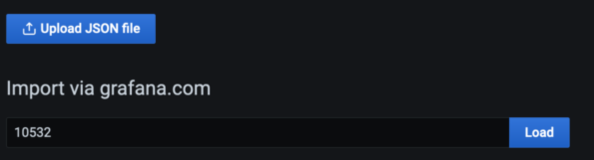

# Amazon Managed Service for Grafana பயன்படுத்தி ஹைப்ரிட் சூழல்களை கண்காணித்தல்

இந்த ரெசிபியில் Azure Cloud சூழலிலிருந்து [Amazon Managed Service for Grafana](https://aws.amazon.com/grafana/) (AMG)-க்கு மெட்ரிக்குகளை காட்சிப்படுத்துவது மற்றும் [Amazon Simple Notification Service](https://docs.aws.amazon.com/sns/latest/dg/welcome.html) மற்றும் Slack-க்கு AMG-யில் அலர்ட் அறிவிப்புகளை உருவாக்குவது எப்படி என்பதைக் காட்டுகிறோம்.


செயல்படுத்தலின் ஒரு பகுதியாக, AMG workspace-ஐ உருவாக்கி, Azure Monitor plugin-ஐ AMG-க்கான data source ஆக கட்டமைத்து, Grafana டாஷ்போர்டை கட்டமைப்போம். Amazon SNS-க்கு ஒன்றும் Slack-க்கு ஒன்றும் என இரண்டு notification channels-ஐ உருவாக்குவோம். AMG டாஷ்போர்டில் notification channels-க்கு அனுப்பப்படும் alerts-ஐயும் கட்டமைப்போம்.

:::note
    இந்த வழிகாட்டியை முடிக்க சுமார் 30 நிமிடங்கள் ஆகும்.
:::
## உள்கட்டமைப்பு
பின்வரும் பகுதியில் இந்த ரெசிபிக்கான உள்கட்டமைப்பை அமைப்போம்.

### முன்நிபந்தனைகள்

* AWS CLI உங்கள் சூழலில் [நிறுவப்பட்டு](https://docs.aws.amazon.com/cli/latest/userguide/cli-chap-install.html) [கட்டமைக்கப்பட்டிருக்க](https://docs.aws.amazon.com/cli/latest/userguide/cli-chap-configure.html) வேண்டும்.
* [AWS-SSO](https://docs.aws.amazon.com/singlesignon/latest/userguide/step1.html)-ஐ இயக்க வேண்டும்

### கட்டமைப்பு


முதலில், Azure Monitor-இலிருந்து மெட்ரிக்குகளைக் காட்சிப்படுத்த AMG workspace-ஐ உருவாக்கவும். [Amazon Managed Service for Grafana-வுடன் தொடங்குதல்](https://aws.amazon.com/blogs/mt/amazon-managed-grafana-getting-started/) வலைப்பதிவு இடுகையில் உள்ள படிகளைப் பின்பற்றவும். workspace-ஐ உருவாக்கிய பிறகு, தனிப்பட்ட பயனர் அல்லது பயனர் குழுவிற்கு Grafana workspace-க்கு அணுகலை வழங்கலாம். இயல்பாக, பயனருக்கு viewer வகை இருக்கும். பயனர் பாத்திரத்தின் அடிப்படையில் பயனர் வகையை மாற்றவும்.

:::note 
    workspace-ல் குறைந்தது ஒரு பயனருக்கு Admin பாத்திரத்தை ஒதுக்க வேண்டும்.
:::
படம் 1-ல், பயனர் பெயர் grafana-admin. பயனர் வகை Admin. Data sources tab-ல், தேவையான data source-ஐ தேர்வு செய்யவும். கட்டமைப்பை மதிப்பாய்வு செய்து, Create workspace-ஐ தேர்வு செய்யவும்.


### Data source மற்றும் custom dashboard-ஐ கட்டமைத்தல்

இப்போது, Data sources-இன் கீழ், Azure சூழலிலிருந்து மெட்ரிக்குகளை வினவி காட்சிப்படுத்தத் தொடங்க Azure Monitor plugin-ஐ கட்டமைக்கவும். Data source சேர்க்க Data sources-ஐ தேர்வு செய்யவும்.


Add data source-ல், Azure Monitor-ஐ தேடி, Azure சூழலில் உள்ள app registration console-இலிருந்து parameters-ஐ கட்டமைக்கவும்.


Azure Monitor plugin-ஐ கட்டமைக்க, directory (tenant) ID மற்றும் application (client) ID தேவை. வழிமுறைகளுக்கு, Azure AD application மற்றும் service principal உருவாக்குவது பற்றிய [கட்டுரையைப்](https://docs.microsoft.com/en-us/azure/active-directory/develop/howto-create-service-principal-portal) பார்க்கவும். இது app-ஐ பதிவு செய்வது மற்றும் தரவை வினவ Grafana-க்கு அணுகலை வழங்குவது எப்படி என்பதை விளக்குகிறது.


Data source கட்டமைக்கப்பட்ட பிறகு, Azure மெட்ரிக்குகளை பகுப்பாய்வு செய்ய custom dashboard-ஐ இறக்குமதி செய்யவும். இடது பலகத்தில், + ஐகானைத் தேர்ந்தெடுத்து, பின்னர் Import-ஐ தேர்வு செய்யவும்.

Import via grafana.com-ல், dashboard ID 10532-ஐ உள்ளிடவும்.



இது Azure Virtual Machine dashboard-ஐ இறக்குமதி செய்யும், அங்கு Azure Monitor மெட்ரிக்குகளை பகுப்பாய்வு செய்யத் தொடங்கலாம். என் அமைப்பில், Azure சூழலில் ஒரு virtual machine இயங்குகிறது.


### AMG-யில் notification channels-ஐ கட்டமைத்தல்

இந்தப் பிரிவில், இரண்டு notification channels-ஐ கட்டமைத்து, பின்னர் alerts-ஐ அனுப்புவீர்கள்.

grafana-notification என்ற SNS topic-ஐ உருவாக்கி email address-ஐ subscribe செய்ய பின்வரும் கட்டளையைப் பயன்படுத்தவும்.

```
aws sns create-topic --name grafana-notification
aws sns subscribe --topic-arn arn:aws:sns:<region>:<account-id>:grafana-notification --protocol email --notification-endpoint <email-id>

```
இடது பலகத்தில், புதிய notification channel சேர்க்க bell ஐகானைத் தேர்வு செய்யவும்.
இப்போது grafana-notification notification channel-ஐ கட்டமைக்கவும். Edit notification channel-ல், Type-க்கு AWS SNS-ஐ தேர்வு செய்யவும். Topic-க்கு, நீங்கள் உருவாக்கிய SNS topic-இன் ARN-ஐ பயன்படுத்தவும். Auth Provider-க்கு workspace IAM role-ஐ தேர்வு செய்யவும்.


### Slack notification channel 
Slack notification channel-ஐ கட்டமைக்க, Slack workspace-ஐ உருவாக்கவும் அல்லது ஏற்கனவே உள்ள ஒன்றைப் பயன்படுத்தவும். [Incoming Webhooks மூலம் செய்திகள் அனுப்புதல்](https://api.slack.com/messaging/webhooks)-ல் விவரிக்கப்பட்டுள்ளபடி Incoming Webhooks-ஐ இயக்கவும்.

workspace-ஐ கட்டமைத்த பிறகு, Grafana டாஷ்போர்டில் பயன்படுத்தப்படும் webhook URL-ஐ பெற முடியும்.


### AMG-யில் alerts-ஐ கட்டமைத்தல்

மெட்ரிக் threshold-ஐ தாண்டும்போது Grafana alerts-ஐ கட்டமைக்கலாம். AMG-யுடன், டாஷ்போர்டில் alert எவ்வளவு அடிக்கடி மதிப்பீடு செய்யப்பட வேண்டும் என்பதை கட்டமைத்து அறிவிப்பை அனுப்பலாம். இந்த எடுத்துக்காட்டில், Azure virtual machine-க்கான CPU பயன்பாட்டிற்கு alert-ஐ கட்டமைக்கவும். பயன்பாடு threshold-ஐ மீறும்போது, இரண்டு channels-க்கும் அறிவிப்புகளை அனுப்ப AMG-ஐ கட்டமைக்கவும்.

டாஷ்போர்டில், dropdown-இலிருந்து CPU utilization-ஐ தேர்வு செய்து, Edit-ஐ தேர்வு செய்யவும். graph panel-இன் Alert tab-ல், alert rule எவ்வளவு அடிக்கடி மதிப்பீடு செய்யப்பட வேண்டும் மற்றும் alert நிலையை மாற்றி அதன் அறிவிப்புகளைத் தொடங்க பூர்த்தி செய்ய வேண்டிய நிபந்தனைகளை கட்டமைக்கவும்.

பின்வரும் கட்டமைப்பில், CPU பயன்பாடு 50%-ஐ மீறினால் alert உருவாக்கப்படும். grafana-alert-notification மற்றும் slack-alert-notification channels-க்கு அறிவிப்புகள் அனுப்பப்படும்.


இப்போது, Azure virtual machine-ல் உள்நுழைந்து stress போன்ற கருவிகளைப் பயன்படுத்தி stress testing-ஐ தொடங்கலாம். CPU பயன்பாடு threshold-ஐ மீறும்போது, இரண்டு channels-லும் அறிவிப்புகளைப் பெறுவீர்கள்.

Slack channel-க்கு அனுப்பப்படும் alert-ஐ உருவாக்க சரியான threshold-உடன் CPU பயன்பாட்டிற்கான alerts-ஐ கட்டமைக்கவும்.

## முடிவுரை

இந்த ரெசிபியில், AMG workspace-ஐ டிப்ளாய் செய்வது, notification channels-ஐ கட்டமைப்பது, Azure Cloud-இலிருந்து மெட்ரிக்குகளை சேகரிப்பது, மற்றும் AMG டாஷ்போர்டில் alerts-ஐ கட்டமைப்பது ஆகியவற்றை காட்டினோம். AMG முழுமையாக நிர்வகிக்கப்பட்ட, serverless தீர்வு என்பதால், உங்கள் வணிகத்தை மாற்றும் பயன்பாடுகளில் உங்கள் நேரத்தை செலவழிக்கலாம், Grafana-வை நிர்வகிக்கும் கடினமான பணியை AWS-க்கு விட்டுவிடலாம்.
