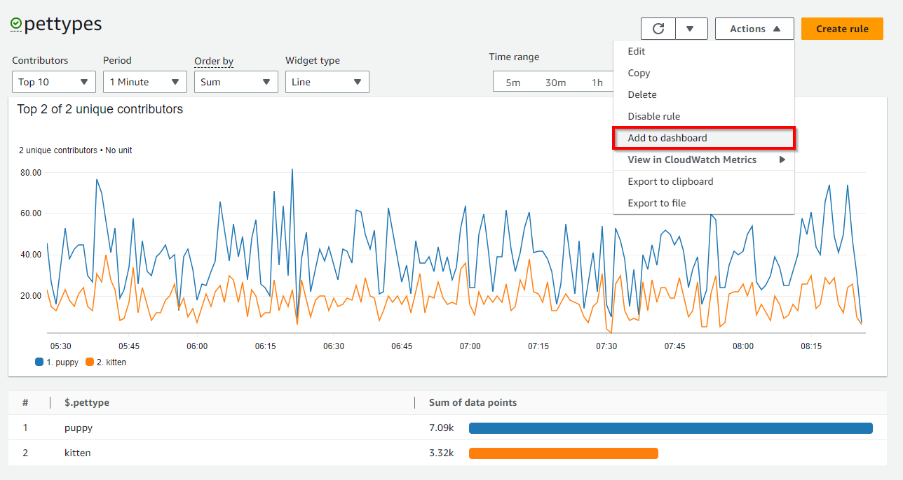
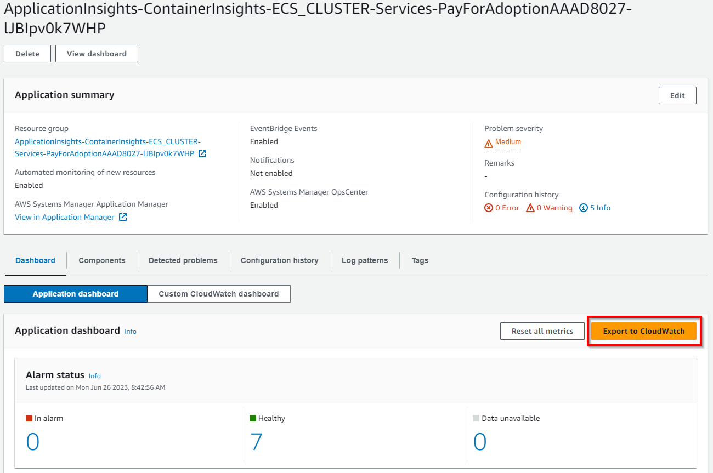
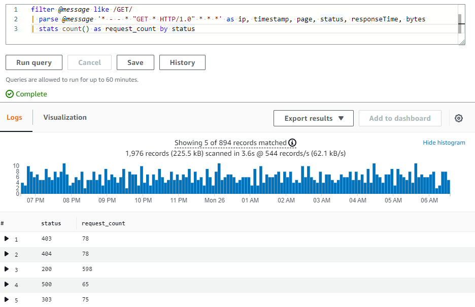

# CloudWatch Dashboard

## அறிமுகம்

AWS கணக்குகளில் உள்ள வளங்களின் சரக்கு விவரங்கள், வளங்களின் செயல்திறன் மற்றும் ஆரோக்கிய சோதனைகளை அறிவது நிலையான வள மேலாண்மைக்கு முக்கியமானது. Amazon CloudWatch டாஷ்போர்டுகள் CloudWatch கன்சோலில் தனிப்பயனாக்கக்கூடிய முகப்புப் பக்கங்களாகும், இவை உங்கள் வளங்களை ஒரே பார்வையில் கண்காணிக்கப் பயன்படுத்தலாம், அந்த வளங்கள் குறுக்கு-கணக்கு அல்லது வெவ்வேறு ரீஜன்களில் பரவியிருந்தாலும் கூட.

[Amazon CloudWatch டாஷ்போர்டுகள்](https://docs.aws.amazon.com/AmazonCloudWatch/latest/monitoring/CloudWatch_Dashboards.html) வாடிக்கையாளர்களுக்கு மீண்டும் பயன்படுத்தக்கூடிய வரைபடங்களை உருவாக்கவும், கிளவுட் வளங்கள் மற்றும் பயன்பாடுகளை ஒருங்கிணைந்த பார்வையில் காட்சிப்படுத்தவும் உதவுகின்றன. CloudWatch டாஷ்போர்டுகள் மூலம் வாடிக்கையாளர்கள் மெட்ரிக்குகள் மற்றும் லாக் தரவை ஒருங்கிணைந்த பார்வையில் அருகருகே வரைபடமாக்கி, விரைவாக சூழலைப் புரிந்துகொண்டு, சிக்கலைக் கண்டறிவதிலிருந்து மூல காரணத்தைப் புரிந்துகொள்வதற்கு நகர்ந்து, சராசரி மீட்பு அல்லது தீர்வு நேரத்தை (MTTR) குறைக்கலாம். எடுத்துக்காட்டாக, CPU பயன்பாடு மற்றும் நினைவகம் போன்ற முக்கிய மெட்ரிக்குகளின் தற்போதைய பயன்பாட்டைக் காட்சிப்படுத்தி, ஒதுக்கப்பட்ட திறனுடன் ஒப்பிடலாம். குறிப்பிட்ட மெட்ரிக்கின் லாக் முறையைத் தொடர்புபடுத்தவும், செயல்திறன் மற்றும் செயல்பாட்டு சிக்கல்களுக்கு அலாரங்களை அமைக்கவும் முடியும். CloudWatch டாஷ்போர்டு அலாரங்களின் தற்போதைய நிலையைக் காட்டி, விரைவாகக் காட்சிப்படுத்தி நடவடிக்கை எடுக்க உதவுகிறது. CloudWatch டாஷ்போர்டு பகிர்வு அம்சம் காட்டப்பட்ட டாஷ்போர்டு தகவலை நிறுவனத்திற்கு உள்ளே அல்லது வெளியே உள்ள குழுக்கள் அல்லது பங்குதாரர்களுக்கு எளிதாகப் பகிர உதவுகிறது.

## விட்ஜெட்டுகள்

#### இயல்பு விட்ஜெட்டுகள்

விட்ஜெட்டுகள் CloudWatch டாஷ்போர்டுகளின் கட்டுமான தொகுதிகளாக, AWS சூழலில் உள்ள வளங்கள் மற்றும் பயன்பாட்டு மெட்ரிக்குகள் மற்றும் லாக்குகளின் முக்கியமான தகவல் மற்றும் கிட்டத்தட்ட நிகழ்நேர விவரங்களைக் காட்டுகின்றன. வாடிக்கையாளர்கள் தங்கள் தேவைகளுக்கு ஏற்ப விட்ஜெட்டுகளைச் சேர்த்து, நீக்கி, மறுசீரமைத்து அல்லது அளவை மாற்றி டாஷ்போர்டுகளைத் தனிப்பயனாக்கலாம்.

உங்கள் டாஷ்போர்டில் சேர்க்கக்கூடிய வரைபட வகைகளில் Line, Number, Gauge, Stacked area, Bar மற்றும் Pie அடங்கும்.

**Line, Number, Gauge, Stacked area, Bar, Pie** போன்ற **Graph** வகையின் இயல்பு விட்ஜெட் வகைகளும், **Text, Alarm Status, Logs table, Explorer** போன்ற மற்ற விட்ஜெட்டுகளும் வாடிக்கையாளர்கள் மெட்ரிக்குகள் அல்லது லாக் தரவைச் சேர்த்து டாஷ்போர்டுகளை உருவாக்கத் தேர்வு செய்ய கிடைக்கின்றன.


**கூடுதல் குறிப்புகள்:**

- AWS Observability Workshop: [Metric Number Widgets](https://catalog.workshops.aws/observability/en-US/aws-native/dashboards/metrics-number)
- AWS Observability Workshop: [Text Widgets](https://catalog.workshops.aws/observability/en-US/aws-native/dashboards/text-widget)
- AWS Observability Workshop: [Alarm Widgets](https://catalog.workshops.aws/observability/en-US/aws-native/dashboards/alarm-widgets)
- [CloudWatch டாஷ்போர்டுகளில் விட்ஜெட்டுகளை உருவாக்குதல் மற்றும் பயன்படுத்துதல்](https://docs.aws.amazon.com/AmazonCloudWatch/latest/monitoring/create-and-work-with-widgets.html) ஆவணம்

#### தனிப்பயன் விட்ஜெட்டுகள்

வாடிக்கையாளர்கள் CloudWatch டாஷ்போர்டுகளில் [தனிப்பயன் விட்ஜெட்டைச் சேர்க்கவும்](https://docs.aws.amazon.com/AmazonCloudWatch/latest/monitoring/create-and-work-with-widgets.html) தேர்வு செய்யலாம், தனிப்பயன் காட்சிப்படுத்தல்களை அனுபவிக்கவும், பல மூலங்களிலிருந்து தகவலைக் காட்டவும், அல்லது CloudWatch Dashboard-ல் நேரடியாக செயல்களை எடுக்கும் பட்டன்கள் போன்ற தனிப்பயன் கட்டுப்பாடுகளைச் சேர்க்கவும் முடியும். தனிப்பயன் விட்ஜெட்டுகள் Lambda செயல்பாடுகளால் இயக்கப்படும் முழுமையான serverless ஆகும், உள்ளடக்கம், அமைப்பு மற்றும் தொடர்புகளின் மீது முழுமையான கட்டுப்பாட்டை வழங்குகிறது. தனிப்பயன் விட்ஜெட் என்பது சிக்கலான வலை framework கற்க வேண்டிய தேவையில்லாமல் டாஷ்போர்டில் தனிப்பயன் தரவு பார்வை அல்லது கருவியை உருவாக்குவதற்கான எளிய வழியாகும். Lambda-ல் குறியீடு எழுதி HTML உருவாக்க முடிந்தால், பயனுள்ள தனிப்பயன் விட்ஜெட்டை உருவாக்கலாம்.


**கூடுதல் குறிப்புகள்:**

- AWS Observability Workshop: [தனிப்பயன் விட்ஜெட்டுகள்](https://catalog.workshops.aws/observability/en-US/aws-native/dashboards/custom-widgets)
- GitHub-ல் [CloudWatch Custom Widgets Samples](https://github.com/aws-samples/cloudwatch-custom-widgets-samples#what-are-custom-widgets)
- வலைப்பதிவு: [Amazon CloudWatch டாஷ்போர்டுகள் தனிப்பயன் விட்ஜெட்டுகளைப் பயன்படுத்துதல்](https://aws.amazon.com/blogs/mt/introducing-amazon-cloudwatch-dashboards-custom-widgets/)

## தானியங்கி டாஷ்போர்டுகள்

தானியங்கி டாஷ்போர்டுகள் அனைத்து AWS பொது ரீஜன்களிலும் கிடைக்கின்றன, இவை Amazon CloudWatch-ன் கீழ் உள்ள அனைத்து AWS வளங்களின் ஆரோக்கியம் மற்றும் செயல்திறனின் ஒருங்கிணைந்த பார்வையை வழங்குகின்றன. இது வாடிக்கையாளர்களுக்கு கண்காணிப்பை விரைவாகத் தொடங்கவும், வள-அடிப்படையிலான மெட்ரிக்குகள் மற்றும் அலாரங்களின் பார்வையைப் பெறவும், செயல்திறன் சிக்கல்களின் மூல காரணத்தை எளிதாகப் புரிந்துகொள்ளவும் உதவுகிறது. தானியங்கி டாஷ்போர்டுகள் AWS சேவையின் [சிறந்த நடைமுறைகளுடன்](https://docs.aws.amazon.com/prescriptive-guidance/latest/implementing-logging-monitoring-cloudwatch/cloudwatch-dashboards-visualizations.html) முன்கூட்டியே உருவாக்கப்பட்டுள்ளன, வள-விழிப்புடன் இருக்கின்றன, முக்கியமான செயல்திறன் மெட்ரிக்குகளின் சமீபத்திய நிலையை பிரதிபலிக்க மாறும் வகையில் புதுப்பிக்கப்படுகின்றன. தானியங்கி சேவை டாஷ்போர்டுகள் ஒரு சேவைக்கான அனைத்து நிலையான CloudWatch மெட்ரிக்குகளையும் காட்டுகின்றன, ஒவ்வொரு சேவை மெட்ரிக்கிற்கும் பயன்படுத்தப்படும் அனைத்து வளங்களையும் வரைபடமாக்குகின்றன, கணக்குகள் முழுவதும் விலகல் வளங்களை விரைவாக அடையாளம் காண உதவுகின்றன, இது அதிக அல்லது குறைந்த பயன்பாடு கொண்ட வளங்களை அடையாளம் காண உதவி, செலவுகளை மேம்படுத்த உதவுகிறது.


**கூடுதல் குறிப்புகள்:**

- AWS Observability Workshop: [தானியங்கி டாஷ்போர்டுகள்](https://catalog.workshops.aws/observability/en-US/aws-native/dashboards/autogen-dashboard)
- YouTube: [Amazon CloudWatch டாஷ்போர்டுகளைப் பயன்படுத்தி AWS வளங்களைக் கண்காணித்தல்](https://www.youtube.com/watch?v=I7EFLChc07M)

#### தானியங்கி டாஷ்போர்டுகளில் Container Insights

[CloudWatch Container Insights](https://docs.aws.amazon.com/AmazonCloudWatch/latest/monitoring/ContainerInsights.html) கண்டெய்னர்மயமாக்கப்பட்ட பயன்பாடுகள் மற்றும் மைக்ரோசர்வீஸ்களிலிருந்து மெட்ரிக்குகள் மற்றும் லாக்குகளை சேகரித்து, ஒருங்கிணைத்து, சுருக்கமாகக் காட்டுகிறது. Container Insights Amazon Elastic Container Service (Amazon ECS), Amazon Elastic Kubernetes Service (Amazon EKS) மற்றும் Amazon EC2-ல் Kubernetes இயங்குதளங்களுக்கு கிடைக்கிறது. Container Insights Amazon ECS மற்றும் Amazon EKS இரண்டிலும் Fargate-ல் நிறுவப்பட்ட கிளஸ்டர்களிலிருந்து மெட்ரிக்குகளை சேகரிப்பதை ஆதரிக்கிறது. CloudWatch CPU, நினைவகம், டிஸ்க் மற்றும் நெட்வொர்க் போன்ற பல வளங்களுக்கான மெட்ரிக்குகளை தானாகச் சேகரிக்கிறது, மேலும் கண்டெய்னர் மறுதொடக்க தோல்விகள் போன்ற கண்டறிதல் தகவல்களை வழங்கி, சிக்கல்களை தனிமைப்படுத்தி விரைவாகத் தீர்க்க உதவுகிறது.

CloudWatch [embedded metric format](https://aws-observability.github.io/observability-best-practices/guides/signal-collection/emf/) பயன்படுத்தும் செயல்திறன் லாக் நிகழ்வுகளான CloudWatch மெட்ரிக்குகளாக கிளஸ்டர், நோடு, பாட், task மற்றும் சேவை நிலையில் ஒருங்கிணைந்த மெட்ரிக்குகளை உருவாக்குகிறது, இது உயர்-கார்டினாலிட்டி தரவை பெரிய அளவில் சேகரித்து சேமிக்க உதவும் கட்டமைக்கப்பட்ட JSON ஸ்கீமாவைப் பயன்படுத்துகிறது. Container Insights சேகரிக்கும் மெட்ரிக்குகள் [CloudWatch தானியங்கி டாஷ்போர்டுகளில்](https://docs.aws.amazon.com/prescriptive-guidance/latest/implementing-logging-monitoring-cloudwatch/cloudwatch-dashboards-visualizations.html#use-automatic-dashboards) கிடைக்கின்றன, CloudWatch கன்சோலின் Metrics பிரிவிலும் பார்க்கலாம்.


#### தானியங்கி டாஷ்போர்டுகளில் Lambda Insights

[CloudWatch Lambda Insights](https://docs.aws.amazon.com/lambda/latest/dg/monitoring-insights.html) என்பது AWS Lambda போன்ற serverless பயன்பாடுகளுக்கான கண்காணிப்பு மற்றும் சிக்கல் தீர்வு தீர்வாகும், இது Lambda செயல்பாடுகளுக்கான மாறும் [தானியங்கி டாஷ்போர்டுகளை](https://docs.aws.amazon.com/prescriptive-guidance/latest/implementing-logging-monitoring-cloudwatch/cloudwatch-dashboards-visualizations.html#use-automatic-dashboards) உருவாக்குகிறது. CPU நேரம், நினைவகம், டிஸ்க் மற்றும் நெட்வொர்க் உள்ளிட்ட கணினி-நிலை மெட்ரிக்குகளையும், cold start மற்றும் Lambda worker மூடல்கள் போன்ற கண்டறிதல் தகவல்களையும் சேகரித்து, ஒருங்கிணைத்து, சுருக்கமாகக் காட்டி Lambda செயல்பாடுகளின் சிக்கல்களை தனிமைப்படுத்தி விரைவாகத் தீர்க்க உதவுகிறது. [Lambda Insights](https://docs.aws.amazon.com/AmazonCloudWatch/latest/monitoring/Lambda-Insights.html) செயல்பாட்டு நிலையில் ஒரு layer-ஆக வழங்கப்படும் Lambda நீட்டிப்பாகும், இயக்கப்படும்போது [embedded metric format](https://aws-observability.github.io/observability-best-practices/guides/signal-collection/emf/) பயன்படுத்தி லாக் நிகழ்வுகளிலிருந்து மெட்ரிக்குகளைப் பிரித்தெடுக்கிறது, எந்த agent-ம் தேவையில்லை.


## தனிப்பயன் டாஷ்போர்டுகள்

வாடிக்கையாளர்கள் தாங்கள் விரும்பும் அளவுக்கு கூடுதல் [தனிப்பயன் டாஷ்போர்டுகளை](https://docs.aws.amazon.com/AmazonCloudWatch/latest/monitoring/create_dashboard.html) வெவ்வேறு விட்ஜெட்டுகளுடன் உருவாக்கி அதற்கேற்ப தனிப்பயனாக்கலாம். டாஷ்போர்டுகளை குறுக்கு-ரீஜன் மற்றும் குறுக்கு-கணக்கு பார்வைக்கு உள்ளமைக்கலாம், மேலும் விருப்பப்பட்டியலில் சேர்க்கலாம்.


வாடிக்கையாளர்கள் தானியங்கி அல்லது தனிப்பயன் டாஷ்போர்டுகளை CloudWatch கன்சோலின் [விருப்பப்பட்டியலில்](https://docs.aws.amazon.com/AmazonCloudWatch/latest/monitoring/add-dashboard-to-favorites.html) சேர்க்கலாம், இதனால் கன்சோல் பக்கத்தின் வழிசெலுத்தல் பலகத்திலிருந்து விரைவாகவும் எளிதாகவும் அணுகலாம்.

**கூடுதல் குறிப்புகள்:**

- AWS Observability Workshop: [CloudWatch டாஷ்போர்டு](https://catalog.workshops.aws/observability/en-US/aws-native/dashboards/create)
- AWS Well-Architected Labs: [CloudWatch டாஷ்போர்டுகளுடன் கண்காணிப்பு](https://www.wellarchitectedlabs.com/performance-efficiency/100_labs/100_monitoring_windows_ec2_cloudwatch/) (செயல்திறன் திறன்)

#### CloudWatch டாஷ்போர்டுகளில் Contributor Insights சேர்த்தல்

CloudWatch [Contributor Insights](https://docs.aws.amazon.com/AmazonCloudWatch/latest/monitoring/ContributorInsights.html) வழங்குகிறது, இது லாக் தரவை பகுப்பாய்வு செய்து பங்களிப்பாளர் தரவைக் காட்டும் நேர வரிசைகளை உருவாக்குகிறது, இதில் முதல் N பங்களிப்பாளர்கள், தனித்துவ பங்களிப்பாளர்களின் மொத்த எண்ணிக்கை மற்றும் அவர்களின் பயன்பாடு பற்றிய மெட்ரிக்குகளைப் பார்க்கலாம். இது அதிக போக்குவரத்து ஏற்படுத்துபவர்களைக் கண்டறியவும், கணினி செயல்திறனை பாதிப்பவர் அல்லது என்ன என்பதைப் புரிந்துகொள்ளவும் உதவுகிறது. எடுத்துக்காட்டாக, பிரச்சனையுள்ள ஹோஸ்ட்களைக் கண்டறியலாம், அதிக நெட்வொர்க் பயனர்களை அடையாளம் காணலாம், அல்லது அதிக பிழைகளை உருவாக்கும் URL-களைக் கண்டறியலாம்.

Contributor Insights அறிக்கைகளை CloudWatch கன்சோலின் [புதிய அல்லது ஏற்கனவே உள்ள டாஷ்போர்டுகளில்](https://docs.aws.amazon.com/AmazonCloudWatch/latest/monitoring/ContributorInsights-ViewReports.html) சேர்க்கலாம்.



#### CloudWatch டாஷ்போர்டுகளில் Application Insights சேர்த்தல்

[CloudWatch Application Insights](https://docs.aws.amazon.com/AmazonCloudWatch/latest/monitoring/cloudwatch-application-insights.html) AWS-ல் ஹோஸ்ட் செய்யப்பட்ட பயன்பாடுகள் மற்றும் அவற்றின் அடிப்படை AWS வளங்களுக்கான Observability-ஐ எளிதாக்குகிறது, இது வழங்கும் பயன்பாட்டு ஆரோக்கியத்தின் மேம்படுத்தப்பட்ட தெரிவுநிலை பயன்பாட்டு சிக்கல்களை சரிசெய்வதற்கான சராசரி மீட்பு நேரத்தை (MTTR) குறைக்க உதவுகிறது. Application Insights கண்காணிக்கப்படும் பயன்பாடுகளின் சாத்தியமான சிக்கல்களைக் காட்டும் தானியங்கி டாஷ்போர்டுகளை வழங்குகிறது, இது வாடிக்கையாளர்களுக்கு பயன்பாடுகள் மற்றும் உள்கட்டமைப்பின் நடப்பு சிக்கல்களை விரைவாக தனிமைப்படுத்த உதவுகிறது.

கீழே காட்டப்பட்டுள்ளபடி Application Insights-க்குள் உள்ள 'Export to CloudWatch' விருப்பம் CloudWatch கன்சோலில் ஒரு டாஷ்போர்டைச் சேர்க்கிறது, இது வாடிக்கையாளர்களுக்கு முக்கியமான பயன்பாட்டு நுண்ணறிவுகளை எளிதாகக் கண்காணிக்க உதவுகிறது.



#### CloudWatch டாஷ்போர்டுகளில் Service Map சேர்த்தல்

[CloudWatch ServiceLens](https://docs.aws.amazon.com/AmazonCloudWatch/latest/monitoring/ServiceLens.html) ட்ரேஸ்கள், மெட்ரிக்குகள், லாக்குகள், அலாரங்கள் மற்றும் பிற வள ஆரோக்கிய தகவல்களை ஒரே இடத்தில் ஒருங்கிணைத்து சேவைகள் மற்றும் பயன்பாடுகளின் Observability-ஐ மேம்படுத்துகிறது. ServiceLens CloudWatch-ஐ AWS X-Ray உடன் ஒருங்கிணைத்து பயன்பாட்டின் எண்ட்-டு-எண்ட் பார்வையை வழங்குகிறது, வாடிக்கையாளர்கள் செயல்திறன் தடைகளை மிகவும் திறமையாக அடையாளம் காணவும் பாதிக்கப்பட்ட பயனர்களை கண்டறியவும் உதவுகிறது. [சேவை வரைபடம்](https://docs.aws.amazon.com/AmazonCloudWatch/latest/monitoring/servicelens_service_map.html) சேவை எண்ட்பாயிண்ட்கள் மற்றும் வளங்களை நோடுகளாகக் காட்டுகிறது, ஒவ்வொரு நோடு மற்றும் அதன் இணைப்புகளுக்கான போக்குவரத்து, தாமதம் மற்றும் பிழைகளை முன்னிலைப்படுத்துகிறது. காட்டப்படும் ஒவ்வொரு நோடும் சேவையின் அந்தப் பகுதியுடன் தொடர்புடைய தொடர்புடைய மெட்ரிக்குகள், லாக்குகள் மற்றும் ட்ரேஸ்கள் பற்றிய விரிவான நுண்ணறிவுகளை வழங்குகிறது.

கீழே காட்டப்பட்டுள்ளபடி Service Map-க்குள் உள்ள 'Add to dashboard' விருப்பம் CloudWatch கன்சோலில் புதிய டாஷ்போர்டு அல்லது ஏற்கனவே உள்ள டாஷ்போர்டில் சேர்க்கிறது, இது வாடிக்கையாளர்களுக்கு பயன்பாட்டு நுண்ணறிவுகளை எளிதாக கண்டறிய உதவுகிறது.


#### CloudWatch டாஷ்போர்டுகளில் Metrics Explorer சேர்த்தல்

CloudWatch-ல் [Metrics Explorer](https://docs.aws.amazon.com/AmazonCloudWatch/latest/monitoring/CloudWatch-Metrics-Explorer.html) என்பது tag-அடிப்படையிலான கருவியாகும், இது வாடிக்கையாளர்களுக்கு tags மற்றும் வள பண்புகள் மூலம் மெட்ரிக்குகளை வடிகட்ட, ஒருங்கிணைக்க மற்றும் காட்சிப்படுத்த உதவி AWS சேவைகளுக்கான Observability-ஐ மேம்படுத்துகிறது. Metrics Explorer நெகிழ்வான மற்றும் மாறும் சிக்கல் தீர்வு அனுபவத்தை வழங்குகிறது, வாடிக்கையாளர்கள் ஒரே நேரத்தில் பல வரைபடங்களை உருவாக்கி, இந்த வரைபடங்களைப் பயன்படுத்தி பயன்பாட்டு ஆரோக்கிய டாஷ்போர்டுகளை உருவாக்கலாம். Metrics Explorer காட்சிப்படுத்தல்கள் மாறும் தன்மையுடையவை, எனவே நீங்கள் Metrics Explorer விட்ஜெட்டை உருவாக்கி CloudWatch டாஷ்போர்டில் சேர்த்த பிறகு பொருந்தும் வளம் உருவாக்கப்பட்டால், புதிய வளம் தானாகவே Explorer விட்ஜெட்டில் தோன்றும்.

கீழே காட்டப்பட்டுள்ளபடி Metrics Explorer-க்குள் உள்ள '[Add to dashboard](https://docs.aws.amazon.com/AmazonCloudWatch/latest/monitoring/add_metrics_explorer_dashboard.html)' விருப்பம் CloudWatch கன்சோலில் புதிய டாஷ்போர்டு அல்லது ஏற்கனவே உள்ள டாஷ்போர்டில் சேர்க்கிறது, இது வாடிக்கையாளர்களுக்கு AWS சேவைகள் மற்றும் வளங்கள் பற்றிய மேலும் வரைபட நுண்ணறிவுகளை எளிதாகப் பெற உதவுகிறது.


## CloudWatch டாஷ்போர்டுகளைப் பயன்படுத்தி என்ன காட்சிப்படுத்த வேண்டும்

வாடிக்கையாளர்கள் ரீஜன்கள் மற்றும் கணக்குகள் முழுவதும் பணிச்சுமைகள் மற்றும் பயன்பாடுகளைக் கண்காணிக்க கணக்கு மற்றும் பயன்பாடு-நிலை டாஷ்போர்டுகளை உருவாக்கலாம். CloudWatch தானியங்கி டாஷ்போர்டுகளுடன் விரைவாகத் தொடங்கலாம், இவை சேவை-குறிப்பிட்ட மெட்ரிக்குகளுடன் முன்கூட்டியே உள்ளமைக்கப்பட்ட AWS சேவை-நிலை டாஷ்போர்டுகளாகும். உற்பத்தி சூழலில் பயன்பாடு அல்லது பணிச்சுமைக்கு தொடர்புடைய மற்றும் முக்கியமான முக்கிய மெட்ரிக்குகள் மற்றும் வளங்களில் கவனம் செலுத்தும் பயன்பாடு மற்றும் பணிச்சுமை-குறிப்பிட்ட டாஷ்போர்டுகளை உருவாக்குவது பரிந்துரைக்கப்படுகிறது.

#### மெட்ரிக்குகள் தரவு காட்சிப்படுத்தல்

மெட்ரிக்குகள் தரவை **Line, Number, Gauge, Stacked area, Bar, Pie** போன்ற Graph விட்ஜெட்டுகள் மூலம் CloudWatch டாஷ்போர்டுகளில் சேர்க்கலாம், **Average, Minimum, Maximum, Sum, மற்றும் SampleCount** புள்ளிவிவரங்களால் ஆதரிக்கப்படுகிறது. [புள்ளிவிவரங்கள்](https://docs.aws.amazon.com/AmazonCloudWatch/latest/monitoring/Statistics-definitions.html) என்பது குறிப்பிட்ட காலங்களில் மெட்ரிக் தரவு ஒருங்கிணைப்புகளாகும்.


[Metric math](https://docs.aws.amazon.com/AmazonCloudWatch/latest/monitoring/using-metric-math.html) பல CloudWatch மெட்ரிக்குகளை வினவி, இந்த மெட்ரிக்குகளின் அடிப்படையில் புதிய நேர வரிசைகளை உருவாக்க கணித வெளிப்பாடுகளைப் பயன்படுத்த உதவுகிறது. வாடிக்கையாளர்கள் விளைவு நேர வரிசைகளை CloudWatch கன்சோலில் காட்சிப்படுத்தி டாஷ்போர்டுகளில் சேர்க்கலாம். [GetMetricDataAPI](https://docs.aws.amazon.com/AmazonCloudWatch/latest/APIReference/API_GetMetricData.html) செயல்பாட்டைப் பயன்படுத்தி நிரலாக்கரீதியாகவும் metric math செய்யலாம்.

**கூடுதல் குறிப்பு:**

- [CloudWatch பயன்படுத்தி உங்கள் IoT fleet-ஐ கண்காணித்தல்](https://aws.amazon.com/blogs/iot/monitoring-your-iot-fleet-using-cloudwatch/)

#### லாக் தரவு காட்சிப்படுத்தல்

வாடிக்கையாளர்கள் பட்டை வரைபடங்கள், கோட்டு வரைபடங்கள் மற்றும் அடுக்கப்பட்ட பரப்பு வரைபடங்களைப் பயன்படுத்தி CloudWatch டாஷ்போர்டுகளில் [லாக் தரவு காட்சிப்படுத்தல்களை](https://docs.aws.amazon.com/AmazonCloudWatch/latest/logs/CWL_Insights-Visualizing-Log-Data.html) அடையலாம், இது முறைகளை மிகவும் திறமையாக அடையாளம் காண உதவுகிறது. CloudWatch Logs Insights stats செயல்பாடு மற்றும் ஒன்று அல்லது அதற்கு மேற்பட்ட ஒருங்கிணைப்பு செயல்பாடுகளைப் பயன்படுத்தும் வினவல்களுக்கு பட்டை வரைபடங்களை உருவாக்கும் காட்சிப்படுத்தல்களை உருவாக்குகிறது. வினவல் bin() செயல்பாட்டைப் பயன்படுத்தி காலப்போக்கில் ஒரு புலத்தால் [தரவை குழுவாக்கினால்](https://docs.aws.amazon.com/AmazonCloudWatch/latest/logs/CWL_Insights-Visualizing-Log-Data.html#CWL_Insights-Visualizing-ByFields), கோட்டு வரைபடங்கள் மற்றும் அடுக்கப்பட்ட பரப்பு வரைபடங்களை காட்சிப்படுத்தலுக்குப் பயன்படுத்தலாம்.

[நேர வரிசை தரவை](https://docs.aws.amazon.com/AmazonCloudWatch/latest/logs/CWL_Insights-Visualizing-Log-Data.html#CWL_Insights-Visualizing-TimeSeries) வினவலில் ஒன்று அல்லது அதற்கு மேற்பட்ட status செயல்பாடுகளின் ஒருங்கிணைப்பு இருந்தால் அல்லது வினவல் bin() செயல்பாட்டைப் பயன்படுத்தி ஒரு புலத்தால் தரவை குழுவாக்கினால் காட்சிப்படுத்தலாம்.

count()-ஐ stats செயல்பாடாகப் பயன்படுத்தும் மாதிரி வினவல் கீழே உள்ளது

```java
filter @message like /GET/
| parse @message '_ - - _ "GET _ HTTP/1.0" .*.*.*' as ip, timestamp, page, status, responseTime, bytes
| stats count() as request_count by status
```

மேற்கண்ட வினவலுக்கான முடிவுகள் கீழே CloudWatch Logs Insights-ல் காட்டப்பட்டுள்ளன.



வினவல் முடிவுகளின் pie chart காட்சிப்படுத்தல் கீழே காட்டப்பட்டுள்ளது.


**கூடுதல் குறிப்புகள்:**

- AWS Observability Workshop: CloudWatch டாஷ்போர்டில் [லாக் முடிவுகளைக் காட்டுதல்](https://catalog.workshops.aws/observability/en-US/aws-native/logs/logsinsights/displayformats)
- [Amazon CloudWatch டாஷ்போர்டுடன் AWS WAF லாக்குகளை காட்சிப்படுத்துதல்](https://aws.amazon.com/blogs/security/visualize-aws-waf-logs-with-an-amazon-cloudwatch-dashboard/)

#### அலாரங்களை காட்சிப்படுத்துதல்

CloudWatch-ல் மெட்ரிக் அலாரம் ஒரு தனி மெட்ரிக் அல்லது CloudWatch மெட்ரிக்குகளின் அடிப்படையிலான கணித வெளிப்பாட்டின் முடிவைக் கவனிக்கிறது. அலாரம் ஒரு காலத்தில் வரம்புக்கு எதிரான மெட்ரிக் அல்லது வெளிப்பாட்டின் மதிப்பின் அடிப்படையில் ஒன்று அல்லது அதற்கு மேற்பட்ட செயல்களைச் செய்கிறது. [CloudWatch டாஷ்போர்டுகளில்](https://docs.aws.amazon.com/AmazonCloudWatch/latest/monitoring/add_remove_alarm_dashboard.html) ஒரு விட்ஜெட்டில் ஒரு தனி அலாரத்தைச் சேர்க்கலாம், இது அலாரத்தின் மெட்ரிக் வரைபடத்தையும் அலாரம் நிலையையும் காட்டுகிறது. மேலும், ஒரு grid-ல் பல அலாரங்களின் நிலையைக் காட்டும் அலாரம் நிலை விட்ஜெட்டை CloudWatch டாஷ்போர்டில் சேர்க்கலாம். அலாரம் பெயர்கள் மற்றும் தற்போதைய நிலை மட்டுமே காட்டப்படும், வரைபடங்கள் காட்டப்படாது.

CloudWatch டாஷ்போர்டுக்குள் அலாரம் விட்ஜெட்டில் பிடிக்கப்பட்ட மாதிரி மெட்ரிக் அலாரம் நிலை கீழே காட்டப்பட்டுள்ளது.


## குறுக்கு-கணக்கு மற்றும் குறுக்கு-ரீஜன்

பல AWS கணக்குகளை கொண்ட வாடிக்கையாளர்கள் [CloudWatch குறுக்கு-கணக்கு](https://docs.aws.amazon.com/AmazonCloudWatch/latest/monitoring/cloudwatch_crossaccount_dashboard.html) Observability-ஐ அமைத்து, மத்திய கண்காணிப்பு கணக்குகளில் செழுமையான குறுக்கு-கணக்கு டாஷ்போர்டுகளை உருவாக்கலாம், இதன் மூலம் கணக்கு எல்லைகள் இல்லாமல் மெட்ரிக்குகள், லாக்குகள் மற்றும் ட்ரேஸ்களை தடையின்றி தேடவும், காட்சிப்படுத்தவும், பகுப்பாய்வு செய்யவும் முடியும்.

வாடிக்கையாளர்கள் பல AWS கணக்குகள் மற்றும் பல ரீஜன்களின் CloudWatch தரவை ஒரே டாஷ்போர்டில் சுருக்கும் [குறுக்கு-கணக்கு குறுக்கு-ரீஜன்](https://docs.aws.amazon.com/AmazonCloudWatch/latest/monitoring/cloudwatch_xaxr_dashboard.html) டாஷ்போர்டுகளையும் உருவாக்கலாம். இந்த உயர்-நிலை டாஷ்போர்டிலிருந்து வாடிக்கையாளர்கள் முழு பயன்பாட்டின் ஒருங்கிணைந்த பார்வையைப் பெறலாம், கணக்குகளில் உள்நுழைந்து/வெளியேறி அல்லது ரீஜன்களை மாற்றாமல் மிகவும் குறிப்பிட்ட டாஷ்போர்டுகளுக்கு drill-down செய்யலாம்.

**கூடுதல் குறிப்புகள்:**

- [மத்திய Amazon CloudWatch டாஷ்போர்டில் புதிய குறுக்கு-கணக்கு Amazon EC2 நிகழ்வுகளை தானாக சேர்ப்பது எப்படி](https://aws.amazon.com/blogs/mt/how-to-auto-add-new-cross-account-amazon-ec2-instances-in-a-central-amazon-cloudwatch-dashboard/)
- [பல-கணக்கு Amazon CloudWatch டாஷ்போர்டுகளை நிறுவுதல்](https://aws.amazon.com/blogs/mt/deploy-multi-account-amazon-cloudwatch-dashboards/)
- YouTube: [குறுக்கு-கணக்கு மற்றும் குறுக்கு-ரீஜன் CloudWatch டாஷ்போர்டுகளை உருவாக்குதல்](https://www.youtube.com/watch?v=eIUZdaqColg)

## டாஷ்போர்டுகளைப் பகிர்தல்

CloudWatch டாஷ்போர்டுகளை குழுக்கள் முழுவதும், பங்குதாரர்களுடன் மற்றும் உங்கள் AWS கணக்கிற்கு நேரடி அணுகல் இல்லாத நிறுவனத்திற்கு வெளியே உள்ளவர்களுடன் பகிரலாம். இந்த [பகிரப்பட்ட டாஷ்போர்டுகளை](https://docs.aws.amazon.com/AmazonCloudWatch/latest/monitoring/cloudwatch-dashboard-sharing.html) குழு பகுதிகளில் பெரிய திரைகளில், கண்காணிப்பு அல்லது நெட்வொர்க் செயல்பாட்டு மையங்களில் (NOC) காட்டலாம் அல்லது Wiki அல்லது பொது வலைப்பக்கங்களில் உட்பொதிக்கலாம்.

டாஷ்போர்டுகளை எளிதாகவும் பாதுகாப்பாகவும் பகிர மூன்று வழிகள் உள்ளன.

- டாஷ்போர்டை [பொதுவாகப் பகிரலாம்](https://docs.aws.amazon.com/AmazonCloudWatch/latest/monitoring/cloudwatch-dashboard-sharing.html#share-cloudwatch-dashboard-public) இதனால் இணைப்பைக் கொண்ட எவரும் டாஷ்போர்டைப் பார்க்கலாம்.
- டாஷ்போர்டைப் பார்க்கக்கூடிய நபர்களின் [குறிப்பிட்ட மின்னஞ்சல் முகவரிகளுக்குப் பகிரலாம்](https://docs.aws.amazon.com/AmazonCloudWatch/latest/monitoring/cloudwatch-dashboard-sharing.html#share-cloudwatch-dashboard-email-addresses). இந்த ஒவ்வொரு பயனரும் டாஷ்போர்டைப் பார்க்க தங்கள் சொந்த கடவுச்சொல்லை உருவாக்குகிறார்கள்.
- [Single Sign-On (SSO) வழங்குநர்](https://docs.aws.amazon.com/AmazonCloudWatch/latest/monitoring/cloudwatch-dashboard-sharing.html#share-cloudwatch-dashboards-setup-SSO) மூலம் அணுகலுடன் AWS கணக்குகளுக்குள் டாஷ்போர்டுகளைப் பகிரலாம்.

**டாஷ்போர்டுகளை பொதுவாகப் பகிரும்போது கவனிக்க வேண்டியவை**

டாஷ்போர்டில் முக்கிய அல்லது ரகசிய தகவல்கள் இருந்தால் CloudWatch டாஷ்போர்டுகளை பொதுவாகப் பகிர்வது பரிந்துரைக்கப்படவில்லை. முடிந்தவரை, டாஷ்போர்டுகளைப் பகிரும்போது பயனர்பெயர்/கடவுச்சொல் அல்லது Single Sign-On (SSO) மூலம் அங்கீகாரத்தைப் பயன்படுத்துவது பரிந்துரைக்கப்படுகிறது.

டாஷ்போர்டுகள் பொதுவாக அணுகக்கூடியவையாக உருவாக்கப்படும்போது, CloudWatch டாஷ்போர்டை ஹோஸ்ட் செய்யும் வலைப் பக்கத்திற்கான இணைப்பை உருவாக்குகிறது. வலைப் பக்கத்தைப் பார்க்கும் எவரும் பொதுவாகப் பகிரப்பட்ட டாஷ்போர்டின் உள்ளடக்கங்களையும் பார்க்க முடியும். வலைப் பக்கம் இணைப்பு மூலம் தற்காலிக சான்றுகளை வழங்குகிறது, நீங்கள் பகிரும் டாஷ்போர்டின் அலாரங்கள் மற்றும் contributor insights விதிகளை வினவ API-களை அழைக்க, மேலும் டாஷ்போர்டில் காட்டப்படாவிட்டாலும் உங்கள் கணக்கில் உள்ள அனைத்து மெட்ரிக்குகள் மற்றும் அனைத்து EC2 நிகழ்வுகளின் பெயர்கள் மற்றும் tags-க்கு அணுகலாம். இந்தத் தகவலை பொதுவாகக் கிடைக்கச் செய்வது பொருத்தமானதா என்பதை நீங்கள் கருத்தில் கொள்ள பரிந்துரைக்கிறோம்.

டாஷ்போர்டுகளை வலைப் பக்கத்தில் பொதுவாகப் பகிர்வதை இயக்கும்போது, உங்கள் கணக்கில் பின்வரும் Amazon Cognito வளங்கள் உருவாக்கப்படும்: Cognito user pool; Cognito app client; Cognito Identity pool மற்றும் IAM role.

**சான்றுகளைப் பயன்படுத்தி டாஷ்போர்டுகளைப் பகிரும்போது கவனிக்க வேண்டியவை (பயனர்பெயர் மற்றும் கடவுச்சொல்லால் பாதுகாக்கப்பட்ட டாஷ்போர்டு)**

நீங்கள் பகிரும் பயனர்களுடன் பகிர விரும்பாத முக்கிய அல்லது ரகசிய தகவல்கள் டாஷ்போர்டில் இருந்தால் CloudWatch டாஷ்போர்டுகளைப் பகிர்வது பரிந்துரைக்கப்படவில்லை.

டாஷ்போர்டு பகிர்வு இயக்கப்படும்போது, CloudWatch டாஷ்போர்டை ஹோஸ்ட் செய்யும் வலைப் பக்கத்திற்கான இணைப்பை உருவாக்குகிறது. நீங்கள் மேலே குறிப்பிட்ட பயனர்களுக்கு பின்வரும் அனுமதிகள் வழங்கப்படும்: நீங்கள் பகிரும் டாஷ்போர்டின் அலாரங்கள் மற்றும் contributor insights விதிகளுக்கான CloudWatch படிக்க-மட்டும் அனுமதிகள், மேலும் டாஷ்போர்டில் காட்டப்படாவிட்டாலும் உங்கள் கணக்கில் உள்ள அனைத்து மெட்ரிக்குகள் மற்றும் அனைத்து EC2 நிகழ்வுகளின் பெயர்கள் மற்றும் tags. நீங்கள் பகிரும் பயனர்களுக்கு இந்தத் தகவலைக் கிடைக்கச் செய்வது பொருத்தமானதா என்பதை நீங்கள் கருத்தில் கொள்ள பரிந்துரைக்கிறோம்.

வலைப் பக்க அணுகலுக்கு நீங்கள் குறிப்பிடும் பயனர்களுக்கான டாஷ்போர்டு பகிர்வை இயக்கும்போது, உங்கள் கணக்கில் பின்வரும் Amazon Cognito வளங்கள் உருவாக்கப்படும்: Cognito user pool; Cognito users; Cognito app client; Cognito Identity pool மற்றும் IAM role.

**SSO வழங்குநர் பயன்படுத்தி டாஷ்போர்டுகளைப் பகிரும்போது கவனிக்க வேண்டியவை**

CloudWatch டாஷ்போர்டுகளை Single Sign-On (SSO) பயன்படுத்தி பகிரும்போது, தேர்ந்தெடுக்கப்பட்ட SSO வழங்குநரிடம் பதிவு செய்யப்பட்ட பயனர்களுக்கு பகிரப்பட்ட கணக்கில் உள்ள அனைத்து டாஷ்போர்டுகளையும் அணுகும் அனுமதிகள் வழங்கப்படும். மேலும், இந்த முறையில் டாஷ்போர்டு பகிர்வை முடக்கும்போது, அனைத்து டாஷ்போர்டுகளின் பகிர்வு தானாகவே நிறுத்தப்படும்.

**கூடுதல் குறிப்புகள்:**

- AWS Observability Workshop: [டாஷ்போர்டுகளைப் பகிர்தல்](https://catalog.workshops.aws/observability/en-US/aws-native/dashboards/sharingdashboard)
- வலைப்பதிவு: [AWS Single Sign-On பயன்படுத்தி உங்கள் Amazon CloudWatch டாஷ்போர்டுகளை யாருடனும் பகிர்தல்](https://aws.amazon.com/blogs/mt/share-your-amazon-cloudwatch-dashboards-with-anyone-using-aws-single-sign-on/)
- வலைப்பதிவு: [Amazon CloudWatch டாஷ்போர்டுகளைப் பகிர்வதன் மூலம் கண்காணிப்புத் தகவலைத் தொடர்புகொள்ளுதல்](https://aws.amazon.com/blogs/mt/communicate-monitoring-information-by-sharing-amazon-cloudwatch-dashboards/)

## நேரடி தரவு

CloudWatch டாஷ்போர்டுகள் உங்கள் பணிச்சுமைகளிலிருந்து மெட்ரிக்குகள் தொடர்ந்து வெளியிடப்பட்டால் மெட்ரிக் விட்ஜெட்டுகள் மூலம் [நேரடி தரவையும்](https://docs.aws.amazon.com/AmazonCloudWatch/latest/monitoring/cloudwatch-live-data.html) காட்டலாம். வாடிக்கையாளர்கள் முழு டாஷ்போர்டிற்கு அல்லது டாஷ்போர்டில் உள்ள தனிப்பட்ட விட்ஜெட்டுகளுக்கு நேரடி தரவை இயக்கலாம்.

நேரடி தரவு **off** ஆக இருந்தால், கடந்த காலத்தில் குறைந்தது ஒரு நிமிடத்தின் ஒருங்கிணைப்பு காலம் கொண்ட தரவுப் புள்ளிகள் மட்டுமே காட்டப்படும். எடுத்துக்காட்டாக, 5 நிமிட காலங்களைப் பயன்படுத்தும்போது, 12:35-க்கான தரவுப் புள்ளி 12:35 முதல் 12:40 வரை ஒருங்கிணைக்கப்பட்டு, 12:41-ல் காட்டப்படும்.

நேரடி தரவு **on** ஆக இருந்தால், தொடர்புடைய ஒருங்கிணைப்பு இடைவெளியில் தரவு வெளியிடப்படும்போது மிகச் சமீபத்திய தரவுப் புள்ளி உடனடியாகக் காட்டப்படும். ஒவ்வொரு முறை காட்சியைப் புதுப்பிக்கும்போது, அந்த ஒருங்கிணைப்பு காலத்தில் புதிய தரவு வெளியிடப்பட்டால் மிகச் சமீபத்திய தரவுப் புள்ளி மாறலாம்.

## அனிமேஷன் டாஷ்போர்டு

[அனிமேஷன் டாஷ்போர்டு](https://docs.aws.amazon.com/AmazonCloudWatch/latest/monitoring/cloudwatch-animated-dashboard.html) காலப்போக்கில் பிடிக்கப்பட்ட CloudWatch மெட்ரிக் தரவை மீண்டும் இயக்குகிறது, இது வாடிக்கையாளர்களுக்கு போக்குகளைக் காணவும், விளக்கக்காட்சிகளை உருவாக்கவும், சிக்கல்கள் நிகழ்ந்த பிறகு பகுப்பாய்வு செய்யவும் உதவுகிறது. டாஷ்போர்டில் அனிமேஷன் செய்யப்படும் விட்ஜெட்டுகளில் line விட்ஜெட்டுகள், stacked area விட்ஜெட்டுகள், number விட்ஜெட்டுகள் மற்றும் Metrics Explorer விட்ஜெட்டுகள் அடங்கும். Pie graphs, bar charts, text விட்ஜெட்டுகள் மற்றும் logs விட்ஜெட்டுகள் டாஷ்போர்டில் காட்டப்படுகின்றன ஆனால் அனிமேஷன் செய்யப்படுவதில்லை.

## CloudWatch Dashboard-க்கான API/CLI ஆதரவு

AWS Management Console மூலம் CloudWatch டாஷ்போர்டை அணுகுவதைத் தவிர, API, AWS கட்டளை வரி இடைமுகம் (CLI) மற்றும் AWS SDK-கள் மூலமும் சேவையை அணுகலாம். டாஷ்போர்டுகளுக்கான CloudWatch API AWS CLI மூலம் தானியக்கம் அல்லது மென்பொருள்/தயாரிப்புகளுடன் ஒருங்கிணைப்பில் உதவுகிறது, இதனால் வளங்கள் மற்றும் பயன்பாடுகளை நிர்வகிக்க அல்லது நிர்வாகம் செய்ய குறைந்த நேரம் செலவிடலாம்.

- [ListDashboards](https://docs.aws.amazon.com/AmazonCloudWatch/latest/APIReference/API_ListDashboards.html): உங்கள் கணக்கிற்கான டாஷ்போர்டுகளின் பட்டியலைத் தருகிறது
- [GetDashboard](https://docs.aws.amazon.com/AmazonCloudWatch/latest/APIReference/API_GetDashboard.html): நீங்கள் குறிப்பிடும் டாஷ்போர்டின் விவரங்களைக் காட்டுகிறது
- [DeleteDashboards](https://docs.aws.amazon.com/AmazonCloudWatch/latest/APIReference/API_DeleteDashboards.html): நீங்கள் குறிப்பிடும் அனைத்து டாஷ்போர்டுகளையும் நீக்குகிறது
- [PutDashboard](https://docs.aws.amazon.com/AmazonCloudWatch/latest/APIReference/API_PutDashboard.html): டாஷ்போர்டு இல்லாவிட்டால் உருவாக்குகிறது அல்லது ஏற்கனவே உள்ள டாஷ்போர்டைப் புதுப்பிக்கிறது. டாஷ்போர்டைப் புதுப்பிக்கும்போது முழு உள்ளடக்கமும் இங்கு நீங்கள் குறிப்பிடுவதால் மாற்றப்படும்.

CloudWatch API Reference: [Dashboard Body Structure and Syntax](https://docs.aws.amazon.com/AmazonCloudWatch/latest/APIReference/CloudWatch-Dashboard-Body-Structure.html)

AWS கட்டளை வரி இடைமுகம் (AWS CLI) என்பது கட்டளை வரி shell-ல் கட்டளைகளைப் பயன்படுத்தி AWS சேவைகளுடன் தொடர்பு கொள்ள உதவும் திறந்த மூல கருவியாகும், இது முனையப் நிரலின் கட்டளை வரியிலிருந்து உலாவி அடிப்படையிலான AWS Management Console வழங்கும் செயல்பாட்டிற்கு சமமான செயல்பாட்டை செயல்படுத்துகிறது.

CLI ஆதரவு:

- [list-dashboards](https://docs.aws.amazon.com/cli/latest/reference/cloudwatch/list-dashboards.html)
- [get-dashboard](https://docs.aws.amazon.com/cli/latest/reference/cloudwatch/get-dashboard.html)
- [delete-dashboards](https://docs.aws.amazon.com/cli/latest/reference/cloudwatch/delete-dashboards.html)
- [put-dashboard](https://docs.aws.amazon.com/cli/latest/reference/cloudwatch/put-dashboard.html)

**கூடுதல் குறிப்பு:** AWS Observability Workshop: [CloudWatch டாஷ்போர்டுகள் மற்றும் AWS CLI](https://catalog.workshops.aws/observability/en-US/aws-native/dashboards/createcli)

## CloudWatch Dashboard தானியக்கம்

CloudWatch டாஷ்போர்டு உருவாக்கத்தை தானியக்கமாக்க, வாடிக்கையாளர்கள் CloudFormation அல்லது Terraform போன்ற Infrastructure as Code (IaC) கருவிகளைப் பயன்படுத்தலாம், இவை AWS வளங்களை அமைக்க உதவுகின்றன, இதனால் வாடிக்கையாளர்கள் அந்த வளங்களை நிர்வகிப்பதில் குறைந்த நேரம் செலவிட்டு AWS-ல் இயங்கும் பயன்பாடுகளில் அதிக நேரம் கவனம் செலுத்தலாம்.

[AWS CloudFormation](https://docs.aws.amazon.com/AWSCloudFormation/latest/UserGuide/aws-resource-cloudwatch-dashboard.html) templates மூலம் டாஷ்போர்டு உருவாக்கத்தை ஆதரிக்கிறது. AWS::CloudWatch::Dashboard வளம் Amazon CloudWatch டாஷ்போர்டைக் குறிப்பிடுகிறது.

[Terraform](https://registry.terraform.io/providers/hashicorp/aws/latest/docs/resources/cloudwatch_dashboard)-லும் IaC தானியக்கம் மூலம் CloudWatch டாஷ்போர்டு உருவாக்கத்தை ஆதரிக்கும் modules உள்ளன.

விரும்பிய விட்ஜெட்டுகளைப் பயன்படுத்தி டாஷ்போர்டுகளை கைமுறையாக உருவாக்குவது நேரடியானது. இருப்பினும், Auto Scaling குழுவின் scale-out மற்றும் scale-in நிகழ்வுகளின் போது உருவாக்கப்படும் அல்லது நீக்கப்படும் EC2 நிகழ்வுகள் போன்ற மாறும் தகவல்களின் அடிப்படையிலான உள்ளடக்கமாக இருந்தால் வள மூலங்களைப் புதுப்பிக்க சில முயற்சி தேவைப்படலாம். [Amazon EventBridge மற்றும் AWS Lambda பயன்படுத்தி உங்கள் Amazon CloudWatch டாஷ்போர்டுகளை தானாக உருவாக்கி புதுப்பிக்க](https://aws.amazon.com/blogs/mt/update-your-amazon-cloudwatch-dashboards-automatically-using-amazon-eventbridge-and-aws-lambda/) விரும்பினால் வலைப்பதிவு இடுகையைப் பாருங்கள்.

**கூடுதல் குறிப்பு வலைப்பதிவுகள்:**

- [Amazon EBS volume KPI-களுக்கான Amazon CloudWatch டாஷ்போர்டு உருவாக்கத்தை தானியக்கமாக்குதல்](https://aws.amazon.com/blogs/storage/automating-amazon-cloudwatch-dashboard-creation-for-amazon-ebs-volume-kpis/)
- [AWS Systems Manager மற்றும் Ansible மூலம் Amazon CloudWatch அலாரங்கள் மற்றும் டாஷ்போர்டுகளின் உருவாக்கத்தை தானியக்கமாக்குதல்](https://aws.amazon.com/blogs/mt/automate-creation-of-amazon-cloudwatch-alarms-and-dashboards-with-aws-systems-manager-and-ansible/)
- [AWS CDK பயன்படுத்தி AWS Outposts-க்கான தானியங்கி Amazon CloudWatch டாஷ்போர்டை நிறுவுதல்](https://aws.amazon.com/blogs/compute/deploying-an-automated-amazon-cloudwatch-dashboard-for-aws-outposts-using-aws-cdk/)

**தயாரிப்பு FAQ**: [CloudWatch டாஷ்போர்டு](https://aws.amazon.com/cloudwatch/faqs/#Dashboards)
