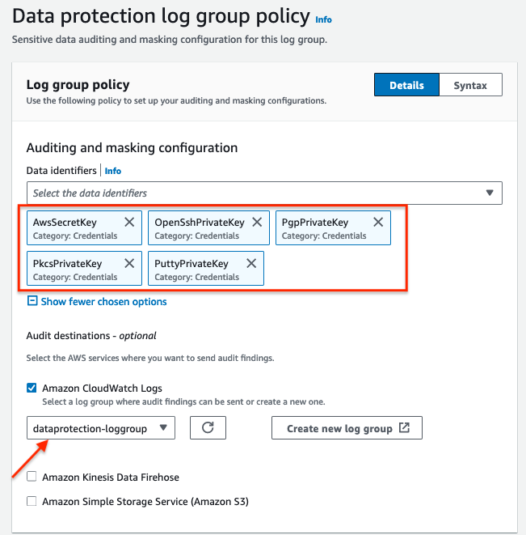

# SLG/EDU க்கான CloudWatch Logs Data Protection Policies

லாக்கிங் தரவு பொதுவாக பயனுள்ளதாக இருந்தாலும், Health Insurance Portability and Accountability Act (HIPAA), General Data Privacy Regulation (GDPR), Payment Card Industry Data Security Standard (PCI-DSS) மற்றும் Federal Risk and Authorization Management Program (FedRAMP) போன்ற கடுமையான ஒழுங்குமுறைகளைக் கொண்ட நிறுவனங்களுக்கு அவற்றை மறைப்பது பயனுள்ளது.

CloudWatch Logs இல் [Data Protection policies](https://docs.aws.amazon.com/AmazonCloudWatch/latest/logs/cloudwatch-logs-data-protection-policies.html) வாடிக்கையாளர்கள் முக்கிய தரவுக்காக லாக் தரவை-போக்குவரத்தில் ஸ்கேன் செய்து கண்டறியப்பட்ட முக்கிய தரவை மறைக்கும் data protection policies ஐ வரையறுக்கவும் பயன்படுத்தவும் உதவுகிறது.

இந்த கொள்கைகள் pattern matching மற்றும் machine learning models ஐ பயன்படுத்தி முக்கிய தரவை கண்டறிந்து, உங்கள் கணக்கில் CloudWatch log groups ஆல் உள்ளெடுக்கப்பட்ட நிகழ்வுகளில் தோன்றும் அந்த தரவை தணிக்கை செய்யவும் மறைக்கவும் உதவுகின்றன.

[matching data identifiers](https://docs.aws.amazon.com/AmazonCloudWatch/latest/logs/cloudwatch-logs-data-protection-policies.html) ஐ பயன்படுத்தி, CloudWatch Logs கண்டறியலாம்:

- private keys அல்லது AWS secret access keys போன்ற Credentials
- IP addresses அல்லது MAC addresses போன்ற Device identifiers
- வங்கி கணக்கு எண், கிரெடிட் கார்டு எண்கள் போன்ற நிதி தகவல்கள்
- Health Insurance Card Number போன்ற Protected Health Information (PHI)
- ஓட்டுநர் உரிமங்கள், சமூக பாதுகாப்பு எண்கள் போன்ற Personally Identifiable Information (PII)

:::note
    முக்கிய தரவு log group க்கு உள்ளெடுக்கப்படும்போது கண்டறியப்பட்டு மறைக்கப்படுகிறது. நீங்கள் data protection policy ஐ அமைக்கும்போது, அதற்கு முன் உள்ளெடுக்கப்பட்ட log events மறைக்கப்படாது.
:::

## தரவு வகைகள்

### Credentials

Credentials என்பது நீங்கள் யார் என்பதையும், நீங்கள் கோரும் ஆதாரங்களை அணுக அனுமதி உள்ளதா என்பதையும் சரிபார்க்க பயன்படுத்தப்படும் முக்கிய தரவு வகைகளாகும்.




:::tip
    தரவு வகைப்பாடு சிறந்த நடைமுறைகள் தெளிவாக வரையறுக்கப்பட்ட தரவு வகைப்பாடு அடுக்குகள் மற்றும் தேவைகளுடன் தொடங்குகின்றன.
:::

:::tip
    உங்கள் லாக் நிகழ்வுகளில் முக்கிய தரவை தவிர்க்க, சிறந்த நடைமுறை என்னவென்றால் முதலில் உங்கள் குறியீட்டில் அவற்றை விலக்குவது மற்றும் தேவையான தகவல்களை மட்டுமே லாக் செய்வது.
:::

### நிதி தகவல்கள்

PCI DSS ஆல் வரையறுக்கப்பட்டபடி, வங்கி கணக்கு, routing numbers, debit மற்றும் credit card numbers ஆகியவை முக்கிய நிதி தகவல்களாக கருதப்படுகின்றன.


:::info
    [நிதி தரவு வகைகள் மற்றும் data identifiers](https://docs.aws.amazon.com/AmazonCloudWatch/latest/logs/protect-sensitive-log-data-types-financial.html) இன் முழு பட்டியலை சரிபார்க்கவும்
:::

### Protected Health Information (PHI)

PHI என்பது காப்பீட்டு மற்றும் பில்லிங் தகவல்கள், நோயறிதல் தரவு, மருத்துவ பதிவுகள் மற்றும் ஆய்வக முடிவுகள் உள்ளிட்ட தனிப்பட்ட முறையில் அடையாளம் காணக்கூடிய சுகாதார தரவின் மிகவும் பரந்த தொகுப்பை உள்ளடக்கியது.


:::info
    [PHI தரவு வகைகள் மற்றும் data identifiers](https://docs.aws.amazon.com/AmazonCloudWatch/latest/logs/protect-sensitive-log-data-types-health.html) இன் முழு பட்டியலை சரிபார்க்கவும்
:::

### Personally Identifiable Information (PII)

PII என்பது ஒரு நபரை அடையாளம் காண பயன்படுத்தக்கூடிய தனிப்பட்ட தரவுக்கான உரை குறிப்பாகும். PII எடுத்துக்காட்டுகளில் முகவரிகள், வங்கி கணக்கு எண்கள் மற்றும் தொலைபேசி எண்கள் அடங்கும்.


:::info
    [PII தரவு வகைகள் மற்றும் data identifiers](https://docs.aws.amazon.com/AmazonCloudWatch/latest/logs/protect-sensitive-log-data-types-pii.html) இன் முழு பட்டியலை சரிபார்க்கவும்
:::

## மறைக்கப்பட்ட Logs

உங்கள் data protection policy ஐ அமைத்த log group க்கு சென்றால், data protection `On` ஆக இருப்பதையும், முக்கிய தரவின் எண்ணிக்கையையும் கன்சோல் காட்டுவதை பார்ப்பீர்கள்.


`View in Log Insights` ஐ கிளிக் செய்வது Log Insights கன்சோலுக்கு அழைத்துச் செல்லும். கீழே உள்ள வினவலை இயக்குவது:

```
fields @timestamp, @message
| sort @timestamp desc
| limit 20
```

வினவலை விரிவாக்கினால், மறைக்கப்பட்ட முடிவுகளை காண்பீர்கள்:


:::important
    நீங்கள் data protection policy ஐ உருவாக்கும்போது, இயல்பாக, நீங்கள் தேர்ந்தெடுத்த data identifiers உடன் பொருந்தும் முக்கிய தரவு மறைக்கப்படுகிறது. `logs:Unmask` IAM அனுமதி உள்ள பயனர்கள் மட்டுமே மறைக்கப்படாத தரவை பார்க்க முடியும்.
:::

:::tip
    CloudWatch இல் முக்கிய தரவுக்கான அணுகலை நிர்வகிக்கவும் கட்டுப்படுத்தவும் [AWS IAM and Access Management(IAM)](https://docs.aws.amazon.com/AmazonCloudWatch/latest/monitoring/auth-and-access-control-cw.html) ஐ பயன்படுத்தவும்.
:::

:::tip
    Log Group தரவு CloudWatch Logs இல் எப்போதும் என்கிரிப்ட் செய்யப்படுகிறது. மாற்றாக, உங்கள் லாக் தரவை என்கிரிப்ட் செய்ய [AWS Key Management Service](https://docs.aws.amazon.com/AmazonCloudWatch/latest/logs/encrypt-log-data-kms.html) ஐயும் பயன்படுத்தலாம்.
:::

[^1]: தொடங்க எங்கள் AWS blog [Protect Sensitive Data with Amazon CloudWatch Logs](https://aws.amazon.com/blogs/aws/protect-sensitive-data-with-amazon-cloudwatch-logs/) ஐ சரிபார்க்கவும்.
