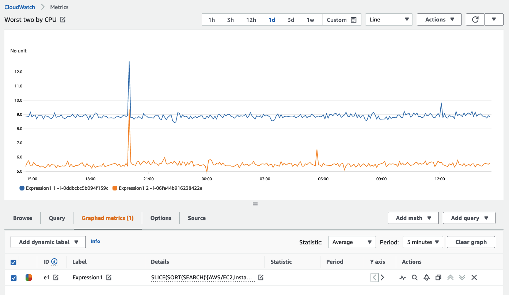
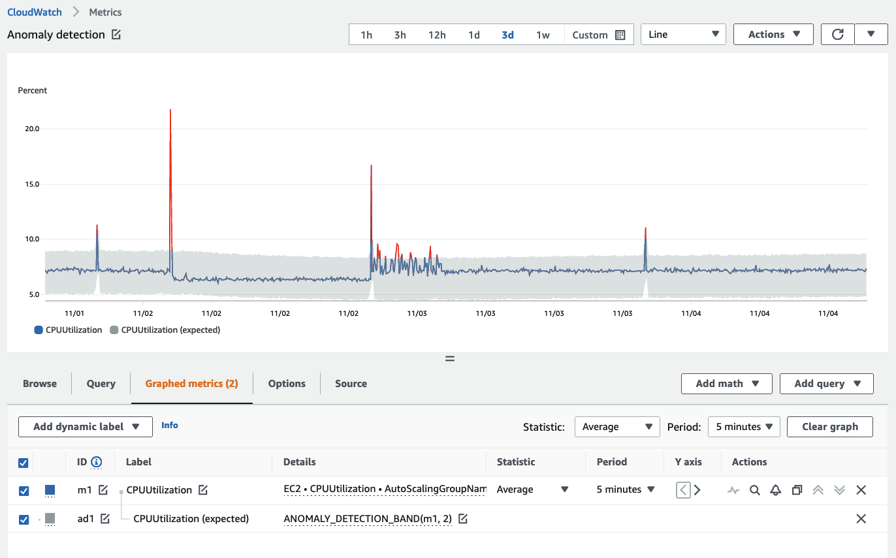

# மெட்ரிக்குகள்

மெட்ரிக்குகள் என்பது உங்கள் சிஸ்டத்தின் செயல்திறன் பற்றிய தரவு ஆகும். சிஸ்டம் அல்லது ரிசோர்ஸ்களுடன் தொடர்புடைய அனைத்து மெட்ரிக்குகளையும் ஒரு மையப்படுத்தப்பட்ட இடத்தில் வைத்திருப்பது, மெட்ரிக்குகளை ஒப்பிடவும், செயல்திறனை பகுப்பாய்வு செய்யவும், ரிசோர்ஸ்களை ஸ்கேல்-அப் அல்லது ஸ்கேல்-இன் செய்வது போன்ற சிறந்த மூலோபாய முடிவுகளை எடுக்கவும் உங்களுக்கு திறனை வழங்குகிறது. ரிசோர்ஸ்களின் ஆரோக்கியத்தை அறிந்துகொள்ளவும் முன்கூட்டிய நடவடிக்கைகள் எடுக்கவும் மெட்ரிக்குகள் முக்கியமானவை.

மெட்ரிக் தரவு அடிப்படையானது மற்றும் [அலாரங்கள்](../signals/alarms.md), anomaly detection, [நிகழ்வுகள்](../signals/events.md), [டாஷ்போர்டுகள்](./dashboards.md) மற்றும் பலவற்றை இயக்க பயன்படுத்தப்படுகிறது.

## வெண்டட் மெட்ரிக்குகள்

[CloudWatch மெட்ரிக்குகள்](https://docs.aws.amazon.com/AmazonCloudWatch/latest/monitoring/working_with_metrics.html) உங்கள் சிஸ்டங்களின் செயல்திறன் பற்றிய தரவை சேகரிக்கிறது. இயல்பாக, பெரும்பாலான AWS சேவைகள் தங்கள் ரிசோர்ஸ்களுக்கு இலவச மெட்ரிக்குகளை வழங்குகின்றன. இதில் [Amazon EC2](https://aws.amazon.com/ec2/) இன்ஸ்டன்ஸ்கள், [Amazon RDS](https://aws.amazon.com/rds/), [Amazon S3](https://aws.amazon.com/s3/?p=pm&c=s3&z=4) பக்கெட்கள் மற்றும் பல அடங்கும்.

இந்த மெட்ரிக்குகளை நாம் *வெண்டட் மெட்ரிக்குகள்* என்று குறிப்பிடுகிறோம். உங்கள் AWS கணக்கில் வெண்டட் மெட்ரிக்குகள் சேகரிப்புக்கு கட்டணம் இல்லை.

:::info
	CloudWatch-க்கு மெட்ரிக்குகளை வெளியிடும் AWS சேவைகளின் முழுமையான பட்டியலுக்கு [இந்தப் பக்கத்தைப் பார்க்கவும்](https://docs.aws.amazon.com/AmazonCloudWatch/latest/monitoring/aws-services-cloudwatch-metrics.html).
:::
## மெட்ரிக்குகளை வினவுதல்

பல மெட்ரிக்குகளை வினவி, மேலும் நுணுக்கமான பகுப்பாய்வுக்கு கணித வெளிப்பாடுகளைப் பயன்படுத்த CloudWatch-ல் [metric math](https://docs.aws.amazon.com/AmazonCloudWatch/latest/monitoring/using-metric-math.html) அம்சத்தைப் பயன்படுத்தலாம். உதாரணமாக, Lambda பிழை விகிதத்தைக் கண்டறிய நீங்கள் ஒரு metric math வெளிப்பாட்டை பின்வருமாறு எழுதலாம்:

	Errors/Requests

கீழே CloudWatch கன்சோலில் இது எவ்வாறு தோன்றும் என்பதற்கான உதாரணம்:


:::info
	உங்கள் தரவிலிருந்து அதிக மதிப்பைப் பெறவும், தனிப்பட்ட தரவு மூலங்களின் செயல்திறனிலிருந்து மதிப்புகளை பெறவும் metric math ஐ பயன்படுத்துங்கள்.
:::
CloudWatch நிபந்தனை அறிக்கைகளையும் ஆதரிக்கிறது. உதாரணமாக, தாமதம் ஒரு குறிப்பிட்ட வரம்பை மீறும் ஒவ்வொரு டைம்சீரிஸிற்கும் `1` மதிப்பையும், மற்ற அனைத்து தரவுப் புள்ளிகளுக்கும் `0` மதிப்பையும் திருப்பி அனுப்ப, ஒரு வினவல் இவ்வாறு இருக்கும்:

	IF(latency>threshold, 1, 0)

CloudWatch கன்சோலில் இந்த லாஜிக்கைப் பயன்படுத்தி boolean மதிப்புகளை உருவாக்கலாம், இது [CloudWatch அலாரங்கள்](./alarms.md) அல்லது பிற நடவடிக்கைகளைத் தூண்டும். இது பெறப்பட்ட தரவுப் புள்ளிகளிலிருந்து தானியங்கி நடவடிக்கைகளை செயல்படுத்த முடியும். CloudWatch கன்சோலிலிருந்து ஒரு உதாரணம் கீழே உள்ளது:


:::info
	பெறப்பட்ட மதிப்புகளுக்கான வரம்புகளை செயல்திறன் மீறும்போது அலாரங்கள் மற்றும் அறிவிப்புகளைத் தூண்ட நிபந்தனை அறிக்கைகளைப் பயன்படுத்துங்கள்.
:::
எந்த மெட்ரிக்கிற்கும் முதல் `n` ஐக் காட்ட `SEARCH` செயல்பாட்டையும் பயன்படுத்தலாம். பெரிய எண்ணிக்கையிலான டைம்சீரிஸ்களில் (உதா. ஆயிரக்கணக்கான சர்வர்கள்) சிறப்பாக அல்லது மோசமாக செயல்படும் மெட்ரிக்குகளை காட்சிப்படுத்தும்போது, இந்த அணுகுமுறை மிக முக்கியமான தரவை மட்டும் பார்க்க அனுமதிக்கிறது. கடந்த ஐந்து நிமிடங்களில் சராசரியாக அதிக CPU பயன்படுத்தும் முதல் இரண்டு EC2 இன்ஸ்டன்ஸ்களைத் திருப்பி அனுப்பும் தேடலின் உதாரணம் இங்கே:
```
	SLICE(SORT(SEARCH('{AWS/EC2,InstanceId} MetricName="CPUUtilization"', 'Average', 300), MAX, DESC),0, 2)
```
CloudWatch கன்சோலில் அதே காட்சி:



:::info
	உங்கள் சூழலில் மதிப்புள்ள அல்லது மோசமாக செயல்படும் ரிசோர்ஸ்களை விரைவாகக் காண்பிக்க `SEARCH` அணுகுமுறையைப் பயன்படுத்தி, பின்னர் இவற்றை [டாஷ்போர்டுகளில்](./dashboards.md) காண்பிக்கவும்.
:::
## மெட்ரிக்குகளை சேகரித்தல்

உங்கள் EC2 இன்ஸ்டன்ஸ்களுக்கு நினைவகம் அல்லது டிஸ்க் ஸ்பேஸ் பயன்பாடு போன்ற கூடுதல் மெட்ரிக்குகள் வேண்டுமெனில், இந்தத் தரவை உங்கள் சார்பாக CloudWatch-க்கு அனுப்ப [CloudWatch ஏஜெண்ட்](./cloudwatch_agent.md) ஐ பயன்படுத்தலாம். அல்லது, வரைபடமாக காட்சிப்படுத்தப்பட வேண்டிய தனிப்பயன் செயலாக்கத் தரவு இருந்தால், இந்தத் தரவை CloudWatch மெட்ரிக்காக இருக்க விரும்பினால், CloudWatch-க்கு தனிப்பயன் மெட்ரிக்குகளை வெளியிட [`PutMetricData` API](https://docs.aws.amazon.com/AmazonCloudWatch/latest/APIReference/API_PutMetricData.html) ஐ பயன்படுத்தலாம்.

:::info
	மூல API-க்கு பதிலாக CloudWatch-க்கு மெட்ரிக் தரவை அனுப்ப [AWS SDKs](https://aws.amazon.com/developer/tools/) ஐ பயன்படுத்துங்கள்.
:::
`PutMetricData` API அழைப்புகள் வினவல்களின் எண்ணிக்கையின் அடிப்படையில் கட்டணம் விதிக்கப்படுகின்றன. `PutMetricData` API-ஐ உகந்த முறையில் பயன்படுத்துவது சிறந்த நடைமுறையாகும். இந்த API-யில் Values மற்றும் Counts முறையைப் பயன்படுத்தி, ஒரு `PutMetricData` கோரிக்கையுடன் ஒரு மெட்ரிக்கிற்கு 150 மதிப்புகள் வரை வெளியிடலாம், மேலும் இந்தத் தரவில் percentile புள்ளிவிவரங்களை மீட்டெடுப்பதை ஆதரிக்கிறது. எனவே, ஒவ்வொரு தரவுப் புள்ளிக்கும் தனி API அழைப்புகள் செய்வதற்குப் பதிலாக, உங்கள் அனைத்து தரவுப் புள்ளிகளையும் ஒன்றாகக் குழுவாக்கி ஒரே `PutMetricData` API அழைப்பில் CloudWatch-க்கு அனுப்ப வேண்டும். இந்த அணுகுமுறை பயனருக்கு இரண்டு வழிகளில் பயனளிக்கிறது:

1. CloudWatch விலை நிர்ணயம்
1. `PutMetricData` API த்ரோட்டிலிங் தடுக்கப்படலாம்

:::info
	`PutMetricData` பயன்படுத்தும்போது, முடிந்தவரை உங்கள் தரவை ஒற்றை `PUT` செயல்பாடுகளாக தொகுப்பது சிறந்த நடைமுறையாகும்.
:::
:::info
	CloudWatch-க்கு அதிக அளவு மெட்ரிக்குகள் வெளியிடப்பட்டால், மாற்று அணுகுமுறையாக [Embedded Metric Format](https://docs.aws.amazon.com/AmazonCloudWatch/latest/monitoring/CloudWatch_Embedded_Metric_Format_Manual.html) ஐ கருத்தில் கொள்ளுங்கள். Embedded Metric Format `PutMetricData` ஐ பயன்படுத்தாது அல்லது அதற்கு கட்டணம் விதிக்காது என்பதை கவனிக்கவும், ஆனால் [CloudWatch Logs](./logs/index.md) பயன்பாட்டிலிருந்து கட்டணம் வசூலிக்கப்படும்.
:::
## Anomaly Detection

CloudWatch-ல் [anomaly detection](https://docs.aws.amazon.com/AmazonCloudWatch/latest/monitoring/CloudWatch_Anomaly_Detection.html) அம்சம் உள்ளது, இது பதிவுசெய்யப்பட்ட மெட்ரிக்குகளின் அடிப்படையில் *இயல்பானது* என்ன என்பதைக் கற்றுக்கொள்வதன் மூலம் உங்கள் Observability உத்தியை மேம்படுத்துகிறது. Anomaly detection ஐ பயன்படுத்துவது எந்த மெட்ரிக் சிக்னல் சேகரிப்பு அமைப்புக்கும் [சிறந்த நடைமுறையாகும்](../signals/metrics.md#use-anomaly-detection-algorithms).

Anomaly detection இரண்டு வாரகால காலப்பகுதியில் ஒரு மாடலை உருவாக்குகிறது.

:::warning
	Anomaly detection அதன் மாடலை உருவாக்கப்பட்ட நேரத்திலிருந்து மட்டுமே உருவாக்குகிறது. முந்தைய விலகல்களைக் கண்டறிய கடந்த காலத்தை நோக்கி திரும்பிப் பார்க்காது.
:::

:::warning
	Anomaly detection ஒரு மெட்ரிக்கிற்கு *நல்லது* என்ன என்பதை அறியாது, நிலையான விலகலின் அடிப்படையில் *இயல்பானது* என்ன என்பதை மட்டுமே அறியும்.
:::

:::info
	நாளின் இயல்பான நடத்தை எதிர்பார்க்கப்படும் நேரங்களை மட்டும் பகுப்பாய்வு செய்ய உங்கள் anomaly detection மாடல்களை பயிற்சி அளிப்பது சிறந்த நடைமுறையாகும். பயிற்சியிலிருந்து விலக்க காலகட்டங்களை (இரவுகள், வார இறுதிகள் அல்லது விடுமுறைகள் போன்றவை) வரையறுக்கலாம்.
:::
Anomaly detection band-ன் உதாரணத்தை இங்கே காணலாம், band சாம்பல் நிறத்தில் உள்ளது.



Anomaly detection-க்கான விலக்கு சாளரங்களை CloudWatch கன்சோல், [CloudFormation](https://docs.aws.amazon.com/AWSCloudFormation/latest/UserGuide/aws-properties-cloudwatch-anomalydetector-configuration.html), அல்லது AWS SDKs-ல் ஒன்றைப் பயன்படுத்தி அமைக்கலாம்.
