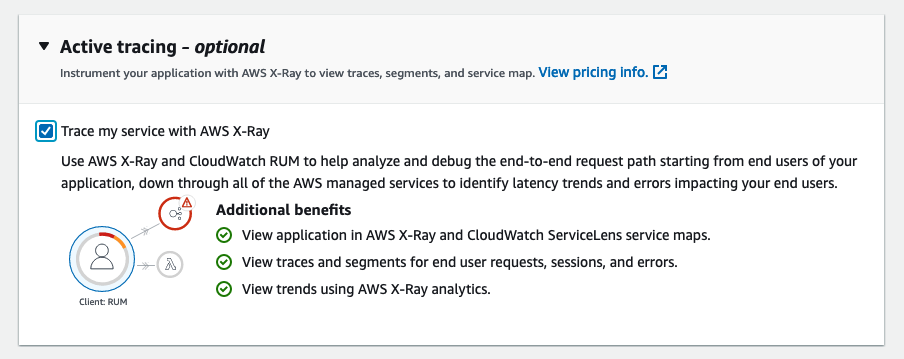

# Real User Monitoring

CloudWatch RUM மூலம், உண்மையான பயனர் அமர்வுகளிலிருந்து உங்கள் வலை பயன்பாட்டு செயல்திறன் பற்றிய கிளையன்ட்-பக்க தரவை கிட்டத்தட்ட நிகழ்நேரத்தில் சேகரிக்கவும் பார்க்கவும் Real User Monitoring செய்யலாம். நீங்கள் காட்சிப்படுத்தி பகுப்பாய்வு செய்யக்கூடிய தரவில் பக்க ஏற்ற நேரங்கள், கிளையன்ட்-பக்க பிழைகள் மற்றும் பயனர் நடத்தை ஆகியவை அடங்கும். இந்த தரவைப் பார்க்கும்போது, அனைத்தையும் ஒருங்கிணைத்துப் பார்க்கலாம், மேலும் உங்கள் வாடிக்கையாளர்கள் பயன்படுத்தும் உலாவிகள் மற்றும் சாதனங்கள் வாரியாக பிரிவுகளையும் பார்க்கலாம்.


## வலை கிளையன்ட்

CloudWatch RUM வலை கிளையன்ட் Node.js பதிப்பு 16 அல்லது அதற்கு மேல் பயன்படுத்தி உருவாக்கப்பட்டுள்ளது. குறியீடு GitHub-ல் [பொதுவாகக் கிடைக்கிறது](https://github.com/aws-observability/aws-rum-web). [Angular](https://github.com/aws-observability/aws-rum-web/blob/main/docs/cdn_angular.md) மற்றும் [React](https://github.com/aws-observability/aws-rum-web/blob/main/docs/cdn_react.md) பயன்பாடுகளுடன் கிளையன்ட்டைப் பயன்படுத்தலாம்.

CloudWatch RUM உங்கள் பயன்பாட்டின் ஏற்ற நேரம், செயல்திறன் மற்றும் இறக்க நேரத்தில் உணரக்கூடிய தாக்கத்தை ஏற்படுத்தாதவாறு வடிவமைக்கப்பட்டுள்ளது.

:::note
    CloudWatch RUM-க்காக நீங்கள் சேகரிக்கும் இறுதிப் பயனர் தரவு 30 நாட்களுக்குத் தக்கவைக்கப்பட்டு பின்னர் தானாக நீக்கப்படும். RUM நிகழ்வுகளை நீண்ட நேரம் வைத்திருக்க விரும்பினால், app monitor நிகழ்வுகளின் நகல்களை உங்கள் கணக்கில் CloudWatch Logs-க்கு அனுப்பும்படி தேர்வு செய்யலாம்.
:::
:::tip
    உங்கள் வலை பயன்பாட்டிற்கு விளம்பர தடுப்பான்களால் ஏற்படக்கூடிய குறுக்கீடுகளைத் தவிர்ப்பது கவலையாக இருந்தால், உங்கள் சொந்த உள்ளடக்க விநியோக நெட்வொர்க்கில் அல்லது உங்கள் சொந்த வலைத்தளத்திற்குள் வலை கிளையன்ட்டை ஹோஸ்ட் செய்ய விரும்பலாம். எங்கள் [GitHub ஆவணம்](https://github.com/aws-observability/aws-rum-web/blob/main/docs/cdn_installation.md) உங்கள் சொந்த origin domain-லிருந்து வலை கிளையன்ட்டை ஹோஸ்ட் செய்வதற்கான வழிகாட்டுதலை வழங்குகிறது.
:::

## உங்கள் பயன்பாட்டை அங்கீகரித்தல்

CloudWatch RUM-ஐப் பயன்படுத்த, உங்கள் பயன்பாடு மூன்று விருப்பங்களில் ஒன்றின் மூலம் அங்கீகாரம் பெற்றிருக்க வேண்டும்.

1. நீங்கள் ஏற்கனவே அமைத்துள்ள identity provider-லிருந்து அங்கீகாரத்தைப் பயன்படுத்துதல்.
1. ஏற்கனவே உள்ள Amazon Cognito identity pool-ஐப் பயன்படுத்துதல்.
1. CloudWatch RUM பயன்பாட்டிற்கு புதிய Amazon Cognito identity pool-ஐ உருவாக்க அனுமதித்தல்.

:::info
    CloudWatch RUM பயன்பாட்டிற்கு புதிய Amazon Cognito identity pool-ஐ உருவாக்க அனுமதிப்பது அமைக்க குறைந்தபட்ச முயற்சி தேவைப்படுகிறது. இது இயல்புநிலை விருப்பமாகும்.
:::
:::tip
    CloudWatch RUM அங்கீகரிக்கப்படாத பயனர்களை அங்கீகரிக்கப்பட்ட பயனர்களிடமிருந்து பிரிக்கும்படி உள்ளமைக்கலாம். விவரங்களுக்கு [இந்த வலைப்பதிவு இடுகையைப்](https://aws.amazon.com/blogs/mt/how-to-isolate-signed-in-users-from-guest-users-within-amazon-cloudwatch-rum/) பாருங்கள்.
:::
## தரவு பாதுகாப்பு & தனியுரிமை

CloudWatch RUM கிளையன்ட் இறுதிப் பயனர் தரவை சேகரிக்க உதவ குக்கீகளைப் பயன்படுத்தலாம். இது பயனர் பயணம் அம்சத்திற்கு பயனுள்ளது, ஆனால் கட்டாயமில்லை. தனியுரிமை தொடர்பான தகவலுக்கு [எங்கள் விரிவான ஆவணத்தைப்](https://docs.aws.amazon.com/AmazonCloudWatch/latest/monitoring/CloudWatch-RUM-privacy.html) பாருங்கள்.[^1]

:::tip
    RUM பயன்படுத்தி வலை பயன்பாட்டு டெலிமெட்ரி சேகரிப்பு பாதுகாப்பானது மற்றும் கன்சோல் அல்லது CloudWatch Logs மூலம் தனிப்பட்ட அடையாளத் தகவலை (PII) உங்களுக்கு வெளிப்படுத்தாது, ஆனால் வலை கிளையன்ட் மூலம் [தனிப்பயன் பண்புக்கூறுகளை](https://docs.aws.amazon.com/AmazonCloudWatch/latest/monitoring/CloudWatch-RUM-custom-metadata.html) சேகரிக்க முடியும் என்பதை நினைவில் கொள்ளுங்கள். இந்த வழிமுறையைப் பயன்படுத்தி முக்கிய தரவை வெளிப்படுத்தாமல் கவனமாக இருங்கள்.
:::

## கிளையன்ட் குறியீடு ஸ்னிப்பெட்

CloudWatch RUM வலை கிளையன்ட்டின் குறியீடு ஸ்னிப்பெட் தானாக உருவாக்கப்படும் அதே நேரத்தில், உங்கள் தேவைகளுக்கு ஏற்ப கிளையன்ட்டை உள்ளமைக்க குறியீடு ஸ்னிப்பெட்டை கைமுறையாகவும் மாற்றலாம்.
:::info
    ஒற்றை பக்க பயன்பாடுகளில் குக்கீ உருவாக்கத்தை மாறும் வகையில் இயக்க குக்கீ சம்மத வழிமுறையைப் பயன்படுத்தவும். மேலும் தகவலுக்கு [இந்த வலைப்பதிவு இடுகையைப்](https://aws.amazon.com/blogs/mt/how-and-when-to-enable-session-cookies-with-amazon-cloudwatch-rum/) பாருங்கள்.
:::
### URL சேகரிப்பை முடக்குதல்

தனிப்பட்ட தகவல்களைக் கொண்டிருக்கக்கூடிய resource URL-களின் சேகரிப்பைத் தடுக்கவும்.

:::info
    உங்கள் பயன்பாடு தனிப்பட்ட அடையாளத் தகவலை (PII) கொண்ட URL-களைப் பயன்படுத்தினால், குறியீடு ஸ்னிப்பெட் உள்ளமைவில் `recordResourceUrl: false` அமைத்து, உங்கள் பயன்பாட்டில் செருகும் முன் resource URL சேகரிப்பை முடக்குவது கடுமையாக பரிந்துரைக்கப்படுகிறது.
:::

### Active Tracing-ஐ இயக்குதல்

வலை கிளையன்ட்டில் `addXRayTraceIdHeader: true` அமைத்து எண்ட்-டு-எண்ட் ட்ரேஸிங்கை இயக்கவும். இது CloudWatch RUM வலை கிளையன்ட் HTTP கோரிக்கைகளில் X-Ray trace header-ஐ சேர்க்கச் செய்கிறது.

இந்த விருப்ப அமைப்பை இயக்கினால், app monitor-ஆல் மாதிரியாக்கப்பட்ட பயனர் அமர்வுகளின் போது செய்யப்பட்ட XMLHttpRequest மற்றும் fetch கோரிக்கைகள் ட்ரேஸ் செய்யப்படும். பின்னர் RUM டாஷ்போர்டு, CloudWatch ServiceLens கன்சோல் மற்றும் X-Ray கன்சோலில் இந்த பயனர் அமர்வுகளின் ட்ரேஸ்கள் மற்றும் செக்மென்ட்களைப் பார்க்கலாம்.

AWS Console-ல் உங்கள் application monitor-ஐ அமைக்கும்போது active tracing-ஐ இயக்க checkbox-ஐ கிளிக் செய்து, உங்கள் குறியீடு ஸ்னிப்பெட்டில் அமைப்பு தானாக இயக்கப்படும்படி செய்யலாம்.



### ஸ்னிப்பெட்டைச் செருகுதல்

முந்தைய பிரிவில் நீங்கள் நகலெடுத்த அல்லது பதிவிறக்கிய குறியீடு ஸ்னிப்பெட்டை உங்கள் பயன்பாட்டின் `<head>` உறுப்பிற்குள் செருகவும். `<body>` உறுப்பு அல்லது வேறு `<script>` குறிச்சொற்களுக்கு முன் செருகவும்.

:::info
    உங்கள் பயன்பாட்டில் பல பக்கங்கள் இருந்தால், அனைத்து பக்கங்களிலும் சேர்க்கப்பட்ட பகிரப்பட்ட header component-ல் குறியீடு ஸ்னிப்பெட்டைச் செருகவும்.
:::

:::warning
    வலை கிளையன்ட் `<head>` உறுப்பில் முடிந்தவரை முன்பாக இருப்பது மிக முக்கியம்! பக்கத்தின் HTML-ன் கீழ் பகுதியில் ஏற்றப்படும் செயலற்ற வலை கண்காணிப்பாளர்களைப் போலல்லாமல், RUM அதிக செயல்திறன் தரவைப் பிடிக்க பக்க ரெண்டர் செயல்முறையின் ஆரம்பத்திலேயே துவக்கப்பட வேண்டும்.
:::
## தனிப்பயன் மெட்டாடேட்டாவைப் பயன்படுத்துதல்

CloudWatch RUM நிகழ்வுகளின் இயல்பு [நிகழ்வு மெட்டாடேட்டாவுக்கு](https://docs.aws.amazon.com/AmazonCloudWatch/latest/monitoring/CloudWatch-RUM-datacollected.html#CloudWatch-RUM-datacollected-metadata) தனிப்பயன் மெட்டாடேட்டாவைச் சேர்க்கலாம். அமர்வு பண்புக்கூறுகள் ஒரு பயனரின் அமர்வில் உள்ள அனைத்து நிகழ்வுகளுக்கும் சேர்க்கப்படும். பக்க பண்புக்கூறுகள் குறிப்பிட்ட பக்கங்களுக்கு மட்டுமே சேர்க்கப்படும்.

:::info
    உங்கள் தனிப்பயன் பண்புக்கூறுகளின் விசைப் பெயர்களாக [இந்த பக்கத்தில்](https://docs.aws.amazon.com/AmazonCloudWatch/latest/monitoring/CloudWatch-RUM-custom-metadata.html#CloudWatch-RUM-custom-metadata-syntax) குறிப்பிடப்பட்ட ஒதுக்கப்பட்ட சொற்களைப் பயன்படுத்துவதைத் தவிர்க்கவும்.
:::
## பக்க குழுக்களைப் பயன்படுத்துதல்

:::info
    உங்கள் பயன்பாட்டில் உள்ள வெவ்வேறு பக்கங்களை ஒன்றாக இணைக்க பக்க குழுக்களைப் பயன்படுத்தவும், இதன் மூலம் பக்கக் குழுக்களுக்கான ஒருங்கிணைந்த பகுப்பாய்வைப் பார்க்கலாம். எடுத்துக்காட்டாக, வகை மற்றும் மொழி வாரியாக உங்கள் அனைத்து பக்கங்களின் ஒருங்கிணைந்த பக்க ஏற்ற நேரங்களைப் பார்க்க விரும்பலாம்.

    ```
    awsRum.recordPageView({ pageId: '/home', pageTags: ['en', 'landing']})
    ```
:::
## விரிவாக்கப்பட்ட மெட்ரிக்குகளைப் பயன்படுத்துதல்

CloudWatch RUM தானாகச் சேகரிக்கும் [இயல்பு மெட்ரிக்குகளின் தொகுப்பு](https://docs.aws.amazon.com/AmazonCloudWatch/latest/monitoring/CloudWatch-RUM-metrics.html) `AWS/RUM` எனப் பெயரிடப்பட்ட மெட்ரிக் நேம்ஸ்பேஸில் வெளியிடப்படுகிறது. இவை RUM உங்கள் சார்பாக உருவாக்கும் இலவச [வழங்கப்பட்ட மெட்ரிக்குகள்](./metrics.md#vended-metrics) ஆகும்.

:::info
    CloudWatch RUM மெட்ரிக்குகளை கூடுதல் பரிமாணங்களுடன் CloudWatch-க்கு அனுப்பவும், இதனால் மெட்ரிக்குகள் மிகவும் நுணுக்கமான பார்வையை வழங்கும்.
:::
விரிவாக்கப்பட்ட மெட்ரிக்குகளுக்கு ஆதரிக்கப்படும் பரிமாணங்கள்:

- BrowserName
- CountryCode - ISO-3166 வடிவம் (இரண்டு எழுத்து குறியீடு)
- DeviceType
- FileType
- OSName
- PageId

இருப்பினும், எங்கள் [இந்த பக்கத்தின் வழிகாட்டுதலைப்](https://aws.amazon.com/blogs/mt/create-metrics-and-alarms-for-specific-web-pages-amazon-cloudwatch-rum/) பயன்படுத்தி உங்கள் சொந்த மெட்ரிக்குகள் மற்றும் அவற்றின் அடிப்படையிலான அலாரங்களை உருவாக்கலாம். இந்த அணுகுமுறை உங்களுக்குத் தேவையான எந்த தரவுப் புள்ளி, URI அல்லது பிற கூறுக்கும் செயல்திறனைக் கண்காணிக்க உதவுகிறது.

[^1]: CloudWatch RUM-ல் குக்கீகளைப் பயன்படுத்தும்போது கருத்தில் கொள்ள வேண்டியவற்றை விவாதிக்கும் எங்கள் [வலைப்பதிவு இடுகையைப்](https://aws.amazon.com/blogs/mt/how-and-when-to-enable-session-cookies-with-amazon-cloudwatch-rum/) பாருங்கள்.
