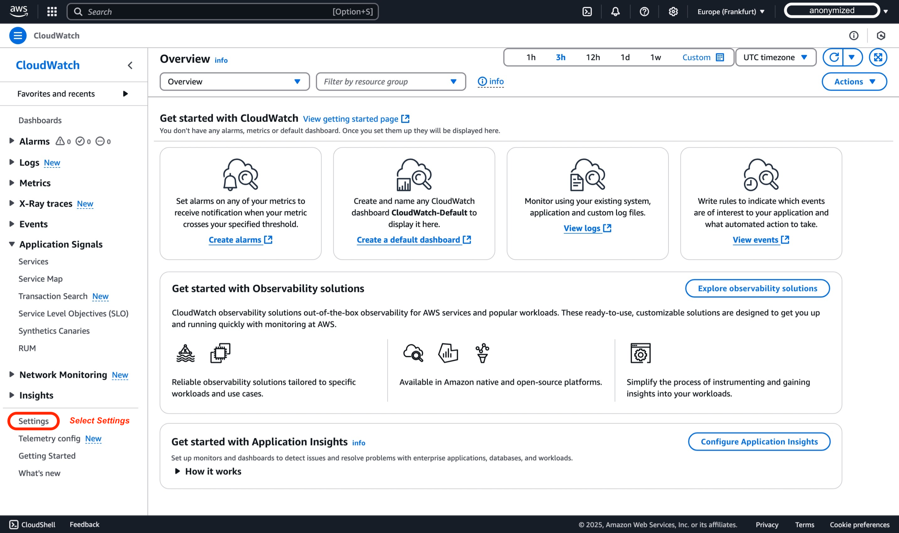
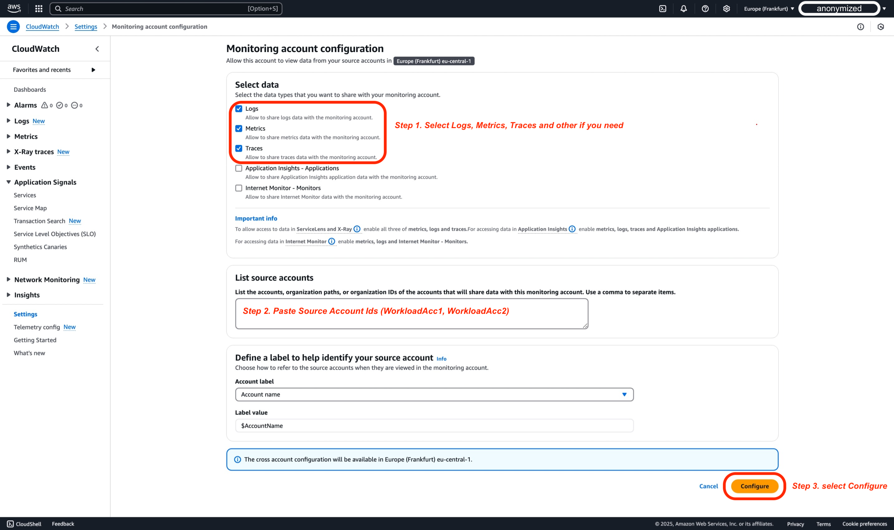
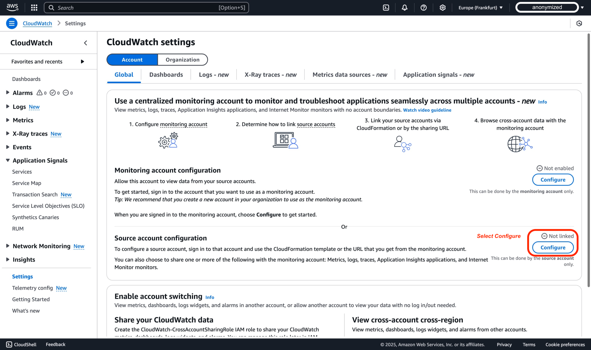
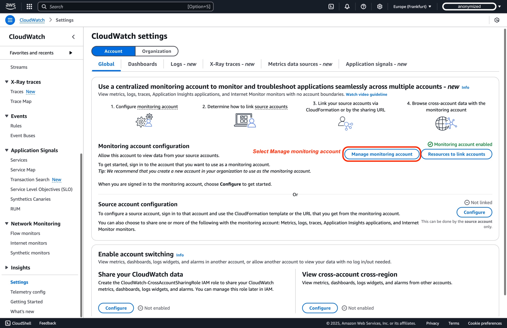
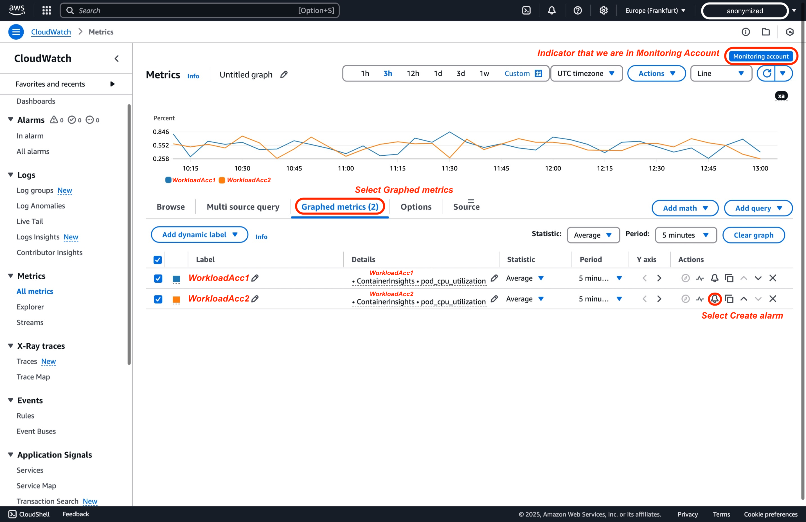

# CloudWatch Cross-Account Observability

బహుళ AWS accounts లో ఒకే AWS Region లో deploy చేయబడిన applications ను monitor చేయడం సవాలుగా ఉంటుంది. [Amazon CloudWatch యొక్క cross-account observability](https://aws.amazon.com/blogs/aws/new-amazon-cloudwatch-cross-account-observability/)[^1] బహుళ accounts లో విస్తరించిన applications యొక్క సమగ్ర monitoring మరియు troubleshooting ను సరళీకరిస్తుంది, ఒక [**AWS Region**](https://docs.aws.amazon.com/AmazonCloudWatch/latest/monitoring/CloudWatch-Unified-Cross-Account.html)[^2] లో. ఈ tutorial రెండు AWS accounts మధ్య cross-account observability ని configure చేయడంపై screenshots తో పూర్తి దశల వారీ మార్గదర్శిని అందిస్తుంది. అదనంగా, విస్తృత scalability కోసం AWS Organizations ద్వారా కూడా deployment సాధ్యమని గమనించవలసిన విషయం.

## పరిభాష

Amazon CloudWatch తో ప్రభావవంతమైన cross-account observability కోసం, మీరు కింది ముఖ్యమైన పదాలను అర్థం చేసుకోవాలి:

| **పదం** | **వివరణ** |
|------|-------------|
| **Monitoring Account** | బహుళ source accounts నుండి ఉత్పత్తి చేయబడిన observability data ను వీక్షించగల మరియు అంతరాయం చేయగల ఒక central AWS account |
| **Source Account** | దానిలో ఉన్న resources కోసం observability data ను ఉత్పత్తి చేసే ఒక వ్యక్తిగత AWS account |
| **Sink** | Source accounts లింక్ చేసి వారి observability data ను share చేయడానికి attachment point గా పనిచేసే monitoring account లోని ఒక resource. ప్రతి account కు ఒక్కో [AWS Region](https://docs.aws.amazon.com/AmazonCloudWatch/latest/monitoring/CloudWatch-Unified-Cross-Account.html)[^2] కు ఒక **Sink** ఉంటుంది |
| **Observability Link** | Source account మరియు monitoring account మధ్య ఏర్పడిన connection ను సూచించే resource, observability data sharing ను సులభతరం చేస్తుంది. Links ను source account నిర్వహిస్తుంది. |

Amazon CloudWatch లో cross-account observability ని విజయవంతంగా configure చేసి నిర్వహించడానికి ఈ నిర్వచనాలను అర్థం చేసుకోండి.

## పరిగణించవలసిన అంశాలు
1. Account Limits: మీరు ఒక monitoring account కు 100,000 వరకు source accounts ను లింక్ చేయవచ్చు, అతిపెద్ద enterprise setups కూడా accommodate చేయగలుగుతాయి.
2. Cross Region: Cross-Region functionality ఈ feature లో స్వయంచాలకంగా అంతర్నిర్మితం. వేరే Regions నుండి metrics ను ఒకే account లో ఒకే graph లేదా ఒకే dashboard లో ప్రదర్శించడానికి మీరు ఎటువంటి అదనపు చర్యలు తీసుకోవలసిన అవసరం లేదు.
3. Data Retention: అన్ని data retention source account స్థాయిలో నిర్వహించబడుతుంది. Monitoring account data ను store చేయదు లేదా duplicate చేయదు. Monitoring account కు source accounts data పై read-only access ఉంటుంది. వాస్తవ data transfer లేదా synchronization జరగదు.
4. Cost Implications: ఆశ్చర్యకరంగా, Cross-Account Observability తో అనుబంధించిన అదనపు ఖర్చులు లేవు. Data source accounts లోనే ఉండి monitoring account ద్వారా మాత్రమే read చేయబడుతుంది కాబట్టి, అదనపు data transfer లేదా storage charges లేవు.
5. Source account (X) నుండి monitoring account (Y) కు traces share చేయడానికి cross-account observability ఉపయోగించినప్పుడు, traces duplicate అయ్యి monitoring account (Y) లో store చేయబడతాయి. ఈ ప్రక్రియ source account (X) కు అదనపు ఖర్చులు కలిగించదు, అసలు billing ను ప్రభావితం చేయకుండా accounts అంతటా monitoring సామర్థ్యాలను విస్తరించవచ్చు.
6. CloudWatch Service Quotas ప్రకారం, ప్రతి dashboard లో 500 widgets వరకు ఉండవచ్చు. ఒక unique widget 500 metrics వరకు కలిగి ఉంటుంది, మరియు unique dashboard అన్ని widgets లో 2500 metrics వరకు కలిగి ఉంటుంది. ఈ quotas metric math functions లో ఉపయోగించడానికి retrieve చేసిన అన్ని metrics ను కలిగి ఉంటాయి, ఆ metrics graph లో ప్రదర్శించబడకపోయినా. ఈ quotas hard quotas మరియు వాటిని మార్చడం సాధ్యం కాదు.
7. Amazon CloudWatch Logs Insights లో, మీరు వాటిని వ్యక్తిగతంగా specify చేస్తే ఒక query కు గరిష్టంగా 50 log groups ను query చేయవచ్చు. ఈ limit స్థిరమైనది మరియు పెంచడం సాధ్యం కాదు. అయితే, మీరు log group criteria ఉపయోగిస్తే—name prefixes ఆధారంగా log groups ఎంచుకోవడం లేదా "all log groups" ను query చేయడం ఎంచుకోవడం వంటివి—మీరు ఒకే query లో 10,000 log groups వరకు include చేయవచ్చు, బహుళ groups అంతటా విస్తృత log analysis చేయవచ్చు.
8. CloudWatch Cross-Account Observability లో Logs మరియు Metrics తో పని చేసేటప్పుడు, monitoring account తో అన్ని namespaces నుండి metrics share చేయడం ఎంచుకోవచ్చు, లేదా namespaces subset కు filter చేయవచ్చు.
9. Cross-account scenario లో Alarms తో పని చేసేటప్పుడు కొన్ని పరిగణనలు:
   1. CloudWatch Metrics Insights అనేది ఒక శక్తివంతమైన high-performance SQL query engine, ఇది cross-account observability scenarios వంటి వాటిలో మీ metrics ను scale వద్ద query చేయడానికి ఉపయోగించవచ్చు, ఇక్కడ మీరు బహుళ accounts నుండి వందల metrics ను query చేయవలసి రావచ్చు.
    2. Alarm set up చేసేటప్పుడు, ఇది ఒకే time series return చేసే query నుండి ఉండాలి, ఇది SELECT expression ద్వారా సాధించవచ్చు, అయితే, మీరు SUM, MIN, MAX, COUNT మరియు AVG statistics మాత్రమే ఉపయోగించవచ్చు.
    3. అలాగే, real time లో metrics ను నిర్దిష్ట dimension value ప్రకారం ప్రత్యేక time series లుగా group చేయడానికి "group by" clause ఉపయోగించడం సాధ్యం. అలాగే, "Top N" type queries చేయడానికి "order by" ability ఉపయోగించడం సాధ్యం.
    4. Queries create చేయడానికి natural language ఉపయోగించడం సాధ్యం. అలా చేయడానికి, మీరు చూస్తున్న data గురించి ప్రశ్నలు అడగండి లేదా వివరించండి. ఈ AI-assisted capability మీ prompt ఆధారంగా query generate చేస్తుంది మరియు query ఎలా పని చేస్తుందో line-by-line వివరణ అందిస్తుంది.
    5. SEARCH expression ఆధారంగా alarm create చేయడం సాధ్యం కాదు. ఎందుకంటే search expressions బహుళ time series return చేస్తాయి, మరియు math expression ఆధారంగా ఉన్న alarm ఒకే time series ను మాత్రమే watch చేయగలదు. అలాగే, SEARCH function కలిగి ఉన్న math expression (ఉదాహరణకు "MAX") పై alarm లేదా alert చేయడం సాధ్యం కాదు. ఈ scenario ని CloudWatch Custom Data Sources ద్వారా సాధించవచ్చు.
    6. Alarms కోసం Cross-Region functionality support చేయబడదు, కాబట్టి ఒక Region లో alarm create చేసి వేరే Region లోని metric ను watch చేయడం సాధ్యం కాదు.

10. Data Protection Policy: Source account లో data protection policy enable అయి ఉంటే, స్పష్టమైన permissions ఇవ్వకపోతే monitoring account data ను access చేయలేదు.


## AWS Console ద్వారా దశల వారీ Tutorial

### ముందస్తు అవసరాలు

1. ఈ tutorial పూర్తి చేయడానికి, మీకు మూడు AWS accounts అవసరం: ఒక Monitoring Account మరియు రెండు Source Accounts.

2. Cross-account links create చేయడానికి user లేదా role కు కనీసం [AWS CloudWatch cross-account setup guide](https://docs.aws.amazon.com/AmazonCloudWatch/latest/monitoring/CloudWatch-Unified-Cross-Account-Setup.html#CloudWatch-Unified-Cross-Account-Setup-permissions)[^3] లో documented చేయబడిన permissions ఉండాలి.

<div style={{ textAlign: 'center' }}>

</div>

### Step 1: Monitoring Account సెటప్ చేయడం

#### Monitoring Account

Monitoring account సెటప్ చేయడానికి, ఈ దశలను అనుసరించండి:

1. CloudWatch console ను [https://console.aws.amazon.com/cloudwatch](https://console.aws.amazon.com/cloudwatch) వద్ద తెరిచి, cross-account monitoring account configure చేయాలనుకునే AWS region ను ఎంచుకోండి, ఈ demo పరిధిలో మేము Europe (Frankfurt) region (eu-central-1) ఉపయోగిస్తాము.


2. Navigation pane లో, **Settings** ఎంచుకోండి.


3. ఈ demo పరిధిలో, మేము default Account Global settings ఉపయోగిస్తాము, ఆపై **Monitoring account configuration** section లోని **Configure** ఎంచుకోండి.


4. Monitoring account తో share చేయవలసిన data types ఎంచుకున్న తర్వాత, Source Account IDs ను "List source accounts" box లో paste చేయండి. ఈ demo కోసం, WorkloadAcc1 మరియు WorkloadAcc2 IDs ఉపయోగించబడ్డాయి. Metrics, Logs, మరియు Traces ఎంపిక చేయబడ్డాయి. Metrics మరియు Logs మాత్రమే filtering ను అనుమతిస్తాయి; మిగతావన్నీ ఎల్లప్పుడూ పూర్తిగా share చేయబడతాయి. ServiceLens మరియు X-Ray కోసం, మీరు metrics, logs, మరియు traces enable చేయాలని గమనించండి. Application Insights కోసం, Application Insights applications కూడా enable చేయండి. Internet Monitor కోసం, metrics, logs, మరియు Internet Monitor – Monitors enable చేయండి.


:::info
CloudWatch Cross-Account Observability లో telemetry types configure చేసేటప్పుడు, వాటి dependencies అర్థం చేసుకోవడం ముఖ్యం. Metrics, Logs మరియు Traces స్వతంత్రంగా configure చేయవచ్చు, కానీ ఇతర CloudWatch functionalities కు నిర్దిష్ట requirements ఉన్నాయి. ServiceLens మరియు X-Ray functionality కు మూడూ అవసరం: Metrics, Logs, మరియు Traces. మరింత advanced monitoring కోసం, Application Insights కు Metrics, Logs, Traces, మరియు Application Insights applications enable చేయాలి. అదేవిధంగా, Internet Monitor కు Metrics, Logs, మరియు Internet Monitor - Monitors enable చేయాలి. కింది table ఈ dependencies వివరిస్తుంది:
:::
    | Telemetry Type | వివరణ | CloudWatch Cross-Account Observability కోసం Dependencies |
    |----------------|-------------|-----------------------------------------------------|
    | Metrics in Amazon CloudWatch | అన్ని metric namespaces share చేయండి లేదా subset కు filter చేయండి | ఏదీ లేదు |
    | Log Groups in Amazon CloudWatch Logs | అన్ని log groups share చేయండి లేదా subset కు filter చేయండి | ఏదీ లేదు |
    | ServiceLens and X-Ray | అన్ని traces share చేయండి (filtering అందుబాటులో లేదు) | ServiceLens మరియు X-Ray కోసం Metrics, Logs, మరియు Traces enable చేయడం అవసరం |
    | Applications in Amazon CloudWatch Application Insights | అన్ని applications share చేయండి (filtering అందుబాటులో లేదు) | Metrics, Logs, Traces, మరియు Application Insights applications enable చేయడం అవసరం |
    | Monitors in CloudWatch Internet Monitor | అన్ని monitors share చేయండి (filtering అందుబాటులో లేదు) | Metrics, Logs, మరియు Internet Monitor - Monitors enable చేయడం అవసరం |

5. మీ Monitoring Account యొక్క AWS Console లో, Monitoring Account విజయవంతంగా configure అయినట్లు నిర్ధారించే కింది illustration కనిపించాలి.


:::tip
	మీ monitoring account విజయవంతంగా configure అయిన తర్వాత, మీరు మీ source accounts ను లింక్ చేయాలి. Source accounts ను లింక్ చేయడానికి రెండు ప్రధాన పద్ధతులు ఉన్నాయి: AWS Organizations ఉపయోగించడం మరియు వ్యక్తిగత accounts ను లింక్ చేయడం. Step 2 లో, మేము వ్యక్తిగత account configure చేసే ప్రక్రియను చూస్తాము. అయితే, Source Account లోకి login అయ్యి మార్పులు చేయడానికి ముందు, ఇప్పుడే configure చేసిన Monitoring Account నుండి Monitoring account sink ARN వంటి సమాచారం సేకరించాలి.
:::

6. మీరు ముందు ఆగిన Monitoring Account లోని AWS Console లో, **Resources to link accounts** ఎంచుకోండి


7. AWS Console లో, 'Configuration details' section ను expand చేయండి, ఇక్కడ మీరు copy చేసి save చేయవలసిన Monitoring account sink ARN కనుగొంటారు, Step 2 లో source account లింక్ చేసేటప్పుడు ఈ సమాచారం అవసరమవుతుంది.


#### సారాంశం

మునుపటి దశలలో, standalone లేదా organization లో భాగమైన Source Accounts తో లింక్ చేయడానికి Monitoring account sink ను configure చేశాము. ముఖ్యంగా, పై దశలు source accounts integrate కావడానికి అనుమతించే Configuration policy ను Monitoring account sink లో create చేశాయి. AWS Console configuration ద్వారా generate చేయబడిన sample policy కింద కనుగొనవచ్చు:

```
{
    "Version": "2012-10-17",
    "Statement": [
        {
            "Effect": "Allow",
            "Principal": {
                "AWS": [
                    "${WorkloadAcc1}", // Workload Account
                    "${WorkloadAcc2}"  // Workload Account
                ]
            },
            "Action": [
                "oam:CreateLink",
                "oam:UpdateLink"
            ],
            "Resource": "*",
            "Condition": {
                "ForAllValues:StringEquals": {
                    "oam:ResourceTypes": [
                        "AWS::Logs::LogGroup",
                        "AWS::CloudWatch::Metric",
                        "AWS::XRay::Trace"
                    ]
                }
            }
        }
    ]
}
```

AWS Organizations ఉపయోగించి configure చేస్తే, Monitoring account sink కు apply చేయబడిన Configuration Policy తదుపరి modifications అవసరం లేదు, ఎందుకంటే PrincipalOrgID condition ఆధారంగా links create లేదా update చేయడానికి మీ AWS organization లోని అన్ని AWS accounts ను trust చేస్తారు. అటువంటి sample policy కింద కనుగొనవచ్చు:

```
{
    "Version": "2012-10-17",
    "Statement": [
        {
            "Effect": "Allow",
            "Principal": "*",
            "Action": ["oam:CreateLink", "oam:UpdateLink"],
            "Resource": "*",
            "Condition": {
                "ForAllValues:StringEquals": {
                    "oam:ResourceTypes": [
                        "AWS::Logs::LogGroup",
                        "AWS::CloudWatch::Metric",
                        "AWS::XRay::Trace",
                        "AWS::ApplicationInsights::Application",
                        "AWS::InternetMonitor::Monitor"
                    ]
                },
                "ForAnyValue:StringEquals": {
                    "aws:PrincipalOrgID": "${OrganizationId}" // AWS Organization as Condition
                }
            }
        }
    ]
}
```


### Step 2: Source accounts లింక్ చేయడం

#### వ్యక్తిగత accounts ను లింక్ చేయడం

Step 1 లో monitoring account configure చేసిన తర్వాత, ఇప్పుడు వ్యక్తిగత AWS source account ను configure చేస్తాము. మీ organization బయట ఉన్న accounts తో పని చేసేటప్పుడు లేదా నిర్దిష్ట standalone accounts కోసం monitoring ఏర్పాటు చేయవలసినప్పుడు ఈ విధానం ప్రత్యేకంగా ఉపయోగకరం. AWS Organizations బహుళ accounts నిర్వహించడానికి scalable solution అందిస్తుండగా, వ్యక్తిగత account setup మరింత granular control మరియు flexibility అందిస్తుంది.

Source account configuration తో ముందుకు వెళ్ళే ముందు, Step 1 లో మనం పొందిన Monitoring account sink ARN ను copy చేసినట్లు నిర్ధారించుకోండి, connection ఏర్పరచడానికి ఇది అవసరం.

వ్యక్తిగత source accounts లింక్ చేయడానికి, ఈ దశలను అనుసరించండి:

1. CloudWatch console ను [https://console.aws.amazon.com/cloudwatch](https://console.aws.amazon.com/cloudwatch) వద్ద తెరిచి, cross-account monitoring account configure చేయాలనుకునే AWS region ను ఎంచుకోండి, ఈ demo పరిధిలో మేము Europe (Frankfurt) region (eu-central-1) ఉపయోగిస్తాము.
 

2. Navigation pane లో, **Settings** ఎంచుకోండి.


3. ఈ demo పరిధిలో, మేము Account Global settings యొక్క default configuration లో ఉంటాము, ఆపై **Source account configuration** section లోని **Configure** ఎంచుకోండి.


4. AWS Console లో, Data Types గా Logs, Metrics, మరియు Traces ఎంచుకుంటాము. Default గా, అన్నీ share చేయబడతాయి; అయితే, Monitoring account తో share చేయాలనుకునే Logs మరియు Metrics ను filter చేయడం ద్వారా మరింత granular గా ఉండటం ఎంచుకోవచ్చు. లింక్ చేయడానికి ముందు చేయవలసిన తదుపరి దశ ఏమిటంటే monitoring account configure చేసినప్పుడు మనం copy చేసిన Monitoring account sink ARN ను enter చేయడం.


5. Source account configuration finalize చేయడానికి ముందు చివరి దశ ఏమిటంటే Source Account నుండి data Monitoring Account తో share చేయబడుతుందని confirm చేయడం. Pop-up box లో 'Confirm' type చేయడం ద్వారా ఈ action ను confirm చేస్తారు.


6. AWS console లో, 'Source account configuration' section కింద, account 'linked' అయినట్లు సూచించే green status కనిపించాలి.


:::tip
    WorkloadAcc2 కోసం Step 2 ను repeat చేయండి, తద్వారా రెండు Workload accounts నుండి Observability telemetry Monitoring account తో share చేయబడుతుంది
:::

### Step 3: Configuration ధృవీకరణ

:::tip
    మీరు Monitoring Account లో login అయి ఉన్నట్లు నిర్ధారించుకోండి
:::

1. CloudWatch console ను [https://console.aws.amazon.com/cloudwatch](https://console.aws.amazon.com/cloudwatch) వద్ద తెరిచి, Step 1 లో cross-account monitoring configure చేసిన AWS region ను ఎంచుకోండి, ఈ demo పరిధిలో మేము Europe (Frankfurt) region (eu-central-1) ఉపయోగిస్తాము
 

2. Navigation pane లో, **Settings** ఎంచుకోండి.


3. **Monitoring account configuration** section లోని **Manage monitoring account** ఎంచుకోండి.
 

4. Monitoring account configurations page లోని Linked source accounts pane లో, **Source accounts** గా లింక్ చేయబడిన రెండు workload accounts కనిపిస్తాయి.


#### ప్రత్యామ్నాయం: AWS Organizations Integration

AWS CloudWatch cross-account observability ఒక region లో బహుళ AWS accounts లో విస్తరించిన applications యొక్క centralized monitoring మరియు troubleshooting ను సాధ్యం చేస్తుంది. AWS Organizations ను integrate చేయడం ద్వారా, మీరు అన్ని accounts లో setup ను streamline చేయవచ్చు మరియు configurations ను automate చేయవచ్చు. ఈ విధానం మీ organization లోని అనేక accounts అంతటా monitoring ను సమర్థవంతంగా నిర్వహిస్తుంది.

##### ముందస్తు అవసరాలు:

- AWS Organizations enable చేయబడి, member accounts సరిగ్గా include చేయబడి ఉండాలి[^4].
- Child accounts లో AWS CloudFormation StackSets deploy చేయడానికి permissions ఉండాలి, links create చేయడానికి అనుమతించే adequate CloudFormation actions తో IAM roles ఉండాలి[^3].
- మీ organization (లేదా specific OUs) లోని source accounts observability links create మరియు update చేయడానికి అనుమతించే configured monitoring account ఉండాలి[^6].

AWS CloudFormation StackSets అన్ని member accounts లో అవసరమైన service-linked roles మరియు observability configurations యొక్క deployment ను automate చేస్తుంది. Auto-deployment enable చేయబడినప్పుడు, కొత్తగా create చేయబడిన AWS accounts స్వయంచాలకంగా అవసరమైన observability settings ను inherit చేస్తాయి, administrative overhead తగ్గించి మీ AWS environment అంతటా uniform monitoring practices నిర్వహిస్తుంది.

దశల వారీ implementation guide కోసం, IAM permissions, sample StackSet templates, మరియు monitoring policies తో సహా, అధికారిక AWS documentation చూడండి[^7].

## Video Tutorial

Cross-account observability setup యొక్క వివరణాత్మక walkthrough కోసం, మీరు అధికారిక AWS YouTube guide, "Enable Cross-Account Observability in Amazon CloudWatch | Amazon Web Services" కూడా చూడవచ్చు. ఈ tutorial centralized monitoring account configure చేయడం, బహుళ source accounts లింక్ చేయడం, మరియు CloudWatch console లో shared observability data explore చేయడం visual గా demonstrate చేస్తుంది.

<!-- blank line -->
<figure class="video_container">
  <iframe width="560" height="315" src="https://www.youtube.com/embed/lUaDO9dqISc?si=mPewnqzWBqBZKmyg" title="YouTube video player" frameborder="0" allow="accelerometer; autoplay; clipboard-write; encrypted-media; gyroscope; picture-in-picture; web-share" referrerpolicy="strict-origin-when-cross-origin" allowfullscreen></iframe>
</figure>
<!-- blank line -->

## Cross-Account Telemetry Data Query చేయడం

:::tip
    మీరు Monitoring Account లో login అయి ఉన్నట్లు నిర్ధారించుకోండి
:::

:::info
    మేము [Observability One Workshop](https://catalog.workshops.aws/observability/en-US/architecture)[^8] నుండి Pet Adoption application ను reuse చేస్తున్నాము. ఈ demo కోసం, cross-account observability ను వివరించడానికి ఇది రెండు workload accounts లో deploy చేయబడింది.
:::

### Metrics

Centralized location లో బహుళ accounts నుండి metrics monitor చేయడానికి:

1. మీ monitoring account యొక్క CloudWatch console లో, ఎడమ navigation pane లో "All Metrics" కు navigate చేయండి, మీరు ఇప్పుడు అన్ని linked source accounts నుండి metrics చూడవచ్చు.


2. నిర్దిష్ట account metrics filter చేయడానికి Account Id filter `:aws.AccountId=` ఉపయోగించవచ్చు, లేదా Namespaces మరియు dimensions ఎంచుకోవడం ద్వారా dive చేయవచ్చు. ఈ demo పరిధిలో, [View Metrics in Observability One Workshop](https://catalog.workshops.aws/observability/en-US/aws-native/metrics/viewmetrics)[^8] నుండి guide అనుసరిద్దాం. ఇప్పుడు ContainerInsights namespace ఎంచుకుంటాము మరియు ClusterName, Namespace, మరియు PodName dimensions ఎంచుకుంటాము. ఆపై, metric name pod_cpu_utilization ద్వారా filter చేస్తాము. మీరు చూడగలిగినట్లు, graph చేయగల రెండు workload accounts నుండి metrics ఉన్నాయి.


#### Alarms

[Amazon CloudWatch cross-account alarms](https://aws.amazon.com/about-aws/whats-new/2021/08/announcing-amazon-cloudwatch-cross-account-alarms/)[^9] central Monitoring Account నుండి బహుళ AWS accounts అంతటా metrics monitor చేయడానికి అనుమతిస్తాయి. మీరు metric alarms create చేయవచ్చు, ఇవి ఒకే metric లేదా math expression output ను watch చేస్తాయి, మరియు composite alarms, ఇవి బహుళ alarms (ఇతర composite alarms తో సహా) states evaluate చేస్తాయి. ఉదాహరణకు, అన్ని production accounts అంతటా CPU utilization 80% దాటినప్పుడు trigger అయ్యే alarm set చేయవచ్చు. Trigger అయిన తర్వాత, alarm Amazon SNS notifications పంపడం లేదా AWS Lambda functions invoke చేయడం వంటి actions తీసుకోవచ్చు, మీరు సకాలంలో alerts receive చేసి proactively respond చేయగలరని నిర్ధారిస్తుంది. Monitoring Account లో alarm creation centralize చేయడం ద్వారా, మీరు alerting ను streamline చేసి మీ workloads యొక్క unified operational view పొందుతారు.

[Metrics](#metrics) లో మునుపటి step నుండి కొనసాగిస్తూ, "Graphed metrics" ఎంచుకుని ఆపై "Create Alarm" ఎంచుకోవడం ద్వారా నిర్దిష్ట metric కోసం alarm create చేయవచ్చు.


### Logs

Logs Insights ఉపయోగించి ఒకే interface లో బహుళ accounts నుండి logs query చేసి analyze చేయవచ్చు, లేదా live tail logs చేయవచ్చు. Accounts అంతటా Logs Insights ఉపయోగించి logs query చేయడం ఎలాగో ఇక్కడ ఉంది:

1. CloudWatch console లో, "Logs Insights" కు వెళ్ళి log group selector ఉపయోగించి వేరే accounts నుండి log groups ఎంచుకోండి


2. తదుపరి దశ మీ CloudWatch Logs Insights query write చేయడం, ఈ demo పరిధిలో [One Observability Workshop](https://catalog.workshops.aws/observability/en-US/aws-native/logs/logsinsights/fields#step-4:-aggregate-on-our-chosen-fields)[^8] నుండి query తీసుకుని కొద్దిగా modify చేస్తాము, AWS native Observability subsection Logs insight నుండి, గత గంటలలో ఎన్ని వేర్వేరు pets adopt చేయబడ్డాయి మరియు Workload account ప్రకారం ఎంత అనేది చూడాలనుకుంటున్నాము.
    
    ```
    filter @message like /POST/ and @message like /completeadoption/
    | parse @message "* * * *:* *" as method, request, protocol, ip, port, status
    | parse request "*?petId=*&petType=*" as requestURL, id, type
    | parse @log "*:*" as accountId, logGroupName // Modified to parse accountId from @log information
    | stats count() by type,accountId // Modified to group by previously parsed accountId
    ```
    
    

Accounts అంతటా Live Tail logs ఎలా చేయాలో ఇక్కడ ఉంది:

1. CloudWatch console లో, **Live Tail** కు వెళ్ళి Filter pane లో, log group selector ఉపయోగించి వేరే accounts నుండి **Select log groups** ఎంచుకోండి, ఆపై Start ఎంచుకోండి.


### Traces

1. మీ monitoring account యొక్క CloudWatch console లో, navigation pane లో X-Ray traces కింద Trace map ఎంచుకోండి. Trace map అన్ని linked source accounts నుండి data ప్రదర్శిస్తుంది. అవసరమైతే Accounts filter ఉపయోగించండి.


2. Trace map లో, ప్రతి node ఏ AWS account కు చెందినదో సూచిస్తుంది. నిర్దిష్ట span యొక్క లోతైన analysis కోసం View traces ఎంచుకోండి.


3. వ్యక్తిగత segments లోకి మరింత వివరణాత్మక insights కోసం నిర్దిష్ట trace ఎంచుకోండి.


4. ప్రతి traced path లోని components గురించి తెలుసుకోవడానికి end-to-end trace spans లోకి మరింత లోతుగా dive చేయండి.


## ముగింపు

Amazon CloudWatch లో cross-account observability configure చేయడం బహుళ AWS accounts అంతటా మీ application performance మరియు health యొక్క centralized view అందిస్తుంది. ఇది మీ applications యొక్క monitoring, troubleshooting, మరియు analysis ను సరళీకరిస్తుంది, అవి ఏ accounts లో ఉన్నా. ఈ tutorial లో వివరించిన దశలను అనుసరించడం ద్వారా, మీరు monitoring account ను సమర్థవంతంగా సెటప్ చేయవచ్చు, AWS Organizations లేదా వ్యక్తిగత account linking ఉపయోగించి మీ source accounts లింక్ చేయవచ్చు, మరియు మీ configuration ధృవీకరించవచ్చు. బహుళ accounts లో విస్తరించిన applications ను monitor చేసి troubleshoot చేయడానికి మీరు ఇప్పుడు CloudWatch console ను leverage చేయవచ్చు.

మీ cross-account monitoring సామర్థ్యాలను మరింత మెరుగుపరచడానికి, dashboards, alarms, మరియు logs వంటి వివిధ CloudWatch features explore చేయండి. ఈ features మీ application performance మరియు health లోకి లోతైన insights అందిస్తాయి, సంభావ్య సమస్యలను proactively గుర్తించి పరిష్కరించడానికి మిమ్మల్ని సమర్థం చేస్తాయి.

## వనరులు

[^1]: [AWS Blog - Amazon CloudWatch Cross-Account Observability](https://aws.amazon.com/blogs/aws/new-amazon-cloudwatch-cross-account-observability/)

[^2]: [CloudWatch cross-account observability](https://docs.aws.amazon.com/AmazonCloudWatch/latest/monitoring/CloudWatch-Unified-Cross-Account.html)

[^3]: [Links create చేయడానికి అవసరమైన Permissions](https://docs.aws.amazon.com/AmazonCloudWatch/latest/monitoring/CloudWatch-Unified-Cross-Account-Setup.html#CloudWatch-Unified-Cross-Account-Setup-permissions)

[^4]: [AWS Organizations అంటే ఏమిటి?](https://docs.aws.amazon.com/organizations/latest/userguide/orgs_introduction.html)

[^5]: [AWS Cloudformation StackSets మరియు AWS Organizations](https://docs.aws.amazon.com/organizations/latest/userguide/services-that-can-integrate-cloudformation.html)  

[^6]: [Monitoring account సెటప్ చేయడం](https://docs.aws.amazon.com/AmazonCloudWatch/latest/monitoring/CloudWatch-Unified-Cross-Account-Setup.html#Unified-Cross-Account-Setup-ConfigureMonitoringAccount)

[^7]: [Organization లేదా organizational unit లోని అన్ని accounts ను source accounts గా సెటప్ చేయడానికి AWS CloudFormation template ఉపయోగించడం](https://docs.aws.amazon.com/AmazonCloudWatch/latest/monitoring/CloudWatch-Unified-Cross-Account-Setup.html#Unified-Cross-Account-SetupSource-OrgTemplate)

[^8]: [One Observability Workshop](https://catalog.workshops.aws/observability/en-US/intro)

[^9]: [Amazon CloudWatch cross account alarms](https://aws.amazon.com/about-aws/whats-new/2021/08/announcing-amazon-cloudwatch-cross-account-alarms/)
