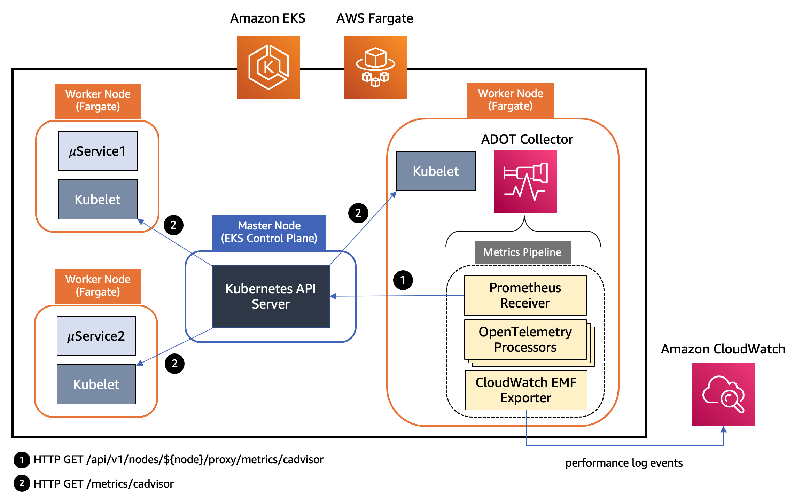
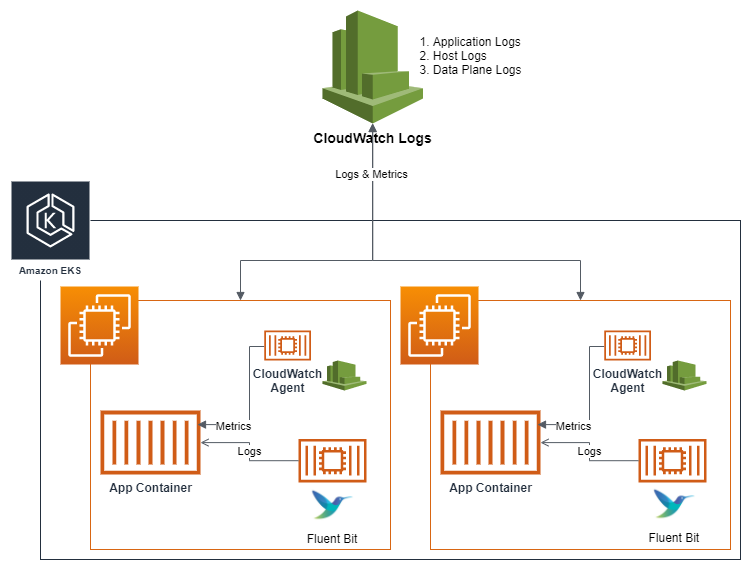

# Amazon CloudWatch Container Insights

Observability best practices guide యొక్క ఈ విభాగంలో, Amazon CloudWatch Container Insights కు సంబంధించిన ఈ క్రింది అంశాలలో లోతుగా అధ్యయనం చేద్దాం:

* Amazon CloudWatch Container Insights పరిచయం
* AWS Distro for Open Telemetry తో Amazon CloudWatch Container Insights ఉపయోగించడం
* Amazon EKS కోసం CloudWatch Container Insights లో Fluent Bit Integration
* Amazon EKS పై Container Insights తో cost savings
* Container Insights setup చేయడానికి EKS Blueprints ఉపయోగించడం

### పరిచయం

[Amazon CloudWatch Container Insights](https://docs.aws.amazon.com/AmazonCloudWatch/latest/monitoring/ContainerInsights.html) containerized applications మరియు microservices నుండి metrics మరియు logs సేకరించడానికి, aggregate చేయడానికి మరియు summarize చేయడానికి customers కు సహాయపడుతుంది. Metrics data [embedded metric format](https://docs.aws.amazon.com/AmazonCloudWatch/latest/monitoring/CloudWatch_Embedded_Metric_Format.html) ఉపయోగించి performance log events గా సేకరించబడుతుంది. ఈ performance log events structured JSON schema ఉపయోగిస్తాయి, ఇది high-cardinality data ను scale వద్ద ingest మరియు store చేయడానికి అనుమతిస్తుంది. ఈ data నుండి, CloudWatch cluster, node, pod, task, మరియు service level వద్ద CloudWatch metrics గా aggregated metrics సృష్టిస్తుంది. Container Insights సేకరించే metrics CloudWatch automatic dashboards లో అందుబాటులో ఉంటాయి. Container Insights self managed node groups, managed node groups మరియు AWS Fargate profiles తో Amazon EKS clusters కోసం అందుబాటులో ఉంటాయి.

Cost optimization దృక్కోణం నుండి మరియు మీ Container Insights cost నిర్వహించడంలో సహాయపడటానికి, CloudWatch log data నుండి అన్ని సాధ్యమైన metrics ను స్వయంచాలకంగా సృష్టించదు. అయితే, raw performance log events విశ్లేషించడానికి CloudWatch Logs Insights ఉపయోగించి అదనపు metrics మరియు అదనపు granularity levels చూడవచ్చు. Container Insights సేకరించే metrics custom metrics గా charge చేయబడతాయి. CloudWatch pricing గురించి మరింత సమాచారం కోసం, [Amazon CloudWatch Pricing](https://aws.amazon.com/cloudwatch/pricing/) చూడండి.

Amazon EKS లో, Container Insights cluster లోని అన్ని running containers కనుగొనడానికి Amazon Elastic Container Registry ద్వారా Amazon అందించే [CloudWatch agent](https://gallery.ecr.aws/cloudwatch-agent/cloudwatch-agent) యొక్క containerized version ను ఉపయోగిస్తుంది. ఇది performance stack యొక్క ప్రతి tier వద్ద performance data సేకరిస్తుంది. Container Insights సేకరించే logs మరియు metrics కోసం AWS KMS key తో encryption కు support ఇస్తుంది. ఈ encryption enable చేయడానికి, Container Insights data receive చేసే log group కోసం AWS KMS encryption ను manually enable చేయాలి. ఇది CloudWatch Container Insights ఈ data ను అందించిన AWS KMS key ఉపయోగించి encrypt చేయడానికి దారితీస్తుంది. symmetric keys మాత్రమే support చేయబడతాయి మరియు asymmetric AWS KMS keys మీ log groups encrypt చేయడానికి support చేయబడవు. Container Insights Linux instances లో మాత్రమే support చేయబడతాయి. Amazon EKS కోసం Container Insights [ఈ](https://docs.aws.amazon.com/AmazonCloudWatch/latest/monitoring/ContainerInsights.html#:~:text=Container%20Insights%20for%20Amazon%20EKS%20and%20Kubernetes%20is%20supported%20in%20the%20following%20Regions%3A) AWS Regions లో support చేయబడతాయి.

### AWS Distro for Open Telemetry తో Amazon CloudWatch Container Insights ఉపయోగించడం

ఇప్పుడు మేము [AWS Distro for OpenTelemetry (ADOT)](https://aws-otel.github.io/docs/introduction) లో లోతుగా అధ్యయనం చేద్దాం, ఇది Amazon EKS workloads నుండి Container insight metrics collection enable చేయడానికి ఒక option. [AWS Distro for OpenTelemetry (ADOT)](https://aws-otel.github.io/docs/introduction) అనేది [OpenTelemetry](https://opentelemetry.io/docs/) project యొక్క secure, AWS-supported distribution. ADOT తో, users తమ applications ను ఒకసారి instrument చేసి correlated metrics మరియు traces బహుళ monitoring solutions కు పంపవచ్చు. CloudWatch Container Insights కోసం ADOT support తో, customers [Amazon Elastic Cloud Compute](https://aws.amazon.com/pm/ec2/?trk=ps_a134p000004f2ZFAAY&trkCampaign=acq_paid_search_brand&sc_channel=PS&sc_campaign=acquisition_US&sc_publisher=Google&sc_category=Cloud%20Computing&sc_country=US&sc_geo=NAMER&sc_outcome=acq&sc_detail=amazon%20ec2&sc_content=EC2_e&sc_matchtype=e&sc_segment=467723097970&sc_medium=ACQ-P|PS-GO|Brand|Desktop|SU|Cloud%20Computing|EC2|US|EN|Text&s_kwcid=AL!4422!3!467723097970!e!!g!!amazon%20ec2&ef_id=Cj0KCQiArt6PBhCoARIsAMF5waj-FXPUD0G-cm0dJ05Mz6aXDvqEGu-S7pCXwvVusULN6ZbPbc_Alg8aArOHEALw_wcB:G:s&s_kwcid=AL!4422!3!467723097970!e!!g!!amazon%20ec2) (Amazon EC2) పై నడుస్తున్న Amazon EKS clusters నుండి CPU, memory, disk, మరియు network usage వంటి system metrics సేకరించవచ్చు, ఇది Amazon CloudWatch agent వలె అదే అనుభవం అందిస్తుంది. ADOT Collector ఇప్పుడు Amazon EKS మరియు Amazon EKS కోసం AWS Fargate profile కోసం CloudWatch Container Insights support తో అందుబాటులో ఉంది. Customers ఇప్పుడు Amazon EKS cluster కు deploy చేయబడిన తమ pods కోసం CPU మరియు memory utilization వంటి container మరియు pod metrics సేకరించి, వారి ఇప్పటికే ఉన్న CloudWatch Container Insights అనుభవానికి ఎటువంటి మార్పులు లేకుండా CloudWatch dashboards లో చూడవచ్చు. ఇది traffic కు respond చేయడానికి scale up లేదా down చేయాలా అనేది నిర్ణయించడానికి మరియు costs save చేయడానికి customers కు అనుమతిస్తుంది.

ADOT Collector కు [pipeline concept](https://opentelemetry.io/docs/collector/configuration/) ఉంది, ఇది receiver, processor, మరియు exporter అనే మూడు key types of components కలిగి ఉంటుంది. [receiver](https://opentelemetry.io/docs/collector/configuration/#receivers) అనేది data collector లోకి ఎలా వస్తుందో నిర్ణయిస్తుంది. ఇది specified format లో data accept చేసి, internal format లోకి translate చేసి pipeline లో define చేసిన [processors](https://opentelemetry.io/docs/collector/configuration/#processors) మరియు [exporters](https://opentelemetry.io/docs/collector/configuration/#exporters) కు pass చేస్తుంది. ఇది pull లేదా push based కావచ్చు. Processor అనేది received మరియు exported data మధ్య batching, filtering, మరియు transformations వంటి tasks perform చేయడానికి ఉపయోగించే optional component. Exporter అనేది metrics, logs లేదా traces ఏ destination కు పంపాలో నిర్ణయించడానికి ఉపయోగించబడుతుంది. collector architecture YAML configuration ద్వారా అలాంటి pipelines యొక్క బహుళ instances define చేయడానికి అనుమతిస్తుంది. Amazon EKS మరియు Fargate profile తో Amazon EKS కు deploy చేయబడిన ADOT Collector instance లోని pipeline components ను ఈ క్రింది diagrams illustrate చేస్తాయి.


*Figure: Amazon EKS కు deploy చేయబడిన ADOT Collector instance లోని Pipeline components*

పై architecture లో, మేము pipeline లో [AWS Container Insights Receiver](https://github.com/open-telemetry/opentelemetry-collector-contrib/tree/main/receiver/awscontainerinsightreceiver) instance ను ఉపయోగిస్తూ deploy చేస్తున్నాము మరియు Kubelet నుండి నేరుగా metrics సేకరిస్తున్నాము. AWS Container Insights Receiver (`awscontainerinsightreceiver`) అనేది [CloudWatch Container Insights](https://docs.aws.amazon.com/AmazonCloudWatch/latest/monitoring/ContainerInsights.html) కు support ఇచ్చే AWS specific receiver. CloudWatch Container Insights మీ containerized applications మరియు microservices నుండి metrics మరియు logs సేకరిస్తుంది, aggregate చేస్తుంది మరియు summarize చేస్తుంది. Data [embedded metric format](https://docs.aws.amazon.com/AmazonCloudWatch/latest/monitoring/CloudWatch_Embedded_Metric_Format.html) ఉపయోగించి performance log events గా సేకరించబడుతుంది. EMF data నుండి, Amazon CloudWatch cluster, node, pod, task, మరియు service level వద్ద aggregated CloudWatch metrics సృష్టించగలదు. `awscontainerinsightreceiver` configuration యొక్క sample ఉదాహరణ క్రింద ఉంది:

```
receivers:
  awscontainerinsightreceiver:
    # all parameters are optional
    collection_interval: 60s
    container_orchestrator: eks
    add_service_as_attribute: true 
    prefer_full_pod_name: false 
    add_full_pod_name_metric_label: false 
```

ఇది Amazon EKS పై పై configuration ఉపయోగించి collector ను DaemonSet గా deploy చేయడం. Kubelet నుండి నేరుగా ఈ receiver సేకరించే metrics యొక్క పూర్తి సెట్‌కు మీకు access ఉంటుంది. cluster లోని అన్ని nodes నుండి resource metrics సేకరించడానికి ఒకటి కంటే ఎక్కువ ADOT Collector instances సరిపోతాయి. ఒకే ADOT collector instance ఎక్కువ loads సమయంలో overwhelming కావచ్చు కాబట్టి ఎల్లప్పుడూ ఒకటి కంటే ఎక్కువ collectors deploy చేయమని సిఫార్సు చేస్తాము.



*Figure: Fargate profile తో Amazon EKS కు deploy చేయబడిన ADOT Collector instance లోని Pipeline components*

పై architecture లో, Kubernetes cluster లోని worker node పై kubelet CPU, memory, disk, మరియు network usage వంటి resource metrics ను */metrics/cadvisor* endpoint వద్ద expose చేస్తుంది. అయితే, EKS Fargate networking architecture లో, pod ఆ worker node పై kubelet ను నేరుగా reach చేయడానికి అనుమతించబడదు. కాబట్టి, ADOT Collector worker node పై kubelet కు connection proxy చేయడానికి Kubernetes API Server ను call చేస్తుంది, మరియు ఆ node పై workloads కోసం kubelet యొక్క cAdvisor metrics సేకరిస్తుంది. ఈ metrics Prometheus format లో అందుబాటులో చేయబడతాయి. కాబట్టి, collector Prometheus server కు drop-in replacement గా [Prometheus Receiver](https://github.com/open-telemetry/opentelemetry-collector-contrib/tree/main/receiver/prometheusreceiver) instance ఉపయోగిస్తుంది మరియు Kubernetes API server endpoint నుండి ఈ metrics scrape చేస్తుంది. Kubernetes service discovery ఉపయోగించి, receiver EKS cluster లోని అన్ని worker nodes discover చేయగలదు. కాబట్టి, cluster లోని అన్ని nodes నుండి resource metrics సేకరించడానికి ఒకటి కంటే ఎక్కువ ADOT Collector instances సరిపోతాయి. ఒకే ADOT collector instance ఎక్కువ loads సమయంలో overwhelming కావచ్చు కాబట్టి ఎల్లప్పుడూ ఒకటి కంటే ఎక్కువ collectors deploy చేయమని సిఫార్సు చేస్తాము.

Metrics తర్వాత filtering, renaming, data aggregation మరియు conversion మొదలైనవి perform చేసే processors series ద్వారా వెళ్తాయి. పై illustrate చేసిన Amazon EKS కోసం ADOT Collector instance pipeline లో ఉపయోగించే processors జాబితా క్రింద ఉంది.

* [Filter Processor](https://github.com/open-telemetry/opentelemetry-collector-contrib/tree/main/processor/filterprocessor) AWS OpenTelemetry distribution లో భాగం, ఇది metrics ను వాటి name ఆధారంగా include లేదా exclude చేయడానికి ఉపయోగించబడుతుంది. unwanted metrics filter out చేయడానికి metrics collection pipeline లో భాగంగా ఉపయోగించవచ్చు. ఉదాహరణకు, Container Insights pod-level metrics (name prefix `pod_` తో) మాత్రమే సేకరించాలని, networking వాటిని (`pod_network` prefix తో) exclude చేయాలని మీరు కోరుకుంటే.

```
      # filter out only renamed metrics which we care about
      filter:
        metrics:
          include:
            match_type: regexp
            metric_names:
              - new_container_.*
              - pod_.*
```

* [Metrics Transform Processor](https://github.com/open-telemetry/opentelemetry-collector-contrib/tree/main/processor/metricstransformprocessor) metrics rename చేయడానికి, label keys మరియు values add, rename లేదా delete చేయడానికి ఉపయోగించవచ్చు. labels లేదా label values అంతటా metrics పై scaling మరియు aggregations perform చేయడానికి కూడా ఉపయోగించవచ్చు.

```
     metricstransform/rename:
        transforms:
          - include: container_spec_cpu_quota
            new_name: new_container_cpu_limit_raw
            action: insert
            match_type: regexp
            experimental_match_labels: {"container": "\\S"}
```

* [Cumulative to Delta Processor](https://github.com/open-telemetry/opentelemetry-collector-contrib/tree/main/processor/cumulativetodeltaprocessor) monotonic, cumulative sum మరియు histogram metrics ను monotonic, delta metrics గా convert చేస్తుంది. Non-monotonic sums మరియు exponential histograms exclude చేయబడతాయి.

```
` # convert cumulative sum datapoints to delta
 cumulativetodelta:
    metrics:
        - pod_cpu_usage_seconds_total 
        - pod_network_rx_errors`
```

* [Delta to Rate Processor](https://github.com/open-telemetry/opentelemetry-collector-contrib/tree/main/processor/deltatorateprocessor) delta sum metrics ను rate metrics గా convert చేయడానికి. ఈ rate gauge.

```
` # convert delta to rate
    deltatorate:
        metrics:
            - pod_memory_hierarchical_pgfault 
            - pod_memory_hierarchical_pgmajfault 
            - pod_network_rx_bytes 
            - pod_network_rx_dropped 
            - pod_network_rx_errors 
            - pod_network_tx_errors 
            - pod_network_tx_packets 
            - new_container_memory_pgfault 
            - new_container_memory_pgmajfault 
            - new_container_memory_hierarchical_pgfault 
            - new_container_memory_hierarchical_pgmajfault`
```

* [Metrics Generation Processor](https://github.com/open-telemetry/opentelemetry-collector-contrib/tree/main/processor/metricsgenerationprocessor) ఇచ్చిన rule ప్రకారం ఇప్పటికే ఉన్న metrics ఉపయోగించి కొత్త metrics సృష్టించడానికి ఉపయోగించవచ్చు.

```
      experimental_metricsgeneration/1:
        rules:
          - name: pod_memory_utilization_over_pod_limit
            unit: Percent
            type: calculate
            metric1: pod_memory_working_set
            metric2: pod_memory_limit
            operation: percent
```

Pipeline లోని చివరి component [AWS CloudWatch EMF Exporter](https://github.com/open-telemetry/opentelemetry-collector-contrib/tree/main/exporter/awsemfexporter), ఇది metrics ను embedded metric format (EMF) లోకి convert చేసి [PutLogEvents](https://docs.aws.amazon.com/AmazonCloudWatchLogs/latest/APIReference/API_PutLogEvents.html) API ఉపయోగించి నేరుగా CloudWatch Logs కు పంపుతుంది. Amazon EKS పై నడుస్తున్న ప్రతి workload కోసం ADOT Collector ద్వారా CloudWatch కు పంపబడే metrics జాబితా క్రింద ఉంది.

* pod_cpu_utilization_over_pod_limit
* pod_cpu_usage_total
* pod_cpu_limit
* pod_memory_utilization_over_pod_limit
* pod_memory_working_set
* pod_memory_limit
* pod_network_rx_bytes
* pod_network_tx_bytes

ప్రతి metric ఈ క్రింది dimension sets తో associate చేయబడుతుంది మరియు *ContainerInsights* అనే CloudWatch namespace కింద సేకరించబడుతుంది.

* ClusterName, LaunchType
* ClusterName, Namespace, LaunchType
* ClusterName, Namespace, PodName, LaunchType

అదనంగా, [Container Insights Prometheus support for ADOT](https://aws.amazon.com/blogs/containers/introducing-cloudwatch-container-insights-prometheus-support-with-aws-distro-for-opentelemetry-on-amazon-ecs-and-amazon-eks/) మరియు [CloudWatch Container Insights ఉపయోగించి Amazon EKS resource metrics visualize చేయడానికి Amazon EKS పై ADOT collector deploy చేయడం](https://aws.amazon.com/blogs/containers/introducing-amazon-cloudwatch-container-insights-for-amazon-eks-fargate-using-aws-distro-for-opentelemetry/) గురించి తెలుసుకోండి, మీ Amazon EKS cluster లో ADOT collector pipeline setup చేయడానికి మరియు CloudWatch Container Insights లో మీ Amazon EKS resource metrics visualize చేయడానికి. అదనంగా, [Easily Monitor Containerized Applications with Amazon CloudWatch Container Insights](https://community.aws/tutorials/navigating-amazon-eks/eks-monitor-containerized-applications#step-3-use-cloudwatch-logs-insights-query-to-search-and-analyze-container-logs) reference చేయండి, ఇందులో Amazon EKS cluster configure చేయడం, containerized application deploy చేయడం, మరియు Container Insights ఉపయోగించి application performance monitor చేయడం పై step-by-step instructions ఉన్నాయి.

### Amazon EKS కోసం CloudWatch Container Insights లో Fluent Bit Integration

[Fluent Bit](https://fluentbit.io/) అనేది open source మరియు multi-platform log processor మరియు forwarder, ఇది వివిధ sources నుండి data మరియు logs సేకరించడానికి, వాటిని unify చేసి CloudWatch Logs తో సహా వివిధ destinations కు పంపడానికి మిమ్మల్ని అనుమతిస్తుంది. ఇది [Docker](https://www.docker.com/) మరియు [Kubernetes](https://kubernetes.io/) environments తో పూర్తిగా compatible. కొత్తగా launch చేసిన Fluent Bit daemonset ఉపయోగించి, మీరు మీ EKS clusters నుండి container logs ను logs storage మరియు analytics కోసం CloudWatch logs కు పంపవచ్చు.

దాని lightweight స్వభావం వల్ల, EKS worker nodes పై Container Insights లో default log forwarder గా Fluent Bit ఉపయోగించడం వల్ల application logs ను CloudWatch logs లోకి సమర్థవంతంగా మరియు విశ్వసనీయంగా stream చేయవచ్చు. Fluent Bit తో, Container Insights pod level వద్ద CPU మరియు memory utilization పరంగా resource efficient manner లో scale వద్ద వేలాది business critical logs deliver చేయగలదు. మరో మాటలో, మునుపు ఉపయోగించిన log forwarder FluentD తో పోలిస్తే, Fluent Bit చిన్న resource footprint కలిగి ఉంటుంది, ఫలితంగా memory మరియు CPU కోసం ఎక్కువ resource efficient. మరోవైపు, Fluent Bit మరియు సంబంధిత plugins కలిగిన [AWS for Fluent Bit image](https://github.com/aws/aws-for-fluent-bit), AWS ecosystem లో unified experience అందించడం లక్ష్యంగా image కొత్త AWS features ను వేగంగా adopt చేసుకోవడానికి Fluent Bit కు అదనపు flexibility ఇస్తుంది.

EKS కోసం CloudWatch Container Insights ఉపయోగించే individual components ను క్రింది architecture చూపిస్తుంది:



*Figure: EKS కోసం CloudWatch Container Insights ఉపయోగించే Individual components.*

Containers తో పని చేసేటప్పుడు, Docker JSON logging driver ఉపయోగించి standard output (stdout) మరియు standard error output (stderr) methods ద్వారా application logs తో సహా అన్ని logs push చేయడం సాధ్యమైనప్పుడల్లా సిఫార్సు చేయబడుతుంది. ఈ కారణంగా, EKS లో, logging driver default గా configure చేయబడుతుంది మరియు containerized application `stdout` లేదా `stderr` కు రాసే ప్రతిదీ worker node పై `"/var/log/containers"` కింద JSON file లోకి stream చేయబడుతుంది. Container Insights ఈ logs ను default గా మూడు వేరు categories గా classify చేస్తుంది మరియు Fluent Bit లో ప్రతి category కోసం dedicated input streams మరియు CloudWatch Logs లో independent log groups సృష్టిస్తుంది. ఆ categories:

* Application logs: `"/var/log/containers/*.log"` కింద store చేయబడిన అన్ని applications logs dedicated `/aws/containerinsights/Cluster_Name/application` log group లోకి stream చేయబడతాయి. kube-proxy మరియు aws-node logs వంటి అన్ని non-application logs default గా exclude చేయబడతాయి. అయితే, CoreDNS logs వంటి అదనపు Kubernetes add-on logs కూడా process చేయబడి ఈ log group లోకి stream చేయబడతాయి.
* Host logs: ప్రతి EKS worker node కోసం system logs `/aws/containerinsights/Cluster_Name/host` log group లోకి stream చేయబడతాయి. ఈ system logs `"/var/log/messages,/var/log/dmesg,/var/log/secure"` files యొక్క contents కలిగి ఉంటాయి. Containerized workloads యొక్క stateless మరియు dynamic nature పరిగణిస్తే, EKS worker nodes scaling activities సమయంలో తరచుగా terminate చేయబడతాయి, Fluent Bit తో real time లో ఈ logs stream చేయడం మరియు node terminate అయిన తర్వాత కూడా CloudWatch logs లో ఈ logs అందుబాటులో ఉండటం EKS worker nodes health observability మరియు monitoring పరంగా critical. ఇది చాలా సందర్భాలలో worker nodes లోకి login అవకుండా cluster issues debug లేదా troubleshoot చేయడానికి మరియు ఈ logs ను మరింత systematic way లో analyze చేయడానికి కూడా మిమ్మల్ని అనుమతిస్తుంది.
* Data plane logs: EKS ఇప్పటికే [control plane logs](https://docs.aws.amazon.com/eks/latest/userguide/control-plane-logs.html) అందిస్తుంది. Container Insights లో Fluent Bit integration తో, ప్రతి worker node పై నడిచే మరియు running pods maintain చేయడానికి బాధ్యత వహించే EKS data plane components generate చేసే logs data plane logs గా capture చేయబడతాయి. ఈ logs కూడా `'/aws/containerinsights/Cluster_Name/dataplane` కింద dedicated CloudWatch log group లోకి stream చేయబడతాయి. kube-proxy, aws-node, మరియు Docker runtime logs ఈ log group లో save చేయబడతాయి. Control plane logs తో పాటు, CloudWatch Logs లో data plane logs store చేయడం మీ EKS clusters యొక్క complete picture అందించడానికి సహాయపడుతుంది.

అదనంగా, Fluent Bit Configurations, Fluent Bit Monitoring మరియు Log analysis వంటి topics పై [Fluent Bit Integration with Amazon EKS](https://aws.amazon.com/blogs/containers/fluent-bit-integration-in-cloudwatch-container-insights-for-eks/) నుండి మరింత తెలుసుకోండి.

### Amazon EKS పై Container Insights తో Cost savings

Default configuration తో, Container Insights receiver [receiver documentation](https://github.com/open-telemetry/opentelemetry-collector-contrib/tree/main/receiver/awscontainerinsightreceiver#available-metrics-and-resource-attributes) ద్వారా define చేయబడిన metrics యొక్క complete set సేకరిస్తుంది. సేకరించే metrics మరియు dimensions సంఖ్య ఎక్కువ, మరియు పెద్ద clusters కోసం ఇది metric ingestion మరియు storage costs ను గణనీయంగా పెంచుతుంది. విలువ తీసుకొచ్చే metrics మాత్రమే పంపడానికి మరియు cost save చేయడానికి ADOT Collector configure చేయడానికి మీరు ఉపయోగించగల రెండు వేరే approaches demonstrate చేద్దాం.

#### Processors ఉపయోగించడం

ఈ approach [EMF logs](https://docs.aws.amazon.com/AmazonCloudWatch/latest/monitoring/CloudWatch_Embedded_Metric_Format.html) పరిమాణం తగ్గించడానికి metrics లేదా attributes filter out చేయడానికి పై చర్చించిన విధంగా OpenTelemetry processors ప్రవేశపెట్టడం involve చేస్తుంది. *Filter* మరియు *Resource* అనే రెండు processors యొక్క basic usage demonstrate చేద్దాం.

[Filter processors](https://github.com/open-telemetry/opentelemetry-collector-contrib/blob/main/processor/filterprocessor/README.md) ను `otel-agent-conf` అనే `ConfigMap` లో include చేయవచ్చు:

```
processors:
  # filter processors example
  filter/include:
    # any names NOT matching filters are excluded from remainder of pipeline
    metrics:
      include:
        match_type: regexp
        metric_names:
          # re2 regexp patterns
          - ^pod_.*
  filter/exclude:
    # any names matching filters are excluded from remainder of pipeline
    metrics:
      exclude:
        match_type: regexp
        metric_names:
          - ^pod_network.*
```

[Resource processor](https://github.com/open-telemetry/opentelemetry-collector-contrib/blob/main/processor/resourceprocessor/README.md) కూడా AWS OpenTelemetry Distro లో built-in గా ఉంది మరియు unwanted metric attributes remove చేయడానికి ఉపయోగించవచ్చు. ఉదాహరణకు, EMF logs నుండి `Kubernetes` మరియు `Sources` fields remove చేయాలనుకుంటే, pipeline కు resource processor add చేయవచ్చు:

```
  # resource processors example
  resource:
    attributes:
    - key: Sources
      action: delete
    - key: kubernetes
      action: delete
```

#### Metrics మరియు Dimensions Customize చేయడం

ఈ approach లో, CloudWatch Logs కు పంపాలనుకునే metrics set మాత్రమే generate చేయడానికి CloudWatch EMF exporter configure చేస్తారు. CloudWatch EMF exporter configuration యొక్క [metric_declaration](https://github.com/open-telemetry/opentelemetry-collector-contrib/blob/5ccdbe08c6a2a43b7c6c7f9c0031a4b0348394a9/exporter/awsemfexporter/README.md#metric_declaration) section మీరు export చేయాలనుకునే metrics మరియు dimensions set define చేయడానికి ఉపయోగించవచ్చు. ఉదాహరణకు, default configuration నుండి pod metrics మాత్రమే ఉంచవచ్చు. ఈ `metric_declaration` section ఈ విధంగా కనిపిస్తుంది మరియు metrics సంఖ్య తగ్గించడానికి, ఇతర వాటి గురించి care చేయకపోతే dimension set `[PodName, Namespace, ClusterName]` మాత్రమే ఉంచవచ్చు:

```
  awsemf:
    namespace: ContainerInsights
    log_group_name: '/aws/containerinsights/{ClusterName}/performance'
    log_stream_name: '{NodeName}'
    resource_to_telemetry_conversion:
      enabled: true
    dimension_rollup_option: NoDimensionRollup
    parse_json_encoded_attr_values: [Sources, kubernetes]
    # Customized metric declaration section
    metric_declarations:
      # pod metrics
      - dimensions: [[PodName, Namespace, ClusterName]]
        metric_name_selectors:
          - pod_cpu_utilization
          - pod_memory_utilization
          - pod_cpu_utilization_over_pod_limit
          - pod_memory_utilization_over_pod_limit
```

ఈ configuration default configuration లోని multiple dimensions కోసం 55 వేరే metrics కాకుండా single dimension `[PodName, Namespace, ClusterName]` లో ఈ క్రింది నాలుగు metrics produce మరియు stream చేస్తుంది:

* pod_cpu_utilization
* pod_memory_utilization
* pod_cpu_utilization_over_pod_limit
* pod_memory_utilization_over_pod_limit

ఈ configuration తో, default గా configure చేయబడిన అన్ని metrics కాకుండా మీకు ఆసక్తి ఉన్న metrics మాత్రమే పంపుతారు. ఫలితంగా, Container Insights కోసం metric ingestion cost గణనీయంగా తగ్గించగలరు. ఈ flexibility Container Insights customers కు export చేయబడే metrics పై high level control అందిస్తుంది. `awsemf` exporter configuration modify చేయడం ద్వారా metrics customize చేయడం కూడా highly flexible, మరియు మీరు పంపాలనుకునే metrics మరియు వాటి dimensions రెండింటినీ customize చేయవచ్చు. ఇది CloudWatch కు పంపబడే logs కు మాత్రమే వర్తిస్తుంది.

పై చర్చించిన రెండు approaches ఒకదానికొకటి mutually exclusive కాదు. నిజానికి, మన monitoring system లోకి ingest చేయాలనుకునే metrics customize చేయడంలో high degree of flexibility కోసం రెండింటినీ combine చేయవచ్చు. metric storage మరియు processing తో associated costs తగ్గించడానికి మేము ఈ approach ఉపయోగిస్తాము, ఈ క్రింది graph లో చూపినట్లు.


*Figure: AWS Cost Explorer*

ముందు ఉన్న AWS Cost Explorer graph లో, చిన్న EKS cluster (20 Worker nodes, 220 pods) లో ADOT Collector పై వేరే configurations ఉపయోగించి CloudWatch తో associated daily cost చూడవచ్చు. *Aug 15th* ADOT Collector default configuration తో CloudWatch bill చూపిస్తుంది. *Aug 16th* న, మేము [Customize EMF exporter](https://aws.amazon.com/blogs/containers/cost-savings-by-customizing-metrics-sent-by-container-insights-in-amazon-eks/#customize-emf-exporter) approach ఉపయోగించాము మరియు దాదాపు 30% cost savings చూడవచ్చు. *Aug 17th* న, మేము [Processors](https://aws.amazon.com/blogs/containers/cost-savings-by-customizing-metrics-sent-by-container-insights-in-amazon-eks/#processors) approach ఉపయోగించాము, ఇది దాదాపు 45% costs saving సాధిస్తుంది.
Container Insights ద్వారా పంపబడే metrics customize చేయడంలో trade-offs పరిగణించాలి, ఎందుకంటే monitored cluster visibility sacrifice చేయడం ద్వారా monitoring costs తగ్గించగలరు. కానీ, AWS Console లో Container Insights అందించే built-in dashboard customized metrics ద్వారా ప్రభావితం కావచ్చు, ఎందుకంటే dashboard ఉపయోగించే metrics మరియు dimensions పంపకూడదని ఎంచుకోవచ్చు. మరింత నేర్చుకోవడానికి [Cost savings by customizing metrics sent by Container Insights in Amazon EKS](https://aws.amazon.com/blogs/containers/cost-savings-by-customizing-metrics-sent-by-container-insights-in-amazon-eks/) చూడండి.

### Container Insights setup చేయడానికి EKS Blueprints ఉపయోగించడం

[EKS Blueprints](https://aws.amazon.com/blogs/containers/bootstrapping-clusters-with-eks-blueprints/) అనేది accounts మరియు regions అంతటా consistent, batteries-included EKS clusters configure మరియు deploy చేయడానికి సహాయపడే Infrastructure as Code (IaC) modules collection. EKS Blueprints ఉపయోగించి [Amazon EKS add-ons](https://docs.aws.amazon.com/eks/latest/userguide/eks-add-ons.html) తో పాటు Prometheus, Karpenter, Nginx, Traefik, AWS Load Balancer Controller, Container Insights, Fluent Bit, Keda, Argo CD మొదలైన విస్తృత శ్రేణి popular open-source add-ons తో EKS cluster ను సులభంగా bootstrap చేయవచ్చు. EKS Blueprints రెండు popular IaC frameworks లో implement చేయబడింది, [HashiCorp Terraform](https://github.com/aws-ia/terraform-aws-eks-blueprints) మరియు [AWS Cloud Development Kit (AWS CDK)](https://github.com/aws-quickstart/cdk-eks-blueprints), ఇవి infrastructure deployments automate చేయడానికి సహాయపడతాయి.

EKS Blueprints ఉపయోగించి మీ Amazon EKS Cluster creation process లో భాగంగా, containerized applications మరియు micro-services నుండి metrics మరియు logs సేకరించి, aggregate చేసి, summarize చేసి Amazon CloudWatch console కు పంపడానికి Day 2 operational tooling గా Container Insights setup చేయవచ్చు.

### ముగింపు

Observability best practices guide యొక్క ఈ విభాగంలో, CloudWatch Container insights చుట్టూ లోతైన వివరాలు cover చేశాము, ఇందులో Amazon CloudWatch Container Insights పరిచయం మరియు Amazon EKS పై మీ containerized workloads observe చేయడానికి ఇది ఎలా సహాయపడుతుందో ఉన్నాయి. Amazon CloudWatch console పై మీ containerized workloads metrics visualize చేయడానికి Container insight metrics collection enable చేయడానికి AWS Distro for Open Telemetry తో Amazon CloudWatch Container Insights ఉపయోగించడం పై లోతుగా cover చేశాము. తదుపరి, Application, Host మరియు Data Plane logs కోసం Fluent Bit లో dedicated input streams మరియు CloudWatch Logs లో independent log groups సృష్టించడానికి Amazon EKS కోసం CloudWatch Container Insights లో Fluent Bit Integration చుట్టూ చాలా depth cover చేశాము. తదుపరి, CloudWatch Container insights తో cost savings సాధించడానికి processors, metrics dimensions వంటి రెండు వేరే approaches గురించి మాట్లాడాము. చివరగా Amazon EKS cluster creation process లో Container Insights setup చేయడానికి vehicle గా EKS Blueprints ఎలా ఉపయోగించాలో brief గా మాట్లాడాము. [CloudWatch Container Insights module](https://catalog.workshops.aws/observability/en-US/aws-native/insights/containerinsights) తో [One Observability Workshop](https://catalog.workshops.aws/observability/en-US) లో hands-on experience పొందవచ్చు.
