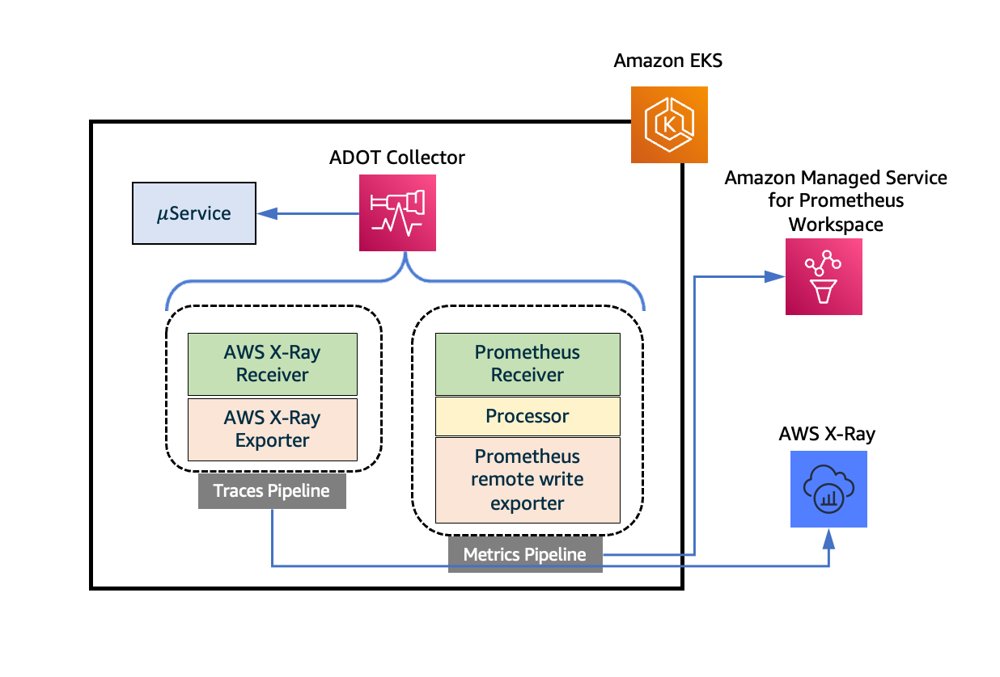

# AWS X-Ray తో కంటైనర్ ట్రేసింగ్

Observability ఉత్తమ పద్ధతుల గైడ్ యొక్క ఈ విభాగంలో, AWS X-Ray తో కంటైనర్ ట్రేసింగ్‌కు సంబంధించిన క్రింది అంశాలలో లోతుగా చర్చిస్తాము:

* AWS X-Ray పరిచయం
* AWS Distro for OpenTelemetry కోసం Amazon EKS add-ons ఉపయోగించి ట్రేసుల సేకరణ
* ముగింపు

### పరిచయం

[AWS X-Ray](https://docs.aws.amazon.com/xray/latest/devguide/aws-xray.html) అనేది మీ అప్లికేషన్ అందించే రిక్వెస్ట్‌ల గురించి డేటాను సేకరించే సర్వీస్, మరియు సమస్యలను మరియు ఆప్టిమైజేషన్ అవకాశాలను గుర్తించడానికి ఆ డేటాను వీక్షించడానికి, ఫిల్టర్ చేయడానికి మరియు అంతర్దృష్టులు పొందడానికి మీరు ఉపయోగించగల సాధనాలను అందిస్తుంది. మీ అప్లికేషన్‌కు ట్రేస్ చేయబడిన ఏదైనా రిక్వెస్ట్ కోసం, రిక్వెస్ట్ మరియు రెస్పాన్స్ గురించి మాత్రమే కాకుండా, మీ అప్లికేషన్ డౌన్‌స్ట్రీమ్ AWS రిసోర్సులు, మైక్రోసర్వీసులు, డేటాబేసులు మరియు వెబ్ APIలకు చేసే కాల్స్ గురించి కూడా వివరమైన సమాచారాన్ని మీరు చూడవచ్చు.

మీ అప్లికేషన్‌ను ఇన్‌స్ట్రుమెంట్ చేయడంలో ఇన్‌కమింగ్ మరియు అవుట్‌బౌండ్ రిక్వెస్ట్‌లు మరియు మీ అప్లికేషన్‌లోని ఇతర ఈవెంట్ల కోసం ట్రేస్ డేటాను పంపడం, ప్రతి రిక్వెస్ట్ గురించి మెటాడేటాతో పాటు ఉంటుంది. అనేక ఇన్‌స్ట్రుమెంటేషన్ సినారియోలకు కాన్ఫిగరేషన్ మార్పులు మాత్రమే అవసరం. ఉదాహరణకు, మీ Java అప్లికేషన్ చేసే అన్ని ఇన్‌కమింగ్ HTTP రిక్వెస్ట్‌లు మరియు AWS సర్వీసులకు డౌన్‌స్ట్రీమ్ కాల్స్‌ను మీరు ఇన్‌స్ట్రుమెంట్ చేయవచ్చు. X-Ray ట్రేసింగ్ కోసం మీ అప్లికేషన్‌ను ఇన్‌స్ట్రుమెంట్ చేయడానికి అనేక SDKలు, ఏజెంట్లు మరియు సాధనాలు ఉపయోగించవచ్చు. మరిన్ని వివరాల కోసం [మీ అప్లికేషన్‌ను ఇన్‌స్ట్రుమెంట్ చేయడం](https://docs.aws.amazon.com/xray/latest/devguide/xray-instrumenting-your-app.html) చూడండి.

AWS Distro for OpenTelemetry కోసం Amazon EKS add-ons ఉపయోగించి మీ Amazon EKS క్లస్టర్ నుండి ట్రేసులను సేకరించడం ద్వారా కంటైనరైజ్డ్ అప్లికేషన్ ట్రేసింగ్ గురించి మనం నేర్చుకుంటాము.

### AWS Distro for OpenTelemetry కోసం Amazon EKS add-ons ఉపయోగించి ట్రేసుల సేకరణ

[AWS X-Ray](https://aws.amazon.com/xray/) అప్లికేషన్-ట్రేసింగ్ ఫంక్షనాలిటీని అందిస్తుంది, డిప్లాయ్ చేయబడిన అన్ని మైక్రోసర్వీసుల్లో లోతైన అంతర్దృష్టులను ఇస్తుంది. X-Ray తో, ప్రతి రిక్వెస్ట్ పాల్గొన్న మైక్రోసర్వీసుల ద్వారా ప్రవహించినప్పుడు ట్రేస్ చేయవచ్చు. ఇది మీ DevOps బృందాలకు మీ సర్వీసులు వాటి peers తో ఎలా ఇంటరాక్ట్ అవుతాయో అర్థం చేసుకోవడానికి అవసరమైన అంతర్దృష్టులను అందిస్తుంది మరియు సమస్యలను చాలా వేగంగా విశ్లేషించడానికి మరియు డీబగ్ చేయడానికి వారిని అనుమతిస్తుంది.

[AWS Distro for OpenTelemetry (ADOT)](https://aws-otel.github.io/docs/introduction) అనేది OpenTelemetry ప్రాజెక్ట్ యొక్క సురక్షితమైన, AWS-మద్దతు ఉన్న డిస్ట్రిబ్యూషన్. యూజర్లు తమ అప్లికేషన్లను ఒకసారి మాత్రమే ఇన్‌స్ట్రుమెంట్ చేయవచ్చు మరియు ADOT ఉపయోగించి, కోరిలేటెడ్ మెట్రిక్స్ మరియు ట్రేసులను బహుళ మానిటరింగ్ సొల్యూషన్లకు పంపవచ్చు. Amazon EKS ఇప్పుడు క్లస్టర్ రన్ అవుతున్న తర్వాత ఎప్పుడైనా ADOT ను add-on గా ప్రారంభించడానికి యూజర్లను అనుమతిస్తుంది. ADOT add-on తాజా సెక్యూరిటీ ప్యాచ్‌లు మరియు బగ్ ఫిక్స్‌లను కలిగి ఉంటుంది మరియు Amazon EKS తో పనిచేయడానికి AWS ద్వారా ధృవీకరించబడింది.

ADOT add-on అనేది Kubernetes Operator అమలు, ఇది అప్లికేషన్లు మరియు వాటి కాంపోనెంట్లను నిర్వహించడానికి కస్టమ్ రిసోర్సులను ఉపయోగించే Kubernetes కు సాఫ్ట్‌వేర్ ఎక్స్‌టెన్షన్. Add-on OpenTelemetryCollector అనే కస్టమ్ రిసోర్స్ కోసం చూస్తుంది మరియు కస్టమ్ రిసోర్స్‌లో పేర్కొన్న కాన్ఫిగరేషన్ సెట్టింగ్‌ల ఆధారంగా ADOT Collector యొక్క జీవితచక్రాన్ని నిర్వహిస్తుంది.

ADOT Collector కు pipeline అనే కాన్సెప్ట్ ఉంది, ఇది మూడు ముఖ్యమైన రకాల కాంపోనెంట్లను కలిగి ఉంటుంది, అవి receiver, processor మరియు exporter. [receiver](https://opentelemetry.io/docs/collector/configuration/#receivers) అనేది collector లోకి డేటా ఎలా వస్తుందో నిర్ణయిస్తుంది. ఇది నిర్దిష్ట ఫార్మాట్‌లో డేటాను అంగీకరిస్తుంది, దానిని అంతర్గత ఫార్మాట్‌లోకి మారుస్తుంది మరియు pipeline లో నిర్వచించిన [processors](https://opentelemetry.io/docs/collector/configuration/#processors) మరియు [exporters](https://opentelemetry.io/docs/collector/configuration/#exporters) కు పంపుతుంది. ఇది pull- లేదా push-ఆధారితంగా ఉండవచ్చు. Processor అనేది డేటా స్వీకరించబడిన మరియు ఎగుమతి చేయబడిన మధ్య batching, filtering మరియు transformations వంటి పనులను చేయడానికి ఉపయోగించే ఐచ్ఛిక కాంపోనెంట్. Exporter అనేది metrics, logs లేదా traces ఏ గమ్యస్థానానికి పంపాలో నిర్ణయించడానికి ఉపయోగించబడుతుంది. Collector ఆర్కిటెక్చర్ Kubernetes YAML manifest ద్వారా అటువంటి pipelines యొక్క బహుళ instances ను సెటప్ చేయడానికి అనుమతిస్తుంది.

క్రింది చిత్రం AWS X-Ray కు టెలిమెట్రీ డేటా పంపే traces pipeline తో కాన్ఫిగర్ చేయబడిన ADOT Collector ను చూపిస్తుంది. Traces pipeline [AWS X-Ray Receiver](https://github.com/open-telemetry/opentelemetry-collector-contrib/tree/main/receiver/awsxrayreceiver) మరియు [AWS X-Ray Exporter](https://github.com/open-telemetry/opentelemetry-collector-contrib/tree/main/exporter/awsxrayexporter) instance ను కలిగి ఉంటుంది మరియు AWS X-Ray కు traces పంపుతుంది.



*చిత్రం: AWS Distro for OpenTelemetry కోసం Amazon EKS add-ons ఉపయోగించి ట్రేసుల సేకరణ.*

EKS క్లస్టర్‌లో ADOT add-on ఇన్‌స్టాల్ చేయడం మరియు తర్వాత workloads నుండి టెలిమెట్రీ డేటాను సేకరించడం యొక్క వివరాలలోకి వెళ్దాం. ADOT add-on ఇన్‌స్టాల్ చేయడానికి ముందు అవసరమైన ముందస్తు అవసరాల జాబితా ఇది.

* Kubernetes వెర్షన్ 1.19 లేదా అంతకంటే ఎక్కువ మద్దతు ఇచ్చే EKS క్లస్టర్. [ఇక్కడ వివరించిన విధానాలలో](https://docs.aws.amazon.com/eks/latest/userguide/create-cluster.html) ఒకదాన్ని ఉపయోగించి మీరు EKS క్లస్టర్‌ను సృష్టించవచ్చు.
* [Certificate Manager](https://cert-manager.io/), క్లస్టర్‌లో ఇప్పటికే ఇన్‌స్టాల్ చేయకపోతే. [ఈ డాక్యుమెంటేషన్](https://cert-manager.io/docs/installation/) ప్రకారం డిఫాల్ట్ కాన్ఫిగరేషన్‌తో ఇన్‌స్టాల్ చేయవచ్చు.
* మీ క్లస్టర్‌లో ADOT add-on ఇన్‌స్టాల్ చేయడానికి EKS add-ons కోసం ప్రత్యేకంగా Kubernetes RBAC అనుమతులు. kubectl వంటి CLI సాధనాన్ని ఉపయోగించి క్లస్టర్‌కు [ఈ YAML లోని సెట్టింగ్‌లను](https://amazon-eks.s3.amazonaws.com/docs/addons-otel-permissions.yaml) అప్లై చేయడం ద్వారా ఇది చేయవచ్చు.

EKS యొక్క వివిధ వెర్షన్ల కోసం ప్రారంభించబడిన add-ons జాబితాను మీరు క్రింది ఆదేశం ఉపయోగించి తనిఖీ చేయవచ్చు:

`aws eks describe-addon-versions`

JSON అవుట్‌పుట్ క్రింద చూపిన విధంగా ఇతర వాటిలో ADOT add-on ను జాబితా చేయాలి. EKS క్లస్టర్ సృష్టించినప్పుడు, EKS add-ons దానిపై ఎటువంటి add-ons ఇన్‌స్టాల్ చేయదని గమనించండి.


```
{
   "addonName":"adot",
   "type":"observability",
   "addonVersions":[
      {
         "addonVersion":"v0.45.0-eksbuild.1",
         "architecture":[
            "amd64"
         ],
         "compatibilities":[
            {
               "clusterVersion":"1.22",
               "platformVersions":[
                  "*"
               ],
               "defaultVersion":true
            },
            {
               "clusterVersion":"1.21",
               "platformVersions":[
                  "*"
               ],
               "defaultVersion":true
            },
            {
               "clusterVersion":"1.20",
               "platformVersions":[
                  "*"
               ],
               "defaultVersion":true
            },
            {
               "clusterVersion":"1.19",
               "platformVersions":[
                  "*"
               ],
               "defaultVersion":true
            }
         ]
      }
   ]
}
```

తర్వాత, మీరు క్రింది ఆదేశంతో ADOT add-on ను ఇన్‌స్టాల్ చేయవచ్చు:

`aws eks create-addon --addon-name adot --addon-version v0.45.0-eksbuild.1 --cluster-name $CLUSTER_NAME `

వెర్షన్ స్ట్రింగ్ మునుపటి అవుట్‌పుట్‌లోని *addonVersion* ఫీల్డ్ విలువతో సరిపోలాలి. ఈ ఆదేశం విజయవంతంగా అమలు చేయడం నుండి అవుట్‌పుట్ ఇలా కనిపిస్తుంది:

```
{
    "addon": {
        "addonName": "adot",
        "clusterName": "k8s-production-cluster",
        "status": "ACTIVE",
        "addonVersion": "v0.45.0-eksbuild.1",
        "health": {
            "issues": []
        },
        "addonArn": "arn:aws:eks:us-east-1:123456789000:addon/k8s-production-cluster/adot/f0bff97c-0647-ef6f-eecf-0b2a13f7491b",
        "createdAt": "2022-04-04T10:36:56.966000+05:30",
        "modifiedAt": "2022-04-04T10:38:09.142000+05:30",
        "tags": {}
    }
}
```

తదుపరి దశకు వెళ్ళే ముందు add-on ACTIVE స్టేటస్‌లో ఉండే వరకు వేచి ఉండండి. Add-on స్టేటస్‌ను క్రింది ఆదేశం ఉపయోగించి తనిఖీ చేయవచ్చు;

`aws eks describe-addon --addon-name adot --cluster-name $CLUSTER_NAME`

#### ADOT Collector ను డిప్లాయ్ చేయడం

ADOT add-on అనేది Kubernetes Operator అమలు, ఇది అప్లికేషన్లు మరియు వాటి కాంపోనెంట్లను నిర్వహించడానికి కస్టమ్ రిసోర్సులను ఉపయోగించే Kubernetes కు సాఫ్ట్‌వేర్ ఎక్స్‌టెన్షన్. Add-on OpenTelemetryCollector అనే కస్టమ్ రిసోర్స్ కోసం చూస్తుంది మరియు కస్టమ్ రిసోర్స్‌లో పేర్కొన్న కాన్ఫిగరేషన్ సెట్టింగ్‌ల ఆధారంగా ADOT Collector యొక్క జీవితచక్రాన్ని నిర్వహిస్తుంది. ఇది ఎలా పనిచేస్తుందో క్రింది చిత్రం చూపిస్తుంది.


*చిత్రం: ADOT Collector ను డిప్లాయ్ చేయడం.*

తర్వాత, ADOT Collector ను ఎలా డిప్లాయ్ చేయాలో చూద్దాం. [ఇక్కడ ఉన్న YAML కాన్ఫిగరేషన్ ఫైల్](https://github.com/aws-observability/aws-o11y-recipes/blob/main/sandbox/eks-addon-adot/otel-collector-xray-prometheus-complete.yaml) OpenTelemetryCollector కస్టమ్ రిసోర్స్‌ను నిర్వచిస్తుంది. EKS క్లస్టర్‌కు డిప్లాయ్ చేసినప్పుడు, ఇది పైన మొదటి చిత్రంలో చూపిన విధంగా traces మరియు metrics pipelines తో కాంపోనెంట్లతో ADOT Collector ను ప్రొవిజన్ చేయడానికి ADOT add-on ను ట్రిగ్గర్ చేస్తుంది. Collector `aws-otel-eks` namespace లో `${custom-resource-name}-collector` పేరుతో Kubernetes Deployment గా లాంచ్ చేయబడుతుంది. అదే పేరుతో ClusterIP service కూడా లాంచ్ చేయబడుతుంది. ఈ collector యొక్క pipelines ను రూపొందించే వ్యక్తిగత కాంపోనెంట్లను చూద్దాం.

Traces pipeline లోని AWS X-Ray Receiver [X-Ray Segment format](https://docs.aws.amazon.com/xray/latest/devguide/xray-api-segmentdocuments.html) లో segments లేదా spans ను అంగీకరిస్తుంది, ఇది X-Ray SDK తో ఇన్‌స్ట్రుమెంట్ చేయబడిన మైక్రోసర్వీసులు పంపిన segments ను ప్రాసెస్ చేయడానికి వీలు కల్పిస్తుంది. ఇది UDP పోర్ట్ 2000 పై ట్రాఫిక్ కోసం వినడానికి కాన్ఫిగర్ చేయబడింది మరియు Cluster IP service గా బహిర్గతం చేయబడింది. ఈ కాన్ఫిగరేషన్ ప్రకారం, ఈ receiver కు ట్రేస్ డేటా పంపాలనుకునే workloads `AWS_XRAY_DAEMON_ADDRESS` ఎన్విరాన్మెంట్ వేరియబుల్ `observability-collector.aws-otel-eks:2000` కు సెట్ చేయబడి కాన్ఫిగర్ చేయబడాలి. Exporter [PutTraceSegments](https://docs.aws.amazon.com/xray/latest/api/API_PutTraceSegments.html) API ఉపయోగించి ఈ segments ను నేరుగా X-Ray కు పంపుతుంది.

ADOT Collector `aws-otel-collector` అనే Kubernetes service account ఐడెంటిటీ కింద లాంచ్ అయ్యేలా కాన్ఫిగర్ చేయబడింది, దీనికి ClusterRoleBinding మరియు ClusterRole ఉపయోగించి ఈ అనుమతులు ఇవ్వబడతాయి, ఇవి [కాన్ఫిగరేషన్](https://github.com/aws-observability/aws-o11y-recipes/blob/main/sandbox/eks-addon-adot/otel-collector-xray-prometheus-complete.yaml) లో కూడా చూపబడ్డాయి. Exporters కు X-Ray కు డేటా పంపడానికి IAM అనుమతులు అవసరం. EKS మద్దతు ఇచ్చే [IAM roles for service accounts](https://docs.aws.amazon.com/eks/latest/userguide/iam-roles-for-service-accounts.html) ఫీచర్ ఉపయోగించి service account ను IAM role తో అనుసంధానించడం ద్వారా ఇది చేయబడుతుంది. IAM role AWSXRayDaemonWriteAccess వంటి AWS-managed policies తో అనుసంధానించబడాలి. CLUSTER_NAME మరియు REGION వేరియబుల్స్ సెట్ చేసిన తర్వాత, ఈ అనుమతులు ఇవ్వబడిన మరియు `aws-otel-collector` service account తో అనుసంధానించబడిన `EKS-ADOT-ServiceAccount-Role` అనే IAM role సృష్టించడానికి [ఇక్కడ ఉన్న helper script](https://github.com/aws-observability/aws-o11y-recipes/blob/main/sandbox/eks-addon-adot/adot-irsa.sh) ఉపయోగించవచ్చు.

#### ట్రేసుల సేకరణ యొక్క ఎండ్-టు-ఎండ్ పరీక్ష

ఇప్పుడు ఇవన్నింటిని కలిపి EKS క్లస్టర్‌కు డిప్లాయ్ చేయబడిన workloads నుండి ట్రేసుల సేకరణను పరీక్షిద్దాం. క్రింది చిత్రం ఈ పరీక్ష కోసం ఉపయోగించిన సెటప్‌ను చూపిస్తుంది. ఇది REST APIల సెట్‌ను బహిర్గతం చేసే మరియు S3 తో ఇంటరాక్ట్ అయ్యే front-end service మరియు Aurora PostgreSQL డేటాబేస్ instance తో ఇంటరాక్ట్ అయ్యే datastore service తో కూడి ఉంటుంది. సర్వీసులు X-Ray SDK తో ఇన్‌స్ట్రుమెంట్ చేయబడ్డాయి. చివరి విభాగంలో చర్చించబడిన YAML manifest ఉపయోగించి OpenTelemetryCollector కస్టమ్ రిసోర్స్ డిప్లాయ్ చేయడం ద్వారా ADOT Collector Deployment మోడ్‌లో లాంచ్ చేయబడింది. Postman క్లయింట్ front-end service ను లక్ష్యంగా చేసుకుని బాహ్య ట్రాఫిక్ జనరేటర్‌గా ఉపయోగించబడుతుంది.


*చిత్రం: ట్రేసుల సేకరణ యొక్క ఎండ్-టు-ఎండ్ పరీక్ష.*

క్రింది చిత్రం ప్రతి segment కోసం సగటు రెస్పాన్స్ లేటెన్సీతో సర్వీసుల నుండి క్యాప్చర్ చేయబడిన segment డేటా ఉపయోగించి X-Ray ద్వారా జనరేట్ చేయబడిన service graph ను చూపిస్తుంది.


*చిత్రం: CloudWatch Service Map కన్సోల్.*

AWS X-Ray కు traces పంపే OTLP Receiver మరియు AWS X-Ray Exporter తో [Traces pipeline](https://github.com/aws-observability/aws-otel-community/blob/master/sample-configs/operator/collector-config-xray.yaml) traces pipeline కాన్ఫిగరేషన్లకు సంబంధించిన OpenTelemetryCollector కస్టమ్ రిసోర్స్ డెఫినిషన్ల కోసం తనిఖీ చేయండి. AWS X-Ray తో కలిపి ADOT Collector ఉపయోగించాలనుకునే కస్టమర్లు ఈ కాన్ఫిగరేషన్ టెంప్లేట్లతో ప్రారంభించవచ్చు, placeholder వేరియబుల్స్‌ను వారి టార్గెట్ ఎన్విరాన్మెంట్ల ఆధారంగా విలువలతో భర్తీ చేయవచ్చు మరియు ADOT కోసం EKS add-on ఉపయోగించి వారి Amazon EKS క్లస్టర్లకు collector ను త్వరగా డిప్లాయ్ చేయవచ్చు.


### EKS Blueprints ఉపయోగించి AWS X-Ray తో కంటైనర్ ట్రేసింగ్ సెటప్ చేయడం

[EKS Blueprints](https://aws.amazon.com/blogs/containers/bootstrapping-clusters-with-eks-blueprints/) అనేది ఖాతాలు మరియు రీజియన్ల అంతటా స్థిరమైన, బ్యాటరీలు-చేర్చబడిన EKS క్లస్టర్లను కాన్ఫిగర్ చేయడానికి మరియు డిప్లాయ్ చేయడానికి సహాయపడే Infrastructure as Code (IaC) మాడ్యూల్స్ సమాహారం. [Amazon EKS add-ons](https://docs.aws.amazon.com/eks/latest/userguide/eks-add-ons.html) తో పాటు Prometheus, Karpenter, Nginx, Traefik, AWS Load Balancer Controller, Container Insights, Fluent Bit, Keda, Argo CD మరియు మరిన్ని సహా విస్తృత శ్రేణి ప్రసిద్ధ ఓపెన్-సోర్స్ add-ons తో EKS క్లస్టర్‌ను సులభంగా బూట్‌స్ట్రాప్ చేయడానికి మీరు EKS Blueprints ఉపయోగించవచ్చు. EKS Blueprints రెండు ప్రసిద్ధ IaC ఫ్రేమ్‌వర్క్‌లలో అమలు చేయబడింది, [HashiCorp Terraform](https://github.com/aws-ia/terraform-aws-eks-blueprints) మరియు [AWS Cloud Development Kit (AWS CDK)](https://github.com/aws-quickstart/cdk-eks-blueprints), ఇవి ఇన్‌ఫ్రాస్ట్రక్చర్ డిప్లాయ్‌మెంట్లను ఆటోమేట్ చేయడానికి సహాయపడతాయి.

EKS Blueprints ఉపయోగించి మీ Amazon EKS Cluster సృష్టి ప్రక్రియలో భాగంగా, కంటైనరైజ్డ్ అప్లికేషన్లు మరియు మైక్రో-సర్వీసుల నుండి Amazon CloudWatch కన్సోల్‌కు metrics మరియు logs సేకరించడానికి, సమగ్రపరచడానికి మరియు సంగ్రహించడానికి మీరు AWS X-Ray ను Day 2 ఆపరేషనల్ టూలింగ్‌గా సెటప్ చేయవచ్చు.

## ముగింపు

Observability ఉత్తమ పద్ధతుల గైడ్ యొక్క ఈ విభాగంలో, AWS Distro for OpenTelemetry కోసం Amazon EKS add-ons ఉపయోగించి ట్రేసుల సేకరణ ద్వారా Amazon EKS పై మీ అప్లికేషన్ల కంటైనర్ ట్రేసింగ్ కోసం AWS X-Ray ఉపయోగించడం గురించి మనం నేర్చుకున్నాము. మరింత నేర్చుకోవడానికి, [Amazon Managed Service for Prometheus మరియు Amazon CloudWatch కు Amazon EKS add-ons for AWS Distro for OpenTelemetry ఉపయోగించి Metrics మరియు traces సేకరణ](https://aws.amazon.com/blogs/containers/metrics-and-traces-collection-using-amazon-eks-add-ons-for-aws-distro-for-opentelemetry/) తనిఖీ చేయండి. చివరగా Amazon EKS క్లస్టర్ సృష్టి ప్రక్రియలో AWS X-Ray ఉపయోగించి కంటైనర్ ట్రేసింగ్ సెటప్ చేయడానికి EKS Blueprints ను వాహనంగా ఎలా ఉపయోగించాలో క్లుప్తంగా చెప్పాము. మరింత లోతైన అధ్యయనం కోసం, AWS [One Observability Workshop](https://catalog.workshops.aws/observability/en-US) యొక్క **AWS native** Observability కేటగిరీ కింద X-Ray Traces మాడ్యూల్‌ను ప్రాక్టీస్ చేయమని మేము బాగా సిఫార్సు చేస్తాము.
