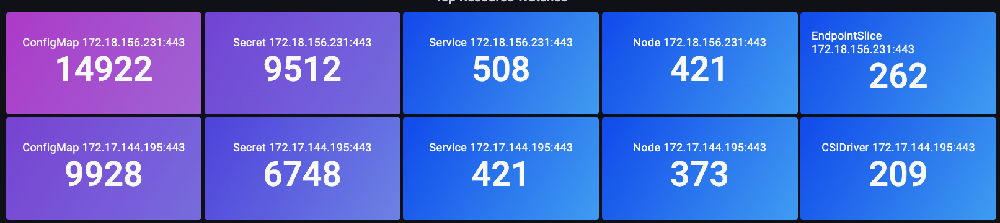
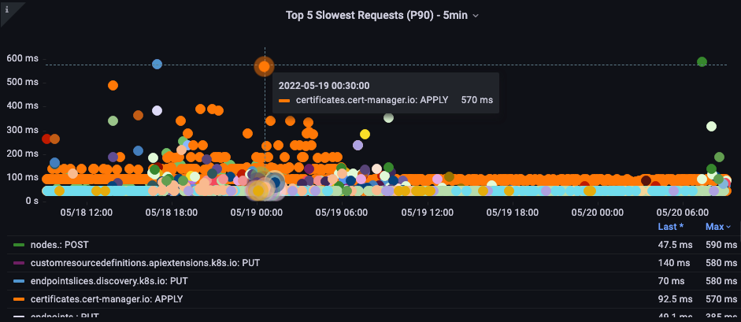

# Amazon EKS API Server Monitoring

Observability ఉత్తమ పద్ధతుల గైడ్ యొక్క ఈ విభాగంలో, API Server Monitoring కు సంబంధించిన క్రింది అంశాలపై మేము లోతుగా చర్చిస్తాము:

* Amazon EKS API Server Monitoring పరిచయం
* API Server Troubleshooter Dashboard ను setup చేయడం
* API Server సమస్యలను అర్థం చేసుకోవడానికి API Troubleshooter Dashboard ఉపయోగించడం
* API Server కు Unbounded list calls ను అర్థం చేసుకోవడం
* API Server కు చెడు ప్రవర్తనను ఆపడం
* API Priority and Fairness
* అత్యంత నెమ్మదైన API calls మరియు API Server Latency సమస్యలను గుర్తించడం

### పరిచయం

మీ Amazon EKS managed control plane ను monitor చేయడం అనేది మీ EKS cluster యొక్క ఆరోగ్యంతో సమస్యలను proactively గుర్తించడానికి చాలా ముఖ్యమైన Day 2 operational activity. Amazon EKS Control plane monitoring సేకరించిన metrics ఆధారంగా proactive చర్యలు తీసుకోవడంలో మీకు సహాయపడుతుంది. ఈ metrics API servers ను troubleshoot చేయడంలో మరియు సమస్య యొక్క మూల కారణాన్ని గుర్తించడంలో మాకు సహాయపడతాయి.

Amazon EKS API server monitoring కోసం ఈ విభాగంలో మా demonstration కోసం Amazon Managed Service for Prometheus (AMP) ను మరియు metrics visualization కోసం Amazon Managed Grafana (AMG) ను ఉపయోగిస్తాము. Prometheus అనేది శక్తివంతమైన querying features ను అందించే మరియు వివిధ workloads కోసం విస్తృత support ను కలిగి ఉన్న ప్రసిద్ధ open source monitoring tool. Amazon Managed Service for Prometheus అనేది Amazon EKS, [Amazon Elastic Container Service (Amazon ECS)](http://aws.amazon.com/ecs), మరియు [Amazon Elastic Compute Cloud (Amazon EC2)](http://aws.amazon.com/ec2) వంటి environments ను సురక్షితంగా మరియు నమ్మకంగా monitor చేయడాన్ని సులభతరం చేసే fully managed Prometheus-compatible service. [Amazon Managed Grafana](https://aws.amazon.com/grafana/) అనేది open source Grafana కోసం fully managed మరియు secure data visualization service, ఇది customers కు బహుళ data sources నుండి వారి applications కోసం operational metrics, logs మరియు traces ను తక్షణంగా query, correlate మరియు visualize చేయడానికి అనుమతిస్తుంది.

Prometheus తో [Amazon Elastic Kubernetes Service (Amazon EKS)](https://aws.amazon.com/eks) API Servers ను troubleshoot చేయడంలో మీకు సహాయపడటానికి Amazon Managed Service for Prometheus మరియు Amazon Managed Grafana ఉపయోగించి మొదట starter dashboard ను setup చేస్తాము. EKS API Servers ను troubleshoot చేసేటప్పుడు సమస్యలను అర్థం చేసుకోవడం, API priority and fairness, చెడు ప్రవర్తనలను ఆపడం గురించి రాబోయే విభాగాలలో లోతుగా చర్చిస్తాము. చివరగా మా Amazon EKS cluster స్థితిని ఆరోగ్యంగా ఉంచడానికి చర్యలు తీసుకోవడంలో మాకు సహాయపడే అత్యంత నెమ్మదైన API calls మరియు API server latency సమస్యలను గుర్తించడంలో లోతుగా చర్చిస్తాము.

### API Server Troubleshooter Dashboard ను Setup చేయడం

AMP తో [Amazon Elastic Kubernetes Service (Amazon EKS)](https://aws.amazon.com/eks) API Servers ను troubleshoot చేయడంలో మీకు సహాయపడటానికి starter dashboard ను setup చేస్తాము. మీ production EKS clusters ను troubleshoot చేసేటప్పుడు metrics ను అర్థం చేసుకోవడంలో మీకు సహాయపడటానికి దీన్ని ఉపయోగిస్తాము. మీ Amazon EKS clusters ను troubleshoot చేసేటప్పుడు దాని ప్రాముఖ్యతను అర్థం చేసుకోవడానికి సేకరించిన metrics పై మరింత లోతుగా దృష్టి పెడతాము.

మొదట, [మీ Amazon EKS cluster నుండి Amazon Managed Service for Prometheus కు metrics సేకరించడానికి ADOT collector ను setup చేయండి](https://aws.amazon.com/blogs/containers/metrics-and-traces-collection-using-amazon-eks-add-ons-for-aws-distro-for-opentelemetry/). ఈ setup లో EKS cluster up and running అయిన తర్వాత ఎప్పుడైనా ADOT ను add-on గా enable చేయడానికి users ను అనుమతించే EKS ADOT Addon ను ఉపయోగిస్తారు. ADOT add-on లో తాజా security patches మరియు bug fixes ఉంటాయి మరియు Amazon EKS తో పని చేయడానికి AWS ద్వారా validate చేయబడింది. ఈ setup EKS cluster లో ADOT add-on ను ఎలా install చేయాలో మరియు తర్వాత మీ cluster నుండి metrics సేకరించడానికి దాన్ని ఎలా ఉపయోగించాలో చూపిస్తుంది.

తర్వాత, మొదటి దశలో మీరు setup చేసిన AMP ను data source గా ఉపయోగించి metrics ను visualize చేయడానికి [మీ Amazon Managed Grafana workspace ను setup చేయండి](https://aws.amazon.com/blogs/mt/amazon-managed-grafana-getting-started/). చివరగా [API troubleshooter dashboard](https://github.com/RiskyAdventure/Troubleshooting-Dashboards/blob/main/api-troubleshooter.json) ను download చేయండి, మరింత troubleshooting కోసం metrics ను visualize చేయడానికి API troubleshooter dashboard json ను upload చేయడానికి Amazon Managed Grafana కు navigate చేయండి.

### సమస్యలను అర్థం చేసుకోవడానికి API Troubleshooter Dashboard ఉపయోగించడం

మీరు మీ cluster లో install చేయాలనుకునే ఆసక్తికరమైన open-source project ను కనుగొన్నారని అనుకుందాం. ఆ operator మీ cluster కు DaemonSet ను deploy చేస్తుంది, ఇది malformed requests, అనవసరంగా ఎక్కువ వాల్యూమ్ LIST calls ను ఉపయోగిస్తూ ఉండవచ్చు, లేదా మీ అన్ని 1,000 nodes లోని ప్రతి DaemonSet ప్రతి నిమిషం మీ cluster లోని అన్ని 50,000 pods స్థితిని request చేస్తూ ఉండవచ్చు!
ఇది నిజంగా తరచుగా జరుగుతుందా? అవును, జరుగుతుంది! అది ఎలా జరుగుతుందో తక్షణ detour తీసుకుందాం.

#### LIST vs. WATCH ను అర్థం చేసుకోవడం

కొన్ని applications మీ cluster లోని objects స్థితిని అర్థం చేసుకోవాలి. ఉదాహరణకు, మీ machine learning (ML) application *Completed* status లో లేని pods ఎన్ని ఉన్నాయో అర్థం చేసుకోవడం ద్వారా job status ను తెలుసుకోవాలనుకుంటుంది. Kubernetes లో, WATCH అనే దాంతో ఇది చేయడానికి మంచి పద్ధతులు ఉన్నాయి, మరియు pods పై తాజా status కనుగొనడానికి cluster లోని ప్రతి object ను list చేసే అంత మంచివి కాని పద్ధతులు కూడా ఉన్నాయి.

#### మంచిగా ప్రవర్తించే WATCH

WATCH లేదా ఒక single, long-lived connection ఉపయోగించి push model ద్వారా updates ను receive చేయడం Kubernetes లో updates చేయడానికి అత్యంత scalable మార్గం. సరళంగా చెప్పాలంటే, మేము system యొక్క పూర్తి స్థితిని request చేస్తాము, తర్వాత ఆ object కోసం మార్పులు receive అయినప్పుడు మాత్రమే cache లో object ను update చేస్తాము, ఏ updates miss కాలేదని నిర్ధారించుకోవడానికి periodically re-sync run చేస్తాము.

కింది image లో రెండు API servers అంతటా ఈ long-lived connections సంఖ్య గురించి ఆలోచన పొందడానికి `apiserver_longrunning_gauge` ను ఉపయోగిస్తాము.

*చిత్రం: `apiserver_longrunning_gauge` metric*

ఈ సమర్థవంతమైన system తో కూడా, మనకు మంచి విషయం ఎక్కువగా ఉండవచ్చు. ఉదాహరణకు, మనం అనేక చాలా చిన్న nodes ఉపయోగిస్తే, ప్రతి ఒక్కటి API server తో మాట్లాడాల్సిన రెండు లేదా అంతకంటే ఎక్కువ DaemonSets ఉపయోగిస్తుంటే, system పై WATCH calls సంఖ్యను అనవసరంగా నాటకీయంగా పెంచడం చాలా సులభం. ఉదాహరణకు, ఎనిమిది xlarge nodes vs. ఒకే 8xlarge మధ్య తేడాను చూద్దాం. ఇక్కడ system పై WATCH calls లో 8x పెరుగుదలను చూస్తాము.

*చిత్రం: 8 xlarge nodes మధ్య WATCH calls.*

ఇప్పుడు ఇవి efficient calls, కానీ బదులుగా మనం ముందు సూచించిన ill-behaved calls అయితే? పైన ఉన్న DaemonSets లో ఒకటి 1,000 nodes లో ప్రతి ఒక్కటి cluster లో మొత్తం 50,000 pods పై updates request చేస్తుంటే ఊహించండి. తదుపరి విభాగంలో ఈ unbounded list call ఆలోచనను explore చేస్తాము.

కొనసాగించే ముందు ఒక జాగ్రత్త మాట, పై ఉదాహరణలో ఉన్న రకమైన consolidation చాలా జాగ్రత్తగా చేయాలి, మరియు పరిగణించాల్సిన అనేక ఇతర factors ఉన్నాయి. System పై పరిమిత సంఖ్యలో CPUs కోసం పోటీ పడే threads సంఖ్య యొక్క delay, Pod churn rate, నుండి node సురక్షితంగా handle చేయగల volume attachments గరిష్ట సంఖ్య వరకు ప్రతిదీ. అయితే, సమస్యలు జరగకుండా నిరోధించగల actionable steps కు మమ్మల్ని నడిపించే metrics పై మా focus ఉంటుంది—మరియు బహుశా మా designs లో కొత్త insight ఇస్తుంది.

WATCH metric సాధారణమైనది, కానీ అది మీకు సమస్య అయితే watches సంఖ్యను track చేయడానికి మరియు తగ్గించడానికి ఉపయోగించవచ్చు. ఈ సంఖ్యను తగ్గించడానికి మీరు పరిగణించగల కొన్ని options ఇక్కడ ఉన్నాయి:

* History ను track చేయడానికి Helm సృష్టించే ConfigMaps సంఖ్యను పరిమితం చేయండి
* WATCH ఉపయోగించని Immutable ConfigMaps మరియు Secrets ఉపయోగించండి
* సముచితమైన node sizing మరియు consolidation

### API Server కు Unbounded list calls ను అర్థం చేసుకోవడం

ఇప్పుడు మనం మాట్లాడుతున్న LIST call విషయానికి వస్తే. List call అనేది మనం object స్థితిని అర్థం చేసుకోవాల్సిన ప్రతిసారి మన Kubernetes objects పై పూర్తి history ను pull చేయడం, ఈసారి cache లో ఏమీ save అవడం లేదు.

ఇదంతా ఎంత ప్రభావం చూపుతుంది? ఎంత agents data request చేస్తున్నారు, ఎంత తరచుగా చేస్తున్నారు, మరియు ఎంత data request చేస్తున్నారు అనే దానిపై ఆధారపడి ఉంటుంది. వారు cluster లో ప్రతిదీ request చేస్తున్నారా, లేదా ఒక్క namespace మాత్రమే? అది ప్రతి నిమిషం, ప్రతి node లో జరుగుతుందా? Node నుండి పంపబడే ప్రతి log కు Kubernetes metadata append చేసే logging agent ఉదాహరణను ఉపయోగిద్దాం. పెద్ద clusters లో ఇది అధిక మొత్తంలో data కావచ్చు. Agent ఆ data ను list call ద్వారా పొందడానికి అనేక మార్గాలు ఉన్నాయి, కొన్నింటిని చూద్దాం.

కింది request నిర్దిష్ట namespace నుండి pods ను request చేస్తోంది.

`/api/v1/namespaces/my-namespace/pods`

తర్వాత, cluster లో అన్ని 50,000 pods ను request చేస్తాము, కానీ ఒక సమయంలో 500 pods chunks లో.

`/api/v1/pods?limit=500`

తదుపరి call అత్యంత disruptive. ఒకే సమయంలో మొత్తం cluster లో అన్ని 50,000 pods ను fetch చేయడం.

`/api/v1/pods`

ఇది field లో చాలా సాధారణంగా జరుగుతుంది మరియు logs లో చూడవచ్చు.

### API Server కు చెడు ప్రవర్తనను ఆపడం

అటువంటి చెడు ప్రవర్తన నుండి మన cluster ను ఎలా రక్షించుకోవాలి? Kubernetes 1.20 ముందు, API server ప్రతి సెకనుకు process చేయబడే *inflight* requests సంఖ్యను పరిమితం చేయడం ద్వారా తనను తాను రక్షించుకునేది. etcd ఒక సమయంలో performant way లో అనేక requests ను మాత్రమే handle చేయగలదు కాబట్టి, etcd reads మరియు writes సహేతుకమైన latency band లో ఉండేలా ప్రతి సెకనుకు requests సంఖ్యను ఒక విలువకు పరిమితం చేయాలని నిర్ధారించుకోవాలి. దురదృష్టవశాత్తు, ఈ వ్రాత సమయంలో, దీన్ని dynamically చేయడానికి మార్గం లేదు.

కింది chart లో read requests యొక్క breakdown ను చూస్తాము, ఇది API server కు default maximum 400 inflight requests మరియు default max 200 concurrent write requests కలిగి ఉంటుంది. Default EKS cluster లో మీరు మొత్తం 800 reads మరియు 400 writes కోసం రెండు API servers చూస్తారు. అయితే, upgrade తర్వాత వంటి వివిధ సమయాలలో ఈ servers వాటిపై asymmetric loads కలిగి ఉండవచ్చు కాబట్టి జాగ్రత్త సూచించబడుతుంది.

*చిత్రం: Read requests breakdown తో Grafana chart.*

పై scheme perfect కాదని తేలింది. ఉదాహరణకు, మనం ఇప్పుడే install చేసిన ఈ చెడుగా ప్రవర్తించే కొత్త operator API server లో అన్ని inflight write requests ను తీసుకోకుండా మరియు node keepalive messages వంటి ముఖ్యమైన requests ను potentially delay చేయకుండా ఎలా ఆపగలం?

### API Priority and Fairness

ప్రతి సెకనుకు ఎన్ని read/write requests open అయ్యాయో ఆందోళన పడే బదులు, capacity ను ఒక total number గా treat చేసి, cluster లో ప్రతి application ఆ total maximum number యొక్క fair percentage లేదా share పొందితే ఎలా ఉంటుంది?

దాన్ని effectively చేయడానికి, API server కు request ఎవరు పంపారో గుర్తించాలి, తర్వాత ఆ request కు ఒక రకమైన name tag ఇవ్వాలి. ఈ కొత్త name tag తో, మనం "Chatty" అని పిలిచే కొత్త agent నుండి ఈ అన్ని requests వస్తున్నాయని చూడవచ్చు. ఇప్పుడు Chatty యొక్క అన్ని requests ను ఒక *flow* అని పిలిచే దానిలో group చేయవచ్చు, ఆ requests అదే DaemonSet నుండి వస్తున్నాయని గుర్తిస్తుంది. ఈ concept ఈ చెడు agent ను restrict చేయడానికి మరియు ఇది మొత్తం cluster ను consume చేయకుండా నిర్ధారించుకోవడానికి మాకు సామర్థ్యం ఇస్తుంది.

అయితే, అన్ని requests సమానంగా సృష్టించబడవు. Cluster ను operational గా ఉంచడానికి అవసరమైన control plane traffic మన కొత్త operator కంటే ఎక్కువ priority ఉండాలి. ఇక్కడే priority levels ఆలోచన వస్తుంది. Default గా, critical, high మరియు low priority traffic కోసం అనేక "buckets" లేదా queues ఉంటే ఎలా ఉంటుంది? Critical traffic queue లో chatty agent flow fair share of traffic పొందాలని మనం కోరుకోము. అయితే ఆ traffic ను low priority queue లో ఉంచవచ్చు, అక్కడ ఆ flow బహుశా ఇతర chatty agents తో compete అవుతుంది. Requests చాలా delayed కాకుండా ఉండేలా ప్రతి priority level overall maximum యొక్క సరైన shares లేదా percentage కలిగి ఉండేలా నిర్ధారించుకోవాలి.

#### Priority and fairness ఆచరణలో

ఇది సాపేక్షంగా కొత్త feature కాబట్టి, అనేక existing dashboards maximum inflight reads మరియు maximum inflight writes యొక్క పాత model ను ఉపయోగిస్తాయి. ఇది ఎందుకు సమస్యాత్మకంగా ఉంటుంది?

Kube-system namespace లో ప్రతిదానికి high priority name tags ఇస్తుంటే, కానీ మనం ఆ చెడు agent ను ఆ ముఖ్యమైన namespace లో install చేస్తే, లేదా ఆ namespace లో చాలా ఎక్కువ applications deploy చేస్తే ఏమవుతుంది? మనం నివారించాలనుకుంటున్న అదే సమస్య వచ్చే అవకాశం ఉంది! కాబట్టి అటువంటి పరిస్థితులపై జాగ్రత్తగా కన్ను వేసి ఉంచడం మంచిది.

ఈ రకమైన సమస్యలను track చేయడానికి నేను అత్యంత ఆసక్తికరంగా భావించే కొన్ని metrics ను మీ కోసం విభజించాను.

* Priority group shares ఎంత percentage ఉపయోగించబడుతోంది?
* Queue లో request ఎంత సేపు wait చేసింది?
* ఏ flow అత్యధిక shares ఉపయోగిస్తోంది?
* System లో unexpected delays ఉన్నాయా?

#### వినియోగంలో ఉన్న Percent

ఇక్కడ cluster లోని వివిధ default priority groups మరియు max లో ఎంత percentage ఉపయోగించబడుతోందో చూస్తాము.

*చిత్రం: Cluster లో Priority groups.*

#### Request queue లో ఉన్న సమయం

Process చేయబడే ముందు priority queue లో request ఎన్ని సెకన్లు ఉందో.

*చిత్రం: Priority queue లో request ఉన్న సమయం.*

#### Flow ద్వారా top executed requests

ఏ flow అత్యధిక shares తీసుకుంటోంది?

*చిత్రం: Flow ద్వారా top executing requests.*

#### Request Execution Time

Processing లో unexpected delays ఉన్నాయా?

*చిత్రం: Flow control request execution time.*

### అత్యంత నెమ్మదైన API calls మరియు API Server Latency సమస్యలను గుర్తించడం

ఇప్పుడు API latency కు కారణమయ్యే విషయాల స్వభావాన్ని అర్థం చేసుకున్నాము కాబట్టి, వెనక్కి వెళ్లి పెద్ద చిత్రాన్ని చూడవచ్చు. మన dashboard designs మనం investigate చేయాల్సిన సమస్య ఉందా అనే quick snapshot పొందడానికి ప్రయత్నిస్తున్నాయని గుర్తుంచుకోవడం ముఖ్యం. వివరమైన analysis కోసం, PromQL తో ad-hoc queries ఉపయోగిస్తాము—లేదా మరింత మెరుగ్గా, logging queries.

మనం చూడాలనుకునే high-level metrics కోసం కొన్ని ఆలోచనలు ఏమిటి?

* ఏ API call complete అవడానికి అత్యధిక సమయం తీసుకుంటోంది?
    * ఆ call ఏమి చేస్తోంది? (Objects ను list చేయడం, delete చేయడం, మొదలైనవి.)
    * ఆ operation ఏ objects పై చేయడానికి ప్రయత్నిస్తోంది? (Pods, Secrets, ConfigMaps, మొదలైనవి.)
* API server లోనే latency సమస్య ఉందా?
    * నా priority queues లో ఒకదానిలో requests backup కు కారణమయ్యే delay ఉందా?
* etcd server latency experience చేస్తున్నందున API server నెమ్మదిగా కనిపిస్తోందా?

#### అత్యంత నెమ్మదైన API call

కింది chart లో ఆ period కోసం complete అవడానికి అత్యధిక సమయం తీసుకున్న API calls ను చూస్తున్నాము. ఈ సందర్భంలో 05:40 time frame లో అత్యంత latent call అయిన LIST function ను call చేస్తున్న custom resource definition (CRD) ను చూస్తాము. ఈ data తో ఈ application ఏమిటో చూడడానికి ఆ timeframe లో audit log నుండి LIST requests ను pull చేయడానికి CloudWatch Insights ను ఉపయోగించవచ్చు.

*చిత్రం: Top 5 అత్యంత నెమ్మదైన API calls.*

#### API Request Duration

ఈ API latency chart ఏదైనా requests ఒక నిమిషం timeout value ను approach చేస్తున్నాయా అని అర్థం చేసుకోవడంలో మాకు సహాయపడుతుంది. కింద ఉన్న histogram over time format ను నేను ఇష్టపడతాను ఎందుకంటే line graph దాచే data లోని outliers ను చూడగలను.

*చిత్రం: API Request duration heatmap.*

Bucket పై hover చేయడం వల్ల దాదాపు 25 milliseconds తీసుకున్న calls యొక్క ఖచ్చితమైన సంఖ్యను చూపిస్తుంది.
[Image: Image.jpg]*చిత్రం: 25 milliseconds కంటే ఎక్కువ Calls.*

Requests ను cache చేసే ఇతర systems తో పని చేసేటప్పుడు ఈ concept ముఖ్యమైనది. Cache requests వేగంగా ఉంటాయి; ఆ request latencies ను నెమ్మదైన requests తో merge చేయాలనుకోము. ఇక్కడ latency యొక్క రెండు distinct bands, cache చేయబడిన requests మరియు cache చేయబడనివి చూడవచ్చు.

*చిత్రం: Latency, requests cached.*

#### ETCD Request Duration

ETCD latency Kubernetes performance లో అత్యంత ముఖ్యమైన factors లో ఒకటి. `request_duration_seconds_bucket` metric ను చూడడం ద్వారా API server దృష్టికోణం నుండి ఈ performance ను చూడడానికి Amazon EKS మిమ్మల్ని అనుమతిస్తుంది.

*చిత్రం: `request_duration_seconds_bucket` metric.*

కొన్ని events correlated ఉన్నాయా అని చూడడం ద్వారా మనం నేర్చుకున్న విషయాలను కలపడం ప్రారంభించవచ్చు. కింది chart లో API server latency చూస్తాము, కానీ ఈ latency ఎక్కువ భాగం etcd server నుండి వస్తోందని కూడా చూస్తాము. ఒక్క చూపుతో సరైన problem area కు త్వరగా వెళ్లగలగడం dashboard ను శక్తివంతం చేస్తుంది.

*చిత్రం: Etcd Requests*

## ముగింపు

Observability ఉత్తమ పద్ధతుల గైడ్ యొక్క ఈ విభాగంలో, [Amazon Elastic Kubernetes Service (Amazon EKS)](https://aws.amazon.com/eks) API Servers ను troubleshoot చేయడంలో మీకు సహాయపడటానికి Amazon Managed Service for Prometheus మరియు Amazon Managed Grafana ఉపయోగించి [starter dashboard](https://github.com/RiskyAdventure/Troubleshooting-Dashboards/blob/main/api-troubleshooter.json) ను ఉపయోగించాము. అంతేకాక, EKS API Servers ను troubleshoot చేసేటప్పుడు సమస్యలను అర్థం చేసుకోవడం, API priority and fairness, చెడు ప్రవర్తనలను ఆపడం గురించి లోతుగా చర్చించాము. చివరగా మా Amazon EKS cluster స్థితిని ఆరోగ్యంగా ఉంచడానికి చర్యలు తీసుకోవడంలో మాకు సహాయపడే అత్యంత నెమ్మదైన API calls మరియు API server latency సమస్యలను గుర్తించడంలో లోతుగా చర్చించాము. మరింత లోతైన అభ్యసన కోసం, AWS [One Observability Workshop](https://catalog.workshops.aws/observability/en-US) యొక్క AWS native Observability category కింద Application Monitoring module ను practice చేయమని మేము గట్టిగా సిఫారసు చేస్తాము.
