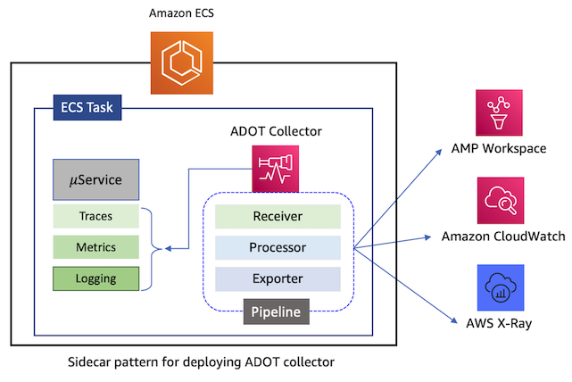

# AWS Distro for OpenTelemetry ఉపయోగించి ECS క్లస్టర్‌లో సిస్టమ్ మెట్రిక్స్ సేకరించడం
[AWS Distro for OpenTelemetry](https://aws-otel.github.io/docs/introduction) (ADOT) అనేది [OpenTelemetry](https://opentelemetry.io/) ప్రాజెక్ట్ యొక్క సురక్షితమైన, AWS-మద్దతు కలిగిన పంపిణీ. ADOT ఉపయోగించి, మీరు బహుళ సోర్సుల నుండి టెలిమెట్రీ డేటాను సేకరించి, సంబంధిత మెట్రిక్స్, ట్రేసెస్ మరియు లాగ్‌లను బహుళ మానిటరింగ్ సొల్యూషన్‌లకు పంపవచ్చు. ADOT ను Amazon ECS క్లస్టర్‌లో రెండు వేర్వేరు పాటర్న్‌లలో డిప్లాయ్ చేయవచ్చు.

## ADOT Collector కోసం డిప్లాయ్‌మెంట్ పాటర్న్‌లు
1. Sidecar పాటర్న్‌లో, ADOT collector క్లస్టర్‌లోని ప్రతి టాస్క్ లోపల రన్ అవుతుంది మరియు ఆ టాస్క్ లోపల అప్లికేషన్ కంటైనర్‌ల నుండి మాత్రమే సేకరించిన టెలిమెట్రీ డేటాను ప్రాసెస్ చేస్తుంది. Amazon ECS [Task Metadata Endpoint](https://docs.aws.amazon.com/AmazonECS/latest/developerguide/task-metadata-endpoint.html) నుండి టాస్క్ మెటాడేటాను చదవడానికి మరియు వాటి నుండి రిసోర్స్ వాడకం మెట్రిక్స్ (CPU, మెమరీ, నెట్‌వర్క్ మరియు డిస్క్ వంటివి) జనరేట్ చేయడానికి collector అవసరమైనప్పుడు మాత్రమే ఈ డిప్లాయ్‌మెంట్ పాటర్న్ అవసరం.


2. సెంట్రల్ collector పాటర్న్‌లో, ADOT collector యొక్క ఒకే ఇన్‌స్టెన్స్ క్లస్టర్‌లో డిప్లాయ్ చేయబడుతుంది మరియు క్లస్టర్‌లో రన్ అవుతున్న అన్ని టాస్క్‌ల నుండి టెలిమెట్రీ డేటాను ప్రాసెస్ చేస్తుంది. ఇది అత్యంత సాధారణంగా ఉపయోగించే డిప్లాయ్‌మెంట్ పాటర్న్. Collector REPLICA లేదా DAEMON సర్వీస్ షెడ్యూలర్ స్ట్రాటజీ ఉపయోగించి డిప్లాయ్ చేయబడుతుంది.


ADOT collector ఆర్కిటెక్చర్‌లో పైప్‌లైన్ కాన్సెప్ట్ ఉంది. ఒకే collector ఒకటి కంటే ఎక్కువ పైప్‌లైన్‌లను కలిగి ఉండవచ్చు. ప్రతి పైప్‌లైన్ మూడు రకాల టెలిమెట్రీ డేటాలో ఒకదానిని ప్రాసెస్ చేయడానికి అంకితం చేయబడింది, అవి మెట్రిక్స్, ట్రేసెస్ మరియు లాగ్‌లు. ప్రతి రకమైన టెలిమెట్రీ డేటా కోసం మీరు బహుళ పైప్‌లైన్‌లను కాన్ఫిగర్ చేయవచ్చు. ఈ బహుముఖ ఆర్కిటెక్చర్ ద్వారా ఒకే collector బహుళ observability ఏజెంట్‌ల పాత్రను నిర్వహించగలుగుతుంది, లేకపోతే వాటిని క్లస్టర్‌లో విడివిడిగా డిప్లాయ్ చేయవలసి ఉండేది. ఇది క్లస్టర్‌లో observability ఏజెంట్‌ల డిప్లాయ్‌మెంట్ ఫుట్‌ప్రింట్‌ను గణనీయంగా తగ్గిస్తుంది. పైప్‌లైన్‌ను రూపొందించే collector యొక్క ప్రాథమిక భాగాలు మూడు వర్గాలుగా వర్గీకరించబడ్డాయి: Receiver, Processor మరియు Exporter. Extensions అనే ద్వితీయ భాగాలు collector కు జోడించగల సామర్థ్యాలను అందిస్తాయి, కానీ అవి పైప్‌లైన్‌లలో భాగం కావు.

:::info
    Receivers, Processors, Exporters మరియు Extensions యొక్క వివరమైన వివరణ కోసం OpenTelemetry [డాక్యుమెంటేషన్](https://opentelemetry.io/docs/collector/configuration/#basics) చూడండి.
:::

## ECS టాస్క్ మెట్రిక్స్ సేకరణ కోసం ADOT Collector డిప్లాయ్ చేయడం

ECS టాస్క్ స్థాయిలో రిసోర్స్ వినియోగ మెట్రిక్స్ సేకరించడానికి, ADOT collector ను క్రింద చూపిన విధంగా టాస్క్ డెఫినిషన్ ఉపయోగించి sidecar పాటర్న్‌తో డిప్లాయ్ చేయాలి. Collector కోసం ఉపయోగించే కంటైనర్ ఇమేజ్ అనేక పైప్‌లైన్ కాన్ఫిగరేషన్‌లతో బండిల్ చేయబడింది. మీ అవసరాల ఆధారంగా వాటిలో ఒకదానిని ఎంచుకొని కంటైనర్ డెఫినిషన్ యొక్క *command* సెక్షన్‌లో కాన్ఫిగరేషన్ ఫైల్ పాత్‌ను స్పెసిఫై చేయవచ్చు. ఈ విలువను `--config=/etc/ecs/container-insights/otel-task-metrics-config.yaml` గా సెట్ చేయడం వలన [పైప్‌లైన్ కాన్ఫిగరేషన్](https://github.com/aws-observability/aws-otel-collector/blob/main/config/ecs/container-insights/otel-task-metrics-config.yaml) ఉపయోగించబడుతుంది, ఇది collector తో సమానమైన టాస్క్‌లో రన్ అవుతున్న ఇతర కంటైనర్‌ల నుండి రిసోర్స్ వినియోగ మెట్రిక్స్ మరియు ట్రేసెస్‌ను సేకరించి Amazon CloudWatch మరియు AWS X-Ray కు పంపుతుంది. ప్రత్యేకంగా, collector [AWS ECS Container Metrics Receiver](https://github.com/open-telemetry/opentelemetry-collector-contrib/tree/main/receiver/awsecscontainermetricsreceiver) ను ఉపయోగిస్తుంది, ఇది [Amazon ECS Task Metadata Endpoint](https://docs.aws.amazon.com/AmazonECS/latest/developerguide/task-metadata-endpoint-v4.html) నుండి టాస్క్ మెటాడేటా మరియు docker stats చదివి, వాటి నుండి రిసోర్స్ వాడకం మెట్రిక్స్ (CPU, మెమరీ, నెట్‌వర్క్ మరియు డిస్క్ వంటివి) జనరేట్ చేస్తుంది.

```javascript
{
    "family":"AdotTask",
    "taskRoleArn":"arn:aws:iam::123456789012:role/ECS-ADOT-Task-Role",
    "executionRoleArn":"arn:aws:iam::123456789012:role/ECS-Task-Execution-Role",
    "networkMode":"awsvpc",
    "containerDefinitions":[
       {
          "name":"application-container",
          "image":"..."
       },
       {
          "name":"aws-otel-collector",
          "image":"public.ecr.aws/aws-observability/aws-otel-collector:latest",
          "cpu":512,
          "memory":1024,
          "command": [
            "--config=/etc/ecs/container-insights/otel-task-metrics-config.yaml"
          ],          
          "portMappings":[
             {
                "containerPort":2000,
                "protocol":"udp"
             }
          ],             
          "essential":true
       }
    ],
    "requiresCompatibilities":[
       "EC2"
    ],
    "cpu":"1024",
    "memory":"2048"
 }
```
:::info
    Amazon ECS క్లస్టర్‌లో ADOT collector డిప్లాయ్ చేసినప్పుడు ఉపయోగించే IAM టాస్క్ రోల్ మరియు టాస్క్ ఎక్జిక్యూషన్ రోల్ సెటప్ చేయడం గురించి వివరాల కోసం [డాక్యుమెంటేషన్](https://docs.aws.amazon.com/AmazonCloudWatch/latest/monitoring/deploy-container-insights-ECS-adot.html) చూడండి.
:::

:::info
    [AWS ECS Container Metrics Receiver](https://github.com/open-telemetry/opentelemetry-collector-contrib/tree/main/receiver/awsecscontainermetricsreceiver) ECS Task Metadata Endpoint V4 కోసం మాత్రమే పనిచేస్తుంది. ప్లాట్‌ఫార్మ్ వెర్షన్ 1.4.0 లేదా తరువాతి వాటిని ఉపయోగించే Fargate పై Amazon ECS టాస్క్‌లు మరియు Amazon ECS కంటైనర్ ఏజెంట్ వెర్షన్ 1.39.0 లేదా అంతకంటే ఎక్కువ వెర్షన్‌ను రన్ చేస్తున్న Amazon EC2 పై Amazon ECS టాస్క్‌లు ఈ receiver ను ఉపయోగించగలవు. మరిన్ని సమాచారం కోసం, [Amazon ECS Container Agent Versions](https://docs.aws.amazon.com/AmazonECS/latest/developerguide/ecs-agent-versions.html) చూడండి.
:::

డీఫాల్ట్ [పైప్‌లైన్ కాన్ఫిగరేషన్](https://github.com/aws-observability/aws-otel-collector/blob/main/config/ecs/container-insights/otel-task-metrics-config.yaml) లో చూసినట్లు, collector యొక్క పైప్‌లైన్ మొదట [Filter Processor](https://github.com/open-telemetry/opentelemetry-collector-contrib/tree/main/processor/filterprocessor) ను ఉపయోగిస్తుంది, ఇది CPU, మెమరీ, నెట్‌వర్క్ మరియు డిస్క్ వాడకానికి సంబంధించిన [మెట్రిక్స్ సబ్‌సెట్](https://github.com/aws-observability/aws-otel-collector/blob/09d59966404c2928aaaf6920f27967a84d898254/config/ecs/container-insights/otel-task-metrics-config.yaml#L25) ను ఫిల్టర్ చేస్తుంది. తరువాత ఇది [Metrics Transform Processor](https://github.com/open-telemetry/opentelemetry-collector-contrib/tree/main/processor/metricstransformprocessor) ను ఉపయోగిస్తుంది, ఇది ఈ మెట్రిక్స్ పేర్లను మార్చడానికి అలాగే వాటి attributes ను అప్‌డేట్ చేయడానికి [transformations](https://github.com/aws-observability/aws-otel-collector/blob/09d59966404c2928aaaf6920f27967a84d898254/config/ecs/container-insights/otel-task-metrics-config.yaml#L39) సెట్‌ను నిర్వహిస్తుంది. చివరగా, [Amazon CloudWatch EMF Exporter](https://github.com/open-telemetry/opentelemetry-collector-contrib/tree/main/exporter/awsemfexporter) ఉపయోగించి మెట్రిక్స్ CloudWatch కు పెర్ఫార్మెన్స్ లాగ్ ఈవెంట్‌లుగా పంపబడతాయి. ఈ డీఫాల్ట్ కాన్ఫిగరేషన్ ఉపయోగించడం వలన CloudWatch నేమ్‌స్పేస్ *ECS/ContainerInsights* కింద కింది రిసోర్స్ వాడకం మెట్రిక్స్ సేకరించబడతాయి.

- MemoryUtilized
- MemoryReserved
- CpuUtilized
- CpuReserved
- NetworkRxBytes
- NetworkTxBytes
- StorageReadBytes
- StorageWriteBytes

:::info
    ఇవి [Amazon ECS కోసం Container Insights ద్వారా సేకరించబడిన అదే మెట్రిక్స్](https://docs.aws.amazon.com/AmazonCloudWatch/latest/monitoring/Container-Insights-metrics-ECS.html) అని గమనించండి మరియు క్లస్టర్ లేదా అకౌంట్ స్థాయిలో Container Insights ఎనేబుల్ చేసినప్పుడు CloudWatch లో సిద్ధంగా అందుబాటులో ఉంటాయి. కాబట్టి, CloudWatch లో ECS రిసోర్స్ వాడకం మెట్రిక్స్ సేకరించడానికి Container Insights ఎనేబుల్ చేయడం సిఫారసు చేయబడిన విధానం.
:::

AWS ECS Container Metrics Receiver Amazon ECS Task Metadata Endpoint నుండి చదివే 52 ప్రత్యేకమైన మెట్రిక్స్‌ను ఎమిట్ చేస్తుంది. Receiver ద్వారా సేకరించబడిన మెట్రిక్స్ పూర్తి జాబితా [ఇక్కడ డాక్యుమెంట్ చేయబడింది](https://github.com/open-telemetry/opentelemetry-collector-contrib/tree/main/receiver/awsecscontainermetricsreceiver#available-metrics). మీరు వాటన్నింటినీ మీ ప్రాధాన్య గమ్యస్థానానికి పంపకూడదనుకోవచ్చు. ECS రిసోర్స్ వాడకం మెట్రిక్స్‌పై మరింత స్పష్టమైన నియంత్రణ కావాలంటే, మీ ఎంపిక యొక్క processors/transformers తో అందుబాటులో ఉన్న మెట్రిక్స్‌ను ఫిల్టర్ చేసి, ట్రాన్స్‌ఫార్మ్ చేసి, మీ ఎంపిక యొక్క exporters ఆధారంగా గమ్యస్థానానికి పంపే కస్టమ్ పైప్‌లైన్ కాన్ఫిగరేషన్‌ను సృష్టించవచ్చు. ECS టాస్క్ స్థాయి మెట్రిక్స్‌ను క్యాప్చర్ చేయడానికి పైప్‌లైన్ కాన్ఫిగరేషన్‌ల [అదనపు ఉదాహరణల](https://github.com/open-telemetry/opentelemetry-collector-contrib/tree/main/receiver/awsecscontainermetricsreceiver#full-configuration-examples) కోసం డాక్యుమెంటేషన్ చూడండి.

కస్టమ్ పైప్‌లైన్ కాన్ఫిగరేషన్ ఉపయోగించాలనుకుంటే, క్రింద చూపిన టాస్క్ డెఫినిషన్ ఉపయోగించి sidecar పాటర్న్‌తో collector ను డిప్లాయ్ చేయవచ్చు. ఇక్కడ, collector పైప్‌లైన్ కాన్ఫిగరేషన్ AWS SSM Parameter Store లోని *otel-collector-config* అనే పారామీటర్ నుండి లోడ్ చేయబడుతుంది.

:::note
    SSM Parameter Store పారామీటర్ పేరు AOT_CONFIG_CONTENT అనే ఎన్విరాన్‌మెంట్ వేరియబుల్ ఉపయోగించి collector కు ఎక్స్‌పోజ్ చేయాలి.
:::

```javascript
{
    "family":"AdotTask",
    "taskRoleArn":"arn:aws:iam::123456789012:role/ECS-ADOT-Task-Role",
    "executionRoleArn":"arn:aws:iam::123456789012:role/ECS-Task-Execution-Role",
    "networkMode":"awsvpc",
    "containerDefinitions":[
       {
          "name":"application-container",
          "image":"..."
       },        
       {
          "name":"aws-otel-collector",
          "image":"public.ecr.aws/aws-observability/aws-otel-collector:latest",
          "cpu":512,
          "memory":1024,
          "secrets":[
             {
                "name":"AOT_CONFIG_CONTENT",
                "valueFrom":"arn:aws:ssm:us-east-1:123456789012:parameter/otel-collector-config"
             }
          ],          
          "portMappings":[
             {
                "containerPort":2000,
                "protocol":"udp"
             }
          ],             
          "essential":true
       }
    ],
    "requiresCompatibilities":[
       "EC2"
    ],
    "cpu":"1024",
    "memory":"2048"
 }
```

## ECS కంటైనర్ ఇన్‌స్టెన్స్ మెట్రిక్స్ సేకరణ కోసం ADOT Collector డిప్లాయ్ చేయడం

మీ ECS క్లస్టర్ నుండి EC2 ఇన్‌స్టెన్స్-స్థాయి మెట్రిక్స్ సేకరించడానికి, ADOT collector ను క్రింద చూపిన టాస్క్ డెఫినిషన్ ఉపయోగించి డిప్లాయ్ చేయవచ్చు. ఇది daemon సర్వీస్ షెడ్యూలర్ స్ట్రాటజీతో డిప్లాయ్ చేయాలి. మీరు కంటైనర్ ఇమేజ్‌లో బండిల్ చేయబడిన పైప్‌లైన్ కాన్ఫిగరేషన్‌ను ఎంచుకోవచ్చు. కంటైనర్ డెఫినిషన్ యొక్క *command* సెక్షన్‌లో కాన్ఫిగరేషన్ ఫైల్ పాత్ `--config=/etc/ecs/otel-instance-metrics-config.yaml` గా సెట్ చేయాలి. Collector CPU, మెమరీ, డిస్క్ మరియు నెట్‌వర్క్ వంటి అనేక రిసోర్సుల కోసం EC2 ఇన్‌స్టెన్స్-స్థాయి ఇన్‌ఫ్రాస్ట్రక్చర్ మెట్రిక్స్ సేకరించడానికి [AWS Container Insights Receiver](https://github.com/open-telemetry/opentelemetry-collector-contrib/tree/main/receiver/awscontainerinsightreceiver#aws-container-insights-receiver) ను ఉపయోగిస్తుంది. [Amazon CloudWatch EMF Exporter](https://github.com/open-telemetry/opentelemetry-collector-contrib/tree/main/exporter/awsemfexporter) ఉపయోగించి మెట్రిక్స్ CloudWatch కు పెర్ఫార్మెన్స్ లాగ్ ఈవెంట్‌లుగా పంపబడతాయి. ఈ కాన్ఫిగరేషన్‌తో collector యొక్క కార్యాచరణ EC2 పై హోస్ట్ చేయబడిన Amazon ECS క్లస్టర్‌కు CloudWatch ఏజెంట్‌ను డిప్లాయ్ చేయడంతో సమానం.

:::info
    EC2 ఇన్‌స్టెన్స్-స్థాయి మెట్రిక్స్ సేకరించడానికి ADOT Collector డిప్లాయ్‌మెంట్ AWS Fargate పై రన్ అవుతున్న ECS క్లస్టర్‌లలో సపోర్ట్ చేయబడదు
:::

```javascript
{
    "family":"AdotTask",
    "taskRoleArn":"arn:aws:iam::123456789012:role/ECS-ADOT-Task-Role",
    "executionRoleArn":"arn:aws:iam::123456789012:role/ECS-Task-Execution-Role",
    "networkMode":"awsvpc",
    "containerDefinitions":[
       {
          "name":"application-container",
          "image":"..."
       },
       {
          "name":"aws-otel-collector",
          "image":"public.ecr.aws/aws-observability/aws-otel-collector:latest",
          "cpu":512,
          "memory":1024,
          "command": [
            "--config=/etc/ecs/otel-instance-metrics-config.yaml"
          ],          
          "portMappings":[
             {
                "containerPort":2000,
                "protocol":"udp"
             }
          ],             
          "essential":true
       }
    ],
    "requiresCompatibilities":[
       "EC2"
    ],
    "cpu":"1024",
    "memory":"2048"
 }
```
