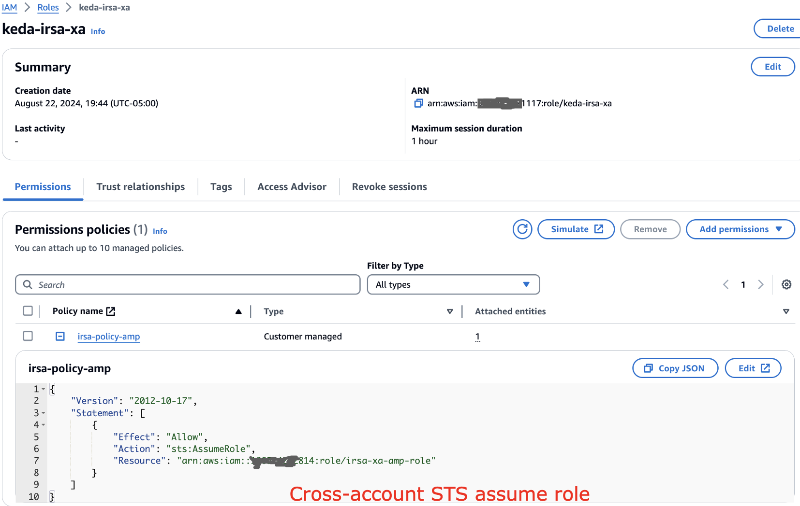

# AMP మరియు EKS లో KEDA ఉపయోగించి అప్లికేషన్‌లను ఆటోస్కేలింగ్ చేయడం

# ప్రస్తుత పరిస్థితి

Amazon EKS అప్లికేషన్‌లపై పెరిగిన ట్రాఫిక్‌ను నిర్వహించడం సవాలుగా ఉంటుంది, మాన్యువల్ స్కేలింగ్ అసమర్థమైనది మరియు లోపాలకు గురయ్యే అవకాశం ఉంది. రిసోర్స్ కేటాయింపు కోసం ఆటోస్కేలింగ్ మెరుగైన పరిష్కారాన్ని అందిస్తుంది. KEDA వివిధ మెట్రిక్స్ మరియు ఈవెంట్‌ల ఆధారంగా Kubernetes ఆటోస్కేలింగ్‌ను అనుమతిస్తుంది, అదే సమయంలో Amazon Managed Service for Prometheus EKS క్లస్టర్‌ల కోసం సురక్షిత మెట్రిక్ మానిటరింగ్ అందిస్తుంది. ఈ సొల్యూషన్ KEDA ను Amazon Managed Service for Prometheus తో కలుపుతుంది, Requests Per Second (RPS) మెట్రిక్స్ ఆధారంగా ఆటోస్కేలింగ్‌ను ప్రదర్శిస్తుంది. ఈ విధానం వర్క్‌లోడ్ డిమాండ్‌లకు అనుగుణంగా ఆటోమేటెడ్ స్కేలింగ్‌ను అందిస్తుంది, దీనిని వినియోగదారులు తమ స్వంత EKS వర్క్‌లోడ్‌లకు అన్వయించవచ్చు. స్కేలింగ్ పాటర్న్‌లను మానిటరింగ్ చేయడానికి మరియు విజువలైజ్ చేయడానికి Amazon Managed Grafana ఉపయోగించబడుతుంది, ఇది వినియోగదారులకు ఆటోస్కేలింగ్ ప్రవర్తనల గురించి అంతర్దృష్టులను పొందడానికి మరియు వాటిని వ్యాపార ఈవెంట్‌లతో సహసంబంధం చేయడానికి అనుమతిస్తుంది.

# AMP మెట్రిక్స్ ఆధారంగా KEDA తో అప్లికేషన్ ఆటోస్కేలింగ్

ఈ సొల్యూషన్ ఆటోమేటెడ్ స్కేలింగ్ పైప్‌లైన్‌ను సృష్టించడానికి ఓపెన్-సోర్స్ సాఫ్ట్‌వేర్‌తో AWS ఇంటిగ్రేషన్‌ను ప్రదర్శిస్తుంది. ఇది మేనేజ్డ్ Kubernetes కోసం Amazon EKS, మెట్రిక్ సేకరణ కోసం AWS Distro for Open Telemetry (ADOT), ఈవెంట్-డ్రివెన్ ఆటోస్కేలింగ్ కోసం KEDA, మెట్రిక్ నిల్వ కోసం Amazon Managed Service for Prometheus, మరియు విజువలైజేషన్ కోసం Amazon Managed Grafana ను కలుపుతుంది. ఆర్కిటెక్చర్‌లో EKS పై KEDA డిప్లాయ్ చేయడం, మెట్రిక్స్ స్క్రేప్ చేయడానికి ADOT కాన్ఫిగర్ చేయడం, KEDA ScaledObject తో ఆటోస్కేలింగ్ రూల్స్ నిర్వచించడం, మరియు స్కేలింగ్ మానిటర్ చేయడానికి Grafana డాష్‌బోర్డ్‌లు ఉపయోగించడం ఉంటాయి. ఆటోస్కేలింగ్ ప్రక్రియ వినియోగదారు రిక్వెస్ట్‌లతో మైక్రోసర్వీస్‌కు ప్రారంభమవుతుంది, ADOT మెట్రిక్స్ సేకరించి Prometheus కు పంపుతుంది. KEDA ఈ మెట్రిక్స్‌ను క్రమం తప్పకుండా క్వెరీ చేస్తుంది, స్కేలింగ్ అవసరాలను నిర్ణయిస్తుంది, మరియు పాడ్ రెప్లికాలను సర్దుబాటు చేయడానికి Horizontal Pod Autoscaler (HPA) తో ఇంటరాక్ట్ చేస్తుంది. ఈ సెటప్ Kubernetes మైక్రోసర్వీసెస్ కోసం మెట్రిక్స్-డ్రివెన్ ఆటోస్కేలింగ్‌ను అనుమతిస్తుంది, వివిధ వినియోగ సూచికల ఆధారంగా స్కేల్ చేయగల ఫ్లెక్సిబుల్, క్లౌడ్-నేటివ్ ఆర్కిటెక్చర్‌ను అందిస్తుంది.

# AMP మెట్రిక్స్‌పై KEDA తో క్రాస్ అకౌంట్ EKS అప్లికేషన్ స్కేలింగ్
ఈ సందర్భంలో, KEDA EKS ID 117 తో ముగిసే AWS అకౌంట్‌లో రన్ అవుతుందని మరియు సెంట్రల్ AMP అకౌంట్ ID 814 తో ముగుస్తుందని అనుకుందాం. KEDA EKS అకౌంట్‌లో, క్రాస్ అకౌంట్ IAM రోల్‌ను క్రింద విధంగా సెటప్ చేయండి:

అలాగే trust relationship ను క్రింద విధంగా అప్‌డేట్ చేయాలి:

EKS క్లస్టర్‌లో, ఇక్కడ IRSA ఉపయోగించబడుతున్నందున మనం Pod identity ఉపయోగించడం లేదు

సెంట్రల్ AMP అకౌంట్‌లో AMP యాక్సెస్ క్రింద విధంగా సెటప్ చేయబడింది

Trust relationship కూడా యాక్సెస్ కలిగి ఉంది

మరియు క్రింద చూపిన విధంగా workspace ID ని గమనించండి

## KEDA కాన్ఫిగరేషన్
సెటప్ పూర్తయిన తర్వాత, క్రింద చూపిన విధంగా keda రన్ అవుతుందని నిర్ధారించుకోండి. సెటప్ సూచనల కోసం క్రింద షేర్ చేసిన బ్లాగ్ లింక్ చూడండి

కాన్ఫిగరేషన్‌లో పైన నిర్వచించిన సెంట్రల్ AMP రోల్ ఉపయోగించాలని నిర్ధారించుకోండి

KEDA scaler కాన్ఫిగరేషన్‌లో, క్రింద చూపిన విధంగా సెంట్రల్ AMP అకౌంట్‌కు పాయింట్ చేయండి

మరియు ఇప్పుడు పాడ్‌లు తగిన విధంగా స్కేల్ అయినట్లు చూడవచ్చు

## బ్లాగ్‌లు

[https://aws.amazon.com/blogs/mt/autoscaling-kubernetes-workloads-with-keda-using-amazon-managed-service-for-prometheus-metrics/](https://aws.amazon.com/blogs/mt/autoscaling-kubernetes-workloads-with-keda-using-amazon-managed-service-for-prometheus-metrics/)
