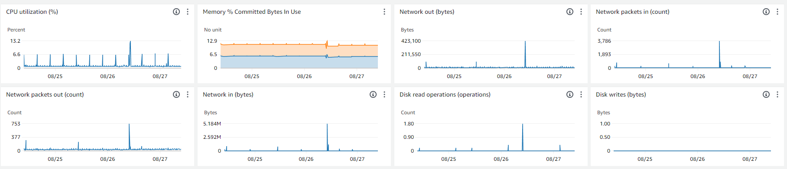

# ఇప్పటికే ఉన్న EC2 Workloads కోసం OLA

## AWS OLA ప్రోగ్రామ్

[AWS Optimization and Licensing Assessment (AWS OLA)](https://aws.amazon.com/optimization-and-licensing-assessment/) customers కు workloads cloud కు migrate చేయడానికి మరియు resources cost optimize చేయడానికి best approach provide చేస్తుంది. ఇది customers కు వారి new మరియు existing workloads analyze చేయడానికి, on-premises & cloud environments assess చేయడానికి, resource allocation optimize చేయడానికి మరియు resource efficiency enhance చేయడానికి intended complimentary program.

ఈ process లో gather చేయబడిన data ద్వారా, AWS OLA program customers వారి cloud journey & migration కోసం informed decisions తీసుకోవడానికి ఉపయోగించగల comprehensive report deliver చేస్తుంది.

AWS OLA program undergo చేయడం యొక్క Benefits:

- Tool-based discovery approach తో మీ workloads కోసం **Resources allocation Rightsize చేయడం**, ఇది compute resources లోకి insights offer చేస్తుంది మరియు ప్రతి workload కోసం best Amazon EC2, Amazon RDS లేదా VMware Cloud on AWS instance size మరియు type identify చేయడంలో help చేస్తుంది.
- మీ cloud infrastructure optimize చేయడం ద్వారా **Costs reduce చేయడం**.
- Seasonal workloads మరియు agile experimentation manage చేయడంలో flexibility కోసం **optimized licensing options explore చేయడం**.


## EEC2 Workloads కోసం AWS OLA

AWS OLA (Optimization and Licensing Assessment) existing EC2 workloads కోసం costs optimize చేయడంపై focused — '**AWS OLA for EEC2**' — **Existing EC2 Workloads** assessment.

AWS OLA for EEC2 [AWS Enterprise Support](https://aws.amazon.com/premiumsupport/plans/enterprise/) plan లో enrolled customers కోసం Amazon EC2 rightsizing recommendations provide చేయడానికి [AWS Compute Optimizer](https://aws.amazon.com/compute-optimizer/) leverage చేస్తుంది.

## AWS OLA for EEC2 assessment

Enterprise Support carry చేసే ఏ AWS customer అయినా complimentary Optimization and Licensing Assessment (OLA) for Existing EC2 workloads తో వారి existing Amazon EC2 Instances (Linux మరియు Windows) costs optimize చేయవచ్చు. మీ workloads కోసం AWS OLA for EEC2 assessment perform చేయించుకోవడానికి, దయచేసి మీ AWS account team ను contact చేయండి.

## Accurate rightsizing కోసం Amazon CloudWatch memory metrics

AWS OLA for EEC2 Amazon EC2 rightsizing కోసం assessment report offer చేస్తుండగా, [Amazon CloudWatch](https://aws.amazon.com/cloudwatch/) provide చేసే insights customers కోసం more accurate resource rightsizing కోసం memory utilization metrics incorporate చేయడం value comprehend చేస్తాయి. Amazon EC2 Instances అనేక metrics ను Amazon CloudWatch కు default గా emit చేస్తాయి. అయితే, memory metrics Amazon EC2 provide చేసే default metrics లో ఒకటి కాదు.


### Amazon EC2 Instances నుండి Memory metrics collection

[Amazon EC2 Instances](https://aws.amazon.com/ec2/) నుండి memory metrics collect చేయడానికి, high level వద్ద steps ఇక్కడ ఉన్నాయి.

- కింది permissions తో AWS Identity and Access Management (IAM) లో role create చేయండి:
  - [Amazon Systems Manager](https://aws.amazon.com/systems-manager/) Amazon EC2 instances manage చేయడానికి
  - [CloudWatch agent](https://docs.aws.amazon.com/AmazonCloudWatch/latest/monitoring/Install-CloudWatch-Agent.html) Amazon CloudWatch కు data (metrics & logs) write చేయడానికి
- Amazon EC2 Instance(s) launch చేసి earlier step లో create చేసిన IAM role assign చేయండి.
- Required EC2 instance(s) (Windows లేదా Linux) పై CloudWatch agent install చేయండి [manually](https://docs.aws.amazon.com/AmazonCloudWatch/latest/monitoring/installing-cloudwatch-agent-commandline.html) లేదా [Systems Manager Run Command](https://docs.aws.amazon.com/AmazonCloudWatch/latest/monitoring/installing-cloudwatch-agent-ssm.html) ఉపయోగించి.
- Memory metrics collect చేసి Amazon CloudWatch కు write చేయడానికి CloudWatch agent configure చేయండి.


- CloudWatch console లో collected [metrics](https://docs.aws.amazon.com/AmazonCloudWatch/latest/monitoring/viewing_metrics_with_cloudwatch.html) మరియు [logs](https://docs.aws.amazon.com/AmazonCloudWatch/latest/logs/AnalyzingLogData.html) view చేయండి.



### Scale వద్ద Amazon EC2 Instances నుండి Memory metrics collection

ఒకటి లేదా అంతకంటే ఎక్కువ Amazon EC2 Instances పై Amazon CloudWatch కు signal collection (metrics మరియు logs) కోసం CloudWatch agent install చేయడానికి మరియు configure చేయడానికి క్రింది steps follow చేయవచ్చు.

- Amazon EC2 Instance (Windows లేదా Linux) కు Remote Desktop లేదా SSH ఉపయోగించి connect అవండి.
- Metrics మరియు logs collection set up చేయడానికి CloudWatch Agent Configuration Wizard run చేయండి.
- Systems Manager Run Command ఉపయోగించి ఇతర EC2 Instances కు CloudWatch Agent configuration apply చేయండి.

### Amazon EC2 Instances నుండి Memory metrics collection Automation

Signal collection (metrics మరియు logs) ను Amazon CloudWatch కు automate, orchestrate మరియు manage at scale చేయడానికి క్రింది steps follow చేయవచ్చు. [AWS CloudFormation](https://aws.amazon.com/cloudformation/) template కింది actions perform చేయడానికి ఉపయోగించవచ్చు:

- Systems Manager automation execute runbooks చేయడానికి allow చేసే IAM execution role create చేయడం.
- CloudWatch agent Amazon CloudWatch కు data write చేయడానికి permissions తో IAM role setup చేయడం.
- Amazon EC2 Instances పై CloudWatch agent install చేయడానికి మరియు configure చేయడానికి [custom runbook](https://docs.aws.amazon.com/systems-manager/latest/userguide/automation-documents.html) build చేయడం.
- Systems manager parameter store కు CloudWatch agent configuration file upload చేయడం.

### References

- [Collect Metrics and Logs from Amazon EC2 instances with the CloudWatch Agent](https://www.youtube.com/watch?v=vAnIhIwE5hY)
- [Setup memory metrics for Amazon EC2 instances using AWS Systems Manager](https://aws.amazon.com/blogs/mt/setup-memory-metrics-for-amazon-ec2-instances-using-aws-systems-manager/)

### Appendices

[1] **Trust Policy** Amazon EC2 role assume చేయడానికి

```json
{
  "Version": "2012-10-17",
  "Statement": [
    {
      "Effect": "Allow",
      "Action": ["sts:AssumeRole"],
      "Principal": {
        "Service": ["ec2.amazonaws.com"]
      }
    }
  ]
}
```

[2] [AmazonSSMManagedInstanceCore](https://docs.aws.amazon.com/aws-managed-policy/latest/reference/AmazonSSMManagedInstanceCore.html) - AWS Systems Manager service core functionality enable చేయడానికి Amazon EC2 Role కోసం AWS Managed Policy.

```json
{
  "Version": "2012-10-17",
  "Statement": [
    {
      "Effect": "Allow",
      "Action": [
        "ssm:DescribeAssociation",
        "ssm:GetDeployablePatchSnapshotForInstance",
        "ssm:GetDocument",
        "ssm:DescribeDocument",
        "ssm:GetManifest",
        "ssm:GetParameter",
        "ssm:GetParameters",
        "ssm:ListAssociations",
        "ssm:ListInstanceAssociations",
        "ssm:PutInventory",
        "ssm:PutComplianceItems",
        "ssm:PutConfigurePackageResult",
        "ssm:UpdateAssociationStatus",
        "ssm:UpdateInstanceAssociationStatus",
        "ssm:UpdateInstanceInformation"
      ],
      "Resource": "*"
    },
    {
      "Effect": "Allow",
      "Action": [
        "ssmmessages:CreateControlChannel",
        "ssmmessages:CreateDataChannel",
        "ssmmessages:OpenControlChannel",
        "ssmmessages:OpenDataChannel"
      ],
      "Resource": "*"
    },
    {
      "Effect": "Allow",
      "Action": [
        "ec2messages:AcknowledgeMessage",
        "ec2messages:DeleteMessage",
        "ec2messages:FailMessage",
        "ec2messages:GetEndpoint",
        "ec2messages:GetMessages",
        "ec2messages:SendReply"
      ],
      "Resource": "*"
    }
  ]
}
```

[CloudWatchAgentAdminPolicy](https://docs.aws.amazon.com/aws-managed-policy/latest/reference/CloudWatchAgentAdminPolicy.html) - AmazonCloudWatchAgent ఉపయోగించడానికి full permissions తో Amazon Managed Policy

```json
{
  "Version": "2012-10-17",
  "Statement": [
    {
      "Sid": "CWACloudWatchPermissions",
      "Effect": "Allow",
      "Action": [
        "cloudwatch:PutMetricData",
        "ec2:DescribeTags",
        "logs:PutLogEvents",
        "logs:PutRetentionPolicy",
        "logs:DescribeLogStreams",
        "logs:DescribeLogGroups",
        "logs:CreateLogStream",
        "logs:CreateLogGroup",
        "xray:PutTraceSegments",
        "xray:PutTelemetryRecords",
        "xray:GetSamplingRules",
        "xray:GetSamplingTargets",
        "xray:GetSamplingStatisticSummaries"
      ],
      "Resource": "*"
    },
    {
      "Sid": "CWASSMPermissions",
      "Effect": "Allow",
      "Action": ["ssm:GetParameter", "ssm:PutParameter"],
      "Resource": "arn:aws:ssm:*:*:parameter/AmazonCloudWatch-*"
    }
  ]
}
```

[CloudWatchAgentServerPolicy](https://docs.aws.amazon.com/aws-managed-policy/latest/reference/CloudWatchAgentServerPolicy.html) - Servers పై AmazonCloudWatchAgent ఉపయోగించడానికి full permissions తో Amazon Managed Policy

```json
{
  "Version": "2012-10-17",
  "Statement": [
    {
      "Sid": "CWACloudWatchServerPermissions",
      "Effect": "Allow",
      "Action": [
        "cloudwatch:PutMetricData",
        "ec2:DescribeVolumes",
        "ec2:DescribeTags",
        "logs:PutLogEvents",
        "logs:PutRetentionPolicy",
        "logs:DescribeLogStreams",
        "logs:DescribeLogGroups",
        "logs:CreateLogStream",
        "logs:CreateLogGroup",
        "xray:PutTraceSegments",
        "xray:PutTelemetryRecords",
        "xray:GetSamplingRules",
        "xray:GetSamplingTargets",
        "xray:GetSamplingStatisticSummaries"
      ],
      "Resource": "*"
    },
    {
      "Sid": "CWASSMServerPermissions",
      "Effect": "Allow",
      "Action": ["ssm:GetParameter"],
      "Resource": "arn:aws:ssm:*:*:parameter/AmazonCloudWatch-*"
    }
  ]
}
```

[3] CloudWatch Agent install చేయడానికి మరియు configure చేయడానికి ఉపయోగించగల ఉదాహరణ custom runbook document

```
#-------------------------------------------------
# Composite document and State Manager association to install and configure the Amazon CloudWatch agent
#-------------------------------------------------
InstallAndConfigureCloudWatchAgent:
Type: AWS::SSM::Document
Properties:
    Content:
    schemaVersion: '2.2'
    description: The InstallAndManageCloudWatch command document installs the Amazon CloudWatch agent and manages the configuration of the agent for Amazon EC2 instances.
    parameters:
        action:
        description: The action CloudWatch Agent should take.
        type: String
        default: configure
        allowedValues:
        - configure
        - configure (append)
        - configure (remove)
        - start
        - status
        - stop
        mode:
        description: Controls platform-specific default behavior such as whether to include
            EC2 Metadata in metrics.
        type: String
        default: ec2
        allowedValues:
        - ec2
        - onPremise
        - auto
        optionalConfigurationSource:
        description: Only for 'configure' related actions. Use 'ssm' to apply a ssm parameter
            as config. Use 'default' to apply default config for amazon-cloudwatch-agent.
            Use 'all' with 'configure (remove)' to clean all configs for amazon-cloudwatch-agent.
        type: String
        allowedValues:
        - ssm
        - default
        - all
        default: ssm
        optionalConfigurationLocation:
        description: Only for 'configure' related actions. Only needed when Optional Configuration
            Source is set to 'ssm'. The value should be a ssm parameter name.
        type: String
        default: ''
        allowedPattern: '[a-zA-Z0-9-"~:_@./^(*)!<>?=+]*$'
        optionalRestart:
        description: Only for 'configure' related actions. If 'yes', restarts the agent
            to use the new configuration. Otherwise the new config will only apply on the
            next agent restart.
        type: String
        default: 'yes'
        allowedValues:
        - 'yes'
        - 'no'
    mainSteps:
    - inputs:
        documentParameters:
            name: AmazonCloudWatchAgent
            action: Install
        documentType: SSMDocument
        documentPath: AWS-ConfigureAWSPackage
        name: installCWAgent
        action: aws:runDocument
    - inputs:
        documentParameters:
            mode: '{{mode}}'
            optionalRestart: '{{optionalRestart}}'
            optionalConfigurationSource: '{{optionalConfigurationSource}}'
            optionalConfigurationLocation: '{{optionalConfigurationLocation}}'
            action: '{{action}}'
        documentType: SSMDocument
        documentPath: AmazonCloudWatch-ManageAgent
        name: manageCWAgent
        action: aws:runDocument
    DocumentFormat: YAML
    DocumentType: Command
    TargetType: /AWS::EC2::Instance

CloudWatchAgentAssociation:
Type: AWS::SSM::Association
Properties:
    AssociationName: InstallCloudWatchAgent
    Name: !Ref InstallAndConfigureCloudWatchAgent
    ScheduleExpression: rate(7 days)
    Targets:
    - Key: tag:Platform
    Values:
    - Linux
    WaitForSuccessTimeoutSeconds: 300
```
