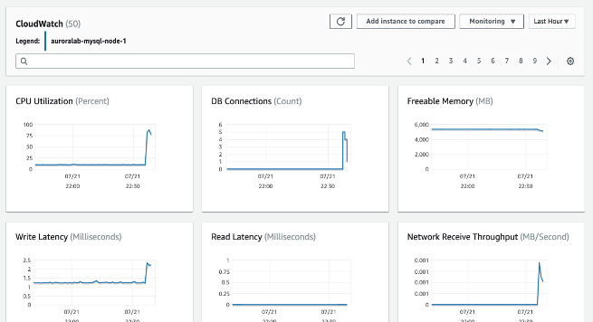
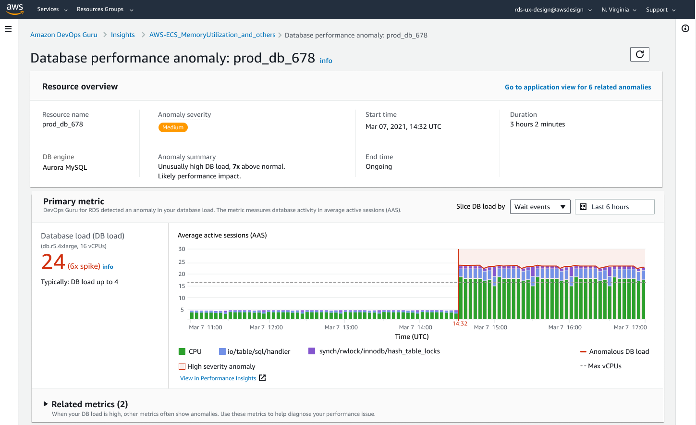
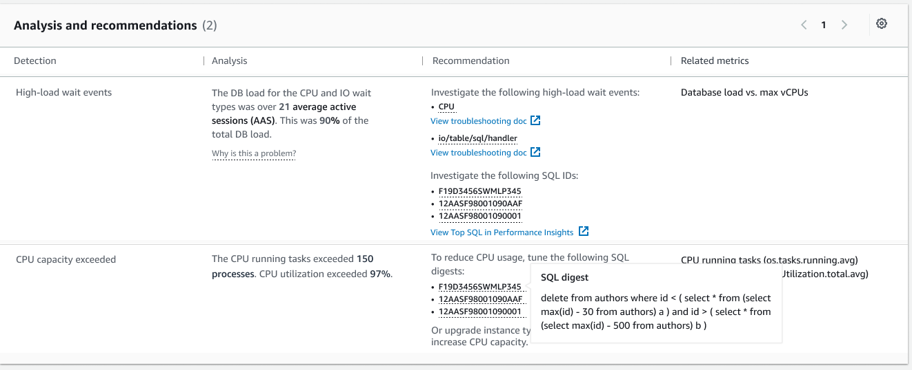

# Amazon RDS మరియు Aurora databases ను Monitor చేయడం

Amazon RDS మరియు Aurora database clusters యొక్క reliability, availability మరియు performance maintain చేయడంలో monitoring critical part. AWS మీ Amazon RDS మరియు Aurora databases resources health monitor చేయడానికి, issues critical అవడానికి ముందు detect చేయడానికి మరియు consistent user experience కోసం performance optimize చేయడానికి అనేక tools provide చేస్తుంది. ఈ guide మీ databases smoothly run అవుతున్నాయని ensure చేయడానికి observability best practices అందిస్తుంది.

## Performance guidelines

Best practice గా, మీ workloads కోసం baseline performance establish చేయడం start చేయాలనుకుంటారు. DB instance set up చేసి typical workload తో run చేసినప్పుడు, అన్ని performance metrics యొక్క average, maximum మరియు minimum values capture చేయండి. Different intervals (ఉదాహరణకు, one hour, 24 hours, one week, two weeks) లో ఇలా చేయండి.

## Monitoring Options

### Amazon CloudWatch మెట్రిక్స్

[Amazon CloudWatch](https://docs.aws.amazon.com/AmazonRDS/latest/UserGuide/monitoring-cloudwatch.html) మీ [RDS](https://aws.amazon.com/rds/) మరియు [Aurora](https://aws.amazon.com/rds/aurora/) databases monitor చేయడానికి మరియు manage చేయడానికి critical tool. RDS మరియు Aurora database ప్రతి active database instance కోసం 1 minute granularity లో CloudWatch కు metrics send చేస్తాయి. Monitor చేయవలసిన key metrics ఇక్కడ ఉన్నాయి:

* **CPU Utilization** - ఉపయోగించిన computer processing capacity percentage.
* **DB Connections** - DB instance కు connected client sessions సంఖ్య.
* **Freeable Memory** - DB instance పై ఎంత RAM available ఉందో, megabytes లో.
* **Network throughput** - Bytes per second లో DB instance కు మరియు నుండి network traffic rate.
* **Read/Write Latency** - Milliseconds లో read లేదా write operation average time.
* **Read/Write IOPS** - Per second average disk read లేదా write operations సంఖ్య.
* **Free Storage Space** - DB instance ద్వారా currently ఉపయోగించబడని disk space ఎంత, megabytes లో.



Performance related issues troubleshoot చేయడానికి, first step most used మరియు expensive queries tune చేయడం. మరింత సమాచారం కోసం, [Tuning queries](https://docs.aws.amazon.com/AmazonRDS/latest/UserGuide/CHAP_BestPractices.html#CHAP_BestPractices.TuningQueries) చూడండి.

తర్వాత, ఈ metrics critical thresholds reach అయినప్పుడు alert చేయడానికి alarms set up చేయవచ్చు.

#### CloudWatch Logs Insights

[CloudWatch Logs Insights](https://docs.aws.amazon.com/AmazonCloudWatch/latest/logs/AnalyzingLogData.html) Amazon CloudWatch Logs లో మీ log data ను interactively search చేయడం మరియు analyze చేయడం enable చేస్తుంది.

RDS లేదా Aurora database cluster నుండి CloudWatch కు logs publish చేయడానికి, [Publish logs for Amazon RDS or Aurora for MySQL instances to CloudWatch](https://repost.aws/knowledge-center/rds-aurora-mysql-logs-cloudwatch) చూడండి.

#### CloudWatch Alarms

మీ database clusters కోసం performance degraded అయినప్పుడు identify చేయడానికి, key performance metrics పై regularly monitor చేయండి మరియు alert చేయండి. [Amazon CloudWatch alarms](https://docs.aws.amazon.com/AmazonCloudWatch/latest/monitoring/AlarmThatSendsEmail.html) ఉపయోగించి, మీరు specify చేసిన time period లో single metric watch చేయవచ్చు.

CloudWatch alarm set చేయడానికి -

* AWS Management Console కు navigate చేసి Amazon RDS console ను [https://console.aws.amazon.com/rds/](https://console.aws.amazon.com/rds/) వద్ద open చేయండి.
* Navigation pane లో, Databases choose చేసి, తర్వాత DB instance choose చేయండి.
* Logs & events choose చేయండి.

CloudWatch alarms section లో, Create alarm choose చేయండి.


Multi-AZ DB cluster replica lag కోసం Amazon CloudWatch alarm create చేయడానికి ఈ [example](https://docs.aws.amazon.com/AmazonRDS/latest/UserGuide/multi-az-db-cluster-cloudwatch-alarm.html) చూడండి.

#### Database Audit Logs

Database Audit Logs మీ RDS మరియు Aurora databases పై తీసుకున్న అన్ని actions యొక్క detailed record provide చేస్తాయి. Database Audit Logs కోసం best practices:

* మీ అన్ని RDS మరియు Aurora instances కోసం Database Audit Logs enable చేయండి.
* Amazon CloudWatch Logs లేదా Amazon Kinesis Data Streams వంటి centralized log management solution ఉపయోగించండి.

Database audit logs configure చేయడం గురించి మరింత సమాచారం కోసం, [Configuring an Audit Log to Capture database activities for Amazon RDS and Aurora](https://aws.amazon.com/blogs/database/configuring-an-audit-log-to-capture-database-activities-for-amazon-rds-for-mysql-and-amazon-aurora-with-mysql-compatibility/) చూడండి.

#### Database Slow Query మరియు Error Logs

Slow query logs database లో slow-performing queries find చేయడానికి help చేస్తాయి. Error logs query errors find చేయడానికి help చేస్తాయి.

## Performance Insights మరియు operating-system metrics

#### Enhanced Monitoring

[Enhanced Monitoring](https://docs.aws.amazon.com/AmazonRDS/latest/UserGuide/USER_Monitoring.OS.html) మీ DB instance run అయ్యే operating system (OS) కోసం fine-grain metrics real time లో get చేయడం enable చేస్తుంది.


#### Performance Insights

[Amazon RDS Performance Insights](https://aws.amazon.com/rds/performance-insights/) మీ database పై load quickly assess చేయడంలో help చేసే database performance tuning మరియు monitoring feature. Performance Insights dashboard తో, మీ db cluster పై database load visualize చేయవచ్చు మరియు waits, SQL statements, hosts లేదా users ద్వారా load filter చేయవచ్చు.

**DBLoad** అనేది key metric, ఇది database active sessions average number ను represent చేస్తుంది.


## Open-source Observability Tools

#### Amazon Managed Grafana

[Amazon Managed Grafana](https://aws.amazon.com/grafana/) RDS మరియు Aurora databases నుండి data visualize చేయడం మరియు analyze చేయడం easy చేసే fully managed service.


RDS Performance Insight metrics ను Amazon Managed Grafana లో visualize చేయడానికి, customers custom lambda function ఉపయోగించవచ్చు. Custom lambda function deploy చేయడానికి, కింది GitHub repository clone చేసి install.sh script run చేయండి.

```
$ git clone https://github.com/aws-observability/observability-best-practices.git
$ cd sandbox/monitor-aurora-with-grafana

$ chmod +x install.sh
$ ./install.sh
```


<!-- blank line -->
<figure class="video_container">
  <iframe width="560" height="315" src="https://www.youtube.com/embed/Uj9UJ1mXwEA" title="YouTube video player" frameborder="0" allow="accelerometer; autoplay; clipboard-write; encrypted-media; gyroscope; picture-in-picture; web-share" allowfullscreen></iframe>
</figure>
<!-- blank line -->

## AIOps - Machine learning ఆధారిత performance bottlenecks detection

#### Amazon DevOps Guru for RDS

[Amazon DevOps Guru for RDS](https://aws.amazon.com/devops-guru/features/devops-guru-for-rds/) తో, performance bottlenecks మరియు operational issues కోసం మీ databases monitor చేయవచ్చు. ఇది Performance Insights metrics ఉపయోగిస్తుంది, Machine Learning (ML) ఉపయోగించి analyze చేస్తుంది మరియు corrective actions recommend చేస్తుంది.





<!-- blank line -->
<figure class="video_container">
  <iframe width="560" height="315" src="https://www.youtube.com/embed/N3NNYgzYUDA" title="YouTube video player" frameborder="0" allow="accelerometer; autoplay; clipboard-write; encrypted-media; gyroscope; picture-in-picture; web-share" allowfullscreen></iframe>
</figure>
<!-- blank line -->

## Auditing మరియు Governance

#### AWS CloudTrail Logs

[AWS CloudTrail](https://docs.aws.amazon.com/awscloudtrail/latest/userguide/cloudtrail-user-guide.html) RDS లో user, role, లేదా AWS service తీసుకున్న actions record provide చేస్తుంది.

## మరింత సమాచారం కోసం References

[Blog - Monitor RDS and Aurora databases with Amazon Managed Grafana](https://aws.amazon.com/blogs/mt/monitoring-amazon-rds-and-amazon-aurora-using-amazon-managed-grafana/)

[Video - Monitor RDS and Aurora databases with Amazon Managed Grafana](https://www.youtube.com/watch?v=Uj9UJ1mXwEA)

[Blog - Monitor RDS and Aurora databases with Amazon CloudWatch](https://aws.amazon.com/blogs/database/creating-an-amazon-cloudwatch-dashboard-to-monitor-amazon-rds-and-amazon-aurora-mysql/)

[Blog - Build proactive database monitoring for Amazon RDS with Amazon CloudWatch Logs, AWS Lambda, and Amazon SNS](https://aws.amazon.com/blogs/database/build-proactive-database-monitoring-for-amazon-rds-with-amazon-cloudwatch-logs-aws-lambda-and-amazon-sns/)

[Official Doc - Amazon Aurora Monitoring Guide](https://docs.aws.amazon.com/AmazonRDS/latest/AuroraUserGuide/MonitoringOverview.html)

[Hands-on Workshop - Observe and Identify SQL Performance Issues in Amazon Aurora](https://catalog.workshops.aws/awsauroramysql/en-US/provisioned/perfobserve)
