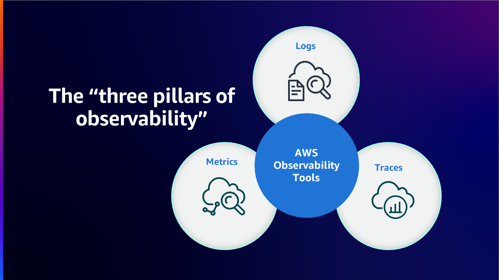
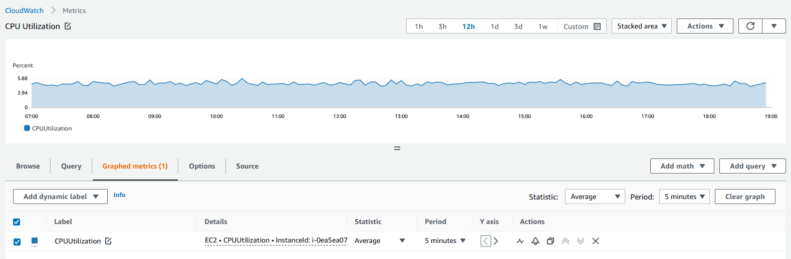
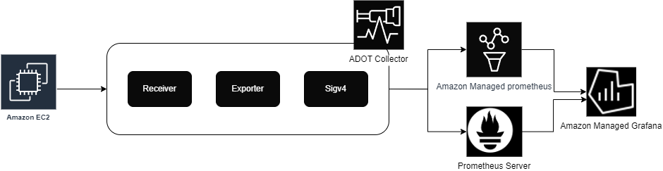
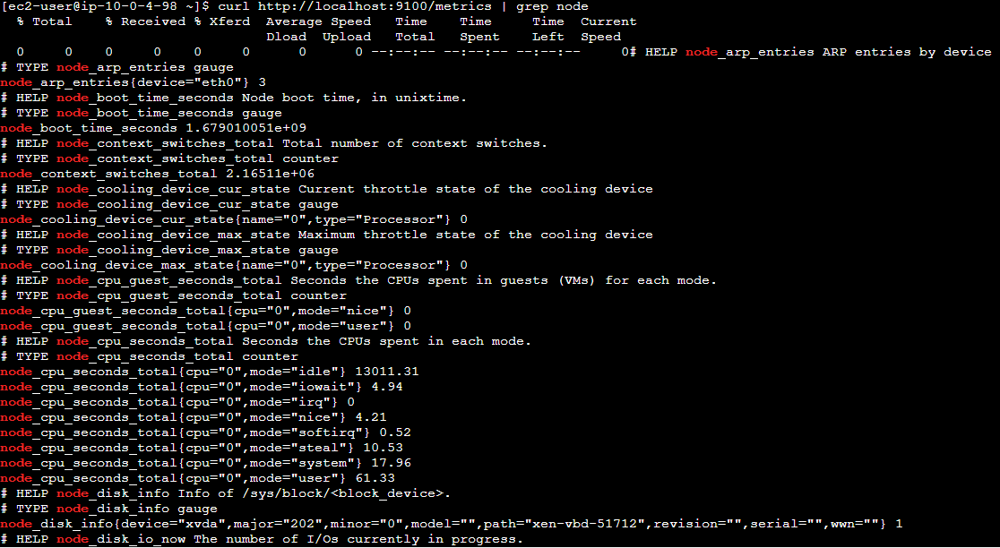

# EC2 Monitoring మరియు Observability

## పరిచయం

నిరంతర Monitoring & Observability చురుకుదనాన్ని పెంచుతుంది, customer అనుభవాన్ని మెరుగుపరుస్తుంది మరియు cloud environment యొక్క risk ను తగ్గిస్తుంది. Wikipedia ప్రకారం, [Observability](https://en.wikipedia.org/wiki/Observability) అనేది system యొక్క external outputs జ్ఞానం నుండి internal states ఎంత బాగా అనుమానించవచ్చో అనే కొలత. Observability అనే పదం control theory రంగం నుండి వచ్చింది, ఇక్కడ ఇది ప్రాథమికంగా system లోని components యొక్క internal state ను అది produce చేస్తున్న external signals/outputs గురించి తెలుసుకోవడం ద్వారా అనుమానించగలరని అర్థం.

Monitoring మరియు Observability మధ్య తేడా ఏమిటంటే Monitoring system పని చేస్తుందో లేదో చెబుతుంది, Observability system ఎందుకు పని చేయడం లేదో చెబుతుంది. Monitoring సాధారణంగా reactive measure అయితే Observability యొక్క లక్ష్యం మీ Key Performance Indicators ను proactive పద్ధతిలో మెరుగుపరచగలగడం. System observe చేయకపోతే దానిని control లేదా optimize చేయలేము. Metrics, logs, లేదా traces సేకరణ ద్వారా workloads ను instrument చేయడం మరియు సరైన monitoring మరియు observability tools ఉపయోగించి అర్థవంతమైన insights & వివరమైన context పొందడం customers కు environment ను control చేసి optimize చేయడంలో సహాయపడతాయి.

AWS customers ను monitoring నుండి observability కు transform కావడానికి సాధ్యం చేస్తుంది, తద్వారా వారు పూర్తి end-to-end service visibility కలిగి ఉంటారు. ఈ article లో మేము Amazon Elastic Compute Cloud (Amazon EC2) మరియు AWS Cloud environment లో AWS native మరియు open-source tools ద్వారా service యొక్క monitoring మరియు observability మెరుగుపరచడానికి best practices పై focus చేస్తాము.

## Amazon EC2

[Amazon Elastic Compute Cloud](https://aws.amazon.com/ec2/) (Amazon EC2) అనేది Amazon Web Services (AWS) Cloud లో అత్యంత scalable compute platform. Amazon EC2 ముందస్తు hardware investment అవసరాన్ని తొలగిస్తుంది, తద్వారా customers applications ను వేగంగా develop మరియు deploy చేయగలరు, వారు ఉపయోగించిన దానికి మాత్రమే pay చేస్తారు. EC2 అందించే కొన్ని ముఖ్యమైన features లో Instances అని పిలవబడే virtual computing environments, Instances యొక్క pre-configured templates అయిన Amazon Machine Images, Instance Types గా అందుబాటులో ఉన్న CPU, Memory, Storage మరియు Networking capacity వంటి resources యొక్క వివిధ configurations ఉన్నాయి.

## AWS Native Tools ఉపయోగించి Monitoring మరియు Observability

### Amazon CloudWatch

[Amazon CloudWatch](https://aws.amazon.com/cloudwatch/) అనేది AWS, hybrid, మరియు on-premises applications మరియు infrastructure resources కోసం data మరియు actionable insights అందించే monitoring మరియు management service. CloudWatch logs, metrics, మరియు events రూపంలో monitoring మరియు operational data ను సేకరిస్తుంది. ఇది AWS resources, applications, మరియు AWS మరియు on-premises servers లో run అయ్యే services యొక్క unified view కూడా అందిస్తుంది. CloudWatch resource utilization, application performance, మరియు operational health లోకి system-wide visibility పొందడంలో మీకు సహాయపడుతుంది.

### Unified CloudWatch Agent

Unified CloudWatch Agent అనేది MIT license కింద open-source software, ఇది x86-64 మరియు ARM64 architectures ఉపయోగించే చాలా operating systems కు support చేస్తుంది. CloudWatch Agent Amazon EC2 Instances & hybrid environment లోని on-premise servers నుండి system-level metrics సేకరించడానికి, applications లేదా services నుండి custom metrics retrieve చేయడానికి మరియు Amazon EC2 instances మరియు on-premises servers నుండి logs సేకరించడానికి సహాయపడుతుంది.

### Amazon EC2 Instances లో CloudWatch Agent Install చేయడం

#### Command Line Install

CloudWatch Agent ను [command line](https://docs.aws.amazon.com/AmazonCloudWatch/latest/monitoring/installing-cloudwatch-agent-commandline.html) ద్వారా install చేయవచ్చు. వివిధ architectures మరియు operating systems కోసం అవసరమైన package [download](https://docs.aws.amazon.com/AmazonCloudWatch/latest/monitoring/download-cloudwatch-agent-commandline.html) కోసం అందుబాటులో ఉంది. CloudWatch agent Amazon EC2 instance నుండి information read చేసి CloudWatch కు write చేయడానికి permissions అందించే అవసరమైన [IAM role](https://docs.aws.amazon.com/AmazonCloudWatch/latest/monitoring/create-iam-roles-for-cloudwatch-agent-commandline.html) create చేయండి. అవసరమైన IAM role create చేసిన తర్వాత, మీరు అవసరమైన Amazon EC2 Instance లో CloudWatch agent ను [install మరియు run](https://docs.aws.amazon.com/AmazonCloudWatch/latest/monitoring/install-CloudWatch-Agent-commandline-fleet.html) చేయవచ్చు.

:::info
    Documentation: [Command line ఉపయోగించి CloudWatch agent install చేయడం](https://docs.aws.amazon.com/AmazonCloudWatch/latest/monitoring/installing-cloudwatch-agent-commandline.html)

    AWS Observability Workshop: [CloudWatch agent సెటప్ మరియు install చేయడం](https://catalog.workshops.aws/observability/en-US/aws-native/ec2-monitoring/install-ec2)
:::

#### AWS Systems Manager ద్వారా Installation

CloudWatch Agent ను [AWS Systems Manager](https://docs.aws.amazon.com/AmazonCloudWatch/latest/monitoring/installing-cloudwatch-agent-ssm.html) ద్వారా కూడా install చేయవచ్చు. CloudWatch agent Amazon EC2 instance నుండి information read చేసి CloudWatch కు write చేయడానికి & AWS Systems Manager తో communicate చేయడానికి permissions అందించే అవసరమైన IAM role create చేయండి. EC2 instances లో CloudWatch agent install చేయడానికి ముందు, అవసరమైన EC2 instances లో SSM agent ను [install లేదా update](https://docs.aws.amazon.com/AmazonCloudWatch/latest/monitoring/download-CloudWatch-Agent-on-EC2-Instance-SSM-first.html#update-SSM-Agent-EC2instance-first) చేయండి. CloudWatch agent ను AWS Systems Manager ద్వారా download చేయవచ్చు. ఏ metrics (custom metrics తో సహా), logs సేకరించాలో specify చేయడానికి JSON Configuration file create చేయవచ్చు. అవసరమైన IAM role create చేసి & configuration file create చేసిన తర్వాత, మీరు అవసరమైన Amazon EC2 Instances లో CloudWatch agent ను install మరియు run చేయవచ్చు.

:::info
    Documentation: [AWS Systems Manager ఉపయోగించి CloudWatch agent install చేయడం](https://docs.aws.amazon.com/AmazonCloudWatch/latest/monitoring/installing-cloudwatch-agent-ssm.html)

    AWS Observability Workshop: [AWS Systems Manager Quick Setup ఉపయోగించి CloudWatch agent install చేయడం](https://catalog.workshops.aws/observability/en-US/aws-native/ec2-monitoring/install-ec2/ssm-quicksetup)

    సంబంధిత Blog Article: [Amazon CloudWatch Agent with AWS Systems Manager Integration – Unified Metrics & Log Collection for Linux & Windows](https://aws.amazon.com/blogs/aws/new-amazon-cloudwatch-agent-with-aws-systems-manager-integration-unified-metrics-log-collection-for-linux-windows/)

    YouTube Video: [Collect Metrics and Logs from Amazon EC2 instances with the CloudWatch Agent](https://www.youtube.com/watch?v=vAnIhIwE5hY)
:::

#### Hybrid environment లో on-premise servers లో CloudWatch Agent Install చేయడం

Hybrid customer environments లో, servers on-premises లో అలాగే cloud లో ఉంటాయి. Amazon CloudWatch లో unified observability సాధించడానికి ఇదే విధమైన approach తీసుకోవచ్చు. CloudWatch agent ను Amazon S3 నుండి నేరుగా download చేయవచ్చు లేదా AWS Systems Manager ద్వారా download చేయవచ్చు. On-premise server Amazon CloudWatch కు data పంపడానికి IAM User create చేయండి. On-premise servers లో Agent ను Install మరియు Start చేయండి.

:::note
    Documentation: [On-premises servers లో CloudWatch agent install చేయడం](https://docs.aws.amazon.com/AmazonCloudWatch/latest/monitoring/install-CloudWatch-Agent-on-premise.html)
:::

### Amazon CloudWatch ఉపయోగించి Amazon EC2 Instances Monitoring

మీ Amazon EC2 Instances మరియు మీ applications యొక్క reliability, availability, మరియు performance నిర్వహించడంలో ముఖ్యమైన అంశం [నిరంతర monitoring](https://catalog.workshops.aws/observability/en-US/aws-native/ec2-monitoring). అవసరమైన Amazon EC2 instances లో CloudWatch Agent install చేసిన తర్వాత, స్థిరమైన environment నిర్వహించడానికి instances యొక్క health మరియు performance ను monitor చేయడం అవసరం. Baseline గా, CPU utilization, Network utilization, Disk performance, Disk Reads/Writes, Memory utilization, disk swap utilization, disk space utilization, page file utilization, మరియు EC2 Instances యొక్క log collection వంటి items recommend చేయబడతాయి.

#### Basic & Detailed Monitoring

Amazon CloudWatch Amazon EC2 నుండి raw data ను సేకరించి readable near real-time metrics గా process చేస్తుంది. Default గా, Amazon EC2 instance కోసం 5-minute periods లో metric data ను CloudWatch కు Basic Monitoring గా పంపుతుంది. మీ instance కోసం 1-minute periods లో metric data CloudWatch కు పంపడానికి, instance లో [detailed monitoring](https://docs.aws.amazon.com/AWSEC2/latest/UserGuide/using-cloudwatch-new.html) enable చేయవచ్చు.

#### Automated & Manual Tools for Monitoring

AWS customers కు వారి Amazon EC2 ను monitor చేసి ఏదైనా తప్పు జరిగినప్పుడు report చేయడంలో సహాయపడే రెండు రకాల tools అందిస్తుంది, automated మరియు manual. ఈ tools లో కొన్ని కొద్దిగా configuration అవసరం మరియు కొన్ని manual intervention అవసరం.
[Automated Monitoring tools](https://docs.aws.amazon.com/AWSEC2/latest/UserGuide/monitoring_automated_manual.html#monitoring_automated_tools) లో AWS System status checks, Instance status checks, Amazon CloudWatch alarms, Amazon EventBridge, Amazon CloudWatch Logs, CloudWatch agent, AWS Management Pack for Microsoft System Center Operations Manager ఉన్నాయి. [Manual monitoring](https://docs.aws.amazon.com/AWSEC2/latest/UserGuide/monitoring_automated_manual.html#monitoring_manual_tools) tools లో Dashboards ఉన్నాయి, వీటిని ఈ article లో కింద ప్రత్యేక section లో వివరంగా చూస్తాము.

:::note
    Documentation: [Automated మరియు manual monitoring](https://docs.aws.amazon.com/AWSEC2/latest/UserGuide/monitoring_automated_manual.html)
:::
### CloudWatch Agent ఉపయోగించి Amazon EC2 Instances నుండి Metrics

Metrics అనేది CloudWatch లో ప్రాథమిక concept. Metric అనేది CloudWatch కు publish చేయబడిన time-ordered data points set ను represent చేస్తుంది. Metric ను monitor చేయవలసిన variable గా, data points ను కాలక్రమంలో ఆ variable విలువలను represent చేస్తున్నట్లు ఆలోచించండి. ఉదాహరణకు, ఒక నిర్దిష్ట EC2 instance యొక్క CPU usage Amazon EC2 అందించే ఒక metric.

#### CloudWatch Agent ఉపయోగించి Default Metrics

Amazon CloudWatch Amazon EC2 instance నుండి metrics సేకరిస్తుంది, వీటిని AWS Management Console, AWS CLI, లేదా API ద్వారా చూడవచ్చు. అందుబాటులో ఉన్న metrics Basic Monitoring ద్వారా 5 minute interval లేదా detailed monitoring (turn on చేస్తే) 1 minute interval లో cover చేయబడిన data points.

#### CloudWatch Agent ఉపయోగించి Custom Metrics

Customers API లేదా CLI ఉపయోగించి 1 minute granularity యొక్క standard resolution లేదా 1 sec interval వరకు high resolution granularity ద్వారా తమ custom metrics ను CloudWatch కు publish చేయవచ్చు. Unified CloudWatch agent [StatsD](https://docs.aws.amazon.com/AmazonCloudWatch/latest/monitoring/CloudWatch-Agent-custom-metrics-statsd.html) మరియు [collectd](https://docs.aws.amazon.com/AmazonCloudWatch/latest/monitoring/CloudWatch-Agent-custom-metrics-collectd.html) ద్వారా custom metrics retrieval కు support చేస్తుంది.

Applications లేదా services నుండి custom metrics ను StatsD protocol తో CloudWatch agent ఉపయోగించి retrieve చేయవచ్చు. StatsD అనేది విస్తృత శ్రేణి applications నుండి metrics gather చేయగల ఒక ప్రసిద్ధ open-source solution. StatsD ముఖ్యంగా మీ స్వంత metrics instrument చేయడానికి ఉపయోగకరం, ఇది Linux మరియు Windows based servers రెండింటికీ support చేస్తుంది.

Applications లేదా services నుండి custom metrics ను collectd protocol తో CloudWatch agent ఉపయోగించి కూడా retrieve చేయవచ్చు, ఇది Linux Servers లో మాత్రమే support చేయబడే ఒక ప్రసిద్ధ open-source solution, విస్తృత శ్రేణి applications కోసం system statistics gather చేయగల plugins కలిగి ఉంటుంది. CloudWatch agent ఇప్పటికే సేకరించగల system metrics తో collectd నుండి అదనపు metrics కలపడం ద్వారా, మీరు మీ systems మరియు applications ను మెరుగ్గా monitor, analyze, మరియు troubleshoot చేయవచ్చు.

#### CloudWatch Agent ఉపయోగించి అదనపు Custom Metrics

CloudWatch agent మీ EC2 instances నుండి custom metrics సేకరించడానికి support చేస్తుంది. కొన్ని ప్రసిద్ధ ఉదాహరణలు:

- Elastic Network Adapter (ENA) ఉపయోగించే Linux లో run అయ్యే EC2 instances కోసం Network performance metrics.
- Linux servers నుండి Nvidia GPU metrics.
- Linux & Windows servers లో individual processes నుండి procstat plugin ఉపయోగించి Process metrics.

### CloudWatch Agent ఉపయోగించి Amazon EC2 Instances నుండి Logs

Amazon CloudWatch Logs customers కు ఇప్పటికే ఉన్న system, application మరియు custom log files ఉపయోగించి near real time లో systems మరియు applications ను monitor చేసి troubleshoot చేయడంలో సహాయపడుతుంది. Amazon EC2 Instances మరియు on-premise servers నుండి CloudWatch కు logs సేకరించడానికి, unified CloudWatch Agent install చేయాలి. తాజా unified CloudWatch Agent recommend చేయబడుతుంది, ఎందుకంటే ఇది logs మరియు advanced metrics రెండింటినీ సేకరించగలదు. ఇది వివిధ operating systems కు కూడా support చేస్తుంది. Instance Instance Metadata Service Version 2 (IMDSv2) ఉపయోగిస్తే unified agent అవసరం.

Unified CloudWatch agent సేకరించిన logs Amazon CloudWatch Logs లో process మరియు store చేయబడతాయి. Windows లేదా Linux Servers నుండి మరియు Amazon EC2 మరియు on-premise servers రెండింటి నుండి logs సేకరించవచ్చు. CloudWatch agent configuration wizard CloudWatch agent setup define చేసే config JSON file సెటప్ చేయడానికి ఉపయోగించవచ్చు.

:::note
    AWS Observability Workshop: [Logs](https://catalog.workshops.aws/observability/en-US/aws-native/logs)
:::

### Amazon EC2 Instance Events

Event అనేది మీ AWS environment లో మార్పును సూచిస్తుంది. AWS resources మరియు applications వాటి state మారినప్పుడు events generate చేయగలవు. CloudWatch Events మీ AWS resources మరియు applications కు జరిగే మార్పులను వివరించే system events యొక్క near real-time stream అందిస్తుంది. ఉదాహరణకు, EC2 instance state pending నుండి running కు మారినప్పుడు Amazon EC2 ఒక event generate చేస్తుంది. Customers custom application-level events కూడా generate చేసి CloudWatch Events కు publish చేయవచ్చు.

Customers status checks మరియు scheduled events చూడటం ద్వారా [Amazon EC2 Instances status ను monitor](https://docs.aws.amazon.com/AWSEC2/latest/UserGuide/monitoring-instances-status-check.html) చేయవచ్చు. Status check Amazon EC2 చేసిన automated checks ఫలితాలను అందిస్తుంది. ఈ automated checks instances ను ప్రభావితం చేస్తున్న నిర్దిష్ట సమస్యలను detect చేస్తాయి. Status check information, Amazon CloudWatch అందించిన data తో కలిపి, ప్రతి instance లోకి వివరమైన operational visibility అందిస్తుంది.

#### Amazon EC2 Instance Events కోసం Amazon EventBridge Rule

Amazon CloudWatch Events resource changes లేదా issues వంటి actions కోసం system events కు స్వయంచాలకంగా respond అవ్వడానికి Amazon EventBridge ఉపయోగించవచ్చు. Amazon EC2 తో సహా AWS services నుండి events near real time లో CloudWatch Events కు deliver చేయబడతాయి మరియు event rule కు match అయినప్పుడు తగిన actions తీసుకోవడానికి customers EventBridge rules create చేయవచ్చు.
Actions: AWS Lambda function Invoke చేయడం, Amazon EC2 Run Command Invoke చేయడం, event ను Amazon Kinesis Data Streams కు Relay చేయడం, AWS Step Functions state machine Activate చేయడం, Amazon SNS topic కు Notify చేయడం, Amazon SQS queue కు Notify చేయడం, internal లేదా external incident response application లేదా SIEM tool కు piping చేయడం.

:::note
    AWS Observability Workshop: [Incident Response - EventBridge Rule](https://catalog.workshops.aws/observability/en-US/aws-native/ec2-monitoring/incident-response/create-eventbridge-rule)
:::

#### Amazon EC2 Instances కోసం Amazon CloudWatch Alarms

Amazon [CloudWatch alarms](https://docs.aws.amazon.com/AmazonCloudWatch/latest/monitoring/AlarmThatSendsEmail.html) మీరు specify చేసిన time period పై metric ను watch చేయగలవు, మరియు time periods సంఖ్యలో ఇచ్చిన threshold కు సంబంధించి metric విలువ ఆధారంగా ఒకటి లేదా అంతకంటే ఎక్కువ actions perform చేయగలవు. Alarm state మారినప్పుడు మాత్రమే actions invoke చేస్తుంది. Action Amazon Simple Notification Service (Amazon SNS) topic లేదా Amazon EC2 Auto Scaling కు notification పంపడం లేదా [EC2 instance stop, terminate, reboot, లేదా recover](https://docs.aws.amazon.com/AmazonCloudWatch/latest/monitoring/UsingAlarmActions.html) చేయడం వంటి ఇతర తగిన actions కావచ్చు.

Alarm trigger అయిన తర్వాత action గా SNS Topic కు Email notification పంపబడుతుంది.

#### Auto Scaling Instances కోసం Monitoring

Amazon EC2 Auto Scaling మీ application load handle చేయడానికి సరైన సంఖ్యలో Amazon EC2 instances అందుబాటులో ఉండేలా customers కు సహాయపడుతుంది. [Amazon EC2 Auto Scaling metrics](https://docs.aws.amazon.com/autoscaling/ec2/userguide/ec2-auto-scaling-cloudwatch-monitoring.html) Auto Scaling groups గురించి సమాచారం సేకరిస్తాయి మరియు AWS/AutoScaling namespace లో ఉంటాయి. Auto Scaling instances నుండి CPU మరియు ఇతర usage data represent చేసే Amazon EC2 instance metrics AWS/EC2 namespace లో ఉంటాయి.

### CloudWatch లో Dashboarding

AWS accounts లో resources యొక్క inventory details, resources performance మరియు health checks తెలుసుకోవడం స్థిరమైన resource management కు ముఖ్యం. [Amazon CloudWatch dashboards](https://docs.aws.amazon.com/AmazonCloudWatch/latest/monitoring/CloudWatch_Dashboards.html) CloudWatch console లో customizable home pages, వీటిని మీ resources ను ఒకే view లో monitor చేయడానికి ఉపయోగించవచ్చు, వేరే Regions లో విస్తరించిన resources తో సహా. Amazon EC2 Instances యొక్క మంచి view మరియు details పొందడానికి మార్గాలు ఉన్నాయి.

#### CloudWatch లో Automatic Dashboards

Automatic Dashboards అన్ని AWS public regions లో అందుబాటులో ఉన్నాయి, CloudWatch కింద Amazon EC2 instances తో సహా అన్ని AWS resources యొక్క health మరియు performance యొక్క aggregated view అందిస్తాయి. ఇది customers కు monitoring తో త్వరగా start కావడంలో, resource-based view of metrics మరియు alarms చూడటంలో, మరియు performance issues యొక్క root cause అర్థం చేసుకోవడానికి సులభంగా drill-down చేయడంలో సహాయపడుతుంది. Automatic Dashboards AWS service recommend చేసిన [best practices](https://docs.aws.amazon.com/prescriptive-guidance/latest/implementing-logging-monitoring-cloudwatch/cloudwatch-dashboards-visualizations.html) తో pre-built, resource aware గా ఉంటాయి, మరియు ముఖ్యమైన performance metrics యొక్క తాజా state reflect చేయడానికి dynamically update అవుతాయి.

#### CloudWatch లో Custom Dashboards

[Custom Dashboards](https://docs.aws.amazon.com/AmazonCloudWatch/latest/monitoring/create_dashboard.html) తో Customers వారికి కావలసినన్ని అదనపు dashboards వివిధ widgets తో create చేసి దానికి తగినట్లు customize చేయవచ్చు. Dashboards cross-region మరియు cross account view కోసం configure చేయవచ్చు మరియు favorites list కు add చేయవచ్చు.

#### CloudWatch లో Resource Health Dashboards

CloudWatch ServiceLens లోని Resource Health అనేది fully managed solution, ఇది customers కు వారి applications అంతటా [Amazon EC2 hosts యొక్క health మరియు performance](https://aws.amazon.com/blogs/mt/introducing-cloudwatch-resource-health-monitor-ec2-hosts/) స్వయంచాలకంగా discover, manage, మరియు visualize చేయడానికి ఉపయోగించవచ్చు. Customers CPU లేదా memory వంటి performance dimension ద్వారా వారి hosts health visualize చేయవచ్చు, మరియు instance type, instance state, లేదా security groups వంటి filters ఉపయోగించి ఒకే view లో వందల hosts ను slice మరియు dice చేయవచ్చు. ఇది EC2 hosts group యొక్క side-by-side comparison సాధ్యం చేస్తుంది మరియు వ్యక్తిగత host లోకి granular insights అందిస్తుంది.

## Open Source Tools ఉపయోగించి Monitoring మరియు Observability

### AWS Distro for OpenTelemetry ఉపయోగించి Amazon EC2 Instances Monitoring

[AWS Distro for OpenTelemetry (ADOT)](https://aws.amazon.com/otel) అనేది OpenTelemetry project యొక్క secure, production-ready, AWS-supported distribution. Cloud Native Computing Foundation లో భాగమైన OpenTelemetry application monitoring కోసం distributed traces మరియు metrics సేకరించడానికి open source APIs, libraries, మరియు agents అందిస్తుంది. AWS Distro for OpenTelemetry తో, customers applications ను ఒక్కసారి instrument చేసి correlated metrics మరియు traces ను బహుళ AWS మరియు Partner monitoring solutions కు పంపవచ్చు.

AWS Distro for OpenTelemetry (ADOT) application performance మరియు health monitoring కోసం data correlate చేయడం సాధ్యం చేసే distributed monitoring framework అందిస్తుంది, ఇది మెరుగైన service visibility మరియు maintenance కు critical.

ADOT యొక్క ముఖ్య components SDKs, auto-instrumentation agents, collectors మరియు back-end services కు data పంపడానికి exporters.

[OpenTelemetry SDK](https://github.com/aws-observability): AWS resource-specific metadata సేకరణ enable చేయడానికి, X-Ray trace format మరియు context కోసం OpenTelemetry SDKs కు support. OpenTelemetry SDKs ఇప్పుడు AWS X-Ray మరియు CloudWatch నుండి ingested trace మరియు metrics data correlate చేస్తాయి.

[Auto-instrumentation agent](https://aws-otel.github.io/docs/getting-started/java-sdk/auto-instr): AWS SDK మరియు AWS X-Ray trace data కోసం OpenTelemetry Java auto-instrumentation agent లో support add చేయబడింది.

[OpenTelemetry Collector](https://github.com/open-telemetry/opentelemetry-collector): Distribution లోని collector upstream OpenTelemetry collector ఉపయోగించి build చేయబడింది. AWS X-Ray, Amazon CloudWatch మరియు Amazon Managed Service for Prometheus తో సహా AWS services కు data పంపడానికి upstream collector కు AWS-specific exporters add చేయబడ్డాయి.

#### ADOT Collector & Amazon CloudWatch ద్వారా Metrics & Traces

AWS Distro for OpenTelemetry (ADOT) Collector CloudWatch agent తో కలిసి Amazon EC2 Instance లో side-by-side install చేయవచ్చు మరియు Amazon EC2 Instances లో run అయ్యే మీ workloads నుండి application traces & metrics సేకరించడానికి OpenTelemetry SDKs ఉపయోగించవచ్చు.

Amazon CloudWatch లో OpenTelemetry metrics కు support చేయడానికి, [AWS EMF Exporter for OpenTelemetry Collector](https://github.com/open-telemetry/opentelemetry-collector-contrib/tree/main/exporter/awsemfexporter) OpenTelemetry format metrics ను CloudWatch Embedded Metric Format(EMF) కు convert చేస్తుంది, ఇది OpenTelemetry metrics లో integrate అయిన applications high-cardinality application metrics ను CloudWatch కు పంపగలిగేలా సాధ్యం చేస్తుంది. [The X-Ray exporter](https://aws-otel.github.io/docs/getting-started/x-ray#configuring-the-aws-x-ray-exporter) OTLP format లో సేకరించిన traces ను [AWS X-ray](https://aws.amazon.com/xray/) కు export చేయడం అనుమతిస్తుంది.

Amazon EC2 లో ADOT Collector ను AWS CloudFormation ద్వారా లేదా application metrics సేకరించడానికి [AWS Systems Manager Distributor](https://catalog.workshops.aws/observability/en-US/aws-managed-oss/ec2-monitoring/configure-adot-collector) ఉపయోగించి install చేయవచ్చు.

### Prometheus ఉపయోగించి Amazon EC2 Instances Monitoring

[Prometheus](https://prometheus.io/) అనేది systems monitoring మరియు alerting కోసం standalone open-source project మరియు స్వతంత్రంగా maintain చేయబడుతుంది. Prometheus metrics ను time series data గా సేకరించి store చేస్తుంది, అంటే metrics information record చేయబడిన timestamp తో, labels అని పిలవబడే optional key-value pairs తో కలిసి store చేయబడుతుంది.

Prometheus command line flags ద్వారా configure చేయబడుతుంది మరియు అన్ని configuration details prometheus.yaml file లో maintain చేయబడతాయి. Configuration file లోని 'scrape_config' section targets మరియు వాటిని ఎలా scrape చేయాలనే parameters specify చేస్తుంది. [Prometheus Service Discovery](https://github.com/prometheus/prometheus/tree/main/discovery) (SD) అనేది metrics కోసం scrape చేయవలసిన endpoints కనుగొనే methodology. AWS EC2 instances నుండి scrape targets retrieve చేయడానికి Amazon EC2 service discovery configurations `ec2_sd_config` లో configure చేయబడతాయి.

#### Prometheus & Amazon CloudWatch ద్వారా Metrics

EC2 instances లో CloudWatch agent ను Prometheus తో install & configure చేసి CloudWatch లో monitoring కోసం metrics scrape చేయవచ్చు. EC2 లో container workloads prefer చేసి open source Prometheus monitoring తో compatible custom metrics అవసరమయ్యే customers కు ఇది సహాయకరం. CloudWatch Agent installation పై మునుపటి section లో వివరించిన steps అనుసరించి చేయవచ్చు. Prometheus monitoring తో CloudWatch agent కు Prometheus metrics scrape చేయడానికి రెండు configurations అవసరం. ఒకటి Prometheus documentation లో 'scrape_config' లో documented చేయబడిన standard Prometheus configurations కోసం. రెండవది [CloudWatch agent configuration](https://docs.aws.amazon.com/AmazonCloudWatch/latest/monitoring/CloudWatch-Agent-PrometheusEC2.html#CloudWatch-Agent-PrometheusEC2-configure) కోసం.

#### Prometheus & ADOT Collector ద్వారా Metrics

Customers వారి observability అవసరాలకు all open-source setup ఎంచుకోవచ్చు. దీని కోసం, AWS Distro for OpenTelemetry (ADOT) Collector ను Prometheus-instrumented application నుండి scrape చేసి metrics ను Prometheus Server కు పంపడానికి configure చేయవచ్చు. ఈ flow లో మూడు OpenTelemetry components involve అవుతాయి, అవి Prometheus Receiver, Prometheus Remote Write Exporter, మరియు Sigv4 Authentication Extension. Prometheus Receiver Prometheus format లో metric data receive చేస్తుంది. Prometheus Exporter Prometheus format లో data export చేస్తుంది. Sigv4 Authenticator extension AWS services కు requests చేయడానికి Sigv4 authentication అందిస్తుంది.

#### Prometheus Node Exporter

[Prometheus Node Exporter](https://github.com/prometheus/node_exporter) cloud environments కోసం open-source time series monitoring మరియు alerting system. Amazon EC2 Instances ను Node Exporter తో instrument చేసి node-level metrics ను time-series data గా సేకరించి store చేయవచ్చు, timestamp తో information record చేస్తుంది. Node exporter అనేది Prometheus exporter, ఇది URL http://localhost:9100/metrics ద్వారా వివిధ host metrics expose చేయగలదు.

 Metrics create అయిన తర్వాత, వాటిని [Amazon Managed Prometheus](https://aws.amazon.com/prometheus/) కు పంపవచ్చు.

### Fluent Bit Plugin ఉపయోగించి Amazon EC2 Instances నుండి Logs Streaming

[Fluent Bit](https://fluentbit.io/) అనేది open source మరియు multi-platform log processor tool, ఇది data collection at scale handle చేయడానికి, వివిధ sources of information, వివిధ data formats, data reliability, security, flexible routing మరియు multiple destinations తో deal చేసే diverse data సేకరించి & aggregate చేయడానికి ఉపయోగపడుతుంది.

Fluent Bit Amazon EC2 నుండి log retention మరియు analytics కోసం Amazon CloudWatch తో సహా AWS services కు logs streaming కోసం easy extension point create చేయడంలో సహాయపడుతుంది. కొత్తగా launch చేయబడిన [Fluent Bit plugin](https://github.com/aws/amazon-cloudwatch-logs-for-fluent-bit#new-higher-performance-core-fluent-bit-plugin) logs ను Amazon CloudWatch కు route చేయగలదు.

### Amazon Managed Grafana తో Dashboarding

[Amazon Managed Grafana](https://aws.amazon.com/grafana/) అనేది open source Grafana project ఆధారంగా fully managed service, rich, interactive & secure data visualizations తో customers కు బహుళ data sources నుండి metrics, logs, మరియు traces ను instantly query, correlate, analyze, monitor, మరియు alarm చేయడంలో సహాయపడుతుంది. Customers interactive dashboards create చేసి స్వయంచాలకంగా scaled, highly available, మరియు enterprise-secure service తో వారి organization లోని ఎవరికైనా share చేయవచ్చు. Amazon Managed Grafana తో, customers AWS accounts, AWS regions, మరియు data sources అంతటా dashboards కు user మరియు team access manage చేయవచ్చు.

Amazon Managed Grafana కు Grafana workspace console లో AWS data source configuration option ఉపయోగించి Amazon CloudWatch ను data source గా add చేయవచ్చు. ఈ feature ఇప్పటికే ఉన్న CloudWatch accounts discover చేసి CloudWatch access చేయడానికి అవసరమైన authentication credentials configuration manage చేయడం ద్వారా CloudWatch ను data source గా add చేయడం సరళీకరిస్తుంది. Amazon Managed Grafana [Prometheus data sources](https://docs.aws.amazon.com/grafana/latest/userguide/prometheus-data-source.html) కు కూడా support చేస్తుంది, అంటే self-managed Prometheus servers మరియు Amazon Managed Service for Prometheus workspaces రెండింటినీ data sources గా.

Amazon Managed Grafana వివిధ panels తో వస్తుంది, సరైన queries construct చేయడం మరియు display properties customize చేయడం సులభం చేస్తుంది, customers కు వారికి అవసరమైన dashboards create చేయడానికి అనుమతిస్తుంది.

## ముగింపు

Monitoring system సరిగ్గా పని చేస్తుందో లేదో మిమ్మల్ని తెలియజేస్తుంది. Observability system ఎందుకు సరిగ్గా పని చేయడం లేదో అర్థం చేసుకోవడానికి అనుమతిస్తుంది. మంచి observability మీరు తెలుసుకోవలసిన అవసరం ఉందని తెలియని ప్రశ్నలకు సమాధానం ఇవ్వడానికి అనుమతిస్తుంది. Monitoring & Observability system outputs నుండి అనుమానించగల internal states కొలవడానికి మార్గం సుగమం చేస్తుంది.

ఆధునిక applications, cloud లో microservices, serverless మరియు asynchronous architectures లో run అయ్యేవి, metrics, logs, traces మరియు events రూపంలో భారీ volumes data generate చేస్తాయి. Amazon CloudWatch తో పాటు Amazon Distro for OpenTelemetry, Amazon Managed Prometheus, మరియు Amazon Managed Grafana వంటి open source tools, customers కు ఈ data ను unified platform లో collect, access, మరియు correlate చేయడానికి సాధ్యం చేస్తాయి. Customers data silos break down చేసి system-wide visibility సులభంగా పొందడానికి మరియు issues త్వరగా resolve చేయడానికి సహాయపడతాయి.
