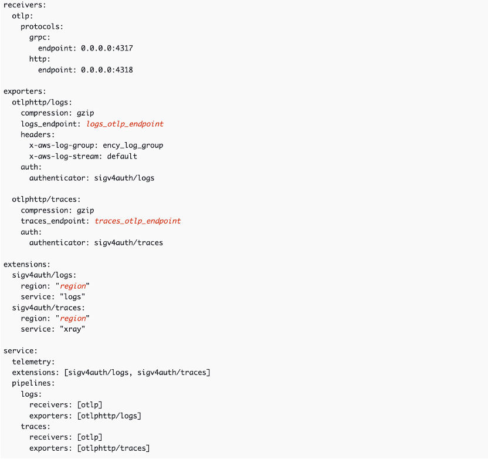

# ఏజెంట్లు/కలెక్టర్లను కాన్ఫిగర్ చేయడం

మీ మానిటరింగ్ ఖాతా నిర్మాణం సిద్ధమైన తర్వాత, మీ అప్లికేషన్లు, సేవలు మరియు ఇతర ఇన్‌ఫ్రాస్ట్రక్చర్ భాగాలను CloudWatch కు టెలిమెట్రీ పంపేలా కాన్ఫిగర్ చేయాలి.

మీ ఏజెంట్లు మరియు కలెక్టర్లను కాన్ఫిగర్ చేయడానికి ఇది ఒక ఉన్నత-స్థాయి గైడ్. లోతైన మార్గదర్శకత్వం కోసం, దయచేసి ఈ బెస్ట్ ప్రాక్టీసెస్ గైడ్‌లోని వివిధ విభాగాలను చూడండి.

## Amazon EKS

EKS కోసం, observability కాన్ఫిగర్ చేయడానికి సులభమైన మార్గం Amazon EKS add-on ఉపయోగించడం. ఇది Amazon EKS కోసం మెరుగైన observability తో Container Insights ను ఇన్‌స్టాల్ చేస్తుంది. ఈ add-on క్లస్టర్ నుండి ఇన్‌ఫ్రాస్ట్రక్చర్ మెట్రిక్స్ పంపడానికి CloudWatch agent ను ఇన్‌స్టాల్ చేస్తుంది, కంటైనర్ లాగ్‌లు పంపడానికి Fluent Bit ను ఇన్‌స్టాల్ చేస్తుంది, మరియు అప్లికేషన్ పెర్ఫార్మెన్స్ టెలిమెట్రీ పంపడానికి CloudWatch Application Signals ను కూడా ఎనేబుల్ చేస్తుంది. (మీకు Application Signals, Container Insights మొదలైనవి అవసరం లేకపోతే ఇది కాన్ఫిగర్ చేయగలది.)

సాధారణంగా, Amazon CloudWatch Observability EKS add-on DaemonSet గా ఇన్‌స్టాల్ చేయబడుతుంది.

EKS కోసం కొన్ని ఎంపికలు:

### EKS కోసం CloudWatch Agent

- Amazon CloudWatch Observability EKS add-on
- Amazon CloudWatch Observability Helm Chart

### EKS కోసం OTEL Collector

ప్రత్యామ్నాయంగా, మీరు OTEL collector ఉపయోగించాలనుకుంటే:
- AWS Exporters కాన్ఫిగర్ చేయండి
- మీ OTLP exporter ను log మరియు traces OTLP ఎండ్‌పాయింట్ల వైపు సెట్ చేయండి
- మీ processing pipelines నిర్వచించండి
- మీ అప్లికేషన్‌ను OTEL లైబ్రరీలు ఉపయోగించి ఇన్‌స్ట్రుమెంట్ చేయండి (అవసరమైతే)

## Amazon ECS

ECS కోసం, మీ క్లస్టర్‌ల కోసం ఇన్‌ఫ్రాస్ట్రక్చర్ మెట్రిక్స్ సేకరించడానికి Container Insights ఎనేబుల్ చేయవచ్చు. అప్లికేషన్ పెర్ఫార్మెన్స్ టెలిమెట్రీ మరియు సంబంధిత ట్రేసెస్ సేకరించడానికి Application Signals కూడా డిప్లాయ్ చేయవచ్చు. లాగ్‌ల కోసం, మీ లాగ్ డేటాను CloudWatch కు పంపడానికి awslogs driver ఉపయోగించవచ్చు, లేదా డేటా పంపడానికి OpenTelemetry collectors ఉపయోగించవచ్చు.

ECS కోసం కొన్ని ఎంపికలు:

### ECS కోసం CloudWatch Agent

- Container Insights ఎనేబుల్ చేయండి
- Application Signals డిప్లాయ్ చేయండి (ఐచ్ఛికం)
- awslogs log driver ఉపయోగించండి

### ECS కోసం OTEL Collector

ప్రత్యామ్నాయంగా, మీరు:
- Sidecar గా రన్ చేయవచ్చు
- AWS Exporters కాన్ఫిగర్ చేయవచ్చు
- OTLP ఎండ్‌పాయింట్లు సెట్ చేయవచ్చు
- Processing pipelines నిర్వచించవచ్చు
- అప్లికేషన్లను ఇన్‌స్ట్రుమెంట్ చేయవచ్చు (అవసరమైతే)

## Amazon EC2 మరియు On-Premises

EC2 ఇన్‌స్టెన్సులు, ఇతర వర్చువల్ మెషీన్లు మరియు on-premises సర్వర్ల నుండి CloudWatch కు టెలిమెట్రీ డేటా పంపడానికి CloudWatch agent ఉపయోగించవచ్చు.

### డిప్లాయ్‌మెంట్ ఎంపికలు

- **EC2 కోసం Workload Detection** – ఏజెంట్‌ను డిప్లాయ్ చేయడానికి ఆటోమేటెడ్ మార్గాన్ని అందిస్తుంది

- **Systems Manager** – AWS Systems Manager ఉపయోగించి ఏజెంట్‌ను డిప్లాయ్ చేసి కాన్ఫిగర్ చేయండి
- **Custom Automation** – మీ స్వంత ఆటోమేషన్ టూల్స్ ఉపయోగించండి
- **Manual Installation** – నిర్దిష్ట యూస్ కేసుల కోసం మాన్యువల్‌గా ఇన్‌స్టాల్ చేయండి

కాన్ఫిగ్ ఫైల్ ద్వారా (ఆటోమేటిక్‌గా లేదా మాన్యువల్‌గా) టెలిమెట్రీని కాన్ఫిగర్/కస్టమైజ్ చేయవచ్చు, మరియు మీ సెట్టింగ్‌లను ఫైన్-ట్యూన్ చేయడంలో సహాయం చేయడానికి ఒక విజార్డ్ అందుబాటులో ఉంది.

### EC2 కోసం OTEL Collector

మీరు OTEL collector ను కూడా ఉపయోగించవచ్చు:

**OTLP Exporters:**

Trace మరియు log OTLP ఎండ్‌పాయింట్ల కోసం OTLP exporters ఉపయోగించండి.

**AWS-Specific Exporters:**

AWS-specific exporters మరియు processing pipelines ఉపయోగించండి.

## సారాంశం

సారాంశంగా:
1. మీ కంప్యూట్ ప్లాట్‌ఫారమ్ (EKS, ECS, EC2) కోసం తగిన agent/collector ఎంచుకోండి
2. ఆటోమేటెడ్ పద్ధతులు (add-ons, Helm charts, Systems Manager) లేదా మాన్యువల్ ఇన్‌స్టాలేషన్ ఉపయోగించి డిప్లాయ్ చేయండి
3. మీ అవసరాల ఆధారంగా టెలిమెట్రీ సేకరణను కాన్ఫిగర్ చేయండి
4. వెండర్-న్యూట్రల్ ఇన్‌స్ట్రుమెంటేషన్ కోసం ఐచ్ఛికంగా OpenTelemetry ఉపయోగించండి

వివరమైన కాన్ఫిగరేషన్ గైడ్‌ల కోసం, మీ కంప్యూట్ ప్లాట్‌ఫారమ్ మరియు observability టూల్స్ కోసం ఈ బెస్ట్ ప్రాక్టీసెస్ గైడ్‌లోని నిర్దిష్ట విభాగాలను చూడండి.

## తదుపరి దశలు

[డాష్‌బోర్డ్‌లు మరియు అలర్ట్‌లు](./dashboards-alerts.md) కు కొనసాగించండి
