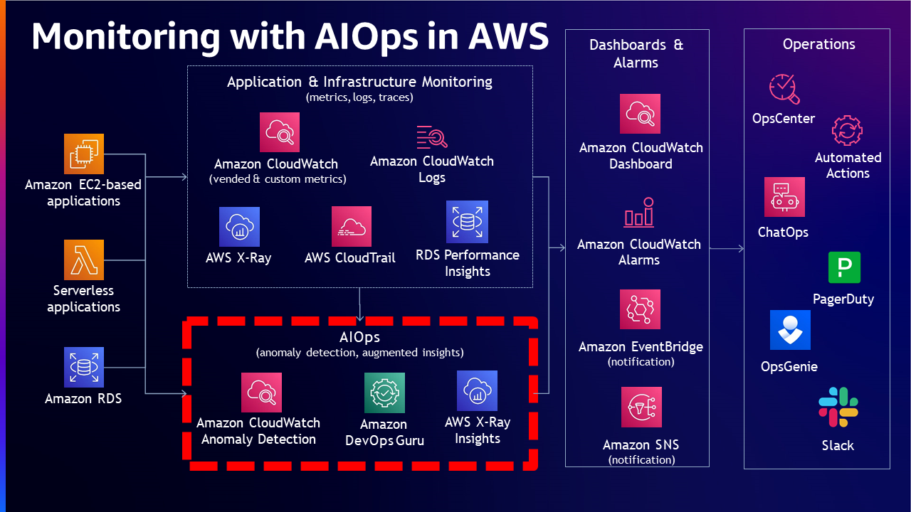
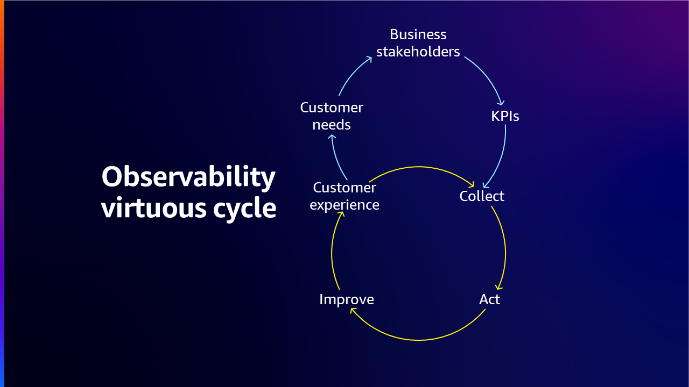

# AWS Observability Maturity Model

## పరిచయం

దాని core లో, observability అనేది system యొక్క external outputs ను analyze చేయడం ద్వారా దాని internal state ను అర్థం చేసుకుని insights పొందగల సామర్థ్యం. ఈ concept ముందుగా నిర్వచించిన metrics లేదా events పై focus చేసే traditional monitoring approaches నుండి, environment లోని వివిధ components generate చేసే data యొక్క సేకరణ, analysis, మరియు visualization ను encompass చేసే మరింత holistic approach కు evolve అయింది. System observe చేయకపోతే దానిని control లేదా optimize చేయలేము. ప్రభావవంతమైన observability strategy teams కు సమస్యలను త్వరగా identify చేసి resolve చేయడానికి, resource usage optimize చేయడానికి, మరియు వారి systems యొక్క overall health లోకి insights పొందడానికి అనుమతిస్తుంది. Observability overall operational availability మరియు workloads health ను మెరుగుపరచగల సమస్యలను సమర్థవంతంగా detect, investigate మరియు remediate చేయగల సామర్థ్యాన్ని అందిస్తుంది.

Monitoring మరియు Observability మధ్య తేడా ఏమిటంటే Monitoring system పని చేస్తుందో లేదో చెబుతుంది, Observability system ఎందుకు పని చేయడం లేదో చెబుతుంది. Monitoring సాధారణంగా reactive measure అయితే Observability యొక్క లక్ష్యం మీ Key Performance Indicators (KPIs) ను proactive పద్ధతిలో మెరుగుపరచగలగడం. నిరంతర Monitoring & Observability చురుకుదనాన్ని పెంచుతుంది, customer అనుభవాన్ని మెరుగుపరుస్తుంది మరియు cloud environment లో risk ను తగ్గిస్తుంది.

## Observability maturity model

Observability maturity model వారి workload observability మరియు management processes ను optimize చేయాలని చూస్తున్న organizations కు అవసరమైన framework గా పనిచేస్తుంది. ఈ model businesses కు వారి ప్రస్తుత capabilities assess చేయడానికి, improvement areas identify చేయడానికి, మరియు optimal observability సాధించడానికి సరైన tools మరియు processes లో strategically invest చేయడానికి సమగ్ర roadmap అందిస్తుంది. Cloud computing, microservices, ephemeral మరియు distributed systems యుగంలో, digital services యొక్క reliability మరియు performance నిర్ధారించడంలో observability critical factor అయింది. Observability మెరుగుపరచడానికి structured approach అందించడం ద్వారా, ఈ model organizations కు వారి systems పై మరింత లోతైన అవగాహన మరియు control పొందడానికి, మరింత resilient, efficient, మరియు high-performing business కు మార్గం చూపుతుంది.

## Observability Maturity Model యొక్క దశలు

Organizations వారి workloads విస్తరించినప్పుడు, observability maturity model కూడా mature అవ్వాలని expect చేయబడుతుంది. అయితే, observability maturity కు మార్గం ఎల్లప్పుడూ workload తో పాటు grow అవ్వదు. Organizations వారి organizational capabilities విస్తరించి grow అయ్యేటప్పుడు అవసరమైన maturity level సాధించడంలో customers కు సహాయం చేయడం ఉద్దేశ్యం.

1.  Observability maturity model లో మొదటి దశ సాధారణంగా organization యొక్క ప్రస్తుత state యొక్క baseline అవగాహన ఏర్పరచుకోవడం. ఇది ఇప్పటికే ఉన్న monitoring tools మరియు processes assess చేయడం, అలాగే visibility లేదా functionality లో gaps identify చేయడం. ఈ దశలో, organizations వారి ప్రస్తుత capabilities stock తీసుకొని engineering cycle యొక్క ప్రారంభ దశల నుండి కూడా improvement కోసం realistic goals set చేయవచ్చు.

2.  తదుపరి దశలో, organizations advanced observability strategies మరియు services adopt చేయడం ద్వారా మరింత sophisticated approach వైపు move అవుతాయి. ఇది proactive alerting, disparate systems మధ్య interactions లోకి insights పొందడానికి distributed tracing implement చేయడం, దీని ద్వారా organizations increased visibility, reduced cognitive load మరియు మరింత efficient troubleshooting యొక్క ప్రయోజనాలు పొందడం ప్రారంభించవచ్చు.

3.  Businesses observability maturity model యొక్క మూడవ దశ ద్వారా progress అయ్యేకొద్దీ, anomaly detection మరియు root cause analysis automate చేయడానికి automated remediation, artificial intelligence మరియు machine learning technologies వంటి అదనపు capabilities leverage చేయవచ్చు. ఈ advanced features organizations కు issues detect చేయడమే కాకుండా end-users ను impact చేయడానికి లేదా business operations disrupt చేయడానికి ముందే corrective actions తీసుకోవడానికి సాధ్యం చేస్తాయి. Incident management platforms వంటి ఇతర critical systems తో observability tools integrate చేయడం ద్వారా, organizations వారి incident response processes streamline చేయవచ్చు మరియు issues resolve చేయడానికి పట్టే సమయాన్ని minimize చేయవచ్చు.

4.  Observability maturity model యొక్క final stage నిరంతర improvement drive చేయడానికి monitoring మరియు observability tools generate చేసిన data wealth ను leverage చేయడం. ఇది workload performance లో patterns మరియు trends identify చేయడానికి advanced analytics ఉపయోగించడం, అలాగే resource allocation, architecture, మరియు deployment strategies optimize చేయడానికి ఈ information ను engineering మరియు operations processes లోకి feedback చేయడం.

### Stage1: Foundational monitoring - Telemetry Data సేకరించడం

Bare minimum గా adopt చేయబడి siloes లో పని చేస్తూ, basic monitoring కు organization లోని systems లేదా workloads మొత్తాన్ని monitor చేయడానికి ఏమి అవసరమో అనే undefined strategy ఉంటుంది. చాలా సమయం, application owners, Network Operations Center (NOC) లేదా CloudOps లేదా DevOps teams వంటి వేర్వేరు teams వారి monitoring అవసరాలకు వేర్వేరు tools ఉపయోగిస్తారు, అందువల్ల ఈ approach debugging across లేదా environment optimization పరంగా తక్కువ value కలిగి ఉంటుంది.

సాధారణంగా, ఈ దశలో customers కు వారి workloads monitor చేయడానికి disparate solutions ఉంటాయి. వేర్వేరు teams, చాలా సమయం ఇతరులతో partnership లేదా limited partnership ఉన్నందున వారు same data ను different ways లో gather చేస్తారు. Teams వారికి అవసరమైన దానిని వారు obtain చేసిన data తో optimize చేస్తారు. అలాగే, teams ఒకరి data మరొకరు ఉపయోగించలేరు ఎందుకంటే మరొక team నుండి obtain చేసిన data dissimilar format లో ఉండవచ్చు. Critical workloads identify చేయడానికి plan create చేయడం, observability కోసం unified solution aim చేయడం, metrics మరియు logs define చేయడం ఈ level లో key aspects. మీ workload దాని internal state మరియు [workload health](https://docs.aws.amazon.com/wellarchitected/latest/operational-excellence-pillar/utilizing-workload-observability.html) అర్థం చేసుకోవడానికి అందించే essential [telemetry](https://docs.aws.amazon.com/wellarchitected/latest/operational-excellence-pillar/implement-observability.html) capture చేయడానికి మీ workload ను design చేయడం అవసరం.

Maturity level మెరుగుపరచడానికి foundation build చేయడానికి, metrics, logs, traces సేకరణ ద్వారా workloads instrument చేయడం మరియు సరైన monitoring మరియు observability tools ఉపయోగించి అర్థవంతమైన insights పొందడం customers కు environment ను control మరియు optimize చేయడంలో సహాయపడతాయి. Instrumentation అంటే environments నుండి key data measure, track మరియు capture చేయడం, ఇది workloads behavior మరియు performance observe చేయడానికి ఉపయోగించవచ్చు. ఉదాహరణలలో errors, successful లేదా non-successful transactions వంటి application metrics, మరియు CPU మరియు disk resources utilization వంటి infrastructure metrics ఉన్నాయి.

### Stage 2: Intermediate Monitoring - Telemetry Analysis మరియు Insights

ఈ దశలో, customers వారి organizations on-premise మరియు cloud వంటి వివిధ environments నుండి signals collect చేయడం పరంగా clearer అవుతున్నట్లు చూస్తారు. వారు workloads నుండి metrics, logs మరియు traces collect చేయడానికి mechanisms devise చేశారు ఎందుకంటే ఇవి observability యొక్క foundational structure, visualizations create చేశారు, alerting strategies మరియు well-defined criteria ఆధారంగా issues prioritize చేయగల ability కూడా కలిగి ఉన్నారు. Reactive గా ఉండి guess చేయడం కాకుండా, customers కు required actions invoke చేసే workflow ఉంది మరియు relevant teams captured information మరియు historical knowledge ఆధారంగా analyze మరియు troubleshoot చేయగలుగుతారు. ఈ level లో customers traditional లేదా modern, highly scalable, distributed, agile మరియు microservices architecture అయిన వారి environments యొక్క observability practices accomplish చేయడానికి work చేస్తారు.

Monitoring చాలా cases లో బాగా work అవుతున్నట్లు అనిపించినప్పటికీ, organizations issues debugging కు ఎక్కువ సమయం spend చేసే tendency ఉంటుంది మరియు result గా overall Mean Time-To-Resolution (MTTR) consistent గా లేదు లేదా period of time లో meaningfully improved కాలేదు. అలాగే, issues debug చేయడానికి expected కంటే ఎక్కువ cognitive time మరియు effort ఉంటుంది, అందువల్ల longer incident response. Operations ను overwhelm చేసే data overload situation కూడా ఉంటుంది. చాలా enterprises ఈ stage లో చిక్కుకుపోతున్నట్లు మేము కనుగొంటాము, వారు ఎక్కడికి వెళ్ళగలరో తెలియకుండా. Organization ను తదుపరి level కు move చేయడానికి తీసుకోగల నిర్దిష్ట actions: 1) మీ systems architecture designs ను regular intervals లో review చేయండి మరియు impact మరియు downtime తగ్గించడానికి policies మరియు practices deploy చేయండి, తక్కువ alerts కు దారితీస్తుంది. 2) Actionable [KPIs](https://aws-observability.github.io/observability-best-practices/guides/operational/business/key-performance-indicators/) define చేయడం, alert findings కు valuable context add చేయడం, severity/urgency ద్వారా categorize చేయడం, engineers issues faster resolve చేయడంలో help చేయడానికి different tools మరియు teams కు send చేయడం ద్వారా alert fatigue prevent చేయండి.

ఈ alerts ను regular basis పై analyze చేయండి మరియు common repeated alerts కోసం remediation automate చేయండి. Operational మరియు process improvement పై feedback అందించడానికి alert findings ను relevant teams తో share మరియు communicate చేయండి.

Different entities correlate చేయడంలో మరియు system యొక్క different parts మధ్య dependencies అర్థం చేసుకోవడంలో help చేసే knowledge graph gradually build చేయడానికి plan develop చేయండి. ఇది customers system కు మార్పుల impact visualize చేయడానికి, potential issues predict మరియు mitigate చేయడంలో సహాయపడుతుంది.

### Stage 3: Advanced Observability - Correlation మరియు Anomaly Detection

ఈ దశలో organizations troubleshooting కు ఎక్కువ సమయం spend చేయకుండా issues యొక్క root cause స్పష్టంగా అర్థం చేసుకోగలుగుతాయి. Issue arise అయినప్పుడు, alerts Network Operations Center (NOC) లేదా CloudOps లేదా DevOps teams వంటి relevant teams కు తగినంత contextual information అందిస్తాయి. Monitoring team alert చూసి metrics, logs అలాగే traces వంటి signals correlation ద్వారా issue యొక్క root cause immediately determine చేయగలుగుతుంది. Traces అనేది మీ application గురించి requests నుండి collect చేయబడిన data, ఇది issues మరియు optimization opportunities identify చేయడానికి view, filter, మరియు insights పొందడానికి tools తో ఉపయోగించవచ్చు. మీ application యొక్క traced requests request మరియు response గురించి మాత్రమే కాకుండా, మీ application downstream AWS resources, microservices, databases, మరియు web APIs కు చేసే calls గురించి కూడా వివరమైన information అందిస్తుంది. వారు trace చూసి, traces capture అయినప్పుడు corresponding log events కనుగొని, infrastructure మరియు applications నుండి metrics చూసి situation యొక్క 360° view పొందగలుగుతారు.

Appropriate teams issue solve చేసే fix అందించడం ద్వారా ఒకేసారి remedial actions తీసుకోగలరు. ఈ scenario లో, MTTR చాలా చిన్నది, Service Level Objectives (SLO) green, మరియు error budget ద్వారా burn rate tolerable. సాధారణంగా, ఈ level లో customers వారి modern, agile, highly scalable మరియు microservices environments యొక్క observability practices accomplish చేశారు.

చాలా organizations ఈ level of sophistication మరియు maturity వారి observability environments లో సాధించాయి. ఈ stage ఇప్పటికే organizations కు complex infrastructure support చేయడానికి, high availability తో systems operate చేయడానికి, applications కు higher Service Level Availability (SLA) అందించడానికి మరియు reliable infrastructure అందించడం ద్వారా business innovation achieve చేయడానికి ability అందిస్తుంది. Customers usual patterns తో match కాని anomalies & outliers monitor చేయడానికి anomaly detectors కూడా ఉపయోగిస్తారు మరియు near real time alerting mechanisms కలిగి ఉంటారు.

అయితే, అలాంటి organizations లోని teams ఎల్లప్పుడూ art of the possible కు beyond వెళ్ళాలనుకుంటారు. Teams repeated issues అర్థం చేసుకోవాలని, భవిష్యత్తులో arise అయ్యే issues predict చేయడానికి scenarios against model చేయడానికి ఉపయోగించగల knowledge base create చేయాలని కోరుకుంటారు. అప్పుడు customers maturity model యొక్క తదుపరి stage కు move అవుతారు, దీనిలో unknown లోకి insights పొందుతారు. అక్కడికి చేరుకోవడానికి, new tools అవసరం మరియు data store చేయడం మరియు ఉపయోగించడంలో new skills మరియు techniques identify చేయాలి. Signals automatically correlate చేసే, root cause identify చేసే, గతంలో collect చేసిన data ఉపయోగించి trained models ఆధారంగా resolution plans create చేసే systems create చేయడానికి Artificial intelligence for IT operations (AIOps) ఉపయోగించవచ్చు.

### Stage 4: Proactive Observability - Automatic మరియు Proactive Root Cause Identification

ఇక్కడ Observability data issue occur అయిన "తర్వాత" మాత్రమే కాకుండా, issue occur అవ్వడానికి "ముందు" real-time లో data ఉపయోగిస్తుంది. Well-trained models ఉపయోగించి, issue identifications proactively చేయబడతాయి మరియు resolutions సులభంగా మరియు సరళంగా accomplish అవుతాయి. Collected signals analyze చేయడం ద్వారా, monitoring system automatically issue లోకి insights అందించగలుగుతుంది మరియు issue resolve చేయడానికి resolution option(s) కూడా lay out చేయగలుగుతుంది.

Observability software vendors ఈ space లోకి నిరంతరం వారి capabilities expand చేస్తున్నారు మరియు Generative AI popular అవ్వడంతో ఇది accelerate అయింది, తద్వారా అలాంటి maturity level achieve చేయాలని aspire చేసే organizations సులభంగా accomplish చేయగలుగుతాయి. ఈ stage mature అయ్యి shape తీసుకున్న తర్వాత, customers observability services స్వయంచాలకంగా dynamic dashboards create చేయగల situation చూస్తారు. Dashboards చేతిలో ఉన్న issue కు relevant information మాత్రమే contain చేయగలవు. ఇది నిజంగా matter కాని data query చేసి visualize చేయడంలో time మరియు cost save చేస్తుంది. Generative AI (GenAI) మరియు Machine Learning perform చేయడానికి compute రోజురోజుకూ democratize అవుతున్నందున, ఇప్పుడు కంటే భవిష్యత్తులో proactive monitoring capabilities మరింత common అవ్వడం చూడవచ్చు.

Observability portfolio యొక్క overview holistic picture అందిస్తుంది, data Collection, data processing, data insight & analysis కోసం వివిధ AWS native మరియు open-source solutions తో, customers వారి end-to-end observability అవసరాలకు appropriate solutions ఎంచుకోవడం ద్వారా ఉపయోగించుకోవచ్చు.

## Observability కోసం AWS Well-Architected మరియు Cloud Adoption Framework

Organizations వారి observability capabilities enhance చేయడానికి మరియు cloud environment ను ప్రభావవంతంగా monitor మరియు troubleshoot చేయడానికి [AWS Well-Architected](https://aws.amazon.com/architecture/well-architected/) మరియు [Cloud Adoption Framework](https://docs.aws.amazon.com/whitepapers/latest/aws-caf-operations-perspective/observability.html) leverage చేయవచ్చు.

Observability కోసం AWS Well-Architected మరియు Cloud Adoption Framework workloads design, deploy, మరియు operate చేయడానికి structured approach అందిస్తుంది, best practices follow అవుతున్నట్లు నిర్ధారిస్తుంది. ఇది improved availability, system performance, scalability మరియు reliability కు దారితీస్తుంది. ఈ frameworks organizations కు standardized set of practices మరియు prescriptive guidance అందిస్తాయి, collaborate చేయడం, knowledge share చేయడం మరియు organization అంతటా consistent solutions implement చేయడం సులభం చేస్తాయి.

ప్రభావవంతంగా leverage చేయడానికి, organizations AWS Well-Architected framework యొక్క pillars ([operational excellence](https://docs.aws.amazon.com/wellarchitected/latest/framework/operational-excellence.html), security, [reliability](https://docs.aws.amazon.com/wellarchitected/latest/framework/reliability.html), [performance efficiency](https://docs.aws.amazon.com/wellarchitected/latest/framework/performance-efficiency.html), cost optimization మరియు sustainability) అని పిలవబడే key components అర్థం చేసుకోవాలి, ఇవి cloud environment design మరియు operate చేయడానికి holistic approach అందిస్తాయి. మరోవైపు, Cloud Adoption Framework cloud adoption కు structured approach అందిస్తుంది, business, people, governance, మరియు platform వంటి areas పై focus చేస్తుంది. ఈ components ను observability requirements తో align చేయడం ద్వారా, organizations robust మరియు scalable workloads build చేయవచ్చు.

Observability కోసం AWS Well-Architected మరియు Cloud Adoption Frameworks implement చేయడం కొన్ని steps involve చేస్తుంది. మొదట, organizations వారి ప్రస్తుత state assess చేసి improvement areas identify చేయాలి. ఇది Observability Maturity Model assessment conduct చేయడం ద్వారా చేయవచ్చు, ఇది ఈ frameworks against workloads evaluate చేస్తుంది. Review findings ఆధారంగా, organizations వారి observability initiatives prioritize మరియు plan చేయవచ్చు. ఇది monitoring మరియు logging requirements define చేయడం, appropriate AWS services select చేయడం, మరియు అవసరమైన infrastructure మరియు tools implement చేయడం include చేస్తుంది. చివరగా, organizations ongoing effectiveness నిర్ధారించడానికి వారి observability solutions ను continuously monitor మరియు optimize చేయాలి.

అలాగే, customers [AWS Well-Architected Tool](https://aws.amazon.com/well-architected-tool/) ఉపయోగించవచ్చు, ఇది AWS లో ఒక service, AWS Well-Architected Framework యొక్క best practices ఉపయోగించి వారి workload document మరియు measure చేయడానికి. ఈ tool AWS Well-Architected Framework pillars ద్వారా వారి workloads measure చేయడానికి consistent process అందిస్తుంది, వారు చేసే decisions document చేయడంలో assist చేస్తుంది, వారి workloads improve చేయడానికి recommendations అందిస్తుంది, మరియు workloads ను more reliable, secure, efficient, మరియు cost-effective చేయడంలో guide చేస్తుంది.

## Assessment

Observability Maturity Model assessment మీ observability యొక్క ప్రస్తుత state gauge చేయడానికి మరియు improvement areas identify చేయడానికి ఉపయోగించవచ్చు. ప్రతి stage యొక్క assessment వేర్వేరు teams అంతటా ఇప్పటికే ఉన్న monitoring మరియు management practices evaluate చేయడం, gaps మరియు improvement areas identify చేయడం, మరియు తదుపరి stage కోసం overall readiness determine చేయడం involve చేస్తుంది. Maturity assessment business process outline, workload inventory & tools discovery, ప్రస్తుత challenges identify చేయడం మరియు organization priorities మరియు objectives అర్థం చేసుకోవడంతో begin అవుతుంది.

Assessment ఇప్పటికే ఉన్న layout యొక్క further development మరియు optimization కోసం foundation వేసే targeted metrics మరియు KPIs identify చేయడంలో help చేస్తుంది. మీ Observability Maturity Model assessment మీ business modern systems యొక్క complex, dynamic nature handle చేయడానికి prepared అని ensure చేయడంలో crucial role play చేస్తుంది. ఇది system failures లేదా performance issues కు potentially lead అయ్యే blind spots మరియు weakness areas identify చేయడంలో aid చేస్తుంది.

అంతేకాక, regular assessments మీ business agile మరియు adaptable గా ఉండేలా ensure చేస్తాయి. Evolving technologies మరియు methodologies తో pace keep చేయడానికి ఇది అనుమతిస్తుంది, తద్వారా మీ systems ఎల్లప్పుడూ efficiency మరియు reliability peak వద్ద ఉంటాయి.

Assessment మీ observability strategy state ను AWS best practices against review చేయడానికి, improvement opportunities identify చేయడానికి, మరియు time over progress track చేయడానికి help చేయడానికి designed చేయబడింది. కింది questions మీ ప్రస్తుత observability maturity level assess చేయడంలో help చేయాలి. మీకు ఎటువంటి cost లేకుండా మా "AWS Observability Maturity Model Assessment" tool ఉపయోగించి assessment perform చేయించుకోవడానికి, దయచేసి మీ AWS account team ను contact చేయండి.

**Logs**

1. మీరు logs ను ఎలా collect చేస్తారు?
2. మీరు logs ను ఎలా use చేస్తారు?
3. మీరు logs ను ఎలా access చేస్తారు?
4. Security మరియు regulatory compliance కోసం మీ log retention policy ఏమిటి?
5. మీరు ఈ రోజు ఏదైనా ML/AI capability ఉపయోగిస్తున్నారా?

**Metrics**

6. మీరు ఎటువంటి type metrics collect చేస్తారు?
7. మీరు metrics ను ఎలా use చేస్తారు?
8. మీరు metrics ను ఎలా access చేస్తారు?

**Traces**

9. మీరు traces ను ఎలా collect చేస్తారు?
10. మీరు traces ను ఎలా use చేస్తారు?

**Dashboards మరియు Alerting**

11. మీరు alarms ను ఎలా use చేస్తారు?
12. మీరు dashboards ను ఎలా use చేస్తారు?

**Organization**

13. మీకు enterprise observability strategy ఉందా?
14. మీరు SLOs ను ఎలా use చేస్తారు?

## Observability strategy build చేయడం

Organization వారి observability stage identify చేసిన తర్వాత, ప్రస్తుత processes & tools optimize చేయడానికి strategy build చేయడం ప్రారంభించాలి మరియు maturity వైపు work చేయడం కూడా start చేయాలి. Organizations వారి customers కు గొప్ప customer experience ఉండేలా ensure చేయాలనుకుంటారు, కాబట్టి ఆ customer requirements తో start చేసి అక్కడ నుండి backwards work చేస్తారు. ఆపై మీ stakeholders తో work చేయండి ఎందుకంటే వారు ఆ requirements చాలా బాగా అర్థం చేసుకుంటారు. Observability strategy aim తో, organizations మొదట వారి observability goals define చేయాలి, ఎందుకంటే అవి overall business objectives తో aligned ఉండాలి మరియు strategy ద్వారా organization ఏమి achieve చేయాలనుకుంటుందో clearly articulate చేయాలి, observability plan build మరియు implement చేయడానికి roadmap provide చేస్తూ.

తర్వాత, organizations system performance లోకి insights provide చేసే key metrics (KPIs) identify చేయాలి. ఇవి latency మరియు error rates నుండి resource utilization మరియు transaction volumes వరకు range అవ్వవచ్చు. Metrics choice ప్రధానంగా business nature మరియు దాని specific needs పై depend అవుతుందని గమనించడం ముఖ్యం.

Key metrics identify అయిన తర్వాత, organizations data collection కోసం అవసరమైన tools మరియు technologies decide చేయవచ్చు. Tool choice organization goals తో alignment, existing systems తో integration ease, cost optimize చేయడం, scalability achieve చేయడం, customer needs meet చేయడం మరియు overall customer experience improve చేయడం ఆధారంగా ఉండాలి.

చివరగా, organizations observability ను value చేసే culture encourage చేయాలి. ఇది team members కు observability importance గురించి training ఇవ్వడం, system performance proactively monitor చేయడానికి encourage చేయడం, మరియు continuous learning మరియు improvement culture foster చేయడం involve చేస్తుంది. ఈ strategy best possible customer experience కోసం collection, action మరియు improvement యొక్క continuous process అయిన virtuous cycle create చేస్తుంది.

సారాంశంలో, observability strategy build చేయడానికి మూడు ప్రధాన aspects పరిగణించాలి: 1) ఏమి collect చేయాలి 2) observe చేయవలసిన అన్ని systems మరియు workloads ఏమిటి మరియు 3) issues ఉన్నప్పుడు ఎలా react చేయాలి మరియు వాటిని remediate చేయడానికి ఏ mechanisms ఉండాలి.

## ముగింపు

Observability maturity model organizations కు వారి ప్రస్తుత state assess చేయడానికి మరియు workloads మరియు infrastructure behavior ను understand, analyze, మరియు respond చేయగల ability improve చేయడానికి ways కోసం roadmap గా పనిచేస్తుంది. ప్రస్తుత capabilities assess చేయడానికి, advanced monitoring techniques adopt చేయడానికి, మరియు data-driven insights leverage చేయడానికి structured approach follow చేయడం ద్వారా, businesses higher level of observability achieve చేయవచ్చు మరియు వారి workloads మరియు infrastructure గురించి more informed decisions తీసుకోవచ్చు. ఈ model organizations different levels of maturity ద్వారా progress అవ్వడానికి develop చేయవలసిన key capabilities మరియు practices outline చేస్తుంది, ultimately proactive observability benefits ను fully leverage చేయగల state కు reach అవ్వడం.

## ఉపయోగకరమైన వనరులు

- [Building an effective observability strategy](https://youtu.be/7PQv9eYCJW8?si=gsn0qPyIMhrxU6sy) - AWS re:Invent 2023
- [AWS Observability Best Practices](https://aws-observability.github.io/observability-best-practices/)
- [What is observability and Why does it matter?](https://aws.amazon.com/blogs/mt/what-is-observability-and-why-does-it-matter-part-1/)
- [How to develop an Observability strategy?](https://aws.amazon.com/blogs/mt/how-to-develop-an-observability-strategy/)
- [Guidance for Deep Application Observability on AWS](https://aws.amazon.com/solutions/guidance/deep-application-observability-on-aws/)
- [How Discovery increased operational efficiency with AWS observability](https://www.youtube.com/watch?v=zm30JNYmxlY) - AWS re:Invent 2022
- [Developing an observability strategy](https://www.youtube.com/watch?v=Ub3ATriFapQ) - AWS re:Invent 2022
- [Explore Cloud Native Observability with AWS](https://www.youtube.com/watch?v=UW7aT25Mbng) - AWS Virtual Workshop
- [Increase availability with AWS observability solutions](https://www.youtube.com/watch?v=_d_9xCfVBTM) - AWS re:Invent 2020
- [Observability best practices at Amazon](https://www.youtube.com/watch?v=zZPzXEBW4P8) - AWS re:Invent 2022
- [Observability: Best practices for modern applications](https://www.youtube.com/watch?v=YiegAlC_yyc) - AWS re:Invent 2022
- [Observability the open-source way](https://www.youtube.com/watch?v=2IJPpdp9xU0) - AWS re:Invent 2022
- [Elevate your Observability Strategy with AIOps](https://www.youtube.com/watch?v=L4b_eDSAwfE)
- [Let's Architect! Monitoring production systems at scale](https://aws.amazon.com/blogs/architecture/lets-architect-monitoring-production-systems-at-scale/)
- [Full-stack observability and application monitoring with AWS](https://www.youtube.com/watch?v=or7uFFyHIX0) - AWS Summit SF 2022
