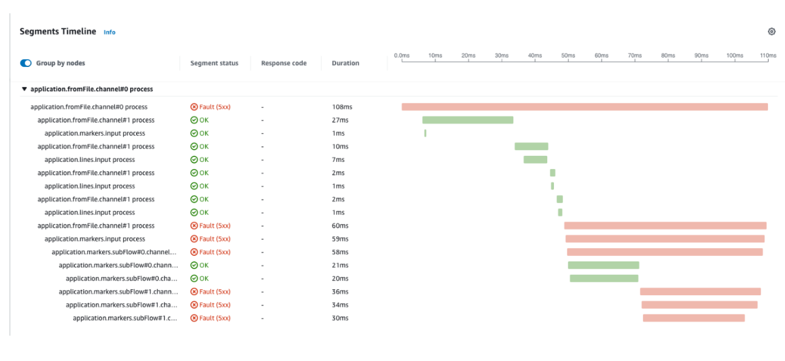

# Java Spring Integration Applications ను Instrument చేయడం

ఈ వ్యాసం [Open Telemetry](https://opentelemetry.io/) మరియు [X-ray](https://aws.amazon.com/xray/) ను ఉపయోగించి [Spring-Integration](https://docs.spring.io/spring-integration/reference/overview.html) applications ను manually instrument చేయడానికి ఒక approach ను వివరిస్తుంది.

Spring-Integration framework event-driven architectures మరియు messaging-centric architectures కు typical అయిన integration solutions అభివృద్ధిని enable చేయడానికి రూపొందించబడింది. మరో వైపు, OpenTelemetry services HTTP requests ఉపయోగించి communicate మరియు coordinate చేసే micro services architectures పై ఎక్కువ focused గా ఉంటుంది. అందువల్ల ఈ guide OpenTelemetry API తో manual instrumentation ఉపయోగించి Spring-Integration applications ను ఎలా instrument చేయాలో ఉదాహరణ అందిస్తుంది.

## నేపథ్య సమాచారం

### Tracing అంటే ఏమిటి?

[OpenTelemetry documentation](https://opentelemetry.io/docs/concepts/signals/traces/) నుండి కింది quote trace యొక్క ఉద్దేశ్యం ఏమిటో మంచి overview ఇస్తుంది:

:::note
    Traces మన application కు request చేసినప్పుడు ఏమి జరుగుతుందో పెద్ద చిత్రాన్ని ఇస్తాయి. మీ application single database తో monolith అయినా లేదా services యొక్క sophisticated mesh అయినా, మీ application లో request తీసుకునే పూర్తి "path" ను అర్థం చేసుకోవడానికి traces అవసరం.
:::
Tracing యొక్క ప్రధాన ప్రయోజనాలలో ఒకటి request యొక్క end-to-end visibility కావడంతో, request origin నుండి backend వరకు traces సరిగ్గా link అవడం ముఖ్యం. OpenTelemetry లో దీన్ని చేయడానికి సాధారణ మార్గం [nested spans](https://opentelemetry.io/docs/instrumentation/java/manual/#create-nested-spans) ను ఉపయోగించడం. ఇది microservices architecture లో పని చేస్తుంది, ఇక్కడ spans final destination చేరుకునే వరకు service నుండి service కు pass అవుతాయి. Spring Integration application లో, remotely మరియు locally సృష్టించబడిన spans మధ్య parent/child relationships సృష్టించాలి.

## Context Propagation ఉపయోగించి Tracing

Context propagation ఉపయోగించి ఒక approach ను demonstrate చేస్తాము. ఈ approach సాంప్రదాయకంగా locally మరియు remote locations లో సృష్టించబడిన spans మధ్య parent/child relationship సృష్టించాల్సినప్పుడు ఉపయోగించబడుతుంది, కానీ Spring Integration Application విషయంలో ఇది code ను simplify చేస్తుంది మరియు application scale అవడానికి అనుమతిస్తుంది: బహుళ threads లో parallel గా messages process చేయడం సాధ్యమవుతుంది మరియు వివిధ hosts లో messages process చేయాల్సిన సందర్భంలో horizontally scale చేయడం కూడా సాధ్యమవుతుంది.

దీన్ని సాధించడానికి అవసరమైన వాటి overview ఇక్కడ ఉంది:

- ```ChannelInterceptor``` సృష్టించి దాన్ని ```GlobalChannelInterceptor``` గా register చేయండి, తద్వారా అన్ని channels అంతటా పంపబడే messages ను capture చేయగలదు.

- ```ChannelInterceptor``` లో:
  - ```preSend``` method లో:
    - upstream లో generate అవుతున్న మునుపటి message నుండి context చదవడానికి ప్రయత్నించండి. ఇక్కడే upstream messages నుండి spans ను connect చేయగలుగుతాము. Context ఏదీ లేకపోతే, కొత్త trace start అవుతుంది (ఇది OpenTelemetry SDK ద్వారా చేయబడుతుంది).
    - ఆ operation ను identify చేసే unique name తో Span సృష్టించండి. ఇది ఈ message process అవుతున్న channel పేరు కావచ్చు.
    - Message లో current context save చేయండి.
    - తర్వాత close చేయగలిగేలా context మరియు scope ను thread.local లో store చేయండి.
    - Downstream పంపబడే message లో context inject చేయండి.
  - ```afterSendCompletion``` లో:
    - thread.local నుండి context మరియు scope ను restore చేయండి.
    - Context నుండి span ను recreate చేయండి.
    - Message process చేసేటప్పుడు raise అయిన ఏవైనా exceptions ను register చేయండి.
    - Scope close చేయండి.
    - Span end చేయండి.

ఇది చేయాల్సిన వాటి simplified description. Spring-Integration framework ఉపయోగించే functional sample application ను మేము provide చేస్తున్నాము. ఈ application కోసం code [ఇక్కడ](https://github.com/rapphil/spring-integration-samples/tree/rapphil-5.5.x-otel/applications/file-split-ftp) కనుగొనవచ్చు.

Application ను instrument చేయడానికి చేసిన మార్పులను మాత్రమే చూడటానికి, ఈ [diff](https://github.com/rapphil/spring-integration-samples/compare/30e01ce9eefd8dae288eca44013810afa8c1a585..6f056a76350340a9658db0cad7fc12dbda505437) చూడండి.

### ఈ sample application ను run చేయడానికి:

``` bash
# build and run
mvn spring-boot:run
# create sample input file to trigger flow
echo 'testcontent\nline2content\nlastline' > /tmp/in/testfile.txt
```

ఈ sample application తో experiment చేయడానికి, కింది configuration తో సమానమైన configuration తో application ఉన్న machine లోనే [ADOT collector](https://aws-otel.github.io/docs/getting-started/collector) running ఉండాలి:

``` yaml
receivers:
  otlp:
    protocols:
      grpc: 
        endpoint: 0.0.0.0:4317
      http:
        endpoint: 0.0.0.0:4318
processors:
  batch/traces:
    timeout: 1s
    send_batch_size: 50
  batch/metrics:
    timeout: 60s
exporters:
  aws xray: region:us-west-2
  aws emf:
    region: us-west-2
service:
  pipelines:
    traces:
      receivers: [otlp]
      processors: [batch/traces]
      exporters: [awsxray]
    metrics:
      receivers: [otlp]
      processors: [batch/metrics]
      exporters: [awsemf]
```

## ఫలితాలు

Sample application ను run చేసి కింది command run చేస్తే, మనకు ఇది వస్తుంది:

``` bash
echo 'foo123\nbar123\nfoo1234' > /tmp/in/testfile.txt
```



పైన ఉన్న segments sample application లో వివరించిన workflow తో match అవుతున్నాయని చూడవచ్చు. కొన్ని messages process అయినప్పుడు Exceptions expected, కాబట్టి అవి సరిగ్గా register అవుతున్నాయని మరియు X-Ray లో troubleshoot చేయడానికి మనకు అనుమతిస్తాయని చూడవచ్చు.


## FAQ

### Nested spans ఎలా సృష్టించాలి?

Spans ను connect చేయడానికి OpenTelemetry లో ఉపయోగించగల మూడు mechanisms ఉన్నాయి:

##### Explicitly

Parent span ను child span సృష్టించబడే చోటికి pass చేసి రెండింటిని link చేయాలి:

``` java
    Span childSpan = tracer.spanBuilder("child")
    .setParent(Context.current().with(parentSpan)) 
    .startSpan();
```

##### Implicitly

Span context hood కింద thread.local లో store చేయబడుతుంది.
మీరు అదే thread లో spans సృష్టిస్తున్నారని ఖచ్చితంగా తెలిసినప్పుడు ఈ method indicate చేయబడుతుంది.

``` java
    void parentTwo() {
        Span parentSpan = tracer.spanBuilder("parent").startSpan(); 
        try(Scope scope = parentSpan.makeCurrent()) {
            childTwo(); 
        } finally {
        parentSpan.end(); 
        }
    }
    void childTwo() {
        Span childSpan = tracer.spanBuilder("child")
            // NOTE: setParent(...) is not required;
            // `Span.current()` is automatically added as the parent 
            .startSpan();
        try(Scope scope = childSpan.makeCurrent()) { 
            // do stuff
        } finally {
            childSpan.end();
        } 
    }
```

##### Context Propagation  

ఈ method context ను ఎక్కడైనా (HTTP headers లేదా message లో) store చేస్తుంది, తద్వారా child span సృష్టించబడే remote location కు transport చేయవచ్చు. ఇది remote location అయి ఉండాలనే strict requirement లేదు. ఇది అదే process లో కూడా ఉపయోగించవచ్చు.

### OpenTelemetry properties X-Ray properties లోకి ఎలా translate అవుతాయి?

Relationship చూడటానికి కింది [guide](https://opentelemetry.io/docs/instrumentation/java/manual/#context-propagation) చూడండి.


  
