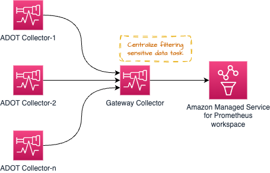

# AWS Distro for OpenTelemetry (ADOT) Collector ను నిర్వహించడం

[ADOT collector](https://aws-otel.github.io/) అనేది [CNCF](https://www.cncf.io/) యొక్క open-source [OpenTelemetry Collector](https://opentelemetry.io/docs/collector/) యొక్క downstream distribution.

Customers on-prem, AWS మరియు ఇతర cloud providers నుండి metrics మరియు traces వంటి signals సేకరించడానికి ADOT Collector ను ఉపయోగించవచ్చు.

వాస్తవ ప్రపంచ వాతావరణంలో మరియు పెద్ద ఎత్తున ADOT Collector ను నిర్వహించడానికి, operators collector health ను monitor చేయాలి మరియు అవసరమైన విధంగా scale చేయాలి. ఈ గైడ్‌లో, production వాతావరణంలో ADOT Collector ను నిర్వహించడానికి తీసుకోగల చర్యల గురించి మీరు నేర్చుకుంటారు.

## Deployment architecture

మీ అవసరాలను బట్టి, మీరు పరిగణించవలసిన కొన్ని deployment ఎంపికలు ఉన్నాయి.

* No Collector
* Agent
* Gateway


:::tip
    అదనపు సమాచారం కోసం [OpenTelemetry documentation](https://opentelemetry.io/docs/collector/deployment/)
    చూడండి.
:::

### No Collector
ఈ ఎంపిక collector ను సమీకరణం నుండి పూర్తిగా తొలగిస్తుంది. మీకు తెలియకపోతే, OTEL SDK నుండి నేరుగా destination services కు API calls చేయడం మరియు signals పంపడం సాధ్యమే. ADOT Collector వంటి out-of-process agent కు spans పంపడానికి బదులుగా మీ application process నుండి నేరుగా AWS X-Ray యొక్క [PutTraceSegments](https://docs.aws.amazon.com/xray/latest/api/API_PutTraceSegments.html) API కు calls చేయడం గురించి ఆలోచించండి.

ఈ విధానం కోసం మార్గదర్శకత్వాన్ని మార్చే AWS-specific అంశం ఏదీ లేనందున, మరిన్ని వివరాల కోసం upstream documentation లోని [section](https://opentelemetry.io/docs/collector/deployment/no-collector/) ను చూడమని మేము గట్టిగా ప్రోత్సహిస్తున్నాము.


### Agent
ఈ విధానంలో, మీరు collector ను distributed పద్ధతిలో అమలు చేస్తారు మరియు destinations లోకి signals సేకరిస్తారు. `No Collector` ఎంపిక వలె కాకుండా, ఇక్కడ మేము concerns ను వేరు చేస్తాము మరియు remote API calls చేయడానికి application దాని resources ఉపయోగించాల్సిన అవసరం నుండి decouple చేస్తాము మరియు బదులుగా locally అందుబాటులో ఉన్న agent తో communicate చేస్తాము.

**Kubernetes sidecar గా collector అమలు చేస్తూ** Amazon EKS వాతావరణంలో ఇది ఈ విధంగా కనిపిస్తుంది:


ఈ పై architecture లో, collector application container తో ఒకే pod లో అమలు అవుతున్నందున మీరు `localhost` నుండి targets ను scrape చేస్తారు కాబట్టి మీ scrape configuration ఏ service discovery mechanisms ను ఉపయోగించాల్సిన అవసరం లేదు.

Traces సేకరించడానికి కూడా అదే architecture వర్తిస్తుంది. మీరు [ఇక్కడ చూపిన విధంగా](https://aws-otel.github.io/docs/getting-started/x-ray#sample-collector-configuration-putting-it-together) OTEL pipeline సృష్టించాలి

##### ప్రయోజనాలు మరియు అప్రయోజనాలు
* ఈ design కోసం ఒక వాదన ఏమిటంటే, targets localhost sources కు పరిమితం అవడంతో Collector దాని పనిని చేయడానికి మీరు అసాధారణ మొత్తంలో resources (CPU, Memory) కేటాయించాల్సిన అవసరం లేదు.

* ఈ విధానాన్ని ఉపయోగించడంలో ప్రతికూలత ఏమిటంటే, collector pod configuration కోసం విభిన్న configurations సంఖ్య మీరు cluster పై అమలు చేస్తున్న applications సంఖ్యకు నేరుగా అనుపాతంలో ఉంటుంది.
అంటే, Pod కోసం ఆశించబడిన workload ని బట్టి ప్రతి Pod కోసం CPU, Memory మరియు ఇతర resource allocation ను వ్యక్తిగతంగా నిర్వహించాలి. దీని పట్ల జాగ్రత్తగా ఉండకపోతే, మీరు Collector Pod కోసం resources ను ఎక్కువగా లేదా తక్కువగా కేటాయించవచ్చు, ఇది తక్కువ-పనితీరు లేదా CPU cycles మరియు Memory ను lock చేయడానికి దారితీస్తుంది, ఇవి Node లో ఇతర Pods ద్వారా ఉపయోగించబడవచ్చు.

మీ అవసరాల ఆధారంగా మీరు Deployments, Daemonset, Statefulset మొదలైన ఇతర models లో కూడా collector ను deploy చేయవచ్చు.

#### Amazon EKS పై Daemonset గా collector అమలు చేయడం

మీరు EKS Nodes అంతటా collectors యొక్క load (Amazon Managed Service for Prometheus workspace కు metrics scrape చేయడం మరియు పంపడం) ను సమానంగా పంపిణీ చేయాలనుకుంటే collector ను [Daemonset](https://kubernetes.io/docs/concepts/workloads/controllers/daemonset/) గా అమలు చేయడాన్ని ఎంచుకోవచ్చు.


Collector దాని స్వంత host/Node నుండి మాత్రమే targets ను scrape చేసేలా `keep` action ఉన్నట్లు నిర్ధారించుకోండి.

Reference కోసం దిగువ sample చూడండి. మరిన్ని configuration వివరాలు [ఇక్కడ](https://aws-otel.github.io/docs/getting-started/adot-eks-add-on/config-advanced#daemonset-collector-configuration) కనుగొనండి.

```yaml
scrape_configs:
    - job_name: kubernetes-apiservers
    bearer_token_file: /var/run/secrets/kubernetes.io/serviceaccount/token
    kubernetes_sd_configs:
    - role: endpoints
    relabel_configs:
    - action: keep
        regex: $K8S_NODE_NAME
        source_labels: [__meta_kubernetes_endpoint_node_name]
    scheme: https
    tls_config:
        ca_file: /var/run/secrets/kubernetes.io/serviceaccount/ca.crt
        insecure_skip_verify: true
```

Traces సేకరించడానికి కూడా అదే architecture ఉపయోగించవచ్చు. ఈ సందర్భంలో, Prometheus metrics scrape చేయడానికి Collector endpoints కు చేరుకోవడానికి బదులుగా, trace spans application pods ద్వారా Collector కు పంపబడతాయి.

##### ప్రయోజనాలు మరియు అప్రయోజనాలు
**ప్రయోజనాలు**

* కనీస scaling సమస్యలు
* High-Availability configure చేయడం ఒక సవాలు
* చాలా ఎక్కువ Collector copies ఉపయోగంలో ఉన్నాయి
* Logs support కోసం సులభం కావచ్చు

**అప్రయోజనాలు**

* Resource utilization పరంగా అత్యంత optimal కాదు
* అసమాన resource allocation


#### Amazon EC2 పై collector అమలు చేయడం
EC2 పై collector అమలు చేయడంలో side car విధానం లేనందున, మీరు EC2 instance పై agent గా collector ను అమలు చేస్తారు. Metrics scrape చేయడానికి instance లో targets ను కనుగొనడానికి దిగువన ఉన్న విధంగా static scrape configuration సెట్ చేయవచ్చు.

దిగువ config localhost లో `9090` మరియు `8081` ports వద్ద endpoints ను scrape చేస్తుంది.

ఈ topic లో hands-on deep dive అనుభవం కోసం మా [EC2 focused module in the One Observability Workshop](https://catalog.workshops.aws/observability/en-US/aws-managed-oss/ec2-monitoring) ద్వారా వెళ్ళండి.

```yaml
global:
  scrape_interval: 15s # By default, scrape targets every 15 seconds.

scrape_configs:
- job_name: 'prometheus'
  static_configs:
  - targets: ['localhost:9090', 'localhost:8081']
```

#### Amazon EKS పై Deployment గా collector అమలు చేయడం

మీ collectors కోసం High Availability అందించాలనుకున్నప్పుడు collector ను Deployment గా అమలు చేయడం ప్రత్యేకంగా ఉపయోగపడుతుంది. Targets సంఖ్య, scrape చేయడానికి అందుబాటులో ఉన్న metrics మొదలైన వాటిని బట్టి, signal collection లో సమస్యలు కలిగించకుండా collector ఆకలితో ఉండకుండా Collector కోసం resources సర్దుబాటు చేయాలి.

[ఈ topic గురించి గైడ్ లో మరింత చదవండి.](https://aws-observability.github.io/observability-best-practices/guides/containers/oss/eks/best-practices-metrics-collection)

కింది architecture metrics మరియు traces సేకరించడానికి workload nodes వెలుపల ప్రత్యేక node లో collector ఎలా deploy చేయబడుతుందో చూపిస్తుంది.


Metric collection కోసం High-Availability setup చేయడానికి, [మీరు దాన్ని ఎలా setup చేయవచ్చో వివరమైన సూచనలు అందించే మా docs చదవండి](https://docs.aws.amazon.com/prometheus/latest/userguide/Send-high-availability-prom-community.html)

#### Metrics collection కోసం Amazon ECS పై central task గా collector అమలు చేయడం

ECS cluster లో లేదా clusters అంతటా వివిధ tasks నుండి Prometheus metrics సేకరించడానికి మీరు [ECS Observer extension](https://github.com/open-telemetry/opentelemetry-collector-contrib/tree/main/extension/observer/ecsobserver) ఉపయోగించవచ్చు.


Extension కోసం sample collector configuration:

```yaml
extensions:
  ecs_observer:
    refresh_interval: 60s # format is https://golang.org/pkg/time/#ParseDuration
    cluster_name: 'Cluster-1' # cluster name need manual config
    cluster_region: 'us-west-2' # region can be configured directly or use AWS_REGION env var
    result_file: '/etc/ecs_sd_targets.yaml' # the directory for file must already exists
    services:
      - name_pattern: '^retail-.*$'
    docker_labels:
      - port_label: 'ECS_PROMETHEUS_EXPORTER_PORT'
    task_definitions:
      - job_name: 'task_def_1'
        metrics_path: '/metrics'
        metrics_ports:
          - 9113
          - 9090
        arn_pattern: '.*:task-definition/nginx:[0-9]+'
```


##### ప్రయోజనాలు మరియు అప్రయోజనాలు
* ఈ model లో ఒక ప్రయోజనం ఏమిటంటే, మీరే నిర్వహించుకోవలసిన తక్కువ collectors మరియు configurations ఉంటాయి.
* Cluster చాలా పెద్దది మరియు scrape చేయడానికి వేలాది targets ఉన్నప్పుడు, collectors అంతటా load balanced అయ్యేలా architecture ను జాగ్రత్తగా design చేయాలి. HA కారణాల కోసం అదే collectors యొక్క near-clones ను అమలు చేయడం operational issues నివారించడానికి జాగ్రత్తగా చేయాలి.

### Gateway


## Collector health నిర్వహించడం
OTEL Collector దాని health మరియు performance ను ట్రాక్ చేయడానికి అనేక signals ను expose చేస్తుంది. కింది విధమైన సరిదిద్దే చర్యలు తీసుకోవడానికి collector health ను నిశితంగా monitor చేయడం అవసరం,

* Collector ను horizontally scale చేయడం
* కోరుకున్న విధంగా పనిచేయడానికి collector కు అదనపు resources provide చేయడం


### Collector నుండి health metrics సేకరించడం

`service` pipeline కు `telemetry` section జోడించడం ద్వారా Prometheus Exposition Format లో metrics expose చేయడానికి OTEL Collector ను configure చేయవచ్చు. Collector దాని స్వంత logs ను stdout కు కూడా expose చేయగలదు.

Telemetry configuration గురించి మరిన్ని వివరాలు [OpenTelemetry documentation లో ఇక్కడ](https://opentelemetry.io/docs/collector/configuration/#service) కనుగొనవచ్చు.

Collector కోసం sample telemetry configuration.

```yaml
service:
  telemetry:
    logs:
      level: debug
    metrics:
      level: detailed
      address: 0.0.0.0:8888
```
Configure చేసిన తర్వాత, collector `http://localhost:8888/metrics` వద్ద ఈ క్రింది విధంగా metrics export చేయడం ప్రారంభిస్తుంది.

```bash
# HELP otelcol_exporter_enqueue_failed_spans Number of spans failed to be added to the sending queue.
# TYPE otelcol_exporter_enqueue_failed_spans counter
otelcol_exporter_enqueue_failed_spans{exporter="awsxray",service_instance_id="523a2182-539d-47f6-ba3c-13867b60092a",service_name="aws-otel-collector",service_version="v0.25.0"} 0

# HELP otelcol_process_runtime_total_sys_memory_bytes Total bytes of memory obtained from the OS (see 'go doc runtime.MemStats.Sys')
# TYPE otelcol_process_runtime_total_sys_memory_bytes gauge
otelcol_process_runtime_total_sys_memory_bytes{service_instance_id="523a2182-539d-47f6-ba3c-13867b60092a",service_name="aws-otel-collector",service_version="v0.25.0"} 2.4462344e+07

# HELP otelcol_process_memory_rss Total physical memory (resident set size)
# TYPE otelcol_process_memory_rss gauge
otelcol_process_memory_rss{service_instance_id="523a2182-539d-47f6-ba3c-13867b60092a",service_name="aws-otel-collector",service_version="v0.25.0"} 6.5675264e+07

# HELP otelcol_exporter_enqueue_failed_metric_points Number of metric points failed to be added to the sending queue.
# TYPE otelcol_exporter_enqueue_failed_metric_points counter
otelcol_exporter_enqueue_failed_metric_points{exporter="awsxray",service_instance_id="d234b769-dc8a-4b20-8b2b-9c4f342466fe",service_name="aws-otel-collector",service_version="v0.25.0"} 0
otelcol_exporter_enqueue_failed_metric_points{exporter="logging",service_instance_id="d234b769-dc8a-4b20-8b2b-9c4f342466fe",service_name="aws-otel-collector",service_version="v0.25.0"} 0
```

పై sample output లో, sending queue కు జోడించడంలో విఫలమైన spans సంఖ్యను చూపించే `otelcol_exporter_enqueue_failed_spans` అనే metric ను collector expose చేస్తున్నట్లు మీరు చూడవచ్చు. Configure చేయబడిన destination కు trace data పంపడంలో collector సమస్యలు కలిగి ఉందా అని అర్థం చేసుకోవడానికి ఈ metric ను watch చేయాలి. ఈ సందర్భంలో, ఉపయోగంలో ఉన్న trace destination ను సూచించే `awsxray` విలువతో `exporter` label ను మీరు చూడవచ్చు.

ఇతర metric `otelcol_process_runtime_total_sys_memory_bytes` collector ద్వారా ఉపయోగించబడుతున్న memory మొత్తాన్ని అర్థం చేసుకోవడానికి ఒక indicator. ఈ memory `otelcol_process_memory_rss` metric లోని విలువకు చాలా దగ్గరగా వెళ్తే, Collector process కోసం కేటాయించిన memory ను exhaust చేయడానికి దగ్గరగా వస్తుందని సూచన మరియు సమస్యలను నివారించడానికి collector కు మరింత memory కేటాయించడం వంటి చర్య తీసుకునే సమయం రావచ్చు.

అలాగే, remote destination కు పంపడంలో విఫలమైన metrics సంఖ్యను సూచించే `otelcol_exporter_enqueue_failed_metric_points` అనే మరొక counter metric ఉందని మీరు చూడవచ్చు.

#### Collector health check
Collector live ఉందా లేదా అని తనిఖీ చేయడానికి collector expose చేసే liveness probe ఉంది. Collector availability ను periodically check చేయడానికి ఆ endpoint ఉపయోగించమని సిఫార్సు చేయబడింది.

Collector endpoint expose చేయడానికి [`healthcheck`](https://github.com/open-telemetry/opentelemetry-collector-contrib/tree/main/extension/healthcheckextension) extension ఉపయోగించవచ్చు. దిగువ sample configuration చూడండి:

```yaml
extensions:
  health_check:
    endpoint: 0.0.0.0:13133
```

పూర్తి configuration options కోసం, [GitHub repo ఇక్కడ](https://github.com/open-telemetry/opentelemetry-collector-contrib/tree/main/extension/healthcheckextension) చూడండి.

```bash
❯ curl -v http://localhost:13133
*   Trying 127.0.0.1:13133...
* Connected to localhost (127.0.0.1) port 13133 (#0)
> GET / HTTP/1.1
> Host: localhost:13133
> User-Agent: curl/7.79.1
> Accept: */*
>
* Mark bundle as not supporting multiuse
< HTTP/1.1 200 OK
< Date: Fri, 24 Feb 2023 19:09:22 GMT
< Content-Length: 0
<
* Connection #0 to host localhost left intact
```

#### విపత్కర వైఫల్యాలను నివారించడానికి limits సెట్ చేయడం
ఏ వాతావరణంలోనైనా resources (CPU, Memory) పరిమితమైనందున, ఊహించని పరిస్థితుల వల్ల failures నివారించడానికి collector components కు limits సెట్ చేయాలి.

Prometheus metrics సేకరించడానికి ADOT Collector ను నిర్వహిస్తున్నప్పుడు ఇది ప్రత్యేకంగా ముఖ్యం.
ఈ scenario తీసుకోండి - మీరు DevOps team లో ఉన్నారు మరియు Amazon EKS cluster లో ADOT Collector ను deploy చేయడం మరియు నిర్వహించడం బాధ్యత. మీ application teams రోజులో ఏ సమయంలోనైనా తమ application Pods ను drop చేయవచ్చు, మరియు వారి pods నుండి expose చేయబడిన metrics Amazon Managed Service for Prometheus workspace లోకి సేకరించబడాలని వారు ఆశిస్తారు.

ఈ pipeline ఎటువంటి అంతరాయాలు లేకుండా పనిచేయడం నిర్ధారించడం ఇప్పుడు మీ బాధ్యత. ఈ సమస్యను ఉన్నత స్థాయిలో పరిష్కరించడానికి రెండు మార్గాలు ఉన్నాయి:

* ఈ అవసరాన్ని support చేయడానికి collector ను అనంతంగా scale చేయడం (అవసరమైతే cluster కు Nodes జోడించడం)
* Metric collection పై limits సెట్ చేయడం మరియు application teams కు upper threshold ను advertise చేయడం

రెండు విధానాలకు ప్రయోజనాలు మరియు అప్రయోజనాలు ఉన్నాయి. ఖర్చులు లేదా overhead ను పరిగణించకుండా మీ నిరంతరం పెరుగుతున్న వ్యాపార అవసరాలకు support ఇవ్వడానికి మీరు పూర్తిగా committed అయితే ఎంపిక 1 ఎంచుకోవాలని మీరు వాదించవచ్చు. నిరంతరం పెరుగుతున్న వ్యాపార అవసరాలకు అనంతంగా support ఇవ్వడం `cloud is for infinite scalability` దృక్కోణంలా అనిపించినప్పటికీ, ఇది చాలా operational overhead తీసుకురావచ్చు మరియు నిరంతర అంతరాయం లేని operations నిర్ధారించడానికి అనంతమైన సమయం మరియు వ్యక్తుల resources ఇవ్వకపోతే మరింత విపత్కర పరిస్థితులకు దారితీయవచ్చు, ఇది చాలా సందర్భాలలో ఆచరణాత్మకం కాదు.

ఒక మరింత ఆచరణాత్మక మరియు పొదుపరితన విధానం ఎంపిక 2 ఎంచుకోవడం, ఇక్కడ మీరు operational boundary స్పష్టంగా ఉండేలా ఏ సమయంలోనైనా upper limits సెట్ చేస్తున్నారు (మరియు అవసరాల ఆధారంగా క్రమంగా పెంచడం).

ADOT Collector లో Prometheus receiver ఉపయోగించి మీరు అది ఎలా చేయవచ్చో ఇక్కడ ఒక ఉదాహరణ.

Prometheus [scrape_config](https://prometheus.io/docs/prometheus/latest/configuration/configuration/#relabel_config) లో, మీరు ఏదైనా particular scrape job కోసం అనేక limits సెట్ చేయవచ్చు. మీరు ఇలాంటి వాటిపై limits పెట్టవచ్చు,

* Scrape యొక్క total body size
* Accept చేయడానికి labels సంఖ్య limit (ఈ limit exceed అయితే scrape discard చేయబడుతుంది మరియు మీరు Collector logs లో చూడవచ్చు)
* Scrape చేయడానికి targets సంఖ్య limit
* ..మరిన్ని

అన్ని అందుబాటులో ఉన్న options [Prometheus documentation](https://prometheus.io/docs/prometheus/latest/configuration/configuration/#relabel_config) లో చూడవచ్చు.

##### Memory usage ను limit చేయడం
Processor component ఉపయోగించే memory మొత్తాన్ని limit చేయడానికి Collector pipeline ను [`memorylimiterprocessor`](https://github.com/open-telemetry/opentelemetry-collector/tree/main/processor/memorylimiterprocessor) ఉపయోగించి configure చేయవచ్చు. Intense Memory మరియు CPU requirements అవసరమయ్యే complex operations చేయడానికి Collector ను customers కోరుకోవడం సాధారణం.

[`redactionprocessor,`](https://github.com/open-telemetry/opentelemetry-collector-contrib/tree/main/processor/redactionprocessor)[`filterprocessor,`](https://github.com/open-telemetry/opentelemetry-collector-contrib/tree/main/processor/filterprocessor)[`spanprocessor`](https://github.com/open-telemetry/opentelemetry-collector-contrib/tree/main/processor/spanprocessor) వంటి processors ఉపయోగించడం ఉత్తేజకరంగా మరియు చాలా ఉపయోగకరంగా ఉన్నప్పటికీ, processors సాధారణంగా data transformation tasks తో deal చేస్తాయి మరియు tasks పూర్తి చేయడానికి data ను in-memory లో ఉంచాలని గుర్తుంచుకోవాలి. ఇది ఒక specific processor Collector ను పూర్తిగా break చేయడానికి మరియు Collector దాని స్వంత health metrics expose చేయడానికి తగినంత memory లేకపోవడానికి దారితీయవచ్చు.

[`memorylimiterprocessor`](https://github.com/open-telemetry/opentelemetry-collector/tree/main/processor/memorylimiterprocessor) ఉపయోగించి Collector ఉపయోగించగల memory మొత్తాన్ని limit చేయడం ద్వారా మీరు దీన్ని నివారించవచ్చు. దీని కోసం recommendation ఏమిటంటే, health metrics expose చేయడానికి మరియు ఇతర tasks నిర్వహించడానికి Collector ఉపయోగించుకోవడానికి buffer memory అందించడం, తద్వారా processors కేటాయించిన memory మొత్తాన్ని తీసుకోకుండా ఉంటాయి.

ఉదాహరణకు, మీ EKS Pod కు `10Gi` memory limit ఉంటే, `memorylimitprocessor` ను `10Gi` కంటే తక్కువగా సెట్ చేయండి, ఉదాహరణకు `9Gi`, తద్వారా `1Gi` buffer health metrics expose చేయడం, receiver మరియు exporter tasks వంటి ఇతర operations నిర్వహించడానికి ఉపయోగించవచ్చు.

#### Backpressure management

దిగువ చూపిన Gateway pattern వంటి కొన్ని architecture patterns compliance requirements నిర్వహించడానికి signal data నుండి sensitive data ను filter చేయడం వంటి (కానీ వీటికి పరిమితం కాకుండా) కొన్ని operational tasks ను centralize చేయడానికి ఉపయోగించవచ్చు.



అయితే, సమస్యలను కలిగించగల చాలా ఎక్కువ _processing_ tasks తో Gateway Collector ను overwhelm చేయడం సాధ్యమే. Recommended approach ఏమిటంటే, workload shared అయ్యేలా individual collectors మరియు gateway మధ్య process/memory intense tasks ను distribute చేయడం.

ఉదాహరణకు, resource attributes process చేయడానికి [`resourceprocessor`](https://github.com/open-telemetry/opentelemetry-collector-contrib/tree/main/processor/resourceprocessor) ఉపయోగించవచ్చు మరియు signal collection జరిగిన వెంటనే individual Collectors లోనే signal data transform చేయడానికి [`transformprocessor`](https://github.com/open-telemetry/opentelemetry-collector-contrib/tree/main/processor/transformprocessor) ఉపయోగించవచ్చు.

తర్వాత signal data యొక్క కొన్ని భాగాలను filter చేయడానికి [`filterprocessor`](https://github.com/open-telemetry/opentelemetry-collector-contrib/tree/main/processor/filterprocessor) ఉపయోగించవచ్చు మరియు Credit Card numbers మొదలైన sensitive information ను redact చేయడానికి [`redactionprocessor`](https://github.com/open-telemetry/opentelemetry-collector-contrib/tree/main/processor/redactionprocessor) ఉపయోగించవచ్చు.

High-level architecture diagram దిగువన ఉన్న దానిలా కనిపిస్తుంది:


మీరు ఇప్పటికే గమనించినట్లుగా, Gateway Collector త్వరలో single point of failure కావచ్చు. ఒక స్పష్టమైన ఎంపిక ఏమిటంటే ఒకటి కంటే ఎక్కువ Gateway Collectors ను spin up చేయడం మరియు దిగువ చూపిన విధంగా [AWS Application Load Balancer (ALB)](https://aws.amazon.com/elasticloadbalancing/application-load-balancer/) వంటి load balancer ద్వారా requests ను proxy చేయడం.


##### Prometheus metric collection లో out-of-order samples నిర్వహించడం

దిగువ architecture లో కింది scenario పరిగణించండి:


1. Amazon EKS Cluster లోని **ADOT Collector-1** నుండి metrics Gateway cluster కు పంపబడుతున్నాయని assume చేయండి, ఇది **Gateway ADOT Collector-1** కు directed అవుతుంది
1. ఒక క్షణంలో, అదే **ADOT Collector-1** (ఇది అదే targets సేకరిస్తుంది, కాబట్టి అదే metric samples deal చేయబడుతున్నాయి) నుండి metrics **Gateway ADOT Collector-2** కు పంపబడుతున్నాయి
1. ఇప్పుడు **Gateway ADOT Collector-2** ముందుగా Amazon Managed Service for Prometheus workspace కు metrics dispatch చేసి, తర్వాత **Gateway ADOT Collector-1** (ఇందులో అదే metrics series కోసం పాత samples ఉన్నాయి) dispatch చేస్తే, మీరు Amazon Managed Service for Prometheus నుండి `out of order sample` error అందుకుంటారు.

దిగువ ఉదాహరణ error చూడండి:

```bash
Error message:
 2023-03-02T21:18:54.447Z        error   exporterhelper/queued_retry.go:394      Exporting failed. The error is not retryable. Dropping data.    {"kind": "exporter", "data_type": "metrics", "name": "prometheusremotewrite", "error": "Permanent error: Permanent error: remote write returned HTTP status 400 Bad Request; err = %!w(<nil>): user=820326043460_ws-5f42c3b6-3268-4737-b215-1371b55a9ef2: err: out of order sample. timestamp=2023-03-02T21:17:59.782Z, series={__name__=\"otelcol_exporter_send_failed_metric_points\", exporter=\"logging\", http_scheme=\"http\", instance=\"10.195.158.91:28888\", ", "dropped_items": 6474}
go.opentelemetry.io/collector/exporter/exporterhelper.(*retrySender).send
        go.opentelemetry.io/collector@v0.66.0/exporter/exporterhelper/queued_retry.go:394
go.opentelemetry.io/collector/exporter/exporterhelper.(*metricsSenderWithObservability).send
        go.opentelemetry.io/collector@v0.66.0/exporter/exporterhelper/metrics.go:135
go.opentelemetry.io/collector/exporter/exporterhelper.(*queuedRetrySender).start.func1
        go.opentelemetry.io/collector@v0.66.0/exporter/exporterhelper/queued_retry.go:205
go.opentelemetry.io/collector/exporter/exporterhelper/internal.(*boundedMemoryQueue).StartConsumers.func1
        go.opentelemetry.io/collector@v0.66.0/exporter/exporterhelper/internal/bounded_memory_queue.go:61
```

###### Out of order sample error పరిష్కరించడం

ఈ particular setup లో out of order sample error ను మీరు కొన్ని మార్గాలలో పరిష్కరించవచ్చు:

* IP address ఆధారంగా particular source నుండి requests ను అదే target కు direct చేయడానికి sticky load balancer ఉపయోగించండి.

  అదనపు వివరాల కోసం [ఇక్కడ లింక్](https://aws.amazon.com/premiumsupport/knowledge-center/elb-route-requests-with-source-ip-alb/) చూడండి.


* ప్రత్యామ్నాయ ఎంపికగా, Amazon Managed Service for Prometheus ఈ metrics individual metric series గా పరిగణించేలా మరియు అవి ఒకే దాని నుండి కావని Gateway Collectors లో metric series ను వేరు చేయడానికి external label జోడించవచ్చు.

:::warning
        ఈ solution ఉపయోగించడం వల్ల setup లో Gateway Collectors కు అనుపాతంలో metric series multiply అవుతాయి. దీని అర్థం [`Active time series limits`](https://docs.aws.amazon.com/prometheus/latest/userguide/AMP_quotas.html) వంటి కొన్ని limits ను మీరు exceed చేయవచ్చు
:::

* **మీరు ADOT Collector ను Daemonset గా deploy చేస్తుంటే**: ప్రతి ADOT Collector pod అమలు అవుతున్న అదే node నుండి samples మాత్రమే keep చేయడానికి `relabel_configs` ఉపయోగిస్తున్నారని నిర్ధారించుకోండి. మరింత తెలుసుకోవడానికి దిగువ links చూడండి.
    - [Advanced Collector Configuration for Amazon Managed Prometheus](https://aws-otel.github.io/docs/getting-started/adot-eks-add-on/config-advanced) - *Click to View* section ను expand చేయండి, మరియు కింది entries వంటివి చూడండి:
        ```yaml
            relabel_configs:
            - action: keep
              regex: $K8S_NODE_NAME
        ```
    - [ADOT Add-On Advanced Configuration](https://aws-otel.github.io/docs/getting-started/adot-eks-add-on/add-on-configuration) - EKS advanced configurations కోసం ADOT Add-On ఉపయోగించి ADOT Collector deploy చేయడం ఎలాగో తెలుసుకోండి.
    - [ADOT Collector deployment strategies](https://aws-otel.github.io/docs/getting-started/adot-eks-add-on/installation#deploy-the-adot-collector) - పెద్ద ఎత్తున ADOT Collector deploy చేయడానికి వివిధ ప్రత్యామ్నాయాలు మరియు ప్రతి విధానం యొక్క ప్రయోజనాల గురించి మరింత తెలుసుకోండి.


#### Open Agent Management Protocol (OpAMP)

OpAMP అనేది HTTP మరియు WebSockets ద్వారా communication కు support ఇచ్చే client/server protocol. OpAMP OTel Collector లో implement చేయబడింది మరియు కాబట్టి OTel Collector ను control plane లో భాగంగా server గా ఉపయోగించవచ్చు, OpAMP support చేసే OTel Collector వంటి ఇతర agents ను manage చేయడానికి. ఇక్కడ "manage" భాగం collectors కోసం configurations update చేయడం, health monitor చేయడం లేదా Collectors ను upgrade చేయడం కూడా.

ఈ protocol వివరాలు [upstream OpenTelemetry website లో బాగా documented చేయబడింది.](https://opentelemetry.io/docs/collector/management/)

### Horizontal Scaling
మీ workload ను బట్టి ADOT Collector ను horizontally scale చేయడం అవసరం కావచ్చు. Horizontally scale చేయాల్సిన అవసరం పూర్తిగా మీ use case, Collector configuration మరియు
telemetry throughput పై ఆధారపడి ఉంటుంది.

Stateful, stateless మరియు scraper Collector components గురించి aware గా ఉంటూ మీరు ఏ ఇతర application కు apply చేసినట్లుగానే Platform specific horizontal scaling techniques ను Collector కు apply చేయవచ్చు.

చాలా collector components `stateless`, అంటే అవి memory లో state hold చేయవు, మరియు అవి hold చేస్తే scaling ప్రయోజనాల కోసం relevant కాదు. Stateless Collectors యొక్క అదనపు replicas ను
application load balancer వెనుక scale చేయవచ్చు.

`Stateful` Collector components అనేవి ఆ component operation కోసం crucial అయిన information ను memory లో retain చేసే collector components.

ADOT Collector లో stateful components యొక్క ఉదాహరణలు ఇవి మాత్రమే కాకుండా:

* [Tail Sampling Processor](https://github.com/open-telemetry/opentelemetry-collector-contrib/tree/main/processor/tailsamplingprocessor) - ఖచ్చితమైన sampling decisions తీసుకోవడానికి trace కోసం అన్ని spans అవసరం. Advanced sampling scaling techniques [ADOT developer portal లో documented చేయబడింది](https://aws-otel.github.io/docs/getting-started/advanced-sampling).
* [AWS EMF Exporter](https://github.com/open-telemetry/opentelemetry-collector-contrib/tree/main/exporter/awsemfexporter) - కొన్ని metric types పై cumulative to delta conversions నిర్వహిస్తుంది. ఈ conversion కోసం previous metric value ను memory లో store చేయడం అవసరం.
* [Cumulative to Delta Processor](https://github.com/open-telemetry/opentelemetry-collector-contrib/tree/main/processor/cumulativetodeltaprocessor#cumulative-to-delta-processor) - cumulative to delta conversion కోసం previous metric value ను memory లో store చేయడం అవసరం.

`Scrapers` అయిన Collector components passively receive చేయడం కంటే actively telemetry data obtain చేస్తాయి. ప్రస్తుతం, [Prometheus receiver](https://github.com/open-telemetry/opentelemetry-collector-contrib/tree/main/receiver/prometheusreceiver) ADOT Collector లో ఉన్న ఏకైక scraper
type component. Prometheus receiver కలిగి ఉన్న collector configuration ను horizontally scale చేయడానికి ఏ రెండు Collectors ఒకే endpoint scrape చేయకుండా నిర్ధారించడానికి scraping jobs ను collector కు split చేయడం అవసరం. ఇది చేయడంలో విఫలమైతే Prometheus out of order sample errors కు దారితీయవచ్చు.

Collectors ను scale చేయడం యొక్క process మరియు techniques [upstream OpenTelemetry website లో మరింత వివరంగా documented చేయబడింది](https://opentelemetry.io/docs/collector/scaling/).
