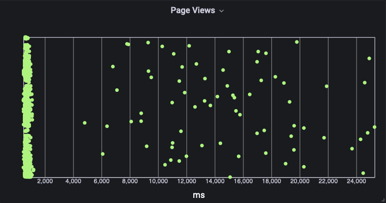

# Percentiles ముఖ్యమైనవి

Percentiles monitoring మరియు reporting లో ముఖ్యమైనవి ఎందుకంటే అవి averages పై మాత్రమే ఆధారపడటం కంటే data distribution యొక్క మరింత వివరమైన మరియు ఖచ్చితమైన view ను అందిస్తాయి. average కొన్నిసార్లు outliers లేదా data లో variations వంటి ముఖ్యమైన సమాచారాన్ని దాచవచ్చు, ఇది performance మరియు user experience ను గణనీయంగా ప్రభావితం చేయవచ్చు. Percentiles మరోవైపు, ఈ దాగిన వివరాలను వెల్లడించగలవు మరియు data ఎలా distribute అయిందో మెరుగైన అవగాహన ఇస్తాయి.

[Amazon CloudWatch](https://aws.amazon.com/cloudwatch/) లో, percentiles మీ applications మరియు infrastructure అంతటా response times, latency, మరియు error rates వంటి వివిధ metrics ను monitor మరియు report చేయడానికి ఉపయోగించవచ్చు. Percentiles పై alarms set చేయడం ద్వారా, నిర్దిష్ట percentile values thresholds ను exceed చేసినప్పుడు మీకు alert వస్తుంది, ఇది మరింత ఎక్కువ customers ను impact చేయడానికి ముందు action తీసుకోవడానికి అనుమతిస్తుంది.

[CloudWatch లో percentiles](https://docs.aws.amazon.com/AmazonCloudWatch/latest/monitoring/cloudwatch_concepts.html#Percentiles) ఉపయోగించడానికి, CloudWatch console లో **All metrics** లో మీ metric ను ఎంచుకోండి మరియు ఇప్పటికే ఉన్న metric ఉపయోగించి **statistic** ను **p99** కి set చేయండి, తర్వాత మీకు కావలసిన percentile కి p తర్వాత value ను edit చేయవచ్చు. మీరు percentile graphs చూడవచ్చు, వాటిని [CloudWatch dashboards](https://docs.aws.amazon.com/AmazonCloudWatch/latest/monitoring/CloudWatch_Dashboards.html) కు add చేయవచ్చు మరియు ఈ metrics పై alarms set చేయవచ్చు. ఉదాహరణకు, response times యొక్క 95th percentile నిర్దిష్ట threshold ను exceed చేసినప్పుడు notify చేయడానికి alarm set చేయవచ్చు, ఇది users యొక్క significant percentage slow response times అనుభవిస్తున్నారని సూచిస్తుంది.

కింది histogram [Amazon Managed Grafana](https://aws.amazon.com/grafana/) లో [CloudWatch RUM](https://docs.aws.amazon.com/AmazonCloudWatch/latest/monitoring/CloudWatch-RUM.html) logs నుండి [CloudWatch Logs Insights](https://docs.aws.amazon.com/AmazonCloudWatch/latest/logs/AnalyzingLogData.html) query ఉపయోగించి సృష్టించబడింది. ఉపయోగించిన query:

```
fields @timestamp, event_details.duration
| filter event_type = "com.amazon.rum.performance_navigation_event"
| sort @timestamp desc
```

histogram page load time ను milliseconds లో plot చేస్తుంది. ఈ view తో, outliers ను స్పష్టంగా చూడవచ్చు. average ఉపయోగిస్తే ఈ data దాగి ఉంటుంది.



average value ఉపయోగించి CloudWatch లో చూపించిన అదే data pages రెండు seconds లోపు load అవుతున్నాయని సూచిస్తుంది. పై histogram నుండి, చాలా pages నిజానికి ఒక second లోపు load అవుతున్నాయని మరియు మనకు outliers ఉన్నాయని చూడవచ్చు.


percentile (p99) తో అదే data మళ్ళీ ఉపయోగించడం సమస్య ఉందని సూచిస్తుంది, CloudWatch graph ఇప్పుడు 99 percent page loads 23 seconds లోపు జరుగుతున్నాయని చూపిస్తుంది.


దీనిని visualize చేయడం సులభం చేయడానికి, కింది graphs average value ను 99th percentile తో compare చేస్తాయి. ఈ case లో, target page load time రెండు seconds, ఇతర calculations చేయడానికి ప్రత్యామ్నాయ [CloudWatch statistics](https://docs.aws.amazon.com/AmazonCloudWatch/latest/monitoring/Statistics-definitions.html#Percentile-versus-Trimmed-Mean) మరియు [metric math](https://docs.aws.amazon.com/AmazonCloudWatch/latest/monitoring/using-metric-math.html) ఉపయోగించడం సాధ్యం. ఈ case లో Percentile rank (PR) **PR(:2000)** statistic తో ఉపయోగించబడింది, 92.7% page loads 2000ms target లోపు జరుగుతున్నాయని చూపించడానికి.


CloudWatch లో percentiles ఉపయోగించడం మీ system యొక్క performance లోకి deeper insights పొందడానికి, issues ను ముందుగానే detect చేయడానికి, మరియు లేకపోతే దాగి ఉండే outliers ను identify చేయడం ద్వారా మీ customer యొక్క experience ను improve చేయడానికి సహాయపడుతుంది.


