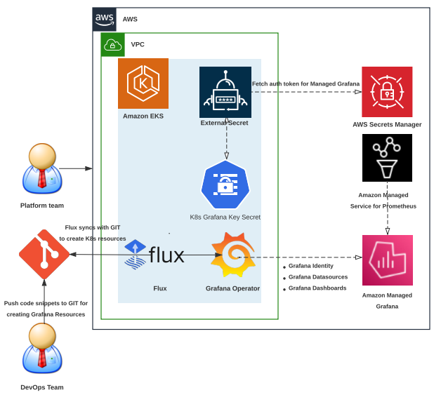

# Amazon Managed Grafana తో GitOps మరియు Grafana Operator ఉపయోగించడం

## ఈ గైడ్ ఎలా ఉపయోగించాలి

ఈ Observability best practices గైడ్ మీ Amazon EKS cluster పై Kubernetes operator గా [grafana-operator](https://github.com/grafana-operator/grafana-operator#:~:text=The%20grafana%2Doperator%20is%20a,an%20easy%20and%20scalable%20way.) ను ఉపయోగించి Amazon Managed Grafana లో Grafana resources మరియు Grafana dashboards యొక్క lifecycle ను Kubernetes native పద్ధతిలో సృష్టించడం మరియు నిర్వహించడం ఎలాగో అర్థం చేసుకోవాలనుకునే developers మరియు architects కోసం ఉద్దేశించబడింది.

## పరిచయం

Customers open source analytics మరియు monitoring solution కోసం observability platform గా Grafana ను ఉపయోగిస్తారు. Amazon EKS లో తమ workloads అమలు చేస్తున్న customers Cloud resources వంటి external resources యొక్క lifecycle ను deploy చేయడానికి మరియు నిర్వహించడానికి workload gravity వైపు తమ దృష్టిని మార్చాలని మరియు Kubernetes-native controllers పై ఆధారపడాలని మేము గమనించాము. AWS services సృష్టించడానికి, deploy చేయడానికి మరియు నిర్వహించడానికి customers [AWS Controllers for Kubernetes (ACK)](https://aws-controllers-k8s.github.io/community/docs/community/overview/) install చేస్తున్నట్లు మేము చూశాము. చాలా మంది customers ఈ రోజుల్లో Prometheus మరియు Grafana implementations ను managed services కు offload చేయడానికి opt చేస్తారు మరియు AWS విషయంలో ఈ services వారి workloads monitor చేయడానికి [Amazon Managed Service for Prometheus](https://docs.aws.amazon.com/prometheus/?icmpid=docs_homepage_mgmtgov) మరియు [Amazon Managed Grafana](https://docs.aws.amazon.com/grafana/?icmpid=docs_homepage_mgmtgov).

Grafana ఉపయోగిస్తున్నప్పుడు customers ఎదుర్కొనే ఒక సాధారణ సవాలు ఏమిటంటే, తమ Kubernetes cluster నుండి Amazon Managed Grafana వంటి external Grafana instances లో Grafana resources మరియు Grafana dashboards యొక్క lifecycle ను సృష్టించడం మరియు నిర్వహించడం. Amazon Managed Grafana లో Grafana resources సృష్టించడం కూడా కలిగి ఉన్న Git based workflows ఉపయోగించి తమ మొత్తం system యొక్క infrastructure మరియు application deployment ను పూర్తిగా automate చేయడానికి మరియు నిర్వహించడానికి మార్గాలు కనుగొనడంలో customers సవాళ్ళను ఎదుర్కొంటారు. ఈ Observability best practices గైడ్‌లో, మేము కింది topics పై focus చేస్తాము:

* Grafana Operator పరిచయం - మీ Kubernetes cluster నుండి external Grafana instances ను manage చేయడానికి ఒక Kubernetes operator
* GitOps పరిచయం - Git based workflows ఉపయోగించి మీ infrastructure ను సృష్టించడానికి మరియు నిర్వహించడానికి Automated mechanisms
* Amazon Managed Grafana నిర్వహించడానికి Amazon EKS పై Grafana Operator ఉపయోగించడం
* Amazon Managed Grafana నిర్వహించడానికి Amazon EKS పై Flux తో GitOps ఉపయోగించడం

## Grafana Operator పరిచయం

[grafana-operator](https://github.com/grafana-operator/grafana-operator#:~:text=The%20grafana%2Doperator%20is%20a,an%20easy%20and%20scalable%20way.) అనేది Kubernetes లోపల మీ Grafana instances ను manage చేయడంలో సహాయపడటానికి నిర్మించబడిన Kubernetes operator. Grafana Operator బహుళ instances మధ్య సులభమైన మరియు scalable పద్ధతిలో Grafana dashboards, datasources మొదలైనవి declaratively manage చేయడానికి మరియు సృష్టించడానికి మీకు సాధ్యమవుతుంది. Grafana operator ఇప్పుడు Amazon Managed Grafana వంటి external environments లో host చేయబడిన dashboards, datasources మొదలైన resources ను manage చేయడానికి support ఇస్తుంది. ఇది చివరికి Amazon EKS cluster నుండి Amazon Managed Grafana లో resources యొక్క lifecycle ను సృష్టించడానికి మరియు నిర్వహించడానికి [Flux](https://fluxcd.io/) వంటి CNCF projects ఉపయోగించి GitOps mechanisms ఉపయోగించడానికి మనకు అనుమతిస్తుంది.

## GitOps పరిచయం

### GitOps మరియు Flux అంటే ఏమిటి

GitOps అనేది deployment configurations కోసం Git ను source of truth గా ఉపయోగించే software development మరియు operations methodology. ఇది application లేదా infrastructure యొక్క desired state ను Git repository లో ఉంచడం మరియు మార్పులను manage చేయడానికి మరియు deploy చేయడానికి Git-based workflows ఉపయోగించడం. GitOps అనేది application మరియు infrastructure deployment ను manage చేయడానికి ఒక మార్గం, తద్వారా మొత్తం system Git repository లో declaratively describe చేయబడుతుంది. ఇది version control, immutable artifacts మరియు automation యొక్క best practices ను leverage చేస్తూ బహుళ Kubernetes clusters యొక్క state ను manage చేయగల operational model ను అందిస్తుంది.

Flux అనేది Kubernetes పై applications deployment ను automate చేసే GitOps tool. ఇది Git repository యొక్క state ను నిరంతరం monitor చేయడం మరియు cluster కు ఏవైనా మార్పులను apply చేయడం ద్వారా పనిచేస్తుంది. Flux GitHub, [GitLab](https://dzone.com/articles/auto-deploy-spring-boot-app-using-gitlab-cicd/) మరియు Bitbucket వంటి వివిధ Git providers తో integrate అవుతుంది. Repository కు మార్పులు చేసినప్పుడు, Flux వాటిని స్వయంచాలకంగా detect చేసి cluster ను accordingly update చేస్తుంది.

### Flux ఉపయోగించడం యొక్క ప్రయోజనాలు

* **Automated deployments**: Flux deployment process ను automate చేస్తుంది, manual errors ను తగ్గిస్తుంది మరియు developers ను ఇతర tasks పై focus చేయడానికి free చేస్తుంది.
* **Git-based workflow**: Flux Git ను source of truth గా leverage చేస్తుంది, ఇది మార్పులను track చేయడం మరియు revert చేయడం సులభతరం చేస్తుంది.
* **Declarative configuration**: Flux cluster యొక్క desired state ను define చేయడానికి [Kubernetes](https://dzone.com/articles/kubernetes-full-stack-example-with-kong-ingress-co/) manifests ఉపయోగిస్తుంది, ఇది మార్పులను manage చేయడం మరియు track చేయడం సులభతరం చేస్తుంది.

### Flux స్వీకరించడంలో సవాళ్ళు

* **పరిమిత customization**: Flux పరిమిత set of customizations ను మాత్రమే support ఇస్తుంది, ఇది అన్ని use cases కు suitable కాకపోవచ్చు.
* **నిట్టనిలువు learning curve**: Flux కొత్త users కోసం steep learning curve కలిగి ఉంది మరియు Kubernetes మరియు Git యొక్క లోతైన అవగాహన అవసరం.

## Amazon Managed Grafana లో resources నిర్వహించడానికి Amazon EKS పై Grafana Operator ఉపయోగించడం

మునుపటి section లో చర్చించినట్లు, Grafana Operator Kubernetes native పద్ధతిలో Amazon Managed Grafana లో resources యొక్క lifecycle ను సృష్టించడానికి మరియు నిర్వహించడానికి మన Kubernetes cluster ను ఉపయోగించడానికి మనకు అనుమతిస్తుంది. దిగువ architecture diagram Kubernetes cluster ను control plane గా ఉపయోగించి Grafana Operator తో AMG తో identity setup చేయడం, Amazon Managed Service for Prometheus ను data source గా add చేయడం మరియు Amazon EKS cluster నుండి Kubernetes native పద్ధతిలో Amazon Managed Grafana పై dashboards సృష్టించడం యొక్క demonstration ను చూపిస్తుంది.

మీ Amazon EKS cluster పై పై solution ను deploy చేయడం యొక్క వివరమైన demonstration కోసం [Using Open Source Grafana Operator on your Kubernetes cluster to manage Amazon Managed Grafana](https://aws.amazon.com/blogs/mt/using-open-source-grafana-operator-on-your-kubernetes-cluster-to-manage-amazon-managed-grafana/) పై మా post చూడండి.

## Amazon Managed Grafana లో resources నిర్వహించడానికి Amazon EKS పై Flux తో GitOps ఉపయోగించడం

పైన చర్చించినట్లు, Flux Kubernetes పై applications deployment ను automate చేస్తుంది. ఇది GitHub వంటి Git repository యొక్క state ను నిరంతరం monitor చేయడం ద్వారా పనిచేస్తుంది మరియు repository కు మార్పులు చేసినప్పుడు, Flux వాటిని స్వయంచాలకంగా detect చేసి cluster ను accordingly update చేస్తుంది. దిగువ architecture ను reference చేయండి, ఇక్కడ మీ Kubernetes cluster నుండి Grafana Operator మరియు Flux ఉపయోగించి GitOps mechanisms ద్వారా Amazon Managed Service for Prometheus ను data source గా add చేయడం మరియు Kubernetes native పద్ధతిలో Amazon Managed Grafana లో dashboards సృష్టించడం ఎలాగో demonstrate చేస్తాము.

దయచేసి మా One Observability Workshop module - [GitOps with Amazon Managed Grafana](https://catalog.workshops.aws/observability/en-US/aws-managed-oss/gitops-with-amg) చూడండి. ఈ module మీ EKS cluster పై కింది "Day 2" operational tooling ను setup చేస్తుంది:

* AWS Secret Manager నుండి Amazon Managed Grafana secrets చదవడానికి [External Secrets Operator](https://github.com/external-secrets/external-secrets/tree/main/deploy/charts/external-secrets) విజయవంతంగా install చేయబడింది
* Memory, disk మరియు CPU utilization వంటి వివిధ machine resources ను measure చేయడానికి [Prometheus Node Exporter](https://github.com/prometheus/node_exporter)
* Kubernetes native పద్ధతిలో Amazon Managed Grafana లో resources యొక్క lifecycle ను సృష్టించడానికి మరియు నిర్వహించడానికి మన Kubernetes cluster ను ఉపయోగించడానికి [Grafana Operator](https://github.com/grafana-operator/grafana-operator)
* GitOps mechanisms ఉపయోగించి Kubernetes పై applications deployment ను automate చేయడానికి [Flux](https://fluxcd.io/)

## ముగింపు

Observability best practices గైడ్ యొక్క ఈ section లో, Amazon Managed Grafana తో Grafana Operator మరియు GitOps ఉపయోగించడం గురించి మేము నేర్చుకున్నాము. మేము GitOps మరియు Grafana Operator గురించి నేర్చుకోవడంతో ప్రారంభించాము. తర్వాత Amazon Managed Grafana లో resources నిర్వహించడానికి Amazon EKS పై Grafana Operator ఎలా ఉపయోగించాలో మరియు AMG తో identity setup చేయడం, Amazon EKS cluster నుండి Kubernetes native పద్ధతిలో Amazon Managed Grafana పై AWS data sources add చేయడం కోసం Amazon EKS పై Flux తో GitOps ఎలా ఉపయోగించాలో focus చేసాము.
