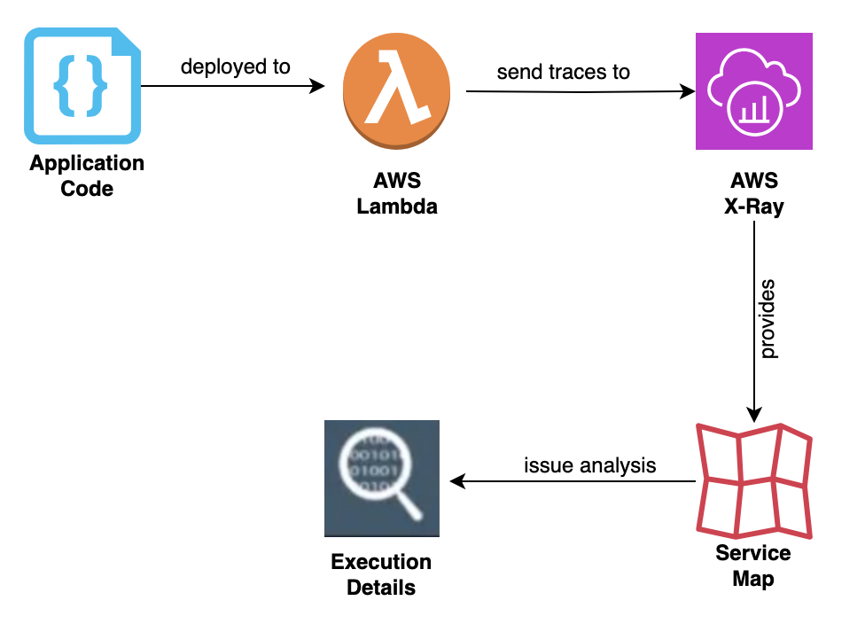

# AWS X-Ray తో Lambda Tracing

Serverless computing ప్రపంచంలో, మీ అప్లికేషన్‌ల reliability, performance మరియు efficiency ను నిర్ధారించడానికి observability చాలా కీలకం. AWS Lambda, serverless architectures యొక్క మూలస్తంభం, underlying infrastructure ను manage చేయాల్సిన అవసరం లేకుండా event-driven code ను run చేయడానికి శక్తివంతమైన మరియు scalable platform ను అందిస్తుంది. అయితే, అప్లికేషన్‌లు మరింత distributed మరియు complex అవుతున్నప్పుడు, సాంప్రదాయ logging మరియు monitoring techniques end-to-end request flow మరియు performance యొక్క సమగ్ర view ను అందించడంలో తరచుగా తక్కువగా ఉంటాయి.

AWS X-Ray ఈ సవాలును AWS Lambda తో నిర్మించిన serverless అప్లికేషన్‌ల కోసం observability ను మెరుగుపరిచే శక్తివంతమైన distributed tracing service ను అందించడం ద్వారా పరిష్కరిస్తుంది. మీ Lambda functions తో AWS X-Ray ను integrate చేయడం ద్వారా, మీ అప్లికేషన్ behavior మరియు performance గురించి లోతైన అంతర్దృష్టులను పొందడానికి మిమ్మల్ని అనుమతించే అనేక ప్రయోజనాలు మరియు సామర్థ్యాలను unlock చేయవచ్చు:

1. **End-to-End దృశ్యమానత**: AWS X-Ray requests మీ Lambda functions మరియు ఇతర AWS services ద్వారా ప్రవహించినప్పుడు వాటిని trace చేస్తుంది, ఒక request యొక్క పూర్తి lifecycle యొక్క end-to-end view ను అందిస్తుంది. ఈ దృశ్యమానత వివిధ components మధ్య interactions ను అర్థం చేసుకోవడానికి మరియు సంభావ్య bottlenecks లేదా సమస్యలను మరింత సమర్థవంతంగా గుర్తించడానికి సహాయపడుతుంది.

2. **Performance విశ్లేషణ**: X-Ray మీ Lambda functions కోసం execution times, cold start latencies మరియు error rates వంటి వివరమైన performance metrics ను సేకరిస్తుంది. ఈ metrics మీ serverless అప్లికేషన్‌ల performance ను విశ్లేషించడానికి, performance hotspots ను గుర్తించడానికి మరియు resource utilization ను optimize చేయడానికి మిమ్మల్ని అనుమతిస్తాయి.

3. **Distributed Tracing**: Serverless architectures లో, requests తరచుగా బహుళ Lambda functions మరియు ఇతర AWS services ను దాటుతాయి. AWS X-Ray ఈ distributed traces యొక్క unified view ను అందిస్తుంది, వివిధ components మధ్య interactions ను అర్థం చేసుకోవడానికి మరియు మీ మొత్తం అప్లికేషన్ అంతటా performance data ను correlate చేయడానికి మిమ్మల్ని అనుమతిస్తుంది.

4. **Service Map దృశ్యీకరణ**: X-Ray మీ అప్లికేషన్ components మరియు వాటి interactions యొక్క visual representation ను అందించే dynamic service maps ను ఉత్పత్తి చేస్తుంది. ఈ service maps మీ serverless architecture యొక్క complexity ను అర్థం చేసుకోవడానికి మరియు optimization లేదా refactoring కోసం సంభావ్య ప్రాంతాలను గుర్తించడానికి సహాయపడతాయి.

5. **AWS Services తో Integration**: AWS X-Ray AWS Lambda, API Gateway, Amazon DynamoDB మరియు Amazon SQS సహా విస్తృత AWS services తో సజావుగా integrate అవుతుంది. ఈ integration బహుళ services అంతటా requests ను trace చేయడానికి మరియు ఇతర AWS services నుండి logs మరియు metrics తో performance data ను correlate చేయడానికి మిమ్మల్ని అనుమతిస్తుంది.

6. **Custom Instrumentation**: AWS X-Ray AWS Lambda functions కోసం out-of-the-box instrumentation ను అందిస్తుండగా, AWS X-Ray SDKs ను ఉపయోగించి Lambda functions లోని మీ custom code ను కూడా instrument చేయవచ్చు. ఈ సామర్థ్యం మీ custom logic యొక్క performance ను trace చేయడానికి మరియు విశ్లేషించడానికి మిమ్మల్ని అనుమతిస్తుంది, మీ అప్లికేషన్ behavior యొక్క మరింత సమగ్ర view ను అందిస్తుంది.

*Figure 1: Lambda నుండి X-Ray కు traces పంపడం*

మీ Lambda functions కోసం మెరుగైన observability కోసం AWS X-Ray ను ఉపయోగించడానికి, మీరు ఈ సాధారణ దశలను అనుసరించాలి:

1. **X-Ray Tracing ను Enable చేయండి**: function configuration ను update చేయడం ద్వారా లేదా AWS Lambda console లేదా AWS Serverless Application Model (SAM) ను ఉపయోగించి మీ AWS Lambda functions లో active tracing ను enable చేయడానికి configure చేయండి.

2. **Custom Code ను Instrument చేయండి (ఐచ్ఛికం)**: మీ Lambda functions లో custom code ఉంటే, మీ code ను instrument చేయడానికి మరియు X-Ray కు అదనపు trace data ను emit చేయడానికి AWS X-Ray SDKs ను ఉపయోగించవచ్చు.

3. **Trace Data ను విశ్లేషించండి**: trace data ను విశ్లేషించడానికి, service maps ను చూడటానికి మరియు మీ Lambda functions మరియు serverless అప్లికేషన్‌లలో performance సమస్యలు లేదా bottlenecks ను investigate చేయడానికి AWS X-Ray console లేదా APIs ను ఉపయోగించండి.

4. **Alerts మరియు Notifications సెట్ చేయండి**: మీ Lambda functions లో performance degradation లేదా anomalies కోసం alerts అందుకోడానికి X-Ray metrics ఆధారంగా CloudWatch alarms మరియు notifications ను configure చేయండి.

5. **ఇతర Observability Tools తో Integrate చేయండి**: మీ Lambda functions performance, logs మరియు metrics యొక్క సమగ్ర view పొందడానికి AWS X-Ray ను AWS CloudWatch Logs, Amazon CloudWatch Metrics మరియు AWS Lambda Insights వంటి ఇతర observability tools తో కలపండి.

AWS X-Ray Lambda functions కోసం శక్తివంతమైన tracing సామర్థ్యాలను అందిస్తుండగా, trace data volume మరియు cost management వంటి సంభావ్య సవాళ్లను పరిగణించడం ముఖ్యం. మీ serverless అప్లికేషన్‌లు scale అయి మరింత trace data ను generate చేసినప్పుడు, ఖర్చులను సమర్థవంతంగా నిర్వహించడానికి sampling strategies ను implement చేయడం లేదా trace data retention policies ను adjust చేయడం అవసరం కావచ్చు.

అదనంగా, మీ trace data కోసం సరైన access control మరియు data security ను నిర్ధారించడం చాలా కీలకం. AWS X-Ray rest మరియు transit లో trace data కోసం encryption ను అందిస్తుంది, అలాగే మీ trace data యొక్క confidentiality మరియు integrity ను రక్షించడానికి granular access control mechanisms ను అందిస్తుంది.

ముగింపుగా, మీ AWS Lambda functions తో AWS X-Ray ను integrate చేయడం serverless అప్లికేషన్‌ల కోసం observability ను మెరుగుపరచడానికి శక్తివంతమైన విధానం. Requests ను end-to-end గా trace చేయడం మరియు వివరమైన performance metrics ను అందించడం ద్వారా, AWS X-Ray సమస్యలను మరింత సమర్థవంతంగా గుర్తించడానికి మరియు troubleshoot చేయడానికి, resource utilization ను optimize చేయడానికి, మరియు మీ serverless అప్లికేషన్‌ల behavior మరియు performance గురించి లోతైన అంతర్దృష్టులను పొందడానికి మిమ్మల్ని శక్తివంతం చేస్తుంది. AWS X-Ray మరియు ఇతర AWS observability services యొక్క integration తో, మీరు cloud లో అత్యంత observable, reliable మరియు performant serverless అప్లికేషన్‌లను నిర్మించగలరు మరియు నిర్వహించగలరు.
