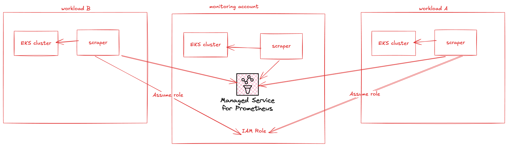

# Amazon Managed Prometheus క్రాస్ అకౌంట్ స్క్రేపింగ్

Amazon Managed Service for Prometheus పూర్తిగా నిర్వహించబడే, ఏజెంట్ లెస్ స్క్రేపర్ లేదా కలెక్టర్‌ను అందిస్తుంది, ఇది Prometheus-అనుకూల మెట్రిక్స్‌ను ఆటోమేటిక్‌గా కనుగొని పుల్ చేస్తుంది. మీరు ఏజెంట్‌లు లేదా స్క్రేపర్‌లను నిర్వహించడం, ఇన్‌స్టాల్ చేయడం, ప్యాచ్ చేయడం లేదా మెయింటెయిన్ చేయడం అవసరం లేదు. Amazon Managed Service for Prometheus కలెక్టర్ మీ Amazon EKS క్లస్టర్ కోసం విశ్వసనీయమైన, స్థిరమైన, అధిక అందుబాటు కలిగిన, ఆటోమేటిక్‌గా స్కేల్ అయ్యే మెట్రిక్స్ సేకరణను అందిస్తుంది. Amazon Managed Service for Prometheus మేనేజ్డ్ కలెక్టర్‌లు EC2 మరియు Fargate తో సహా Amazon EKS క్లస్టర్‌లతో పని చేస్తాయి.

Amazon Managed Service for Prometheus కలెక్టర్ స్క్రేపర్ సృష్టించేటప్పుడు నిర్దేశించిన ప్రతి సబ్‌నెట్‌కు ఒక Elastic Network Interface (ENI) సృష్టిస్తుంది. కలెక్టర్ ఈ ENIల ద్వారా మెట్రిక్స్‌ను స్క్రేప్ చేస్తుంది, మరియు VPC ఎండ్‌పాయింట్ ఉపయోగించి మీ Amazon Managed Service for Prometheus వర్క్‌స్పేస్‌కు డేటాను పుష్ చేయడానికి remote_write ఉపయోగిస్తుంది. స్క్రేప్ చేసిన డేటా పబ్లిక్ ఇంటర్నెట్‌లో ఎప్పుడూ ప్రయాణించదు.

మీ Amazon EKS క్లస్టర్ (సోర్స్ అకౌంట్) Amazon Managed Service for Prometheus వర్క్‌స్పేస్ (టార్గెట్ అకౌంట్) కంటే వేరే ఖాతాలో ఉన్నప్పుడు క్రాస్-అకౌంట్ సెటప్‌లో స్క్రేపర్ సృష్టించడానికి, క్రింది ప్రక్రియను ఉపయోగించండి.

## ఉన్నత-స్థాయి ఆర్కిటెక్చర్


*చిత్రం 1: AMP Managed Collector Cross Account Scraping, Collector Infrastructure పూర్తిగా AWS ద్వారా నిర్వహించబడుతుంది*

ఈ ఆర్కిటెక్చర్‌లో మేము EKS వర్క్‌లోడ్ ఉన్న ఖాతాలో స్క్రేపర్‌లను సృష్టిస్తాము. స్క్రేపర్‌లు టార్గెట్ ఖాతాలోని AMP వర్క్‌స్పేస్‌కు డేటాను పుష్ చేయడానికి టార్గెట్ ఖాతాలో ఒక రోల్‌ను assume చేయగలవు.

1. సోర్స్ ఖాతాలో, STS::AssumeRole అనుమతులతో arn:aws:iam::account_id_source:role/Source రోల్ సృష్టించి ఈ క్రింది trust policy జోడించండి.

```
{
    "Version": "2012-10-17",
    "Statement": [
        {
            "Sid": "",
            "Effect": "Allow",
            "Principal": {
                "Service": "scraper.aps.amazonaws.com"
            },
            "Action": "sts:AssumeRole",
            "Condition": {
                "ArnEquals": {
                    "aws:SourceArn": "$SCRAPER_ARN"
                },
                "StringEquals": {
                    "AWS:SourceAccount": "$ACCOUNT_ID"
                }
            }
        }
    ]
}
```

మీకు assume role permissions policy కూడా అవసరం:

```
{
    "Version": "2012-10-17",
    "Statement": [
        {
            "Sid": "VisualEditor0",
            "Effect": "Allow",
            "Action": "sts:AssumeRole",
            "Resource": "$TARGET_ACCOUNT_ROLE_ARN"
        }
    ]
}
```

:::warning

మేము స్క్రేపర్‌ను వాస్తవంగా సృష్టించే ముందు IAM నిర్మాణాలను తయారు చేయాలి. అందువల్ల ఈ సమయంలో $SCRAPER_ARN కేవలం ఒక ప్లేస్‌హోల్డర్ ఫీల్డ్. స్క్రేపర్ సృష్టించిన తర్వాత మేము తిరిగి వెళ్ళి దానిని అప్‌డేట్ చేస్తాము. $TARGET_ACCOUNT_ROLE_ARN కూడా స్టెప్ 2 పూర్తయ్యే వరకు ఉనికిలో ఉండదు.

:::

2. సోర్స్ (Amazon EKS క్లస్టర్) మరియు టార్గెట్ (Amazon Managed Service for Prometheus వర్క్‌స్పేస్) ప్రతి కాంబినేషన్‌లో, AmazonPrometheusRemoteWriteAccess కోసం managed permissions policy తో టార్గెట్ ఖాతాలో arn:aws:iam::account_id_target:role/Target రోల్ సృష్టించి ఈ క్రింది trust policy జోడించాలి.

```
{
  "Effect": "Allow",
  "Principal": {
     "AWS": "arn:aws:iam::account_id_source:role/Source"
  },
  "Action": "sts:AssumeRole",
  "Condition": {
     "StringEquals": {
        "sts:ExternalId": "$SCRAPER_ARN"
      }
  }
}
```

:::warning

$SCRAPER_ARN ఇంకా కేవలం ప్లేస్‌హోల్డర్. స్క్రేపర్ సృష్టించిన తర్వాత విలువను అప్‌డేట్ చేస్తాము.

:::

3. సోర్స్ ఖాతాలో (EKS క్లస్టర్ ఉన్న చోట) --role-configuration ఆప్షన్‌తో స్క్రేపర్ సృష్టించండి.

```
aws amp create-scraper \
  --source eksConfiguration="{clusterArn='arn:aws:eks:us-west-2:$SOURCE_ACCOUNT_ID:cluster/$CLUSTER_NAME',subnetIds=[$EKS_SUBNET_IDS]}" \
  --scrape-configuration configurationBlob=<base64-encoded-blob> \
  --destination ampConfiguration="{workspaceArn='arn:aws:aps:us-west-2:$TARGET_ACCOUNT_ID:workspace/$TARGET_AMP_WORKSPACE_ID'}"\
  --role-configuration '{"sourceRoleArn":"arn:aws:iam::$SOURCE_ACCOUNT_ID:role/Source", "targetRoleArn":"arn:aws:iam::$TARGET_ACCOUNT_ID:role/Target"}'
```
:::warning

$VARIABLES ను మీకు నిర్దిష్టమైన విలువలతో భర్తీ చేయండి.

:::

4. స్క్రేపర్ సృష్టిని ధృవీకరించండి (దీనికి ~20 నిమిషాలు పట్టవచ్చు) మరియు స్క్రేపర్ ARN ను గమనించండి.

```
aws amp list-scrapers
{
    "scrapers": [
        {
            "scraperId": "scraper-id",
            "arn": "arn:aws:aps:us-west-2:account_id_source:scraper/scraper-id",
            "roleArn": "arn:aws:iam::account_id_source:role/aws-service-role/scraper.aps.amazonaws.com/AWSServiceRoleForAmazonPrometheusScraperInternal_cc319052-41a3-4",
            "status": {
                "statusCode": "ACTIVE"
            },
            "createdAt": "2024-10-29T16:37:58.789000+00:00",
            "lastModifiedAt": "2024-10-29T16:55:17.085000+00:00",
            "tags": {},
            "source": {
                "eksConfiguration": {
                    "clusterArn": "arn:aws:eks:us-west-2:account_id_source:cluster/xarw",
                    "securityGroupIds": [
                        "sg-security-group-id",
                        "sg-security-group-id"
                    ],
                    "subnetIds": [
                        "subnet-subnet_id"
                    ]
                }
            },
            "destination": {
                "ampConfiguration": {
                    "workspaceArn": "arn:aws:aps:us-west-2:account_id_target:workspace/ws-workspace-id"
                }
            }
        }
```

5. స్టెప్ 4 లోని కమాండ్ నుండి స్క్రేపర్ ARN విలువతో స్టెప్ 1 మరియు 2 లో సృష్టించిన trust policies ను తిరిగి వెళ్ళి అప్‌డేట్ చేయండి.
