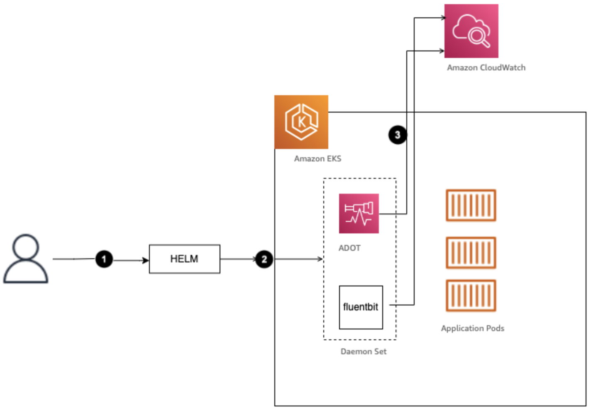

# OpenTelemetry తో Observability

OpenTelemetry అనేది లాగ్‌లు, మెట్రిక్స్ మరియు ట్రేసెస్‌తో సహా టెలిమెట్రీ డేటాను సేకరించడానికి మరియు ఎక్స్‌పోర్ట్ చేయడానికి ప్రామాణిక మార్గాన్ని అందించే ఓపెన్-సోర్స్, వెండర్-న్యూట్రల్ observability ఫ్రేమ్‌వర్క్. OpenTelemetry ను ఉపయోగించడం ద్వారా, సంస్థలు వెండర్ స్వతంత్రతను నిర్ధారిస్తూ మరియు తమ observability వ్యూహాన్ని భవిష్యత్తు-సిద్ధం చేస్తూ సమగ్ర observability పైప్‌లైన్‌ను అమలు చేయగలవు.

## OpenTelemetry తో మెట్రిక్స్ మరియు అంతర్దృష్టులు సేకరించడం

1. **ఇన్‌స్ట్రుమెంటేషన్**: OpenTelemetry ఉపయోగించడంలో మొదటి దశ మీ అప్లికేషన్‌లు మరియు సేవలను OpenTelemetry లైబ్రరీలు లేదా SDKలతో ఇన్‌స్ట్రుమెంట్ చేయడం. ఈ లైబ్రరీలు మీ అప్లికేషన్ కోడ్ నుండి మెట్రిక్స్, ట్రేసెస్ మరియు లాగ్‌లు వంటి టెలిమెట్రీ డేటాను ఆటోమేటిక్‌గా క్యాప్చర్ చేసి ఎక్స్‌పోర్ట్ చేస్తాయి.

2. **మెట్రిక్స్ సేకరణ**: OpenTelemetry మీ అప్లికేషన్ నుండి మెట్రిక్స్‌ను సేకరించడానికి మరియు ఎక్స్‌పోర్ట్ చేయడానికి ప్రామాణిక మార్గాన్ని అందిస్తుంది. ఈ మెట్రిక్స్‌లో సిస్టమ్ మెట్రిక్స్ (CPU, మెమరీ, డిస్క్ వినియోగం), అప్లికేషన్-స్థాయి మెట్రిక్స్ (రిక్వెస్ట్ రేట్‌లు, ఎర్రర్ రేట్‌లు, లేటెన్సీ) మరియు మీ అప్లికేషన్‌కు నిర్దిష్టమైన కస్టమ్ వ్యాపార మెట్రిక్స్ ఉంటాయి.

3. **డిస్ట్రిబ్యూటెడ్ ట్రేసింగ్**: OpenTelemetry డిస్ట్రిబ్యూటెడ్ ట్రేసింగ్‌ను సపోర్ట్ చేస్తుంది, రిక్వెస్ట్‌లు మరియు ఆపరేషన్‌లు మీ డిస్ట్రిబ్యూటెడ్ సిస్టమ్ ద్వారా ప్రచారం అవుతున్నప్పుడు వాటిని ట్రేస్ చేయడానికి మిమ్మల్ని అనుమతిస్తుంది. ఇది రిక్వెస్ట్‌ల ఎండ్-టు-ఎండ్ ఫ్లో గురించి విలువైన అంతర్దృష్టులను అందిస్తుంది, అడ్డంకులను గుర్తించడం మరియు పనితీరు సమస్యలను ట్రబుల్‌షూట్ చేయడం.

4. **లాగింగ్**: OpenTelemetry ప్రాథమికంగా మెట్రిక్స్ మరియు ట్రేసెస్‌పై దృష్టి పెట్టినప్పటికీ, లాగ్ డేటాను క్యాప్చర్ చేసి ఎక్స్‌పోర్ట్ చేయడానికి ఉపయోగించగల స్ట్రక్చర్డ్ లాగింగ్ API ను కూడా అందిస్తుంది. ఇది లాగ్‌లు ఇతర టెలిమెట్రీ డేటాతో సహసంబంధం కలిగి ఉండేలా నిర్ధారిస్తుంది, మీ సిస్టమ్ ప్రవర్తన యొక్క సమగ్ర వ్యూను అందిస్తుంది.

5. **ఎక్స్‌పోర్టర్‌లు**: OpenTelemetry వివిధ బ్యాకెండ్‌లు లేదా observability ప్లాట్‌ఫారమ్‌లకు టెలిమెట్రీ డేటాను పంపడానికి అనుమతించే వివిధ ఎక్స్‌పోర్టర్‌లను సపోర్ట్ చేస్తుంది. ప్రముఖ ఎక్స్‌పోర్టర్‌లలో Prometheus, Jaeger, Zipkin మరియు AWS CloudWatch, Azure Monitor మరియు Google Cloud Operations వంటి క్లౌడ్-నేటివ్ observability సొల్యూషన్‌లు ఉన్నాయి.

6. **డేటా ప్రాసెసింగ్ మరియు విశ్లేషణ**: టెలిమెట్రీ డేటా ఎక్స్‌పోర్ట్ అయిన తర్వాత, సేకరించిన మెట్రిక్స్, ట్రేసెస్ మరియు లాగ్‌లను విశ్లేషించడానికి మరియు విజ్యువలైజ్ చేయడానికి observability ప్లాట్‌ఫారమ్‌లు, మానిటరింగ్ సాధనాలు లేదా కస్టమ్ డేటా ప్రాసెసింగ్ పైప్‌లైన్‌లను ఉపయోగించవచ్చు. ఈ విశ్లేషణ సిస్టమ్ పనితీరుపై అంతర్దృష్టులను అందించగలదు, అడ్డంకులను గుర్తించగలదు మరియు ట్రబుల్‌షూటింగ్ మరియు మూల కారణ విశ్లేషణలో సహాయం చేయగలదు.

*చిత్రం 1: ADOT మరియు FluentBit తో observability సిగ్నల్స్ పంపుతున్న EKS క్లస్టర్*
<!--Ref: https://aws.amazon.com/blogs/architecture/amazon-cloudwatch-insights-for-amazon-eks-on-ec2-using-aws-distro-for-opentelemetry-helm-charts/-->

## OpenTelemetry ఉపయోగించడం వల్ల ప్రయోజనాలు

1. **వెండర్ న్యూట్రాలిటీ**: OpenTelemetry ఒక ఓపెన్-సోర్స్, వెండర్-న్యూట్రల్ ప్రాజెక్ట్, మీ observability వ్యూహం నిర్దిష్ట వెండర్ లేదా ప్లాట్‌ఫారమ్‌కు బంధించబడకుండా నిర్ధారిస్తుంది. ఈ సౌకర్యం అవసరమైనప్పుడు observability బ్యాకెండ్‌ల మధ్య మారడానికి లేదా బహుళ సొల్యూషన్‌లను కలపడానికి మిమ్మల్ని అనుమతిస్తుంది.

2. **ప్రామాణీకరణ**: OpenTelemetry టెలిమెట్రీ డేటాను సేకరించడానికి మరియు ఎక్స్‌పోర్ట్ చేయడానికి ప్రామాణిక మార్గాన్ని అందిస్తుంది, వివిధ కాంపోనెంట్‌లు మరియు సిస్టమ్‌ల మధ్య స్థిరమైన డేటా ఫార్మాట్‌లు మరియు ఇంటర్‌ఆపరబిలిటీని అనుమతిస్తుంది.

3. **భవిష్యత్తు-సిద్ధం**: OpenTelemetry అవలంబించడం ద్వారా, మీ observability వ్యూహాన్ని భవిష్యత్తు-సిద్ధం చేయగలరు. ప్రాజెక్ట్ అభివృద్ధి చెందుతున్నప్పుడు మరియు కొత్త ఫీచర్‌లు మరియు ఇంటిగ్రేషన్‌లు జోడించబడినప్పుడు, గణనీయమైన కోడ్ మార్పుల అవసరం లేకుండా మీ ప్రస్తుత ఇన్‌స్ట్రుమెంటేషన్‌ను సులభంగా అప్‌డేట్ చేయవచ్చు.

4. **సమగ్ర Observability**: OpenTelemetry బహుళ టెలిమెట్రీ సిగ్నల్స్ (మెట్రిక్స్, ట్రేసెస్ మరియు లాగ్‌లు) ను సపోర్ట్ చేస్తుంది, మీ సిస్టమ్ ప్రవర్తన మరియు పనితీరు యొక్క సమగ్ర వ్యూను అందిస్తుంది.

5. **ఎకోసిస్టమ్ మరియు కమ్యూనిటీ సపోర్ట్**: OpenTelemetry కు ఇంటిగ్రేషన్‌లు, సాధనాలు మరియు కంట్రిబ్యూటర్‌ల శక్తివంతమైన కమ్యూనిటీతో పెరుగుతున్న ఎకోసిస్టమ్ ఉంది, నిరంతర అభివృద్ధి మరియు సపోర్ట్‌ను నిర్ధారిస్తుంది.

Observability కోసం OpenTelemetry ను ఉపయోగించడం ద్వారా, సంస్థలు తమ సిస్టమ్‌లపై లోతైన అంతర్దృష్టులను పొందగలవు, ముందస్తు మానిటరింగ్, సమర్థవంతమైన ట్రబుల్‌షూటింగ్ మరియు డేటా-ఆధారిత నిర్ణయాధికారాన్ని అనుమతిస్తూ, తమ observability వ్యూహంలో సౌకర్యం మరియు వెండర్ స్వతంత్రతను నిర్వహిస్తాయి.
