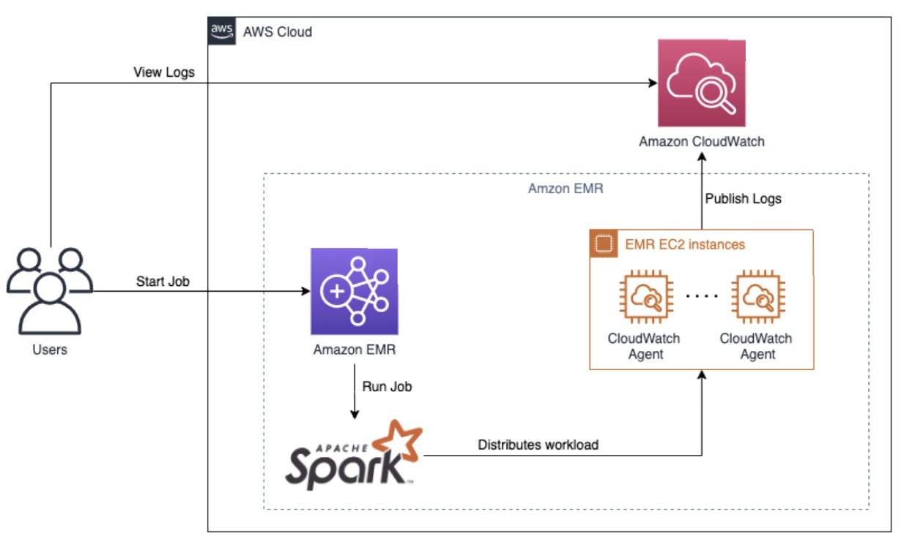

# AWS లో బిగ్ డేటా Observability

ఈ రేఖాచిత్రం AWS లో Spark బిగ్ డేటా వర్క్‌ఫ్లోలో observability ను అమలు చేయడానికి ఉత్తమ పద్ధతి నమూనాను వివరిస్తుంది. ఈ నమూనా Spark జాబ్‌లు ఉత్పత్తి చేసిన లాగ్‌లు మరియు మెట్రిక్స్‌ను సేకరించడానికి, ప్రాసెస్ చేయడానికి మరియు విశ్లేషించడానికి వివిధ AWS సేవలను ఉపయోగిస్తుంది.

*చిత్రం 1: Spark Big Data observability*

## వర్క్‌ఫ్లో

1. **వినియోగదారులు** **Amazon EMR** క్లస్టర్‌కు Spark జాబ్‌లను సబ్మిట్ చేస్తారు.
2. **Amazon EMR** క్లస్టర్ Spark జాబ్‌ను రన్ చేస్తుంది, ఇది **Apache Spark** ఉపయోగించి క్లస్టర్ అంతటా వర్క్‌లోడ్‌ను పంపిణీ చేస్తుంది.
3. Spark జాబ్ ఎగ్జిక్యూషన్ సమయంలో, లాగ్‌లు మరియు మెట్రిక్స్ ఉత్పత్తి చేయబడి **Amazon CloudWatch** మరియు **Amazon EMR** ద్వారా సేకరించబడతాయి.

## Observability కాంపోనెంట్‌లు

### Amazon EMR

Amazon EMR అనేది AWS లో Apache Spark వంటి బిగ్ డేటా ఫ్రేమ్‌వర్క్‌లను రన్ చేయడాన్ని సరళీకృతం చేసే మేనేజ్డ్ సేవ. ఇది పెద్ద పరిమాణాల డేటాను ప్రాసెస్ చేయడానికి స్కేలబుల్ మరియు ఖర్చు-ప్రభావ ప్లాట్‌ఫారమ్‌ను అందిస్తుంది.

### Amazon CloudWatch

Amazon CloudWatch అనేది వివిధ AWS వనరులు మరియు అప్లికేషన్‌ల నుండి మెట్రిక్స్, లాగ్‌లు మరియు ఈవెంట్‌లను సేకరించి ట్రాక్ చేసే మానిటరింగ్ మరియు observability సేవ. ఈ నమూనాలో, CloudWatch ఈ కోసం ఉపయోగించబడుతుంది:

1. Spark జాబ్ రన్ చేస్తున్న **EMR EC2 ఇన్‌స్టాన్స్‌ల** నుండి లాగ్‌లు మరియు మెట్రిక్స్‌ను సేకరించడం.
2. కేంద్రీకృత లాగ్ మేనేజ్‌మెంట్ మరియు విశ్లేషణ కోసం సేకరించిన లాగ్‌లను **Amazon CloudWatch Logs** కు పబ్లిష్ చేయడం.

### EMR EC2 ఇన్‌స్టాన్స్‌లు

Spark జాబ్ EMR EC2 ఇన్‌స్టాన్స్‌లలో రన్ అవుతుంది, ఇవి EMR క్లస్టర్ యొక్క కంప్యూట్ నోడ్‌లు. ఈ ఇన్‌స్టాన్స్‌లు **CloudWatch Agent** ద్వారా సేకరించబడి Amazon CloudWatch కు పంపబడే లాగ్‌లు మరియు మెట్రిక్స్‌ను ఉత్పత్తి చేస్తాయి.

## ఉత్తమ పద్ధతులు

AWS లో Spark బిగ్ డేటా వర్క్‌లోడ్‌ల సమర్థవంతమైన observability నిర్ధారించడానికి, ఈ క్రింది ఉత్తమ పద్ధతులను పరిగణించండి:

1. **కేంద్రీకృత లాగ్ మేనేజ్‌మెంట్**: Spark జాబ్‌లు మరియు EMR ఇన్‌స్టాన్స్‌లు ఉత్పత్తి చేసిన లాగ్‌ల సేకరణ, నిల్వ మరియు విశ్లేషణను కేంద్రీకృతం చేయడానికి Amazon CloudWatch Logs ఉపయోగించండి. ఇది Spark వర్క్‌ఫ్లో యొక్క సులభ ట్రబుల్‌షూటింగ్ మరియు మానిటరింగ్‌ను అనుమతిస్తుంది.

2. **మెట్రిక్స్ సేకరణ**: CPU వినియోగం, మెమరీ వినియోగం మరియు డిస్క్ I/O వంటి EMR EC2 ఇన్‌స్టాన్స్‌ల నుండి సంబంధిత మెట్రిక్స్‌ను సేకరించడానికి CloudWatch Agent ను ఉపయోగించండి. ఈ మెట్రిక్స్ Spark జాబ్ పనితీరు మరియు ఆరోగ్యంపై అంతర్దృష్టులను అందిస్తాయి.

3. **డాష్‌బోర్డ్‌లు మరియు అలారంలు**: రియల్-టైమ్‌లో కీలక మెట్రిక్స్ మరియు లాగ్‌లను విజ్యువలైజ్ చేయడానికి CloudWatch డాష్‌బోర్డ్‌లు సృష్టించండి. నిర్దిష్ట థ్రెషోల్డ్‌లు లేదా అనామలీలు కనుగొనబడినప్పుడు నోటిఫై చేయడానికి మరియు అలర్ట్ చేయడానికి CloudWatch అలారంలు సెటప్ చేయండి, ముందస్తు మానిటరింగ్ మరియు ఇన్సిడెంట్ రెస్పాన్స్‌ను అనుమతిస్తుంది.

4. **లాగ్ అనలిటిక్స్**: యాడ్-హాక్ క్వెరీలు చేయడానికి, సమస్యలను ట్రబుల్‌షూట్ చేయడానికి మరియు సేకరించిన లాగ్‌ల నుండి విలువైన అంతర్దృష్టులు పొందడానికి Amazon CloudWatch Logs Insights ఉపయోగించండి లేదా ఇతర లాగ్ అనలిటిక్స్ సాధనాలతో ఏకీకరించండి.

5. **పనితీరు ఆప్టిమైజేషన్**: సేకరించిన మెట్రిక్స్ మరియు లాగ్‌లను ఉపయోగించి Spark జాబ్‌ల పనితీరును నిరంతరం మానిటర్ చేసి విశ్లేషించండి. అడ్డంకులను గుర్తించండి, వనరుల కేటాయింపును ఆప్టిమైజ్ చేయండి, మరియు బిగ్ డేటా వర్క్‌లోడ్ సమర్థత మరియు పనితీరును మెరుగుపరచడానికి Spark కాన్ఫిగరేషన్‌లను ట్యూన్ చేయండి.

ఈ observability నమూనాను అమలు చేయడం మరియు ఉత్తమ పద్ధతులను అనుసరించడం ద్వారా, సంస్థలు AWS లో తమ Spark బిగ్ డేటా వర్క్‌లోడ్‌లను సమర్థవంతంగా మానిటర్ చేయగలవు, ట్రబుల్‌షూట్ చేయగలవు మరియు ఆప్టిమైజ్ చేయగలవు, స్కేల్‌లో విశ్వసనీయ మరియు సమర్థవంతమైన డేటా ప్రాసెసింగ్‌ను నిర్ధారిస్తాయి.
