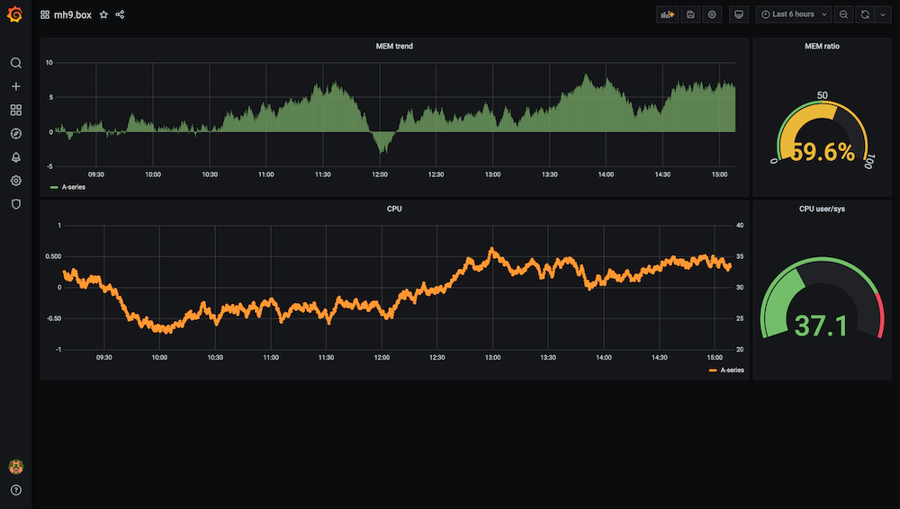

# డైమెన్షన్‌లు

ఈ సైట్ సందర్భంలో మేము o11y స్పేస్‌ను ఆరు డైమెన్షన్‌ల వెంట పరిగణిస్తాము. ప్రతి డైమెన్షన్‌ను స్వతంత్రంగా చూడడం సింథెటిక్ దృష్టికోణం నుండి ప్రయోజనకరం, అంటే, ఇచ్చిన వర్క్‌లోడ్ కోసం ఒక కాంక్రీట్ o11y సొల్యూషన్‌ను నిర్మించడానికి మీరు ప్రయత్నిస్తున్నప్పుడు, ఉపయోగించిన ప్రోగ్రామింగ్ భాష వంటి డెవలపర్-సంబంధిత అంశాలు అలాగే కంటైనర్లు లేదా Lambda ఫంక్షన్ల వంటి రన్‌టైమ్ ఎన్విరాన్‌మెంట్ వంటి ఆపరేషనల్ టాపిక్‌లను విస్తరిస్తుంది.

:::note
    "సిగ్నల్ అంటే ఏమిటి?"
    మేము ఇక్కడ సిగ్నల్ అని చెప్పినప్పుడు లాగ్ ఎంట్రీలు, మెట్రిక్స్ మరియు ట్రేసెస్‌తో సహా ఏ రకమైన o11y డేటా మరియు మెటాడేటా పాయింట్లను అయినా సూచిస్తాము. మనం మరింత నిర్దిష్టంగా ఉండాలనుకునే లేదా ఉండాల్సిన సందర్భాలలో తప్ప, మేము "సిగ్నల్" అని ఉపయోగిస్తాము మరియు ఏ పరిమితులు వర్తిస్తాయో సందర్భం నుండి స్పష్టంగా ఉండాలి.
:::

ఇప్పుడు ఆరు డైమెన్షన్‌లను ఒక్కొక్కటిగా చూద్దాం:

## డెస్టినేషన్‌లు

ఈ డైమెన్షన్‌లో మేము దీర్ఘకాలిక స్టోరేజ్ మరియు సిగ్నల్‌లను వినియోగించడానికి మిమ్మల్ని అనుమతించే గ్రాఫికల్ ఇంటర్‌ఫేస్‌లతో సహా అన్ని రకాల సిగ్నల్ డెస్టినేషన్‌లను పరిగణిస్తాము. డెవలపర్‌గా, మీ సర్వీస్‌ను ట్రబుల్‌షూట్ చేయడానికి సిగ్నల్‌లను కనుగొనడానికి, చూడడానికి మరియు కోరిలేట్ చేయడానికి UI లేదా API కు యాక్సెస్ కావాలి. ఇన్‌ఫ్రాస్ట్రక్చర్ లేదా ప్లాట్‌ఫారమ్ పాత్రలో ఇన్‌ఫ్రాస్ట్రక్చర్ స్థితిని అర్థం చేసుకోవడానికి సిగ్నల్‌లను నిర్వహించడానికి, కనుగొనడానికి, చూడడానికి మరియు కోరిలేట్ చేయడానికి UI లేదా API కు యాక్సెస్ కావాలి.

చివరికి, మానవ దృష్టికోణం నుండి ఇది అత్యంత ఆసక్తికరమైన డైమెన్షన్. అయితే, ప్రయోజనాలను పొందగలగడానికి ముందు మనం కొంచెం పని పెట్టుబడి పెట్టాలి: మన సాఫ్ట్‌వేర్ మరియు బాహ్య డిపెండెన్సీలను ఇన్‌స్ట్రుమెంట్ చేసి సిగ్నల్‌లను డెస్టినేషన్‌లలో ఇన్‌జెస్ట్ చేయాలి.

కాబట్టి, సిగ్నల్‌లు డెస్టినేషన్‌లకు ఎలా చేరుకుంటాయి? మీరు అడిగారు, ఇది ...

## ఏజెంట్లు

సిగ్నల్‌లు ఎలా సేకరించబడతాయి మరియు ఎనలిటిక్స్‌కు రూట్ చేయబడతాయి. సిగ్నల్‌లు రెండు మూలాల నుండి రావచ్చు: మీ అప్లికేషన్ సోర్స్ కోడ్ (భాషల విభాగం కూడా చూడండి) లేదా మీ అప్లికేషన్ ఆధారపడే విషయాల నుండి, డేటాస్టోర్‌లలో నిర్వహించబడే స్టేట్ అలాగే VPCలు వంటి ఇన్‌ఫ్రాస్ట్రక్చర్ (ఇన్‌ఫ్రా & డేటా విభాగం కూడా చూడండి).

ఏజెంట్లు సిగ్నల్‌లను సేకరించి ఇన్‌జెస్ట్ చేయడానికి మీరు ఉపయోగించే టెలిమెట్రీలో భాగం. మరొక భాగం ఇన్‌స్ట్రుమెంట్ చేసిన అప్లికేషన్లు మరియు డేటాబేస్‌ల వంటి ఇన్‌ఫ్రా భాగాలు.

## భాషలు

ఈ డైమెన్షన్ మీ సర్వీస్ లేదా అప్లికేషన్ రాయడానికి మీరు ఉపయోగించే ప్రోగ్రామింగ్ భాషకు సంబంధించినది. ఇక్కడ, మేము [X-Ray SDKs][xraysdks] వంటి SDKలు మరియు లైబ్రరీలు లేదా [ఇన్‌స్ట్రుమెంటేషన్][otelinst] సందర్భంలో OpenTelemetry అందించేదానితో వ్యవహరిస్తున్నాము. లాగ్‌లు లేదా మెట్రిక్స్ వంటి ఇచ్చిన సిగ్నల్ రకానికి o11y సొల్యూషన్ మీ ఎంపిక ప్రోగ్రామింగ్ భాషకు సపోర్ట్ చేస్తుందని నిర్ధారించుకోవాలి.

## ఇన్‌ఫ్రాస్ట్రక్చర్ & డేటాబేస్‌లు

ఈ డైమెన్షన్‌తో మేము అప్లికేషన్-బాహ్య డిపెండెన్సీల యొక్క ఏ రకాన్ని అయినా సూచిస్తాము, సర్వీస్ నడుస్తున్న VPC వంటి ఇన్‌ఫ్రాస్ట్రక్చర్ అయినా లేదా RDS లేదా DynamoDB వంటి డేటాస్టోర్ లేదా SQS వంటి క్యూ అయినా.

:::tip
    "ఉమ్మడి అంశాలు"
    ఈ డైమెన్షన్‌లోని అన్ని మూలాలకు ఉమ్మడిగా ఉన్న ఒక విషయం ఏమిటంటే అవి మీ అప్లికేషన్ బయట (అలాగే మీ యాప్ నడిచే కంప్యూట్ ఎన్విరాన్‌మెంట్) ఉన్నాయి మరియు దానితో మీరు వాటిని ఒక అపారదర్శక బాక్స్‌గా చూడాలి.
:::

ఈ డైమెన్షన్ కింది వాటిని కలిగి ఉంటుంది కానీ వీటికే పరిమితం కాదు:

- AWS ఇన్‌ఫ్రాస్ట్రక్చర్, ఉదాహరణకు [VPC flow logs][vpcfl].
- [Kubernetes కంట్రోల్ ప్లేన్ లాగ్‌లు][kubecpl] వంటి సెకండరీ APIs.
- [S3][s3mon], [RDS][rdsmon] లేదా [SQS][sqstrace] వంటి డేటాస్టోర్ల నుండి సిగ్నల్‌లు.

## కంప్యూట్ యూనిట్

మీ కోడ్‌ను ప్యాకేజ్ చేయడం, షెడ్యూల్ చేయడం మరియు రన్ చేసే విధానం. ఉదాహరణకు, Lambda లో అది ఒక ఫంక్షన్ మరియు [ECS][ecs] మరియు [EKS][eks] లో ఆ యూనిట్ tasks (ECS) లేదా pods (EKS) లో నడిచే కంటైనర్. Kubernetes వంటి కంటైనరైజ్డ్ ఎన్విరాన్‌మెంట్లు టెలిమెట్రీ డిప్లాయ్‌మెంట్లకు సంబంధించి తరచుగా రెండు ఎంపికలను అనుమతిస్తాయి: సైడ్ కార్లుగా లేదా ప్రతి-నోడ్ (ఇన్‌స్టెన్స్) డేమన్ ప్రాసెస్‌లుగా.

## కంప్యూట్ ఇంజిన్

ఈ డైమెన్షన్ బేస్ రన్‌టైమ్ ఎన్విరాన్‌మెంట్‌ను సూచిస్తుంది, ఇది (EC2 ఇన్‌స్టెన్స్ విషయంలో, ఉదాహరణకు) మీ బాధ్యత కావచ్చు లేదా (Fargate లేదా Lambda వంటి సర్వర్‌లెస్ ఆఫరింగ్‌లు) కాకపోవచ్చు. మీరు ఉపయోగించే కంప్యూట్ ఇంజిన్‌పై ఆధారపడి, టెలిమెట్రీ భాగం ఆఫరింగ్‌లో ఇప్పటికే భాగం కావచ్చు, ఉదాహరణకు, [Fargate పై EKS][firelensef] Fluent Bit ద్వారా ఇంటిగ్రేటెడ్ లాగ్ రూటింగ్ కలిగి ఉంది.

[aes]: https://aws.amazon.com/elasticsearch-service/ "Amazon Elasticsearch Service"
[adot]: https://aws-otel.github.io/ "AWS Distro for OpenTelemetry"
[amg]: https://aws.amazon.com/grafana/ "Amazon Managed Grafana"
[amp]: https://aws.amazon.com/prometheus/ "Amazon Managed Service for Prometheus"
[batch]: https://aws.amazon.com/batch/ "AWS Batch"
[beans]: https://aws.amazon.com/elasticbeanstalk/ "AWS Elastic Beanstalk"
[cw]: https://aws.amazon.com/cloudwatch/ "Amazon CloudWatch"
[dimensions]: ../dimensions
[ec2]: https://aws.amazon.com/ec2/ "Amazon EC2"
[ecs]: https://aws.amazon.com/ecs/ "Amazon Elastic Container Service"
[eks]: https://aws.amazon.com/eks/ "Amazon Elastic Kubernetes Service"
[fargate]: https://aws.amazon.com/fargate/ "AWS Fargate"
[fluentbit]: https://fluentbit.io/ "Fluent Bit"
[firelensef]: https://aws.amazon.com/blogs/containers/fluent-bit-for-amazon-eks-on-aws-fargate-is-here/ "Fluent Bit for Amazon EKS on AWS Fargate is here"
[jaeger]: https://www.jaegertracing.io/ "Jaeger"
[kafka]: https://kafka.apache.org/ "Apache Kafka"
[kubecpl]: https://docs.aws.amazon.com/eks/latest/userguide/control-plane-logs.html "Amazon EKS control plane logging"
[lambda]: https://aws.amazon.com/lambda/ "AWS Lambda"
[lightsail]: https://aws.amazon.com/lightsail/ "Amazon Lightsail"
[otel]: https://opentelemetry.io/ "OpenTelemetry"
[otelinst]: https://opentelemetry.io/docs/concepts/instrumenting/
[promex]: https://prometheus.io/docs/instrumenting/exporters/ "Prometheus exporters and integrations"
[rdsmon]: https://docs.aws.amazon.com/AmazonRDS/latest/UserGuide/Overview.LoggingAndMonitoring.html "Logging and monitoring in Amazon RDS"
[s3]: https://aws.amazon.com/s3/ "Amazon S3"
[s3mon]: https://docs.aws.amazon.com/AmazonS3/latest/userguide/s3-incident-response.html "Logging and monitoring in Amazon S3"
[sqstrace]: https://docs.aws.amazon.com/xray/latest/devguide/xray-services-sqs.html "Amazon SQS and AWS X-Ray"
[vpcfl]: https://docs.aws.amazon.com/vpc/latest/userguide/flow-logs.html "VPC Flow Logs"
[xray]: https://aws.amazon.com/xray/ "AWS X-Ray"
[xraysdks]: https://docs.aws.amazon.com/xray/index.html
