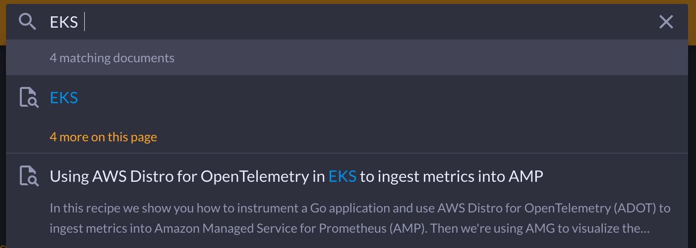

# రెసిపీలు

ఇక్కడ మీరు వివిధ వాడకాలకు observability (o11y) యొక్క అనువర్తనానికి సహాయపడే క్యూరేటెడ్ మార్గదర్శకత్వం, హౌ-టులు మరియు ఇతర వనరులకు లింక్‌లను కనుగొంటారు. ఇందులో [Amazon Managed Service for Prometheus][amp] మరియు [Amazon Managed Grafana][amg] వంటి మేనేజ్డ్ సర్వీసెస్ అలాగే [OpenTelemetry][otel] మరియు [Fluent Bit][fluentbit] వంటి ఏజెంట్లు ఉన్నాయి. ఇక్కడ కంటెంట్ AWS టూల్స్‌కే పరిమితం కాదు, మరియు అనేక ఓపెన్ సోర్స్ ప్రాజెక్ట్‌లు ఇక్కడ రిఫరెన్స్ చేయబడ్డాయి.

మేము డెవలపర్లు మరియు ఇన్‌ఫ్రాస్ట్రక్చర్ వ్యక్తుల అవసరాలను సమానంగా తీర్చాలనుకుంటున్నాము, కాబట్టి చాలా రెసిపీలు "విస్తృత అవకాశాలను" కవర్ చేస్తాయి. మీరు సాధించాలనుకుంటున్న దాని కోసం ఉత్తమంగా పని చేసే పరిష్కారాలను అన్వేషించి కనుగొనమని మేము మిమ్మల్ని ప్రోత్సహిస్తాము.

:::info
    ఇక్కడ కంటెంట్ మా Solutions Architects, Professional Services ద్వారా వాస్తవ కస్టమర్ ఎంగేజ్‌మెంట్ నుండి మరియు ఇతర కస్టమర్ల ఫీడ్‌బ్యాక్ నుండి తీసుకోబడింది. మీరు ఇక్కడ కనుగొనే ప్రతిదీ మా వాస్తవ కస్టమర్లు వారి స్వంత ఎన్విరాన్‌మెంట్లలో అమలు చేశారు.
:::

మేము o11y స్పేస్ గురించి ఆలోచించే విధానం ఇలా ఉంది: మేము దీన్ని [ఆరు డైమెన్షన్‌లుగా][dimensions] విభజిస్తాము, వాటిని మీరు నిర్దిష్ట పరిష్కారానికి చేరుకోవడానికి కలపవచ్చు:

| డైమెన్షన్ | ఉదాహరణలు |
|---------------|--------------|
| డెస్టినేషన్‌లు  | [Prometheus][amp] &middot; [Grafana][amg] &middot; [OpenSearch][aes] &middot; [CloudWatch][cw] &middot; [Jaeger][jaeger] |
| ఏజెంట్లు        | [ADOT][adot] &middot; [Fluent Bit][fluentbit] &middot; CW agent &middot; X-Ray agent |
| భాషలు     | [Java][java] &middot; Python &middot; .NET &middot; [JavaScript][nodejs] &middot; Go &middot; Rust |
| ఇన్‌ఫ్రా & డేటాబేస్‌లు  |  [RDS][rds] &middot; [DynamoDB][dynamodb] &middot; [MSK][msk] |
| కంప్యూట్ యూనిట్ | [Batch][batch] &middot; [ECS][ecs] &middot; [EKS][eks] &middot; [AEB][beans] &middot; [Lambda][lambda] &middot; [AppRunner][apprunner] |
| కంప్యూట్ ఇంజిన్ | [Fargate][fargate] &middot; [EC2][ec2] &middot; [Lightsail][lightsail] |

:::note
    "ఉదాహరణ సొల్యూషన్ అవసరం"
    లాగ్‌లను S3 బకెట్‌లో నిల్వ చేయాలనే లక్ష్యంతో Fargate పై EKS లో నడుస్తున్న Python యాప్ కోసం నాకు లాగింగ్ సొల్యూషన్ కావాలి
:::

ఈ అవసరానికి సరిపోయే ఒక స్టాక్ ఇది:

1. *డెస్టినేషన్*: డేటా యొక్క తదుపరి వినియోగం కోసం S3 బకెట్
1. *ఏజెంట్*: EKS నుండి లాగ్ డేటాను ఎమిట్ చేయడానికి FluentBit
1. *భాష*: Python
1. *ఇన్‌ఫ్రా & DB*: N/A
1. *కంప్యూట్ యూనిట్*: Kubernetes (EKS)
1. *కంప్యూట్ ఇంజిన్*: EC2

ప్రతి డైమెన్షన్ నిర్దేశించబడాల్సిన అవసరం లేదు మరియు కొన్నిసార్లు ఎక్కడ ప్రారంభించాలో నిర్ణయించడం కష్టం. వివిధ మార్గాలను ప్రయత్నించి కొన్ని రెసిపీల యొక్క మంచి చెడులను పోల్చండి.

నావిగేషన్‌ను సరళీకరించడానికి, మేము ఆరు డైమెన్షన్‌లను కింది కేటగిరీలుగా గ్రూప్ చేస్తున్నాము:

- **కంప్యూట్ ప్రకారం**: కంప్యూట్ ఇంజిన్లు మరియు యూనిట్లను కవర్ చేస్తుంది
- **ఇన్‌ఫ్రా & డేటా ప్రకారం**: ఇన్‌ఫ్రాస్ట్రక్చర్ మరియు డేటాబేస్‌లను కవర్ చేస్తుంది
- **భాష ప్రకారం**: భాషలను కవర్ చేస్తుంది
- **డెస్టినేషన్ ప్రకారం**: టెలిమెట్రీ మరియు ఎనలిటిక్స్‌ను కవర్ చేస్తుంది
- **టాస్క్‌లు**: అనామలీ డిటెక్షన్, అలర్టింగ్, ట్రబుల్‌షూటింగ్ మరియు మరిన్నింటిని కవర్ చేస్తుంది

[డైమెన్షన్‌ల గురించి మరింత తెలుసుకోండి ...](https://aws-observability.github.io/observability-best-practices/recipes/dimensions/)

## ఎలా ఉపయోగించాలి

మీరు నిర్దిష్ట ఇండెక్స్ పేజీకి బ్రౌజ్ చేయడానికి టాప్ నావిగేషన్ మెనూను ఉపయోగించవచ్చు, సుమారు ఎంపికతో ప్రారంభించవచ్చు. ఉదాహరణకు, `By Compute` -> `EKS` -> `Fargate` -> `Logs`.

ప్రత్యామ్నాయంగా, `/` లేదా `s` కీ నొక్కి సైట్‌ను సెర్చ్ చేయవచ్చు:

:::info
   "లైసెన్స్"
  ఈ సైట్‌లో ప్రచురించబడిన అన్ని రెసిపీలు [MIT-0][mit0] లైసెన్స్ ద్వారా అందుబాటులో ఉన్నాయి, ఇది సాధారణ MIT లైసెన్స్‌కు మార్పు, ఇది అట్రిబ్యూషన్ అవసరాన్ని తొలగిస్తుంది.
:::

## ఎలా సహకరించాలి

మీరు ఏమి చేయాలనుకుంటున్నారో [చర్చ][discussion] ప్రారంభించండి మరియు మేము అక్కడ నుండి తీసుకుంటాము.

## మరింత తెలుసుకోండి

ఈ సైట్‌లోని రెసిపీలు ఉత్తమ పద్ధతుల సేకరణ. అదనంగా, మేము ఉపయోగించే ఓపెన్ సోర్స్ ప్రాజెక్ట్ల స్థితి గురించి అలాగే రెసిపీల నుండి మేనేజ్డ్ సర్వీసెస్ గురించి మీరు మరింత తెలుసుకోగల అనేక ప్రదేశాలు ఉన్నాయి, కాబట్టి చూడండి:

- [observability @ aws][o11yataws], AWS వ్యక్తులు వారి ప్రాజెక్ట్‌లు మరియు సర్వీసెస్ గురించి మాట్లాడే ప్లేలిస్ట్.
- [AWS observability వర్క్‌షాప్‌లు](https://aws-observability.github.io/observability-best-practices/recipes/workshops/), ఆఫరింగ్‌లను నిర్మాణాత్మక పద్ధతిలో ప్రయత్నించడానికి.
- [AWS మానిటరింగ్ మరియు observability][o11yhome] హోమ్‌పేజీ కేస్ స్టడీలు మరియు పార్ట్‌నర్లకు పాయింటర్లతో.

[aes]: aes.md "Amazon Elasticsearch Service"
[adot]: https://aws-otel.github.io/ "AWS Distro for OpenTelemetry"
[amg]: amg.md "Amazon Managed Grafana"
[amp]: amp.md "Amazon Managed Service for Prometheus"
[batch]: https://aws.amazon.com/batch/ "AWS Batch"
[beans]: https://aws.amazon.com/elasticbeanstalk/ "AWS Elastic Beanstalk"
[cw]: cw.md "Amazon CloudWatch"
[dimensions]: dimensions.md
[dynamodb]: dynamodb.md "Amazon DynamoDB"
[ec2]: https://aws.amazon.com/ec2/ "Amazon EC2"
[ecs]: ecs.md "Amazon Elastic Container Service"
[eks]: eks.md "Amazon Elastic Kubernetes Service"
[fargate]: https://aws.amazon.com/fargate/ "AWS Fargate"
[fluentbit]: https://fluentbit.io/ "Fluent Bit"
[jaeger]: https://www.jaegertracing.io/ "Jaeger"
[kafka]: https://kafka.apache.org/ "Apache Kafka"
[apprunner]: apprunner.md "AWS App Runner"
[lambda]: lambda.md "AWS Lambda"
[lightsail]: https://aws.amazon.com/lightsail/ "Amazon Lightsail"
[otel]: https://opentelemetry.io/ "OpenTelemetry"
[java]: java.md
[nodejs]: nodejs.md
[rds]: rds.md "Amazon Relational Database Service"
[msk]: msk.md "Amazon Managed Streaming for Apache Kafka"
[mit0]: https://github.com/aws/mit-0 "MIT-0"
[discussion]: https://github.com/aws-observability/observability-best-practices/discussions "Discussions"
[o11yataws]: https://www.youtube.com/playlist?list=PLaiiCkpc1U7Wy7XwkpfgyOhIf_06IK3U_ "Observability @ AWS YouTube playlist"
[o11yhome]: https://aws.amazon.com/products/management-and-governance/use-cases/monitoring-and-observability/ "AWS Observability home"
