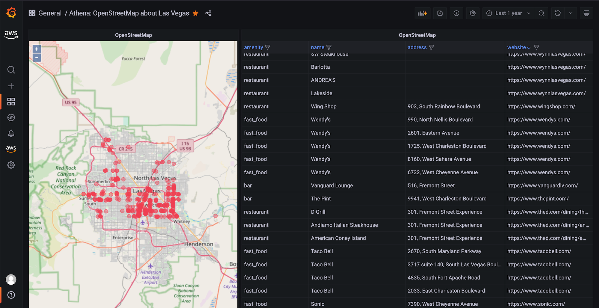
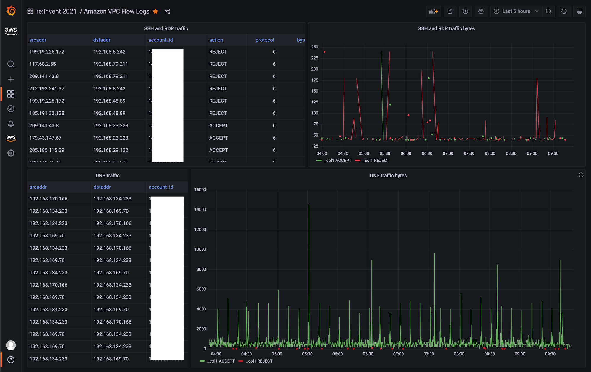

# Amazon Managed Grafana లో Athena ఉపయోగించడం

ఈ recipe లో [Amazon Athena][athena] ను -- standard SQL ఉపయోగించి Amazon S3 లో data analyze చేయడానికి అనుమతించే serverless, interactive query service -- [Amazon Managed Grafana][amg] లో ఎలా ఉపయోగించాలో చూపిస్తాము. ఈ integration [Athena data source for Grafana][athena-ds] ద్వారా enable అవుతుంది, ఇది ఏ DIY Grafana instance లోనైనా ఉపయోగించడానికి available అయిన open source plugin మరియు Amazon Managed Grafana లో pre-installed.

:::note
    ఈ గైడ్ complete చేయడానికి సుమారు 20 నిమిషాలు పడుతుంది.
:::

## Prerequisites

* [AWS CLI][aws-cli] మీ environment లో install మరియు [configured][aws-cli-conf] అయి ఉండాలి.
* మీ account నుండి Amazon Athena కు access ఉండాలి.

## Infrastructure

మొదట అవసరమైన infrastructure set up చేద్దాం.

### Amazon Athena Set up చేయండి

Athena ను రెండు వేర్వేరు scenarios లో ఎలా ఉపయోగించాలో చూడాలనుకుంటున్నాము: geographical data మరియు Geomap plugin తో ఒక scenario, మరియు VPC flow logs చుట్టూ security-relevant scenario.

మొదట, Athena set up అయి datasets load అయ్యాయని నిర్ధారించుకుందాం.

:::warning
    ఈ queries execute చేయడానికి మీరు Amazon Athena console ఉపయోగించాలి. Grafana సాధారణంగా data sources కు read-only access కలిగి ఉంటుంది, కాబట్టి data create లేదా update చేయడానికి ఉపయోగించలేము.
:::

#### Geographical data Load చేయండి

ఈ first use case లో [Registry of Open Data on AWS][awsod] నుండి dataset ఉపయోగిస్తాము. మరింత specifically, geographical data motivated use case కోసం Athena plugin usage demonstrate చేయడానికి [OpenStreetMap][osm] (OSM) ఉపయోగిస్తాము. అది work చేయడానికి, మొదట OSM data Athena లో get చేయాలి.

కాబట్టి, మొదట Athena లో new database create చేయండి. [Athena console][athena-console] కు వెళ్ళి OSM data ను database లో import చేయడానికి ఈ మూడు SQL queries ఉపయోగించండి.

Query 1:

```sql
CREATE EXTERNAL TABLE planet (
  id BIGINT,
  type STRING,
  tags MAP<STRING,STRING>,
  lat DECIMAL(9,7),
  lon DECIMAL(10,7),
  nds ARRAY<STRUCT<ref: BIGINT>>,
  members ARRAY<STRUCT<type: STRING, ref: BIGINT, role: STRING>>,
  changeset BIGINT,
  timestamp TIMESTAMP,
  uid BIGINT,
  user STRING,
  version BIGINT
)
STORED AS ORCFILE
LOCATION 's3://osm-pds/planet/';
```

Query 2:

```sql
CREATE EXTERNAL TABLE planet_history (
    id BIGINT,
    type STRING,
    tags MAP<STRING,STRING>,
    lat DECIMAL(9,7),
    lon DECIMAL(10,7),
    nds ARRAY<STRUCT<ref: BIGINT>>,
    members ARRAY<STRUCT<type: STRING, ref: BIGINT, role: STRING>>,
    changeset BIGINT,
    timestamp TIMESTAMP,
    uid BIGINT,
    user STRING,
    version BIGINT,
    visible BOOLEAN
)
STORED AS ORCFILE
LOCATION 's3://osm-pds/planet-history/';
```

Query 3:

```sql
CREATE EXTERNAL TABLE changesets (
    id BIGINT,
    tags MAP<STRING,STRING>,
    created_at TIMESTAMP,
    open BOOLEAN,
    closed_at TIMESTAMP,
    comments_count BIGINT,
    min_lat DECIMAL(9,7),
    max_lat DECIMAL(9,7),
    min_lon DECIMAL(10,7),
    max_lon DECIMAL(10,7),
    num_changes BIGINT,
    uid BIGINT,
    user STRING
)
STORED AS ORCFILE
LOCATION 's3://osm-pds/changesets/';
```

#### VPC flow logs data Load చేయండి

రెండవ use case security-motivated: [VPC Flow Logs][vpcflowlogs] ఉపయోగించి network traffic analyze చేయడం.

మొదట, EC2 మన కోసం VPC Flow Logs generate చేయాలని చెప్పాలి. కాబట్టి, మీరు ఇది ఇంతకు ముందు చేయకపోతే, network interfaces level, subnet level, లేదా VPC level లో [VPC flow logs create][createvpcfl] చేయండి.

:::note
    Query performance improve చేయడానికి మరియు storage footprint minimize చేయడానికి, nested data support చేసే columnar storage format [Parquet][parquet] లో VPC flow logs store చేస్తాము.
:::

మన setup కోసం మీరు ఏ option choose చేసినా (network interfaces, subnet, లేదా VPC) పర్వాలేదు, వాటిని S3 bucket కు Parquet format లో publish చేస్తే చాలు:


ఇప్పుడు, [Athena console][athena-console] ద్వారా మళ్ళీ, OSM data import చేసిన same database లో VPC flow logs data కోసం table create చేయండి, లేదా prefer చేస్తే new one create చేయండి.

ఈ SQL query ఉపయోగించండి మరియు `VPC_FLOW_LOGS_LOCATION_IN_S3` ను మీ own bucket/folder తో replace చేయండి:


```sql
CREATE EXTERNAL TABLE vpclogs (
  `version` int, 
  `account_id` string, 
  `interface_id` string, 
  `srcaddr` string, 
  `dstaddr` string, 
  `srcport` int, 
  `dstport` int, 
  `protocol` bigint, 
  `packets` bigint, 
  `bytes` bigint, 
  `start` bigint, 
  `end` bigint, 
  `action` string, 
  `log_status` string, 
  `vpc_id` string, 
  `subnet_id` string, 
  `instance_id` string, 
  `tcp_flags` int, 
  `type` string, 
  `pkt_srcaddr` string, 
  `pkt_dstaddr` string, 
  `region` string, 
  `az_id` string, 
  `sublocation_type` string, 
  `sublocation_id` string, 
  `pkt_src_aws_service` string, 
  `pkt_dst_aws_service` string, 
  `flow_direction` string, 
  `traffic_path` int
)
STORED AS PARQUET
LOCATION 'VPC_FLOW_LOGS_LOCATION_IN_S3'
```

ఉదాహరణకు, `allmyflowlogs` S3 bucket ఉపయోగిస్తుంటే `VPC_FLOW_LOGS_LOCATION_IN_S3` ఇలా కనిపించవచ్చు:

```
s3://allmyflowlogs/AWSLogs/12345678901/vpcflowlogs/eu-west-1/2021/
```

ఇప్పుడు datasets Athena లో available అయినందున, Grafana కు move అవ్వండి.

### Grafana Set up చేయండి

మనకు Grafana instance అవసరం, కాబట్టి new [Amazon Managed Grafana workspace][amg-workspace] set up చేయండి, ఉదాహరణకు [Getting Started][amg-getting-started] guide ఉపయోగించి, లేదా existing one ఉపయోగించండి.

:::warning
    AWS data source configuration ఉపయోగించడానికి, మొదట Amazon Managed Grafana console కు వెళ్ళి Athena resources read చేయడానికి workspace కు necessary IAM policies grant చేసే service-managed IAM roles enable చేయండి.
    ఇంకా, ఈ క్రింది గమనించండి:

	1. మీరు ఉపయోగించాలనుకుంటున్న Athena workgroup కు service managed permissions workgroup ఉపయోగించడానికి permitted అయ్యేలా `GrafanaDataSource` key మరియు `true` value తో tag చేయాలి.
	1. Service-managed IAM policy `grafana-athena-query-results-` తో start అయ్యే query result buckets కు మాత్రమే access grant చేస్తుంది, కాబట్టి ఏదైనా ఇతర bucket కోసం permissions manually add చేయాలి.
	1. Query చేయబడుతున్న underlying data source కోసం `s3:Get*` మరియు `s3:List*` permissions manually add చేయాలి.
:::


Athena data source set up చేయడానికి, left-hand toolbar ఉపయోగించి lower AWS icon choose చేసి ఆపై "Athena" choose చేయండి. Plugin discover చేయడానికి Athena data source ఉపయోగించాలనుకుంటున్న default region select చేసి, ఆపై మీరు కోరుకునే accounts select చేసి, చివరగా "Add data source" choose చేయండి.

Alternatively, ఈ steps follow చేయడం ద్వారా Athena data source manually add మరియు configure చేయవచ్చు:

1. Left-hand toolbar పై "Configurations" icon click చేసి ఆపై "Add data source" click చేయండి.
1. "Athena" search చేయండి.
1. [OPTIONAL] Authentication provider configure చేయండి (recommended: workspace IAM role).
1. మీ targeted Athena data source, database, మరియు workgroup select చేయండి.
1. మీ workgroup కు output location configured లేకపోతే, query results కోసం ఉపయోగించాల్సిన S3 bucket మరియు folder specify చేయండి. Service-managed policy నుండి benefit పొందాలనుకుంటే bucket `grafana-athena-query-results-` తో start కావాలని గమనించండి.
1. "Save & test" click చేయండి.

మీరు ఇలా చూడాలి:


## Usage

ఇప్పుడు Grafana నుండి మన Athena datasets ఎలా ఉపయోగించాలో చూద్దాం.

### Geographical data ఉపయోగించండి

Athena లో [OpenStreetMap][osm] (OSM) data అనేక questions కు answer ఇవ్వగలదు, "certain amenities ఎక్కడ ఉన్నాయి" వంటివి. దాన్ని action లో చూద్దాం.

ఉదాహరణకు, Las Vegas region లో food offer చేసే places list చేయడానికి OSM dataset పై SQL query ఈ విధంగా:

```sql
SELECT 
tags['amenity'] AS amenity,
tags['name'] AS name,
tags['website'] AS website,
lat, lon
FROM planet
WHERE type = 'node'
  AND tags['amenity'] IN ('bar', 'pub', 'fast_food', 'restaurant')
  AND lon BETWEEN -115.5 AND -114.5
  AND lat BETWEEN 36.1 AND 36.3
LIMIT 500;
```

:::info
    పై query లో Las Vegas region `36.1` మరియు `36.3` మధ్య latitude మరియు `-115.5` మరియు `-114.5` మధ్య longitude ఉన్నవన్నీగా define చేయబడింది. మీరు దాన్ని variables set గా turn చేసి (ప్రతి corner కి ఒకటి) Geomap plugin ను ఇతర regions కు adaptable చేయవచ్చు.
:::
పై query ఉపయోగించి OSM data visualize చేయడానికి, [osm-sample-dashboard.json](./amg-athena-plugin/osm-sample-dashboard.json) ద్వారా available example dashboard import చేయవచ్చు ఇది ఈ విధంగా కనిపిస్తుంది:



:::note
    పై screen shot లో data points plot చేయడానికి Geomap visualization (left panel లో) ఉపయోగిస్తాము.
:::
### VPC flow logs data ఉపయోగించండి

VPC flow log data analyze చేయడానికి, SSH మరియు RDP traffic detect చేయడానికి, ఈ SQL queries ఉపయోగించండి.

SSH/RDP traffic పై tabular overview పొందడం:

```sql
SELECT
srcaddr, dstaddr, account_id, action, protocol, bytes, log_status
FROM vpclogs
WHERE
srcport in (22, 3389)
OR
dstport IN (22, 3389)
ORDER BY start ASC;
```

Bytes accepted మరియు rejected పై time series view పొందడం:

```sql
SELECT
from_unixtime(start), sum(bytes), action
FROM vpclogs
WHERE
srcport in (22,3389)
OR
dstport IN (22, 3389)
GROUP BY start, action
ORDER BY start ASC;
```

:::tip
    Athena లో query చేయబడిన data amount limit చేయాలనుకుంటే, `$__timeFilter` macro ఉపయోగించడం consider చేయండి.
:::

VPC flow log data visualize చేయడానికి, [vpcfl-sample-dashboard.json](./amg-athena-plugin/vpcfl-sample-dashboard.json) ద్వారా available example dashboard import చేయవచ్చు ఇది ఈ విధంగా కనిపిస్తుంది:



ఇక్కడ నుండి, Amazon Managed Grafana లో మీ own dashboard create చేయడానికి ఈ guides ఉపయోగించవచ్చు:

* [User Guide: Dashboards](https://docs.aws.amazon.com/grafana/latest/userguide/dashboard-overview.html)
* [Dashboards create చేయడానికి ఉత్తమ పద్ధతులు](https://grafana.com/docs/grafana/latest/best-practices/best-practices-for-creating-dashboards/)

అంతే, అభినందనలు మీరు Grafana నుండి Athena ఎలా ఉపయోగించాలో నేర్చుకున్నారు!

## Cleanup

మీరు ఉపయోగిస్తున్న Athena database నుండి OSM data remove చేసి ఆపై console నుండి remove చేయడం ద్వారా Amazon Managed Grafana workspace remove చేయండి.

[athena]: https://aws.amazon.com/athena/
[amg]: https://aws.amazon.com/grafana/
[athena-ds]: https://grafana.com/grafana/plugins/grafana-athena-datasource/
[aws-cli]: https://docs.aws.amazon.com/cli/latest/userguide/cli-chap-install.html
[aws-cli-conf]: https://docs.aws.amazon.com/cli/latest/userguide/cli-chap-configure.html
[amg-getting-started]: https://aws.amazon.com/blogs/mt/amazon-managed-grafana-getting-started/
[awsod]: https://registry.opendata.aws/
[osm]: https://aws.amazon.com/blogs/big-data/querying-openstreetmap-with-amazon-athena/
[vpcflowlogs]: https://docs.aws.amazon.com/vpc/latest/userguide/flow-logs.html
[createvpcfl]: https://docs.aws.amazon.com/vpc/latest/userguide/flow-logs-s3.html#flow-logs-s3-create-flow-log
[athena-console]: https://console.aws.amazon.com/athena/
[amg-workspace]: https://console.aws.amazon.com/grafana/home#/workspaces
[parquet]: https://github.com/apache/parquet-format
