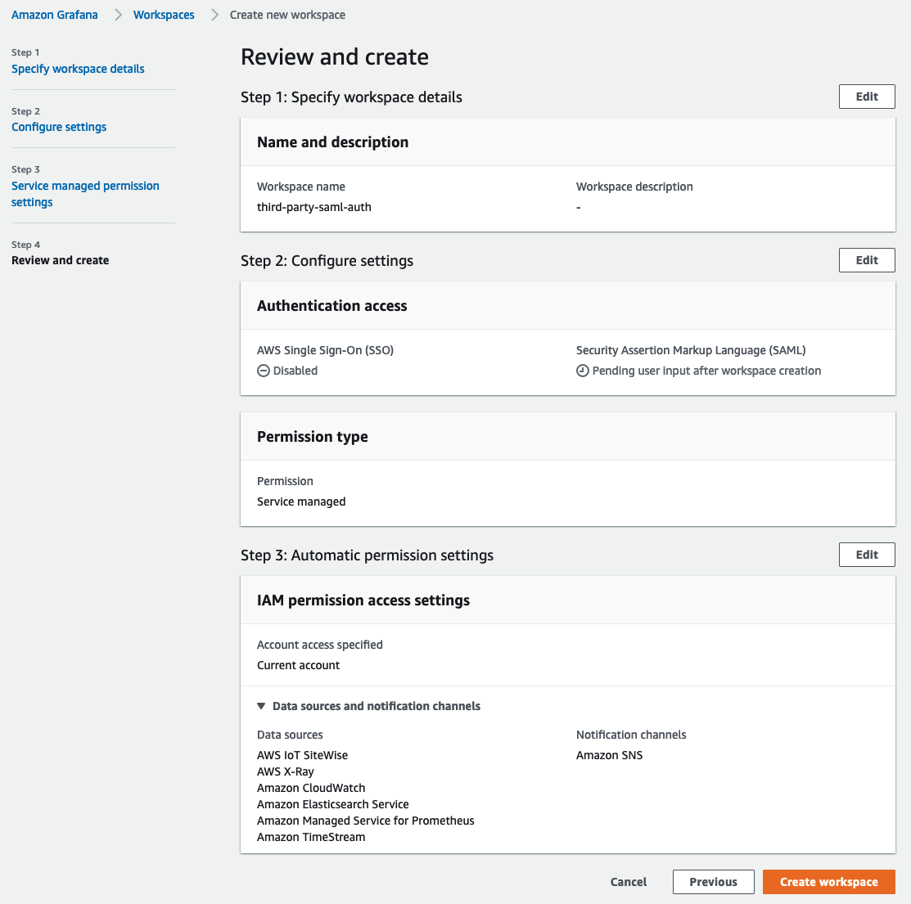
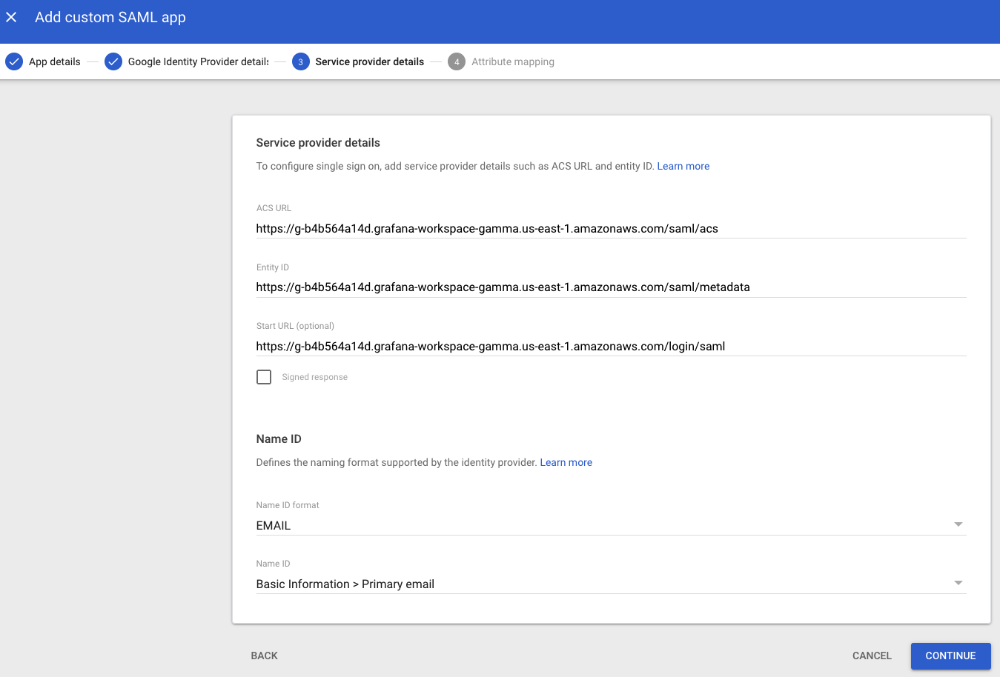
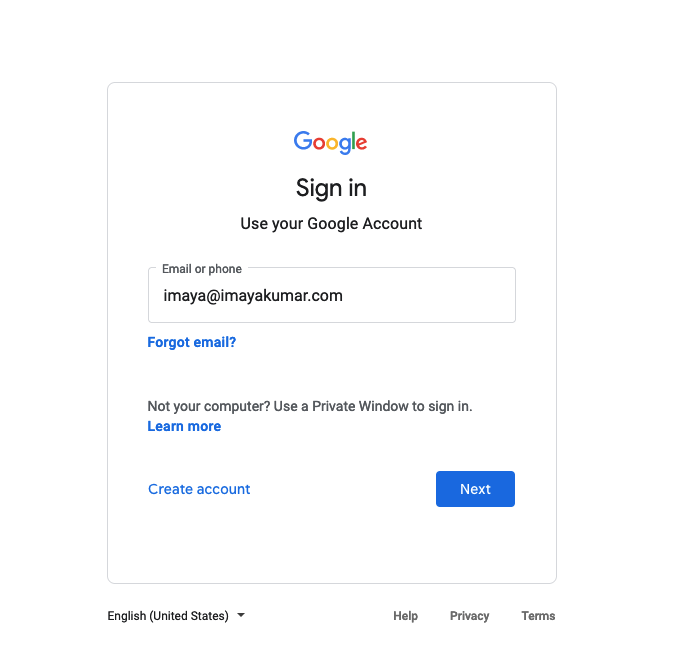

# SAML ఉపయోగించి Amazon Managed Grafana తో Google Workspaces authentication configure చేయడం

ఈ గైడ్ లో, SAML v2.0 protocol ఉపయోగించి Amazon Managed Grafana కోసం identity provider (IdP) గా Google Workspaces ను setup చేయడం ఎలాగో walk through చేస్తాము.

ఈ గైడ్ follow చేయడానికి [Amazon Managed Grafana workspace][amg-ws] create చేసి ఉండటంతో పాటు paid [Google Workspaces][google-workspaces] account create చేయాలి.

### Amazon Managed Grafana workspace Create చేయండి

Amazon Managed Grafana console లోకి Log in చేసి **Create workspace** click చేయండి. ఈ screen లో, క్రింద చూపినట్లు workspace name provide చేయండి. ఆపై **Next** click చేయండి:

**Configure settings** page లో, users login చేయడానికి SAML based Identity Provider configure చేయగలిగేలా **Security Assertion Markup Language (SAML)** option select చేయండి:

మీరు choose చేయాలనుకుంటున్న data sources select చేసి **Next** click చేయండి:

**Review and create** screen లో **Create workspace** button click చేయండి:

ఇది క్రింద చూపినట్లు new Amazon Managed Grafana workspace create చేస్తుంది:

### Google Workspaces Configure చేయండి

Super Admin permissions తో Google Workspaces లోకి Login చేసి **Apps** section కింద **Web and mobile apps** కు వెళ్ళండి. అక్కడ, **Add App** click చేసి **Add custom SAML app** select చేయండి. ఇప్పుడు క్రింద చూపినట్లు app కు name ఇవ్వండి. **CONTINUE** click చేయండి:

తదుపరి screen లో, SAML metadata file download చేయడానికి **DOWNLOAD METADATA** button click చేయండి. **CONTINUE** click చేయండి.

తదుపరి screen లో, ACS URL, Entity ID మరియు Start URL fields కనిపిస్తాయి. Amazon Managed Grafana console నుండి ఈ fields కోసం values పొందవచ్చు.

**Name ID format** field లో drop down నుండి **EMAIL** select చేయండి మరియు **Name ID** field లో **Basic Information > Primary email** select చేయండి.

**CONTINUE** click చేయండి.

**Attribute mapping** screen లో, screenshot లో చూపినట్లు **Google Directory attributes** మరియు **App attributes** మధ్య mapping చేయండి

Google authentication ద్వారా login అయ్యే users **Amazon Managed Grafana** లో **Admin** privileges కలిగి ఉండాలంటే, **Department** field value ను ***monitoring*** గా set చేయండి. దీని కోసం ఏ field మరియు ఏ value అయినా choose చేయవచ్చు. Google Workspaces side లో ఏది choose చేసినా, Amazon Managed Grafana SAML settings లో mapping reflect చేయేలా నిర్ధారించుకోండి.

### Amazon Managed Grafana లోకి SAML metadata upload చేయండి

ఇప్పుడు Amazon Managed Grafana console లో, **Upload or copy/paste** option click చేసి ముందు Google Workspaces నుండి download చేసిన SAML metadata file upload చేయడానికి **Choose file** button select చేయండి.

**Assertion mapping** section లో, **Assertion attribute role** field లో **Department** type చేయండి మరియు **Admin role values** field లో **monitoring** type చేయండి. ఇది **Department** **monitoring** గా ఉండి login అయ్యే users Grafana లో **Admin** privileges కలిగి ఉండేలా allow చేస్తుంది, dashboards మరియు datasources create చేయడం వంటి administrator duties perform చేయడానికి.

Screenshot లో చూపినట్లు **Additional settings - optional** section కింద values set చేయండి. **Save SAML configuration** click చేయండి:

ఇప్పుడు Amazon Managed Grafana Google Workspaces ఉపయోగించి users ను authenticate చేయడానికి set up అయింది.

Users login అయినప్పుడు, Google login page కు redirect అవుతారు:

Credentials enter చేసిన తర్వాత, screenshot లో చూపినట్లు Grafana లోకి logged in అవుతారు.

చూడగలిగినట్లు, user Google Workspaces authentication ఉపయోగించి Grafana లోకి successfully login చేయగలిగారు.

[google-workspaces]: https://workspace.google.com/
[amg-ws]: https://docs.aws.amazon.com/grafana/latest/userguide/getting-started-with-AMG.html#AMG-getting-started-workspace
