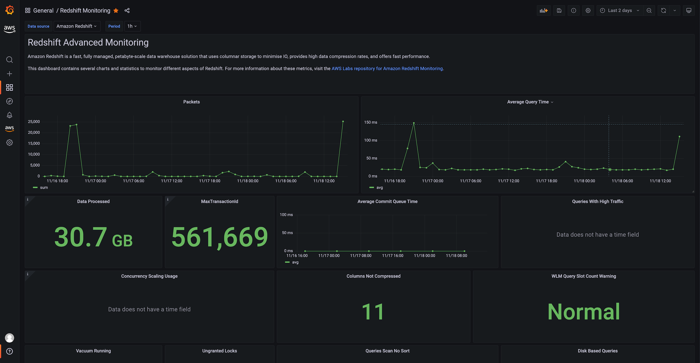

# Amazon Managed Grafana లో Redshift ను ఉపయోగించడం

ఈ రెసిపీలో [Amazon Managed Grafana][amg] లో [Amazon Redshift][redshift] ను ఎలా ఉపయోగించాలో చూపిస్తాము — ఇది ప్రామాణిక SQL ఉపయోగించే పెటాబైట్-స్కేల్ డేటా వేర్‌హౌస్ సేవ. ఈ ఇంటిగ్రేషన్ [Grafana కోసం Redshift డేటా సోర్స్][redshift-ds] ద్వారా ఎనేబుల్ చేయబడింది, ఇది ఓపెన్ సోర్స్ ప్లగిన్ మరియు ఏదైనా DIY Grafana ఇన్‌స్టెన్స్‌లో ఉపయోగించడానికి అందుబాటులో ఉంటుంది, అలాగే Amazon Managed Grafana లో ముందుగానే ఇన్‌స్టాల్ చేయబడి ఉంటుంది.

:::note
    ఈ గైడ్ పూర్తి చేయడానికి సుమారు 10 నిమిషాలు పడుతుంది.
:::
## ముందస్తు అవసరాలు

1. మీ ఖాతా నుండి Amazon Redshift కు అడ్మిన్ యాక్సెస్ ఉండాలి.
1. మీ Amazon Redshift క్లస్టర్‌ను `GrafanaDataSource: true` తో ట్యాగ్ చేయండి.
1. సర్వీస్-మేనేజ్డ్ పాలసీల ప్రయోజనం పొందడానికి, ఈ క్రింది మార్గాలలో ఒకదానిలో డేటాబేస్ క్రెడెన్షియల్స్‌ను సృష్టించండి:
    1. మీరు డిఫాల్ట్ మెకానిజం, అంటే temporary credentials ఆప్షన్‌ను ఉపయోగించి Redshift డేటాబేస్‌కు ధృవీకరించాలనుకుంటే, మీరు `redshift_data_api_user` అనే డేటాబేస్ యూజర్‌ను సృష్టించాలి.
    1. మీరు Secrets Manager నుండి క్రెడెన్షియల్స్‌ను ఉపయోగించాలనుకుంటే, మీరు సీక్రెట్‌ను `RedshiftQueryOwner: true` తో ట్యాగ్ చేయాలి.

:::tip
    సర్వీస్-మేనేజ్డ్ లేదా కస్టమ్ పాలసీలతో ఎలా పని చేయాలో మరింత సమాచారం కోసం,
    [Amazon Managed Grafana docs లోని ఉదాహరణలు][svpolicies] చూడండి.
:::

## ఇన్‌ఫ్రాస్ట్రక్చర్
మనకు ఒక Grafana ఇన్‌స్టెన్స్ అవసరం, కాబట్టి [Getting Started][amg-getting-started] గైడ్ ఉపయోగించి కొత్త [Amazon Managed Grafana వర్క్‌స్పేస్][amg-workspace] సెటప్ చేయండి లేదా ఉన్నదాన్ని ఉపయోగించండి.

:::note
    AWS డేటా సోర్స్ కాన్ఫిగరేషన్ ఉపయోగించడానికి, ముందుగా Amazon Managed Grafana
    కన్సోల్‌కు వెళ్ళి Athena రిసోర్సులను చదవడానికి అవసరమైన
    IAM పాలసీలను వర్క్‌స్పేస్‌కు మంజూరు చేసే service-managed IAM roles ను ఎనేబుల్ చేయండి.
:::

Athena డేటా సోర్స్ సెటప్ చేయడానికి, ఎడమ వైపు టూల్‌బార్ ఉపయోగించి దిగువ AWS ఐకాన్‌ను ఎంచుకోండి, ఆపై "Redshift" ఎంచుకోండి. ఉపయోగించడానికి Redshift డేటా సోర్స్‌ను కనుగొనడానికి మీ డిఫాల్ట్ రీజియన్‌ను ఎంచుకోండి, ఆపై మీకు కావలసిన ఖాతాలను ఎంచుకోండి, చివరగా "Add data source" ఎంచుకోండి.

ప్రత్యామ్నాయంగా, ఈ దశలను అనుసరించి మీరు Redshift డేటా సోర్స్‌ను మాన్యువల్‌గా జోడించి కాన్ఫిగర్ చేయవచ్చు:

1. ఎడమ వైపు టూల్‌బార్‌లో "Configurations" ఐకాన్ క్లిక్ చేసి ఆపై "Add data source" క్లిక్ చేయండి.
1. "Redshift" కోసం వెతకండి.
1. [ఐచ్ఛికం] authentication provider కాన్ఫిగర్ చేయండి (సిఫార్సు: workspace IAM role).
1. "Cluster Identifier", "Database", మరియు "Database User" విలువలను అందించండి.
1. "Save & test" క్లిక్ చేయండి.

మీరు ఈ క్రింది విధంగా చూడాలి:

## ఉపయోగం
మేము [Redshift Advance Monitoring][redshift-mon] సెటప్‌ను ఉపయోగిస్తాము.
అంతా అవుట్ ఆఫ్ ద బాక్స్ అందుబాటులో ఉన్నందున, ఈ సమయంలో కాన్ఫిగర్ చేయడానికి మరేమీ లేదు.

మీరు Redshift ప్లగిన్‌లో చేర్చబడిన Redshift monitoring డాష్‌బోర్డ్‌ను ఇంపోర్ట్ చేయవచ్చు. ఇంపోర్ట్ చేసిన తర్వాత మీరు ఈ విధంగా చూడాలి:

ఇక్కడ నుండి, Amazon Managed Grafana లో మీ స్వంత డాష్‌బోర్డ్‌ను సృష్టించడానికి ఈ క్రింది గైడ్‌లను ఉపయోగించవచ్చు:

* [User Guide: Dashboards](https://docs.aws.amazon.com/grafana/latest/userguide/dashboard-overview.html)
* [డాష్‌బోర్డ్‌లను సృష్టించడానికి ఉత్తమ పద్ధతులు](https://grafana.com/docs/grafana/latest/best-practices/best-practices-for-creating-dashboards/)

అంతే, అభినందనలు! మీరు Grafana నుండి Redshift ను ఎలా ఉపయోగించాలో నేర్చుకున్నారు!

## క్లీనప్

మీరు ఉపయోగించిన Redshift డేటాబేస్‌ను తొలగించి, ఆపై
Amazon Managed Grafana వర్క్‌స్పేస్‌ను కన్సోల్ నుండి తొలగించడం ద్వారా తీసివేయండి.

[redshift]: https://aws.amazon.com/redshift/
[amg]: https://aws.amazon.com/grafana/
[svpolicies]: https://docs.aws.amazon.com/grafana/latest/userguide/security_iam_id-based-policy-examples.html
[redshift-ds]: https://grafana.com/grafana/plugins/grafana-redshift-datasource/
[aws-cli]: https://docs.aws.amazon.com/cli/latest/userguide/cli-chap-install.html
[aws-cli-conf]: https://docs.aws.amazon.com/cli/latest/userguide/cli-chap-configure.html
[amg-getting-started]: https://aws.amazon.com/blogs/mt/amazon-managed-grafana-getting-started/
[redshift-console]: https://console.aws.amazon.com/redshift/
[redshift-mon]: https://github.com/awslabs/amazon-redshift-monitoring
[amg-workspace]: https://console.aws.amazon.com/grafana/home#/workspaces
