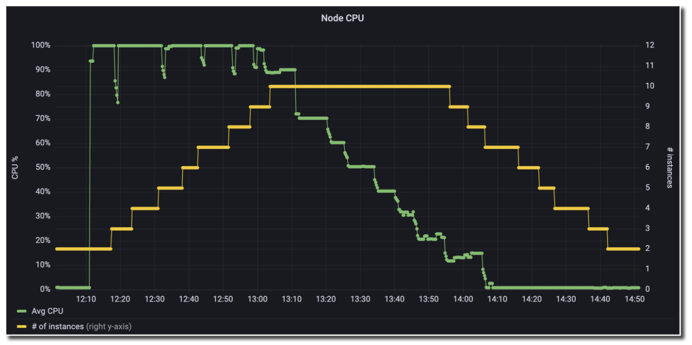

# Amazon Managed Service for Prometheus మరియు alert manager ఉపయోగించి Amazon EC2 ఆటో-స్కేలింగ్

కస్టమర్లు తమ ఉన్న Prometheus వర్క్‌లోడ్‌లను క్లౌడ్‌కు మైగ్రేట్ చేసి క్లౌడ్ అందించే అన్ని సౌకర్యాలను ఉపయోగించుకోవాలనుకుంటారు. AWS కు CPU లేదా memory utilization వంటి మెట్రిక్స్ ఆధారంగా [Amazon Elastic Compute Cloud (Amazon EC2)](https://aws.amazon.com/pm/ec2/) ఇన్‌స్టెన్సులను scale out చేయడానికి Amazon [EC2 Auto Scaling](https://aws.amazon.com/ec2/autoscaling/) వంటి సేవలు ఉన్నాయి. Prometheus మెట్రిక్స్ ఉపయోగించే అప్లికేషన్లు తమ monitoring stack ను భర్తీ చేయాల్సిన అవసరం లేకుండా EC2 Auto Scaling లో సులభంగా ఇంటిగ్రేట్ అవ్వవచ్చు. ఈ పోస్ట్‌లో, [Amazon Managed Service for Prometheus Alert Manager](https://aws.amazon.com/prometheus/) తో పని చేయడానికి Amazon EC2 Auto Scaling ను కాన్ఫిగర్ చేయడం ద్వారా మీకు మార్గదర్శనం చేస్తాను. ఈ విధానం autoscaling వంటి సేవలను ఉపయోగించుకుంటూ Prometheus-ఆధారిత వర్క్‌లోడ్‌ను క్లౌడ్‌కు తరలించడానికి మిమ్మల్ని అనుమతిస్తుంది.

Amazon Managed Service for Prometheus [PromQL](https://prometheus.io/docs/prometheus/latest/querying/basics/) ఉపయోగించే [alerting rules](https://docs.aws.amazon.com/prometheus/latest/userguide/AMP-Ruler.html) కు మద్దతిస్తుంది. [Prometheus alerting rules documentation](https://prometheus.io/docs/prometheus/latest/configuration/alerting_rules/) చెల్లుబాటు అయ్యే alerting rules యొక్క syntax మరియు ఉదాహరణలను అందిస్తుంది. అదేవిధంగా, Prometheus alert manager documentation చెల్లుబాటు అయ్యే alert manager కాన్ఫిగరేషన్ల [syntax](https://prometheus.io/docs/prometheus/latest/configuration/template_reference/) మరియు [ఉదాహరణలు](https://prometheus.io/docs/prometheus/latest/configuration/template_examples/) రెండింటినీ సూచిస్తుంది.

## సొల్యూషన్ అవలోకనం

ముందుగా, Amazon EC2 Auto Scaling యొక్క [Auto Scaling group](https://docs.aws.amazon.com/autoscaling/ec2/userguide/auto-scaling-groups.html) భావనను సంక్షిప్తంగా సమీక్షిద్దాం, ఇది Amazon EC2 ఇన్‌స్టెన్సుల లాజికల్ సేకరణ. Auto Scaling group ముందుగా నిర్వచించిన launch template ఆధారంగా EC2 ఇన్‌స్టెన్సులను ప్రారంభించగలదు. [launch template](https://docs.aws.amazon.com/AWSEC2/latest/UserGuide/ec2-launch-templates.html) AMI ID, instance type, network settings, మరియు [AWS Identity and Access Management (IAM)](https://aws.amazon.com/iam/) instance profile తో సహా Amazon EC2 instance ను ప్రారంభించడానికి ఉపయోగించే సమాచారాన్ని కలిగి ఉంటుంది.

Amazon EC2 Auto Scaling groups కు [minimum size, maximum size, మరియు desired capacity](https://docs.aws.amazon.com/autoscaling/ec2/userguide/what-is-amazon-ec2-auto-scaling.html) భావనలు ఉన్నాయి. Amazon EC2 Auto Scaling Auto Scaling group యొక్క ప్రస్తుత running capacity desired capacity కంటే ఎక్కువ లేదా తక్కువగా ఉందని గుర్తించినప్పుడు, ఇది అవసరమైన విధంగా ఆటోమేటిక్‌గా scale out లేదా scale in చేస్తుంది. ఈ scaling విధానం capacity మరియు costs రెండింటిపైనా పరిమితులను ఉంచుతూనే మీ వర్క్‌లోడ్‌లో elasticity ను ఉపయోగించుకోవడానికి మిమ్మల్ని అనుమతిస్తుంది.

ఈ సొల్యూషన్‌ను ప్రదర్శించడానికి, నేను రెండు Amazon EC2 ఇన్‌స్టెన్సులను కలిగి ఉన్న Amazon EC2 Auto Scaling group సృష్టించాను. ఈ ఇన్‌స్టెన్సులు Amazon Managed Service for Prometheus workspace కు [instance metrics remote write](https://docs.aws.amazon.com/prometheus/latest/userguide/AMP-onboard-ingest-metrics-remote-write-EC2.html) చేస్తాయి. నేను Auto Scaling group యొక్క minimum size ను రెండుగా (high availability నిర్వహించడానికి), మరియు group యొక్క maximum size ను 10 గా సెట్ చేశాను (costs నియంత్రించడానికి). సొల్యూషన్‌కు ఎక్కువ ట్రాఫిక్ వచ్చినప్పుడు, Auto Scaling group యొక్క maximum size వరకు, load కు మద్దతు ఇవ్వడానికి అదనపు Amazon EC2 ఇన్‌స్టెన్సులు ఆటోమేటిక్‌గా జోడించబడతాయి. load తగ్గినప్పుడు, Auto Scaling group minimum size చేరుకునే వరకు ఆ EC2 ఇన్‌స్టెన్సులు terminate అవుతాయి. ఈ విధానం క్లౌడ్ elasticity ను ఉపయోగించుకుని performant application కలిగి ఉండటానికి మిమ్మల్ని అనుమతిస్తుంది.

మీరు ఎక్కువ resources ను scrape చేసినప్పుడు, ఒకే Prometheus server సామర్థ్యాలను త్వరగా అధిగమించవచ్చు. వర్క్‌లోడ్‌తో linearly గా Prometheus servers ను scaling చేయడం ద్వారా ఈ పరిస్థితిని నివారించవచ్చు. ఈ విధానం మీకు కావలసిన granularity తో metric data సేకరించగలరని నిర్ధారిస్తుంది.

Prometheus వర్క్‌లోడ్ యొక్క Auto Scaling కు మద్దతు ఇవ్వడానికి, నేను ఈ క్రింది rules తో Amazon Managed Service for Prometheus workspace సృష్టించాను:

` YAML `
```
groups:
- name: example
  rules:
  - alert: HostHighCpuLoad
    expr: 100 - (avg(rate(node_cpu_seconds_total{mode="idle"}[2m])) * 100) > 60
    for: 5m
    labels:
      severity: warning
      event_type: scale_up
    annotations:
      summary: Host high CPU load (instance {{ $labels.instance }})
      description: "CPU load is > 60%\n  VALUE = {{ $value }}\n  LABELS = {{ $labels }}"
  - alert: HostLowCpuLoad
    expr: 100 - (avg(rate(node_cpu_seconds_total{mode="idle"}[2m])) * 100) < 30
    for: 5m
    labels:
      severity: warning
      event_type: scale_down
    annotations:
      summary: Host low CPU load (instance {{ $labels.instance }})
      description: "CPU load is < 30%\n  VALUE = {{ $value }}\n  LABELS = {{ $labels }}"

```

ఈ rules set ` HostHighCpuLoad ` మరియు ` HostLowCpuLoad ` rules సృష్టిస్తుంది. ఈ alerts ఐదు నిమిషాల వ్యవధిలో CPU 60% కంటే ఎక్కువ లేదా 30% కంటే తక్కువ utilization లో ఉన్నప్పుడు trigger అవుతాయి.

alert raise చేసిన తర్వాత, alert manager ` alert_type ` (alert name) మరియు ` event_type ` (scale_down లేదా scale_up) pass చేస్తూ Amazon SNS topic లోకి message ను forward చేస్తుంది.

` YAML `
```
alertmanager_config: |
  route: 
    receiver: default_receiver
    repeat_interval: 5m
        
  receivers:
    - name: default_receiver
      sns_configs:
        - topic_arn: <ARN OF SNS TOPIC GOES HERE>
          send_resolved: false
          sigv4:
            region: us-east-1
          message: |
            alert_type: {{ .CommonLabels.alertname }}
            event_type: {{ .CommonLabels.event_type }}

```

Amazon SNS topic కు AWS [Lambda](https://aws.amazon.com/lambda/) function subscribe చేయబడింది. Lambda function లో Amazon SNS message ను inspect చేసి ` scale_up ` లేదా ` scale_down ` event జరగాలా అని నిర్ణయించడానికి logic వ్రాశాను. ఆపై, Lambda function Amazon EC2 Auto Scaling group యొక్క desired capacity ను increment లేదా decrement చేస్తుంది. Amazon EC2 Auto Scaling group capacity లో అభ్యర్థించిన మార్పును గుర్తించి, Amazon EC2 ఇన్‌స్టెన్సులను invoke లేదా deallocate చేస్తుంది.

Auto Scaling కు మద్దతు ఇవ్వడానికి Lambda code ఈ క్రింది విధంగా ఉంది:

` Python `
```
import json
import boto3
import os

def lambda_handler(event, context):
    print(event)
    msg = event['Records'][0]['Sns']['Message']
    
    scale_type = ''
    if msg.find('scale_up') > -1:
        scale_type = 'scale_up'
    else:
        scale_type = 'scale_down'
    
    get_desired_instance_count(scale_type)
    
def get_desired_instance_count(scale_type):
    
    client = boto3.client('autoscaling')
    asg_name = os.environ['ASG_NAME']
    response = client.describe_auto_scaling_groups(AutoScalingGroupNames=[ asg_name])

    minSize = response['AutoScalingGroups'][0]['MinSize']
    maxSize = response['AutoScalingGroups'][0]['MaxSize']
    desiredCapacity = response['AutoScalingGroups'][0]['DesiredCapacity']
    
    if scale_type == "scale_up":
        desiredCapacity = min(desiredCapacity+1, maxSize)
    if scale_type == "scale_down":
        desiredCapacity = max(desiredCapacity - 1, minSize)
    
    print('Scale type: {}; new capacity: {}'.format(scale_type, desiredCapacity))
    response = client.set_desired_capacity(AutoScalingGroupName=asg_name, DesiredCapacity=desiredCapacity, HonorCooldown=False)

```

పూర్తి ఆర్కిటెక్చర్‌ను ఈ క్రింది చిత్రంలో సమీక్షించవచ్చు.


## సొల్యూషన్‌ను టెస్ట్ చేయడం

ఈ సొల్యూషన్‌ను ఆటోమేటిక్‌గా provision చేయడానికి AWS CloudFormation template launch చేయవచ్చు.

Stack ముందస్తు అవసరాలు:

* [Amazon Virtual Private Cloud (Amazon VPC)](https://aws.amazon.com/vpc/)
* outbound traffic అనుమతించే AWS Security Group

Download Launch Stack Template లింక్ సెలెక్ట్ చేసి మీ ఖాతాలో template డౌన్‌లోడ్ చేసి సెటప్ చేయండి. కాన్ఫిగరేషన్ ప్రక్రియలో భాగంగా, Amazon EC2 ఇన్‌స్టెన్సులతో అనుబంధించాలనుకుంటున్న subnets మరియు security groups ను నిర్దిష్టంగా పేర్కొనాలి. వివరాలకు ఈ క్రింది చిత్రం చూడండి.

[## Download Launch Stack Template ](https://prometheus-autoscale.s3.amazonaws.com/prometheus-autoscale.template)


ఇది CloudFormation stack details స్క్రీన్, stack name prometheus-autoscale గా సెట్ చేయబడింది. stack parameters లో Prometheus కోసం Linux installer URL, Prometheus కోసం Linux Node Exporter URL, solution లో ఉపయోగించే subnets మరియు security groups, ఉపయోగించాల్సిన AMI మరియు instance type, మరియు Amazon EC2 Auto Scaling group యొక్క maximum capacity ఉన్నాయి.

stack deploy కావడానికి సుమారు ఎనిమిది నిమిషాలు పడుతుంది. పూర్తయిన తర్వాత, మీ కోసం సృష్టించబడిన Amazon EC2 Auto Scaling group లో రెండు Amazon EC2 ఇన్‌స్టెన్సులు deploy అయి running లో ఉంటాయి. ఈ solution Amazon Managed Service for Prometheus Alert Manager ద్వారా auto-scales అవుతుందని validate చేయడానికి, [AWS Systems Manager Run Command](https://docs.aws.amazon.com/systems-manager/latest/userguide/execute-remote-commands.html) మరియు [AWSFIS-Run-CPU-Stress automation document](https://docs.aws.amazon.com/fis/latest/userguide/actions-ssm-agent.html#awsfis-run-cpu-stress) ఉపయోగించి Amazon EC2 ఇన్‌స్టెన్సులకు load apply చేయండి.

Amazon EC2 Auto Scaling group లోని CPUs కు stress apply చేయబడినప్పుడు, alert manager ఈ alerts publish చేస్తుంది, దీనికి Lambda function Auto Scaling group ను scale up చేయడం ద్వారా ప్రతిస్పందిస్తుంది. CPU consumption తగ్గినప్పుడు, Amazon Managed Service for Prometheus workspace లో low CPU alert fire అవుతుంది, alert manager Amazon SNS topic కు alert publish చేస్తుంది, మరియు Lambda function Auto Scaling group ను scale down చేయడం ద్వారా ప్రతిస్పందిస్తుంది, ఈ క్రింది చిత్రంలో ప్రదర్శించబడినట్లుగా.



Grafana డాష్‌బోర్డ్‌లో CPU 100% కు spike అయినట్లు చూపించే line ఉంది. CPU ఎక్కువగా ఉన్నప్పటికీ, ఇన్‌స్టెన్సుల సంఖ్య 2 నుండి 10 కి step up అయినట్లు మరొక line చూపిస్తుంది. CPU తగ్గిన తర్వాత, ఇన్‌స్టెన్సుల సంఖ్య నెమ్మదిగా 2 కి తిరిగి తగ్గుతుంది.

## ఖర్చులు

Amazon Managed Service for Prometheus ingested మెట్రిక్స్, stored మెట్రిక్స్, మరియు queried మెట్రిక్స్ ఆధారంగా ధర నిర్ణయించబడుతుంది. తాజా ధరలు మరియు ధర ఉదాహరణల కోసం [Amazon Managed Service for Prometheus pricing page](https://aws.amazon.com/prometheus/pricing/) సందర్శించండి.

Amazon SNS monthly API requests సంఖ్య ఆధారంగా ధర నిర్ణయించబడుతుంది. Amazon SNS మరియు Lambda మధ్య message delivery ఉచితం, కానీ Amazon SNS మరియు Lambda మధ్య transfer అయిన data మొత్తానికి charge చేస్తుంది. [తాజా Amazon SNS pricing వివరాలు](https://aws.amazon.com/sns/pricing/) చూడండి.

Lambda మీ function execution duration మరియు function కు చేసిన requests సంఖ్య ఆధారంగా ధర నిర్ణయించబడుతుంది. తాజా [AWS Lambda pricing వివరాలు](https://aws.amazon.com/lambda/pricing/) చూడండి.

Amazon EC2 Auto Scaling ఉపయోగించడానికి [అదనపు charges లేవు](https://aws.amazon.com/ec2/autoscaling/pricing/).

## ముగింపు

Amazon Managed Service for Prometheus, alert manager, Amazon SNS, మరియు Lambda ఉపయోగించి, మీరు Amazon EC2 Auto Scaling group యొక్క scaling activities ను నియంత్రించవచ్చు. ఈ పోస్ట్‌లోని solution ఉన్న Prometheus వర్క్‌లోడ్‌లను AWS కు తరలించడం ఎలాగో ప్రదర్శిస్తుంది, అదే సమయంలో Amazon EC2 Auto Scaling కూడా ఉపయోగిస్తుంది. అప్లికేషన్‌కు load పెరిగినప్పుడు, demand తీర్చడానికి seamlessly scale అవుతుంది.

ఈ ఉదాహరణలో, Amazon EC2 Auto Scaling group CPU ఆధారంగా scale అయింది, కానీ మీ వర్క్‌లోడ్ నుండి ఏదైనా Prometheus metric కోసం ఇదే విధమైన approach అనుసరించవచ్చు. ఈ approach scaling actions పై fine-grained control అందిస్తుంది, తద్వారా అత్యధిక business value అందించే metric పై మీ వర్క్‌లోడ్‌ను scale చేయగలరని నిర్ధారిస్తుంది.

మునుపటి blog posts లో, [Amazon Managed Service for Prometheus Alert Manager తో PagerDuty తో alerts ఎలా receive చేయవచ్చో](https://aws.amazon.com/blogs/mt/using-amazon-managed-service-for-prometheus-alert-manager-to-receive-alerts-with-pagerduty/) మరియు [Amazon Managed Service for Prometheus ను Slack తో ఎలా integrate చేయవచ్చో](https://aws.amazon.com/blogs/mt/how-to-integrate-amazon-managed-service-for-prometheus-with-slack/) కూడా ప్రదర్శించాము. ఈ solutions మీకు అత్యంత ఉపయోగకరమైన విధంగా మీ workspace నుండి alerts ఎలా receive చేయవచ్చో చూపిస్తాయి.

తదుపరి దశలకు, Amazon Managed Service for Prometheus కోసం [మీ స్వంత rules configuration file ఎలా సృష్టించాలో](https://docs.aws.amazon.com/prometheus/latest/userguide/AMP-rules-upload.html) చూడండి, మరియు మీ స్వంత [alert receiver](https://docs.aws.amazon.com/prometheus/latest/userguide/AMP-alertmanager-receiver.html) సెటప్ చేయండి.
