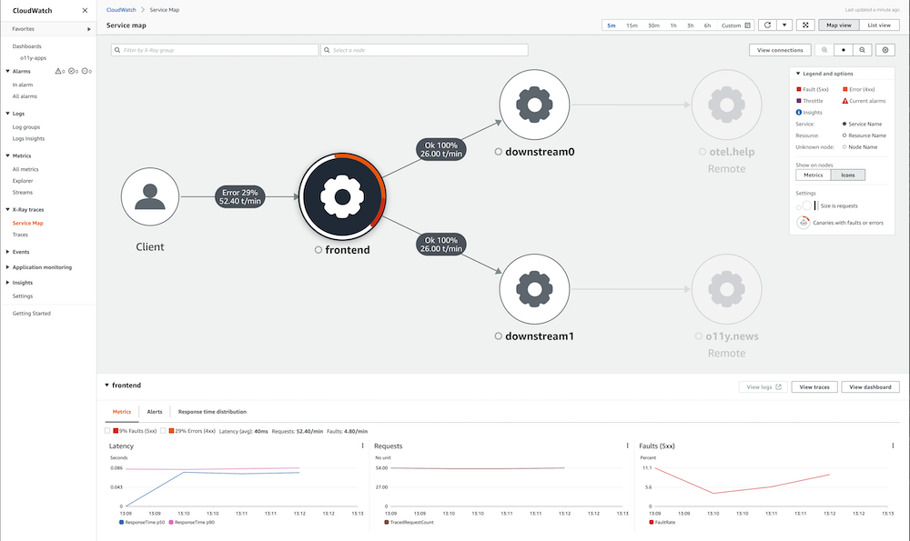

# Fargate పై EKS లో AWS Distro for OpenTelemetry ను AWS X-Ray తో ఉపయోగించడం

ఈ recipe లో sample Go application ను instrument చేయడం మరియు [AWS X-Ray](https://aws.amazon.com/xray/) లోకి traces ingest చేయడానికి [AWS Distro for OpenTelemetry (ADOT)](https://aws.amazon.com/otel) ఎలా ఉపయోగించాలో మరియు [Amazon Managed Grafana](https://aws.amazon.com/grafana/) లో traces visualize చేయడం చూపిస్తాము.

Complete scenario demonstrate చేయడానికి [AWS Fargate](https://aws.amazon.com/fargate/) పై [Amazon Elastic Kubernetes Service (EKS)](https://aws.amazon.com/eks/) cluster మరియు [Amazon Elastic Container Registry (ECR)](https://aws.amazon.com/ecr/) repository set up చేస్తాము.

:::note
    ఈ గైడ్ complete చేయడానికి సుమారు 1 గంట పడుతుంది.
:::
## Infrastructure
ఈ section లో ఈ recipe కోసం infrastructure set up చేస్తాము.

### Architecture

ADOT pipeline [ADOT Collector](https://github.com/aws-observability/aws-otel-collector) ను instrumented app నుండి traces collect చేయడానికి మరియు X-Ray లోకి ingest చేయడానికి enable చేస్తుంది:


### Prerequisites

* AWS CLI మీ environment లో [installed](https://docs.aws.amazon.com/cli/latest/userguide/cli-chap-install.html) మరియు [configured](https://docs.aws.amazon.com/cli/latest/userguide/cli-chap-configure.html) అయి ఉండాలి.
* మీ environment లో [eksctl](https://docs.aws.amazon.com/eks/latest/userguide/eksctl.html) command install చేయాలి.
* మీ environment లో [kubectl](https://docs.aws.amazon.com/eks/latest/userguide/install-kubectl.html) install చేయాలి.
* మీ environment లో [Docker](https://docs.docker.com/get-docker/) installed ఉండాలి.
* మీ local environment లో [aws-observability/aws-o11y-recipes](https://github.com/aws-observability/aws-o11y-recipes/) repo cloned అయి ఉండాలి.

### Fargate పై EKS cluster Create చేయండి

మన demo application EKS on Fargate cluster లో run అయ్యే Kubernetes app. కాబట్టి, provided [cluster_config.yaml](./fargate-eks-xray-go-adot-amg/cluster-config.yaml) ఉపయోగించి మొదట EKS cluster create చేయండి.

ఈ command ఉపయోగించి మీ cluster create చేయండి:

```
eksctl create cluster -f cluster-config.yaml
```

### ECR repository Create చేయండి

మన application EKS కు deploy చేయడానికి container repository అవసరం. Private ECR registry ఉపయోగిస్తాము, కానీ container image share చేయాలనుకుంటే ECR Public కూడా ఉపయోగించవచ్చు.

మొదట, environment variables set చేయండి (మీ region substitute చేయండి):

```
export REGION="eu-west-1"
export ACCOUNTID=`aws sts get-caller-identity --query Account --output text`
```

మీ account లో new ECR repository create చేయడానికి ఈ command ఉపయోగించవచ్చు:

```
aws ecr create-repository \
    --repository-name ho11y \
    --image-scanning-configuration scanOnPush=true \
    --region $REGION
```

### ADOT Collector Set up చేయండి

[adot-collector-fargate.yaml](./fargate-eks-xray-go-adot-amg/adot-collector-fargate.yaml) download చేసి తదుపరి steps లో describe చేసిన parameters తో ఈ YAML doc edit చేయండి.


```
kubectl apply -f adot-collector-fargate.yaml
```

### Managed Grafana Set up చేయండి

[Amazon Managed Grafana - Getting Started](https://aws.amazon.com/blogs/mt/amazon-managed-grafana-getting-started/) guide ఉపయోగించి new workspace set up చేసి [X-Ray ను data source గా](https://docs.aws.amazon.com/grafana/latest/userguide/x-ray-data-source.html) add చేయండి.

## Signal generator

[sandbox](https://github.com/aws-observability/observability-best-practices/tree/main/sandbox/ho11y) లో available synthetic signal generator `ho11y` ఉపయోగిస్తాము. కాబట్టి, మీ local environment లో repo clone చేయకపోతే, ఇప్పుడు చేయండి:

```
git clone https://github.com/aws-observability/aws-o11y-recipes.git
```

### Container image Build చేయండి
మీ `ACCOUNTID` మరియు `REGION` environment variables set అయి ఉన్నాయని నిర్ధారించుకోండి, ఉదాహరణకు:

```
export REGION="eu-west-1"
export ACCOUNTID=`aws sts get-caller-identity --query Account --output text`
```
`ho11y` container image build చేయడానికి, మొదట `./sandbox/ho11y/` directory లోకి change చేసి container image build చేయండి:

:::note
    ఈ build step Docker daemon లేదా equivalent OCI image build tool running అయి ఉందని assume చేస్తుంది.
:::

```
docker build . -t "$ACCOUNTID.dkr.ecr.$REGION.amazonaws.com/ho11y:latest"
```

### Container image Push చేయండి
తర్వాత, container image ను earlier create చేసిన ECR repo కు push చేయవచ్చు. దాని కోసం, మొదట default ECR registry లోకి log in చేయండి:

```
aws ecr get-login-password --region $REGION | \
    docker login --username AWS --password-stdin \
    "$ACCOUNTID.dkr.ecr.$REGION.amazonaws.com"
```

చివరగా, container image ను ECR repository కు push చేయండి:

```
docker push "$ACCOUNTID.dkr.ecr.$REGION.amazonaws.com/ho11y:latest"
```

### Signal generator Deploy చేయండి

మీ ECR image path contain చేయడానికి [x-ray-sample-app.yaml](./fargate-eks-xray-go-adot-amg/x-ray-sample-app.yaml) edit చేయండి. అంటే, file లో `ACCOUNTID` మరియు `REGION` ను మీ own values తో replace చేయండి (overall, మూడు locations లో):

```
    # change the following to your container image:
    image: "ACCOUNTID.dkr.ecr.REGION.amazonaws.com/ho11y:latest"
```

ఇప్పుడు sample app ను మీ cluster కు deploy చేయవచ్చు:

```
kubectl -n example-app apply -f x-ray-sample-app.yaml
```

## End-to-end

ఇప్పుడు infrastructure మరియు application place లో ఉన్నాయి, EKS లో run అవుతున్న `ho11y` నుండి X-Ray కు traces send చేయడం మరియు AMG లో visualize చేయడం test చేద్దాం.

### Pipeline Verify చేయండి

ADOT collector `ho11y` నుండి traces ingest చేస్తుందో verify చేయడానికి, services లో ఒకదాన్ని locally available చేసి invoke చేద్దాం.

మొదట, traffic forward చేద్దాం:

```
kubectl -n example-app port-forward svc/frontend 8765:80
```

Above command తో, `frontend` microservice (రెండు ఇతర `ho11y` instances తో talk చేయడానికి configured `ho11y` instance) మీ local environment లో available మరియు traces creation trigger చేస్తూ ఇలా invoke చేయవచ్చు:

```
$ curl localhost:8765/
{"traceId":"1-6193a9be-53693f29a0119ee4d661ba0d"}
```

:::tip
    Invocation automate చేయాలనుకుంటే, `curl` call ను `while true` loop లో wrap చేయవచ్చు.
:::
మన setup verify చేయడానికి, [CloudWatch లో X-Ray view](https://console.aws.amazon.com/cloudwatch/home#xray:service-map/) visit చేయండి ఇక్కడ క్రింద చూపినట్లు కనిపించాలి:



ఇప్పుడు signal generator set up మరియు active, OpenTelemetry pipeline set up అయినందున, Grafana లో traces ఎలా consume చేయాలో చూద్దాం.

### Grafana dashboard

[x-ray-sample-dashboard.json](./fargate-eks-xray-go-adot-amg/x-ray-sample-dashboard.json) ద్వారా available example dashboard import చేయవచ్చు ఇది ఈ విధంగా కనిపిస్తుంది:


ఇంకా, lower `downstreams` panel లో ఏదైనా traces click చేసినప్పుడు, దానిలోకి dive చేసి "Explore" tab లో ఇలా view చేయవచ్చు:


ఇక్కడ నుండి, Amazon Managed Grafana లో మీ own dashboard create చేయడానికి ఈ guides ఉపయోగించవచ్చు:

* [User Guide: Dashboards](https://docs.aws.amazon.com/grafana/latest/userguide/dashboard-overview.html)
* [Dashboards create చేయడానికి ఉత్తమ పద్ధతులు](https://grafana.com/docs/grafana/latest/best-practices/best-practices-for-creating-dashboards/)

అంతే, అభినందనలు traces ingest చేయడానికి Fargate పై EKS లో ADOT ఎలా ఉపయోగించాలో నేర్చుకున్నారు.

## Cleanup

మొదట Kubernetes resources remove చేసి EKS cluster destroy చేయండి:

```
kubectl delete all --all && \
eksctl delete cluster --name xray-eks-fargate
```
చివరగా, AWS console ద్వారా remove చేయడం ద్వారా Amazon Managed Grafana workspace remove చేయండి.
