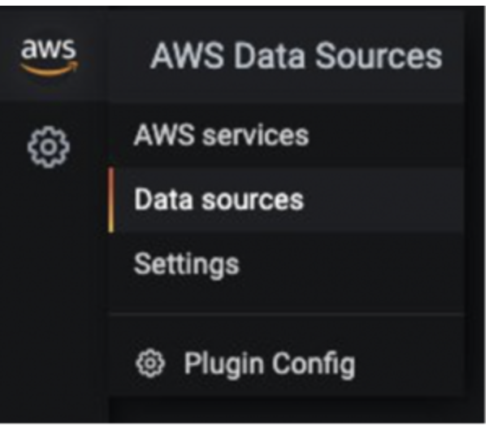
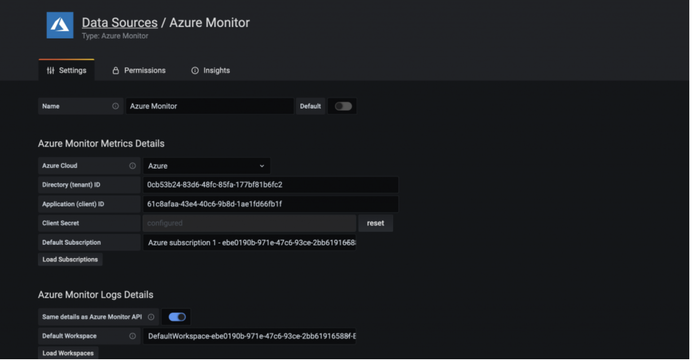
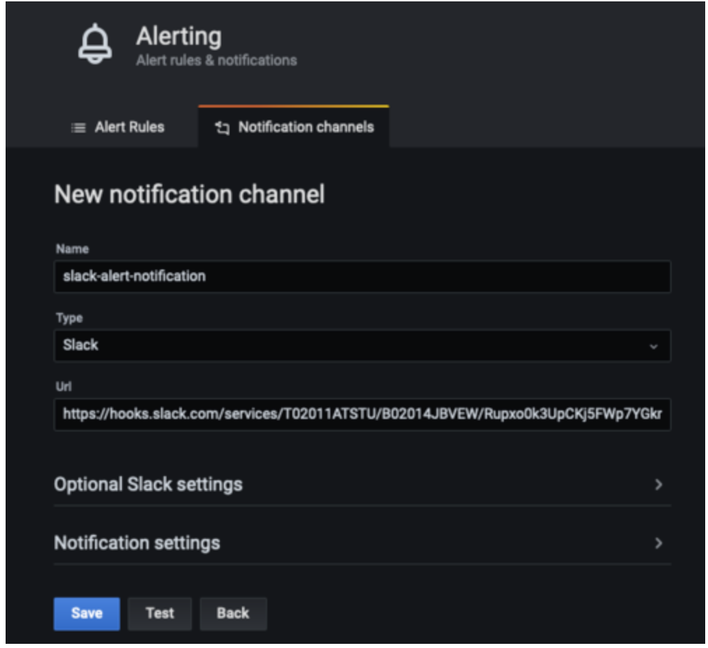

# Amazon Managed Service for Grafana ఉపయోగించి hybrid environments Monitor చేయడం

ఈ recipe లో Azure Cloud environment నుండి metrics ను [Amazon Managed Service for Grafana](https://aws.amazon.com/grafana/) (AMG) కు visualize చేయడం మరియు [Amazon Simple Notification Service](https://docs.aws.amazon.com/sns/latest/dg/welcome.html) మరియు Slack కు alert notifications send చేయడానికి AMG లో configure చేయడం ఎలాగో చూపిస్తాము.


Implementation లో భాగంగా, AMG workspace create చేస్తాము, AMG కోసం data source గా Azure Monitor plugin configure చేస్తాము మరియు Grafana dashboard configure చేస్తాము. రెండు notification channels create చేస్తాము: ఒకటి Amazon SNS కోసం మరియు ఒకటి Slack కోసం. AMG dashboard లో alerts ను notification channels కు send అయ్యేలా configure చేస్తాము.

:::note
    ఈ గైడ్ complete చేయడానికి సుమారు 30 నిమిషాలు పడుతుంది.
:::
## Infrastructure
ఈ section లో ఈ recipe కోసం infrastructure set up చేస్తాము.

### Prerequisites

* AWS CLI మీ environment లో [installed](https://docs.aws.amazon.com/cli/latest/userguide/cli-chap-install.html) మరియు [configured](https://docs.aws.amazon.com/cli/latest/userguide/cli-chap-configure.html) అయి ఉండాలి.
* [AWS-SSO](https://docs.aws.amazon.com/singlesignon/latest/userguide/step1.html) enable చేయాలి

### Architecture


మొదట, Azure Monitor నుండి metrics visualize చేయడానికి AMG workspace create చేయండి. [Getting Started with Amazon Managed Service for Grafana](https://aws.amazon.com/blogs/mt/amazon-managed-grafana-getting-started/) blog post లో steps follow చేయండి. Workspace create చేసిన తర్వాత, individual user లేదా user group కు Grafana workspace కు access assign చేయవచ్చు. Default గా, user viewer type కలిగి ఉంటారు. User role ఆధారంగా user type change చేయండి.

:::note
    Workspace లో కనీసం ఒక user కు Admin role assign చేయాలి.
:::
Figure 1 లో, user name grafana-admin. User type Admin. Data sources tab లో, required data source choose చేయండి. Configuration review చేసి, Create workspace choose చేయండి.


### Data source మరియు custom dashboard Configure చేయండి

ఇప్పుడు, Data sources కింద, Azure environment నుండి metrics query మరియు visualize చేయడం start చేయడానికి Azure Monitor plugin configure చేయండి. Data source add చేయడానికి Data sources choose చేయండి.


Add data source లో, Azure Monitor search చేసి ఆపై Azure environment లో app registration console నుండి parameters configure చేయండి.


Azure Monitor plugin configure చేయడానికి, directory (tenant) ID మరియు application (client) ID అవసరం. Instructions కోసం, Azure AD application మరియు service principal create చేయడం గురించి [article](https://docs.microsoft.com/en-us/azure/active-directory/develop/howto-create-service-principal-portal) చూడండి. ఇది app register చేయడం మరియు data query చేయడానికి Grafana కు access grant చేయడం explain చేస్తుంది.



Data source configured అయిన తర్వాత, Azure metrics analyze చేయడానికి custom dashboard import చేయండి. Left pane లో, + icon choose చేసి, ఆపై Import choose చేయండి.

Import via grafana.com లో, dashboard ID 10532 enter చేయండి.


ఇది Azure Virtual Machine dashboard import చేస్తుంది ఇక్కడ Azure Monitor metrics analyze చేయడం start చేయవచ్చు. నా setup లో, Azure environment లో running virtual machine ఉంది.


### AMG లో notification channels Configure చేయండి

ఈ section లో, రెండు notifications channels configure చేసి ఆపై alerts send చేస్తాము.

grafana-notification అనే SNS topic create చేయడానికి మరియు email address subscribe చేయడానికి ఈ command ఉపయోగించండి.

```
aws sns create-topic --name grafana-notification
aws sns subscribe --topic-arn arn:aws:sns:<region>:<account-id>:grafana-notification --protocol email --notification-endpoint <email-id>

```
Left pane లో, new notification channel add చేయడానికి bell icon choose చేయండి.
ఇప్పుడు grafana-notification notification channel configure చేయండి. Edit notification channel లో, Type కోసం, AWS SNS choose చేయండి. Topic కోసం, ఇప్పుడే create చేసిన SNS topic ARN ఉపయోగించండి. Auth Provider కోసం, workspace IAM role choose చేయండి.


### Slack notification channel
Slack notification channel configure చేయడానికి, Slack workspace create చేయండి లేదా existing one ఉపయోగించండి. [Incoming Webhooks ఉపయోగించి messages send చేయడం](https://api.slack.com/messaging/webhooks) లో describe చేసినట్లు Incoming Webhooks enable చేయండి.

Workspace configure చేసిన తర్వాత, Grafana dashboard లో ఉపయోగించబడే webhook URL get చేయగలరు.




### AMG లో alerts Configure చేయండి

Metric threshold దాటి increase అయినప్పుడు Grafana alerts configure చేయవచ్చు. AMG తో, dashboard లో alert ఎంత frequently evaluate అవ్వాలో configure చేసి notification send చేయవచ్చు. ఈ example లో, Azure virtual machine కోసం CPU utilization కోసం alert configure చేయండి. Utilization threshold exceed అయినప్పుడు, AMG రెండు channels కు notifications send చేయడానికి configure చేయండి.

Dashboard లో, dropdown నుండి CPU utilization choose చేసి, ఆపై Edit choose చేయండి. Graph panel యొక్క Alert tab లో, alert rule ఎంత frequently evaluate అవ్వాలో మరియు alert state change చేసి notifications initiate చేయడానికి meet అవ్వాల్సిన conditions configure చేయండి.

ఈ configuration లో, CPU utilization 50% exceed అయితే alert create అవుతుంది. Notifications grafana-alert-notification మరియు slack-alert-notification channels కు send అవుతాయి.


ఇప్పుడు, Azure virtual machine లోకి sign in చేసి stress వంటి tools ఉపయోగించి stress testing initiate చేయవచ్చు. CPU utilization threshold exceed అయినప్పుడు, రెండు channels పై notifications receive అవుతాయి.

ఇప్పుడు Slack channel కు send అయ్యే alert simulate చేయడానికి right threshold తో CPU utilization కోసం alerts configure చేయండి.

## ముగింపు

ఈ recipe లో, AMG workspace deploy చేయడం, notification channels configure చేయడం, Azure Cloud నుండి metrics collect చేయడం, మరియు AMG dashboard పై alerts configure చేయడం ఎలాగో చూపించాము. AMG fully managed, serverless solution కాబట్టి, మీ business transform చేసే applications పై మీ time spend చేయవచ్చు మరియు Grafana manage చేయడం యొక్క heavy lifting ను AWS కు leave చేయవచ్చు.
