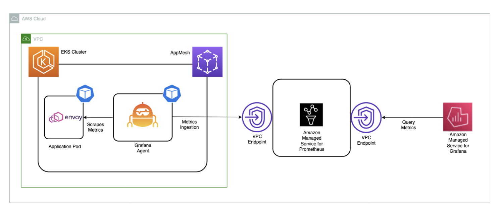

# EKS పై కాన్ఫిగర్ చేయబడిన App Mesh పరిసరాన్ని పర్యవేక్షించడానికి Amazon Managed Service for Prometheus ను ఉపయోగించడం

ఈ రెసిపీలో [Amazon Elastic Kubernetes Service](https://aws.amazon.com/eks/) (EKS) క్లస్టర్‌లోని [App Mesh](https://docs.aws.amazon.com/app-mesh/) Envoy మెట్రిక్స్‌ను [Amazon Managed Service for Prometheus](https://aws.amazon.com/prometheus/) (AMP) లోకి ఇంజెస్ట్ చేయడం మరియు మైక్రోసర్వీసుల ఆరోగ్యం మరియు పనితీరును పర్యవేక్షించడానికి [Amazon Managed Grafana](https://aws.amazon.com/grafana/) (AMG) లో కస్టమ్ డాష్‌బోర్డ్ సృష్టించడం ఎలాగో చూపిస్తాము.

అమలులో భాగంగా, AMP వర్క్‌స్పేస్ సృష్టిస్తాము, Kubernetes కోసం App Mesh Controller ను ఇన్‌స్టాల్ చేసి పాడ్‌లలో Envoy కంటైనర్‌ను ఇంజెక్ట్ చేస్తాము. EKS క్లస్టర్‌లో కాన్ఫిగర్ చేయబడిన [Grafana Agent](https://github.com/grafana/agent) ఉపయోగించి Envoy మెట్రిక్స్‌ను సేకరించి AMP కు వ్రాస్తాము. చివరగా, AMG వర్క్‌స్పేస్ సృష్టించి AMP ను datasource గా కాన్ఫిగర్ చేసి కస్టమ్ డాష్‌బోర్డ్ సృష్టిస్తాము.

:::note
    ఈ గైడ్ పూర్తి చేయడానికి సుమారు 45 నిమిషాలు పడుతుంది.
:::
## ఇన్‌ఫ్రాస్ట్రక్చర్
ఈ క్రింది విభాగంలో ఈ రెసిపీ కోసం ఇన్‌ఫ్రాస్ట్రక్చర్‌ను సెటప్ చేస్తాము.

### ఆర్కిటెక్చర్




Grafana agent AMP remote write ఎండ్‌పాయింట్ ద్వారా Envoy మెట్రిక్స్‌ను స్క్రేప్ చేసి AMP లోకి ఇంజెస్ట్ చేయడానికి కాన్ఫిగర్ చేయబడింది

:::info
    Prometheus Remote Write Exporter గురించి మరింత సమాచారం కోసం
    [AMP కోసం Prometheus Remote Write Exporter తో ప్రారంభించడం](https://aws-otel.github.io/docs/getting-started/prometheus-remote-write-exporter) చూడండి.
:::

### ముందస్తు అవసరాలు

* AWS CLI [ఇన్‌స్టాల్](https://docs.aws.amazon.com/cli/latest/userguide/cli-chap-install.html) చేయబడి మీ పరిసరంలో [కాన్ఫిగర్](https://docs.aws.amazon.com/cli/latest/userguide/cli-chap-configure.html) చేయబడి ఉండాలి.
* మీ పరిసరంలో [eksctl](https://docs.aws.amazon.com/eks/latest/userguide/eksctl.html) ఆదేశాన్ని ఇన్‌స్టాల్ చేయాలి.
* మీ పరిసరంలో [kubectl](https://docs.aws.amazon.com/eks/latest/userguide/install-kubectl.html) ఇన్‌స్టాల్ చేయాలి.
* మీ పరిసరంలో [Docker](https://docs.docker.com/get-docker/) ఇన్‌స్టాల్ చేయబడి ఉండాలి.
* మీ AWS ఖాతాలో AMP workspace కాన్ఫిగర్ చేయబడి ఉండాలి.
* [Helm](https://www.eksworkshop.com/beginner/060_helm/helm_intro/install/index.html) ఇన్‌స్టాల్ చేయాలి.
* [AWS-SSO](https://docs.aws.amazon.com/singlesignon/latest/userguide/step1.html) ఎనేబుల్ చేయాలి.

### EKS క్లస్టర్ సెటప్ చేయడం

ముందుగా, శాంపిల్ అప్లికేషన్ అమలు చేయడానికి App Mesh ఎనేబుల్ చేయబడిన EKS క్లస్టర్‌ను సృష్టించండి.
`eksctl` CLI [eks-cluster-config.yaml](./servicemesh-monitoring-ampamg/eks-cluster-config.yaml) ఉపయోగించి క్లస్టర్‌ను డిప్లాయ్ చేయడానికి ఉపయోగించబడుతుంది.
ఈ టెంప్లేట్ EKS తో కొత్త క్లస్టర్‌ను సృష్టిస్తుంది.

టెంప్లేట్ ఫైల్‌ను ఎడిట్ చేసి మీ రీజియన్‌ను AMP కోసం అందుబాటులో ఉన్న రీజియన్లలో ఒకదానికి సెట్ చేయండి:

* `us-east-1`
* `us-east-2`
* `us-west-2`
* `eu-central-1`
* `eu-west-1`

మీ సెషన్‌లో ఈ రీజియన్‌ను ఓవర్‌రైట్ చేయండి, ఉదాహరణకు Bash షెల్‌లో:

```
export AWS_REGION=eu-west-1
```

ఈ క్రింది ఆదేశం ఉపయోగించి మీ క్లస్టర్‌ను సృష్టించండి:

```
eksctl create cluster -f eks-cluster-config.yaml
```
ఇది `AMP-EKS-CLUSTER` అనే EKS క్లస్టర్ మరియు EKS కోసం App Mesh controller ఉపయోగించే `appmesh-controller` అనే service account ను సృష్టిస్తుంది.

### App Mesh Controller ఇన్‌స్టాల్ చేయడం

తర్వాత, [App Mesh Controller](https://docs.aws.amazon.com/app-mesh/latest/userguide/getting-started-kubernetes.html) ను ఇన్‌స్టాల్ చేసి Custom Resource Definitions (CRDs) కాన్ఫిగర్ చేయడానికి ఈ క్రింది ఆదేశాలను అమలు చేస్తాము:

```
helm repo add eks https://aws.github.io/eks-charts
```

```
helm upgrade -i appmesh-controller eks/appmesh-controller \
     --namespace appmesh-system \
     --set region=${AWS_REGION} \
     --set serviceAccount.create=false \
     --set serviceAccount.name=appmesh-controller
```

### AMP సెటప్ చేయడం
AMP workspace Envoy నుండి సేకరించిన Prometheus మెట్రిక్స్‌ను ఇంజెస్ట్ చేయడానికి ఉపయోగించబడుతుంది.
workspace అనేది ఒక tenant కు అంకితమైన లాజికల్ Cortex సర్వర్. workspace నిర్వహణ కోసం fine-grained access control ను మద్దతిస్తుంది, update, list, describe, మరియు delete వంటివి, అలాగే మెట్రిక్స్ యొక్క ingestion మరియు querying.

AWS CLI ఉపయోగించి workspace సృష్టించండి:

```
aws amp create-workspace --alias AMP-APPMESH --region $AWS_REGION
```

అవసరమైన Helm repositories జోడించండి:

```
helm repo add prometheus-community https://prometheus-community.github.io/helm-charts && \
helm repo add kube-state-metrics https://kubernetes.github.io/kube-state-metrics
```

AMP గురించి మరిన్ని వివరాలకు [AMP Getting started](https://docs.aws.amazon.com/prometheus/latest/userguide/AMP-getting-started.html) గైడ్ చూడండి.

### మెట్రిక్స్ స్క్రేపింగ్ & ఇంజెస్టింగ్

AMP Kubernetes క్లస్టర్‌లోని కంటైనర్‌డ్ వర్క్‌లోడ్‌ల నుండి ఆపరేషనల్ మెట్రిక్స్‌ను నేరుగా స్క్రేప్ చేయదు.
మీరు ఈ పనిని చేయడానికి Prometheus సర్వర్ లేదా OpenTelemetry agent ను డిప్లాయ్ చేసి నిర్వహించాలి, ఉదాహరణకు [AWS Distro for OpenTelemetry Collector](https://github.com/aws-observability/aws-otel-collector) లేదా Grafana Agent. ఈ రెసిపీలో, Envoy మెట్రిక్స్‌ను స్క్రేప్ చేయడానికి Grafana Agent ను కాన్ఫిగర్ చేయడం మరియు AMP మరియు AMG ఉపయోగించి వాటిని విశ్లేషించడం ప్రక్రియలో మీకు మార్గదర్శనం చేస్తాము.

#### Grafana Agent కాన్ఫిగర్ చేయడం

Grafana Agent పూర్తి Prometheus సర్వర్ అమలు చేయడానికి తేలికపాటి ప్రత్యామ్నాయం.
ఇది Prometheus exporters ను కనుగొనడానికి మరియు స్క్రేప్ చేయడానికి అవసరమైన భాగాలను మరియు Prometheus-అనుకూల backend కు మెట్రిక్స్ పంపడానికి ఉంచుతుంది. Grafana Agent AWS Identity and Access Management (IAM) ధృవీకరణ కోసం AWS Signature Version 4 (Sigv4) కు native support ను కూడా కలిగి ఉంది.

AMP కు Prometheus మెట్రిక్స్ పంపడానికి IAM role కాన్ఫిగర్ చేయడం ద్వారా దశలను అనుసరించండి.
EKS క్లస్టర్‌లో Grafana Agent ను ఇన్‌స్టాల్ చేసి AMP కు మెట్రిక్స్ ఫార్వర్డ్ చేస్తాము.

#### అనుమతులు కాన్ఫిగర్ చేయడం
Grafana Agent EKS క్లస్టర్‌లో అమలవుతున్న కంటైనర్‌డ్ వర్క్‌లోడ్‌ల నుండి ఆపరేషనల్ మెట్రిక్స్‌ను స్క్రేప్ చేసి AMP కు పంపుతుంది. AMP కు పంపిన డేటా managed service కోసం ప్రతి క్లయింట్ అభ్యర్థనను ధృవీకరించడానికి మరియు ఆథరైజ్ చేయడానికి Sigv4 ఉపయోగించి చెల్లుబాటు అయ్యే AWS క్రెడెన్షియల్స్‌తో సంతకం చేయాలి.

Grafana Agent ను Kubernetes service account యొక్క identity కింద అమలు చేయడానికి EKS క్లస్టర్‌కు డిప్లాయ్ చేయవచ్చు.
IAM roles for service accounts (IRSA) తో, మీరు Kubernetes service account తో IAM role ను అనుబంధించవచ్చు మరియు service account ఉపయోగించే ఏ pod కైనా IAM అనుమతులు అందించవచ్చు.

IRSA సెటప్‌ను ఈ విధంగా తయారు చేయండి:

```
kubectl create namespace grafana-agent

export WORKSPACE=$(aws amp list-workspaces | jq -r '.workspaces[] | select(.alias=="AMP-APPMESH").workspaceId')
export ROLE_ARN=$(aws iam get-role --role-name EKS-GrafanaAgent-AMP-ServiceAccount-Role --query Role.Arn --output text)
export NAMESPACE="grafana-agent"
export REMOTE_WRITE_URL="https://aps-workspaces.$AWS_REGION.amazonaws.com/workspaces/$WORKSPACE/api/v1/remote_write"
```

ఈ క్రింది దశలను ఆటోమేట్ చేయడానికి [gca-permissions.sh](./servicemesh-monitoring-ampamg/gca-permissions.sh) షెల్ స్క్రిప్ట్ ఉపయోగించవచ్చు (placeholder వేరియబుల్ `YOUR_EKS_CLUSTER_NAME` ను మీ EKS క్లస్టర్ పేరుతో భర్తీ చేయండి):

* AMP workspace లోకి remote-write చేయడానికి అనుమతులు కలిగిన IAM policy తో `EKS-GrafanaAgent-AMP-ServiceAccount-Role` అనే IAM role సృష్టిస్తుంది.
* IAM role తో అనుబంధమైన `grafana-agent` namespace కింద `grafana-agent` అనే Kubernetes service account సృష్టిస్తుంది.
* IAM role మరియు మీ Amazon EKS క్లస్టర్‌లో హోస్ట్ చేయబడిన OIDC provider మధ్య trust relationship సృష్టిస్తుంది.

`gca-permissions.sh` స్క్రిప్ట్ అమలు చేయడానికి `kubectl` మరియు `eksctl` CLI టూల్స్ అవసరం.
వాటిని మీ Amazon EKS క్లస్టర్‌ను యాక్సెస్ చేయడానికి కాన్ఫిగర్ చేయాలి.

ఇప్పుడు Envoy మెట్రిక్స్‌ను extract చేయడానికి scrape కాన్ఫిగరేషన్‌తో manifest ఫైల్ [grafana-agent.yaml](./servicemesh-monitoring-ampamg/grafana-agent.yaml) సృష్టించి Grafana Agent ను డిప్లాయ్ చేయండి.

:::note
    వ్రాసే సమయంలో, daemon sets కు మద్దతు లేకపోవడం వల్ల
    ఈ సొల్యూషన్ Fargate పై EKS కు పని చేయదు.
:::
ఈ ఉదాహరణ `grafana-agent` అనే daemon set ను మరియు `grafana-agent-deployment` అనే deployment ను డిప్లాయ్ చేస్తుంది. `grafana-agent` daemon set క్లస్టర్‌లోని pods నుండి మెట్రిక్స్ సేకరిస్తుంది మరియు `grafana-agent-deployment` deployment EKS control plane వంటి క్లస్టర్‌లో లేని services నుండి మెట్రిక్స్ సేకరిస్తుంది.

```
kubectl apply -f grafana-agent.yaml
```
`grafana-agent` డిప్లాయ్ అయిన తర్వాత, ఇది మెట్రిక్స్‌ను సేకరించి నిర్దిష్ట AMP workspace లోకి ఇంజెస్ట్ చేస్తుంది. ఇప్పుడు EKS క్లస్టర్‌లో శాంపిల్ అప్లికేషన్ డిప్లాయ్ చేసి మెట్రిక్స్ విశ్లేషించడం ప్రారంభించండి.

## శాంపిల్ అప్లికేషన్

అప్లికేషన్ ఇన్‌స్టాల్ చేయడానికి మరియు Envoy కంటైనర్‌ను ఇంజెక్ట్ చేయడానికి, Kubernetes కోసం AppMesh controller ను ఉపయోగిస్తాము.

ముందుగా, examples repo clone చేయడం ద్వారా base application ను ఇన్‌స్టాల్ చేయండి:

```
git clone https://github.com/aws/aws-app-mesh-examples.git
```

మరియు ఇప్పుడు మీ క్లస్టర్‌కు resources apply చేయండి:

```
kubectl apply -f aws-app-mesh-examples/examples/apps/djapp/1_base_application
```

pod status చెక్ చేసి ఇది running లో ఉందని నిర్ధారించండి:

```
$ kubectl -n prod get all

NAME                            READY   STATUS    RESTARTS   AGE
pod/dj-cb77484d7-gx9vk          1/1     Running   0          6m8s
pod/jazz-v1-6b6b6dd4fc-xxj9s    1/1     Running   0          6m8s
pod/metal-v1-584b9ccd88-kj7kf   1/1     Running   0          6m8s
```

తర్వాత, App Mesh controller ఇన్‌స్టాల్ చేసి deployment ను meshify చేయండి:

```
kubectl apply -f aws-app-mesh-examples/examples/apps/djapp/2_meshed_application/
kubectl rollout restart deployment -n prod dj jazz-v1 metal-v1
```

ఇప్పుడు ప్రతి pod లో రెండు కంటైనర్లు running లో ఉండాలి:

```
$ kubectl -n prod get all
NAME                        READY   STATUS    RESTARTS   AGE
dj-7948b69dff-z6djf         2/2     Running   0          57s
jazz-v1-7cdc4fc4fc-wzc5d    2/2     Running   0          57s
metal-v1-7f499bb988-qtx7k   2/2     Running   0          57s
```

5 నిమిషాల పాటు ట్రాఫిక్ జనరేట్ చేయండి, తర్వాత దాన్ని AMG లో విజువలైజ్ చేస్తాము:

```
dj_pod=`kubectl get pod -n prod --no-headers -l app=dj -o jsonpath='{.items[*].metadata.name}'`

loop_counter=0
while [ $loop_counter -le 300 ] ; do \
kubectl exec -n prod -it $dj_pod  -c dj \
-- curl jazz.prod.svc.cluster.local:9080 ; echo ; loop_counter=$[$loop_counter+1] ; \
done
```

### AMG వర్క్‌స్పేస్ సృష్టించడం

AMG వర్క్‌స్పేస్ సృష్టించడానికి [Getting Started with AMG](https://aws.amazon.com/blogs/mt/amazon-managed-grafana-getting-started/) బ్లాగ్ పోస్ట్‌లోని దశలను అనుసరించండి.
డాష్‌బోర్డ్‌కు యూజర్ యాక్సెస్ మంజూరు చేయడానికి, మీరు AWS SSO ను ఎనేబుల్ చేయాలి. వర్క్‌స్పేస్ సృష్టించిన తర్వాత, మీరు వ్యక్తిగత యూజర్ లేదా యూజర్ గ్రూప్‌కు Grafana వర్క్‌స్పేస్‌కు యాక్సెస్ అసైన్ చేయవచ్చు.
డిఫాల్ట్‌గా, యూజర్ viewer రకం. యూజర్ role ఆధారంగా యూజర్ రకాన్ని మార్చండి. AMP workspace ను data source గా జోడించి డాష్‌బోర్డ్ సృష్టించడం ప్రారంభించండి.

ఈ ఉదాహరణలో, యూజర్ పేరు `grafana-admin` మరియు యూజర్ రకం `Admin`.
అవసరమైన data source ఎంచుకోండి. కాన్ఫిగరేషన్‌ను సమీక్షించి `Create workspace` ఎంచుకోండి.


### AMG datasource కాన్ఫిగర్ చేయడం
AMG లో AMP ను data source గా కాన్ఫిగర్ చేయడానికి, `Data sources` విభాగంలో, `Configure in Grafana` ఎంచుకోండి, ఇది బ్రౌజర్‌లో Grafana workspace ను ప్రారంభిస్తుంది.
మీరు బ్రౌజర్‌లో Grafana workspace URL ను మాన్యువల్‌గా కూడా ప్రారంభించవచ్చు.


స్క్రీన్‌షాట్‌ల నుండి చూడగలిగినట్లుగా, downstream latency, connections, response code మరియు మరిన్ని వంటి Envoy మెట్రిక్స్‌ను చూడవచ్చు. నిర్దిష్ట అప్లికేషన్ యొక్క envoy మెట్రిక్స్‌ను drill down చేయడానికి చూపబడిన filters ఉపయోగించవచ్చు.

### AMG డాష్‌బోర్డ్ కాన్ఫిగర్ చేయడం

data source కాన్ఫిగర్ అయిన తర్వాత, Envoy మెట్రిక్స్ విశ్లేషించడానికి కస్టమ్ డాష్‌బోర్డ్ ఇంపోర్ట్ చేయండి.
దీని కోసం ముందుగా నిర్వచించిన డాష్‌బోర్డ్ ఉపయోగిస్తాము, కాబట్టి `Import` (క్రింద చూపబడింది) ఎంచుకోండి, ఆపై ID `11022` ను నమోదు చేయండి. ఇది Envoy Global డాష్‌బోర్డ్‌ను ఇంపోర్ట్ చేస్తుంది, తద్వారా మీరు Envoy మెట్రిక్స్ విశ్లేషించడం ప్రారంభించవచ్చు.


### AMG లో alerts కాన్ఫిగర్ చేయడం
మెట్రిక్ ఉద్దేశించిన threshold కంటే ఎక్కువగా పెరిగినప్పుడు మీరు Grafana alerts కాన్ఫిగర్ చేయవచ్చు.
AMG తో, డాష్‌బోర్డ్‌లో alert ఎంత తరచుగా evaluate చేయాలో కాన్ఫిగర్ చేసి notification పంపవచ్చు.
alert rules సృష్టించడానికి ముందు, మీరు notification channel సృష్టించాలి.

ఈ ఉదాహరణలో, Amazon SNS ను notification channel గా కాన్ఫిగర్ చేయండి. మీరు defaults ఉపయోగిస్తే, అంటే [service-managed permissions](https://docs.aws.amazon.com/grafana/latest/userguide/AMG-manage-permissions.html#AMG-service-managed-account), notifications విజయవంతంగా topic కు publish అవ్వడానికి SNS topic `grafana` తో prefix అయి ఉండాలి.

`grafana-notification` అనే SNS topic సృష్టించడానికి ఈ క్రింది ఆదేశం ఉపయోగించండి:

```
aws sns create-topic --name grafana-notification
```

email address ద్వారా subscribe అవ్వండి. క్రింది ఆదేశంలో region మరియు Account ID ను నిర్దిష్టంగా పేర్కొనండి:

```
aws sns subscribe \
    --topic-arn arn:aws:sns:<region>:<account-id>:grafana-notification \
	--protocol email \
	--notification-endpoint <email-id>
```

ఇప్పుడు, Grafana డాష్‌బోర్డ్ నుండి కొత్త notification channel జోడించండి.
grafana-notification అనే కొత్త notification channel కాన్ఫిగర్ చేయండి. Type కోసం, drop down నుండి AWS SNS ఉపయోగించండి. Topic కోసం, మీరు ఇప్పుడే సృష్టించిన SNS topic ARN ఉపయోగించండి.
Auth provider కోసం, AWS SDK Default ఎంచుకోండి.


ఇప్పుడు downstream latency ఒక నిమిషంలో ఐదు మిల్లీసెకన్లను మించితే alert కాన్ఫిగర్ చేయండి.
డాష్‌బోర్డ్‌లో, dropdown నుండి Downstream latency ఎంచుకోండి, ఆపై Edit ఎంచుకోండి.
graph panel యొక్క Alert ట్యాబ్‌లో, alert rule ఎంత తరచుగా evaluate చేయాలో మరియు alert దాని స్థితిని మార్చి notifications ప్రారంభించడానికి ఏ షరతులు నెరవేర్చాలో కాన్ఫిగర్ చేయండి.

ఈ క్రింది కాన్ఫిగరేషన్‌లో, downstream latency threshold ను మించితే alert సృష్టించబడుతుంది మరియు కాన్ఫిగర్ చేయబడిన grafana-alert-notification channel ద్వారా SNS topic కు notification పంపబడుతుంది.


## క్లీనప్

1. రిసోర్సులు మరియు క్లస్టర్‌ను తొలగించండి:
```
kubectl delete all --all
eksctl delete cluster --name AMP-EKS-CLUSTER
```
2. AMP workspace ను తొలగించండి:
```
aws amp delete-workspace --workspace-id `aws amp list-workspaces --alias prometheus-sample-app --query 'workspaces[0].workspaceId' --output text`
```
3. amp-iamproxy-ingest-role IAM role ను తొలగించండి:
```
aws delete-role --role-name amp-iamproxy-ingest-role
```
4. కన్సోల్ నుండి AMG workspace ను తొలగించండి.
