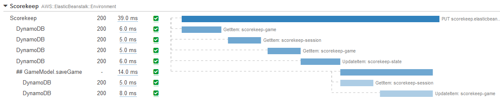

# ట్రేసెస్

ట్రేసెస్ అనేవి అభ్యర్థనలు అప్లికేషన్ యొక్క వివిధ భాగాల ద్వారా ప్రయాణించేటప్పుడు వాటి మొత్తం ప్రయాణాన్ని ప్రాతినిధ్యం వహిస్తాయి.

లాగ్‌లు లేదా మెట్రిక్స్ వలె కాకుండా, *ట్రేసెస్* ఒకటి కంటే ఎక్కువ అప్లికేషన్ లేదా సేవ నుండి ఈవెంట్‌లతో కూడి ఉంటాయి, మరియు రెస్పాన్స్ లేటెన్సీ, సేవా లోపాలు, రిక్వెస్ట్ పారామీటర్లు, మరియు మెటాడేటా వంటి సేవల మధ్య కనెక్షన్ గురించి సందర్భంతో ఉంటాయి.

:::tip
    [లాగ్‌లు](./logs.md) మరియు ట్రేసెస్ మధ్య భావనాత్మక సారూప్యత ఉంది, అయితే ట్రేస్ క్రాస్-సేవ సందర్భంలో పరిగణించబడాలని ఉద్దేశించబడింది, అయితే లాగ్‌లు సాధారణంగా ఒక సేవ లేదా అప్లికేషన్ అమలుకు పరిమితం.
::::::tip
నేటి డెవలపర్లు మాడ్యులర్ మరియు డిస్ట్రిబ్యూటెడ్ అప్లికేషన్‌లను నిర్మించడం వైపు మొగ్గు చూపుతున్నారు. కొందరు వీటిని [Service Oriented Architecture](https://en.wikipedia.org/wiki/Service-oriented_architecture) అని పిలుస్తారు, మరికొందరు వాటిని [microservices](https://aws.amazon.com/microservices/) అని సూచిస్తారు. పేరుతో సంబంధం లేకుండా, ఈ వదులుగా కపుల్డ్ అప్లికేషన్‌లలో ఏదైనా తప్పు జరిగినప్పుడు, ఒక సంఘటన యొక్క మూల కారణాన్ని ట్రాక్ చేయడానికి కేవలం లాగ్‌లు లేదా ఈవెంట్‌లను చూడటం సరిపోకపోవచ్చు. రిక్వెస్ట్ ఫ్లో లోకి పూర్తి దృశ్యమానత కలిగి ఉండటం అవసరం మరియు ట్రేసెస్ ఇక్కడ విలువను జోడిస్తాయి. ఎండ్-టు-ఎండ్ రిక్వెస్ట్ ఫ్లోను చిత్రీకరించే కారణాత్మకంగా సంబంధిత ఈవెంట్‌ల శ్రేణి ద్వారా, ట్రేసెస్ మీకు ఆ దృశ్యమానతను పొందడంలో సహాయపడతాయి.

ట్రేసెస్ observability యొక్క ఒక ముఖ్యమైన స్తంభం ఎందుకంటే అవి సిస్టమ్‌లోకి రిక్వెస్ట్ వచ్చి వెళ్ళేటప్పుడు దాని ఫ్లో గురించి ప్రాథమిక సమాచారాన్ని అందిస్తాయి.

:::tip
    ట్రేసెస్ కోసం సాధారణ ఉపయోగ సందర్భాలలో పనితీరు ప్రొఫైలింగ్, ప్రొడక్షన్ సమస్యల డీబగ్గింగ్, మరియు వైఫల్యాల మూల కారణ విశ్లేషణ ఉన్నాయి.
:::
## మీ అన్ని ఇంటిగ్రేషన్ పాయింట్‌లను ఇన్‌స్ట్రుమెంట్ చేయండి

మీ మొత్తం వర్క్‌లోడ్ ఫంక్షనాలిటీ మరియు కోడ్ ఒక చోట ఉన్నప్పుడు, ఒక రిక్వెస్ట్ వివిధ ఫంక్షన్‌ల అంతటా ఎలా పంపబడుతుందో చూడటానికి సోర్స్ కోడ్‌ను చూడటం సులభం. సిస్టమ్ స్థాయిలో మీకు యాప్ ఏ మెషీన్‌లో రన్ అవుతుందో తెలుసు మరియు ఏదైనా తప్పు జరిగితే, మీరు మూల కారణాన్ని త్వరగా కనుగొనగలరు. microservices-ఆధారిత ఆర్కిటెక్చర్‌లో అదే చేయడం ఊహించండి, ఇక్కడ వివిధ భాగాలు వదులుగా కపుల్డ్ మరియు డిస్ట్రిబ్యూటెడ్ ఎన్విరాన్‌మెంట్‌లో రన్ అవుతున్నాయి. ప్రతి ఇంటర్‌కనెక్టెడ్ రిక్వెస్ట్ నుండి వాటి లాగ్‌లను చూడటానికి అనేక సిస్టమ్‌లలోకి లాగిన్ అవడం అసాధ్యం కాకపోయినా, ఆచరణాత్మకం కాదు.

ఇక్కడ observability సహాయపడగలదు. ఇన్‌స్ట్రుమెంటేషన్ ఆ observability ని పెంచడంలో ఒక కీలక దశ. విస్తృత పరంగా ఇన్‌స్ట్రుమెంటేషన్ అనేది కోడ్ ఉపయోగించి మీ అప్లికేషన్‌లో ఈవెంట్‌లను కొలవడం.

సాధారణ ఇన్‌స్ట్రుమెంటేషన్ విధానం ఏమిటంటే సిస్టమ్‌లోకి ప్రవేశించే ప్రతి రిక్వెస్ట్‌కు ఒక ప్రత్యేక ట్రేస్ ఐడెంటిఫైయర్‌ను కేటాయించి, అది వివిధ భాగాల ద్వారా వెళ్ళేటప్పుడు ఆ ట్రేస్ id ను అదనపు మెటాడేటాను జోడిస్తూ తీసుకెళ్ళడం.

:::info
    ఒక సేవ నుండి మరొక సేవకు ప్రతి కనెక్షన్ కేంద్ర కలెక్టర్‌కు ట్రేసెస్ ఎమిట్ చేయడానికి ఇన్‌స్ట్రుమెంట్ చేయబడాలి. ఈ విధానం మీ వర్క్‌లోడ్ యొక్క అపారదర్శక అంశాలలోకి చూడడంలో మీకు సహాయపడుతుంది.
:::
:::info
    auto-instrumentation ఏజెంట్ లేదా లైబ్రరీని ఉపయోగిస్తున్నప్పుడు మీ అప్లికేషన్‌ను ఇన్‌స్ట్రుమెంట్ చేయడం ఎక్కువగా ఆటోమేటెడ్ ప్రాసెస్ కావచ్చు.
:::

## ట్రాన్సాక్షన్ సమయం మరియు స్థితి ముఖ్యం, కాబట్టి దాన్ని కొలవండి!

బాగా ఇన్‌స్ట్రుమెంట్ చేయబడిన అప్లికేషన్ ఎండ్ టు ఎండ్ ట్రేస్‌ను ఉత్పత్తి చేయగలదు, దీన్ని ఇలాంటి వాటర్‌ఫాల్ గ్రాఫ్‌గా చూడవచ్చు:

లేదా సర్వీస్ మ్యాప్:

ప్రతి ఇంటరాక్షన్‌కు ట్రాన్సాక్షన్ సమయాలు మరియు రెస్పాన్స్ కోడ్‌లను కొలవడం ముఖ్యం. ఇది మొత్తం ప్రాసెసింగ్ సమయాలను లెక్కించడంలో మరియు మీ SLAs, SLOs, లేదా బిజినెస్ KPIs తో సమ్మతిని ట్రాక్ చేయడంలో సహాయపడుతుంది.

:::info
    మీ ఇంటరాక్షన్‌ల రెస్పాన్స్ సమయాలు మరియు స్టేటస్ కోడ్‌లను అర్థం చేసుకోవడం మరియు రికార్డ్ చేయడం ద్వారా మాత్రమే మీరు మొత్తం రిక్వెస్ట్ ప్యాటర్న్‌లు మరియు వర్క్‌లోడ్ ఆరోగ్యానికి దోహదపడే కారకాలను చూడగలరు.
:::
## మెటాడేటా, ఆనోటేషన్‌లు, మరియు లేబుల్‌లు మీ మంచి మిత్రులు

ట్రేసెస్ నిల్వ చేయబడతాయి మరియు ప్రత్యేక ID కేటాయించబడుతుంది, ప్రతి ట్రేస్ రిక్వెస్ట్ మార్గంలోని ప్రతి దశను రికార్డ్ చేసే *spans* లేదా *segments* (మీ టూలింగ్ ఆధారంగా) గా విభజించబడుతుంది. ఒక span ట్రేస్ ఇంటరాక్ట్ చేసే ఎంటిటీలను సూచిస్తుంది, మరియు, పేరెంట్ ట్రేస్ వలె, ప్రతి span కు ప్రత్యేక ID మరియు టైమ్ స్టాంప్ కేటాయించబడుతుంది మరియు అదనపు డేటా మరియు మెటాడేటాను కూడా కలిగి ఉండవచ్చు. ఈ సమాచారం డీబగ్గింగ్‌కు ఉపయోగకరం ఎందుకంటే ఇది సమస్య సంభవించిన ఖచ్చితమైన సమయం మరియు స్థానాన్ని మీకు అందిస్తుంది.

ఒక ఆచరణాత్మక ఉదాహరణ ద్వారా ఇది బాగా వివరించబడుతుంది. ఒక ఈ-కామర్స్ అప్లికేషన్ అనేక డొమైన్‌లుగా విభజించబడవచ్చు: authentication, authorization, shipping, inventory, payment processing, fulfillment, product search, recommendations, మరియు మరిన్ని. ఈ అన్ని ఇంటర్‌కనెక్టెడ్ డొమైన్‌ల నుండి ట్రేసెస్ ద్వారా శోధించే బదులు, మీ ట్రేస్‌ను కస్టమర్ ID తో లేబుల్ చేయడం ద్వారా ఈ ఒక వ్యక్తికి నిర్దిష్టమైన ఇంటరాక్షన్‌ల కోసం మాత్రమే శోధించవచ్చు. ఒక ఆపరేషనల్ సమస్యను నిర్ధారించేటప్పుడు ఇది మీ శోధనను తక్షణమే తగ్గించడంలో సహాయపడుతుంది.

:::info
    నామకరణ సంప్రదాయం విక్రేతల మధ్య భిన్నంగా ఉండవచ్చు, ప్రతి ట్రేస్ మెటాడేటా, లేబుల్‌లు, లేదా ఆనోటేషన్‌లతో సవరించబడవచ్చు, మరియు ఇవి మీ మొత్తం వర్క్‌లోడ్ అంతటా శోధించదగినవి. వాటిని జోడించడానికి మీ వైపు కోడ్ అవసరం, కానీ మీ వర్క్‌లోడ్ యొక్క observability ని గొప్పగా పెంచుతుంది.
:::
:::warning
    ట్రేసెస్ లాగ్‌లు కావు, కాబట్టి మీ ట్రేసెస్‌లో ఏ మెటాడేటా చేర్చుతారో పొదుపుగా ఉండండి. మరియు ట్రేస్ డేటా ఫోరెన్సిక్స్ మరియు ఆడిటింగ్ కోసం ఉద్దేశించబడలేదు, అధిక శాంపిల్ రేట్‌తో కూడా.
:::
