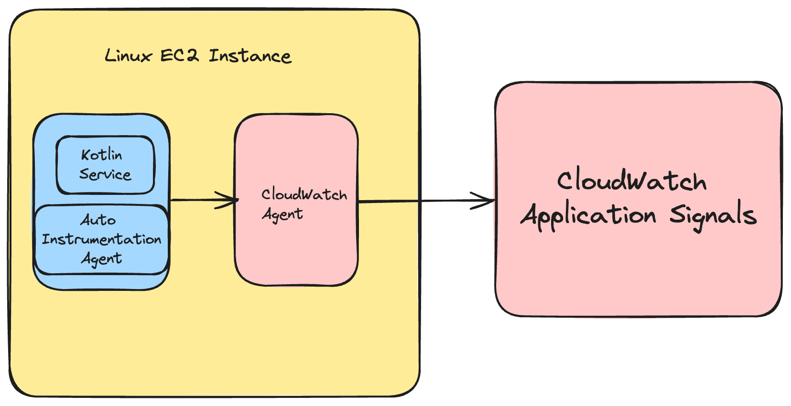
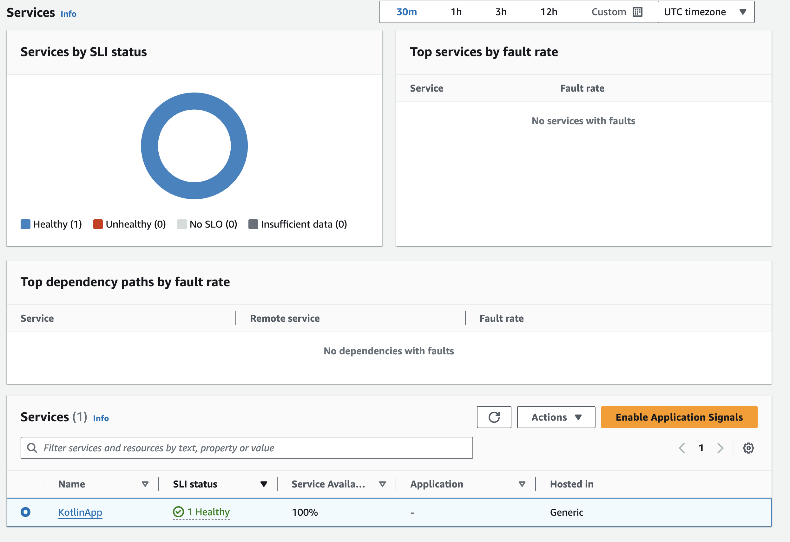

# Kotlin సేవల కోసం Application Signals

## పరిచయం

Kotlin వెబ్ అప్లికేషన్ల పనితీరు మరియు ఆరోగ్యాన్ని మానిటర్ చేయడం వివిధ కాంపోనెంట్ల మధ్య సంక్లిష్ట పరస్పర చర్యల కారణంగా సవాలుగా ఉంటుంది. [Kotlin](https://kotlinlang.org/) వెబ్ సేవలు సాధారణంగా Java Archive (jar) ఫైళ్లలో బిల్డ్ చేయబడతాయి, వీటిని Java రన్ చేసే ఏదైనా ప్లాట్‌ఫారమ్‌పై డిప్లాయ్ చేయవచ్చు. ఈ అప్లికేషన్లు తరచుగా డేటాబేస్‌లు, ఎక్స్‌టర్నల్ APIs మరియు క్యాషింగ్ లేయర్‌లు వంటి బహుళ ఇంటర్‌కనెక్టెడ్ కాంపోనెంట్‌లతో కూడిన డిస్ట్రిబ్యూటెడ్ ఎన్విరాన్‌మెంట్‌లలో పనిచేస్తాయి. ఈ సంక్లిష్టత మీ Mean Time to Resolution (MTTR) ని గణనీయంగా పెంచుతుంది.

ఈ గైడ్‌లో, Linux EC2 సర్వర్‌పై రన్ అవుతున్న Kotlin వెబ్ సేవలను ఆటో-ఇన్‌స్ట్రుమెంట్ చేయడం ఎలాగో మేము ప్రదర్శిస్తాము. [CloudWatch Application Signals](https://docs.aws.amazon.com/AmazonCloudWatch/latest/monitoring/CloudWatch-Application-Monitoring-Sections.html) ను ఎనేబుల్ చేయడం వల్ల [AWS Distro for OpenTelemetry](https://aws-otel.github.io/docs/introduction) (ADOT) Java Auto-Instrumentation Agent ఉపయోగించి మీ అప్లికేషన్ల నుండి ఎలాంటి కోడ్ మార్పులు చేయకుండా మెట్రిక్స్ మరియు ట్రేసెస్ సేకరించడానికి అనుమతిస్తుంది. మీ అప్లికేషన్ సేవల ప్రస్తుత ఆపరేషనల్ ఆరోగ్యాన్ని త్వరగా చూడటానికి మరియు ట్రైయేజ్ చేయడానికి మరియు అవి దీర్ఘకాలిక పనితీరు మరియు వ్యాపార లక్ష్యాలను చేరుకుంటున్నాయా అని ధృవీకరించడానికి కాల్ వాల్యూమ్, అందుబాటు, లేటెన్సీ, ఫాల్ట్‌లు మరియు ఎర్రర్‌లు వంటి కీ మెట్రిక్స్‌ను మీరు ఉపయోగించుకోవచ్చు.

## ముందస్తు అవసరాలు

- CloudWatch Application Signals తో ఇంటరాక్ట్ చేయడానికి సరైన [IAM అనుమతులు](https://docs.aws.amazon.com/AmazonCloudWatch/latest/monitoring/Application_Signals_Permissions.html) ఉన్న linux EC2 ఇన్‌స్టాన్స్. ఈ గైడ్ దీని కోసం [Amazon Linux](https://aws.amazon.com/linux/amazon-linux-2023/) ఇన్‌స్టాన్స్‌ను ఉపయోగిస్తుంది, కాబట్టి మీరు వేరే దాన్ని ఉపయోగిస్తుంటే మీ కమాండ్‌లు కొద్దిగా భిన్నంగా ఉండవచ్చు.
- ఇన్‌స్టాన్స్‌లోకి [SSH](https://docs.aws.amazon.com/AWSEC2/latest/UserGuide/connect-linux-inst-ssh.html) చేయగల సామర్థ్యం.

## సొల్యూషన్ ఓవర్‌వ్యూ

ఉన్నత స్థాయిలో, మనం నిర్వహించే దశలు ఈ క్రింది విధంగా ఉంటాయి.

- CloudWatch Application Signals ను ఎనేబుల్ చేయండి.
- [ktor వెబ్ సేవ](https://ktor.io/) ను fat jar లో డిప్లాయ్ చేయండి.
- వెబ్ సేవ నుండి Application Signals అందుకునేలా కాన్ఫిగర్ చేయబడిన CloudWatch agent ను ఇన్‌స్టాల్ చేయండి.
- [ADOT](https://aws-otel.github.io/docs/getting-started/java-sdk/auto-instr#introduction) Auto Instrumentation Agent ని డౌన్‌లోడ్ చేయండి.
- సేవను ఆటో-ఇన్‌స్ట్రుమెంట్ చేయడానికి java agent తో పాటు మా kotlin సేవ jar ని రన్ చేయండి.
- టెలిమెట్రీ జనరేట్ చేయడానికి కొన్ని టెస్ట్‌లు రన్ చేయండి.

### ఆర్కిటెక్చర్ డయాగ్రామ్



### CloudWatch Application Signals ను ఎనేబుల్ చేయండి

స్టెప్ 1 లోని సూచనలను అనుసరించండి: మీ ఖాతాలో [Application Signals ని ఎనేబుల్ చేయండి](https://docs.aws.amazon.com/AmazonCloudWatch/latest/monitoring/CloudWatch-Application-Signals-Enable-EC2.html#CloudWatch-Application-Signals-EC2-Grant).

### Ktor వెబ్ సేవను డిప్లాయ్ చేయండి
[Ktor](https://ktor.io/) వెబ్ సేవలను సృష్టించడానికి ఒక ప్రసిద్ధ kotlin ఫ్రేమ్‌వర్క్. ఇది అసింక్రోనస్ సర్వర్-సైడ్ అప్లికేషన్లతో త్వరగా ప్రారంభించడానికి మిమ్మల్ని అనుమతిస్తుంది.

వర్కింగ్ డైరెక్టరీ క్రియేట్ చేయండి
```
mkdir kotlin-signals && cd kotlin-signals
```

Ktor examples repo ను క్లోన్ చేయండి
```
git clone https://github.com/ktorio/ktor-samples.git && cd ktor-samples/structured-logging
```

అప్లికేషన్‌ను బిల్డ్ చేయండి
```
./gradlew build && cd build/libs
```

అప్లికేషన్ రన్ అవుతుందో టెస్ట్ చేయండి
```
java -jar structured-logging-all.jar
```

సేవ సరిగ్గా బిల్డ్ అయి రన్ అయినట్లయితే, మనం ఇప్పుడు `ctrl + c` తో ఆపేయవచ్చు

### CloudWatch Agent ను కాన్ఫిగర్ చేయండి
Amazon Linux ఇన్‌స్టాన్స్‌లలో CloudWatch agent డిఫాల్ట్‌గా ఇన్‌స్టాల్ చేయబడి ఉంటుంది. మీ ఇన్‌స్టాన్స్‌లో లేకపోతే, మీరు దాన్ని [ఇన్‌స్టాల్](https://docs.aws.amazon.com/AmazonCloudWatch/latest/monitoring/install-CloudWatch-Agent-on-EC2-Instance.html) చేయాల్సి ఉంటుంది.

ఇన్‌స్టాల్ అయిన తర్వాత, మనం ఇప్పుడు కాన్ఫిగరేషన్ ఫైల్ క్రియేట్ చేయవచ్చు.
```
sudo nano /opt/aws/amazon-cloudwatch-agent/bin/app-signals-config.json
```

కింది కాన్ఫిగరేషన్‌ను ఫైల్‌లో కాపీ మరియు పేస్ట్ చేయండి
```
{
    "traces": {
        "traces_collected": {
            "app_signals": {}
        }
    },
    "logs": {
        "metrics_collected": {
            "app_signals": {}
        }
    }
}
```

ఫైల్‌ను సేవ్ చేసి, మనం ఇప్పుడే క్రియేట్ చేసిన config తో CloudWatch agent ను ప్రారంభించండి
```
sudo /opt/aws/amazon-cloudwatch-agent/bin/amazon-cloudwatch-agent-ctl -a fetch-config -m ec2 -s -c file:/opt/aws/amazon-cloudwatch-agent/bin/app-signals-config.json
```

### ADOT Auto Instrumentation Agent ని డౌన్‌లోడ్ చేయండి

మీ jar ఫైల్ ఉన్న డైరెక్టరీకి నావిగేట్ చేయండి, ఈ ప్రదర్శన కోసం సులభంగా ఉండేలా మేము agent ను ఇక్కడ ఉంచుతాము. నిజమైన సెనారియోలో ఇది దాని స్వంత ఫోల్డర్‌లో ఉంటుంది.

```
cd kotlin-signals/ktor-samples/structured-logging/build/libs
```

Auto Instrumentation Agent ని డౌన్‌లోడ్ చేయండి
```
wget https://github.com/aws-observability/aws-otel-java-instrumentation/releases/latest/download/aws-opentelemetry-agent.jar
```

### మీ Ktor సేవను ADOT agent తో రన్ చేయండి
```
OTEL_RESOURCE_ATTRIBUTES=service.name=KotlinApp,service.namespace=MyKotlinService,aws.hostedin.environment=EC2 \
OTEL_AWS_APPLICATION_SIGNALS_ENABLED=true \
OTEL_AWS_APPLICATION_SIGNALS_EXPORTER_ENDPOINT=http://localhost:4316/v1/metrics \
OTEL_EXPORTER_OTLP_PROTOCOL=http/protobuf \
OTEL_EXPORTER_OTLP_TRACES_ENDPOINT=http://localhost:4316/v1/traces \
OTEL_METRICS_EXPORTER=none \
OTEL_LOGS_EXPORT=none \
java -javaagent:aws-opentelemetry-agent.jar -jar structured-logging-all.jar
```

### టెలిమెట్రీ క్రియేట్ చేయడానికి సేవకు ట్రాఫిక్ జనరేట్ చేయండి
```
for i in {1..1800}; do curl http://localhost:8080 && sleep 2; done
```

## మీ టెలిమెట్రీని రివ్యూ చేయండి

మీరు ఇప్పుడు CloudWatch యొక్క 'Services' సెక్షన్‌లో Kotlin సేవ కనిపించడాన్ని చూడగలరు



మీరు 'Service Map' లో కూడా మా సేవను చూడవచ్చు


ఇన్‌స్ట్రుమెంటేషన్ Latency వంటి విలువైన మెట్రిక్స్‌ను అందిస్తుంది:


### తదుపరి దశలు

ఇక్కడ నుండి మీ తదుపరి దశలు మీ సేవ కోసం [SLOs](https://docs.aws.amazon.com/AmazonCloudWatch/latest/monitoring/CloudWatch-ServiceLevelObjectives.html) క్రియేట్ చేయడం సహా [Application Signals అనుభవాన్ని](https://docs.aws.amazon.com/AmazonCloudWatch/latest/monitoring/CloudWatch-Application-Monitoring-Sections.html) మరింత అన్వేషించడం. మరొక మంచి తదుపరి దశ ఏమిటంటే మరింత సంక్లిష్ట బ్యాకెండ్ ఏర్పాటు చేయడం ప్రారంభించడానికి Ktor లో మరిన్ని kotlin మైక్రోసర్వీసులను క్రియేట్ చేయడం. Application Signals వంటి సాధనంలో మీరు అత్యధిక ప్రయోజనం చూసేది డిస్ట్రిబ్యూటెడ్, సంక్లిష్ట ఎన్విరాన్‌మెంట్లలో.

### క్లీనప్

మీ EC2 ఇన్‌స్టాన్స్‌ను టెర్మినేట్ చేసి `/aws/appsignals/generic` లాగ్ గ్రూప్‌ను డిలీట్ చేయండి.
